## 图形推理
### 经典真题一(70%)

|  错误类型   | 统计次数  |
|  ----  | ----  |
| 没想到还有整体顺时针移动，以及整体的黑色部分顺时针移动  | 1 |
| 对文段的翻译没有思维，比如：抓住定义中的关键词。(1)归谬法其实就是假定命题正确，(2)然后推出错误的结论，从而否定命题的错误。 | 1 |
| 种类和数量，可能1,1,2,1,1，3,1,1,2,1,1,3循环 | 1 |
| 种类和数量，可能1,1,2,1,1，3,1,1,2,1,1,3循环 | 1 |


- 没想到还有整体顺时针移动，以及整体的黑色部分顺时针移动 


```

```
### 经典真题二(70%)
### 经典真题三70%)
### 经典真题四(70%)
## 定义判断

|  错误类型   | 统计次数  |
|  ----  | ----  |
| 要把定义，一个一个列出来对比。  | 1 |
| 要把选项一个一个分别找出，对用哪个关系词。不要到D就不看了  | 1 |
| 觉得对比题目123信息，不能从选项从下往上对比，而是应该把题目1，2，3分别带着目的在选项里面找，这样才不容易被蒙蔽  | 5|
| 觉这道题错，是因为我没有对着题目信息123，结合选项一个一个看，是否都符合.不同商品，商务车和网约车是两种商品  | |
| 觉这道题错，是因为对题目的给定的主体，根本没好好对应，因为人的主观精神（如目的、意志、感觉、经验、心灵等）括号里面的才是最重要的，你可以拿出括号里面比对选项，它是否是本源  | |
| 说找特色那就去找特色，特色最重要没，双管齐下，也没有凸出特色的不要选。不要脑补。  | |
| 说找广和深那就去找。并且看清楚C本来这个人就是从事数学经济学，急需要数学也需要经济。不算深，也没有凸出特色的不要选。不要脑补。  | |
| 错是因为选项设置坑了，选项里面有不明确选项。不确定故意丢失电子地图，满足了电子设备要求，也满足了欺骗地方电子侦查要求。| 1 |
| 脑补过多，购买就是购买了，为什还要脑补会被退货所以不算购买，被退货那也是已经购买了不符合文中要求。并且租房的时候又脑补，看了很多套，不一定是签字的那套。说签字就够了，只要激发购买欲望就行了，不要脑补  | 1 |


### 经典真题一(73%)

- 1(错选D,选错的原因还是因为没有对比文章的：不让他人擅自使用其产权时.买卖合同争议，不脑补就没有。但是自家栅栏就是为了防止别人用自家的庭院)

```
排他成本是人们在想要确保不让他人擅自使用其产权时发生的成本。

根据上述定义，下列属于排他成本的是：

A

张某为自家庭院安装栅栏所支出的费用

B

李某为保护自己的名誉权聘请律师而支付的费用

C

王某在与外商谈判过程中支付的交通和住宿费用

D

田某就买卖合同争议向人民法院起诉赵某时支付的诉讼费用


正确答案是： A收起
解析
第一步：找出定义关键词。

“确保不让他人擅自使用其产权时发生的成本”。

第二步：逐一分析选项。

A项：张某为自家院子安装栅栏，是为了不让他人擅自使用自己的院子，符合“确保不让他人擅自使用其产权时发生的成本”，符合定义，当选； 

B项：李某为保护自己的名誉权而支付费用，但名誉权不是产权，不符合“确保不让他人擅自使用其产权时发生的成本”，不符合定义，排除；

C项：王某在谈判过程中支付的费用，没有体现他人擅自使用自己的产权，不符合“确保不让他人擅自使用其产权时发生的成本”，不符合定义，排除；

D项：田某就买卖合同争议向法院起诉赵某时支付的费用，没有体现他人擅自使用自己的产权，不符合“确保不让他人擅自使用其产权时发生的成本”，不符合定义，排除。

故正确答案为A。

```

- 2(这道题错，是因为看错了D项目，它属于，认为符合公正、平等、尊严等人类最一般原则的行为就是正确的)

```
个人道德判断能力的发展经历了六个阶段：一是避罚服从取向阶段，为避免惩罚而服从权威或规则；二是相对功利取向阶段，评定行为好坏主要看是否符合自己的利益；三是寻求认可取向阶段，顺从传统要求，谋求大家的赞赏和认可；四是遵守法规取向阶段，服从社会规范，遵守法律权威；五是社会法制取向阶段，看重法律的效力，但认为法律可以应大多数人的要求而改变；六是普遍伦理取向阶段，认为符合公正、平等、尊严等人类最一般原则的行为就是正确的。

根据上述定义，如果一个人认为公司员工都参加了聚餐，所以自己也应该参加聚餐，则他的个人道德判断能力所处的发展阶段是：

A

避罚服从取向阶段

B

相对功利取向阶段

C

寻求认可取向阶段

D

普遍伦理取向阶段


正确答案是： C收起
解析
第一步：找出定义关键词。

“避免惩罚而服从权威或规则”、“评定行为好坏主要看是否符合自己的利益”、“顺从传统要求，谋求大家的赞赏和认可”、“服从社会规范，遵守法律权威”、“看重法律的效力，但认为法律可以应大多数人的要求而改变”、“符合公正、平等、尊严等人类最一般原则的行为就是正确的” 

第二步：逐一分析选项。

A项：参加公司员工聚餐，不符合“避免惩罚而服从权威或规则”，不符合定义，排除； 

B项：参加公司员工聚餐，不符合“评定行为好坏主要看是否符合自己的利益”，不符合定义，排除；

C项：参加公司员工聚餐，符合“顺从传统要求，谋求大家的赞赏和认可”，符合定义，当选；

D项：参加公司员工聚餐，不符合“符合公正、平等、尊严等人类最一般原则的行为就是正确的”，不符合定义，排除。

故正确答案为C。

```
- 3(
归谬法是指对一错误论题不直接否定，而是先假定其真，然后据此导出荒谬的结果，由结果的荒谬推出该论题的荒谬，从而直接地否定错误论题的论证手法.这道题的翻译就是，先认定错误论题为真，然后得出混谬的结论。)

```

归谬法是指对一错误论题不直接否定，而是先假定其真，然后据此导出荒谬的结果，由结果的荒谬推出该论题的荒谬，从而直接地否定错误论题的论证手法。

根据上述定义，下列不属于归谬法的是：

A

有个病人对住院处的护士说：“请把我安排在三等病房，我很穷。”“没有人能帮助您吗？”“没有，我只有一个姐姐，她是修女，也很穷。”护士听了生气地说： “修女富得很，因为她和上帝结婚。”“好，您就把我安排在一等病房吧，以后把账单寄给我姐夫就行了。”

B

甲向乙解释：“我演奏的是高雅的流行乐曲。”乙反问一句：“流行的乐曲就是高雅的吗？”甲听了很是吃惊：“不高雅的东西怎么能够流行呢?”乙笑着说：“那么，流行感冒也是高雅的了？”

C

某人坚决反对杀生，他劝告人们说：“你如果在世时杀了一头猪，来生就要变成一头猪；你在世时杀一头牛，来生就要变成一头牛。”这时一个听众说：“那不如去杀人吧。”

D

有一次，一位英国女记者读了文学大师钱钟书的作品，对钱钟书很仰慕，非要见他，在电话中钱钟书对该女士说：“假如你吃了个鸡蛋，觉得味道不错，就够了，何必非要认识那只下蛋的母鸡呢？”


正确答案是： D收起
解析
第一步：抓住定义中的关键词。

归谬法其实就是假定命题正确，然后推出错误的结论，从而否定命题的错误。

第二步：逐一判断选项。

A项“不可能收到账单的上帝姐夫”，B项“高雅的流行感冒”，C项“为了下辈子成为人而杀人”都是错误的结论，从而可以得出其命题也是错误的，均符合定义，排除；

D项不存在错误命题，不符合定义，当选。

本题为选非题，故正确答案为D。
```
- 4(一定要把题目的信息，一个一个比对选项的。比如B选项，题目是借用自身的权力获得某些特殊信息.但是C选项是私自使用秘密窃取的某资格考试试卷)

```
信息腐败指的是手中掌握有公共权力的人，借用自身的权力获得某些特殊信息，然后由自己或其代理人利用这些垄断信息从事某些牟利活动的一种违法乱纪行为。

根据上述定义，下列涉及信息腐败的是：

A

市政府某局干部为了个人升迁，贿赂有关人员，多次修改个人档案信息

B

某法学院教授为了将其负责的研究生班办成品牌，私自使用秘密窃取的某资格考试试卷对该班学生进行辅导

C

省科技厅王处长离职后到某公司就职，他将自己研究的某项技术加以创新，为该公司开发出极具市场竞争力的新产品

D

副区长龙某将工程招标报名情况、投标企业业绩要求、中标方式等秘密信息泄露给某投标企业，并收受该企业50余万元


正确答案是： D收起
解析
第一步：找出定义关键词。

“手中掌握有公权力的人”、“借用自身权利获得某些特殊信息，从事某些牟利活动”。

第二步：逐一分析选项。

A项：市政府某局干部贿赂有关人员改档案信息，并没有获得特殊信息，不符合“借用自身权力获得某些特殊信息，从事某些牟利活动”，不符合定义，排除； 

B项：某法学院教授是用窃取的试卷辅导学生，不符合“借用自身权力获得某些特殊信息，从事某些牟利活动”，不符合定义，排除；

C项：省科技厅王处长离职后将自己的技术创新，并没有利用权力获得信息，不符合“借用自身权力获得某些特殊信息，从事某些牟利活动”，不符合定义，排除；

D项：副区长将工程投标秘密信息泄露给投标企业，并获得50万余元，符合“借用自身权力获得某些特殊信息，从事某些牟利活动”，符合定义，当选。

故正确答案为D。

```

### 经典真题二(80%)

- 1(这道题A错是因为，A选项故意丢失伪造的电子作战地图.其实就是丢失地图，不确定是否和电子通讯设备有关。但是C就肯定是和电子通讯设备有关系的，方式：利用电子设备对己方的相关信息进行伪装或者虚假模拟。目的：欺骗敌方的电子侦察、迷惑和扰乱敌方。)

```
军事上的电子欺骗指的是利用电子设备对己方的相关信息进行伪装或者虚假模拟，欺骗敌方的电子侦察，使敌方对己方部署、作战能力和作战企图等产生错误判断，从而达到迷惑和扰乱敌方的目的。根据上述定义，下列涉及电子欺骗的是（    ）。

A

军事演习时蓝军故意丢失伪造的电子作战地图，佯装泄露己方情报

B

某国将无人机藏匿于敌国领空，冒充敌国领导人编制、发布虚假命令

C

二战中盟军虚设了一个司令部，用通讯设备源源不断地发送各种“指挥命令”

D

驻扎在太平洋小岛的某部为其计算机系统设置了数量庞大的仿真数据库


正确答案是： C收起
解析
第一步：判断题干中的关键词。

方式：利用电子设备对己方的相关信息进行伪装或者虚假模拟。

目的：欺骗敌方的电子侦察、迷惑和扰乱敌方。

第二步：逐一分析选项。

A 项， “故意丢失地图”没有满足利用电子设备的方式要件，也没体现“欺骗敌方的电子侦察”的目的，不符合定义；

B 项，“冒充敌国领导人编制、发布虚假命令”是利用敌方干扰，不满足“对己方的相关信息进行伪装或虚假模拟”的方式，不符合定义；

C 项，“虚设了一个司令部，用通讯设备发送各种‘指挥命令’”同时满足方式和目的的关键词，符合定义；

D 项，“设置了数量庞大的仿真数据库”没有体现“欺骗敌方的电子侦察、扰乱敌方”的目的，不符合定义。

第三步：再次标注答案。

故正确答案为C。

```


- 2(这道题错，是因为我没有对着题目信息123，结合选项一个一个看，是否都符合。A选项错是因为这是两种服务，对公司的商务车 和自己的网约车是两种服务，不是同一种服务)

```

大数据“杀熟”：指商家在提供相同的商品或服务时，根据大数据的甄别结果，对有多次消费记录或消费能力较高的客户，以偏高标准收费的销售策略。

下列属于大数据“杀熟”的是

A

小李负责单位的接待工作，经常要预约商务车接送。后来只要他打车，网约平台就直接推送高价的商务车，无奈之下小李只好注册一个新号供自己日常出行

B

经常在网上预订酒店的老张在预订某酒店的单人间时，价格一直为380元。他的侄子暑假来看望他，也在网上预定了该酒店同样的房间，价格却便宜四分之一

C

位于市中心金融服务区的某超市由于环境优越，客户购买力强，某品牌饮料在这里售价高达15元，而这种饮料在居民小区便利店只需要10元

D

某购物网站推出新用户推广活动，每位新注册用户都可免费获赠抵用券，算下来买同样的商品新会员比老会员还要便宜好多，这让老会员们郁闷不已


正确答案是： B收起
解析
第一步：找出定义关键词。

“相同的产品或服务”、“大数据甄别结果”、“多次消费记录或消费能力较高的顾客”、“偏高标准收费”。

第二步：逐一分析选项。

A项：经常预约商务车符合“多次消费记录或消费能力较高的顾客”，但单位的接送服务和日常的出行服务不属于“相同的产品或服务”，不符合定义，排除；

B项：老张经常在网上预订酒店符合“多次消费记录或消费能力较高的顾客”，在网上预订符合“大数据”，侄子预订该酒店同样的房间符合“相同的产品或服务”，老张380元，侄子价格便宜了四分之一符合“偏高标准收费”，符合定义，当选；

C项：金融服务区同品牌饮料比居民小区便利店高，符合“相同的产品或服务”、“偏高标准收费”，但不符合“大数据甄别结果”，不符合定义，排除；

D项：新用户买同样商品比老用户便宜符合“相同的产品或服务”，但不属于针对“多次消费记录或消费能力较高的顾客”，是因为为了推广而赠送抵用券所以便宜，不符合定义，排除。

故正确答案为B。
```

- 3(理解题目，就是初识的第一个字母，后移一个位置，初识第二个字母在现有的基础上后移两个。以此类推)

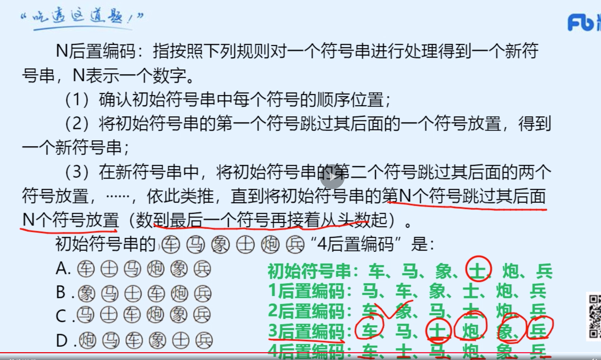
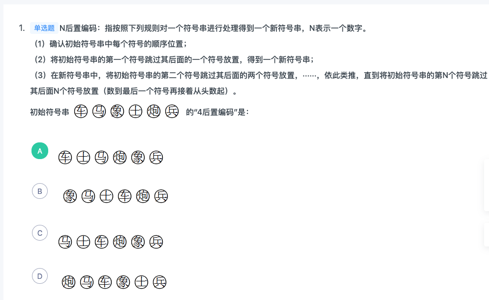
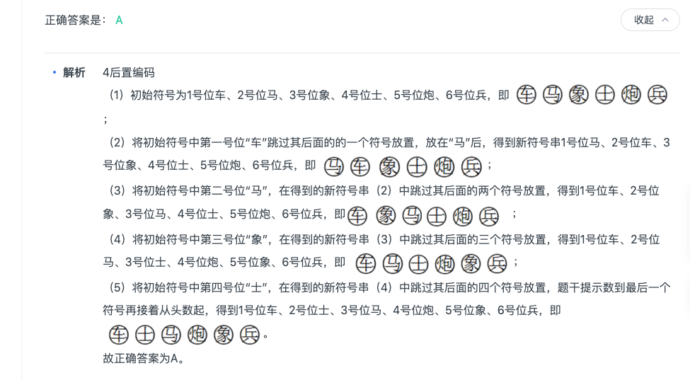


### 经典真题三(70%)

- 01 这种题错是因为对题目的给定的主体，根本没好好对应，因为人的主观精神（如目的、意志、感觉、经验、心灵等）括号里面的才是最重要的，你可以拿出括号里面比对选项，它是否是本源。

```
主观唯心主义认为人的主观精神（如目的、意志、感觉、经验、心灵等）是世界的本原，客观唯心主义认为上帝、理念等客观精神是先于物质世界并独立于物质世界而存在的本体，而物质世界不过是这种客观精神的外化，前者是本原的、第一性的，后者是派生的、第二性的。

根据上述定义，下列思想属于客观唯心主义的是：

A

相由心生，境由心转

B

一花一世界，一草一灵魂

C

一切事物的存在是因为它们被我们所感知到

D

理是世界万事万物存在的根据


正确答案是： D收起
解析
第一步：找出定义关键词。

主观唯心主义：“人的主观精神（目的、意志、感觉、经验、心灵等）是世界的本原”、“本原的、第一性”；

客观唯心主义：“上帝、理念等客观精神是先于物质世界并独立于物质世界”、“派生的、第二性”。

第二步：逐一分析选项。

A项：“相由心生，境由心转”的意思是环境的美好与恶劣是由心境的快乐与否而决定的，符合主观精神中的“心灵”为世界的本原，符合主观唯心主义，不符合客观唯心主义，排除；

B项：“一花一世界，一草一灵魂”的意思是每个自我都有一个世界，而且每个世界都是平等且相对独立的，每个世界都互相影响，每个世界的发展方向都取决于其意识体本身，符合“人的主观精神（目的、意志、感觉、经验、心灵等）是世界的本原”，符合主观唯心主义，不符合客观唯心主义，排除；

C项：一切事物的存在是因为被我们所感知到，符合主观精神中的“感觉”为世界的本原，符合主观唯心主义，不符合客观唯心主义，排除；

D项：理是世界万事万物存在的根据，符合“理念是先于物质世界并独立于物质世界”，符合客观唯心主义定义，当选。

故正确答案为D。
```

- 02(这道题错，是因为1.写上自己的名字 2 购买欲望。我当时觉得A确实，是因为它已经够买了，但是我有脑补了会退货，所以不算购买。但是其实不应该脑补，购买就是购买了。 然后D是满足的，当时我不选，是因为我觉得它可能不知道购买哪一个，因为她可以看很多套。但是这里又脑补了，只要去购买就行了。)

```
签名效应是指当人们在纸上写上自己名字时，大脑中的自我意识会加强，此时看到喜欢的东西，更容易把物品和自己联系起来，产生“这个东西真适合我”等想法，从而激发购买欲望。

根据上述定义，下列现象可用签名效应解释的是：

A

快递公司坚持“先签字后验货”的做法

B

采取实名捐款的办法能够募捐到更多善款

C

手术前，患者被要求在《知情同意书》上签字

D

中介公司要求租客在看房前签订《看房协议书》


正确答案是： D收起
解析
定义关键词1条件：签名；关键词2结果：激发购买欲望。A项购买在签名之前，不符合；B项捐款不符合购买意愿；C项显然与购买无关；D项中定义的两个要素“有签名”“产生购买认同感，产生购买欲望”，D项满足两个条件。

故正确答案为D。

```


### 经典真题四(85%)

- 01(这道题，最重要的是要找到特色。C选项只是说双管齐下，没有说哪种是最特色的。还是b特色凸现)

```
木桶原理，是指一个由若干木板构成的木桶，其容量取决于最短的那块木板。反木桶原理是指木桶最长的一根木板决定了其特色与优势。与木桶原理求稳固的思想不同，反木桶原理提倡特色突显。

根据上述定义，以下属于反木桶原理的是

A

大学一年级的时候，小菲就明确提出要报考研究生。在她的带动下，同宿舍其他女生都对自己有了明确的目标要求，大学毕业时，六个女生都保研成功

B

在同事眼中，小微很普通，既没有突出业绩，也不曾主持大型项目，但老板对她赏识有加，因为小微总是能够在团队成员出现工作纰漏时及时发现问题、解决问题，避免了很多严重后果

C

小勤创办了一家壁纸企业，他在提高产品设计水平和科技含量的同时，加强品牌宣传和推广，最终打造出一线品牌

D

小王村是一个偏远的山村，山清水秀，吸引了开发商来此投资，建立了设施完善的度假村，但游客数量一直不够理想


正确答案是： B收起
解析
第一步：找出定义关键词。

木桶原理：“木桶的容量取决于最短的那块木板”。

反木桶原理：“木桶最长的一根木板决定了其特色与优势”、“提倡特色凸显”。

第二步：逐一分析选项。

A项：小菲明确要报考研究生，且在她的带动下同宿舍六个女生保研成功，并没有体现小菲有哪些特色和优势，不符合“反木桶原理”定义，排除； 

B项：小微在同事眼中很普通，但老板对她赏识有加，因为她总能及时发现问题、解决问题，体现了小微的特色和优势，即能够在关键时刻发现问题并解决问题，符合“木桶最长的一根木板决定了其特色与优势”和“提倡特色凸显”，符合“反木桶原理”定义，当选；

C项：小勤创办壁纸企业，加强品牌推广最终打造一线品牌，并没有体现小勤或他打造的品牌有哪些特色和优势，不符合“反木桶原理”定义，排除；

D项：小王村山清水秀吸引开发商来此投资，但游客数量一直不够理想，并没有体现小王村有哪些特色和优势，不符合“反木桶原理”定义，排除。

故正确答案为B。
```

- 02(注意要广，但是c选项不满足广。因为他从事的就是数学经济，既需要数学又需要经济。但是b有广。深的话，学位也可以提现深)

```
T型人才是指按知识结构区分出来的一种新型人才类型，用字母“T”来表示他们的知识结构特点。“一”表示有广博的知识面，“丨”表示知识的深度，两者的结合，既有较深的专业知识，又有广博的知识面，这类集“深”与“博”于一身的人才，不仅在横向上具备比较广泛的一般性知识修养，而且在纵向的专业知识上具有较深的理解能力和独到见解。

根据上述定义，下列不属于T型人才的是:

A

诺贝尔化学奖获得者米兰格尔，一生获得15个名誉博士学位，并开创了粒子物理，表面化学等新学科，直到70多岁还有技术发明问世

B

某跨国公司新任命的中国区财务总监赵某能讲四种语言，同时拥有经济学博士和法学学士学位，曾经在亚洲工作过

C

在高校工作的王老师毕业于经济学系，后又攻读了数学博士学位，目前从事数量经济学的研究与教学工作，并在这一研究方向上有很深的造诣

D

古希腊著名哲学家亚里士多德的研究还涉及了物理学、诗歌、音乐、生物学、逻辑学、政治以及伦理学等


正确答案是： C收起
解析
第一步：关键词查找。

定义关键词：1.“有广博的知识面”、2.“有较深的专业知识”、3.集“深”与“博”于一身。

第二步：逐一分析选项。

A项：获得诺贝尔化学奖，开创了“粒子物理、表面化学”，且还有技术发明，体现出米兰格尔广博的知识面和较深的专业知识，满足关键词1、2、3，排除；

B项：从事财务管理，会四种语言，且拥有经济学和法学双学位，体现出赵某具有较深的专业知识和广博的知识面，满足关键词1、2、3，排除；

C项：王老师目前从事于“数量经济学的研究与教学工作”，只能体现出关键词2有较深的专业知识，并不能体现出关键词1，当选；

D项：著名哲学家，且研究涉及物理学、诗歌、音乐等，体现出亚里士多德具有较深的专业知识和广博的知识面，满足关键词1、2、3，排除。

本题为选非题，故正确答案为C。

```


- 03

```


```


- 04

```


```


- 05

```


```
## 类比推理

|  错误类型   | 统计次数  |
|  ----  | ----  |
| 常识问题  | 7|
| 题干三词为并列关系，聂海胜、张晓光和王亚平均为神舟十号飞船航天员，其中王亚平为女航天员。  |  |
| 常识，作品和对应作者名字  |  |
| 常识，矿泉水和纯净水竟然是并列关系.元月也是正月。 |  |
| 常识，化学物质的常识反应。砷在空气中能氧化生成砒霜  |  |
| 常识，社会科学： 经济学、政治学、法学、伦理学等  |  |
| 语文常识：并且并列关系可以组成一个整体。声母是使用在韵母前面的辅音，跟韵母共同构成一个完整的音节，声调是标注在韵母上部的汉字读音声调。三者为并列关系，且声母、韵母和声调三者共同构成一个汉字的读音。喻词是指本体和喻体之间的连接词，利用本体和喻体在某一方面的相似点来打比方，就构成了比喻。三者为并列关系，且本体、喻体和喻词三者共同构成了一个比喻，与题干逻辑关系一致，当选； |  |
| 常识，制作白醋的主要原材料是大米.制作年糕的主要原材料是黏性大的米（如糯米等. 制作香油的主要原材料是芝麻,甘蔗是制作红糖的主要原材料 |  |
| 看题目思路不深，知道是对应功能，但是没细想是什么功能。它是保护眼睛的功能。而且看题也不仔细，A中护膝并不能保护脚踝  | 1 |
| 三个词不要把位置顺序放反了，并且做这种题，最好按照，语义，语法，逻辑 一个一个比对。看哪种关系适应  | 1 |
| 三个词不一定是两两对应的关系，也可能是战士使用坦克打靶，三者为人物、工具和行为的对应关系。  | 1 |
| 成语意思问题：旷古绝伦指空前未有，超出一般；无独有偶表示虽然罕见，但是不只有一个，还有一个可以成对.工力悉敌指双方用的功夫和力量相当，不相上下 | 1 |
| 成语和词语的对应关系，要理解一下成语，词语的意思。比如年富力强：富强,前面是形容人的，后面是形容国家的。并且不对应。循规蹈矩：规矩 是对应的。功成名就：成就对应的| 1 |
| 类比推理，竟然也有不明确选项，吃药感冒痊愈，改为吃感冒药，感冒痊愈| 1 |


### 经典真题一(80%)

- 01(题干三词为并列关系，聂海胜、张晓光和王亚平均为神舟十号飞船航天员，其中王亚平为女航天员。)

```
聂海胜：张晓光：王亚平

A

杨利伟：费俊龙：聂海胜

B

翟志刚：刘伯明：景海鹏

C

景海鹏：刘旺：刘洋

D

杨利伟：景海鹏：聂海胜


正确答案是： C收起
解析
第一步：判断题干词语间逻辑关系。

题干三词为并列关系，聂海胜、张晓光和王亚平均为神舟十号飞船航天员，其中王亚平为女航天员。

第二步：判断选项词语间逻辑关系。

A项，杨利伟、费俊龙和聂海胜均为航天员，但其中没有女航天员，不符合题意，排除。

B项，翟志刚、刘伯明和景海鹏均为航天员，但其中没有女航天员，不符合题意，排除。

C项，景海鹏、刘旺和刘洋均为神舟九号飞船航天员，其中刘洋为女航天员，符合题意，当选。

D项，杨利伟、景海鹏和聂海胜均为航天员，但其中没有女航天员，不符合题意，排除。

第三步：再次标注答案。

故正确答案为C。
```
- 02(这道题错是因为，我知道眼镜是一种功能，但是它是什么功能就没细想。它是保护眼睛的功能。而且看题也不仔细，A中护膝并不能保护脚踝)

```
眼睛：眼镜：隐形眼镜

A

脚踝：护膝：运动护膝

B

耳机：耳朵：蓝牙耳机

C

手掌：手套：纯棉手套

D

假牙：牙套：烤瓷牙套


正确答案是： C收起
解析
第一步：判断题干词语间逻辑关系。

眼镜是矫正视力和保护眼睛的，两者是对应关系，隐形眼镜是眼镜的一种，两者是种属关系。

第二步：判断选项词语间逻辑关系。

A项：护膝是保护膝盖的，不是保护脚踝的，运动护膝是护膝的一种，前两者与题干逻辑关系不一致，排除； 

B项：耳朵不是用来保护耳机的，蓝牙耳机也不是耳朵的一种，与题干逻辑关系不一致，排除；

C项：手套是保护手掌的，纯棉手套是手套的一种，与题干逻辑关系一致，当选；

D项：牙套是矫正牙齿的，不是矫正假牙的，烤瓷牙套是牙套的一种，前两词与题干逻辑关系不一致，排除。

故正确答案为C。
```

### 经典真题二(60%)

- 01(常识：骆驼祥子和四世同堂都是老舍.土门和秦腔都是贾平凹,红与黑是司汤达的著作，老人与海是海明威的著作,国富论是亚当·斯密的著作，资本论是马克思的著作,呐喊是鲁迅的著作，雷雨是曹禺的著作)

```
骆驼祥子：四世同堂

A

呐喊：雷雨

B

土门：秦腔

C

红与黑：老人与海

D

国富论：资本论


正确答案是： B收起
解析
第一步：判断题干词语间逻辑关系。

骆驼祥子和四世同堂都是老舍的著作，两本著作与同一作者相对应。

第二步：判断选项词语间逻辑关系。

A项：呐喊是鲁迅的著作，雷雨是曹禺的著作，与题干逻辑关系不一致，排除；

B项：土门和秦腔都是贾平凹的著作，两本著作与同一作者相对应，与题干逻辑关系一致，当选；

C项：红与黑是司汤达的著作，老人与海是海明威的著作，与题干逻辑关系不一致，排除；

D项：国富论是亚当·斯密的著作，资本论是马克思的著作，与题干逻辑关系不一致，排除。

故正确答案为B。
```
- 02（旷古绝伦指空前未有，超出一般；无独有偶表示虽然罕见，但是不只有一个，还有一个可以成对.工力悉敌指双方用的功夫和力量相当，不相上下）

```

```
- 03(常识，化学物质的常识反应。)

```
铁：铁锈

A

生石灰：碳酸钙

B

水：水蒸气

C

砷：砒霜

D

小麦：面粉


正确答案是： C收起
解析
第一步：判断题干词语间逻辑关系。

铁在空气中能氧化生成铁锈。

第二步：判断选项词语间逻辑关系。

A项：生石灰和空气中的物质发生化学反应后，生成碳酸钙，不是与氧气发生反应，与题干逻辑关系不一致，排除；

B项：当水达到沸点时，水变成水蒸气，由水变成水蒸气发生了物理变化，不是发生了氧化反应，与题干逻辑关系不一致，排除；　　

C项：砷在空气中能氧化生成砒霜，与题干逻辑关系一致，当选；

D项：面粉由小麦加工而成，二者为原材料的对应关系，与题干逻辑关系不一致，排除。

故正确答案为C。
```
- 04(三个词不一定是两两对应的关系，也可能是战士使用坦克打靶，三者为人物、工具和行为的对应关系。)

```
打靶：战士：坦克

A

菜肴：厨师：炊具

B

实验：教授：论文

C

零件：工人：车床

D

购物：消费者：银行卡


正确答案是： D收起
解析
第一步：判断题干词语间逻辑关系。
战士使用坦克打靶，三者为人物、工具和行为的对应关系。
第二步：判断选项词语间逻辑关系。
A项：厨师用炊具制作菜肴，菜肴不是行为，与题干逻辑关系不一致，排除；
B项：教授通过做实验来发表论文，实验不是行为，论文也不是工具，与题干逻辑关系不一致，排除；　　
C项：工人使用车床制造零件，零件不是行为，与题干逻辑关系不一致，排除；
D项：消费者使用银行卡购物，三者为人物、工具和行为的对应关系，与题干逻辑关系一致，当选。
故正确答案为D。
```
- 05(成语和词语的对应关系，要理解一下成语，词语的意思。比如年富力强：富强,前面是形容人的，后面是形容国家的。并且不对应。循规蹈矩：规矩 是对应的。功成名就：成就对应的)

```
循规蹈矩：规矩

A

年富力强：富强

B

功成名就：成就

C

待人接物：人物

D

伶牙俐齿：牙齿


正确答案是： B收起
解析
第一步：判断题干词语间逻辑关系。

循规蹈矩指遵守规矩，有规矩，二者为对应关系。

第二步：判断选项词语间逻辑关系。

A项：年富力强指年纪轻精力旺盛，富强指富足强盛，二者无明显逻辑关系，与题干逻辑关系不一致，排除；

B项：功成名就指功业建立了，名声也有了，即有成就，二者为对应关系，与题干逻辑关系一致，当选；

C项：待人接物指对待别人，应接事物，即指跟别人往来接触，人物指作品中描写的人，二者无明显逻辑关系，与题干逻辑关系不一致，排除；

D项：伶牙俐齿指口齿伶俐能说会道，牙齿是人体的器官，二者无明显逻辑关系，与题干逻辑关系不一致，排除。

故正确答案为B。

```

- 06(制作白醋的主要原材料是大米.制作年糕的主要原材料是黏性大的米（如糯米等. 制作香油的主要原材料是芝麻,甘蔗是制作红糖的主要原材料)

```
大豆：酱油

A

柠檬：白醋

B

淀粉：年糕

C

花生：香油

D

甘蔗：红糖


正确答案是： D收起
解析
第一步：判断题干词语间逻辑关系。

大豆是制作酱油的主要原材料，二者为原材料和成品的对应关系。

第二步：判断选项词语间逻辑关系。

A项：制作白醋的主要原材料是大米，不是柠檬，与题干逻辑关系不一致，排除；

B项：制作年糕的主要原材料是黏性大的米（如糯米等），不是淀粉，与题干逻辑关系不一致，排除；

C项：制作香油的主要原材料是芝麻，不是花生，与题干逻辑关系不一致，排除；

D项：甘蔗是制作红糖的主要原材料，二者为原材料和成品的对应关系，与题干逻辑关系一致，当选。

故正确答案为D。

```


### 经典真题三（70%)

- 01(类比推理，竟然也有不明确选项，吃药感冒痊愈，改为吃感冒药，感冒痊愈)

```
缺锌：生长迟缓

A

成年：参加选举

B

吃药：感冒痊愈

C

迁徙：季节变化

D

加热：温度升高


正确答案是： D收起
解析
第一步：判断题干词语间逻辑关系。

缺锌导致生长迟缓，二者为因果对应关系。

第二步：判断选项词语间逻辑关系。

A项：成年是参加选举的必要条件而不是参加选举的原因，与题干逻辑关系不一致，排除；

B项：吃感冒药可以导致感冒痊愈，但题干只是说吃药，太过笼统，所以题干两词无必然逻辑关系，与题干逻辑关系不一致，排除；

C项：季节变化导致迁徙，二者为因果对应关系，但两词顺序与题干相反，与题干逻辑关系不一致，排除；

D项：加热可以导致温度升高，二者为因果对应关系，与题干逻辑关系一致，当选。

故正确答案为D。
```
- 02（矿泉水和纯净水竟然是并列关系.元月也是正月。 ）

```
矿泉水：纯净水

A

象棋：军棋

B

泰山：高山

C

军人：医生

D

正月：元月


正确答案是： A收起
解析
第一步：判断题干词语间逻辑关系。

矿泉水是指从地下深处自然涌出的或者是经人工揭露、未受污染的地下矿水，含有一定量的矿物盐、微量元素或二氧化碳气体；纯净水是指不含有杂质或细菌的水，是利用加工方法去除水中的矿物质、有机成分、有害物质及微生物等加工制成的水，二者为并列关系。

第二步：判断选项词语间逻辑关系。

A项：象棋和军棋是两种不同的棋类，二者为并列关系，与题干逻辑关系一致，当选；

B项：高山指高峻的山峰，泰山属于高山，二者为种属关系，与题干逻辑关系不一致，排除；

C项：有的军人是医生，有的军人不是医生，有的医生是军人，有的医生不是军人，军人和医生为交叉关系，与题干逻辑关系不一致，排除；

D项：元月指每年的第一个月份，农历一月，也就是正月，二者为全同关系，与题干逻辑关系不一致，排除。

故正确答案为A。
```
- 03

```
法官是公务员的一种，后两者是种属关系，经理和公务员是并列关系。

D项：花岗岩是混合物，不是无机物，两者不是种属关系，且蛋白质与无机物不是并列关系，与题干逻辑关系不一致，排除。

```
- 04(语文常识：声母是使用在韵母前面的辅音，跟韵母共同构成一个完整的音节，声调是标注在韵母上部的汉字读音声调。三者为并列关系，且声母、韵母和声调三者共同构成一个汉字的读音。喻词是指本体和喻体之间的连接词，利用本体和喻体在某一方面的相似点来打比方，就构成了比喻。三者为并列关系，且本体、喻体和喻词三者共同构成了一个比喻，与题干逻辑关系一致，当选；)

```
声母：韵母：声调

A

满族：汉族：白族

B

比拟：拟人：拟物

C

本体：喻体：喻词

D

车轮：车胎：车门


正确答案是： C收起
解析
第一步：判断题干词语间逻辑关系。

声母是使用在韵母前面的辅音，跟韵母共同构成一个完整的音节，声调是标注在韵母上部的汉字读音声调。三者为并列关系，且声母、韵母和声调三者共同构成一个汉字的读音。

第二步：判断选项词语间逻辑关系。

A项：满族、汉族和白族均是一个民族，三者之间是并列关系，但三个词不能构成一个完整的事物，与题干逻辑关系不一致，排除；

B项：比拟就是把一个事物当作另外一个事物来描述、说明。比拟可以分为拟人、拟物两类，后两词与第一词为种属关系，与题干逻辑关系不一致，排除；

C项：喻词是指本体和喻体之间的连接词，利用本体和喻体在某一方面的相似点来打比方，就构成了比喻。三者为并列关系，且本体、喻体和喻词三者共同构成了一个比喻，与题干逻辑关系一致，当选；

D项：车轮、车胎和车门均是车辆的一部分，三者之间是并列关系，但三个词不能构成一个完整的事物，与题干逻辑关系不一致，排除。

故正确答案为C。
```
- 05(学科分类： 经济学、政治学、法学、伦理学等.)

```
对于 社会科学  相当于  蝗虫 对于（  ）

A

物理学 蜻蜓

B

经济学 昆虫

C

自然科学 害虫

D

超声波 大雁


正确答案是： B收起
解析
逐一代入选项。

A项：物理学属于自然科学，与社会科学无逻辑关系，蜻蜓和蝗虫都是昆虫，二者是并列关系，前后逻辑关系不一致，排除；

B项：经济学是社会科学的一种，二者是种属关系，蝗虫是昆虫的一种，二者是种属关系，前后逻辑关系一致，当选；

C项：自然科学和社会科学都是科学的一类，二者是并列关系，蝗虫是害虫的一种，二者是种属关系，前后逻辑关系不一致，排除；

D项：超声波是声波的一种，和社会科学无明显逻辑关系，蝗虫和大雁都是一种动物，二者是并列关系，前后逻辑关系不一致，排除。

故正确答案为B。
```
- 06

```

```


### 经典真题四(95%)
## 逻辑填空


|  错误类型   | 统计次数  |
|  ----  | ----  |
| 逻辑判断问可能不可能，可以试试代入排除法  | 1|
| Bcd都是给的可能不可能，而这里缺少必要条件，必要条件可能不可能不好  | 1|
| 不太会，分析题目条件。并分析完条件，使用代入排除法  | 2|
| 通过最大信息法种山发现的。2. 根据长江排第一或者第二列表格  | 1|
| 1. 看到如果，那么就是翻译推理题 2. 然后将条件连起来  | 1|
| 加强：对照组加强了基因有用治疗  | 1|
| 有的A是B,不能推出有的A不是B:比如大多数乘客购买了延误险，不能推出有的乘客没有购买延误险 | 1|
| 1.长的好评价好，不代表长的越好，评价越高。注意这个逻辑。2.题干没提到公平性，文章质量的内容，不要无中生有。文章提到的是顾客满意度。 | 1|

### 经典真题一(95%)

- 01(逻辑判断问可能不可能，可以试试代入排除法)

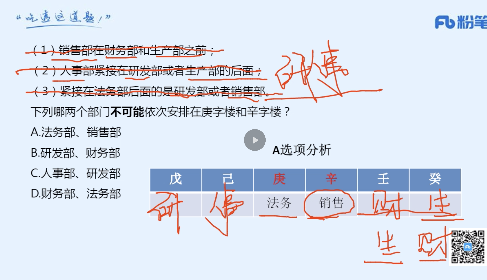
### 经典真题二(55%)

- 01(Bcd都是给的可能不可能，而这里缺少必要条件，必要条件可能不可能不好)

```
  智能手机流行的时代，我们每天发送信息，也收到信息。人际之间的电子信息交往已成为当今时代一种独特的交往方式。在面对重要的人或关系时，很多人往往发出信息后就期待被秒回，如果没有被秒回，他们就产生一种怀疑感或被弃感，从而陷入深深的烦恼和焦虑之中。

以下哪项最可能是他们陷入深深烦恼和焦虑所需的假设？

A

当前技术已能实现智能手机的即时通信，方便快捷，且基本免费

B

有些聊天软件能在发送者手机中反馈信息接收者是否阅读了信息

C

有些人工作很忙，总习惯在忙完一天工作后才统一处理相关信息

D

有些人一天收到的信息太多，容易遗漏某人期待秒回的重要信息


正确答案是： A收起
解析
第一步：找出论点和论据。

论点：在面对重要的人或关系时，很多人往往发出信息后就期待被秒回，如果没有被秒回，他们就产生一种怀疑感或被遗弃感，从而陷入深深的烦恼和焦虑之中。

论据：无。

本题无论据，只能通过补充论据进行加强。提问方式是假设类，优先考虑补充必要条件，即没有这个选项，论点则无法成立。

第二步：逐一分析选项。

A项：如果智能手机不能即时通信，那么发出的信息就无法被即时接收，发出者就不会期待秒回，因此A项是信息能够被秒回的必要条件，当选；

B项：有些聊天软件能在发送者手机中反馈信息接收者是否阅读了信息，可以解释部分发出者为什么没有被秒回就会产生怀疑感或被弃感，但是力度较弱，且不是论点成立的必要条件，排除；

C项：接收者什么时候阅读信息与发出者没被秒回就会产生烦恼和焦虑无关，排除； 

D项：接收者是否遗漏了重要信息与发出者没被秒回就会产生烦恼和焦虑无关，排除。

故正确答案为A。

附：通过查证原文，本题答案为A项。
```
- 02(如果是2，2，0则不符合，则一定是2，1，1)

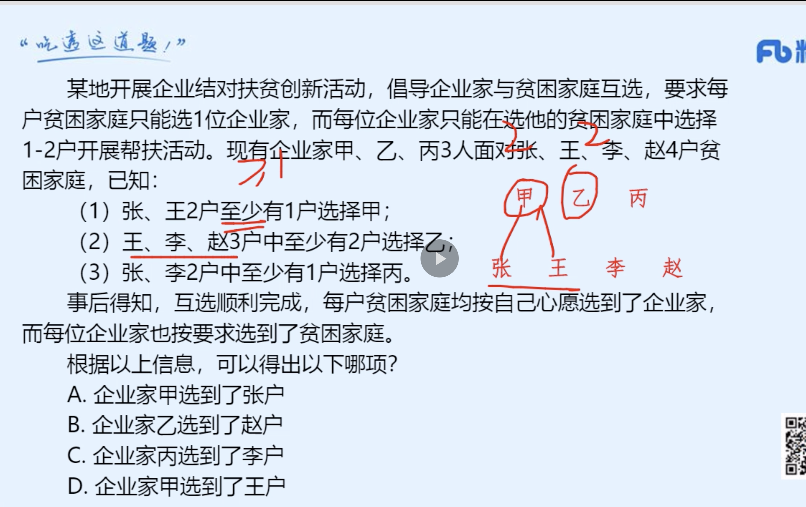

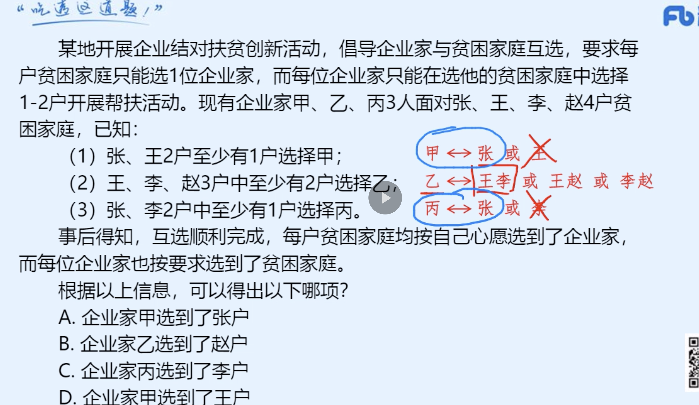

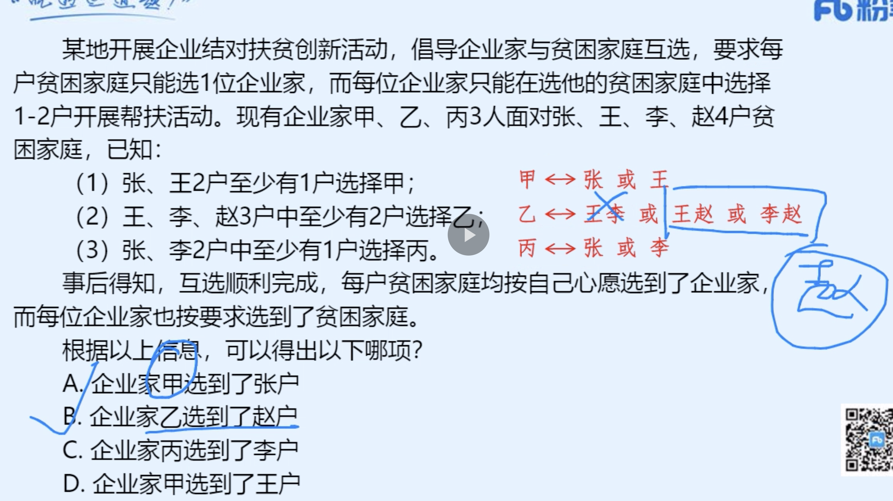
```
某地开展企业结对扶贫创新活动，倡导企业家与贫困家庭互选，要求每户贫困家庭只能选1位企业家，而每位企业家只能在选他的贫困家庭中选择1-2户开展帮扶活动。现有企业家甲、乙、丙3人面对张、王、李、赵4户贫困家庭，已知：

（1）张、王2户至少有1户选择甲；

（2）王、李、赵3户中至少有2户选择乙；

（3）张、李2户中至少有1户选择丙。

事后得知，互选顺利完成，每户贫困家庭均按自己心愿选到了企业家，而每位企业家也按要求选到了贫困家庭。

根据以上信息，可以得出以下哪项？

A

企业家甲选到了张户

B

企业家乙选到了赵户

C

企业家丙选到了李户

D

企业家甲选到了王户


正确答案是： B收起
解析
分析题干。

（1）张或王选甲

（2）王、李、赵中至少2户选乙

（3）张或李选丙

由题干可知，因为3名企业家，4户贫困户，最后都顺利互选，所以一定是有两名企业家都只帮扶一户，而有一名企业家帮扶两户。由（2）可知帮扶两户的是乙，故甲、丙都只与1户互选。由（2）可知乙不帮扶张，张只能是甲或丙帮扶。

对张分情况假设，若甲帮扶张，根据（1）可知甲不帮扶王，根据（3）可知丙帮扶李，故帮扶情况为甲张、乙王赵、丙李；若丙帮扶张，根据（3）可知丙不帮扶李，根据（1）可知甲帮扶王，故帮扶情况为甲王、乙李赵、丙张。

无论哪种情况，都有乙帮扶赵。

故正确答案为B。
```
- 03(1.如果钟山排第三，则梅园排第一，则不相邻（通过最大信息法种山发现的。2. 根据长江排第一或者第二列表格 ）)

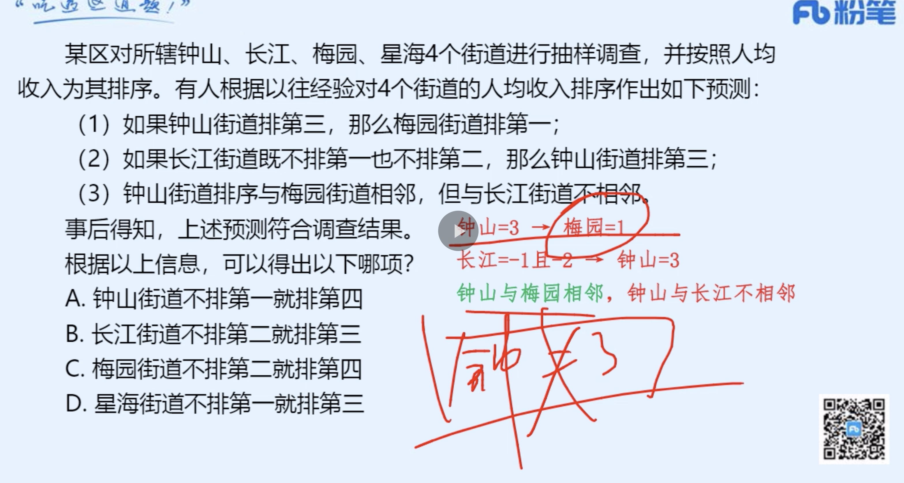
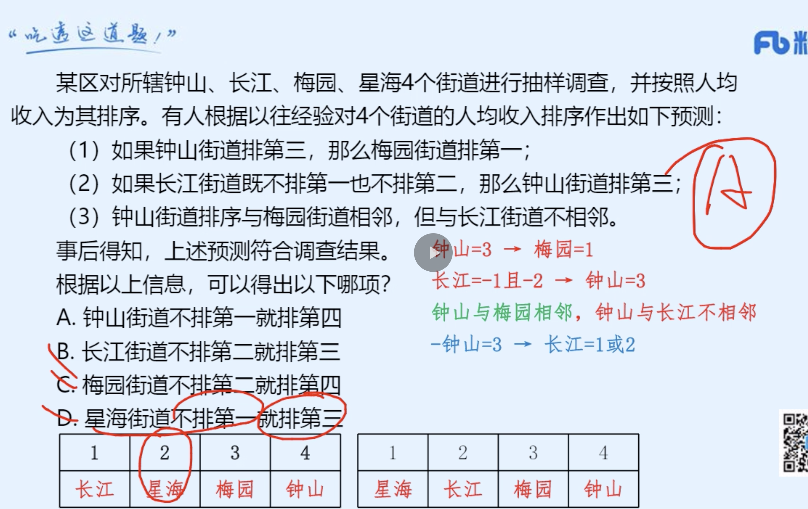
```
某区对所辖钟山、长江、梅园、星海4个街道进行抽样调查，并按照人均收入为其排序。有人根据以往经验对4个街道的人均收入排序作出如下预测：

（1）如果钟山街道排第三，那么梅园街道排第一；

（2）如果长江街道既不排第一也不排第二，那么钟山街道排第三；

（3）钟山街道排序与梅园街道相邻，但与长江街道不相邻。

事后得知，上述预测符合调查结果。

根据以上信息，可以得出以下哪项？

A

钟山街道不排第一就排第四

B

长江街道不排第二就排第三

C

梅园街道不排第二就排第四

D

星海街道不排第一就排第三


正确答案是： A收起
解析
第一步：分析题干条件。

① 钟山第三梅园第一；

② 长江第一且第二钟山第三；

③ 钟山与梅园相邻，与长江不相邻。

第二步：根据题干条件进行推理。

钟山出现次数最多，为最大信息，可作为突破口。根据③可知：钟山与梅园相邻，结合①可知：钟山第三梅园第一，故钟山不能排名第三。钟山第三是对②的否后，否后必否前，故长江排名第一或者第二。

如果长江排第一，根据③可知钟山只能排第四，故梅园排第三，星海排第二，排除B、C、D项，只有A项成立；

如果长江排第二，根据③可知钟山只能排第四，故梅园排第三，星海排第一，A项依然成立。

故正确答案为A。
```
- 04(1. 看到如果，那么就是翻译推理题 2. 然后将条件连起来)

```
某县新一届党政领导班子刚组建完成，一心想为群众做一些实事。面对有限的财力，新一届领导班子明确表示，今年只能完成两件大事。对于众多排进公共政策议程的大事，他们认为：如果建一条乡村公路，则不能建污水处理厂；如果建污水处理厂，则要建排污管道；如果建排污管道，则不能建垃圾处理厂。

按照这届领导班子的想法，以下哪项不可能是他们今年同时要建设的？

A

乡村公路、排污管道

B

乡村公路、垃圾处理厂

C

污水处理厂、排污管道

D

污水处理厂、垃圾处理厂


正确答案是： D收起
解析
第一步：翻译题干。

①  建公路建污水处理厂；

②  建污水处理厂建排污管道；

③  建排污管道建垃圾处理厂；

将③和②可以递推出：④ 建污水处理厂建排污管道建垃圾处理厂；

⑤  只能完成两件大事。

第二步：逐一分析选项。

A项：若建公路和排污管道，根据①得到不建污水处理厂，根据③得到不建垃圾处理厂，此时完成两件大事，与题干已知条件不矛盾，可以推出，排除；

B项：若建公路和垃圾处理厂，根据①得到不建污水处理厂，根据④得到不建排污管道以及不建污水处理厂，此时完成两件大事，与题干已知条件不矛盾，可以推出，排除；

C项：若建污水处理厂和排污管道，根据①的否后必否前，得到不建公路，根据④得到不建垃圾处理厂，此时完成两件大事，与题干已知条件不矛盾，可以推出，排除；

D项：根据④可知，建污水处理厂建垃圾处理厂，故不可能同时建污水处理厂和垃圾处理厂，不能推出，当选。

本题为选非题，故正确答案为D。
```
- 05(对照组加强了基因有用治疗)

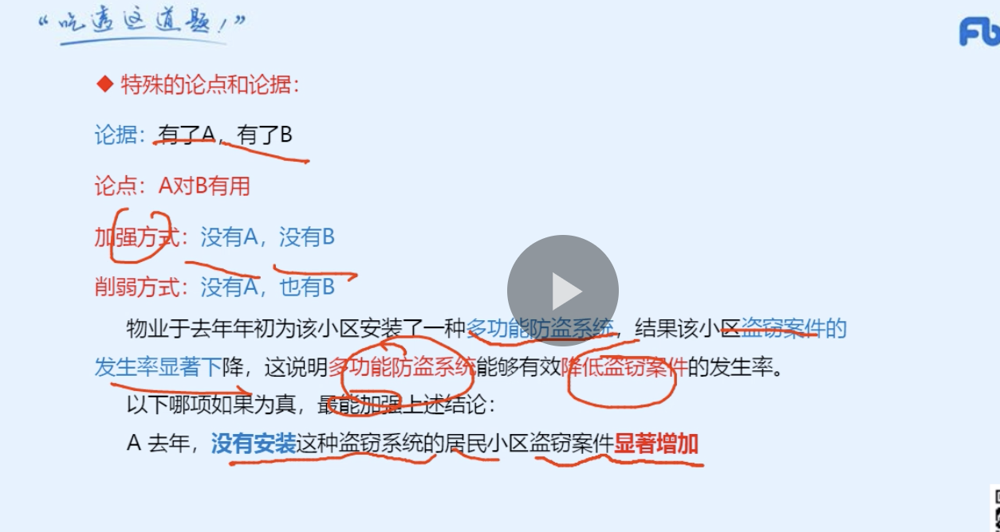
```
 
脊髓性肌萎缩症是一种罕见的致死性遗传病，大多数患儿活不到20个月。近日，有研究人员使用一种新的基因疗法，研发了一种生物技术药物Spinraza，通过在患者脊髓周边注射给药，Spinraza使73名受试患者中的近一半患者不同程度的恢复了运动机能。研究人员据此得出结论：这种新的基因疗法将为脊髓性肌萎缩症的治疗带来突破性进展。

以下哪项如果为真，最能支持上述论证

A

该项研究的具体程序设计较为科学合理

B

这种基因疗法也可用于其他疾病的治疗

C

美国药监局已经批准了这一新药的上市

D

对照组的所有患者都没有恢复运动机能


正确答案是： D收起
解析
第一步：找出论点和论据。

论点：这种新的基因疗法将为脊髓性肌萎缩症的治疗带来突破性发展。

论据：有研究人员使用一种新的基因疗法，研发出一种生物技术药物Spinraza，通过在患者脊髓周边注射给药，Spinraza使73名受试患者中的近一半患者不同程度的恢复了运动机能。

第二步：逐一分析选项。

A项：该项研究的具体程序设计较为科学合理，说明该研究是科学的，加强论据，保留；

B项：该基因疗法可用于其他疾病的治疗，与脊髓性肌萎缩症的治疗无关，不能支持，排除；

C项：新药获批上市，说明新药被允许使用，但是对治疗脊髓性肌萎缩症是否有效果，以及是否能为脊髓性肌萎缩症的治疗带来突破性发展都不明确，无法支持，排除；

D项：对照组的所有患者都没有恢复运动机能，补充了对照实验，通过实验结论对比能得出“新的基因疗法将为脊髓性肌萎缩症的治疗带来突破性发展”，保留。

比较A、D两项，A项证明了论据为真，而D项证明了论点为真，D项的加强力度要强于A项，当选。

故正确答案为D。
```
- 06(有的A是B,不能推出有的A不是B:比如大多数乘客购买了延误险，不能推出有的乘客没有购买延误险)

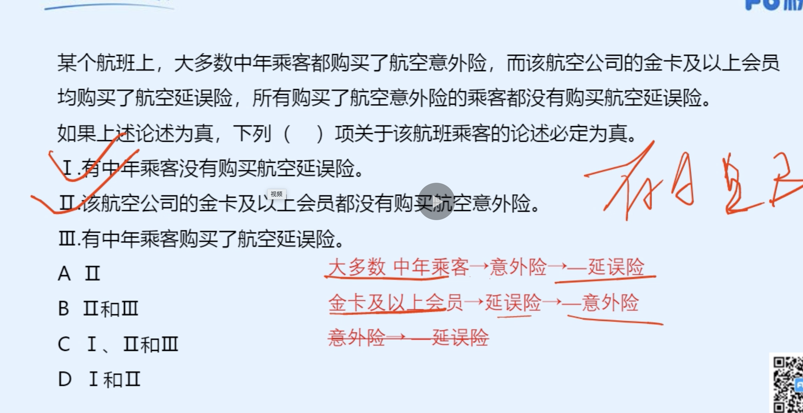
```
某个航班上，大多数中年乘客都购买了航空意外险，而该航空公司的金卡及以上会员均购买了航空延误险，所有购买了航空意外险的乘客都没有购买航空延误险。

如果上述论述为真，下列（    ）项关于该航班乘客的论述必定为真。

Ⅰ.有中年乘客没有购买航空延误险。

Ⅱ.该航空公司的金卡及以上会员都没有购买航空意外险。

Ⅲ.有中年乘客购买了航空延误险。

A

Ⅱ

B

Ⅱ和Ⅲ

C

Ⅰ、Ⅱ和Ⅲ

D

Ⅰ和Ⅱ


正确答案是： D收起
解析
第一步：翻译题干。

①大多数中年乘客购买了航空意外险

②金卡及以上会员购买了航空延误险

③购买了航空意外险-购买航空延误险

根据①③可知，大多数中年乘客购买了航空意外险-购买航空延误险，可以推出有的中年乘客没有购买航空延误险，Ⅰ必定为真；

根据②③可知，金卡及以上会员购买了航空延误险-购买了航空意外险，即金卡及以上会员都没有购买航空意外险，Ⅱ必定为真；

根据①③可知，大多数中年乘客购买了航空意外险-购买航空延误险，即大多数中年乘客没有购买了航空延误险，但无法推出有的中年乘客一定购买了航空延误险，Ⅲ不必然为真；

只有Ⅰ和Ⅱ必然为真。

故正确答案为D。

```
- 07(1.长的好评价好，不代表长的越好，评价越高。注意这个逻辑。2.题干没提到公平性，文章质量的内容，不要无中生有。文章提到的是顾客满意度。)

```
在人际交往的过程中，容貌是最容易观察到的属性特征。和容貌普通的人相比，容貌有吸引力的个体，往往被认为具有较高的能力、较为积极的人格特征和较好的人际关系，甚至收入水平和个人幸福指数也会比较高。在工作中，相同的任务被不同人完成时，通常顾客会对容貌姣好员工的服务质量给予相对较高的评价。

由此可以推出：

A

随着容貌吸引力越来越大，人们对其个性特征的评价越来越好

B

企业应选择容貌姣好的人为员工，以提高顾客的服务满意度

C

简历不应附带照片，因为照片会影响招聘者决策的公平性

D

发表文章时提供作者的照片，可以提高读者对文章质量的评价


正确答案是： B收起
解析
日常结论题，根据题干信息逐一分析选项。

A项：题干中指出容貌有吸引力的个体，往往被认为具有较为积极的人格特征，选项中说的是对其个性特征的评价越来越好，人格特征和对个性特征的评价不同，偷换概念，“越来越好”也是没有提到的，无中生有，排除；

B项：题干最后一句指出通常顾客会对容貌姣好员工给予更高的评价，说明选择容貌姣好的人为员工，确实可以提高顾客的服务满意度，可以得出企业想要提高顾客的服务满意度，应选择容貌姣好的人为员工，可以推出，当选；

C项：题干中指出容貌有吸引力的个体，更容易获得好的评价，并未提照片是否会影响招聘者决策的公平性，无中生有，排除；

D项：题干中并未提及发表文章时提供作者照片与文章质量评价之间的关系，无中生有，排除。

故正确答案为B。
```


### 经典真题三(70%)
### 经典真题四(90%)