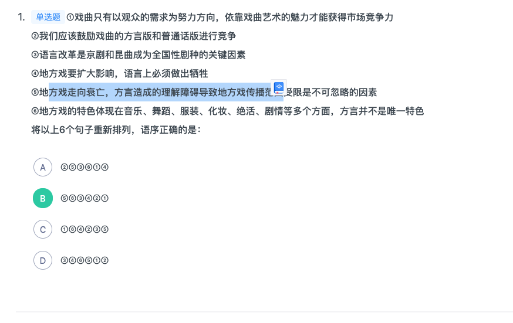
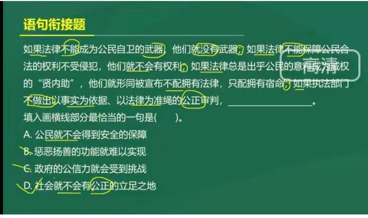
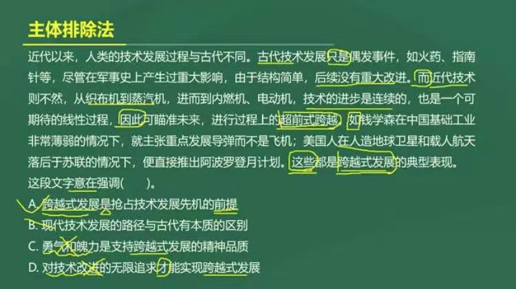
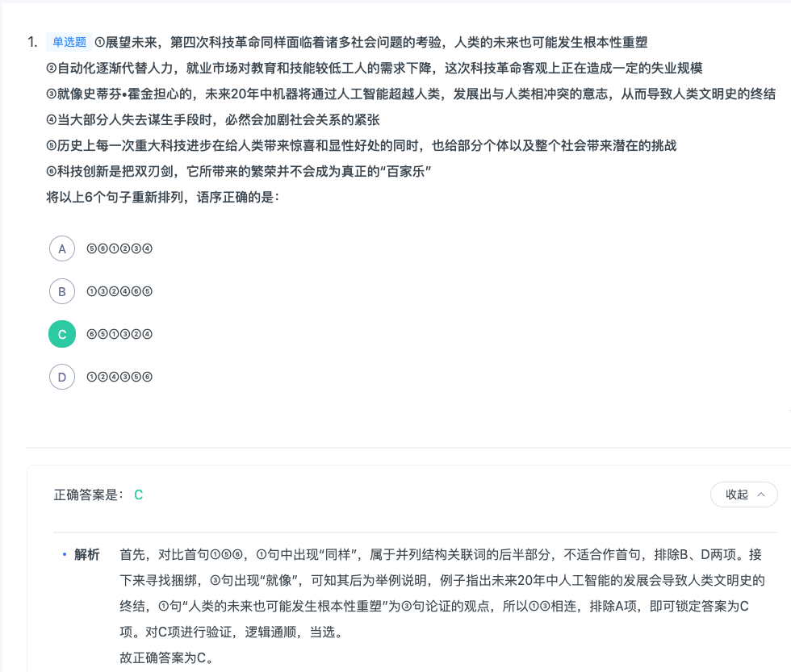
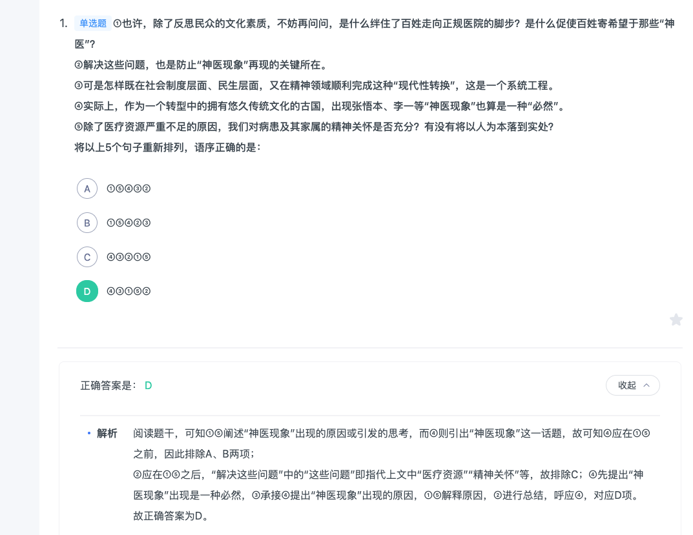
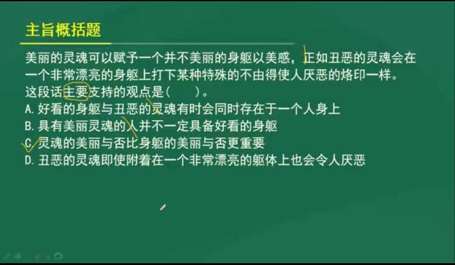
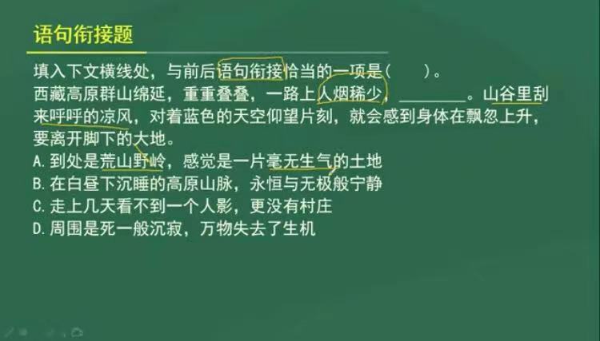
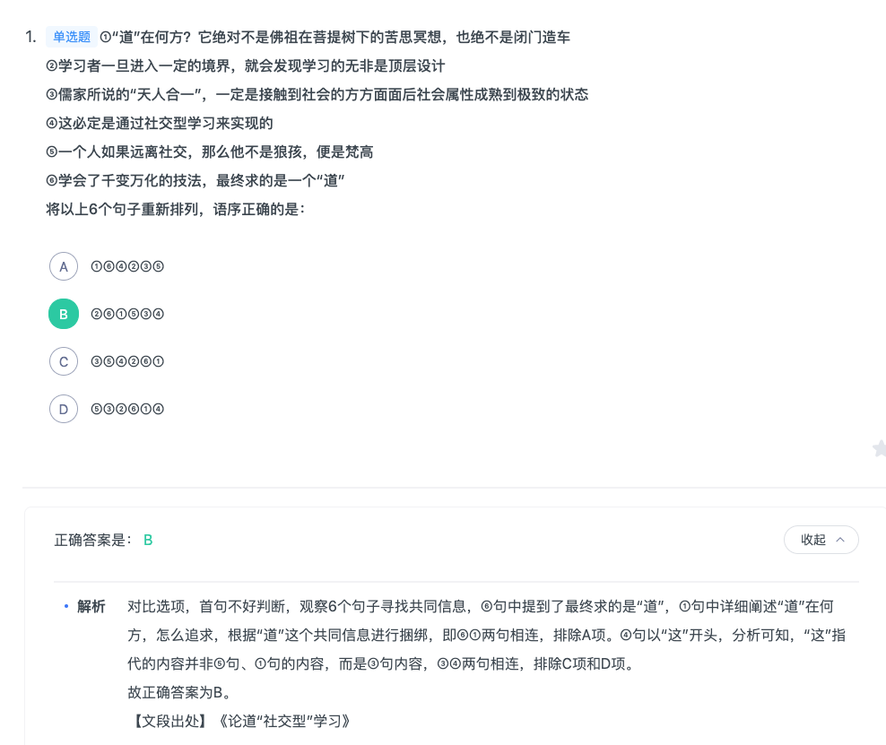
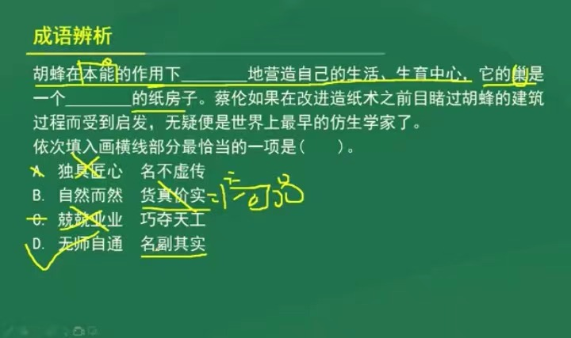

### 经典真题十二(70%)


- 1(文中的强调社会属性。错误选择成了d)


```
当数字化智能化时代到来之后，将会出现比现在的马云更能“云”的公司。那个时候的公司，将在坚守其经济属性的基础上，更加突出其社会属性，呈现出社会组织的突出特征。因为，互联网、数字化、云计算、移动终端等技术，一方面为企业赋能，让企业强大；另一方面也为消费者赋能，让消费者大联合。如果公司不突出社会属性，全心全意为消费者服务，它就无法持续“经济”下去。比如，一位消费者发现自己购买的汽车有“天然”缺陷，制造企业就会把同类车召回，否则，消费者就可能不再买它的任何一款车。

这段文字意在说明：

A

数字化智能化时代将改变公司的基本属性

B

社会属性是公司在未来必须凸显的一种特质

C

“全心全意为消费者服务”是公司社会属性的核心内容

D

智能化极大地提高了广大消费者团结的可能性


正确答案是： B收起
解析
文段首先指出数字化智能化时代到来之后的情况，接下来通过程度词“更加”引出观点，即未来的公司更加突出社会属性，呈现社会组织的特征。接下来通过“因为”进行解释说明，分别从互联网等技术“为企业赋能”与“为消费者赋能”的两个方面解释“公司突出社会属性”的原因，接下来通过反面论证并以“汽车召回”制度为例进行说明。故文段的重点是公司在未来必须突出社会属性，对应B项。

A项，“改变公司的基本属性”表述错误，文段论述的是公司在经济属性的基础上，将突出“社会属性”，“基本属性”没有发生改变，排除；

C项，“全心全意为消费者服务”、D项，“提高消费者团结的可能性”均对应后文解释说明部分内容，非重点，且D项没有提及“社会属性”这一主题词，排除。

故正确答案为B。

```

- 2(最好的方式，文章强调B选项。而选择了A是无关话题。文章没有提到精神层面的死亡和肉体层面的死亡。)


```
站在亲情的角度，人们都希望逝者没有真正地死去，希望他们永远地活下去。这是很正常的情感。但是，站在客观的角度，每个死亡的生命至少在肉体上已经失去了生命的特征，并且整个肉体也必然会消失。从精神层面讲，生命的延续是脱离生物学概念的，一个人生命在精神层面存在多久，取决于这个生命为世界带来了多少值得怀念的东西。现代生命观跳出了肉体的观念，将捐出自己的器官视为生命的延续，以及自己在这个世界存续的最好方式。

这段文字主要表明（  ）。

A

精神层面的死亡不同于肉体层面的死亡

B

捐献器官是延长生命在世界上存续时间的一种方式

C

生命观应该跳出肉体层面，倡导器官捐献

D

人们不希望亲人离世，也不愿意捐献他们的器官


正确答案是： B收起
解析
文段开篇介绍从亲情的角度来说人们希望逝者没有死去，而后通过转折关联词“但”引出从客观角度来说死亡的生命在肉体上已经失去了生命特征，紧接着后文引出“生命延续”的话题，说明生命延续是脱离生物学概念的，取决于生命为世界带来的怀念的东西，尾句通过程度词“最好方式”重点强调现代生命观将捐出器官视为生命的延续，对应B项。

A项，文段中并未涉及“精神层面的死亡”与“肉体层面的死亡”对比的话题，无中生有，排除；

C项，未提到文段重点概念“生命延续”，偏离中心，排除；

D项，“不愿意捐献器官”文中并未提及，无中生有，排除。

故正确答案为B。
```
- 3(错选C,但是文章重点是强调科技对文化的作用。而B项鲜为人知无中生有。)


```
近年来，“文化+科技”的应用，使收藏在博物馆里、远在祖国各地的文物“活”了起来。在过去的一年里，文化创意与科技创新不断发生“化学反应”，从舞美设计到文物保护，从互联网在线直播到博物馆数字化展陈，文化领域各行各业纷纷插上科技的翅膀，科技对文化发展的推动力愈加强劲。

这段文字中的“化学反应”是指（  ）。

A

文化事业与科技事业融合发展，相辅相成

B

之前鲜为人知的文物通过科技“活”了起来

C

科技创新支撑文化创意，文化创意点燃科技创新

D

文化领域各行业借助科技蓬勃发展，百花齐放


正确答案是： D收起
解析
文段开篇提出“文化+科技”的应用，使各地博物馆里的文物“活”了起来，意在强调科技对于文化的影响。后文论述“科技对文化发展的推动力愈加强劲”，强调科技对于文化的影响力越来越强，所以文段的重点在于强调科技对于文化的作用。故“文化创意与科技创新不断发生化学反应”中的“化学反应”即指科技对于文化的推动作用，文化借助科技蓬勃发展，对应D项。

A项，“相辅相成”指两件事物互相配合，缺一不可。文段强调的是科技对于文化的作用，与文意不符，排除；

B项，文段并未提及“鲜为人知的文物”，无中生有，排除；

C项，“科技创新支撑文化创意，文化创意点燃科技创新”双向作用，而文段仅强调科技对于文化的作用，与文意不符，排除。

故正确答案为D。
```
- 4(问题是国外在偷学炮制技术。所以要解决问题。d项光了解是不够的)


```
炮制技术被认为是中医药的核心技术，也是中医独有的传统技能，掌握它就等于掌握了中医药市场。国外企业通常通过在我国开办饮片加工厂、聘请国内炮制专家“偷学”炮制技术，目前这样的外资企业达到几十家。这是因为，一些地方政府对国家在特殊领域的规定并不了解，无从管起；还有一些地方政府虽明知这些规定，但为了经济指标，对此不管不顾。调研表明，国内实际饮片厂数量比国家药监局公布的多几百家。

这段文字意在表明：

A

国家应加强对炮制技术保密工作的管理

B

政府应加强对设立中药饮片厂的资格审查

C

我国中医药行业的发展受到外资企业的威胁

D

地方政府应该加强对中医药行业相关规定的了解


正确答案是： A收起
解析
文段首先指出炮制技术是中医药的核心技术，随后介绍了现阶段我国在炮制技术方面存在的问题，即国外企业在“偷学”这种技术，并分析了原因，故文段为“提出问题—分析问题”的结构，A 项为针对问题提出的对策，当选。

B、C、D 三项均未提到文段主题词“炮制技术”，排除。

故正确答案为 A。
```
- 5(反面举例，多读一本没有价值的书。它的反面建议就是不要读没有价值的书。就是说明要选择读书。而不是要少读书。)


```
书是读不尽的，即使读尽也没有用，许多书都没有读的价值，多读一本没有价值的书，便丧失了读一本有价值的书的时间和精力。

作者想要表达的观点是（  ）。

A

读书要少而精

B

读书要慎加选择

C

读书多了无益处

D

读书常会觉得得不偿失


正确答案是： B收起
解析
由提问关键词“想”可知此题是中心理解题。

其中C、D两选项明显错误，首先予以排除。A、B两选项容易混淆。仔细阅读文段，提炼作者的观点，即读书要谨慎，切忌读没有价值的书，反而会浪费时间；A选项提到要少而精，但是文中没有提到“要少”，因此排除A选项。

故正确答案为B。


```
- 6




```
对比选项，确定首句。①、②句通过“只有……才”“应”均引导对策，③句“是……关键因素”为分析问题，⑤句“地方戏走向衰亡”是一种现象，为提出问题。根据写作的逻辑顺序可知，应为先提出问题，再分析问题，最后解决问题。对比可知，⑤句适合作首句，故锁定B项。

验证B项：⑤句为提出问题，⑥句“不是唯一特色”为分析问题，③句“是……关键因素”为分析问题，④、②、①句均为解决问题，逻辑恰当。

故正确答案为B。

华图答案

可以从尾句看。

4，5不可做尾句。但是12的逻辑顺序是21.
```

### 经典真题十一(80%)


- 1(唐宋唐宋四六文而不是唐宋文)


```
词藻的妙用，在乎能显示印象，从片段里生出完整来。有些境界可用白描的手法，有些非词藻不为功，这个道理自然也有人领会的，依我个人的偏嗜，词中的温飞卿是很懂得用词藻的，六朝文之所以大胜唐宋四六文者，会用词藻至少是一个原因。词藻，文学的色泽，也是应某种需要而生，并非无聊的东涂西抹，专以炫人耳目为业的。俗滥是不善用之故，不是词藻本身的毛病。

根据这段文字，下面说法中错误的是：

A

作者认为有些场合非用词藻不可

B

作者认为温飞卿作词善用词藻

C

作者认为六朝文远胜于唐宋文

D

作者认为善用词藻不会俗滥


正确答案是： C收起
解析
A项与文段“有些境界可用白描的手法，有些非词藻不为功”意思一致，即作者认为有些场合非用词藻不可，所以A项正确；

B项，文中作者指明“依我个人的偏嗜，词中的温飞卿是很懂得用词藻的”，故作者认为温飞卿作词善用词藻，B项正确；

C项语义偷换，文中作者认为“六朝文之所以大胜唐宋四六文者，会用词藻至少是一个原因”，但并不代表六朝文远胜于唐宋文，C项错误；

D项在段尾说明“俗滥是不善用之故，不是词藻本身的毛病”，这说明作者认为善用词藻不会俗滥，则D项正确。

本题为选非题，故正确答案为C。

```

- 2(句式一致并且话题一致)




- 3(a强调是必要条件。强调跨越式发展。D项只有才，强调的重点是对技术的改进。强调是只有才中间的话语。)



- 4


```
3有个就像，并且比较严重。所以2的话失业并不导致人类终结，但是1后面接的话可能导致终结。
```

### 经典真题十(80%)

- 1(塑造只是对人，片面。而濡化是潜移默化的教化。也可以用对民族，对社会的传播。)


```

文化的基本使命是立人，通过文化的教化和积淀，有效地协调人与自然、社会及自我的关系，培养健全的、充分发展的社会的人。文化对于人的塑造体现在人的自立、自强、自尊、自信等文化心态的确立以及人类社会人文氛围的形成上。在人类历史的长河中，文化以道德、宗教、艺术、教育等各种生活内容存在，并通过家庭启蒙、社会心理、社会舆论等多种手段向整个社会和民族传播和教化，使社会形成一种文化的氛围，并获得可持续发展的可能。

这段文字主要阐述了文化具有：

A

塑造功能

B

濡化功能

C

调节功能

D

传播功能


正确答案是： B收起
解析
文段首先指出文化可以培养健全的、充分发展的社会的人，后文指出文化塑造人的具体体现，接着后文又指出文化可以向整个社会和民族传播和教化，使社会形成一种文化的氛围，故整个文段构成并列结构，重在强调文化对于个人、对于社会和民族的双重作用，对应B项“濡化”，指滋润化育。

A项“塑造”对应文段“对于人的塑造”、C项“调节”指“有效协调人与自然、社会及自我的关系”、D项“传播”对应文段“社会和民族的传播和教化”，均表述片面，排除。

故正确答案为B。


```

- 2(1. A,D都把改革发展说成了改革开放，所以这样说没问题。但是B项目程度词范围扩大了。还可以，说明还有别的方法，但是文章用的是就。)


```
当代中国正处于“滚石上山、爬坡过坎”的关键阶段，改革发展的任务十分繁重，前进路上的艰与险在增多。越是这样的时候，越需要党员干部奋发有为、敢于担当，提振干事创业的精气神。然而，有的人叹“官不聊生”而“为官不为”，有的人不敢担当、畏首畏尾、推三阻四，有的人习惯懒散占着位置不干事，有的人偷奸耍滑只想揽权不想担责、只想出彩不想出力。专题教育就要以问题为导向，以解决问题为路径，以领导干部的精神状态为观照，促进各级干部把心思和精力用到干事创业上，继续焕发“蛮拼精神”。

下列选项中，对文段理解不正确的一项是：

A

越是到改革开放的关键时期，我们的党员干部越要奋发图强，敢作敢为

B

针对我们党员干部中有人“为官不为”等现象，我们开展专题教育时，还可以以问题为导向，以解决问题为路径

C

“蛮拼精神”可以理解为“奋发有为、敢于担当，提振干事创业的精气神”

D

“滚石上山、爬坡过坎”形象生动地概括了当前我国改革开放所面临的困难


正确答案是： B收起
解析
A项，由首句可知，当代中国处于改革的关键期，“越是这样的时候，越需要······”说明，此时党员干部越要奋发图强、敢作敢为，正确，排除。

B项，文段“然而”后引导问题，接着提出解决问题的对策，即“专题教育就要以······”，表示专题教育只能以问题为导向等，选项“还可以以”说明专题教育除了以问题为导向，还可以有别的形式，表述有误，本题为选非题，当选。

C项，文段开篇提出号召“越需要党员干部奋发有为、敢于担当······”，尾句提出实现这一号召的对策，最终的目标为焕发“蛮拼精神”，故“蛮拼精神”即“奋发有为······”，表述正确，排除。

D项，由首句可知表述正确，排除。

本题为选非题，故正确答案为B。
```
- 3(寓意对应态度，而态度紧跟毫不留恋地一手抹掉,就是对得事不在意)


```
西藏的一些高僧往往以经年累月的光阴用五彩细砂砌成巧夺天工的曼荼罗图案，整个过程中，作业者口诵经文、心存敬意、屏息凝视、一丝不苟。几经辛苦，到了功行完满的一刻，却会毫不留恋地一手抹掉。这一种态度，对惯于享用先进科技和讲求功效的现代人来说，骤看简直不可思议，但细心省察下，却寓意深远。

最能准确表达这段文字中“寓意”的意思的是：

A

人生的一切繁华景象归根到底都是无常的

B

应对生命保持高度的敬畏感

C

应认真庄严地投入生活又不为生活中的得失所累

D

生命的意义在于追寻精神上的安顿


正确答案是： C收起
解析
“寓意”对应“这一种态度”，而这种“态度”是“毫不留恋地一手抹掉”，即不为得失所累。C项符合文意。

故正确答案为C。
```
- 4(1,5都是思考问题，4是现象应该放在1，5前。2是总结句)




### 经典真题九(65%)


- 1(c项文章没有提现出历史发展过程。而是过去和未来的对比。)


```
当前意义上的人民福祉已经不同于历史上简单的温饱状态，而是包括极为丰富的内容：既包括人民的权利和尊严，也包括人民的收入和消费，同时也涉及自由、安全、社会保障和精神生活等方面。

这段文字主要说明了：

A

人民福祉的内涵相比以往有了巨大的变化

B

人民已经不仅仅满足于温饱状态了

C

人民福祉的含义在历史发展过程中会不断丰富

D

人民福祉已经从物质层面向精神层面过渡


正确答案是： A收起
解析
本题为中心理解题。

首先根据“人民福祉”这一主题词可排除B项。文段以“不同于历史上······而是包括······”表达对历史与现在的对比，A项准确地表达了这一对比。C项仅说明了现在，而未体现出前后的对比，故不够准确。D项的“过渡”意为从物质层面向精神层面转移，即人民福祉仅包括精神层面，与后文中物质、精神都包括的语义不符。

故正确答案为A。

```

- 2(文章的核心观点是宽容和没有损失)


```
邻居在房屋的周围种上许多梨树，其中有一颗正好靠近我家的稻田，致使我家稻田约两平方米或多或少减产，但父亲从来没有怨言。后来，邻居觉得不好意思，每到梨子成熟时便摘最大的梨子送到我家，还将猪圈里的肥料朝我家稻田里撒，因此，我家稻田的收成总体上没有减少，父亲便以此为例。告诫我：      。
填入横线上最恰当的一句是：

A

以德报怨，是为自己造福

B

宽容是不会蚀本的

C

不要斤斤计较

D

退一步海阔天空


正确答案是： B收起
解析
此题为语句填空题。

分析文段可以得出父亲对于邻居影响自己利益的行为表示宽容，邻居对于自己的行为感到抱歉，同时互惠互利，最后我家的收成也没有损失。概括来看文段有两点核心意思：“宽容”和“没有损失”。

因此，结合选项应该选择B，只有B选项既包括“宽容”，又包括“没有损失”。

A选项“以德报怨”只提到不记别人的仇，反而给他好处，没有提到自己没有损失，故排除A；C选项只是表示不对无关紧要的事过分计较，没有体现出宽容及没有损失两个要点，故排除C；D选项是指在非原则的问题上或在自己应得的物质利益上，如果能以宽容之心对待他人之过，就能得到化干戈为玉帛的喜悦，但是没有提到别人对自己的回报，最终使自己没有损失，故排除D。

故正确答案为B。
```
- 3(d片面了，没有说美丽的灵魂在丑陋的身躯也是美丽的。而C是全面的。)




- 4(c选项无中生有，因为没有提到可以弥补智慧的权限。文章就是在将智慧与道德的关系。道德比智慧更重要)


```
但丁说过：“道德常常能够填补人们智慧的缺陷，而智慧却不能同样填补道德的缺陷。”

对这句话理解无误的是：

A

在某种意义上，道德比智慧对人更重要

B

一个人可以缺乏智慧，但是不能缺乏道德

C

智慧的缺陷可以填补，而道德的缺陷却不能填补

D

道德的缺陷，往往会带来智慧上无可弥补的缺陷


正确答案是： A收起
解析
A项正确，但丁的话是说明道德和智慧之间的关系，既然道德能够弥补智慧的缺陷，而智慧不能填补道德的缺陷，那么道德对人来说比智慧更重要。

B项错误，虽然也有A项的意思，但“缺乏智慧”与“缺乏道德”原文中并没有阐述；C项错误，曲解题意，材料并非讲能够改善问题；D项错误，道德缺陷使智慧产生缺陷，材料中没有体现。故B、C、D均不选。

故正确答案为A。
```
- 5(承上启下的作用，而上文讲人烟稀少，下文讲凄凉。所以只有有人的形容。)



- 6(虽然A,B都很不对。但是B项不是钙化是白化。而且确实要限制温度。)


```
当前，海水温度上升引发一系列白化事件，研究人员非常担心全球珊瑚的命运，研究人员发现，虫黄藻能够利用光合作用产生自己及其寄主所需的养分，当温度较高的海水导致珊瑚礁排出名为虫黄藻的共生藻类时，失去彩色藻类的珊瑚逐渐变为白色，白化现象便发生了。如果白化现象持续下去，等待珊瑚礁的便只有死亡。

由此我们可以推出：

A

限制大气温度上升至少会留给珊瑚礁一些时间去适应

B

全球气候变暖致使近海珊瑚礁系统越来越缓慢地钙化

C

气温持续上升将会导致发生白化事件的间隔越来越长

D

气温升高压力导致浅水珊瑚要到更深的水域寻求庇护


正确答案是： A收起
解析
A项，根据“海水温度上升引发一系列白化事件······担心全球珊瑚的命运”可知，限制温度上升可以延缓白化现象发生，从而给珊瑚留出时间适应当前的环境，当选；

B项，“近海珊瑚礁系统钙化”将文段中的“白化”偷换为“钙化”，两个概念完全不同，排除；

C项，根据文段可知，气温持续上升将导致珊瑚礁排出虫黄藻，从而使白化事件的间隔越来越短，故该选项与文意相悖，排除；

D项，文段未提及珊瑚可以到“更深的水域寻求庇护”，无中生有，排除。

故正确答案为A。
```

- 7(1，6话题一致都是讲道，捆绑。3，5都是讲社会捆绑。选B 排除a)



### 经典真题八(60%)


- 1(它具有抗菌效果，并且后文讲比现有疫苗效率更高，说明是预防效果。)


```
研究人员在大肠杆菌外面缠裹了一种叫做氨基酯的人工合成聚合物，形成一种“细菌胶囊”。随后，将其插入抵抗肺炎球菌的蛋白质疫苗。实验证明，这种胶囊能被动或主动地瞄准一种特殊免疫细胞，它能提升人体免疫反应，具有很强的抗肺炎球菌疾病的能力。研究人员指出，这种胶囊疫苗成本低，使用便利，用这种胶囊输送疫苗能引发特定免疫反应，比现有接种疫苗效率更高，效果更好。

根据这段文字，下列说法正确的是：

A

“细菌胶囊”核心是氨基酯人工合成聚合物


B

无害的大肠杆菌能提升人体的免疫反应


C

“细菌胶囊”对肺病治疗具有突出成效


D

“细菌胶囊”或成为新型疫苗输送工具


正确答案是： D收起
解析
A项，根据首句“研究人员在大肠杆菌外面缠裹了一种叫做氨基酯的人工合成聚合物，形成一种‘细菌胶囊’”可知，“核心”表述错误，排除；

B项，根据“这种胶囊能被动或主动······它能提升人体免疫反应”，故“提升人体免疫反应”的是“细菌胶囊”，而非“无害的大肠杆菌”，表述错误，排除；

C项，根据“······它能提升人体免疫反应，具有很强的抗肺炎球菌疾病的能力”，以及下文“比现有接种疫苗效果更好”，故“细菌胶囊”对肺病的“预防”有突出成效，而非“治疗”，表述有误，排除；

D项，根据尾句“这种胶囊疫苗成本低，使用便利，用这种胶囊输送疫苗能引发特定免疫反应，比现有接种疫苗效率更高，效果更好”可知，“或成为新型疫苗输送工具”表述正确，且语气相对温和，当选。

故正确答案为D。

```

- 2(但只有3成受访家长经常陪子女阅读.所以不该选C)


```2017年某调查报告显示，超过8成居民家庭认为阅读是孩子认识世界、获取知识的重要途径，超过6成认为阅读对于孩子养成爱学习习惯、养成健康性格具有重要意义。在实际生活中，超过3成的受访居民家庭未成年子女能够做到每天阅读，超6成孩子每次阅读时间在半小时至1小时之间。但只有3成受访家长经常陪子女阅读，近6成家庭是让孩子自己阅读。有意思的是，虽然父母们自己已经被手机、电脑、电视占据了太多时间，却有的家长希望借助阅读挤压孩子玩电子产品、看电视的时间。

下列选项最适合做文字标题的是：

A

“中国家长高度认同阅读对于子女成长的价值”

B

“放下手机，才能陪孩子阅读”

C

“你看手机，孩子看书？”

D

“阅读，不只关于书本”


正确答案是： B收起
解析
文段通过2017年调查报告指出，大多数受访居民家庭都认为阅读对于孩子具有重要意义，随后指出在实际生活中，孩子能够做到自己阅读，紧接着通过转折关联词“但”强调，父母陪伴孩子阅读的少，基本都是孩子自己阅读，随后进一步分析原因，指出父母自己被电子设备占据很多时间，却希望孩子可以借助阅读挤压玩电子产品的时间，故文段意在强调家长应该放下手机陪伴孩子多阅读，对应B项。

A项，“中国家长高度认同阅读对于子女成长的价值”对应文段首句，非重点，排除；

C项表述不明确，相比较B项没有明确指出家长要陪伴孩子读书，排除；

D项，“阅读，不只关于书本”强调的是阅读的内容和方式广泛，并非文段强调的重点，且没有提到“孩子”这一主题词，排除。

故正确答案为B。
```
- 3(文章强调的是关方面需要高度警惕这种销售床位的经营模式带来的种种问题。而不是定价问题)


```
虽然说经营性养老机构的定价是放开的，政府不能够干预，但是，从保障购买者权益、稳定养老床位价格、规范市场秩序等角度来说，有关方面需要高度警惕这种销售床位的经营模式带来的种种问题。比方说，床位可以炒卖，既有可能背离了养老机构床位的属性——把养老服务变成一种投资形式，还有可能把养老机构床位的价格哄抬高，造成老人们买不起也住不起。另外，床位售价被炒高后很有可能会出现闲置浪费。总之，如果不加以规范，有可能重蹈中国楼市的炒房覆辙。

这段文字意在强调：

A

养老机构炒卖床位将带来各种问题

B

政府应当关注养老机构的床位定价

C

政府应当规范养老机构的经营模式

D

养老机构炒卖床位可能是变相炒房


正确答案是： C收起
解析
文段开篇引出“经营性养老机构定价放开”的话题，随后通过转折词“但是”强调政府“需要高度警惕销售床位的经营模式带来的种种问题”，而后通过例子具体阐述前文问题，文段尾句通过结论词“总之”对前文举例进行总结，通过反面论证提出对策，即需要规范养老机构销售床位的经营模式。故文段重在强调政府需要对养老机构的经营模式加以规范，对应C项。

A项，“炒卖床位将带来各种问题”为问题表述，非重点，排除；

B项，“床位定价”对应举例内容，非重点，且文段主题词为“养老机构的经营模式”偏离核心话题，排除；

D项，“养老机构炒卖床位可能是变相炒房”对应尾句反面论证的不良后果，非重点，排除。

故正确答案为C。
```
- 4(没有高空坠物的主题词。选D。)


```
近年来，高空坠物事件屡有发生，受到社会广泛关注。不可否认，法律层面的规定，避免了高空坠物发生后出现索赔难的情形，确保了被侵权人的合法权益得到切实保护。然而，侵权责任法律的规定，明显具有滞后性，也就是说只有发生侵害行为后，法律才会介入。那么，当侵权行为发生后，伤害或死亡悲剧已经发生，根本无法实现亡羊补牢的效果。因此，如何强化法律的前置性功能，让法律成为高空坠物的安全防护网，是解决问题的关键所在。

下列说法与这段文字的主旨无关的是：

A

强化立法源头设计，有效避免高空坠物

B

高空坠物侵权法律责任规定还不够完善

C

有关高空坠物的法律存在明显的滞后性

D

筑牢安全防护网，让法律成为“事前诸葛”
```
- 5(主要是没读懂。故文段通过“民间职业演出”和“体制内职业剧团”发展状况进行对比，强调戏曲在农村中出现两极分化的趋势)


```
在中国城镇化进程中，传统戏曲面临着前所未有的生态变化。民间职业演出积极地适应农村娱乐需要，或者重新恢复传统民俗演剧形式，借助节庆礼俗，发挥戏曲传统的礼乐教化职能；或者与时俱进，以时尚流行的艺术元素充实戏曲本体，衍生出新的戏剧娱乐形态。体制内职业剧团在传统与创新中进行艺术传承，或者深入农村、送戏下乡，仍然维持在基层农村的演出；或者放弃农村，寻求多元的创新方式，勉力维持城市市场，导致戏曲在农村文化生活中趋于弱势和边缘。

这段文字意在说明：

A

戏曲艺术传承发展要寻求多元化和与时俱进

B

戏曲是传承和弘扬优秀传统文化的重要载体

C

政府要加大力度支持职业剧团在农村的演出

D

戏曲在农村的影响力出现了两极化发展趋势


正确答案是： D收起
解析
文段开篇介绍城镇化过程中传统戏曲面临生态变化，并从“民间职业演出”和“体制内职业剧团”两个不同的角度阐述了戏曲在农村中的发展状况，“民间职业演出”积极适应农村娱乐需要或者通过与时俱进衍生出新的戏剧娱乐形态体现其发展趋势良好，“体制内职业剧团”采取的方式使其在农村文化生活中处于弱势和边缘。故文段通过“民间职业演出”和“体制内职业剧团”发展状况进行对比，强调戏曲在农村中出现两极分化的趋势，对应D项。

A项，“多元”对应文段尾句，由“寻求多元的创新方式，勉力维持城市市场，导致戏曲······趋于弱势和边缘”可知，寻求“多元”并不是合理的做法，排除；

B项，文段强调的是戏曲面临的新变化，“戏曲是······重要载体”偏离文段核心话题，排除；

C项，“政府要加大力度支持职业剧团”文段没有提及，无中生有，排除。

故正确答案为D。 
```
- 6(但是，对于那些不离开书桌便能在线浏览科学文献的学者而言.得要有学者)


```
为了适应21世纪知识更新的变化，世界各地的大学图书馆都在重塑自身：一方面忙着为老师开发课程提供技术支撑，另一方面忙着为师生采购图书、获取学术期刊的访问权。但是，对于那些不离开书桌便能在线浏览科学文献的学者而言，图书馆的这些变化并不明显。对于许多人来说，图书馆似乎不能满足他们的需求，开始变成历史的纪念。

这段文字意在强调：

A

大学图书馆在21世纪发生的新变化

B

数字化趋势给图书馆造成的生存困境

C

大学图书馆在服务职能方面做出的调整

D

大学图书馆的改进与学者需求之间的错位


正确答案是： D收起
解析
文段开篇首先指出世界各地的大学图书馆为了适应21世纪的知识更新重塑自身，接着通过冒号具体解释说明其做出的两方面的改进，随后通过转折关联词“但是”，重点强调对于学者而言，这些改进并不能满足他们的需求，对应D项。

A、C两项属于转折前内容，非重点，排除；B项“给图书馆造成的生存困境”文段没有提及，无中生有，排除。

故正确答案为D。
```

- 7 (如何平衡人与技术的关系问题.关键词要有人。)

```
从对技术与知识关系的梳理以及互联网技术自主性的趋向来看，未来新闻传播学科重构中应该注意一个核心问题：如何平衡人与技术的关系问题，使研究者从沉浸其中的技术系统中跳脱出来，以一种批判的眼光对待技术体系，避免成为因互联网自主性导致社会失序的推手。对此，唐•伊德指出，“正是因为太熟悉，我们不仅忽视了由技术系统进行批判性反思的需要，而且也忽视了从这种批判性反思中获得的结果”。因此需要从一个超越的角度来对待围困我们的技术社会。

这段文字意在强调：

A

新闻传播学重构有技术与知识双重困难

B

新闻传播学重构必须正确对待技术体系

C

新闻传播学重构要梳理人与技术的关系

D

新闻传播学重构要重视互联网的自主性


正确答案是： C收起
解析
文段首句引出未来新闻传播学科重构要注意“平衡人与技术的关系”这一核心问题，之后引用唐•伊德所说的话对问题进行进一步的分析。最后通过结论词“因此”，进一步指出人们需要以超越以往的角度来对待技术社会，即解决前文提到的核心问题，要平衡人与技术的关系，对应C项。

A项，“技术与知识双重困难”，文段说的是技术和人的关系，与“知识”无关，排除；

B项，“正确对待技术体系”是“平衡人与技术的关系”带来的结果，应先解决“人与技术的关系”这一问题，才能正确的看待技术体系，故非文段的重点，排除；

D项，“互联网的自主性”非文段的重点，没有提及“人与技术的关系”这一核心话题，排除。

故正确答案为C。
```

- 8(1.政府和人民得到收获，而B项只有政府有收获)

```
中华民族的五千年文明史也是五千年抗击灾难的历史。在战胜灾难的过程中，这个民族越来越强大。这次雪灾和历史上的一次次灾难一样，在带给我们教训的同时，我们这个民族一定会通过抗灾收获些什么。尤其是在这个广土众民的国家由传统农业社会急剧向工商业社会转型的重要时期，________。

填入横线上最恰当的是：

A

灾难将成为比农业社会更可靠的信赖关系的催化剂

B

灾难将为政府组织民众应对各种危机提供有益的经验

C

灾难将促使民众更加成熟

D

灾难将促使政府和民众更加成熟


正确答案是： D收起
解析
横线在结尾，需要结合上文给总结，前文“这次雪灾和历史上的一次次灾难一样，在带给我们教训的同时，我们这个民族一定会通过抗灾收获些什么。”后文提到“尤其是在这个广土众民的国家由传统农业社会急剧向工商业社会转型的重要时期”，说明“灾难会让我们有收获”，对应D项。A项讲“灾难将成为依赖关系的催化剂”显然夸大了灾难的作用，甚至于美化灾难，排除；B项为“灾难提供经验”，但从文段来判断，应当是综合“政府”和“民众”两方面的，B项的说法只针对“政府”，所以排除；C项与D项相比较，D项表述更全面。

故正确答案为D。


```

### 经典真题七(60%)


- 1(少数民族不认同的为华夏人精神上的优越感，并非不认可发展水平的落后，故该项表述错误，当选。)


```
地域歧视产生的前提是地域差异，即不同区域间因种种原因存在着差异，既有发展程度的差异，也有价值观念和习惯方面的差异，具体表现在生活方式、生产方式、思想意识、风格习惯等方面。在这些差异中，以物质为主的方面有一定的客观标准，但以精神和观念为主的方面更多的是主观标准。例如中原的儒家从先秦时就强调“华夷之辨”，歧视边远地区的少数民族。当时少数民族的发展水平的确落后于华夏诸族，但华夏人在精神上的优越感却只是一种虚妄的自信，并没有得到少数民族的认同。

下列说法与原文意思不相符的是（  ）。

A

地域歧视产生的前提既有一定的客观标准，也有一定的主观标准

B

中原的儒家从先秦时就歧视边远地区的少数民族

C

不同区域间在生活方式、生产方式、思想意识、风格习惯等各方面都有不同程度的差异

D

虽然先秦时少数民族不认同其发展水平落后于华夏诸族，但中原的儒家却通过强调“华夷之辨”获得精神上的优越感


正确答案是： D收起
解析
A项，由文段中“地域歧视产生的前提是地域差异”“在这些差异中，以物质为主的方面有一定的客观标准，但以精神和观念为主的方面更多的是主观标准”可知，该项表述正确，排除；

B项，由文段中“例如中原的儒家从先秦时就强调‘华夷之辨’，歧视边远地区的少数民族”可知，该项表述正确，排除；

C项，由文段中“即不同区域间因种种原因存在着差异······具体表现在生活方式、生产方式、思想意识、风格习惯等方面”可知，该项表述正确，排除；

D项，由文段中“当时少数民族的发展水平的确落后于华夏诸族，但华夏人在精神上的优越感却只是一种虚幻的自信，并没有得到少数民族的认同”可知，少数民族不认同的为华夏人精神上的优越感，并非不认可发展水平的落后，故该项表述错误，当选。

本题为选非题，故正确答案为D。

```

- 2(细节题建议还是看完全部再找选项。是明代为主要食物而不是现代。)


```
从我国古代文献看，商代甲骨文中已有“稻”字出现，在《诗经》中已将黍、稻并提。春秋以前，因我国北方种稻量少，水稻被列为五谷之末，如“禾、稷、菽、麦、稻”；而至宋代，便因种植数量多而升至五谷之首了，民间更流传着“苏湖熟，天下足”的说法；到了明代，更有天下谷类“稻居什七”之说，稻米成为我国的主要粮食。

下列说法与原文相符的是：

A

水稻从商代开始种植

B

春秋时期，北方不产水稻

C

宋代人以稻米为主要粮食

D

水稻在我国古代长期为五谷之一


正确答案是： D收起
解析
根据提问和选项可知此题是细节判断题。应将选项一一对照原文。根据文段表述，春秋“五谷之末”，宋代“五谷之首”，明代“稻居什七”“成为主要粮食”，可体现水稻长期是五谷之一。因此，结合选项应该选择D。A项过度推断，商代有“稻”字出现，不能代表商代开始种植水稻；B项偷换范围，“少”不能等同于“不产”；C项表述有误，不是宋代人而是明代人以水稻为主要粮食。故A、B、C三项均不选。

故正确答案为D。
```
- 3(海峡之中搭桥是有联系的。)


```
这是一种痛苦的状态，不能回到过去却又对过去恋恋不舍；这也正是法律人重构中国秩序方案的焦灼所在，西方法治文明与传统内发秩序之间，依然横亘着“一湾浅浅的海峡”。

“一湾浅浅的海峡”比喻的是西方法治文明与传统内发秩序之间：

A

一条无法跨越的鸿沟

B

一层不可穿越的隔膜

C

一段不可逾越的距离

D

一道无法破解的难题


正确答案是： B收起
解析
A项错误，“鸿沟”是指事物之间的界限，而“浅浅的海峡”显然并不是指界限；

B项正确，“隔膜”是指事物之间缺少牵连，“横亘着海峡”喻指两岸之间无法牵连，与之喻意相符，故B项最为贴切；

C项“距离”、D项“难题”与“海峡”的喻意也完全不符。

故正确答案为B。
```
- 4（一定要全面）


```

17世纪的英国学者托马斯·富勒说：“知识使好人更好，坏人更坏。”塞缪尔·约翰逊则说：“有知识而不正直是可怕的。”罗素说：“科学是一种权力，而任何权力都可善可恶。”而爱因斯坦说得更加简洁：“刀子有用，但也能用来杀人。”

最适合作为这段文字标题的是：

A

知识需要人文控制

B

知识就是力量

C

知识与道德

D

知识就是刀子


正确答案是： A收起
解析
本题考查标题选择。

文段用四个名人的话说明同一个观点：知识本身没有好坏，重点在于使用它的人的品德、使用方式、意图等。即知识需要人的控制。

因此，结合选项应该选择A。

B项，是对罗素前面半句话的同义转换，不全面，排除；

C项不够全面且过于笼统，道德是控制知识的一个方面，C项没有体现对知识的运用控制，排除；

D项是对爱因斯坦的话的转换，不全面，排除。

故正确答案为A。
```
- 5(概括前文的拟把现有的房产税和城镇土地使用税合并成为新的房地产税，税改还拟制定对家庭基本需求的免税政策)


```
根据房地产税立法改革总体思路，拟把现有的房产税和城镇土地使用税合并成为新的房地产税，增加房地产保有环节的税负，以房地产的评估值为征税基础。土地增值税、契税等税种暂不纳入房地产税。税改还拟制定对家庭基本需求的免税政策，同时对房地产企业持有的土地和正在开发项目征收房地产税，抑制囤地、闲置土地等行为。税则的_____，也有利于增强税收政策在房地产市场的调控效果。

根据本段文字的关键词填入画横线部分，最恰当的一项是：

A

明确和修订

B

简化和针对性提高

C

免税和合并政策

D

删减和导向


正确答案是： B收起
解析
此题为语句填空题，空在结尾，后接“有利于”为意义表述，故填空部分即为前文对房地产税改革内容的概括。B项“简化”即为前文房地产税将房产税和城镇土地使用税“合并”的概括，“针对性”即为对“家庭”、“企业”税收政策区别的概括，符合文意，当选。

A项“明确和修订”表述不明确，不能阐明前文内容，排除；C项“免税”只为后半部分对家庭的政策，表述片面，排除；D项“删减”与“合并”概念不一致，房产税和城镇土地使用税只是被纳入房地产税种，并未取消，排除。

故正确答案为B。
```
- 6(C项没有讲理想)


```
如今通过量子力学和广义相对论的描述，人类对于自然界的理解已经远远超越了100年前对于宇宙的机械化的理解。从基本粒子的行为到宇宙的形态，从微观到宏观，现代物理学的这两大支柱，几乎可以解释人们现在所观察到的一切自然现象。           ，物理学的这两大支柱各自主宰了微观和宏观领域，却彼此难以相容，因此造成了物理学历史上最大的裂缝。尽管无数一流的物理学家试图解决这个难题，但经过了80多年的努力，时至今日，人们对于这个困境还是一筹莫展，不知如何是好。

填入画横线部分最恰当的一句是：

A

但是事实远没有看上去的那么美

B

人们在深入研究后意外发现

C

理想和现实的冲突往往令人啼笑皆非

D

与其他自然科学的科研经历相似


正确答案是： A收起
解析
本题为语句填空题，横线部分位于文段中间，重点关注其与前后文的衔接。文段首先阐述了量子力学和广义相对论这两大支柱的重要作用，表意积极。横线之后表达此二者“难以相容”，“造成了物理学历史上最大的裂缝”，表意消极。由此可知，横线处语句需承上启下，衔接整个文段。结合选项可知，A 项中“但是”表示转折，“那么美”承接前文两大支柱的重要作用，“事实远没有看上去的那么美”引出后文“难以相容”的现实，填入横线处最为恰当。

B 项，不含转折关联词，且“意外发现”在文段中并未涉及，排除；C 项横线前后均为“现实”，并无理想，排除；D 项，不含转折关联词，且与“其他自然科学”的对比在文中并未体现，也较为突兀，排除。

故正确答案为A。
```

- 7(电视人以及受众的问题)

```
中国的电视人，必须正视这样一个事实：无论手机、网络还是其他移动终端，真正对电视形成挑战的，不是这些实体的机构和渠道，而是在这些媒体环境浸泡之下慢慢嬗变的受众。这些受众，他们也许是电视群众，也许是网民，也许是“手拍暴民”，电视内容从传递到他们身上的那一刻开始，就已经脱离了制作者的掌控。这些受众将从电视节目中获得什么样的信息、乐趣和价值观，他们将如何解读、衍生、变造电视节目，都让电视人夜不能寐。

文章接下来最可能讲述的是：

A

电视受众趣味发生变化的原因

B

电视制作人如何引导受众的审美导向

C

电视制作如何适应受众趣味的变化

D

受众如何利用手机、网络等媒体发表见解


正确答案是： C收起
解析
根据提问可知本题为接语选择题。文末的话题落在尾句提出了一个电视制作所面临的问题：电视人面临受众趣味发生变化而夜不能寐。故下文应该想办法解决这一问题，即电视制作如何适应这一变化，C 项表述能够与上文形成很好的衔接。

A、D 两项只强调了受众，并没有提到电视制作和解决问题，排除。B 项中的“引导”体现的是电视人的主动性，而由“电视内容从传递到他们身上的那一刻开始，就已经脱离了制作者的掌控”可知，电视人处于被动状态，排除。

故正确答案为C。
```

- 8 (5为话题引入，不是你开始想的时间顺序.51432)

```
将下面5个句子重新排列，语序正确的是      。

①当幼虫将要羽化时，会在黄昏及夜间钻出地表，爬到树上然后抓紧树皮，开始蜕皮羽化。

②因此，夜晚便成了蝉活动最频繁的时间段。

③成功的蜕变对蝉儿来说非常重要，一旦蝉在蜕变的过程中受到骚扰，翅膀就不能正常地发育生长，会导致它一生都不能飞起来。

④为了避免在蜕变的时候受到干扰，蝉喜欢在夜晚爬上树枝进行蜕变。

⑤夜幕降临，人们准备入睡的时候，蝉儿们开始忙碌起来了。

A

①②④③⑤

B

⑤①④③②

C

④②⑤③①

D

③①④②⑤


正确答案是： B收起
解析
首先判断首句，①句论述幼虫的羽化，③句论述蜕变对蝉的重要性，④句论述蝉蜕变的时间，⑤句为话题引入，引入蝉的活动。对比后可发现，⑤句更适合做首句，排除A、C和D三项。

代入验证，⑤句引出蝉在夜间活动，①句论述幼虫在夜间开始羽化，④③两句分别从正反两个方面说明幼虫在羽化的过程中不能受干扰，②句引出结论“因此蝉在夜间活动”，符合逻辑顺序。

故正确答案为B。
```

### 经典真题六(50%)


- 1


```
汪玉凯说，这两位新任发言人的强势________，在某种程度上可以视为政治气候的风向标。

填在横线上最恰当的词语是：

A

亮相

B

过程

C

出击

D

上任


正确答案是： A收起
解析
此题考查近义实词的填空。

根据“发言人”可知此处应填“亮相”。“过程”、“上任”与“强势”不能搭配，排除B、D项；“出击”在此不符合语境，排除C项。

故正确答案为A。
```

- 2(消费者自己服用的，对消费者不算是误导而是浪费)


```
现在，很多保健品的广告做得很好，但消费者并不知道自己有没有必要买这些东西，其实很多保健品在研究时并未做过_______调查，并不知道哪些营养素是大家普遍缺乏的。服用未经这样的调查就开发出的保健品，对消费者来说完全是一种_______。

依次填入画横线部分最恰当的一项是：

A

实地 伤害

B

科学 浪费

C

跟踪 欺骗

D

严格 误导


正确答案是： B收起
解析
第一空，文段的意思是说，在保健品“研发时”做的调查不够认真仔细，不知道哪种营养素大家缺乏，B项“科学”、D项“严格”均符合文意，保留。A项“实地”指在事情发生或出现的地方，文段并没有体现要在现场，排除；C项“跟踪”，“跟踪”调查一般指的是售后的调查，做反馈，而文段是研发的时候，不符合语境，排除。

第二空，根据文段最后一句话，“服用······”可知，横线处是形容消费者服用这些保健品的行为，且呼应前文提到的消费者不知道自己“有没有必要”买这些东西，“没必要”吃却吃了这些保健品，即“浪费”，B项符合文意，当选。D项“误导” 指错误引导，文段搭配的是消费者的自身行为，而非广告的作用，排除。

故正确答案为B。
```
- 3(根据第一空前面的“省去了求证环节”可知，第一空应该选“直接”或“随意”)


```
网络尤其是微博等传播渠道加快了信息传播的速度，很多信息省去了求证环节就被      发布了出去，为流言的传播提供了便利。但是这些方便快捷的传播渠道，也可以为传播权威信息所用，公开透明的传播渠道本身也有      功能，也可以大大缩减流言的生命期。

A

直接 自净

B

随意 反省

C

广泛 修正

D

轻松 过滤


正确答案是： A收起
解析
本题考查实词语境最佳选择。

阅读文段，根据第一空前面的“省去了求证环节”可知，第一空应该选“直接”或“随意”，故排除C、D两项。

第二空，“反省”是指检查自己的思想行为，检查其中的错误；“自净”是指受污染的物体经本身的作用达到净化或无害化的现象。文段中提到“公开透明的传播渠道”是指通过发布真实信息，消除流言，类似于降低污染物浓度，减少污染物毒性的自净过程，因此第二个空格应该填“自净”。

故正确答案为A。
```
- 4(规划行程本来就是周密的，但是谨慎更好)


```
“意外惊喜”不是游客在朝鲜可以经常遇到的东西，因为导游会       地规划你的行程，通常不惜绕远路也要避免你接触普通朝鲜民众。可喜的是，一些非政府组织正在      打破这层厚重面纱。

依次填入画横线部分最恰当的一项是：

A

周密 企图

B

谨慎 试图

C

严密 努力

D

审慎 考虑


正确答案是： B收起
解析
本题可从第二空入手，根据文意，横线表达一些非政府组织正在想办法、想方设法打破这层面纱，A项“企图”意为意图、图谋，多用于贬义，即“企图”做一些不太好的事情，与整个文段的感情倾向不符，排除；D项“考虑”指思考，文段不强调思考要不要打破，而是想办法在打破，排除。

第一空对比BC两项，文段表达为了避免游客接触普通朝鲜民众，所以导游在规划行程的时候就是小心谨慎一些，要避开这个，对应B项。C项“严密”指周密、没有疏漏，避开民众体现不出来行程是没有漏洞的，排除。

故正确答案为B。
```
- 5(A项“交口赞誉”，表示异口同声地称赞，仅能体现出品牌赢得赞扬，不能体现知名度持续时间长，排除；)


```
尽管每个知名品牌都具有高辨识度的独特气质，凝结着创始人                的心灵史，沉淀着消费者殷殷的情感寄托，但品牌的载浮载沉符合市场规律。即便是一些陪伴我们成长的知名品牌，也有许多水没沧海，杳然不见。从当年与柯达、富士上演“三国演义”的乐凯胶卷，到一度为人                的海鸥牌相机、回力运动鞋······一个个淡出大众视野。

依次填入划横线部分最恰当的一项是：

A

栉风沐雨 交口赞誉

B

呕心沥血 心驰神往

C

鞠躬尽瘁 如数家珍

D

筚路蓝缕 耳熟能详


正确答案是： D收起
解析
第一空，搭配创始人，根据“品牌的载浮载沉符合市场规律”可知，品牌建立不易，C项“鞠躬尽瘁”常衔接“死而后已”，指竭尽所能，贡献出全部力量，放在此处程度过重，排除；A项“栉风沐雨”形容人经常在外面不顾风雨地辛苦奔波，B项“呕心沥血”泛指为事业、工作、文艺创作等用心的艰苦，D项“筚路蓝缕”形容艰苦创业，均可，保留。

第二空，根据“陪伴我们成长的知名品牌”，可知横线搭配的品牌应有较久的知名度，对应D项“耳熟能详”，指听得多了，能够说得很清楚、很详细，当选；A项“交口赞誉”，表示异口同声地称赞，仅能体现出品牌赢得赞扬，不能体现知名度持续时间长，排除；B项“心驰神往”，形容思想集中在追求和向往的事情或地方上、一心向往，与文意不符，排除。

故正确答案为D。
```
- 6




```
货真价实：强调商品符合价值

名副其实：强调名称与名声与实际相符
```

- 7(扬短避长:表达放弃了不该放弃的东西，在这里有强迫自己做不擅长的事情的意思)

```
在职称评审过程中，各级评审组织几乎无法看到申报人的艺术实践能力，只能看到表格栏目里的论文和项目。在唯论文是重的标准下，音乐理论的教师还能体现一些真才实学，而表演艺术的教师则只能扬短避长、         。

填入画横线部分最恰当的一项是：

A

滥竽充数

B

削足适履

C

委曲求全

D

弄虚作假


正确答案是： B收起
解析
本题考查成语辨析。空格前有顿号，说明前后两词意思相近相关。“扬短避长”表达放弃了不该放弃的东西，在这里有强迫自己做不擅长的事情的意思。B项“削足适履”是指因为鞋小脚大，就把脚削去一块来凑和鞋的大小，有“不合理的迁就凑和”的意思。二者意思相近，都有不合理的迁就的意思。因此，结合选项应该选择B项。

A项“滥竽充数”比喻没有真才实学的人混在行家里面充数，或是以次充好，与原文不符，排除；D项“弄虚作假”比喻耍花招,用虚伪面目或假冒物品行骗，表演艺术的老师并没有作假和欺骗，排除；C项“委曲求全”指勉强迁就，以求保全，也指为了顾全大局而让步，与原文不符，排除。

故正确答案为B。
```

- 8(华图：指引引导力度太大。而文章说哲学对文学研究是起的辅助作用。用指导比较好。而指点是一种具体行为用与人与人。)

```

史学研究如果离开了哲学的        ，不关注重大的历史事件和基本的理论问题，以繁琐考辨取代理论思维，以堆砌资料为        ，以叠床架屋为        ，拾芝麻以为玑珠，袭陈言而自诩多闻，见枯木以为树林，        ，见小遗大，就注定要湮没在史料的汪洋之中，堕落为服务故纸堆的陈腐工具。

依次填入划横线部分最恰当的一项是：

A

指引 多 强 一孔见天

B

引导 广 美 窥斑见豹

C

指导 博 精 以偏概全

D

指点 全 妙 以管窥天


正确答案是： C收起
解析
本题考查成语和实词的混搭填空。

先看第四空，结合本空前一句“见枯木以为树林”，“枯木”是“偏”、“树林”是“全”，故此句话较形象地表现出了“偏”及“全”的含义，因此C项的“以偏概全”与语境最符合，“以偏概全”指用片面的观点看待整体问题。

第一空，根据文意，哲学帮助了史学研究关注重大的历史事件和基本的理论问题，即哲学需要在大方向和理论方法上帮助史学研究，显示出哲学的作用比较大。“指导”可以通过组词的方法来理解记忆，其包含了“指点”、“引导”的含义，词义更重，更符合语境。

第二空，文段中“以······为”的句式，后面的词都是比前面的词意思更好，“堆砌”的字面意思即强调资料“多”，因此“博”比“多”更符合语境的逻辑。

第三空，将C项的“精”代入句中，符合文意。

故正确答案为C。

【成语积累】

一孔见天：形容看问题的角度单一、范围狭小。

窥斑见豹：比喻从观察到的部分，可以推测事物全貌。

以管窥天：通过竹管子的孔看天，比喻见闻狭隘或看事片面。


```

- 9(琳琅满目”形容美好、完美的事物很多。根据文意，文学读物有好的，也有不好的，而“叹为观止”“琳琅满目”只能用来形容美好的事物，与文意不符，排除.招架不住”指抵挡不住，文段客观介绍了各国文学读物大量涌入的情况，并没有要抵抗的意思，不符合文意，排除)

```

随着国际文化交流的日益频繁，各国文学读物大量涌现，使人          ，其中不乏各种文化珍品的翻译精编，但也有选材不严的          现象，为读者所诟病。

依次填入画横线中最恰当的一项是：

A

目不暇接 鱼目混珠

B

叹为观止 哗众取宠

C

琳琅满目 鱼龙混杂

D

招架不住 泥沙俱下


正确答案是： A收起
解析
第一空，文段说“各国文学读物大量涌现”，横线处所填成语应体现出文学读物大量涌现的情况。A项“目不暇接”形容东西太多，眼睛看不过来，恰当地表现了文学读物大量涌现的情况，符合文意，保留。B项“叹为观止”指赞美所见到的事物好到了极点，C项“琳琅满目”形容美好、完美的事物很多。根据文意，文学读物有好的，也有不好的，而“叹为观止”“琳琅满目”只能用来形容美好的事物，与文意不符，排除B、C两项。D项“招架不住”指抵挡不住，文段客观介绍了各国文学读物大量涌入的情况，并没有要抵抗的意思，不符合文意，排除。

第二空，代入验证。A项“鱼目混珠”比喻以次充好，与“文化珍品的翻译精编”形成对比，表现出选材不严的情况，符合文意，当选。

故正确答案为A。
```

- 10

```
用中国品牌讲中国故事是一种艺术，必须善讲会讲。既讲品牌成长的经历、也讲品牌_____的精神，既讲大故事、也讲小故事，既讲老故事、也讲新故事，把中国品牌的故事讲得              ，使中国品牌成为当代中国形象的闪亮名片。

依次填入画横线部分最恰当的一项是：

A

彰显 娓娓动听

B

包含 绘声绘色

C

展示 栩栩如生

D

蕴含 惟妙惟肖


正确答案是： A收起
解析
本题可从第二空入手，横线处搭配“讲得”，A项“娓娓动听”形容善于说话使人喜欢听，B项“绘声绘色”往往用来形容叙述，描写生动逼真，两项均可与“讲得”进行搭配，保留。C项“栩栩如生”指艺术形象非常逼真，如同活的一样，D项“惟妙惟肖”形容描写或模仿得非常逼真，两项均与“讲得”搭配不当，排除。

第一空，A项“彰显”往往用在积极语境，B项“包含”为中性词，根据文段“是一种艺术”“使中国品牌成为当代中国形象的闪亮名片”可知A项“彰显”更好。

故正确答案为A。
```

### 经典真题五(65%)

- 1(实词辨析最简单的才是考语义。其实重要的是文段前后.目标”指想要达到的境地或标准；B项“目的”指想要达到的地点或境地或想要得到的结果。二者均没有“作用”的意思.第一提供流动性……，第二提供……机制”是对此空的解释说明，这两句话主要表达的是“国际货币体系”的作用，所以此空填入的词应表达“作用”之意)


```

国际货币体系是保证国际交易正常进行的某种世界各国____的制度安排。其主要____­有二：第一，提供流动性，方便商品、资产跨境交易；第二，提供调整贸易不平衡的某种机制。

填入画横线部分最恰当的一项是：

A

遵照 目标

B

遵循 目的

C

遵从 用途

D

遵守 功能


正确答案是： D收起
解析
此题为实词填空题。

第一空，C选项遵从是指遵照并服从，一般指上级的命令，而文段中并没有提到上级命令，故排除C。

第二空，空格后有两点内容，目标和目的都有想要达到的境地的含义，但是题干中的两点内容并非是要达到的境地或结果，而是描述国际货币体系的有利作用，故第二个空排除A、B两项，用“功能”最为合适，故D选项符合题意。

第一个空格填写遵守，意思是依照规定行动，根据习惯搭配，遵守规定、制度最为合适，验证D项正确。

故正确答案为D。
```

- 2(结果”指在一定阶段，事物发展所达到的最后状态，符合文意。C项“成果”指工作或事业的收获，通常指学习、工作、劳动上的成效和成绩，适用的对象较为具体，不符合.)


```
品牌经济是品牌在市场竞争中充分发展的________，是一国经济发展达到较高水平的重要标志。发展品牌经济的过程，就是通过培育品牌不断提升企业核心竞争力、________增强国家经济实力的过程。因此，培育发展品牌和品牌经济是推动我国经济发展迈上更高台阶的重要________。依次填入划横线部分最恰当的一项是：
A. 结果    从而    路径
B. 结果    进而    途径
C. 成果    进而    方式
D. 后果    进而    方法
正确答案 B
解析
第一步，分析第一空。根据“品牌经济是品牌在市场竞争中充分发展的________”可知“品牌经济”是品牌在市场竞争中充分发展所达到的一种经济状态。A项和B项“结果”指在一定阶段，事物发展所达到的最后状态，符合文意。C项“成果”指工作或事业的收获，通常指学习、工作、劳动上的成效和成绩，适用的对象较为具体，不符合文意，排除C项。D项“后果”指最后的结果（多用在坏的方面），与“经济发展达到较高水平的重要标志”感情倾向不一致，排除D项。
第二步，分析第二空。根据“不断提升企业核心竞争力、________增强国家经济实力”可知，“增强国家经济实力”是在“提升企业核心竞争力”基础上实现的更进一步的结果。A项“从而”表示结果或进一步的行动。多用于后一小句开头，沿用前一小句的主语。不符合文意，排除A项。B项“进而”指继续往前，指在已有的基础上进一步，符合文意。答案锁定B选项。
第三步，验证第三空。B项“途径”指路径（多用于比喻），“发展品牌经济是推动我国经济发展的重要途径”符合文意。
因此，选择B选项。

拓展
路径：①道路（指如何到达目的地）；②门路。方式：说话做事所采取的方法和形式。方法：关于解决思想、说话、行动等问题的门路、程序等。

考点
言语理解与表达 逻辑填空 实词与虚词综合考查
```
- 3(实词和成语综合考查：根据文段意思，不熟悉的声音其实是一直存在的，只是被大脑故意忽略了而已。C项“灰飞烟灭”强调事物消失得无影无踪；D项“烟消云散”指事物消失无余。二者均与文意不符，排除C项和D项。B项“充耳不闻”指听不进或存心不听别人的意见，符合文意。筛选”侧重选出来，与“保留”均表达留下之意，无法构成语义相反)


```
在嘈杂环境下，大脑会自动       不熟悉的人的声音，只       身边熟人所发出的声音。在这种情况下，那些不熟悉的话语声只好面对       的命运。

依次填入划横线部分最恰当的一项是：

A

筛选 保留 置若罔闻

B

过滤 接收 充耳不闻

C

淘汰 选择 灰飞烟灭

D

排除 存储 烟消云散


正确答案是： B收起
解析
本题可从第三空入手，根据文意可知，横线处表达“那些不熟悉的话语声”不会被听到之意，A项“置若罔闻”、B项“充耳不闻”均符合文意，且A、B两项中的“闻”字均与文段中“声音”这一主题词对应更为恰当。C项“灰飞烟灭”、D项“烟消云散”均强调消失，而文段中“不熟悉的话语声”是一直存在的，并没有消失，排除C、D两项。

第一空、第二空，根据文意可知，横线处表达对待不同声音的两种相反的态度，B项“过滤”与“接收”可构成语义相反，符合文意。A项“筛选”侧重选出来，与“保留”均表达留下之意，无法构成语义相反，排除。

故正确答案为B。
```
- 4(如鱼得水”像鱼得到水一样，比喻得到跟自己最相投的人或最合适的环境，也比喻有所依靠，两者只能形容人而不能形容“做事.复制”指依照原件制作成同样的，符合文意。跟量化差不多。)


```
在现实生活中，做人的学问往往比做事的学问更具有实用价值，更重要也更难掌握。做事仅靠技术就能      ，做人则是一门弹性极强的艺术。讲求的是无法量化和      的分寸感，做事学一次即有毕业的可能，做人却活到老学到老，要一辈子下功夫。

依此填入划横线部分最恰当的一项是：

A

独当一面 学习

B

如鱼得水 把握

C

游刃有余 控制

D

臻于佳境 复制


正确答案是： D收起
解析
本题考查成语和实词的辨析填空。

第一空，强调的是做事仅靠技术就能做得很好，对应C、D项。C项“游刃有余”比喻做事熟练，解决问题轻松利落；D项“臻于佳境”指达到最佳境界，形容状态极佳或解决问题非常轻松，均能体现事情做得很好。A项“独当一面”指单独承当一方面的工作或使命；B项“如鱼得水”像鱼得到水一样，比喻得到跟自己最相投的人或最合适的环境，也比喻有所依靠，两者只能形容人而不能形容“做事”，故A、B项排除。在C、D项中选择。

第二空，用来修饰“分寸感”，由“‘做人’是一门艺术，主观性极强”、“做人却活到老学到老，要一辈子下功夫”可知“做人”的学问很难掌握，但可以学习。故“做人”的分寸感可以通过学习控制，却无法完全“复制”，因此D项符合题意，排除C项。

故正确答案为D。


```
- 5(文段无法找出适合的词语，就从词语修饰的名词入手。该空搭配“特质”，“特质”指特有的性质或品质。A项“不可替代”指某人或某物是不能够用他人或他物来进行代替的；B项“难以复制”指不容易被复制；D项“独一无二”指没有相同的，没有可以相比的。三者均可体现“特有性”，与“特质”搭配得当，符合文意。C项“无与伦比”强调事物完美，不能体现“特有性”。)


```

一个国家的文学能在世界范围内引起关注，必然是因为其_____的特质，这种特质包含两个向度的价值，一是基于民族文化_____的优秀特性，二是给出开放性意义的体系。

依次填入划横线部分最恰当的一项是：

A

不可替代 禀赋

B

难以复制 禀性

C

无与伦比 传统

D

独一无二 渊源


正确答案是： A

渊源”指事物产生的本源。文段中“特性”并非基于事物产生的本源，故排除。A项“禀赋”指人所具有的智力、体魄、性格、能力等素质或者天赋；而B项“禀性”是指一个人先天具有的或自幼形成的品质或性格，侧重强调性格。比较A、B两项，可见“禀赋”一词的语义更为丰富，与“优秀特性”的搭配也更为合适，故排除B项。

故正确答案为A。
```
- 6(语气轻重：该空要和“执行”并列，且要体现出只有规定是解决不了问题的。B项“政策”指国家、政党为实现一定的政治路线而制定的行动准则，与“规定”属于统一层面，排除B项。C项“决心”指坚定不移的意志，且和“执行”相关，构成并列，符合语境。)


```
积习难改”指长期形成的旧习惯很难更改
沉疴难起”指久患重病，不能下床
积重难返”指多指恶习或弊端已发展到难以革除的地步

```