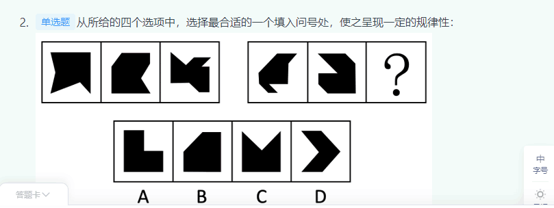
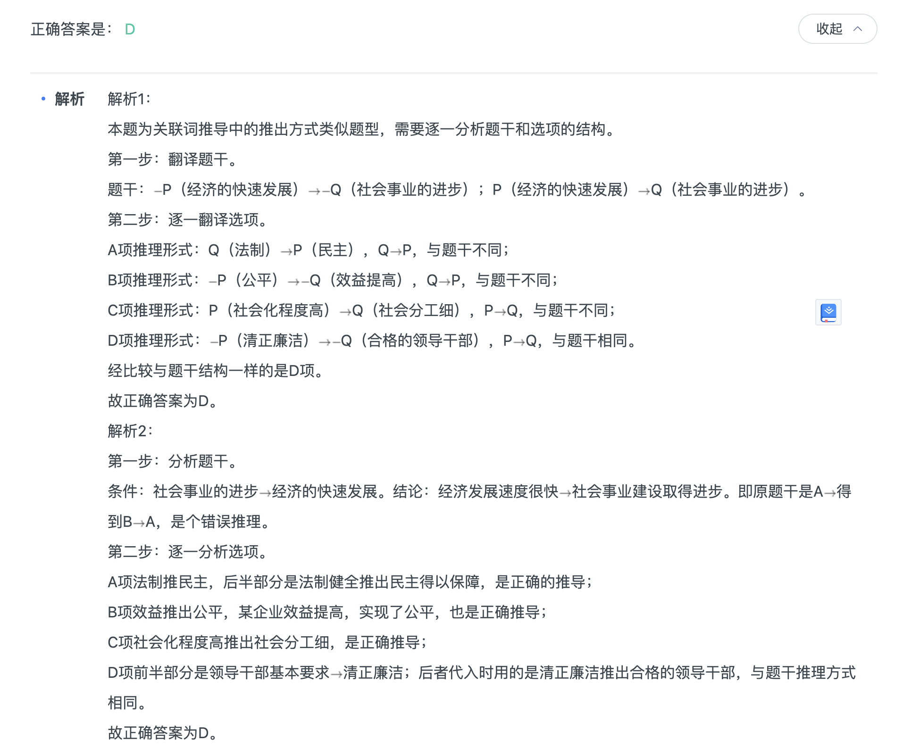

## 第一章 图形推理（54巩固强化练习没有将答案誊抄过来，以及前面有几页的题没誊抄。）
---
|  错误类型   | 统计次数  |
|  ----  | ----  |
| 位置特征（平移，旋转，反转）| 1 |
| 考图形外部的平移，和图形内部的翻转|  |
| 与原图形完全相同只是位置不同，做题的时候注意观察是属于位置样式属性数量|  |
| 样式特征（加减同异，黑白运算）| 1 |
| 元素相似看样式，并且圆形很明显分为三部分。而且三部分中图形数量不同| |
| 元素相似看样式，并且看到第三个图形旋转。所以先去异求同，再旋转180| |
| 属性特征（对称，曲直，开闭）| 1|
| 曲直：1图：外曲内直，2图：外直内曲 3图：外曲内直 4图：外直内曲 5图：外曲内直 |
| 数量特征（点，线，面，角，素） | 3 |
| 数量特征-点特征 | 1|
| 点分为：交点个数 和 端点个数：本题考交点个数| |
| 数量特征-线特征 | 3 |
| 线：分为曲线个数和直线个数：本题考曲线的个数|  |
| 数量特征-面特征 | 1 |
| 面：有时候不是考面的个数，而是问含有面的数字有几个 |  |
| 数量特征-角特征 | 1 |
| 角：1.不要因为角属于对角，就不数那个角。还是要数的。2. 有可能考的是锐角的个数 |  |
| 数量特征-素特征 | 1 |
| 素：三角形可以两个拼接成的也算。素的种类。 |  |
| 素：部分数 |  |
### 01 图形推理概述


### 02 数量类

- 01(做到数量规律的时候，不要凭借感觉做题。而是要从点线面角素，一个一个往下找。)

<!--  -->

```
P5-例1
```

- 02(1928这个数字，含有面的数字有两个。)


```
P12-例2

有时候不是考面的个数，而是问含有面的数字有几个

```
- 03(素的种类。)


```
P13-例2
考的是三角形的个数，一次呈现递增趋势。（三角形可以两个拼接成的也算。素的种类。）
```
- 04(1.不要因为角属于对角，就不数那个角。还是要数的。2. 有可能考的是锐角的个数)


```
P：14-例3

```
- 04(1.部分数)


```
P：14-例5

```
- 05(直线与曲线的交点，成递增关系)


```
P：50-12题

```
### 03 位置类


- 01(考图形外部的平移，和图形内部的翻转。)


```
P16-例3

考图形外部的平移，和图形内部的翻转

```
- 02(与原图形完全相同只是位置不同，做题的时候注意观察是属于位置样式属性数量。)


```
P17-例2


```

### 04 样式类

- 01(元素相似看样式，并且圆形很明显分为三部分。而且三部分中图形数量不同)


```
P24-例2


```
- 02( 元素相似看样式，并且看到第三个图形旋转。所以先去异求同，再旋转180)


```
P24-例2


```

### 05 属性类

- 01(1图：外曲内直，2图：外直内曲 3图：外曲内直 4图：外直内曲 5图：外曲内直。。。。)


```
P24-例2


```
### 06 功能类
- 01(标记：)


```


```
### 07 重构类

- 01(不太会)


```
P35 例5


```
- 02(不太会)


```

P37 举一反三例1

```
- 03(不太会)


```

P38举一反三例2

```
- 04(标记：做标记，从点到点垂直)


```

P42举一反三例3

```
- 05(不太会)


```

P44例3

```
- 06(折成正六边形)


```

P44例4

```
- 06(都是体育运动)


```

P44例6

```

- 07(特殊六面体重构不太会)


```
P：50-13题

```
- 08(不太懂)


```
P：44-3题

```
- 09(图形拼合：找特殊图形拼接)


```
P：52-18题

```
- 10(图形拼合：找特殊图形拼接)


```
P：52-19题

```


### 08 立体视图类
### 09 新考点专练

## 第二章 定义判断
---

### 定义判断
### 单定义判断

- 01（1. 记住这种题要找主客体，修饰词，原因经过结果等。2. 标出这五六种然后对照你觉得可疑的C项，从题目往选项对应1，2，3，4，5.你会发现对不上表面降幅很大。因为不涨价属于不明确。而且也不符合表面降幅很大）

```
假摔式降费：指企业在外部压力之下采取的一些表面降幅很大，实际上并未惠及广大消费者的调价策略。

下列属于假摔式降费的是：

A

在“双十一”价格大战中，某知名家电企业大幅调整了多种产品的零售价格，一周内，这些产品在全城各大商场均纷纷售罄

B

某城市的几家大商场为了抢占节日市场，联手采用打折促销的手段，消费人数呈上升之势

C

为落实上级有关部门的降费要求，某运营商很快公布了夜间国际漫游降低费用的具体方案

D

根据上级规定，某旅游景区在其官网上发布了不涨价承诺，游客们很快发现其中的不少景点本来就是免费景点


正确答案是： C收起
解析
第一步：找到定义关键词。

关键词为“企业”、“降幅很大”、“实际上并未惠及广大消费者的调价策略”。

第二步：逐一分析选项。

A项：家电企业大幅调整价格后其惠及的群体是各大商场的购买者，消费者能够得到实际的好处，与题干定义关键词不符，排除；

B项：几家大商场联手打折促销，惠及的群体是“上升趋势的消费人数”，实际上惠及了大量消费者，与题干定义关键词不符，排除；

C项：降低夜间国际漫游费用，体现了定义中的关键词“降幅”，但是降价之后有没有人会在夜间使用国际漫游，或者说有没有消费者得到实际的好处是不确定的，保留；

D项：不涨价承诺并未体现“降幅”，与题干定义关键词不符，排除。

对比选项：A、B两项中的消费者都明确地获得了实际的好处，C项中的消费者有没有获得实际好处是不明确的，此时对比也只能选择C项。

故正确答案为C。
```

- 02（考的是自发反应常识：一定的温度、一定的压强是反应所需要的条件。常温常压下实际上无法觉察到反应的发生，只有在高温、高压、催化剂存在下，才有实际的应用价值。，“外界帮助”指的是对体系做“有用功”。例如，水的分解在常温常压下是不自发的，但通电，为体系提供电能，可以使水分解成H2和O2 。电解反应都是非自发反应,“通电”对体系做有用功）

```

化学中的自发反应是指在给定条件下不需要外加能量就能自动进行的反应。在自发反应过程中有可能需要外加能量，但外加能量的目的不是改变“给定条件”，而是维持“给定条件”。

根据上述定义，下列不属于自发反应的是：

A

作催化剂加入中，发生催化反应，产生和


B

100kPa条件下，将加热到900℃，分解生成和


C

在通电的情况下产生和


D

植物在光照条件下发生光合作用


正确答案是： C收起
解析
A选项中的催化剂，B选项中的加热，C选项中的通电，D选项中的光合作用，都是外加能量，要想选一个不属于“自发反应”的选项，根据题干，需要判定哪一个外加能量属于改变条件，而非维持条件。比较四个外加能量，催化剂是用来加速催化的，而光合、加热和通电相比，只有“通电”是无法自然形成的，相比较而言更属于改变条件的范畴。

本题为选非题，故正确答案为C。

注：从化学常识角度而言，其实B项的加热，D项的光合作用在某些情况下也属于非自发反应，但是通电一定不属于自发反应，只要通电停止，反应也会立刻停止。也就是说，BD有可能符合定义，也有可能不符合定义，但是C一定不符合定义，故相比较而言，正确答案也是C选项。

考点

```
- 03（没有想到3属于行政追偿，虽然没有明确说追偿两个字，但是让那个刑警赔偿了就是追偿）

```
定义：

①行政赔偿：行政主体违法实施行政行为，侵犯相对人合法权益造成损害时由国家承担的一种赔偿责任。

②行政补偿：国家行政机关及其工作人员在管理国家和社会公共事务的过程中，因合法的行政行为给公民、法人或其他组织的合法权益造成了损失，由国家依法予以补偿的制度。

③行政追偿：行政赔偿义务机关代表国家向行政赔偿请求人支付赔偿费用后，依法责令有故意或重大过失的组织和个人承担部分或全部赔偿费用的法律制度。

例证：

（1）李某的宅基地被国家征用，获得各种补偿款六万元。

（2）某城建执法大队在拆除违章建筑时损害了相邻的合法建筑，后执法大队私下对房屋所有人进行了赔偿。

（3）刑警赵某对疑犯刑讯逼供造成重伤，公安机关对当事人进行赔偿之后，责令赵某承担部分医疗费用。

符合上述三种定义之一的例证有几个？

A

0

B

1

C

2

D

3


正确答案是： C收起
解析
第一步：抓住每个定义中的关键词。

行政赔偿的关键词是“行政主体违法”、“由国家赔偿”；行政补偿的关键词是“合法的行政行为”；行政追偿的关键词是“行政赔偿义务机关代表国家……责令有故意或重大过失的组织和个人承担”。

第二步：逐一判断选项。

例证（1）中，国家行政机关实施合法的行政行为，并给予李某补偿，属于行政补偿；

例证（2）中，执法大队对合法建筑造成损害，给予赔偿时采取私下解决的办法，不符合“由国家承担”赔偿的制度，不属于行政赔偿；

例证（3）中，公安机关给予当事人赔偿，并责令赵某承担部分费用，属于行政追偿。

综上所述，符合题干三种定义之一的例证有2个。

故正确答案为C。
```
- 04（这个也是要对着定义，建议看下视频）

```
  形容词的意动用法，即表示主观上认为（觉得）宾语所表示的事物具有这个形容词所表示的性质或状态，而名词的意动用法，是把名词后面的宾语所代表的人或事物看作这个词所代表的人或事物。

根据上述定义，下列选项含有名词意动用法的是：

A

孔子登东山而小鲁，登泰山而小天下

B

白求恩同志不远万里，来到中国

C

滕公奇其言，壮其貌，释而不斩

D

吾渔樵于江渚，侣鱼虾而友麋鹿


正确答案是： D收起
解析
第一步：找出定义关键词。

形容词的意动用法：主观上认为（觉得）宾语所表示的事物具有这个形容词所表示的性质或状态；

名词的意动用法：名词后面的宾语所代表的人或事物看作这个词所代表的人或事物。

第二步：逐一分析选项。

A项：出自《孟子·尽心上》，意为孔子登上了东山，觉得鲁国变小了，登上了泰山，觉得天下变小了，“小鲁”和“小天下”的主语是孔子，主观上认为鲁和天下小的状态，是形容词的意动用法，不符合定义，排除；

B项：句中的“不远万里”即不以万里为远，是形容词的意动用法，不符合定义，排除；

C项：出自《淮阴侯列传》，意为腾公认为（韩信）的言谈新奇，（认为他的）外貌壮美，释放了而没有斩他，“奇其言，壮其貌”的主语是滕公，宾语是“其言”“其貌”，主观上认为他的言谈新奇，外貌壮美，是形容词的意动用法，不符合定义，排除；

D项：出自《前赤壁赋》，意为我和你在江中的小岛上捕鱼砍柴，和鱼虾做伴侣，与麋鹿当朋友，宾语是“鱼虾”和“麋鹿”，以“鱼虾”和“麋鹿”作为伴侣和朋友，符合“名词后面的宾语所代表的人或事物看作这个词所代表的人或事物”，符合定义，当选。

故正确答案为D。
```
- 05（对比一下定向调控，它更符合多领域。针对不同主体，而不是针对特点。）

```

定向调控指政府针对不同调控领域，制定清晰明确的调控政策，使调控更具针对性。相机调控指政府根据市场情况和各项调节措施的特点，灵活决定当前应采取哪一种或几种政策措施，重在“预调、微调”。定向调控是“做什么”，相机调控是“怎么做”。

根据上述定义，下列属于相机调控的是：

A

甲国政府于年初提出了经济增长率和就业水平的“下限”、物价涨幅的“上限”等工作目标

B

乙国政府提出“双引擎”策略：一是对小微企业、“三农”等市场主体“减负”；二是支持公共产品、公共服务建设，拉动投资。由各地制定具体措施

C

丙国政府根据一二三四线城市房地产市场的不同特点，制定了有针对性的契税、房贷政策

D

丁国政府实行产品和服务的生产及销售完全由自由市场的自由价格机制所引导、产权明晰的经济政策


正确答案是： C收起
解析
第一步：找出定义关键词。

定向调控：“政府针对不同调控领域”、“制定清晰明确的调控政策，使调控更具针对性”、“做什么”；

相机调控：“政府根据市场情况和各项调节措施的特点”、“灵活决定当前应采取哪一种或几种政策措施”、“预调、微调”、“怎么做”。

第二步：逐一分析选项。

A项：甲国政府提出的工作目标属于清晰明确的调控政策，是属于“做什么”而非“怎么做”，符合“定向调控”定义，不符合“相机调控”定义，排除； 

B项：乙国政府的“双引擎”策略涉及了小微企业、“三农”、公共产品等不同调控领域，“制定清晰明确的调控政策，使调控更具针对性”，符合“定向调控”定义，不符合“相机调控”定义，排除；

C项：丙国政府根据不同城市房地产市场的不同特点制定政策，符合“政府根据市场情况和各项调节措施的特点”、“灵活决定当前应采取哪一种或几种政策措施”，符合“相机调控”定义，当选；

D项：“完全由自由市场的自由价格机制所引导”说明没有涉及政府调控，不符合任何一个定义，排除。

故正确答案为C。

注——本题出处如下：

定向调控和相机调控是2016年《政府工作报告》出现的词汇，指为应对持续加大的经济下行压力，政府在区间调控基础上，实施定向调控和相机调控。

“相机调控”强调政府要根据市场情况和各项调节措施的特点，灵活机动地决定和选择当前究竟应采取哪一种或哪几种政策措施。所以说相机调控很重要的就是要“预调、微调”。对于不同的地区和不同的产业，政府出台的政策应该是有差别的。例如房地产市场就出现了分化现象，政府根据一二三四线城市房地产市场的不同特点，制定了有针对性的契税房贷政策。

定向调控的要求，财政加大对“三农”、小微企业、服务业、新兴产业等实体经济关键领域和薄弱环节的支持力度，并完善机制，防范化解债务风险；货币政策方面，实施定向降准，运用信贷政策支持再贷款，运用抵押补充贷款工具，着力推动解决企业融资成本高问题。
```
- 06（c项只给了羊，并不代表发展了什么农产业）

```
造血式扶贫：指政府部门或社会力量通过持续性地扶持农村产业发展，拓宽农产品销售及消费渠道等，帮助贫困地区、贫困人口增收脱贫的扶贫方式。

下列属于造血式扶贫的是

A

某县按照“东部林果、旅游，西部设施农业”的整体思路，一直坚持“”的产业发展模式，使农民年收入翻了一番，人均达到近万元


B

某县扶贫办组织了200多名山区农民，经过严格培训，输送到东南沿海城市工作。这些农民每月都按时寄钱回家，家里的日子越过越红火


C

县农科所资助某村贫困家庭100头种羊，多次对他们进行科学养羊技术培训，并安排技术人员进行“一对一”的专业指导


D

为了解决全村苹果严重滞销的问题，村里的几个年轻人共同开办了一个水果直销网店。不到半月时间，所有苹果就销售一空


正确答案是： A收起
解析
第一步：找出定义关键词。

“政府部门或社会力量”、“持续性地扶持农村产业发展，拓宽农产品销售及消费渠道”、“帮助贫困地区、贫困人口增收脱贫”。

第二步：逐一分析选项。

A项：某县符合“政府部门或社会力量”，一直坚持“”的产业发展模式，符合“持续性地扶持农村产业发展，拓宽农产品销售及消费渠道”，使农民年收入翻了一番，人均达到近万元，符合“帮助贫困地区、贫困人口增收脱贫”，符合定义，当选；

B项：某县扶贫办组织了200多名山区农民，经过严格培训，输送到东南沿海城市工作，不符合“持续性地扶持农村产业发展，拓宽农产品销售及消费渠道”，不符合定义，排除；

C项：县农科所资助某村贫困家庭100头种羊，多次对他们进行科学养羊技术培训，不符合“持续性地扶持农村产业发展，拓宽农产品销售及消费渠道”，不符合定义，排除；

D项：为了解决全村苹果严重滞销的问题，村里的几个年轻人共同开办了一个水果直销网店，不符合“政府部门或社会力量”，且没有提到贫困，不符合“帮助贫困地区、贫困人口增收脱贫”，不符合定义，排除。

故正确答案为A。
```
- 07（B项没有体现多次）

```
纯粹接触效应也被称之为只看效应，是指个体接触一个刺激的次数越频繁，对该刺激就越喜欢的现象。纯粹接触效应是影响个体和社会偏好的一种非常简单但却是非常重要的方式。

根据上述定义，以下符合纯粹接触效应的是：

A

小秦喜欢穿颜色鲜艳的衣服，张教授上课时常能注意到她。硕士研究生面试时，在条件类似的几个学生中，张教授最终选择了小秦

B

小柯想给妈妈买一份营养品，面对琳琅满目的营养品，他选择了在电视上看到的那个以品质安全著称的品牌

C

小芳经人介绍认识了高大帅气的小李，一见钟情，随着两人交往逐渐深入，小芳对小李越来越喜欢

D

小霞看到自己喜欢的明星穿着某品牌的衣服，作为“铁杆粉丝”，她对这个品牌也越来越喜欢


正确答案是： A收起
解析
第一步：找出定义关键词。

 “个体接触一个刺激的次数越频繁，对该刺激就越喜欢的现象”。 

第二步：逐一分析选项。

A项：小秦喜欢穿颜色鲜艳的衣服，张教授上课时常能够注意到她，体现了张教授经常接触衣服颜色的刺激；硕士研究生面试时，在条件类似的几个学生中，张教授最终选择了小秦，体现了接触刺激越频繁也就越喜欢，符合“个体接触一个刺激的次数越频繁，对该刺激就越喜欢的现象”，符合定义，当选； 

B项：小柯选择了在电视上看到的那个以品质安全著称的品牌，小柯选择该品牌是由于其广告语，没有体现小柯多次接受刺激，不符合“个体接触一个刺激的次数越频繁，对该刺激就越喜欢的现象”，不符合定义，排除；

C项：小芳对小李越来越喜欢的原因是两人交往逐渐深入，而不是接触刺激的次数频繁，不符合“个体接触一个刺激的次数越频繁，对该刺激就越喜欢的现象”，不符合定义，排除；

D项：小霞喜欢某品牌衣服的原因是看到自己喜欢的明星穿着某品牌的衣服，而不是接触刺激的次数频繁，不符合“个体接触一个刺激的次数越频繁，对该刺激就越喜欢的现象”，不符合定义，排除。

故正确答案为A。

视频
会员专享会员专享，观看解析视频请开通会员立即开通

```
- 08（说不是行为，只是言语）

```
化是指通过改变环境的刺激因素来增强、减弱或消除某种行为的过程和方法。其中直接强化是指个人因直接表现出应当受到强化的行为而受到强化的过程。替代性强化是指个人因观察到他人的行为而受到强化的过程。自我强化是指个人的行为达到自己设定的标准时，以自己能支配的报酬来强化自己的过程。

根据上述定义，下列属于替代性强化的是：

A

人云亦云

B

杀一儆百

C

论功行赏

D

小惩大诫


正确答案是： B收起
解析
第一步：找出定义关键词。

替代性强化：“个人因观察到他人的行为而受到强化”；

第二步：逐一分析选项。

A项：“人云亦云”是指人家怎么说，自己也跟着怎么说，并没有行为上的强化，不符合“个人因观察到他人的行为而受到强化”，不符合定义，排除；

B项：“杀一儆百”是指处死一个人，借以警戒许多人，被警戒的人行为改变，也是减弱的一种强化，符合“个人因观察到他人的行为而受到强化”，符合定义，当选；

C项：“论功行赏”是指按功劳的大小给予奖赏，即自己作出了贡献，理应根据自己贡献的大小受到奖赏，符合“个人因直接表现出应当受到强化的行为而受到强化”，属于直接强化，不属于替代性强化，排除；

D项：“小惩大诫”是指有小过失就惩戒，使受到教训而不致犯大错误，不符合“个人因观察到他人的行为而受到强化”，不符合定义，排除；

故正确答案为B。
```
- 09（首先注意社会发展问题包括两方面：社会发展，问题。像雾霾情况属于社会发展中遇到的问题。但是领导视察，马航家属善后，报道该地是否有投资价值。不属于问题。或者是社会发展。）

```

深度报道作为传统的新闻形式，指新闻工作者以社会发展现实问题为主要内容，以分析解释的科学方法进行报道，维护公众利益，引导舆论。深度报道不管如何定义，都离不开社会性和深刻性的两大关键点。

根据上述定义，以下属于深度报道的是：

A

某记者对雾霾天气进行系统调查，在媒体上发布了一个半小时的新闻报道

B

某电视台晚间新闻中，对某部长到某地视察进行报道

C

多家报纸和网站针对马航MH370坠机事件的家属善后工作进行跟踪报道

D

某报纸刊出了对某市的报道，解释为什么该地值得投资


正确答案是： A收起
解析
第一步：找出定义关键词。

“社会发展现实问题”、“分析解释的科学方法”、“维护公众利益，引导舆论”、“社会性”、“深刻性”。

第二步：逐一分析选项。

A项：雾霾问题是社会发展现实问题，系统的调查是一种分析解释的科学方法，且对雾霾进行系统调查有利于维护公众的利益，可以体现出社会性和深刻性，因此符合定义，当选；

B项：某部长到某地视察，这是一个新闻事件，并不是社会发展的现实问题，也不能体现出分析解释的科学方法，因此不符合定义，排除；

C项：马航MH370坠机事件的家属善后工作不属于社会发展现实问题，跟踪报道也体现不出分析解释的科学方法，因此不符合定义，排除；

D项：该报纸只是在解释某市为什么值得投资，并不是一个社会发展现实问题，因此不符合定义，排除。

故正确答案为A。
```

- 10(C娱乐记者出于工作需求，而不是过度追捧的需求。D废寝忘食地观看属于过度崇拜。)

```
粉丝文化：指个人或者群体出于对某一特定对象的追捧心理，所引发的过度崇拜、过度消费、无偿付出等社会文化现象。

下列不属于粉丝文化的是：

A

某位学者在电视台成功地举办了多次讲座，从此以后，他上课的教室外边常常挤满了慕名而来请求签名、合影的学生、市民

B

为了让歌手小杨在选秀节目中脱颖而出，许多陌生的年轻人自发组织起来，天天台前幕后地拉选票、拉赞助，忙得不亦乐乎

C

小张是一家娱乐类刊物的记者，他的主要任务是报道演艺圈的动态消息。有时为了追踪一个明星，甚至连饭都顾不上吃

D

小丽是《舌尖上的中国》的忠实观众，她把每一期节目都下载到自己的电脑中反复观看，经常到废寝忘食的地步


正确答案是： C收起
解析
第一步：找出定义关键词。

“出于对某一特定对象的追捧心理”、“过度崇拜、过度消费、无偿付出等”。

第二步：逐一分析选项。

A项：慕名而来请求签名、合影的学生和市民是出于对学者的追捧心理，对学者的支持、喜爱是一种无偿付出，符合定义，排除；

B项：陌生人自发组织为歌手小杨拉选票、拉赞助是出于对小杨的追捧心理引发的无偿付出的现象，符合定义，排除；

C项：小张追踪明星是出于工作需要，并不是对明星的追捧，不符合定义，当选；

D项：小丽是《舌尖上的中国》的忠实观众，看节目废寝忘食是出于对节目的追捧心理所引发的过度崇拜的现象，符合定义，排除。

本题为选非题，故正确答案为C。
```

### 多定义判断

## 第三章 
----

### 类比推理

- 01（从左边往右边看词：美丽可以用沉鱼落雁表示。但是灵活不一定用身手敏捷，厌恶，但是嗤之以鼻准确意思是瞧不起。三心二意也不是粗心的意思。而是意志不坚定。）

```
美丽：沉鱼落雁

A

独特：举世无双

B

灵活：身手敏捷

C

厌恶：嗤之以鼻

D

粗心：三心二意


正确答案是： A收起
解析
第一步：判断题干词语间逻辑关系。

沉鱼落雁，鱼见之沉入水底，雁见之降落沙洲，可以形容女子容貌极其美丽。沉鱼落雁比美丽的程度更深。

第二步：判断选项词语间逻辑关系。

A项：举世无双，是指全世界找不到第二个，可以形容人或事物极其独特。举世无双比独特的程度更深，与题干逻辑关系一致，当选；

B项：灵活可以形容敏捷，不呆板。灵活和身手敏捷并不存在程度上的差异，且身手敏捷并非成语，而题干第二个词为成语，因此与题干逻辑关系不一致，排除；

C项：嗤之以鼻，用鼻子吭声冷笑，表示轻蔑，不能用来形容厌恶，与题干逻辑关系不一致，排除；

D项：三心二意，又想这样又想那样，犹豫不定。常指不安心，不专一，不能用来形容粗心，与题干逻辑关系不一致，排除。

故正确答案为A。

```
- 02（常识：台历（Desk calendar），指放在桌子上的日历。 ）

```

吊灯  对于（  ）  相当于  台历  对于（  ）

A

屋顶：墙壁

B

墙壁：客厅

C

客厅：桌子

D

屋顶：桌子


正确答案是： D收起
解析
逐一代入选项。

A项：吊灯安装在屋顶之上，为对应关系，台历与墙壁无明显的逻辑关系，墙壁对应的应该是挂历，前后逻辑关系不一致，排除；

B项：吊灯与墙壁无明显逻辑关系，与墙壁为对应关系的是壁灯，台历可以放在客厅中，为对应关系，前后逻辑关系不一致，排除；

C项：吊灯在客厅中，为场所的对应，台历在桌子上，但桌子不是场所，不是场所的对应，前后逻辑关系不一致，排除；

D项：吊灯可直接安装在屋顶上，台历可直接放置在桌子上，都为直接接触物品的对应关系，前后逻辑关系一致，当选。

故正确答案为D。
```
- 03（刘备三顾茅庐诸葛亮。廉颇负荆请罪。1093年，游酢、杨时冒着大风雪来到程家，正好程颐在打旽，游定夫与杨时不敢打扰程夫子，只得毕恭毕敬站在旁边守候，等程夫子醒来时，门外积雪已一尺厚了，这便是“程门立雪”的故事，千古流传，成为尊师重道之佳话。宋太宗在滴水成冰的寒冬能想到给鳏寡孤独及贫穷者送炭，不仅想得细致，想得周到，而且将这种怜爱苍生的想法及时付诸了实践。成语告诉人们，在别人危难的时刻，应该及时的给予帮助。）

```
三顾茅庐∶刘备

A

负荆请罪：蔺相如

B

请君入瓮：周兴

C

雪中送炭：宋太宗

D

程门立雪：程颐


正确答案是： C收起
解析
第一步：判断题干词语间逻辑关系。

在三顾茅庐的典故中，刘备为典故的主体，诸葛亮为典故的客体。

第二步，判断选项词语间逻辑关系。

A项，蔺相如为负荆请罪的客体，主体为廉颇，排除；B项，周兴为请君入瓮的客体，主体为来俊臣，排除；C项，雪中送炭的主体为宋太宗，与题干逻辑关系相符，当选；D项，程颐为程门立雪的客体，主体为杨时，排除。

故正确答案为C。

```
- 04（常识：著作是书的一种，书组成了丛书）

```

我以出版社（或出版集团）为目，择要列举若干丛书。（排名不分先后）暂不收录个人文集或全集，因个人文集或全集只需按人名搜索即可快速找到。另外，我原本只想借这个机会为自己汇总一些优秀丛书，日积月累，随时补充。在此过程中，我也采纳了本问题下其他几位答主的优秀回答，谨致谢意。----------------------------以下正文-------------------------------
商务印书馆汉译世界学术名著丛书·
哲学汉译世界学术名著丛书·
历史地理汉译世界学术名著丛书·
政治法律社会汉译世界学术名著丛书·
经济汉译世界学术名著丛书·语言学


著作：书：丛书

A

成语：词语：词汇

B

树：树林：森林

C

裙子：衣服：服装

D

人：人群：人民


正确答案是： A收起
解析
第一步：判断题干词语间逻辑关系。

著作是书的一种，丛书是指由很多书汇编成集的一套书，且书是构成丛书的唯一要素。前两者为种属关系，后两者为组成关系。

第二步：判断选项词语间逻辑关系。

A项，成语是词语的一种，二者为种属关系；词汇是指特定范围下的一类词语的总和，二者为组成关系，且词语是构成词汇的唯一要素，与题干逻辑关系一致，当选；

B项，树与树林非种属关系，二者为组成关系，与题干逻辑关系不一致，排除；

C项，服装与衣服是种属关系，但服装的构成，还包括帽子、领带等装饰物件，衣服不是唯一要素，与题干逻辑关系不一致，排除；

D项，人与人群非种属关系，而为组成关系，与题干逻辑关系不一致，排除。

注：此题考点有争议，关于“著作和书”的关系，如果去深究“著作”的定义，是指著作的成品，这个成品并不一定是书，所以“著作和书”也可以看成交叉关系；

A项的“成语和词语”，如果是16字的成语，例如“智者千虑必有一失，愚者千虑必有一得”，就不能说这句话是词语了，故也可以看成交叉关系。

综上所述，类比两词之间的关系确实不唯一，会存在争议，出题人具体想考啥，还需要具体题目具体分析，哪个考点有答案优先选哪个。

故正确答案为A。


```
- 05（做题时候，一定要从语义关系，逻辑关系，语法关系做。这里是属于并列关系。A是交叉关系。）

```
火炬：蜡烛

A

中药：草药

B

矿石：煤炭

C

棉布：丝绸

D

扇子：蚊香


正确答案是： C收起
解析
第一步：判断题干词语间逻辑关系。

“火炬”和“蜡烛”都可以用来照明，二者为并列关系。

第二步：判断选项词语间逻辑关系。

A项：“草药”专指植物类的药物，“中药”指以中国传统医药理论指导并应用的药物，二者为交叉关系，与题干逻辑关系不一致，排除；

B项：“矿石”是指含有用矿物并有开采价值的岩石，“煤炭”是一种固体可燃性矿物，二者没有明显逻辑关系，与题干逻辑关系不一致，排除；

C项：“棉布”和“丝绸”都可以用来制作衣服，二者为并列关系，与题干逻辑关系一致，当选；

D项：扇子是纳凉的工具，蚊香是驱蚊的工具，二者没有明显的逻辑关系，与题干逻辑关系不一致，排除。

故正确答案为C。

```
- 06（最后第三个词能概括，前两个词的两方面。“满意”只描述了“心满意足”一方面，另一方面“贪心不足”无法体现，与题干逻辑关系不一致。“言之凿凿”形容说话有证据，“口说无凭”指单凭口说，没有证据，二者是反义词关系）

```
言而有信：言而无信：承诺

A

童叟无欺：明码实价：交易

B

心满意足：贪心不足：满意

C

言之凿凿：口说无凭：证据

D

文思泉涌：搜索枯肠：知识


正确答案是： C收起
解析
第一步：判断题干词语间逻辑关系。

“言而无信”与“言而有信”是反义关系，并且分别描述“承诺”的两个方面。

第二步：判断选项词语间逻辑关系。

A项：“明码实价”和“童叟无欺”是近义关系，都是指买卖公平，并非“交易”的两个方面，与题干逻辑关系不一致，排除；

B项：“满意”只描述了“心满意足”一方面，另一方面“贪心不足”无法体现，与题干逻辑关系不一致，排除；

C项：“言之凿凿”形容说话有证据，“口说无凭”指单凭口说，没有证据，二者是反义词关系，且都是描述“证据”的两个方面，与题干逻辑关系一致，当选；

D项：“文思泉涌”是指行文思路像泉水奔涌那样迅速、丰富，“搜索枯肠”形容写作思路贫乏、竭力思索的样子，两词讲的是有无写作思路，并不是有无“知识”，与题干逻辑关系不一致，排除。

故正确答案为C。

```
- 07（水：火是反对关系，但不是反义关系）

```
水：火

A

美：丑

B

有：无

C

左：右

D

红：绿


正确答案是： D收起
解析
第一步：判断题干词语间逻辑关系。

金木水火土，水与火两者属于并列中的反对关系。

第二步：判断选项词语间逻辑关系。

A项：美与丑属于并列中的反对关系，保留；

B项：有与无属于并列中的矛盾关系，与题干逻辑关系不一致，排除；

C项：左与右属于并列中的反对关系，保留；

D项：红与绿属于并列中的反对关系，保留。

比较A、C、D三项，题干中水、火是反对关系，但不是反义关系。而A项中的美、丑，C项中的左、右都是反义关系，D项中的红、绿只是反对关系，不是反义关系，与题干逻辑关系更一致。

故正确答案为D。
```
- 08（常识：葛藤与葛根都是野葛的组成部分，二者均为并列关系）

```
莲蓬 对于（  ）相当于（  ）对于 葛根


A

荷叶；葛藤

B

荷花；葛粉

C

喜爱；纠缠

D

荷塘；山岗


正确答案是： A收起
解析
逐一代入选项。
A项：莲蓬与荷叶都是荷花的组成部分，葛藤与葛根都是野葛的组成部分，二者均为并列关系，前后逻辑关系一致，当选；
B项：莲蓬是荷花的组成部分，二者为组成关系；葛根是葛粉的原材料，二者为原材料的对应关系，前后逻辑关系不一致，排除；
C项：喜爱莲蓬，二者为动宾关系；纠缠和葛根不是动宾关系，且前后顺序相反，前后逻辑关系不一致，排除；
D项：荷塘里有莲蓬，山岗里有葛根，二者均为地点的对应关系，但前后顺序相反，前后逻辑关系不一致，排除。
故正确答案为A。
```
- 09（纲举目张：提起渔网的总绳一撒，所有网眼就都张开了。比喻做事抓住要领，就可带动其他环节；也比喻文章条理分明。因果关系。“惩前”指警戒之前犯的错误，“毖后”指以后谨慎，不致再犯，“惩前”的目的是“毖后”，二者是方式目的对应，）

```
唇亡：齿寒

A

安居：乐业

B

纲举：目张

C

开卷：有益

D

惩前：毖后


正确答案是： B收起
解析
第一步：判断题干词语间逻辑关系。

“唇亡”指嘴唇没有了，“齿寒”指牙齿就会寒冷，即因为“唇亡”，所以“齿寒”，二者为因果对应关系。

第二步：判断选项词语间逻辑关系。

A项：“安居”指安定的住在一起，“乐业”指愉快地从事自己的职业，二者为并列关系，与题干逻辑关系不一致，排除；

B项：“纲举”指提起鱼网上面的总绳，“目张”指一个个网眼都张开，即提起大绳子来，就能让一个个网眼张开了。因为“纲举”，所以“目张”，二者为因果对应关系，与题干逻辑关系一致，当选；

C项：“开卷”指打开书本读书，“有益”指有好处有收获，指的是读书总会有好处的。题干是两件事情之间的因果关系，而C项只有读书一件事，有益是读书本身的效果，二者不是因果关系，与题干逻辑关系不一致，排除；

D项：“惩前”指警戒之前犯的错误，“毖后”指以后谨慎，不致再犯，“惩前”的目的是“毖后”，二者是方式目的对应，与题干逻辑关系不一致，排除。

故正确答案为B。
```
- 10（常识：湄公河是一条跨境河。是种属关系。西欧：英国、法国、荷兰等国家现代民主政治发展较早，经济水平较高。西欧与英国是组成关系。东欧：一般指波兰、捷克、斯洛伐克、匈牙利、罗马尼亚、保加利亚、阿尔巴尼亚等国家。）

- 11（如果不确定第二种解决方法，那么可以从他们的属性上找。比如都遇到了自然灾害。）

```
暴雨：洪灾：排涝

A

炎热：干旱：减产

B

假日：拥堵：疏导

C

路滑：摔倒：骨折

D

地震：伤亡：救助


正确答案是： D收起
解析
第一步：判断题干词语间逻辑关系。

暴雨可能会导致洪灾，二者是因果对应，且暴雨是自然灾害；排涝是解决洪灾的方式，二者是方式对应。

第二步：判断选项词语间逻辑关系。

A项：炎热可能会导致干旱，二者是因果对应；干旱可能会导致减产，二者是因果对应，与题干逻辑关系不一致，排除；

B项：假日可能会导致拥堵，二者是因果对应，但是概率很小，且假日也不是自然灾害，与题干逻辑关系不一致，排除；

C项：路滑可能会让人摔倒，二者是因果对应；摔倒可能会导致骨折，二者是因果对应，与题干逻辑关系不一致，排除；

D项：地震可能会导致伤亡，二者是因果对应，且地震是自然灾害；救助是解决地震伤亡的方式，二者是方式对应，与题干逻辑关系一致，当选。

故正确答案为D。
```

- 11（常识记住辩证统一的两个词。有它没它：市场经济需要兼顾效率与公平。组织原则需要兼顾民主与集中.）

```
效率：公平：市场经济

A

科学：理性：政治哲学

B

革命：改良：社会制度

C

民主：集中：组织原则

D

美丑：善恶：审美范畴


正确答案是： C收起
解析
第一步：判断题干词语间逻辑关系。

市场经济需要兼顾效率与公平。

第二步：判断选项词语间逻辑关系。

A项：政治哲学不需要兼顾科学与理性，且科学是理性的，与题干逻辑关系不一致，排除； 

B项：社会制度不需要兼顾革命与改良，与题干逻辑关系不一致，排除；

C项：组织原则需要兼顾民主与集中，与题干逻辑关系一致，当选；

D项：审美范畴不需要兼顾美丑与善恶，且善恶不属于审美的范畴，与题干逻辑关系不一致，排除。

故正确答案为C。

```

- 12(真伪：对错，不是一个意思。文章既要是一个意思。还有每个构词是反义构词)

```

生死：存亡

A

轻重：缓急

B

亲疏：长幼

C

真伪：对错

D

好坏：优劣


正确答案是： D收起
解析
第一步：判断题干词语间逻辑关系。

“生死”和“存亡”都表示生命的两种状态，二者是近义词，并且“生”和“存”近义，“死”和“亡”近义。

第二步：判断选项词语间逻辑关系。

A项：“轻重”侧重指力度，而“缓急”侧重指快慢，二者不是近义词，并且无汉字的对应，不符合题干逻辑关系，排除；

B项：“亲疏”一般指关系的亲近程度，而“长幼”指的是辈分的高低，二者不是近义词，并且无汉字的对应，不符合题干逻辑关系，排除；

C项：“真伪”是真假，而“对错”是事情的正确与否，二者侧重的意思不同，不是近义词，并且无汉字的对应，不符合题干逻辑关系，排除；

D项：“好坏”和“优劣”都表示一个事物的好坏两个方面，二者是近义词，并且“好”和“优”近义，“坏”和“劣”近义，符合题干逻辑关系，当选。

故正确答案为D。

```

- 13(错是因为：没有想到是词意思有两种)

```
寒：寒冷：寒舍

A

甘：甘甜：甘愿

B

恨：仇恨：怨恨

C

肤：皮肤：肌肤

D

讽：讽刺：讥讽


正确答案是： A收起
解析
第一步：判断题干词语间逻辑关系。

“寒”字有两个主要的语义：冷；穷困（有时用作谦辞）。“寒冷”一词中的“寒”指的是冷，寒舍一词中的“寒”指的是穷困。

第二步：判断选项词语间逻辑关系。

A项：“甘”字有两个主要的语义：甜，味道好；自愿，乐意。“甘甜”中的“甘”指的是甜，甘愿中的“甘”指的是自愿，与题干逻辑关系一致，当选；

B项：“仇恨”“怨恨”中的“恨”指的都是仇视的意思，与题干逻辑关系不一致，排除；

C项：“皮肤”“肌肤”中的“肤”指的都是肉体表面的皮，与题干逻辑关系不一致，排除；

D项：“讽刺”“讥讽”中的“讽”指的都是用含蓄的话讥刺，与题干逻辑关系不一致，排除。

故正确答案为A。

```

- 14(错是因为不知道两个成语的意思：师心自用：固执己见，自以为是（师心：以自己的心意为师，即只相信自己。不以为然”意思是不认为是对的。目无全牛”意思是眼中没有完整的牛，只有牛的筋骨结构，形容技艺已经到达非常纯熟的地步。不孚众望”意思是不能使大家信服，未符合大家的期望。)

```
指鹿为马：颠倒黑白

A

师心自用：固执己见

B

目无全牛：鼠目寸光

C

不以为然：不屑一顾

D

不孚众望：众望所归


正确答案是： A收起
解析
第一步：分析题干中词语的逻辑关系。

“指鹿为马”意思是指着鹿，说是马，比喻故意颠倒黑白，混淆是非。

“颠倒黑白”意思是把黑的说成白的，白的说成黑的，比喻歪曲事实，混淆是非，指鹿为马。

二者为近义词。

第二步：逐一分析选项。

A项：“师心自用”形容自以为是，不肯接受别人的正确意见，“固执己见”是指顽固地坚持自己的意见，不肯改变，二者为近义词，符合题干逻辑关系，当选；

B项：“目无全牛”意思是眼中没有完整的牛，只有牛的筋骨结构，形容技艺已经到达非常纯熟的地步，“鼠目寸光”比喻目光短浅，缺乏远见，二者不是近义词，不符合题干逻辑关系，排除；

C项：“不以为然”意思是不认为是对的，表示不同意或否定，“不屑一顾”意思是认为不值得一看，形容极端轻视，二者不是近义词，不符合题干逻辑关系，排除；

D项：“不孚众望”意思是不能使大家信服，未符合大家的期望，“众望所归”是指某人得到大家的信赖，希望他担任某项工作或完成事情，二者不是近义词，不符合题干逻辑关系，排除。

故正确答案为A。

```

- 15(常识，古文的出处)

```

讷言敏行：《论语》

A

草木皆兵：《三国演义》

B

运筹帷幄：《左传》

C

食言而肥：《史记》

D

饮鸩止渴：《后汉书》


正确答案是： D收起
解析
第一步：判断题干词语间逻辑关系。

讷言敏行出自《论语》，二者是对应关系。

第二步：判断选项词语间逻辑关系。

A项：草木皆兵出自《晋书·苻坚载记》，不是《三国演义》，与题干逻辑关系不一致，排除；

B项：运筹帷幄出自《史记·高祖本纪》，不是《左传》，与题干逻辑关系不一致，排除；

C项：食言而肥出自《左传·哀公二十五年》，不是《史记》，与题干逻辑关系不一致，排除；

D项：饮鸩止渴出自《后汉书·霍谞传》，二者是对应关系，与题干逻辑关系一致，当选。

故正确答案为D。
```

- 16(做类比不同于言语选出一个正确的，而是要多角度，比如B，A都是定语修饰名词。但是B的结构比A更工整。万里飘雪)

```
无边落木：不尽长江

A

千里冰封：万里雪飘

B

映阶碧草：隔叶黄鹂

C

晴川历历：芳草萋萋

D

山重水复：柳暗花明


正确答案是： B收起
解析
第一步：判断题干词语间的逻辑关系。

无边修饰落木，不尽修饰长江。无边作为定语修饰名词落木，不尽作为定语修饰长江，定语在前，修饰的名词在后。前后两个词语出自同一诗句“无边落木萧萧下，不尽长江滚滚来”。

第二步：判断选项词语间的逻辑关系。

选项前后的两个词句均来自同一诗句。

A项：千里修饰冰封，万里修饰雪飘，与题干逻辑关系类似，保留；

B项：映阶修饰碧草，隔叶修饰黄鹂，与题干逻辑关系一致，保留；

C项：历历意为清楚可数，萋萋意为草木长得茂盛，历历修饰晴川，萋萋修饰芳草，定语在后，修饰的名词在前，与题干逻辑关系不一致，排除；

D项：重修饰山，复修饰水，暗修饰柳，明修饰花，与题干逻辑关系不一致，排除。

对比选项A和B，发现A选项中的名词对应没有B选项对应整齐，A选项中为雪飘不是飘雪，排除A选项。

故正确答案为B。

```
- 17(这道题应该考功能比较常见。)

```

灯塔 之于 （    ） 相当于 （    ） 之于 腐败

A

暗礁：金钱

B

船只：贪官

C

导航：预防

D

危险：监督


正确答案是： D收起
解析
逐一代入验证选项。

A项：灯塔可以指示暗礁，但金钱和腐败没有直接的逻辑关系，前后逻辑关系不一致，排除；

B项：有灯塔不代表有船只，有贪官说明一定存在腐败，前后逻辑关系不一致，排除；

C项：灯塔的一个作用是导航，但预防的作用不是腐败，前后逻辑关系不一致，排除；

D项：灯塔有助于避免危险，监督有助于避免腐败，前后逻辑关系一致，当选。

故正确答案为D。
```
- 18(“安分守己”的意思是规矩老实，守本分，是人的一种生活状态；“好高骛远”比喻不切实际地追求过高过远的目标。前者说的是一种规矩老实的生活状态，后者说的是目标不切实际，两者没有必然的逻辑关系。虎头蛇尾”比喻开始时声势很大，到后来劲头很小，有始无终。不懂成语的意思。)

```
大义凛然：卑躬屈膝

A

安分守己：好高骛远

B

穷奢极欲：节衣缩食

C

得心应手：百无一能

D

持之以恒：虎头蛇尾


正确答案是： D收起
解析
第一步：判断题干词语间逻辑关系。

“大义凛然”的意思是由于胸怀正义而神态庄严，令人敬畏；“卑躬屈膝”形容没有骨气，低声下气地讨好奉承。前者是有骨气，后者是没骨气，二者为反义关系。

第二步：判断选项词语间逻辑关系。

A项：“安分守己”的意思是规矩老实，守本分，是人的一种生活状态；“好高骛远”比喻不切实际地追求过高过远的目标。前者说的是一种规矩老实的生活状态，后者说的是目标不切实际，两者没有必然的逻辑关系，排除；

B项：“穷奢极欲”的意思是奢侈和贪欲到了极点；“节衣缩食”的意思是省吃省穿，形容节约。前者是不节约，后者是节约，两者构成反义关系，保留；

C项：“得心应手”的意思是心里怎么想，手就能怎么做，比喻技艺纯熟或做事情非常顺利；“百无一能”的意思是什么都不会做。前者是做事熟练，后者是没有技艺，二者不构成反义关系，做事熟练和技艺不娴熟才是反义关系，与题干逻辑关系不一致，排除；

D项：“持之以恒”的意思是长久坚持下去；“虎头蛇尾”比喻开始时声势很大，到后来劲头很小，有始无终。前者是有毅力，后者是无毅力，构成反义关系，保留。

题干中，“大义凛然”是褒义词，“卑躬屈膝”是贬义词。对比B、D两项，B项，“穷奢极欲”是贬义词，排除；D项，“持之以恒”是褒义词，“虎头蛇尾”是贬义词，与题干的感情色彩一致，当选。

故正确答案为D。

```
- 19(类比推理，一定要想到多角度。1. 刀鞘是佩刀的一部分。2. 刀鞘是套着佩刀的。)

```
佩刀：刀鞘

A

墨：墨盒

B

火箭：发射架

C

毛笔：笔帽

D

旅游鞋：旅行包


正确答案是： C收起
解析
第一步：判断题干词语间的逻辑关系。

“佩刀”和“刀鞘”是对应关系，“刀鞘”套着“佩刀”的一部分，“佩刀”与“刀鞘”配套存在。

第二步：判断选项词语间逻辑关系。

A项：“墨”用来写字，“墨盒”是装墨水或墨粉的盒子，二者需要配套使用，但是“刀鞘”只是套着“佩刀”的一部分，而“墨”是完全装在打印机的“墨盒”里的，与题干逻辑关系不一致，排除；

B项：“火箭”与“发射架”虽然配套存在，但是“发射架”是支撑“火箭”，而非套着“火箭”，与题干逻辑关系不一致，排除；

C项：“毛笔”和“笔帽”配套存在，且“笔帽”套着“毛笔”的一部分，与题干逻辑关系一致，当选；

D项：“旅游鞋”和“旅行包”不能配套，与题干逻辑关系不一致，排除。

故正确答案为C。

```
- 20(常识：酱油是调料的一种，与调料是种属关系，调料是指调味用的佐料，调料与佐料是种属关系。调料是一种佐料。但与题干顺序不同，与题干逻辑关系不一致，排除)

```
儿童：女童：未成年

A

房屋：桥梁：建筑

B

小狗：狗崽：犬

C

佐料：酱油：调料

D

植物油：椰子油：菜籽油


正确答案是： B收起
解析
第一步：判断题干词语间逻辑关系。

女童是儿童的一种，二者是种属关系。未成年是指未满十八周岁，儿童是未成年人，二者是种属关系。

第二步：判断选项词语间逻辑关系。

A项：房屋和桥梁是并列关系，房屋和桥梁二者并列与建筑是种属关系，与题干逻辑关系不一致，排除；

B项：狗崽是指刚出生的狗，与小狗是种属关系，小狗是犬的一种，二者也是种属关系，与题干逻辑关系一致，当选；

C项：酱油是调料的一种，与调料是种属关系，调料是指调味用的佐料，调料与佐料是种属关系，但与题干顺序不同，与题干逻辑关系不一致，排除；

D项：椰子油是植物油的一种，二者是种属关系，菜籽油是植物油的一种，二者也是种属关系，但与题干顺序不同，与题干逻辑关系不一致，排除。

故正确答案为B。

```
- 21(这属于，逻辑关系。但是不属于四大块。这个是属于范围逐渐扩大。)

```

家属：亲属：家族

A

而立：不惑：古稀

B

助教：讲师：教授

C

蓝领：粉领：白领

D

事故：事变：事情


正确答案是： D收起
解析
第一步：判断题干词语间逻辑关系。

家属、亲属、家族之间概念范围逐步扩大，三者之间为逐一包容关系。

第二步：判断选项词语间逻辑关系。

A项：三者之间为并列关系，排除；

B项：三者之间为并列关系，排除；

C项：三者之间为并列关系，排除；

D项：事故、事变、事情概念范围逐步扩大，三者之间依次为包容关系，事情包含事变，事变包含事故，当选。

故正确答案为D。
```
- 22(动物的并列关系。没往那边想。)

```

海马 对于 （  ）相当于（  ） 对于 珊瑚

A

海龙：海葵

B

河马：礁石

C

木马：海螺

D

贝壳：海带


正确答案是： A收起
解析
逐一代入选项。

A项：“海马”和“海龙”都属于海龙科，二者是并列关系；“海葵”和“珊瑚”都属于珊瑚纲，二者也是并列关系，前后逻辑关系一致，当选；

B项：“海马”与“河马”都是动物，二者属于并列关系中的反对关系；“珊瑚”生长在水深100-200米平静而清澈区域内的“礁石”中，二者属于场所对应关系，前后逻辑关系不一致，排除；

C项：“海马”和“木马”之间无明显逻辑关系；“海螺”和“珊瑚”都是海洋动物，二者属于并列关系中的反对关系，前后逻辑关系不一致，排除；

D项：“贝壳”是软体动物的外壳，与“海马”无明显逻辑关系；“海带”是植物，而“珊瑚”是动物，二者无明显逻辑关系，排除。

故正确答案为A。

```

- 23(常识：因为地球在太阳和月球之间而产生月食，因为月亮在太阳和地球之间而产生日食)

```
（  ） 对 月食 相当于 （  ） 对 日食

A

太阳 地球

B

太阳 月亮

C

地球 月亮

D

火星 地球


正确答案是： C收起
解析
第一步：分析题干。

月食是自然界的一种现象，当太阳、地球、月球三者恰好或几乎在同一条直线上时（地球在太阳和月球之间），太阳到月球的光线便会部分或完全地被地球掩盖，产生月食。

日食，又叫做日蚀，是月球运动到太阳和地球中间，如果三者正好处在一条直线时，月球就会挡住太阳射向地球的光，月球身后的黑影正好落到地球上，这时发生日食现象。

第二步：将选项逐一代入，判断各选项前后部分的逻辑关系。

A项：太阳发出光线但是光线没有照射到月球，产生月食，太阳发出光线但是光线没有照射到地球产生日食，前后逻辑关系不一致，排除；

B项：太阳发出光线但是光线没有照射到月球，产生月食，太阳发出光线被月亮挡住，没有照射到地球，产生日食，前后逻辑关系不一致，排除；

C项：因为地球在太阳和月球之间而产生月食，因为月亮在太阳和地球之间而产生日食，均因为前者的位置而产生了后者的自然现象，前后逻辑关系一致，当选；

D项：火星和月食之间无明显的逻辑关系，而太阳发出光线但是光线没有照射到地球产生日食，前后逻辑关系不一致，排除。

故正确答案为C。
```
### 内涵关系（1. 对应关系 2. 属性关系（必然属性和或然属性））
- 01（ 左边是右边的必然属性）

```
水：森林：煤炭

A

雪：丰年：喜悦

B

表扬：自信：乐观

C

氮：蛋白质：智力

D

闪电：雨：打伞


正确答案是： C收起
解析
第一步：分析题干词语的逻辑关系。

水是森林存在的必要条件，森林是产生煤炭的必要条件。

第二步：逐一分析选项。

A选项：瑞雪预示着丰年，但雪不是丰年的必要条件，丰年会让人喜悦，但也不是必要条件，不符合题干逻辑关系，排除；

B选项：表扬可能会让人更有自信，自信与乐观是并列关系，不符合题干逻辑关系，排除；

C选项：氮是组成蛋白质的元素之一，没有氮，蛋白质就不存在，氮是蛋白质存在的必要条件，没有蛋白质就没有动物和人类，也不可能存在智力，蛋白质是智力存在的必要条件，符合题干逻辑关系，当选；

D选项：闪电并不是雨产生的必要条件，而是打雷的必要条件，不符合题干逻辑关系，排除。

故正确答案为C。

```
### 外延关系
### 语义关系
### 语法关系

## 逻辑判断（订了新的一本没有做完的。）

> 有些题目建议采用画图法。


### 逻辑判断概述
### 翻译推理

- 01（当时只标了1，2，3，4做题，没有文字很容易出错。）

```
某国议员认为：“只要提高工人工资就会导致通货膨胀。如果发生通货膨胀，那么人民就会遭受损失。人民遭受损失，就会使政府失去人心。政府只有得人心，国家才能和谐稳定。”

根据该议员的观点，以下除了哪项，均可以推出？

A

只要提高工人工资，政府就会失去人心

B

如果发生通货膨胀，政府就会失去人心

C

提高工人工资，且政府得人心

D

国家和谐稳定与提高工人工资不能并存


正确答案是： C收起
解析
第一步：翻译题干。

①只要提高工资就通货膨胀：只要······就······，前推后：提高工资通货膨胀；

②如果通货膨胀那么遭受损失：如果······那么······，前推后：通货膨胀遭受损失；

③遭受损失就失去人心：······就······，前推后：遭受损失失去民心；

④只有得民心国家才和谐稳定：只有······才······，后推前：和谐稳定得人心，根据逆否定理，可以得出：

⑤失去人心不和谐稳定。

第二步：逐一分析选项。

A项：由①②③可得提高工资推出失去人心，正确；

B项：由②③可得通货膨胀推出失去人心，正确；

C项：由①②③可得提高工资推出失去人心，因此提高工资与得人心不可能同时出现，错误；

D项：由①②③⑤可得提高工资不和谐稳定，故提高工资与和谐稳定不能共存，正确。

本题为选非题，故正确答案为C。
```

- 02（泛泛的或言不由衷的回答
,与含混不清或枯燥无味的话不是同一个意思，偷换概念。）

```
记者采访时的提问要具体、简洁明了，切忌空泛、笼统、不着边际。《采访技巧》一书中尖锐地剖析了“您感觉如何”等问题的弊端，认为这些提问实际上在信息获取上等于原地踏步，它使采访对象没法回答，除非用含混不清或枯燥无味的话来应付。

由此可以推出：

A

记者采访时的提问如果具体、简洁明了，就不会给采访对象带来回答的困难

B

采访对象如果没法回答提问，说明他没有用含混不清或枯燥无味的话来应付

C

采访对象只有用含混不清或枯燥无味的话来应付，才能回答“您感觉如何”等问题的提问

D

诸如“您感觉如何”这样的问题，只能使采访对象抓不住问题的要点而作泛泛的或言不由衷的回答


正确答案是： C收起
解析
本题属于关联词推导题型。

第一步：翻译题干。

除非这个关联词可翻译为否11的方式，题干最后一句话翻译为：

没法回答含混不清或枯燥无味的话来应付，即：回答含混不清或枯燥无味

第二步：逐一分析选项。

A项：记者采访时的提问如果具体、简洁明了是否能给采访对象带来回答的困难，原文当中完全没有提到过，属于无中生有的选项，排除；

B项：可翻译为：没法回答没有（含混不清或枯燥无味），否前否后，与题干的翻译形式不一致，排除；

C项：可翻译为：回答含糊不清或枯燥无味，与题干翻译形式一致，当选；

D项：选项中说因为采访对象抓不住问题的要点而作泛泛的或言不由衷的回答，题干说的含混不清或枯燥无味不等同于泛泛或言不由衷，属于概念的偷换，并且这么回答的原因是什么题干也没有提到，排除。

故正确答案为C。

```
- 03（奇怪这道题。不是谁必不可少谁在后面么？）

```

汽车行业作为制造业中技术含量、智能化程度和产业集中度较高的代表，已经成为了德国“工业4.0”的先导阵地。长期处于2.0工业思维的中国汽车制造业要在全球占有一席之地，进行技术创新与变革和拥有丰富经验的资深人才必不可少，而高薪和福利成为吸引人才的制胜法宝。

由此可以推出：

A

如果能够吸引到资深人才，中国汽车制造业的改革就能成功

B

高薪和福利是很多中国职场人士选择职业时的一个重要关注点

C

不进行技术变革，中国汽车制造业就不能在全球占有一席之地

D

德国汽车制造业在世界汽车行业具有举足轻重的地位和影响力


正确答案是： C收起
解析
第一步：翻译题干。 

中国汽车制造业要在全球占有一席之地技术创新与变革且拥有丰富经验的资深人才。

第二步：逐一分析选项。

A项：吸引到资深人才中国汽车制造业的改革就能成功，属于对题干箭头后且关系中一项的肯定，且关系肯定其中一项不能得到确定性的结论，排除；

B项：高薪和福利是很多中国职场人士选择职业时的一个重要关注点，题干没有提到中国职场人士选择职业的问题，选项内容正确性无从得知，排除；

C项：不进行技术变革中国汽车制造业就不能在全球占有一席之地，属于对题干箭头后且关系中一项的否定，根据且关系一否全否，题干条件进行否后，否后必否前，当选；

D项：德国汽车制造业在世界汽车行业具有举足轻重的地位和影响力，从题干已知信息无从得知，排除。

故正确答案为C。

视频
会员专享会员专享，观看解析视频请开通会员立即开通


```
- 04（没理解题意，每个名词都有人猜对，就是如果某个名词被某人猜到一次，则一定就是对的。不用每个人都猜对一半。）

```

几位同学对物理竞赛的名次进行猜测。小钟说：“小华第三，小任第五。”小华说：“小闽第五，小宫第四。”小任说：“小钟第一，小闽第四。”小闽说：“小任第一，小华第二。”小宫说：“小钟第三，小闽第四。”已知本次竞赛没有并列名次，并且每个名次都有人猜对。

那么，具体名次应该是：

A

小华第一、小钟第二、小任第三、小闽第四、小宫第五

B

小闽第一、小任第二、小华第三、小宫第四、小钟第五

C

小任第一、小华第二、小钟第三、小宫第四、小闽第五

D

小任第一、小闽第二、小钟第三、小宫第四、小华第五

```

```
带入排除法
```

- 05（注意： 2 这个位置，最好先判断出来是处，因为本纪与基层不连号。于是，6，7，8，9是基层）

```
某局办公室共有10个文件柜按序号一字排开。其中1个文件柜只放上级文件，2个只放本局文件，3个只放各处室材料，4个只放基层单位材料。

1号和10号文件柜放各处室材料；

两个放本局文件的文件柜连号；

放基层单位材料的文件柜与放本局文件的文件柜不连号；

放各处室材料的文件柜与放上级文件的文件柜不连号。

已知4号文件柜放本局文件，5号文件柜放上级文件，由此可以推出：

A

6号文件柜放各处室材料

B

7号文件柜放各处室材料

C

2号文件柜放基层单位材料

D

9号文件柜放基层单位材料


```

```

注意： 2 这个位置，最好先判断出来是处，因为本纪与基层不连号。于是，6，7，8，9是基层
正确答案是： D收起
解析
先找到确定信息“1号和10号文件柜放各处室材料”“4号文件柜放本局材料，5号文件柜放上级文件”后，在上述表格中标出。由已知条件知，1号、10号放处室材料，4号放本局文件，5号放上级文件，由放本局文件连号知3号放本局文件，由基层单位材料与本局文件不连号知2号放处室材料，“两个放本局文件的文件柜连号”可得本局另外一个文件柜不可能是5号，那么只能是3号；题干要求“放基层单位材料的文件柜与放本局文件的文件柜不连号”，所以2号文件柜不能放基层单位材料，故6、7、8、9号放基层单位材料。

故正确答案为D。


```

- 07（排除法，选项代入。）

```
宋江、林冲和武松各自买了一辆汽车，分别是宝马、奥迪和路虎。关于他们购买的品牌，吴用有如下猜测“宋江选的是路虎，林冲不会选奥迪，武松选的肯定不是路虎”，但是他只猜对了其中一个人的选择。由此可知：

A

宋江选的是奥迪，林冲选的是路虎，武松选的是宝马

B

宋江选的是路虎，林冲选的是奥迪，武松选的是宝马

C

宋江选的是奥迪，林冲选的是宝马，武松选的是路虎

D

宋江选的是宝马，林冲选的是奥迪，武松选的是路虎


正确答案是： C收起
解析
此题适合用代入法。

假如猜对了宋江的选择，那么宋江选了路虎，武松选的就不能是路虎，那么对宋江的猜测一定是错误的。

再假设对林冲的猜测正确，那么可知：宋江选的不是路虎，林冲不会选奥迪，武松选的是路虎；可以推出：宋江选的奥迪，林冲选的宝马，武松选的是路虎，符合。

再假设对武松的猜测正确，那么宋江不选路虎，林冲选奥迪，武松不选路虎，显然这个结论是不可能的，林冲选了奥迪，那么宋江和武松必有一人选的是路虎。因此他猜对的是林冲的选择。

故正确答案为C。
```
- 08（1，4为反对，然后找出2真，则4真，则3真。然后假设2真，则文中有3真。所以2为假。那么法学10级3班王芳和李娜都没去过庐山。于是推出1真。又因为3，4一真一假（因为文章只有2真），4真则3真。所以4为假。那真实情况为：所有同学都没去过庐山。

故正确答案为D。）

```
已知法学10级3班有36人，假定下列四种说法有二个为真，其余为假：

（1）并非法学10级3班所有同学都去过庐山。

（2）法学10级3班王芳和李娜都去过庐山。

（3）只有法学10级3班有人去过庐山，才能说该班长张斐既去过庐山，也去过三清山。

（4）并非法学10级3班没有同学去过庐山。

依据上述假定及其给定条件，下列判断为真的选项是：

A

该班至少有三个同学去过庐山

B

王芳没有去过庐山，但是李娜去过

C

张斐和李娜去过庐山

D

王芳、李娜、张斐都没有去过庐山


正确答案是： D收起
解析
第一步：整理题干。

（1）有的同学没有去过庐山；（2）王芳和李娜都去过庐山；（3）班长去过庐山和三清山有同学去过庐山，因为“AB”与“A或B”等价，所以也可翻译为：（班长去过庐山和三清山）或有同学去过庐山；（4）有的同学去过庐山。

第二步：找不到矛盾找反对。

4个命题中找不到矛盾，（1）和（4）为反对关系，必有一真，但题干说有两真，所以并不能确定其余命题的真假。

第三步：找到反对无法解题，找推出关系。

分析可知，（2）真（4）真；（4）真（3）真。

第四步：抓住推出关系定真假。

因为条件为两真两假，我们并不能通过“一真前假，一假后真”确定真假。但根据推出关系可知，假设（2）为真，可知（4）为真，进而可知（3）为真，这样三真与条件只有两真矛盾，那么（2）一定为假，那真实情况为：李娜或王芳，也就是说有同学没有去过庐山，（1）为真。（1）和（2）一真一假，也就是说（3）和（4）也是一真一假，结合（4）真（3）真，根据“一真前假”，可知（4）为假，那真实情况为：所有同学都没去过庐山。

故正确答案为D。
```
- 09（）

```
“没有经济的快速发展，就不会有社会事业的进步。现在经济发展速度很快，所以社会事业的建设也会取得显著的成绩。”

与上述文字推理形式相同的是：

A

社会主义民主和法制相辅相成，缺一不可，民主是法制的前提，法制是民主的体现。现在法制体系不断健全，因此民主得以保障

B

效益与公平是矛盾统一体，没有公平很难取得更大的效益。某企业的效益提高了，因此，该企业也实现了分配公平

C

社会化程度越高，社会分工越细。现在社会化程度提高了，因此现在的社会分工也更细了

D

清正廉洁是对领导干部的基本要求。一名作风正派、严于律己的领导干部就是合格的领导干部


```





### 归纳推理
### 分析推理
### 真假推理
- 三段论法（问推理形式相同）：需要标出A，B，C 然后画出箭头，看关系。
### 平行结构
### 加强论证

```
1. 判断是否必要不必要，要先否定前提，然后代入，看论点成立不成立。

```


- 01（论据推论点的方向，加强）

```
1784年著名天文学家威廉·赫歇尔曾经写道，火星表面的黑暗区域是海洋，而较明亮区域则是陆地。赫歇尔推测，火星上肯定有智慧生命存在，它们或许与我们地球人差不多。赫歇尔的理论流行了一个多世纪，甚至其他一些天文学家也附和称，在一些颜色较亮的区域可以观测到植被。如果下列各项为真，哪项最能支持赫歇尔的推测？（    ）

A

有智慧生命存在的地方必定有海洋、陆地

B

凡是有植被的地方必定有智慧生命存在

C

凡是有海洋、陆地的地方必定有智慧生命存在

D

可以观测到植被的地方就可能有智慧生命存在


正确答案是： C收起
解析
第一步：找到论点和论据。

论点：火星上肯定有智慧生命存在。

论据：火星表面有海洋和陆地。

论点强调智慧生命，论据强调海洋和陆地，二者对象不一致，需要在论点和论据之间搭桥以加强论证，搭桥方向为论据指向论点。

第二步：逐一分析选项。

A项，在论点和论据之间搭桥，但搭桥的方向错误，该项为无关选项，排除。

B项，搭桥的对象错误，该项为无关选项，排除。

C项，在海洋陆地和智慧生命之间搭桥，加强了论证，为正确选项，当选。

D项，搭桥的对象错误，该项为无关选项，排除。

故正确答案为C。
```
- 02（有时候两个论据都能加强，你得选一个最能加强的。所以选项你还是得看完。并且选一个最合适的。）

```
研究人员在普遍使用的功能性磁共振成像技术（fMRI）专用软件中发现了算法错误。他们采集499名健康的人处于静息状态时的检查结果，发现其统计方法还需用真实呈现的病例加以验证。这意味着软件有时会错得离谱，就算大脑处于静止状态时也会显示有活动——软件显示出的活动是软件算法的产物，而非被研究大脑真的处于活跃状态。

以下哪项如果为真，最能支持上述结论？

A

研究结论可以经fMRI获得有关数据并通过相关程序编译出来


B

fMRI能捕捉脑部血流变化，但无法有效显示大脑是否处于活跃状态


C

目前普遍用来诊断脑部功能的fMRI软件的假阳性率达到以上


D

只有经fMRI专用软件获得的结果会进行验证性试验并进一步确认


正确答案是： C收起
解析
第一步：找出论点和论据。

论点：软件有时会错得离谱，就算大脑处于静止状态时也会显示有活动——软件显示出的活动是软件算法的产物，而非被研究大脑真的处于活跃状态。

论据：采集499名健康的人处于静息状态时的检查结果，发现其统计方法还需用真实呈现的病例加以验证。

第二步：逐一分析选项。

A项：论点说的是软件有时会错得离谱，该项说的是研究结论可以经该技术获得数据并编译，话题不一致，无法加强，排除；

B项：fMRI可以捕捉脑部血流变化，但无法有效显示大脑是否处于活跃状态，说明fMRI软件确实存在问题，有加强的作用，保留；

C项：fMRI软件假阳性率达，说明结论错误率很高，那么软件有时确实会错得离谱，也有加强的作用，保留； 

D项：论点说的是软件有时会错得离谱，选项说的是用软件获得的结果有没有进行验证性试验，话题不一致，无法加强，排除。

对比B、C两个选项，B项虽然能证明软件确实有问题，有一定的加强作用，但是无法证明问题有多大，是否错得离谱，而C选项明确地说了假阳性率高达，也就是出错概率非常高，更明确地证明软件有时会错得离谱。

故正确答案为C。
```
- 03（）

```

```

### 削弱论证
（1. 否定论点 2. 拆桥 3.否定论据 4. 没有论据则找断开联系：比如不直接证明论据是假的，而是从另一个方面说它是不必要的，所以它是假的）

- 01（4. 没有论据则找断开联系：比如不直接证明论据是假的，而是从另一个方面说它是不必要的，所以它是假的）

```
研究显示，约200万年前，人类开始使用石器处理食物，例如切肉和捣碎植物。与此同时，人类逐渐演化形成较小的牙齿和脸型，以及更弱的咀嚼肌和咬力。因此研究者推测，工具的使用减弱了咀嚼的力量，从而导致人类脸型的变化。

以下哪项如果为真，最能削弱上述研究者的观点？

A

对与人类较为接近的灵长类动物进行研究，发现它们白天有一半时间用于咀嚼，它们的口腔肌肉非常发达、脸型也较大

B

200万年前人类食物类型发生了变化，这加速了人类脸型的变化

C

在利用石器处理食物后，越来越多的食物经过了程度更高的处理，变得易于咀嚼

D

早期人类进化出较小的咀嚼结构，这一过程使其他变化成为可能，比如大脑体积的增大


正确答案是： B收起
解析
第一步：找出论点和论据。

论点：工具的使用减弱了咀嚼的力量，从而导致人类脸型的变化。

论据：约200万年前，人类开始使用石器处理食物，同时，人类逐渐演化形成较小的牙齿和脸型，以及更弱的咀嚼肌和咬力。

第二步：逐一分析选项。

A项：与人类接近的灵长类动物咀嚼时间长脸型更大，说的是灵长类动物，而不是论点提到的人类，无关项，排除；

B项：指出人类食物类型的变化加速了人类脸型的变化，同一时间其他的原因影响了人类的脸型，属于他因削弱，当选；

C项：说明工具的使用使得食物变得易于咀嚼，补充论据支持了论点的前半句话，不能削弱，排除；

D项：大脑体积的增大与脸型变化无关，无关项，排除。

故正确答案为B。

```

- 02（这就是直接否定论点啊。一个动物没有从植物和微生物获取基因，不就是否了论点了么。）

```
水熊虫是一种小型水生动物，又称缓步动物。水熊虫是地球上已知生命力最强的生物，它可以在没有防护措施的条件下在极端压力环境中生存。缓步动物的奇特能力促使研究人员对其基因组展开调查。目前，对缓步动物的第一次基因组测序结果显示，在缓步动物演化过程中，通过水平基因转移（不同物种基因组之间的DNA转移），从其他物种中获得了大量基因。

以下各项如果为真，最能质疑上述观点的是：

A

基因检测发现水熊虫体内有一种基因，其蛋白质能够抵抗人类培养细胞内的DNA损伤

B

水熊虫可以在太空真空环境中长时间生存，在冰冻30多年之后也能成功复苏

C

水熊虫从祖先那里继承所有基因，体内遗传物质中没有发现来自植物或者微生物的

D

水熊虫体内遗传物质存在一种非常奇怪的“混搭”法，正是这种“混搭”才使水熊虫以更复杂的方式生长和发育


正确答案是： C收起
解析
第一步：找出论点和论据。

论点：在缓步动物演化过程中，通过水平基因转移（不同物种基因组之间的DNA转移），从其他物种中获得了大量基因。

论据：无。

第二步：逐一分析选项。

A项：论点说的是水熊虫从其他物种中获得了大量基因，该项说的是水熊虫体内有一种基因，其蛋白质能够抵抗人类培养细胞内的DNA损伤，话题不一致，无法削弱，排除；

B项：论点说的是水熊虫从其他物种中获得了大量基因，该项说的是水熊虫可以在太空真空和冰冻这样的极端环境中生存，话题不一致，无法削弱，排除；

C项：水熊虫从祖先那里继承了所有的基因，体内遗传物质中没有发现来自植物或者微生物的，说明水熊虫并没有从其他物种获得大量基因，否定了论点，当选；

D项：水熊虫体内遗传物质存在“混搭”，“混搭”说明水熊虫可能从其他物种获得了大量基因，支持了论点，排除。

故正确答案为C。

```
### 原因解释
### 新考点专练

- 01（ 这道题好难，需要结合选项和题目条件一个一个排除ABCD）

```
某学院在开学之初，利用4天时间开设了哲学、逻辑、数学、统计、宗教、历史和艺术7门课程让学生试听。每天上午、下午各一门。除一门课程可以开设两次之外，其他课程均不重复。这4天的课程设置还须满足以下条件：

（1）艺术课程至少有一次安排在第3天；

（2）数学课程只能安排在逻辑课程的次日；

（3）第1天或第2天中至少有一天安排统计课程；

（4）哲学课程与数学课程或艺术课程安排在同一天；

（5）开设两次的课程不能安排在同一天，也不能安排在第3天，其中一次要安排在第4天。

```

```

以下哪门课程不能安排在第4天？

A

历史

B

哲学

C

艺术

D

宗教


正确答案是： C收起
解析
第一步：分析题干。

（1）艺术至少有一次安排在第3天

（2）数学只能安排在逻辑的次日

（3）第1天或第2天至少有一天为统计

（4）哲学与数学或哲学与艺术安排在同一天

（5）开设2次的课程不在同一天，也不在第3天，其中一次安排在第4天

第二步：根据题干条件分析选项。

根据条件（1）（5），艺术至少一次安排在第3天，而开设两次的课程不在第3天，那么艺术一定只能开设一次，因此艺术只能安排在第3天，一定不能安排在第4天。

故正确答案为C。

注：对于条件（4）有两种理解，第一种是：哲学若出现两次的话，只要有一次满足和数学或艺术在同一天即可，另一次可以和其他科目在同一天。在这种理解的前提下，上述答案无争议。

第二种的理解是：只要安排哲学，就必须和数学或艺术在同一天。假设哲学安排在第4天且出现2次，那么一次和数学在同一天，一次和艺术在同一天，由（3）（5）可知，第三天是艺术和哲学，第4天是数学和哲学。这就不能满足条件（2），数学在逻辑的次日。

如果是这种理解，假设哲学安排在第4天且只出现1次，又由上文可知，艺术安排在第3天，那么数学就必须在第四天，而由条件（2）可知逻辑在第3天，即：第三天安排艺术和逻辑，第四天安排数学和哲学。由条件（5）可知第4天有一科出现两次，所以只能数学出现两次，此时，数学必须在第1天或第2天再出现一次，那么此时与条件（2）矛盾。

因此，对于条件（4）只能理解为：哲学若出现两次的话，只要有一次满足和数学或艺术在同一天即可，另一次可以和其他科目在同一天。
```

```
以下哪门课程安排在任意一天都有可能？

A

数学

B

宗教

C

统计

D

以上都不是


正确答案是： B收起
解析
第一步：分析题干。

（1）艺术至少有一次安排在第3天

（2）数学只能安排在逻辑的次日

（3）第1天或第2天至少有一天为统计

（4）哲学与数学或哲学与艺术安排在同一天

（5）开设2次的课程不在同一天，也不在第3天，其中一次安排在第4天

第二步：根据题干条件分析选项。

根据条件（2），数学只能安排在逻辑的次日，那么数学一定不能安排在第1天，排除A项；

根据条件（3）（5），第1天或第2天至少有一天为统计，假设统计也安排在第3天，那么统计需要开设2次，而开设2次的课程不能在第3天，与假设矛盾，那么统计一定不能安排在第3天，排除C项。

题干问的是可能性，只要有一种情况能够成立，那么就是有可能的。

对于宗教，如果安排如下：

```

```
以下哪门课程不能开设两次？

A

哲学

B

逻辑

C

统计

D

历史


正确答案是： C收起
解析
第一步：分析题干。

（1）艺术至少有一次安排在第3天

（2）数学只能安排在逻辑的次日

（3）第1天或第2天至少有一天为统计

（4）哲学与数学或哲学与艺术安排在同一天

（5）开设2次的课程不在同一天，也不在第3天，其中一次安排在第4天

第二步：根据题干条件分析选项。

对于条件（3），有两种不同的理解方式。第一种是指统计只能出现在第1天和第2天，不能出现在第3天和第4天。如果按此理解，结合条件（5），出现2次的课程一定要在第4天出现一次，那么可得统计不能上两次课。

其他三项均可出现两次，排列如下：

```

```
逻辑课程不能排在第几天？

A

第1天

B

第2天

C

第3天

D

第4天


正确答案是： B收起
解析
第一步：分析题干。

（1）艺术至少有一次安排在第3天

（2）数学只能安排在逻辑的次日

（3）第1天或第2天至少有一天为统计

（4）哲学与数学或哲学与艺术安排在同一天

（5）开设2次的课程不在同一天，也不在第3天，其中一次安排在第4天

第二步：根据题干条件分析选项。

根据条件（2）（4），数学只能安排在逻辑的次日，哲学与数学或哲学与艺术安排在同一天，如果逻辑安排在第2天，那么数学和艺术均安排在第3天，与条件（4）矛盾，则逻辑不能安排在第2天。

故正确答案为B。
```

```
如果宗教课程开设两次，那么历史课程安排在哪一天？

A

第1天

B

第2天

C

第3天

D

第4天


正确答案是： D收起
解析
第一步：分析题干。

（1）艺术至少有一次安排在第3天

（2）数学只能安排在逻辑的次日

（3）第1天或第2天至少有一天为统计

（4）哲学与数学或哲学与艺术安排在同一天

（5）开设2次的课程不在同一天，也不在第3天，其中一次安排在第4天

第二步：根据题干条件分析选项。

根据条件（1），艺术安排在第3天，根据条件（5），开设的课程必须有一次安排在第4天，那么宗教必须有一次安排在第4天，根据条件（2），数学只能安排在逻辑之后，而宗教开设2次，那么逻辑和数学只能开设1次，因此逻辑不能安排在第4天；假设逻辑安排在第3天，根据条件（2），数学安排在第4天，那么哲学与艺术和数学均无法安排在同一天，与条件（4）矛盾。假设逻辑安排在第2天，数学安排在第3天，那么数学和艺术安排在同一天，同样与条件（4）矛盾。那么逻辑只能安排在第1天，数学只能安排在第2天，根据条件（3）（5），第1天和第2天必须还要安排宗教和统计，因此历史只能安排在第4天。

故正确答案为D。
```