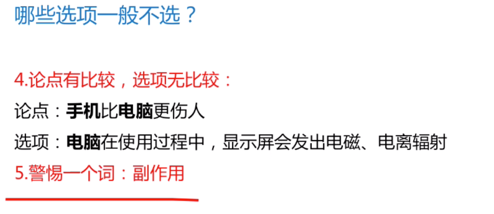

### 第一章 逻辑填空
```
老调重弹：侧重多次搬出理论
和声细语：侧重做事方式和缓
挥之不去：形容发生过的事情无法挽回一直在脑中回想。
朝不保夕：形容情况危急
伸展：一定方向延长或者扩展。不能搭配文化。文化用蔓延。
先导：侧重于引导，而文中没有这个意思，便用的抓手。
消弭：清除不好的事情，可与边界搭配。
伺候：可以用作人也可以用作牲畜
侍候：只能用作人
式微：形容由盛转衰
靡然成风:指相互跟风，群起效尤而成风气，贬义词
层见叠出:指事物接连不断地多次出现
积厚流光：积累的工业越深厚，流传给后人的恩德越广
不绝如缕：形容局势危急活着声音细绝悠长
和而不同：和睦相处但并不随声附和
颠扑不破：形容言论学说等牢固可靠
眼花缭乱：一般形容人，一般用作令人...
独具匠心：形容技巧或者文学艺术方面有巧妙的心思。
鞭辟入里：启发人深刻思考。
物换星移：强调时间变化
缘木求鱼= 水中捞月：比喻方法错误，不可能达到目的

南辕北辙：行动与目的相反
刻舟求剑：不懂事物已发展变化仍然静止的看问题
离题万里：形容写文章或者说话同主题相差很远。
有的放矢：形容说话做事有针对性。
人浮于事：人员数目超过工作需求。
食前方丈：形容吃的阔气
事倍功半：工作费力大收获小。
举重若轻：处理问题轻松不费力。
鸡鸣狗盗:指微不足道的本领，也指偷偷摸摸的行为.
刀头舔蜜：比喻利少害多，也比喻贪财好色，不顾性命
代人捉刀：代替别人做事，多指写文章。
并驾齐驱:比喻彼此的力量或才能不分高下或地位相当.
蔚为壮观:形容盛大壮丽的景象.
咂舌攒眉:形容人吃酸物的表情或惊讶的神情.
突显:指突然显现

```


> 实词辨析

- 01(感情色彩)
```
随着暑期结束，携娃出游的家长已陆续回到家中，但暑期旅游遭遇的种种窘境却依然            。据报道，暑期学生旅游带动家庭出行，致使许多地方的热点景区纷纷“爆棚”，酒店“爆满”，假期“恶补式旅游”让不少家庭陷入进退两难的        。

依次填入画横线部分最恰当的一项是：

A

历历在目 狼狈

B

挥之不去 境地

C

不寒而栗 抉择

D

记忆犹新 尴尬

挥之不去：形容发生过的事情无法挽回一直在脑中回想。

D项“尴尬”指处境困难，不好处理，且与“陷入”搭配得当
```

- 02(语句轻重)

```
填入画横线部分最恰当的一项是

啥是佩奇？这只其貌不扬的粉红小猪，本身就是家庭亲情的象征。父母、姐弟，简简单单、快快乐乐地生活在一起。这个“舶来品”的故事，        了中国老百姓“老婆孩子热炕头”的淳朴理想，也符合孩子们对童年、父母、家庭日常的真实感受。这是最基本的人伦感情，也是全世界通用的语言。

A

迎合

B

暗合

C

符合

D

吻合

依据前文提示，“舶来”即外来，空中所填的词需要体现“外来故事”和“国内淳朴理想”的关系，且由“也符合······”可知，横线处应与“符合”意思相近。即体现“不同地域、不同文化、不同人物之间，却有着相同的意蕴和情感”之意，强调“佩奇”与“中国淳朴理想”两者间相符的偶然性。B项，“暗合”指没有经过商讨而意思恰巧相合，符合文意，当选。

A项，“迎合”指故意使自己的言语或举动适合别人的心意，文段未体现“佩奇”主动适应老百姓的理想，与文意不符，排除；

C项，“也”连接前后为并列关系，与后文“符合”重复，不符合日常用语习惯，表述过于单一，且未体现“偶然性”之意，排除；

D项，“吻合”指完全符合，侧重“一模一样”，程度太重，且未体现“偶然性”之意，排除。

故正确答案为B。
```

- 03(表达风格)

```
故宫利用原创、金融和亚文化三驾马车，开拓出传统文化IP活化的新        ，揭示了优秀传统文化挖掘和        的巨大空间和可能性，也揭开传统文化市场开发庞大财富冰川的一角。

依次填入划横线部分最恰当的一项是：

A

途径 阐述

B

途经 阐释

C

路径 阐发

D

路子 阐明

第一空，文段意在表明利用“三驾马车，开拓出新的方法”。A项“途径”指方法、路子，C项“路径”指通向某个目标的道路，D项“路子”指处事的办法，门路，三项均符合文意，保留；B项“途经”意为路过，为动词，不合文意，排除。

第二空，“和”表并列，所填词语应与“挖掘”表意相近，且根据后文“传统文化市场开发”可知，所填词语应体现出对“优秀传统文化”进一步的开发挖掘之意。C项，“阐发”指阐述开发，符合文意，当选；A项，“阐述”指阐明论述，体现不出“开发挖掘”之意，排除；D项，“阐明”指讲明白，亦体现不出“开发挖掘”之意，排除。

故正确答案为C。
```

- 04（语素差异：词语的侧重点）

```
某航天科工集团研制出的民航风切变预警系统，克服了预警难度大、精度低等现实问题，可以为飞机的起飞降落        提供风切变预警信息，还能够提供机场未来48小时的天气预报。

填入划横线部分最恰当的一项是：

A

及时

B

实时

C

适时

D

即时


正确答案是： B收起
解析
根据“可以为飞机的起飞降落······，还能够提供机场未来48小时的天气预报”可知，横线处表达除了可以提供未来的信息，也可以为飞机的起飞降落这一时间段内一直监测风向，提供当时的预警信息。B项“实时”意为在某事发生、发展的过程中的同一时间，符合语境，当选。

A项“及时”意为立刻、马上、不拖延，C项“适时”意为适合时宜，均无法对应当下一段时间内同步进行监测，排除；D项“即时”意为当下、立刻，与B项“实时”相比，“实时”更加侧重一段时间内的情况，且“实时信息”也为常见搭配，因此D项不符，排除。

故正确答案为B。

观察就要用专业的角度去关注、        周围的事物，有意识地汲取、思索、分析，看在眼里，记在心里。丰富的想象正是来源于知识的广博和平时对生活深入细致的观察。因此，想象并不是凭空        的。

依次填入划横线部分最恰当的一项是（    ）。

A

体验 杜撰

B

体味 虚构

C

体察 臆造

D

体察 虚构


正确答案是： C收起
解析
第一空，横线处与“关注”通过顿号构成并列且对应后文“看在眼里”，故横线处表达“看”的含义，C、D两项“体察”指体会、观察，语意相符。而且文章强调专业的角度。含有，观察的含义。

A项“体验”指亲身经历；B项“体味”指体会寻味，均与文意不符，排除。

第二空，根据“想象正是来源于······观察”可知，横线处强调想象不是凭空想出来的，C项“臆造”指凭主观的想法编造，语意相符且“凭空臆造”是常见搭配，当选。D项“虚构”指凌空构作，凭空捏造，虚幻之实化，含有“凭空编造”的意思，与“凭空”语义重复，排除。

故正确答案为C。


```

- 05 词性功能

- 06 语境以及限定信息

> 成语辨析

- 01 
```
所谓幼儿园“小学化”，指的是在幼儿园阶段提前教汉语拼音、识字、计算、英语等小学课程内容。这种现象近年来非常普遍，        ，甚至传导至幼前阶段，也就是还没上幼儿园就开始教这些知识了。更有甚者，小孩还在幼儿园阶段就在上奥数班，至于学拼音、英语，更是        。上海的家长们为了给孩子报某个毫无资质的学前班，挤破了头不说，排队报名的黄牛号都涨到5000元，这事情也一度闹得        。

依次填入划横线部分最恰当的一项是（    ）。

A

靡然成风 层见叠出 沸沸扬扬

B

蔚然成风 层见叠出 沸反盈天

C

靡然成风 司空见惯 沸沸扬扬

D

蔚然成风 司空见惯 沸反盈天

第一空，所填词语形容幼儿园“小学化”这一现象，根据前后文可知，作者对于幼儿园“小学化”是不认可的，这是一种不好的风气，“靡然成风”指相互跟风，群起效尤而成风气，贬义词，多指不好的风气，保留A、C两项；“蔚然成风”指一件事情逐渐发展盛行，形成一种良好的风气，感情色彩为积极褒义，与文段感情色彩不符，排除B、D两项。

第二空，根据横线前“更是”可知，横线处体现该现象特别普遍、特别常见，C项“司空见惯”指某事常见不足为奇，与文意相符，当选；A项“层见叠出”指接连不断地多次出现，文段仅表示该现象常见而非一个接一个地出现，排除。

验证第三空，“沸沸扬扬”形容人声喧扰，议论纷纷，与前文“闹得”搭配得当，当选。

故正确答案为C。


```

- 02

```
怎么才能让老板给自己加薪？职场上最纠结的事情莫过于此。可是偏偏就有人          ，幽默地给我们做出了榜样。漫画《老板，求加薪》中给我们列出了加薪三十六计，从借刀杀人到          ，书中的妙计连连，让人忍俊不禁。虽然都是些          的招式，但或许你的加薪之道就在其中。

依次填入画横线部分最恰当的一项是：

A

知难而上 两面三刀 出人意表

B

激流勇进 刀头舔蜜 出奇制胜

C

游刃有余 代人捉刀 鸡鸣狗盗

D

举重若轻 笑里藏刀 剑走偏锋

第一空应体现有人用幽默的方式轻松解决了职场难题，D项“举重若轻”，形容做繁难的事或处理棘手的问题轻松而不费力；C项“游刃有余”表示解决问题非常轻松，均符合文意。A项中的“知难而上”与B项中的“激流勇进”均形容面对困难时的态度，与文段“幽默”地解决难题不对应，故排除A、B两项。

第三空，横线要体现的是非常巧妙的招式，C项“鸡鸣狗盗”指微不足道的本领，也指偷偷摸摸的行为，与巧妙无关，故排除C项；D项“剑走偏锋”指用不同以往的办法来解决问题，与前文的“妙计”相对应，符合。

代入第二空验证，从“借刀杀人”到“笑里藏刀”，符合语境。

故正确答案为D。

```

> 关联词辨析

- 01(第二，三空为并列关系)

```
逻辑作为人类探求知识、追求理性的工具，其研究范围是极其广泛的。      是以推理有效性为核心研究内容的逻辑，其形态也是丰富多彩的，      有演绎的逻辑，还有各种非演绎的逻辑，如归纳逻辑、类比逻辑等，      围绕推理研究，逻辑还研究与推理有关的概念、判断、论证以及基本的逻辑规律和逻辑方法等等。

A

不但 而且 甚至

B

即使 不仅 并且

C

如果 那么 也是

D

既然 所以 然而

本题考查关联词搭配。

第一空，横线处所填关联词搭配后文的“也”，B项“即使”和D项“既然”均可和“也”形成关联词的固定搭配结构。A项，“不但”搭配“而且”；C项“如果”搭配“那么”，均无法和“也”形成搭配，排除。

第二空，横线处所填关联词搭配后文的“还”，B项“不仅”和后文“还”搭配恰当，D项“所以”和“还”无法搭配，排除。锁定正确答案B。

第三空代入验证，“不仅有……还有……并且”表并列，符合文意，且搭配合适。

故正确答案为B。
```

- 02 (第一个空就要代表疑问)

```
专业研究要讲全面，系统掌握某一门专业或某方面的知识，不能“碎片化”，但对非专业读者、非专门教育、学术普及来说，又        “碎片化”？实际上，面对人类已经积累的浩瀚的知识海洋，每个人能够汲取的无非是一滴一勺，对自己专业以外的知识只能是若干碎片。只要保证这是真正的碎片，而不是垃圾，        明白这只是一个整体中的极小部分        不能代表整体，就能做到                ，闪光的碎片同样能体现整体的精妙。

A

怎能 而且 并且 勤能补拙

B

何妨 并且 因而 开卷有益

C

可以 尚且 因此 积微成著

D

不妨 不仅 而且 铢积寸累

第一空，“但”表转折，故横线前后语义相反，转折前强调“不能碎片化”，则转折后应强调可以碎片化。B项“何妨”表示反问，用反问的语气表示不妨，符合文意；A项“怎能”填入横线处表示不能碎片化，和转折前的意思相同，不符合文意，排除；C项“可以”填入文段，加上问号之后，带有否定的意味，表示不能碎片化，与文意不符，排除；D项“不妨”语义尚可，但无须加问号，故排除。

第二、三、四空，代入验证，“明白这只是一个整体中的极小部分因而不能代表整体”表述正确，且“开卷有益”表示读书必有所得，对应“闪光的碎片同样能体现整体的精妙”，故锁定B项。

故正确答案为B。

```


- 03(文章没有竟这种意料之外情绪很大的意思)

```
松树当然是不同的。它们不落叶，无论冬夏，常给人绿色的遮蔽。那绿色十分古拙，不像有些绿色的鲜亮活跳。它们        是有花的，        不显著，最后结成松塔掉下来，带给人的是成熟的喜悦，        不是凋谢的惆怅。

依次填入划横线部分最恰当的一项是：

A

却 虽 竟

B

虽 却 并

C

也 但 而

D

竟 但 却

本题考查虚词填空，需分析前后句的逻辑关系。

第一空，根据“松树当然不同”、“不像有些绿色的鲜亮活跳” 可知，文段侧重将松树与其他事物比较，A项“却”和C项“也”均可体现比较关系，符合前后逻辑， B项“虽”是虽然的意思，侧重于描述事物本身，无法体现对比，排除。D项“竟”表述出乎意料的意思，文段中对松树已经了解了很多，没有体现出乎意料的情况，与文意不符，排除。

第二空，根据“有花”、“不显著”可知，前后语义相对立，A项“虽”是虽然的意思，侧重于描述事物本身，无法体现前后对立，排除。C项“但”表转折体现前后语义对立，符合题意，保留。

第三空将C项代入验证，“喜悦”与“惆怅”为相反的表达，“而”在此处表转折，符合文意，当选。

故正确答案为C。


```

> 逻辑填空全真测试

- 01

```
如果初创企业一味盲目地追求产品开发和获取早期客户的速度，而忽略了产品质量的话，到时往往会      。虽然表面看来产品是出来了，但是支撑产品的代码或硬件可能会变得难以维护和扩展，就算公司短期内看上去获得了成功，但产品里面的技术债务却积少成多，隐患也随之倍增，到时可能就会      。 

A

过犹不及 功亏一篑

B

事与愿违 积重难返

C（错）

欲速不达 作茧自缚

D

得不偿失 于事无补

本题从第二空入手，横线处与“技术债务却积少成多，隐患也随之倍增”构成对应，要体现出不好的事情越积越多，对应B项“积重难返”指经过长时间形成的思想作风或习惯很难改变，多指恶习、弊端发展到难以革除的地步，符合文意。A项“功亏一篑”比喻做事情只差最后一点没能完成；C项“作茧自缚”比喻自己给自己找麻烦；D项“于事无补”指对于解决问题没有帮助，均体现不出不好的事情越积越多之意，与前文对应不当，排除。

第一空代入验证，“事与愿违”指事情的结果不能称心如意，放在此处体现出如果初创企业一味追求产品开发和获取早期客户速度，是达不到最初目的的，符合文意。

故正确答案为B。


```
- 02

```
为了迎合家长急于求成的心理需求，不少美术类培训机构纷纷带孩子参加各类绘画大赛和少儿绘画考级活动。这必然是      的做法，绘画是人们认识和感受世界，表达个人情绪和看法的一种方式，是培养孩子对现实世界的认知能力。作为家长，不要急于让孩子出成果、获大奖，而应该      孩子用更加丰富的手段认识世界。

依次填入划横线部分最恰当的一项是：

A (错)

拔苗助长 辅助

B

缘木求鱼 激励

C

舍本逐末 引导

D

得不偿失 启发

第一空，根据前文可知，文段意在表达为了迎合家长急于求成的心理需求，一些美术类培训机构采取了不恰当的做法，且根据后文“绘画是培养孩子对现实世界的认知能力”可知，让孩子学习绘画的本意应为培养能力而非考级，故横线处应体现出培训机构的做法违背了让孩子学习绘画的本意。

C项“舍本逐末”比喻做事不注意根本，而只抓细微末节，“本”即对应“培养能力”，“末”即对应“考级”，符合文意，当选；

A项“拔苗助长”比喻违反事物发展的客观规律，急于求成反而坏事，文段虽然可以体现出急于求成之意，但并未体现出让事情变坏之意，故与文意不符，排除；

B项“缘木求鱼”比喻方向不对，不可能达到目的，文段虽然可以体现出方法错误之意，但并未论述达不到目的，并非必然无法出成果获奖，与文意不符，排除；

D项“得不偿失”指所得的利益抵偿不了所受的损失，文中并未体现出损失之意，排除。

第二空代入验证，横线处体现家长对孩子的做法。C项“引导”有指引、带领之意，符合文意，当选。

故正确答案为C。

```
- 03

```
古城区发展到一定阶段，适度地提升改造是必要的，但如果是通过“拆真”来为“建假”腾出地方，这样的开发改造必然是      ，其实，提升改造与对老建筑的保护本来可以      ，恰当地修缮，不但可以让历史建筑重新焕发活力，也能够提升城区的整体质量，达到提升改造的目的。

依次填入画横线部分最恰当的一项是：

A

顾此失彼 齐头并进

B

暴殄天物 双管齐下

C

得不偿失 并行不悖

D(错)

舍本逐末 并驾齐驱

第一空，根据“通过‘拆真’来为‘建假’腾出地方”可知，这样的开发改造是错误的。C项“得不偿失”指得到的利益抵偿不了受到的损失，D项“舍本逐末”指抛弃事物的主要部分追求次要的部分，两项均符合文意，保留。A项“顾此失彼”指顾这个丢了那个，形容照顾不过来，与文意不符，排除；B项“暴殄天物”指任意糟蹋东西，不知道爱惜，用于形容“开发改造”程度过重，排除。

第二空，形容“提升改造”和“对老建筑的保护”，说明二者可以同时进行并不冲突。C项“并行不悖”指同时进行而不互相违背，符合文意，当选。D项“并驾齐驱”比喻彼此的力量或才能不分高下或地位相当，不表示“同时进行”之意，排除。

故正确答案为C。
```
- 04

```科技与舞台艺术，一直相伴相生，最早甚至可以追溯到戏剧诞生的时代。古希腊罗马剧场中            的声场设计和半圆形舞台的切割工艺，就代表了当时最高科技，为观众创造了最好的观看环境。自此，可以说，每一次舞台空间的塑造都        着“科技因子”。

依次填入画横线部分最恰当的一项是：

A

令人惊诧 渗透

B

引人入胜 彰显

C

咂舌攒眉 透露

D(错)

蔚为壮观 呈现

第一空，横线处搭配“声场设计”，根据“代表了当时最高科技，为观众创造了最好的观看环境”可知，古希腊罗马剧场中的声场设计非常先进、非常好。A项“令人惊诧”表示令人十分吃惊，C项“咂舌攒眉”形容人吃酸物的表情或惊讶的神情，意思均可；B项“引人入胜”多指风景和艺术作品特别吸引人，D项“蔚为壮观”形容盛大壮丽的景象，两项均搭配具体的景象，与“设计”搭配不当，排除。

第二空，由前文“科技与舞台艺术，一直相伴相生”可知，横线处要体现出舞台空间的塑造中一直都包含着“科技因子”。A项“渗透”比喻一种事物逐渐进入到其他方面，体现舞台空间的塑造与科技因子的融合，符合文意，当选。C项“透露”指显露，外在明显地显示，与文意不符，排除。

故正确答案为A。
```
- 05

```
我们从小就接受“无规矩不成方圆”的教育，明白世上任何事物皆有各自标准法度的道理。但总有人不守规则、            ，个中道理值得深思。事实上，近年来有关漠视、违反、扭曲规则的事            ，小到闯红灯、高铁霸座等，大到违规用权、官员腐败等，无不        着破坏规则导致的种种危害和风险。

依次填入画横线部分最恰当的一项是：

A（错）

自以为是 层出不穷 突显 

B

随心所欲 比比皆是 显示

C

不以为然 大行其道 显露

D

各行其是 屡见不鲜 凸显

第一空，根据“、”，与“不守规矩”语义相近，表达不按“标准法度”行事，A项“自以为是”指认为自己的看法和做法都正确，不接受别人的意见；B项“随心所欲”随着自己的意思，想要干什么就干什么；D项“各行其是”指思想不统一，各人按照自己的意见、主张去做；三项均符合文意。C项“不以为然”指不认为是对的，表示不同意或否定，与文意无关，排除。

第二空，根据下文“小到……大到……”，表达漠视、违反、扭曲规则的事很多，A项“层出不穷”、B项“比比皆是”、D项“屡见不鲜”三项均可。

第三空，搭配“危害和风险”，且对应前文“闯红灯、高铁霸座、违规用权、官员腐败”的行为，侧重强调其带来的“危害和风险”很明显，D项“凸显”指凸出、清楚地显露，符合文意。A项“突显”指突然显现，“突然”之意文段无从体现，排除。B项“显示”指明显地表示，程度较轻，与“凸显”相比，体现不出强调的意味，排除。

故正确答案为D。

```
- 06

```
自然资源并非是取之不尽、用之不竭的。现在，大自然被过度开发，因此保护自然迫在眉睫，而保护观念的改变则是      。以前，我们觉得保护动物就要把动物从自然里拿出来，放在一个我们      提供的很好的环境中来保护，但结果      。只有依赖自然环境和生态系统才能真正保护好生物多样性。

依次填入划横线部分最恰当的一项是：

A

万全之策 精心 适得其反

B

当务之急 统一 一败涂地

C

重中之重 单独 事与愿违

D

大势所趋 专门 南辕北辙(错)

第一空，搭配“保护观念”，并根据前文可知，横线体现保护观念的改变对于保护自然很重要。

A项“万全之策”指最完全最好的办法，观念的改变并不能完全解决大自然被过度开发的问题，还需要付诸行动，且表述绝对，所以“万全之策”填入横线处不符合文意，排除A项。B项“当务之急”指当前急切应办的要事，C项“重中之重”强调重要性，D项“大势所趋”指整个局势发展的趋向，均可体现出保护观念改变的重要性，保留。

第三空，根据后文“只有依赖自然环境和生态系统才能真正保护好生物多样性”可知，横线处应体现出结果不理想之意。C项“事与愿违”指事情的发展与愿望相反，符合文意，当选。B项“一败涂地”形容彻底失败，用于此处程度过重，排除；D项“南辕北辙”指行动和目的地完全相反，搭配“行动”和“目的地”，而横线处搭配“结果”，排除。

第二空，代入验证，“单独”提供的很好的环境中来保护，符合文意，当选。

故正确答案为C。

```

### 第二章 片段阅读


> 主旨概括

```
弱：弱转折：其实，事实上，只是，
强：强转折：但是，不过，然而

弱在前，强在后，重点常常在后半句的强转折上
强在前，若在后，要观察对策出现的位置，对策句在哪，该句就是重点。

```

- 01

```
随着私人权利越来越受到重视，夫妻之间以契约方式设定彼此权利义务的情况越来越多。这些协议大都有共同的特点，即身份权与财产权紧密结合，并常常以财产利益归属作为协议的最终法律后果。现代婚姻变得如此脆弱，山盟海誓已经让人没有了安全感，人们更加倾向于以契约方式来维护婚姻的安全，来保障婚姻破裂后自己的财产权益。

这段文字主要谈论婚姻中夫妻间契约的：

A

出现背景

B

存在条件

C

主要功能

D

法律效力


正确答案是： A收起
解析
文段开篇以“随着”为标志，开始介绍夫妻契约越来越多的背景，随后介绍协议的特点，最后进一步论述在婚姻变得愈发脆弱没有安全感的情况下，倾向于以契约方式来维系婚姻安全。总而言之，整个文段重在论述夫妻间契约为何会出现，结合选项可知A项最为恰当，当选。

B项为迷惑选项，夫妻间契约的存在条件应为夫妻双方自愿，或双方同意等，即在这个基础之上方可签订，故与文意不符，排除；C项在文中虽然出现，但并非文段重点，排除；D项为无中生有，排除。

故正确答案为A。
```

- 02

```
表达倾向法

句子中有些。双引号“杰出”的日本人。所谓的。运用了反讽。

```

- 03

```
援引观点法包括正向原因法和反向援引法
而反向援引通常会有个转折，表示作者的真实意图。转折之前的不重要。

反向援引。作者表示观点之后，但才是重要的地方。而但是前面不要作为选项。将但是后面的态度作为选项。即同意上述人的做法。
```

- 04 原因推断法

```
原因不重要，点名的观点重要。

在当代中国，由于国力的限制和传统思想的影响，妇女受教育的机会和程度都比男性少，而家务和抚育子女主要由妇女来承担，又限制了她们的流动，妇女对这些主要发展资源的占有远远少于男性，这就进一步限制了妇女与男性的平等竞争，拉大了他们之间的距离，造成男女不平等的进一步扩大。

这段文字的中心意思是：

A

当代中国，妇女面临最大的问题是男女不平等的进一步扩大。

B

当代中国，妇女面临最大的问题是受教育的机会和程度都比男性少。

C

当代中国，妇女面临最大的问题是家务和抚育子女限制了她们的流动。

D

当代中国，妇女面临最大的问题是传统思想的影响。


正确答案是： A收起
解析
据提问可知本题为中心理解题。

文段前面从“受教育的机会少”、“流动受到限制”和“资源占有”几个方面说明了男女不平等进一步扩大的原因。

A项概括全面准确，当选。

B、C、D项均只是一个方面而并非面临的最大问题，排除。
```

- 05(反面论证,转折之前的句子不重要)
```
1. 正+反：反面论证之前会经常出现正面论点，常有“否则”，“不然”这类词出现，，此时要重点阅读正面观点。

2. （正）+反：反面论证前省略正面论点，常有“如果...不...”此时应该对反面论证推断。

医疗系统有必要去革除自身的陈弊，净化我们的医疗环境，在解决看病难问题上更有作为。但在滥用药物这件事情上，如果我们意识不到问题的主要根源所在，缺乏足够的执法跟进，以及必要的国民反省意识，而总习惯性地将这种责任强加于医者身上，制造出现实在逼迫人们滥用药物的悲情，不但对医生们不公平，也可能使问题难以得到正视和解决。

作者主要表述的观点是：

A

医疗系统要在解决看病难问题上发挥自身作用

B

药物滥用的责任不完全在医者

C

在处理医患矛盾时，医生往往会成为替罪羊

D

滥用药物的责任应归结于医疗系统本身，而不能强加在医生身上


正确答案是： B收起
解析
文段开篇指出医疗系统要革除自身陈弊，在看病难问题上有作为，后文出现转折关联词“但”，转折之后重点强调在滥用药物这件事情上，问题根源在于缺乏执法跟进和国民反省意识。A项对应文段转折之前的内容，非重点，排除；C项“处理医患矛盾”与文段核心话题“滥用药物”不符，排除。对比B、D两项，D项“滥用药物的责任应归结于医疗系统本身”与文段表述不相符，文段强调滥用药物的根源在于缺乏执法跟进和国民反省意识，排除D项；B项“滥用药物”与文段讨论核心话题一致，优选B项。

故正确答案为B。
```

- 06（指代词引导法）

```
指代词有可能是指前文如果太长，则是指宏观内容。

现代信息网络技术、微电子技术和虚拟技术，把人们的视野扩展到一个全新的领域。人们不仅可以借助计算机技术建立作战实验室，把对历史经验的归纳和对未来的预测融为一体，将计算机自动推理与专家经验指导结合起来，而且能通过合成动态的人工模拟战场、造就逼真的作战环境，为战略理论研究开启新的渠道和广阔空间。许多国家以此为依据，提出新的作战原则和理论，并在此基础上形成了本国的国家安全战略，从而实现了国家安全谋划从经验决策到科学决策的转变。

这段文字意在强调：

A

现代科技有助于科学制定国家安全战略

B

现代信息网络技术的发展革新了战争方式

C

国家安全谋划正从经验决策向科学决策转变

D

作战原则和理论依赖于科学技术的创新和发展


正确答案是： A收起
解析
文段首先介绍背景，说明现代信息科技能拓宽人的视野，并通过“不仅……而且……”强调现代信息科技能为战略研究开启新的渠道和空间，即在战略研究方面拓宽了人的视野。最后以“以此”概括上文，引出重点，说明现代信息科技对国家安全战略的形成起到了重要作用，对文段的中心句进行同义替换，对应A项。

B项，“现代信息网络技术”对应文段首句“现代信息网络技术、微电子技术和虚拟技术”，只是文段中的部分内容，表述片面，且文段重在强调现代科技对于国家安全战略制定的作用，“革新战争方式”非重点，排除；

C项，“正从”指正在进行、尚未完成，而文段表述为“实现了”为完成时，选项时态错误，且没有体现文段的主题词“现代信息科技”，排除；

D项，“作战原则和理论”并非文段重点，文段重在强调现代科技对国家安全战略的作用，排除。

故正确答案为A。

- 中华文化在数千年的历史演变中之所以始终保持强劲的生命力，就在于中华文化既具有鲜明的民族特征，同时，善于吸收不同民族、不同国家、不同地区的相关文化因子，作为改善自身文化机制，培养文化能力的有机元素。这就是为什么古巴比伦文化、古印度文化相继消亡，而中华文化却历数千年经久不衰并不断创新继而创造新的文明奇迹的奥秘所在。

这段文字主要说明了：

A

只有不断改善自身文化机制才能经久不衰

B

中华文化始终保持强劲生命力的关键

C

古巴比伦文化的消失源于缺乏鲜明的民族特征

D

中华民族要善于吸收不同民族、国家和地区的相关文化


正确答案是： B收起
解析
本题为中心理解题。文段第一句指出了中华文化保持强劲生命力的原因是既保持鲜明的民族特征，又不断改善自身文化机制，A、D 两项都只提到了一方面，过于片面，排除。C 项“古巴比伦文化”这一主题词也发生了偏离，亦可排除。第二句进一步指出了这也是中华文化经久不衰并不断创新的奥秘，结合选项，B 项中“关键”一词将文段中提及的多方面原因进行了高度概括。

故正确答案为B。
```

- 07(选项对比，看每个选项侧重讲什么，选最好的。)
```
中国历代异常发达的政治哲学和历史哲学早就无数次地告诫世人：权力的私有及日益专横，只能导致万民涂炭、王朝崩溃的惨祸。但是所有这些深痛剖析永远难以进入法律层面而成为制约统治权力的刚性力量，所以它们只能转而定型为一种“代偿”方式，即思辨、文学和伦理等领域中的深深涵咏和喟叹。因此，在中晚唐开端的中国皇权社会后期文化中，以李商隐等人的作品为代表，不仅“咏史”之作数量日益庞大，而且诸多经典之作极其警策，具有空前沉郁的历史悲剧感。

对这段文字的主旨概括最准确的是：

A

告诫世人吸取历史兴亡的深刻教训

B

剖析权力私有必然造成社会危机

C

评价李商隐等唐代诗人的创作成就

D

说明咏史诗作诞生的社会政治背景


正确答案是： D收起
解析
本题的行文脉络为“分—总”式，文段的前两句话论述了历代的政治哲学家、历史哲学家早已看清权力私有的危害，具有警世作用，但是不能融入到法律层面的刚性力量之中，只能转变为文学作品流传于世。文段最后一句以“因此”为标志总结前文，解释了“咏史”诗作大量诞生的原因。D项为文段中心的同义表述。

A、B、C三项均未包含“咏史诗”这一主题词。

故正确答案为D。

菲尔丁说：不好的书也像不好的盆友一样，可能会把你戕害。这话没错，但也不必为此走向极端，夸大书籍对人的品格的影响。更多的情况是：‘’‘’

这要弄懂文章的含义，读书对人影响不大。好人还是好人，坏人还是坏人。其他的选项意思相同的可以排除。
```

- 08 （弱在前，强在后，重点在转折之后）
```
人类的四大烦恼，不但“生”“老”“死”没人躲得过，就是“病”也无法根除，人类自有“药”的发明，“药”与“病”就“道高一尺，魔高一丈”。虽然在“药”不太灵的时候，行气、导引、祝由（古代的精神疗法）会重新产生吸引力（如对外丹术衰落后的内丹术和处于绝望的癌症病人），但它们始终不能摆脱附庸地位。

这段话旨在强调：

A

人类有些根本性烦恼是无法摆脱的

B

当“药”失灵时，人类就会求助于其他方法

C

“药”是人类治病的基本手段

D

“病”与“药”之间存在着既相互对立又相互依存的关系


正确答案是： C收起
解析
文段首句介绍人类的四大烦恼，指出“病”无法根除，属于提出问题。接下来论述“药”不灵的时候，人们会用“行气、导引”等其他方法，紧接着通过转折词“但”，引出文段的重点，强调这些其他方法摆脱不了“附庸地位”，即人们治病主要依靠的还是“药”，对应C项。

A项，“有些根本性烦恼”表述不明确，且未提及主题词“药”，排除；

B项，对应文段转折前的内容，非重点，排除；

D项，选项表述“药”与“病”是“相互对立又相互依存”的并列关系，文段重点应为解决问题的对策，即“药”，而非并列“药”与“病”，且属于转折前表述，非重点，排除。

故正确答案为C。
```

- 09(反面论证后面的才是主题句)
```
在5000多年文明发展进程中，中华民族创造了博大精深的灿烂文化。在当下，如何“让收藏在禁宫里的文物、陈列在广阔大地上的遗产、书写在古籍里的文字都活起来”，已成为我们必须面对的现实问题。试想，如果传统文化失去了与时代的连接、缺少了与现代人的情感沟通和心灵默契，“仅止于几个人在书房中互相叹赏”，那和一堆零散的符号、呆板的素材又有什么区别？只有从“沉睡”中再出发，从“馆舍天地”走向“大千世界”，才能涵养出更具时代特色的、富有创新力的文化自信。

这段文字旨在强调：

A

中华民族拥有博大精深的传统文化

B

如何让文物“活起来”是我们必须面对的问题

C

文物应走出封闭状态，向公众开放

D

传统文化应加强与时代的连接


正确答案是： D收起
解析
文段开篇交代背景中华民族有着灿烂的文化，并提出让文物、遗产、文字活起来是目前面对的现实问题。后面进一步分析传统文化失去和时代的连接与现代人的沟通、心灵默契是不行的，最终尾句通过“只有······才”引导对策，对前文问题给出回应，让传统文化从“从‘沉睡’中再出发，‘馆舍天地’走向‘大千世界’”，即让传统文化不再沉睡，要走出“馆舍”，与广大群众见面和接触，对应D项。

A项，“中华民族拥有博大精深的传统文化”，首句背景表述，非重点，排除；

B项，“如何让文物活起来”表述不明确，且“文物”只是属于传统文化的一部分，表述片面，排除；

C项，“文物”只是属于传统文化的一部分，还有“遗产”、“文字”表述片面，排除。

故正确答案为D。
```

- 09(并列中的主题句注意总结全文的意思)
```
“开学第一课”，本质是“课”，是所有教学的一部分，而课程创新也属于学校的教育事务，因此，在进行“开学第一课”时，各地宜充分结合本校的办学定位、办学条件和特色，由全体教师参与进行课程设计论证，并听取学生和家长的意见。每年的“开学第一课”也不必回避相同的主题，因为每个年龄段的学生，学习任务本就不同，关键在于要给同样的主题注入新的内涵。

这段文字强调的是：

A

不能脱离课的本质开展“开学第一课”

B

“开学第一课”应由老师、学生、家长三方主体共同设计完成

C

“开学第一课”与课程创新要同步

D

“开学第一课”不应拘于形，而应重于实


正确答案是： C收起
解析
文段开篇指出“开学第一课”是教学的一部分，而课程创新也属于学校的教育事务，强调课程创新的重要性，并通过“因此”引导结论，在进行“开学第一课”时，要考虑到各个方面，尾句通过“关键在于”强调“给同样的主题注入新的内涵”，即应该创新，因此文段意在说明“开学第一课”要注重创新，对应C项。

A项，“课的本质”对应文段开头，为结论之前内容，非重点，排除；

B项，文段提及“老师、学生、家长三方主体共同设计完成”的目的是为了保障“课程创新”，选项表述内容非重点，排除；

D项，“应重于实”中的“实”即“创新”，故表述不明确，排除。

故正确答案为C。

```
- 10(同义替换主旨句)
```

当文化不能表达生命，反而压抑生命的时候，生命的紧张感就增大。这时候，需要改变旧文化，创造新文化，以重新表达生命。但文化的改造不必从文化开始，有时候，直接表达生命的紧张感、危机感，这种表达本身就形成了一种新的文化。

这段文字主要说明了:

A

文化的功能之一在于表达生命

B

文化既可能表达生命又可能压抑生命

C

生命与文化的冲突可能催生新的文化

D

文化有时直接表达生命的紧张感和危机感


正确答案是： C收起
解析
文段先指出文化压抑生命时，生命的紧张感会增大，此时，需要创造新文化，目的是重新表达生命。随后又通过“但”进行转折，否定了前一句的对策，并指出直接表达生命的紧张感，本身就是新文化。文段为转折文段，转折后重点强调生命的紧张感本身就是新文化，结合前文可知，生命的紧张感，源于文化与生命的冲突，故C项符合文意。

A项，文段重在讨论文化与生命的关系，“文化的功能”并非文段核心话题，偏离主题，排除；

B项，文段重点讨论当文化压抑生命后应如何做，而非单纯介绍文化对生命的作用，排除；

D项，属于文段的非重点，排除。

故正确答案为C。
```


> 意图判断

- 01(文章d项内容在总结前一句，于是非重点。而且文章是总分结构)

```
在战场上，人机协同被人工智能所取代，至少目前来看短时间内很难发生。人工智能能解决的问题有限，替代首先会发生在部分领域，但却依然离不开人机协同。人工智能的主要实现手段是机器学习，深度学习是实现机器学习的一种方式。尽管目前深度学习在众多领域已取得非常好的效果，但涉及战场上要求创造性、无法给出明确定义和边界、缺乏数字化知识经验的任务，机器可能就无能为力。所以今后一段时间里，机器在作战领域中更多的是起辅助作用，最终的决策依然离不开人类。

这段文字意在说明：

A

人机协同在战场上仍将扮演重要角色

B

人工智能的学习能力有待进一步提高

C

战场环境对机器学习提出了更高要求

D

人工智能尚无法适应复杂的战场需求


正确答案是： A收起
解析
文段首先引出“人机协同”短期内难以被取代的话题，后文先提出人工智能在很多领域已取得非常好的效果，转折后强调在战场上人工智能作用有限，结尾通过“所以”引导结论，“机器在作战领域中更多的是起辅助作用，最终的决策依然离不开人类”，即在作战领域仍然需要人机协同，对应A项。

B项，偏离文段核心话题，尾句论述的重点是人类和机器的合作，排除；

C项，对应尾句结论之前的内容，非重点，排除；

D项，对应尾句结论之前的内容，非重点且句式是否定句，不如A项肯定表述更加明确，排除。

故正确答案为A。
```
> 态度观点
> 细节理解

> 词语理解

- 01(文章作者的态度是觉得有点极端，但是矫枉过正就是极端的表现。草木皆兵感只是怀疑的没有纠正态度过了头这个含义)

```
随着权健、无限极等一个个保健品神话的破灭，很多使用保健品的人陷入了恐慌和焦虑中，他们从昔日对保健品的盲目“迷信、依赖”，一下子反转到“怀疑、一棍子打死”，保健品在某些地区甚至成了“骗局”的代名词，成为过街老鼠。但是，一些有识之士在保健品市场冰与火的两极之间，保持了难得的冷静，他们认为，封杀保健品不是目的，管理才是王道。

关于“很多使用保健品的人”对待保健品的表现，以下概括最准确的是

A

不置可否

B

心有余悸

C

草木皆兵

D

矫枉过正


正确答案是： D收起
解析
根据提问方式为“很多使用保健品的人”对待保健品的表现，定位“很多使用保健品的人”。文段明确指出，从“迷信、依赖”一下子反转到“怀疑、一棍子打死”甚至成了“骗局”的代名词，说明“很多使用保健品的人”对保健品纠正态度过了头，对应D项，“矫枉过正”比喻纠正错误超过了应有的限度。

A项，“不置可否”意为不说行，也不说不行，指不表明态度。文段“使用保健品的人”态度很明确，不符合文意，排除；B项，“心有余悸”形容危险的事情虽然过去了，回想起来心里还害怕，文段没有体现回想过去而害怕，排除；C项，“草木皆兵”形容人在惊慌时疑神疑鬼，文段明确指出“从‘迷信、依赖’一下子反转到‘怀疑、一棍子打死’甚至成了‘骗局’的代名词”，而非仅是“怀疑”，排除。

故正确答案为D。
```

- 02(偷换概念）

```
当人体骨骼发生骨质疏松时，疏松的骨骼会在体重负荷之下出现“微骨折”，这些“微骨折”日积月累，会造成骨骼塌陷、关节变形等病变，发生“差异性沉降”。其中，脊柱、胫骨近端等部位差异沉降最为显著和典型。胫骨内外侧平台的“差异性沉降”导致膝关节内侧软骨受压超过临界值，逐渐变薄、退变，继而关节研磨加重，从而导致膝关节骨性关节炎。

下列说法与上文意思不相符的是：

A

胫骨的“差异性沉降”是导致膝关节骨性关节炎发生和发展的主要原因

B

骨质疏松是导致膝关节骨性关节炎发生和发展的重要原因

C

骨骼的“差异性沉降”出现在膝关节骨性关节炎的发病过程中

D

在体重载荷的长期作用下，人体骨骼会发生不同程度的沉降


正确答案是： D收起
解析
A项，根据尾句“胫骨内外侧平台的‘差异性沉降’......从而导致膝关节骨性关节炎。”可知，胫骨的“差异性沉降”是导致膝关节骨性关节炎发生和发展的主要原因，表述正确，排除；

B项，根据文意可知，骨质疏松会出现“微骨折”，进而发生“差异性沉降”，从而导致膝关节骨性关节炎，故表述正确，排除；

C项，根据尾句“胫骨内外侧平台的‘差异性沉降’......从而导致膝关节骨性关节炎。”可知，骨骼的“差异性沉降”是出现在膝关节骨性关节炎的发病过程中，表述正确，排除；

D项，根据“当人体骨骼发生骨质疏松时，疏松的骨骼会在体重负荷之下出现‘微骨折’，......发生‘差异性沉降’。”可知，疏松的骨骼会在体重负荷之下出现“差异性沉降”，选

```

- 03(因果颠倒)

```
所有的农耕文明时代的文化都具有保守性，无论东西方，概无例外。深刻的原因是，在以手工劳动为基础的生产方式中，“原封不动地保持旧的生产方式，却是过去一切工业阶级生存的首要条件”（《马克思恩格斯选集》）。西方文化，尤其是自然科学在西方文艺复兴与18世纪工业革命后之所以发生了深刻性的质变，引发了中西方的对立与冲突，以及中国在自然科学发展上的明显落后，根本原因在于，以机器为生产基础的商品经济生产方式与交换方式取代了以手工工具为基础的自然经济生产方式与交换方式。

对上面这段话，理解正确的一项是（ ）。

A

以手工劳动为基础的生产方式，是导致农耕文明时代的文化具有保守性的根本原因

B

由表及里，从历史的文化现象角度分析了中西方的对立与冲突形成的深层原因

C

无论东西方，在封建时代，都是以农耕文明为主的，故而东西方都具有保守性

D

自然科学的质变引发了中西方文化的对立与冲突，引发了生产方式与交换方式的变化


正确答案是： B收起
解析
根据文段，首先从自然科学、西方文艺复兴与18世纪工业革命等历史事实出发，再从“生产方式与交换方式”的改变这一根本原因进行分析，阐述了中西方的对立与冲突形成的深层原因，符合由浅入深，“由表及里”的顺序，B项正确，当选； 

A项，根据文段，手工劳动为基础的生产方式是导致农耕文化具有保守性的“深刻原因”，而非“根本原因”，排除。

C项，根据文意可知，无论是东方和西方的农耕文明都具有保守性，而并非东方和西方均以农耕文明为主，概念偷换，排除。

D项，根据文意，自然科学之所以发生深刻变化，根本原因在于生产方式和交换方式的改变，而非自然科学导致二者的改变，属于因果倒置，排除。

故正确答案为B。
```

- 04(理解概念:文字是记录有声语言的，那么网络用语就不是这个。)

```
络用语从一开始就不是交际语言，文字和语言的性质是不一样的，语言本质上是用声音符号做物质外壳的，文字则是用来记录有声语言的。世界上大多数语言并没有文字，这些语言也就不会有网络用语。文字有记录、保存语言的功能，并能远距离传送，网络主要利用文字来实现即时的远距离交流。文字有这样的优点，但是它不能取代语言。

根据文意，网络用语之所以不是交际语言是由于：

A

网络用语本质上是用文字符号记载的语言

B

网络语言主要用来实现即时的远距离交流

C

文字虽能远距离传送但不能取代交际语言

D

网络即使再发达人也不可能不用交际语言


正确答案是： A收起
解析
本题问原因，回到文段重点分析原因。文段首句说明“网络用语从一开始就不是交际语言”是因为“文字和语言的性质是不一样的”，即“语言”是“用声音符号做物质外壳的”，而“文字”是用来记录“有声语言”的，这是两者的不同之处，后文对此进行了详细说明，A 项为网络用语不是交际用语的原因。

B 项：描述的是网络语言的作用，而非两者不同的原因，排除。

C 项：对应文段最后一句话，仅为一个客观现实，并不是两者不同的原因，排除。

D 项：无中生有，文段并未讲述此意，排除。

故正确答案为A。
```

- 05(偷换概念,是粉丝而不是粉)

```
“粉丝”来自英文的fan，源出fanatic，乃其缩写，但经瘦身之后，脱胎换骨，变得轻灵多了。更可爱的是，当初把它译成“粉丝”的人，福至心灵，神来之笔竟把复数一并带了过来，好用多了。单用“粉”字，不但突兀，而且表现不出那种从者如云、纷至沓来的声势。“粉丝”当然是多数，只有三五人甚至三五十人，怎能叫做fans？对偶像当然是说，“我是你的粉丝”，怎么能说，“我是你的粉”呢？粉，极言其细而轻，积少成多，飘忽无定。丝，极言其虽细却长，纠缠而善攀附，所以欲理还乱。

作者对“粉丝”一词的翻译极为赞赏，不属于其中理由的一项是：

A

音译瘦身之后，脱胎换骨，变得轻灵多了。

B

把复数一并带了过来，好用多了。

C

能表现出从者如云、纷至沓来的声势。

D

能表现出积少成多、欲理还乱的情味。


正确答案是： A收起
解析
本题考查细节判断。

根据文段“瘦身之后，脱胎换骨，变得轻灵多了”中的“瘦身”是指“fanatic”缩写为“fan”，而不是指将“fan”翻译成“粉丝”，A项错误。

因此，结合选项应该选择A。

B项根据文段“神来之笔竟把复数一并带了过来，好用多了”可知选项表述正确，排除；

C项根据文段“单用‘粉’字，不但突兀，而且表现不出那种从者如云、纷至沓来的声势”可知选项表述正确，排除；

D项根据文段最后一句话可知其正确，排除。故正确答案为A。


```

- 结构（举例子提出对应的观点）

```
枣的食用，已有七八千年的历史。河南新郑裴李岗、浙江余姚河姆渡等多处新石器时代遗址中，皆出土了野生枣核。迟至汉代，人们已经将枣制成果脯食用。在马王堆汉墓中，不仅出土了许多枣核和保存完整的枣果，而且在竹简上还有“枣脯一笥”的字样。《太平御览》中还记载了关于枣的一桩趣事，东晋权臣王敦到巨富石崇家做客，在如厕时见到一箱干枣，就都吃光了，惹得侍婢嘲笑，原来，这枣是用来塞鼻孔的。

这段文字最后引用了一则故事，其作用是      。

A

增添一则古人将枣制成干果的文献材料，也增加文章可读性

B

嘲讽王敦将塞鼻孔的干枣用来吃，为读者增添笑料

C

证明枣的食用在中国已有七八千年的历史

D

从侧面反映东晋豪门生活奢靡无度


正确答案是： C收起
解析
文段首先提出观点，“枣的食用，已有七八千年的历史”。后文为举例说明，分别列举了“新石器时代遗址”“汉代枣制果脯”“马王堆汉墓”“《太平御览》中的一桩趣事”，故文段为总分结构。最后的一则故事为例子中的内容，加强论证首句观点，即证明枣的食用已有七八千年的历史，对应C项。A、B、D三项均不是文段首句观点，属于无中生有，排除。

故正确答案为C。
```


> 词句理解

- 01(括折号可能是对前文的解释说明)

```

每一页书中也许蕴含着各种心境情绪，让你时而唏嘘不已、痛哭流涕，时而又情不自禁、破涕为笑。你打开一本书，又好似开启了一条可以随意穿梭的时空隧道，瞬间拥有了一双可以御风的翅膀。每一页书中还可能隐含着一场涤荡一切的头脑风暴、一场惊天动地的革命，打开它你可能坚定如往昔，也可能瞬间大彻大悟。在书中，百年乃至千年前的先贤、天才与你同在。在书中，你可以与古人窃窃私语，也可以与他们唇枪舌剑。而每当你合上书页，你都不再是打开它时的自己——人不能两次打开同一本书。

下列说法与文中画线部分意思最接近的是：

A

每读一本书读者就可能穿越一次历史和现实

B

两次读同一本书时往往身处不同的时间空间

C

读书的感悟会随着心境和情绪的不同而变化

D

同一本书中包含的内容有时候给人印象不同


正确答案是： C收起
解析
文段开篇说明书中蕴含着各种心境情绪，并具体解释说明，接下来通过打比方的形式首先说明书给人的力量，继而指出书的力量给予我们的可能是坚定如往昔，也可能是大彻大悟，后文同时指出在书中面对先贤、天才时，我们可以与他们窃窃私语，也可以唇枪舌剑，说明书给人带来的心境是不同的，而人在书中所获得的也是不同的，因此尾句“人不能两次打开同一本书”即读书给人带来的感悟是不同的，对应C项。

A项“穿越一次历史和现实”、B项“时间空间”均对应打比方的内容，而打比方是为说明书的作用，故打比方自身并非重点，且两项所述内容并非读书给予人的作用，均排除； 

D项所述内容为书的内容给人的客观印象，而文段更多的是强调“读书之后人的主观感受”，排除。

故正确答案为C。
```
> 代词、词语指代题

- 01(就近原则)

```
人们穿行于城市中，不仅是空间的行走，也是时间的穿越。时序的完整就是一座城市的文脉和谱牒，“它”是一座城市的血脉和气质所系。资金和技术可以使城市迅速变得高大，却无法使城市变得悠久。一件用许多金银珠宝堆砌而成的现代工艺品，其价值也许根本无法与一件朴素甚至有些残损的宋代瓷瓶相比，它们之间价值的体现仅仅在于时间。

这段话中的“它”是指：

A

空间

B

时间

C

城市的文脉和谱牒

D

时序的完整


正确答案是： D收起
解析
据提问可知此题考查代词的指代。

遵循就近原则，指示代词“它”的意思从前句寻找，“时序的完整就是一座城市的文脉和谱牒”，由此句可知，“它”指代的是时序的完整。

故正确答案为D。

考点
代词
```
> 标题填入题

### 第三章 语句表达

> 下文推断

- 01
```
理解视知觉工作机制的传统观点可追溯至16世纪的法国哲学家笛卡尔。笛卡尔认为，大脑会首先构建一个外部世界的镜像模型，之后在大脑内，我们像看电影一样地观察这个世界。据此观点，倒置眼镜会使内在的镜像模型也发生倒置，大脑根据这个倒置的镜像产生视知觉。但是，越来越多的人开始质疑这一解释，德根纳就是其中一个。他在实验进行到第30天时体验到的视觉现象使他彻底站到了笛卡尔镜像论的对立面。

接下来最可能讲的是：

A

视知觉的工作机制

B

德根纳的实验结果

C

倒置眼镜的工作原理

D

笛卡尔镜像论的缺陷

文段前部分通过对笛卡尔对视知觉观点的介绍，引出德根纳的实验。转折后，重点围绕德根纳的实验进行表述。最后一句将话题锁定在德根纳的实验上。故下文接下来讲述的内容应围绕尾句话题，即“德根纳的实验”的具体内容展开进一步论述，对应B项。

A项“视知觉的工作机制”、C项“倒置眼镜”均为前文论述过的内容，后文不会再论述，排除；D项“笛卡尔镜像论”与尾句话题不一致，尾句核心话题为“德根纳的实验”，排除。

故正确答案为B。

```

- 02(注意代词的同义替换句)

- 03(就近原则yyds)

```
我们都有过不由自主的时刻，就好像有一种我们所无法控制的力量，违背我们的意志，支配我们做下平时不会做的事，说出平时不会说的话。人越年轻，不由自主的时候就有可能越多，而会使我们陷入不由自主境地的导火索，往往都是由过往事件引发的情绪。它们的逻辑关系是：过往某个重大生活事件发生后，人们在意识层面可能会遗忘这个事件本身，但是这个事件引发的情绪却会被永远铭记，在日后的成长过程中，如果我们遭遇某个类似事件时，以往事件中产生的情绪就会在瞬间以迅雷不及掩耳之势爆发，直至把我们淹没。

上文中的“它们”指的是      。

A

不由自主的时刻、我们无法控制的力量、意志

B

过往事件、情绪、不由自主行为的发生

C

重大生活事件、情绪

D

年轻人、不由自主的时刻、情绪


正确答案是： B收起
解析
文段中“：”表解释说明，后文解释了“它们”之间的逻辑关系，“它们”即后文的主体。阅读后文可知，当某个重大生活事件发生后，事件本身可能被遗忘，但是引发的情绪会永远被铭记，由此导致不由自主行为的发生，故后文重点强调的是过往的事件、情绪以及不由自主行为的发生，对应B项。

A项，“不由自主的时刻、我们所无法控制的力量、意志”未提及“过往的事件”；

C项，未提及“不由自主行为的发生”，排除；

D项，未提及“过往的事件”，排除。

故正确答案为B。

```

- 04（找原因）

```
多年生植物进入休眠期后，①体内的生理代谢活动并未停止。②其营养物质、酶的活性和内源激素都在发生变化。③它们会在身体中积蓄起盐类物质和能变为糖的淀粉。④而盐类和含糖溶液有很强的抗寒能力。⑤有的植物还能增加体内不饱和脂肪酸或抗冻蛋白等。⑥它们能避免细胞内部结冰。⑦不同植物不同命。粗大的树木不怕冻可以用寒气不易侵入来解释；那么，细小的植物枝叶、娇嫩的蔬菜等不易冻死的主要原因就在于此。

在上述文字的最后一句中划线的“此”指代的是：

A

①⑦

B

②④

C

③⑤

D

④⑥


正确答案是： C收起
解析
根据题设需要重点理解“此”指代的内容。定位原文，“此”出现在文段结尾，结合尾句“此”指代的是细小的植物枝叶、娇嫩的蔬菜不易冻死的主要原因。结合前文让植物本身能够具有抗冻、抗寒能力的，通过③“它们会在身体中积蓄起盐类物质和能变为糖的淀粉”以及⑤“还能通过增加体内不饱和脂肪酸或抗冻蛋白”，可知不易冻死原因为③、⑤，C项当选。

A项，“体内的生理代谢活动并未停止”和“不同植物不同命”，为植物的客观表现，均非细小植物不易冻死的原因，排除；

B项，“其营养物质、酶的活性和内源激素都在发生变化”为植物的客观表现，且“盐类和含糖溶液有抗寒能力”属于介绍“盐类和含糖溶液”具有的功效，而非细小植物不易冻死的原因，排除；

D项，④和⑥只是客观阐释盐类、含糖溶液、不饱和脂肪酸以及抗冻蛋白等物质本身具有的功效，真正使细小植物具有抗寒能力的是植物内部的运作过程，排除。

故正确答案为C。


```

- 05(例子不适合做标题)

```
为了躲避天敌和高温日晒，许多候鸟迁徙时选择夜间飞行。当必须飞越某些天然地理屏障如墨西哥湾时，它们甚至会不眠不休地连续飞行24小时。与人一样，长期缺乏睡眠会令鸟儿极度疲惫，灵活性降低，这必然导致它们在中途休息时面临更大的危险。然而一项最新研究表明，候鸟们自有一套聪明的解决办法。科学家观测了7只捕获到的斯文氏夜鸫，发现这种惯常夜间飞行的候鸟白天休息时并非完全放松，通常会睁着一只眼睛。而脑电波也显示，它们只有半个大脑处于标准休眠状态。

下列哪项最适合作这段文字的标题？

A

半梦半醒之间

B

斯文氏夜鸫的秘技

C

睁一只眼，闭一只眼

D

你的夜晚，我的白天


正确答案是： A收起
解析
文段开篇论述候鸟迁徙时多选择夜间飞行，并指出长期缺乏睡眠会使鸟类在中途休息时面临更大的危险。前文指出问题，后文通过“然而”引出最新的研究结论，给出解决办法，即鸟类在白天休息时大脑并非完全放松，一般会睁一只眼，且只有半个大脑处于休眠状态。故文段重点即候鸟可通过半休眠半醒着的方式，解决迁徙途中休息时面临的危险，对应A项。

B项，“斯文氏夜鸫”对应转折后例子中的内容，非重点，且“秘技”表述不够明确，排除；C项，“睁一只眼，闭一只眼”表述片面，文段还指出了半个大脑的休眠状态，排除；D项，“你的夜晚，我的白天”与转折之后的最新研究结论无关，排除。

故正确答案为A。

```

- 06(注意全面,加速度不包括质量)

```
国家邮政局发展研究中心指数研究室主任刘江说，1～4月快递业务量完成170.7亿件，同比增长，是同期服务业生产指数增速的3倍多，增速在现代服务业处于领先地位。更可喜的是，快递行业不仅长“块头”，“肌肉”也跟着长，行业发展质量不断提高。1～4月份，全国快递服务企业业务收入累计完成2135.4亿元，同比增长；行业日均快件处理量达1.6亿件，最高达1.8亿件，单月快递业务量已接近50亿件数量级。

下列选项适合做文章标题的是（  ）。

A

快递行业，跑出加速度

B

农村快递增长迅猛

C

快递应补齐短板

D

快递高位运行


正确答案是： D收起
解析
这是一道标题填入题，其实也是需要把握文段中心的。文段前半部分指出快递业务发展势头比较好，处于现代服务的领先地位，接着又指出快递行业不仅长“块头”，还长“肌肉”，也就是说行业发展的质量也不断提高，后面举出数据具体解释说明，故文段强调的是快递行业发展速度和质量水平都不断提高，对应到D项，“高位运行”将高速度和高质量包括在内。

A项，“跑出加速度”只强调速度快，而没指出质量高，片面，排除；

B项，“农村”无中生有，排除；

C项，“应补齐短板”无中生有，排除；

故正确答案为D。

```

- 07(主题句为最后一句，注意最后一句的同义替换句，关键词，文明)

```

徜徉在中国国家博物馆，老挝出土的史前铜鼓、公元前3世纪的叙利亚组装画、公元前4世纪的沙特石雕映入眼帘，亚细亚的辉煌文明扑面而来；流连于红墙黄瓦的故宫博物院，来自“一带一路”沿线国家的艺术家们用他们的双手和智慧，将不同的文化以版画形式加以呈现······时代的前行、技术的进步、观念的更新，让博物馆的角色不断发生改变。如今，博物馆已不仅是留存文明记忆、呈现文明魅力的“全息视窗”，更是多元文化的“超级链接”、文明交流的“社交网络”。带着欣赏的目光来到博物馆，就如同走进一个气象万千的文明世界。

最适合做这段文字标题的是：

A

博物馆里的“一带一路”

B

在博物馆共赏文明之美

C

新时代博物馆的角色转变

D

现代博物馆：多元文化之窗


正确答案是： B收起
解析
文段首先通过并列分号分别介绍了中国国家博物馆的一些历史文明，和故宫博物馆中“一带一路”沿线国家的各种文化。然后论述博物馆的角色发生了转变，不再是单一的展览，更多的作用是进行文化和文明的交流。文段最后一句总结全文，“带着欣赏的目光来到博物馆，就如同走进一个气象万千的文明世界”说明在博物馆中可欣赏到世界多元文明的美，对应B项。

A项,“一带一路”为开篇并列句式中一个分句论述的内容，表述片面，排除；

C项，通过反推文段可知，如果文段主要论述博物馆的角色转变，前后文应当着重对比转变前后的不同，而文中并无此意，排除；

D项，根据文段“不仅是呈现文明魅力的全息视窗”可知，该项阐述片面，排除。

故正确答案为B。
```
> 片段阅读全真测试

- 01(很多时候，文章字数的多少，并不能代表理论修养和学识储备。这句话说明字数不重要)
```
如今，写论文、投稿、出书，常有一个字数的下限要求。这固然有一定合理性，但另一方面，也是一种奇怪心理在作祟：仿佛字数多了才显得有学问，篇幅长了才能体现思考的深度，长篇大论才会把问题分析透彻。很多时候，文章字数的多少，并不能代表理论修养和学识储备。洋洋洒洒的长篇大论，如果缺乏独创性的理论贡献，只能算是文字的堆砌和知识的罗列。而许多有影响力的著作，就很短小精悍、简明扼要。《共产党宣言》仅仅一万多字，比现在一篇硕士生的论文字数都少，但这一万多字，却成为世界无产阶级的锐利思想武器。

最适合做这段文字标题的是：

A

莫以字数论长短

B

浓缩的往往是精华

C

文章贵在少而精、简而深

D

归纳和总结，写作的两大利器


正确答案是： A收起
解析
文段开篇指出字数设下限虽有合理性，紧接着通过“但”指出有奇怪心理在作祟，并进行解释，然后指出字数的多少不能代表理论修养和学识储备，紧接着以长篇大论和《共产党宣言》为例，从两个方面进行解释说明，故文段重在强调论文的好坏和字数多少无关，对应A项。

B项”浓缩的往往是精华”，C项“文章贵在少而精、简而深”偏离文段中心，文段不强调小的少的就是好的，而是文章好坏与字数无关，不能以字数多少进行判断，排除；

D项，“归纳和总结”无中生有，排除。

故正确答案为A。

```

- 02(历史价值过于片面。但是意义正确)

```
近日，距今5.18亿年的“清江生物群”被西北大学早期生命与环境创新研究团队发现，这一“令人震惊的科学成果”发表在《科学》杂志上。对此，国际某著名古生物学家评价：清江生物群的“化石丰富度、多样性和保真度世界一流，科学价值巨大，后续研究将有望填补我们对于寒武纪大爆发的认知空白，并解决动物门类起源演化方面的一系列科学问题”。

古生物学家的评价，意在说明：

A

这一类发现的重要意义

B

清江生物群化石的重要历史价值

C

这一研究能填补认知的空白

D

清江生物群化石的特色


正确答案是： A收起
解析
文段一开始指出有最新研究发现了“清江生物群”，接着通过指代词“对此”指代前文引出古生物学家的评价，强调清江生物群化石的发现与后续研究会对科学研究产生重要的影响，对应A项。

B项，“历史价值”表述错误，文段强调的是科学价值，即对科学研究有很重要的作用，排除；

C项，“填补空白”对应带来的好处中的一个方面，表述片面，排除；

D项，对应文段“丰富度、多样性和保真度世界一流”，文段重点想要强调这样的特点会有重要的科研价值，选项表述为非重点内容，排除。

故正确答案为A。

```

- 03(B过于绝对,文章的重点为数字技术)

```
在电影表现的技术层面，数字技术事实上已经代替了同源成像技术，出现了由电脑生产影像所构造的故事片。电脑生产的影像已经不再局限于单纯的特技效果，它们构成了影片全部蒙太奇中的镜头，主要角色都是完全或部分由电脑合成。在电影的发行和放映环节，具有质感的胶片卷，放映机吵闹的声音，抑或是影像剪辑表，还有流动于影院之间装胶片的金属盒，正在一个个地消失于我们的视线，成为历史。

下列对文意的概括最恰当的是：

A

数字技术已经颠覆了以往电影生产发行全过程

B

当前电影艺术表现完全离不开数字技术的辅助

C

数字合成技术取代了电影制作中各种拍摄手法

D

同源成像技术在电影拍摄技术层面已成为历史


正确答案是： A收起
解析
文段首先阐述“在电影表现的技术层面”，数字技术已代替了同源成像技术，并进行解释说明；接着论述“在电影的发行和放映环节”，数字技术给电影带来的改变，以往的形式“正在一个个地消失于我们的视线，成为历史”。故整个文段为并列结构，讲述数字技术给电影表现的技术层面、发行和放映环节分别带来了重大改变，对应A项，“数字技术已经颠覆了以往电影生产发行全过程”。

B项，“完全离不开”无中生有，且表述过于绝对化，排除；

C项，“拍摄手法”仅对应文段“电影表现的技术层面”，表述片面，排除；

D项，“同源成像技术”非重点，文段重点为“数字技术”，排除。

故正确答案为A。

```

- 04(B不是重点，文章强调的是他的思想)

```
9世纪末20世纪初，是中国面临前所未有的大变革的年代。活跃在那个大变革年代的有几位杰出的历史人物，他们凝聚了那个时代的记忆，成为那个时代的符号。梁启超先生就是其中一位。他既是英勇的斗士，也是深邃的学者；既是不知疲倦的政治家，也是充满了慈爱的长者。遗憾的是，历史没有给予他长久的人生。但这却不影响他形成远超自我生命的学术思想体系。这个学术思想体系随着时间的推移，不仅没有褪色，反而更加熠熠生辉。

对上面这段话理解不正确的一项是（ ）。

A

文段着墨时代背景，目的是衬托主人公梁启超先生

B

文段重点在于表明梁启超先生斗士、学者、政治家、长者的身份

C

文段用梁启超先生有限的生命来反衬他远超生命的思想

D

文段虽从多角度来写梁启超先生，但归根结蒂是想揭示梁启超先生的思想价值


正确答案是： B收起
解析
根据文段“但这却不影响他形成远超自我生命的学术思想体系”可知，文段通过转折词重点强调梁启超的思想体系，C项与D项理解正确，排除；而对其多种身份的介绍位于转折前，并非文段强调的重点，B项当选；A项，根据“梁启超先生就是其中一位”以及后文可知文段重点描述了时代背景之下的梁启超先生，理解正确，排除。

故正确答案为B。

```


> 语句排序

- 01(4接1还是4接6，对比接6好)

```
①在对外斗争中，我们要拿起法律武器

②全球治理体系正处于调整变革的关键时期

③占领法治制高点，敢于向破坏者、搅局者说不

④我们要积极参与国际规则制定

⑤中国走向世界，以负责任大国参与国际事务，必须善于运用法治

⑥做全球治理变革进程的参与者、推动者、引领者

将以上6个句子重新排列，语序正确的是： 

A

①③⑤②④⑥

B

⑤①③②④⑥

C

②①⑤③④⑥

D

⑤③②④①⑥


正确答案是： B收起
解析
首先，观察选项，对比首句，①出现指代词“我们”。而⑤提到“中国”，对比①和⑤，根据文意可知①中的“我们”指代“中国”，故⑤应在①之前更合适，排除A、C。对比B、D两项，⑤后接①，“拿起法律武器”是对“运用法治”的解释说明，可以。⑤后接③，都提到了“法治”话题一致，也可以。继续观察发现，②④都捆在一起，区别在于④接①还是⑥，④提到“我们要参与国际规则制定”，①当中的“拿起法律武器”与“我们要参与国际规则制定”无关，排除D项，而④与⑥连接，既然要参与“规则的制定”，所以要做“参与者、推动者、引领者”符合逻辑。

故正确答案为B。
```

- 02(文章的结构为总分总，5,6中5是对两者关系的总结，所以5在末尾。同理4，6，4是对两者关系的总结)
```
①乡村的好家风越多，乡村文明才有厚德的土壤

②同时，好家风也能为更多人创造人生出彩的机会，提升农村精神文明建设水平

③好家风是宝贵的精神财富，不仅可以让仁义忠孝、尊老爱幼的家族文化和淳朴民风代代相传，而且能有力强化乡风文明的“内核”

④传承弘扬优良家风是乡风文明建设的“牛鼻子”

⑤抓好家风传承与建设，就是抓住了乡风文明的“牛鼻子”

⑥建设文明乡风，不单是基础设施建设要跟上，更要以注重家庭、注重家风、弘扬优秀传统文化为抓手，全面提升乡村文明素质

将上述6个句子重新排列，语序正确的是：

A

⑥④①③②⑤

B

⑥④⑤③②①

C

④⑤③②①⑥

D

④⑥③②①⑤


正确答案是： D收起
解析
观察选项，对比首句，④强调弘扬优良家风对做好乡风文明建设的重要性，⑥提出对策建设文明乡风要注重家风，按照逻辑顺序，应该强调重要性，再提出具体对策，④句应该在⑥句之前，排除A、B两项。对比C和D，判断④后面接⑤或⑥，均话题一致，不好判断。观察选项，结合③②①内容强调好家风可知，⑤句抓好家风，就是抓住“牛鼻子”就是对前文的总结，且和首句形成呼应。⑥句只是强调注重家风，对比⑤句抓好家风，和前文衔接没有那么恰当，排除。

验证D项逻辑顺序，恰当合理。

故正确答案为D。
```

- 03(可以先从尾句判断；5，是对未来的展望适合做尾句。而且首句是先认识五四运动是什么，再理解五四运动的意义)

```


①五四运动是彻底反帝反封建的伟大爱国革命运动。

②深刻认识五四运动是一场伟大爱国革命运动，始终高举爱国主义伟大旗帜。

③五四运动倡导的爱国，就是要争取民族独立、维护国家主权和领土完整、反对帝国主义奴役和封建军阀的卖国行径，为中华民族的爱国主义注入了新的内涵。

④五四精神的主要内容是爱国、进步、民主、科学，而其核心是爱国主义精神。

⑤爱国主义是一种既质朴又深沉的情感，是实现中华民族伟大复兴的精神动力，无论何时我们都要厚植爱国主义情怀、高举爱国主义伟大旗帜。

将上面的句子组成语意连贯的一段话，排列正确的一项是（  ）。

A

①②④③⑤

B

②①④③⑤

C

④③①⑤②

D

⑤②①④③


正确答案是： B收起
解析
对比选项，判断首句，①句和②句均提出“五四运动”话题，可以作首句；④句分析五四运动的具体精神，⑤句分析五四精神中的爱国精神，均是具体展开说明的句子，不适合作为首句，排除C、D两项。

对比A、B两项，重点辨析①②两句的先后顺序，②句先提出五四运动是爱国革命运动这一观点，①句对此观点进行具体解释说明，故顺序为②①，对应B项。

故正确答案为B。
```


> 语句衔接

- 01(比如是举例子，而上文就应该是提出来对策.并非只有通过改变心态才能该改变。Z)

```

从抑郁到认知能力下降，到心脏问题和中风，越来越多的证据将孤独与心理、生理疾病联系在了一起。在某些时刻，我们都会感到“孤独”。但对于我们中的大多数人来说，孤独的感觉取决于我们的状态以及如何看待它。孤独被定义为可以感知的社交隔离和与他人切断联系的经历。大多数经历孤独的人，____________________，比如找到新朋友或开始一段新恋情。研究人员也提到过一些“长期孤独”人群，他们在一生中经历了沉重的孤独，即便所处的环境或人际关系发生变化也无法改变他们孤独的感觉。

填入划横线部分最恰当的一项是:

A

只要改变心态，就能改变感到孤独的状态

B

只有改变心态，才能改变感到孤独的状态

C

通过改变心态，可以改变感到孤独的状态

D

只需改变心态，就能改变感到孤独的状态


正确答案是： A收起
解析
横线出现在文段中间，需衔接上下文。文段开篇强调许多证据将孤独与心理、生理疾病联系在了一起，接着通过转折关联词“但”指出孤独的感觉取决于我们的状态以及如何看待它，横线后文“比如”针对所填内容举例，尾句再次举了“长期孤独”人群的例子，说明其孤独无法改变。联系前后语义可知，横线处表达我们的心态决定了孤独的状态，故只要改变心态就能改变孤独的状态，对应A项。

B项，文段强调改变心态就能改变孤独的状态，但并非强调只能通过改变心态去改变感到孤独，排除；

C项，与文段强调的“孤独取决于我们的心态”相比，程度较轻，与文段对应不及A项要好，排除；

D项，“只需······就能”强调改变孤独的状态很容易，只需改变心态即可，文段并非强调改变孤独的状态是否容易，而是强调心态是决定性因素，故不及A项要好，排除。

故正确答案为A。
```

- 02(不要偏离话题，最后一句的境界。)

```
“真”侧重于人掌握客观规律，“善”侧重于掌握人的需要，人只有满足自己和社会的需要才能达到“善”。而“美”则侧重于在前两者的前提下，超越“真”和“善”各自的局限性，比较自由地把握客体，从而充分地达到自我实现的境界。

因此，                    。

A

“美”是最自由的

B

“美”是人生最高境界

C

“真”“善”和“美”是一体的

D

“美"的人生应该成为人生追求的最高价值目标


正确答案是： B收起
解析
横线出现在文段结尾，起到总结前文的作用，前文首先介绍了“真”“善”两个不同的侧重点，并表示人需要满足相应条件才能达到，紧接着引出“美”的侧重，并通过“从而”引导结论，表明“美”可以超越“真”和“善”的局限“达到自我实现的境界”，整个前文通过“美”与“真”“善”的对比，凸显出“美”的境界是这三者中最高的，是对“真”和“善”的超越，对应B项。

A项“最自由”对应“比较自由的把握客体”，属于“从而”引导结果之前的内容，非重点，排除；

C项“一体的”表述错误，文段强调的是“美”与“真”“善”不一样，而非一个整体，与文意相悖，排除；

D项“人生追求的最高价值目标”无中生有，文段没有阐述“美”给人带来什么价值，排除。

故正确答案为B。
```

- 02(不是以为没有认识而是因为不自律)

```
前几年，一些不法分子打着“助学”的旗号，大肆在校园推销“高利贷”。将目标重点放到涉世未深的大学生身上，一时间大行其道，由于设置了各种难以识别的“套路”，利息高得骇人，以及恶意逼债等，导致有的学生在压力之下不得不休学，出卖隐私，甚至出现跳楼自杀的悲剧。现在，经过教育、公安等部门的通力合作，“校园贷”已从大学校园里被清除出去，但并未绝迹，仍在危害社会。实际上大学生也有教训可以吸取，在父母的溺宠爱之下，在一些所谓时尚生活的诱惑下，往往过度追求超越自身和其家庭经济状况的高消费，没能认识“校园贷”的危害。因此，                    。

填入画线处最恰当的一句是：

A

教育、公安等部门要继续严格清除“校园贷”

B

大学生有必要进行反思加强自律

C

大学生要远离“校园贷”

D

大学生要增强对“校园贷”危害的认识


正确答案是： B收起
解析
横线出现在文段结尾，且由“因此”引导，故需要对前文进行总结。文段开头引出不法分子在校园推销“高利贷”的话题。紧接着具体介绍了校园“高利贷”对大学生的危害，并指出教育、公安等部门的通力合作，“校园贷”已从大学校园里被清除出去，但仍在危害社会。后文出现一个“实际上”，话锋一转，开始分析大学生自身的问题，“在一些所谓时尚生活的诱惑下，往往过度追求超越自身和其家庭经济状况的高消费，没能认识'校园贷'的危害”，归根结底主要问题还是没能抵御诱惑。所以横线上的内容应该针对学生没能抵住诱惑提出具体对策，即学生要有自我约束能力，不断反思加强自律，对应B项。

A项“教育、公安等部门”为转折之前内容，非重点，排除；

C项远离“校园贷”表述不明确，文段强调“大学生本人进行反思加强自律”，排除；

D项“增强对'校园贷'危害的认识”，是针对“没能认识'校园贷'的危害”这个问题，但这并非根本问题，最根本的问题是大学生没有抵御住诱惑，所以对策没有针对性，排除。

故正确答案为B。

```
> 病句辨析

> 歧义辨析

### 第四章 篇章阅读

> 人文社科

> 科技说明
### 第五章 特殊提醒汇总