### 经验

- 你就打个比方，为什么我让你实词填空，搞个错题本，那个错题本就不需要记那些题目，你只需要记搭配，就比如说理清，滥觞，沿袭，就把这些词错在本子上写一些，没事儿背一背，他就考这些乱七八糟的，他也不会考新的，因为这些话都是官方语言里的话。

- 你不要看网上说的什么，到冲刺阶段才控制时间，你像我怎么控制做题时间的呢？比如说35个言语30分钟，35个判断30分钟，不管难还是简单，都不能超过30分钟。我就是从这个去年六月份就开始限时训练了，我就分模块做，我每我从六月份开始就训练在30分钟以内了，然后练了有可能大半年才是稳定的呢，等最后一两个月控制速度，控制个鬼。

- 言语-实词填空-逻辑填空- 需要的是15题压到6分钟。同样类比推理：需要的是15题压到8分钟。就按照15道题一练习。有一个理论就是最好选高级点的词，因为逻辑填空都是从报纸 杂志里扣出来了。编辑们的水平不会太低。（选择含义涵盖大的词更好。）

- 不要按照模块刷，而是要按照35道题刷。

### 一些经验

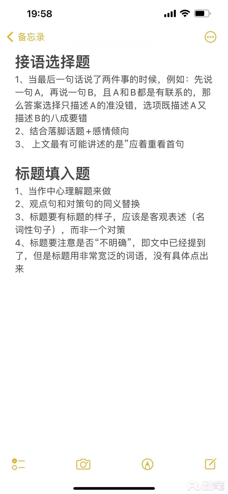

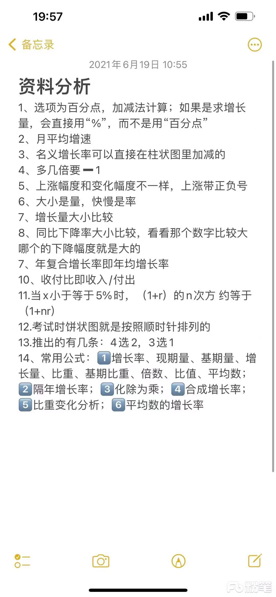

### 一些框架
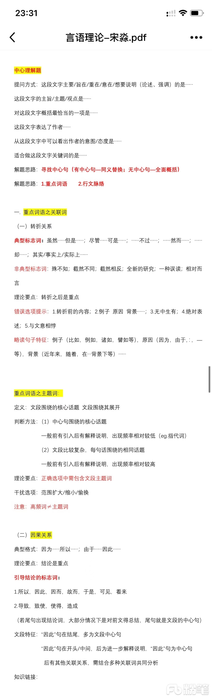
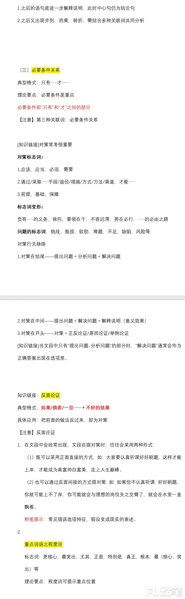
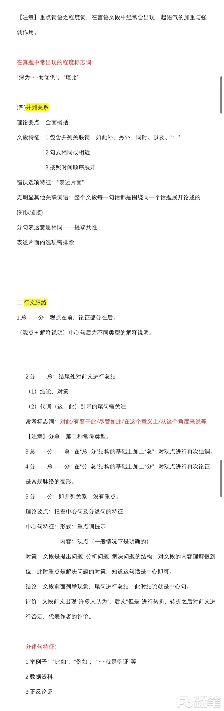
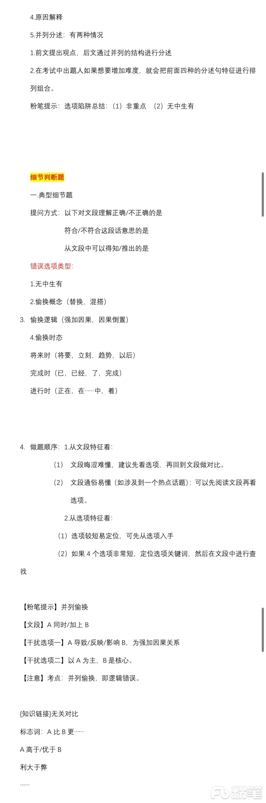
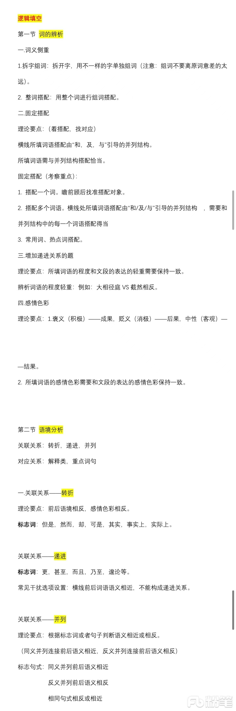
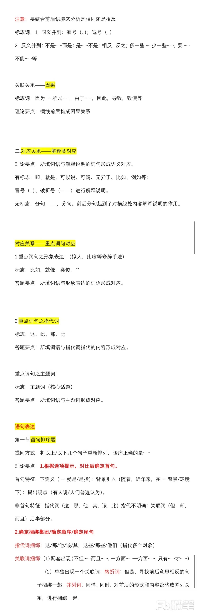
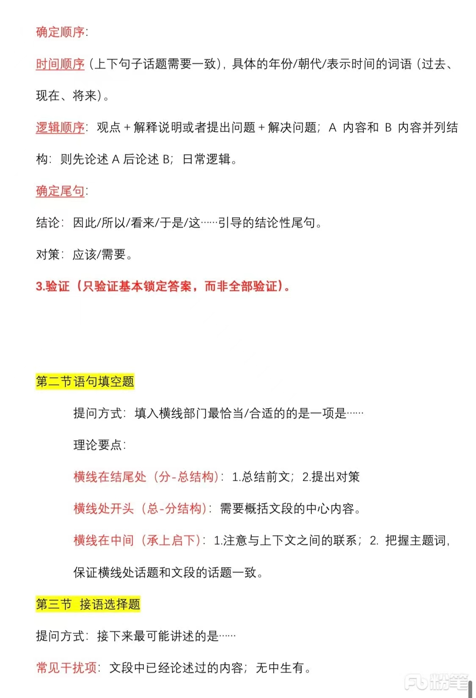
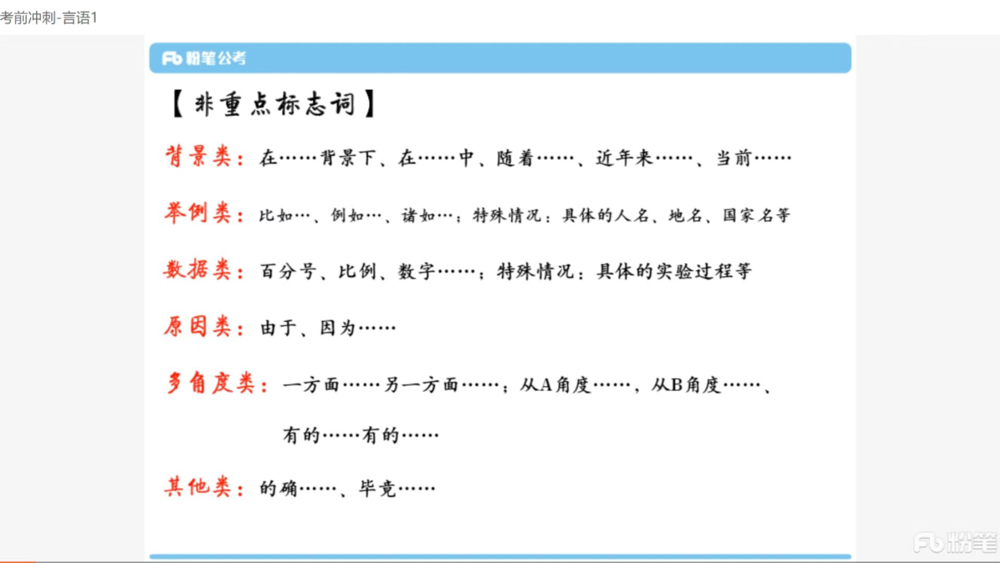

### 言语大神经验
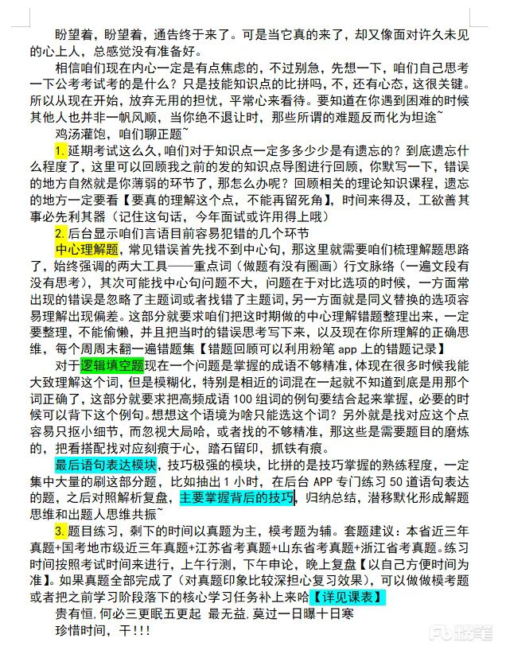