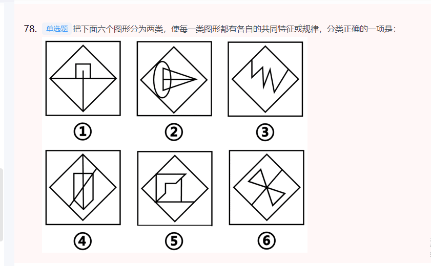
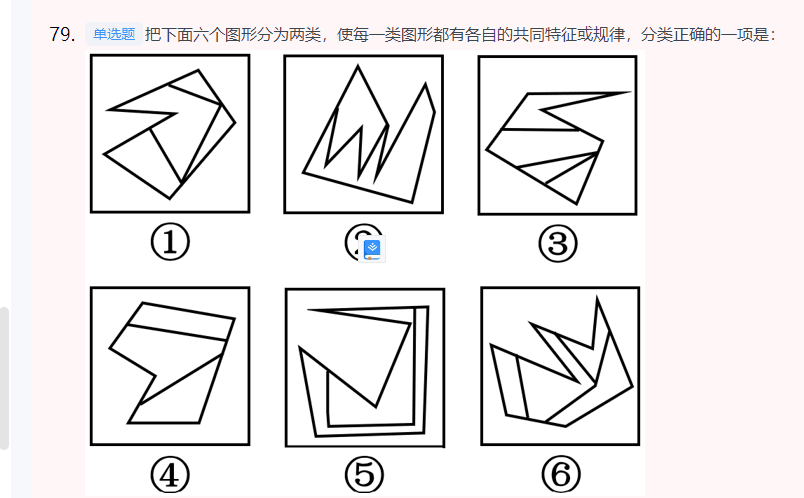
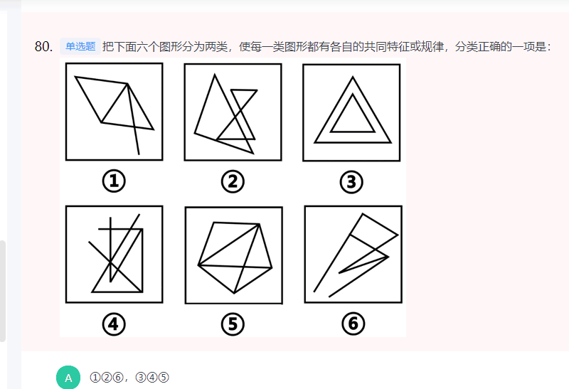

### 单一题

1. 词性
2. 目的反推
3. 关联词，也表示并列

### 综合题

1. 是什么（解释），为什么（问题，影响），怎么办（对策）
2. 找到这句话的前因后果。
3. 然后可以自己补充释义。去文段找对应的相关要素。
4. 对策，能体现要素的。

### 公文题

1. 格式：标题、称呼、落款

2. 内容，根据内容，找对策。按文章脉络分几段讲。

3. 结尾呼吁。

### 公文题