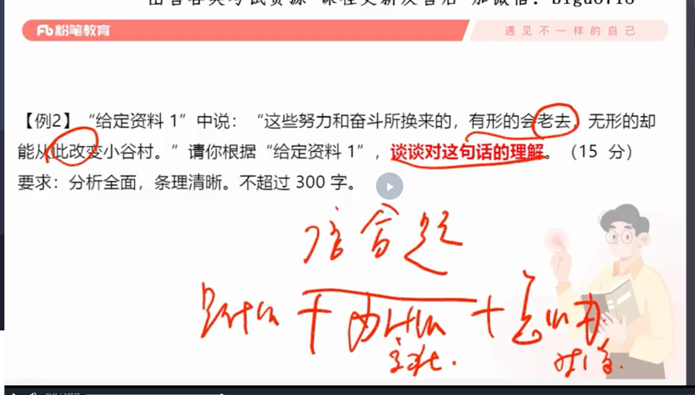
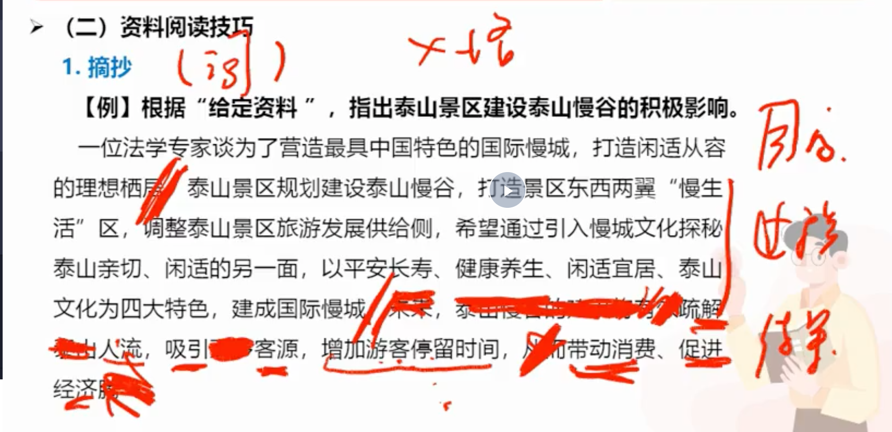
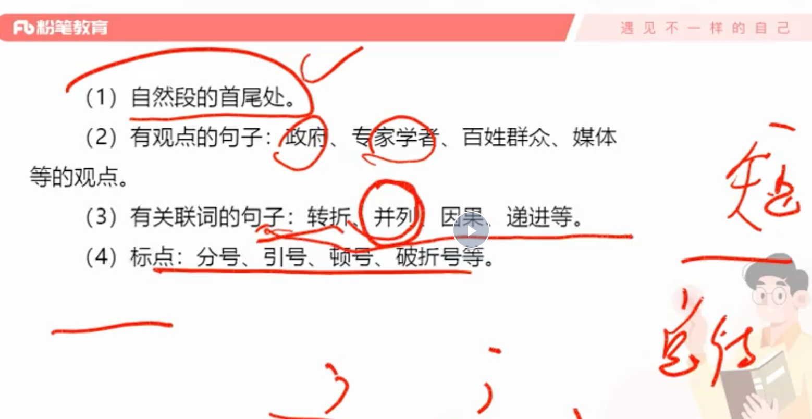
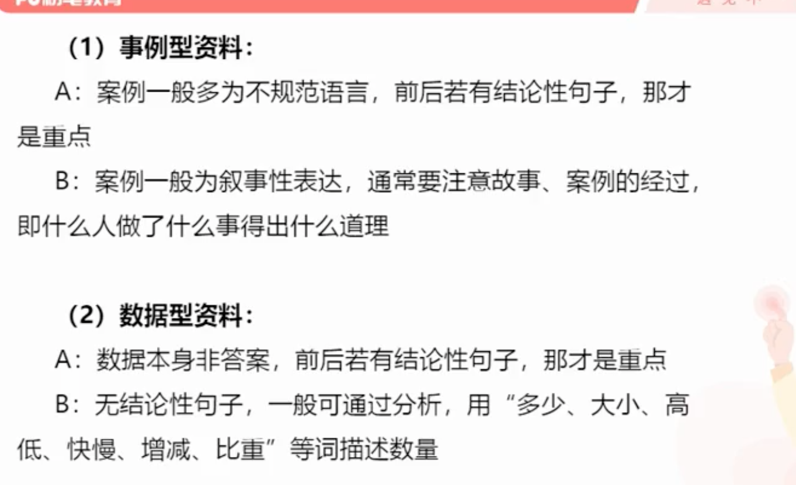
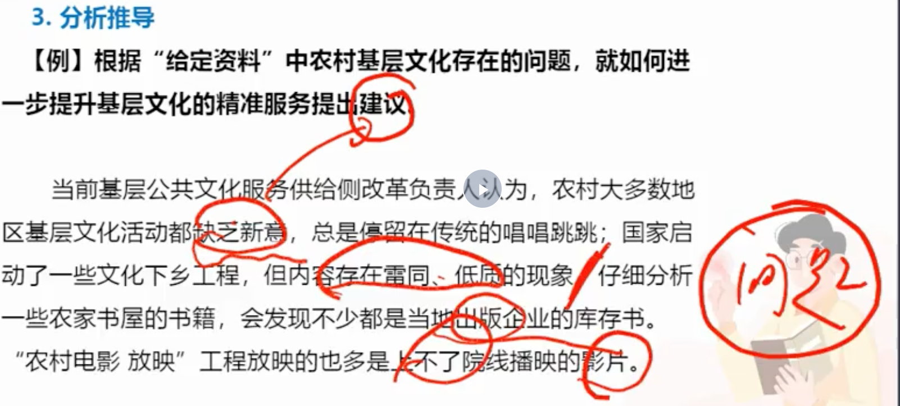
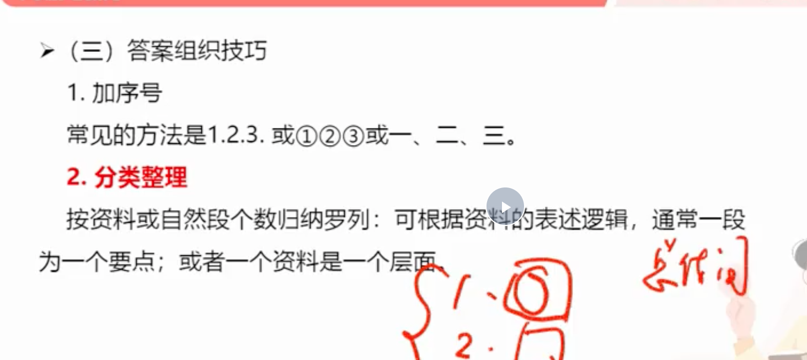
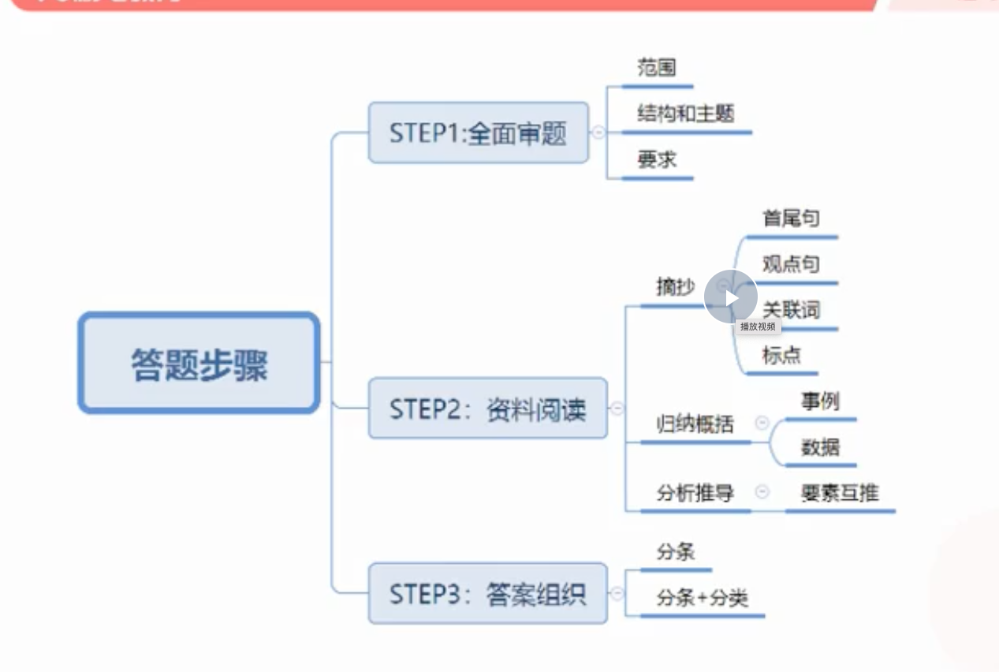
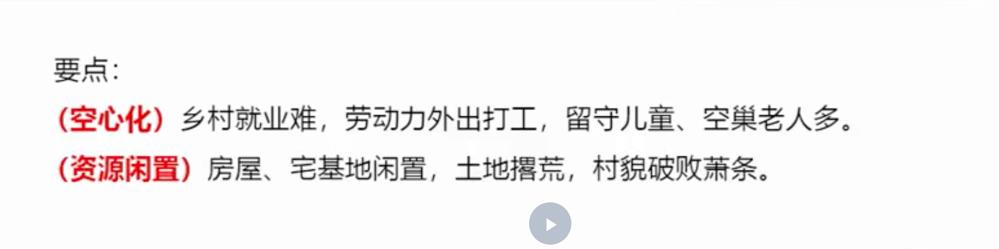
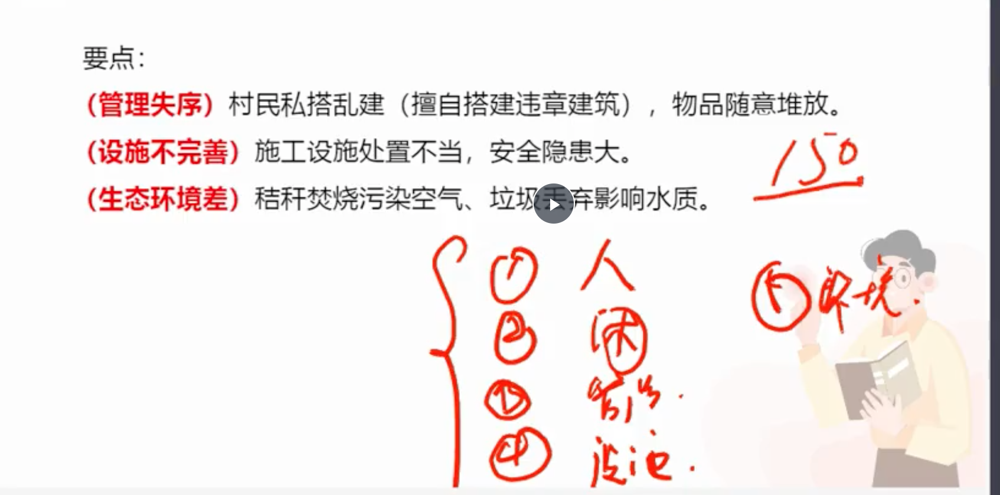
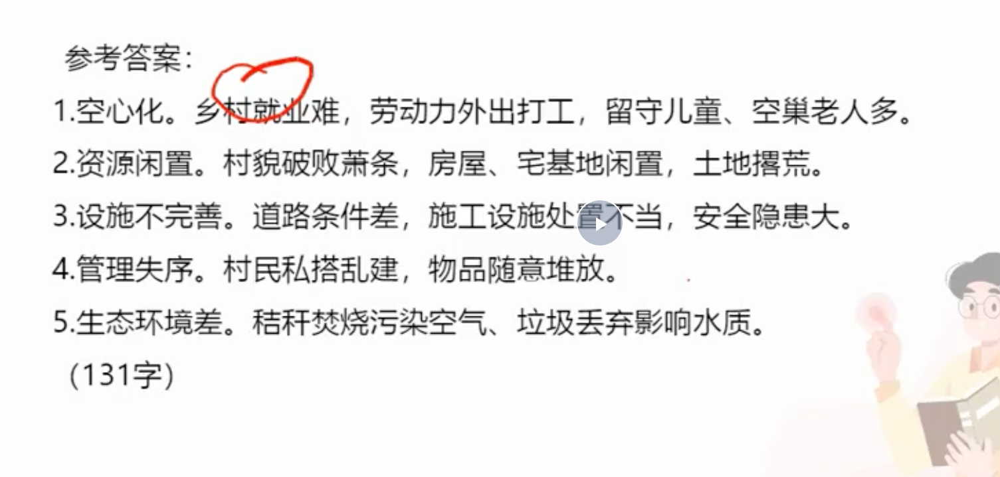

### 用时

- 单一题

```
考场策略：25分钟左右+80%的分数

```

- 综合题（是什么，为什么，怎么办）




- 公文题


- 作文


### 做题经验

- 做题预判

```
审题，并且用自己的话翻译。想象答案长什么样

```

- 什么时候抄，什么时候归纳，什么时候总结

```
短句子可以直接摘抄，而目的，不知道最后实现没有，所以需要推导

```

- 短句归纳

> 根据“给定资料1”，指出泰山景区调整旅游发展供给侧的具体措施。（2分）要求：准确、简明。不超过30字

```
为了营造最具中国特色的国际慢城，打造闲适从容的理想栖居。泰山景区规划建设泰山慢谷，打造景区东西两翼“慢生活”区，调整泰山景区旅游发展供给侧，希望通过引入慢城文化探秘泰山亲切、闲适的另一面，以平安长寿、健康养生、闲适宜居、泰山文化为四大特色，建成国际慢城。未来，泰山慢谷的建设将有效破解泰山人流，吸引更多客源，增加游客停留时间，从而带动消费、促进经济腾飞。

```

```
营造中国特色休闲栖居,吸引客源,增加停留，带动消费，促进经济
```


> 短句归纳容易出现的地方



- 推导归纳

> 根据“给定资料1”，归纳概括出W集团是如何助力于城乡建设与服务的。（2分）

```
2018年，定位于“城乡建设与生活服务商”的W集团在西部地区的L县，将公共建设方面的投入金额扩大到1000万元，用于改善当地道路、路灯、污水、交通、信息网络等方面的建设。集团北方区负责人李先生告诉记者：“像L县这样的地区，根本没有像样的文化广场，没有剧院或剧场，也没有图书馆，直接导致了老百姓文化生活的短缺。”为此，W集团与当地政府共同援建了当地首座非物质文化遗产博物馆，为当地老百姓带去了精神食粮。

```

```
扩大投入金额，改善基础设施建设，援建文化建设
```


```
扩大投资，完善公共设施，援建文娱设施

词语积累：设置，投资。
```


> 数据分析
```
工作时间长，休息时间短

```



> 根据问题提对策



```
增加新意
提升内容质量
引进外地书籍
增加上线影片

```



- 答题步骤



- 字数

```
1. 150个词大概20个字

2. 15分大概 3，条 5条 答案，对应4个词 和 7个词

3. 每行四个词（一个词五个字）

```

### 例子

- 根据“材料1”，对当前农村地区“乡村病”的具体表现进行概括。（15分）要求（1）全面，准确，简明；（2）不超过150字。

```
近年来，除却城市出现以住房拥挤、环境恶化、交通拥堵、生活质量下降等为表征的“城市病”之外。广大农村地区也开始出现了“乡村病”。

“外面像个村，进村不见人，老屋少人住，地荒杂草生。”（人少，地荒）这首小诗形象地描绘了乡村的景况。滦水镇庄里村是有着810年历史的老村，如今坑洼不平的黄泥路积水成窝，枯黄的杂草在砖缝里飘摇，许多废弃房屋已经倒塌。（村容破败。其实这里跟基础设施无关，概括要准确）村小组长介绍，800多常住人口，差不多有400人在外务工，（劳动人口流出多）一幢幢200多平方米的老屋仅住着祖孙三人或四人。（留守儿童老人多）还抱怨说：“我们组织办班培训，让中青年掌握一技之长，他们外出谋生没问题。可是，让他们在家门口就业就不是村里能做到的，（就近就业难）留守儿童、空巢老人的问题也不好解决。”与此同时，许多村庄出现了多年无人使用的宅基地。（宅基地闲置）

（分人和资源两方面）
在安置新村里，新建的楼房都是一层地下室加三层住房的户式，四至六口人的家庭均能满足需求，但仍有部分村民擅自搭建违章建筑，有的用来堆柴和放置农具，有的作临时厕所，有的作为小厨房放置煤炉，还有的放置车辆，甚至有人违章搭建经营场所，用于卖菜卖早点、销售建筑石料等，还拉起或竖立各种广告牌。（私搭建违章建筑，缺乏管理，随意堆放）村民周师傅说，搬到新房一年多了，走的都是泥巴路，“晴天一身灰，雨天一身泥”；（基础设施差）更让周师傅一家人担心的是，他家和邻居家中间空隙处设置了化粪池，但施工方没有将低洼处填平，导致积水很深，他特别担心5岁的孙子会掉进水坑。（工程设施安全隐患大）不远处的农田，村民正焚烧秸秆，现场浓烟滚滚，烟气刺鼻袭人。近边的池塘厚厚地覆盖了绿色的水藻，水面上还漂浮着各种垃圾、树枝等，水质泛黄，散发出一股难闻的气味。（环境污染，空气污染，水质污染）村民们说：“以前可以洗菜、洗衣服，如今拖把都不敢洗。”村道两边，尽管设立了很多垃圾桶，也新建有垃圾池，但仍然有装修垃圾和枯枝败叶等，随意堆放，无人问津。

```


```

1.基础设施落后，道路不通
2. 人员流出大，留守儿童老人多，就业难
3.搭建违章建筑，私营违建场所。安全隐患大，影响容貌
4. 环境恶劣，池塘污染。
5. 污染环境。乱烧秸秆，垃圾乱扔。
```





