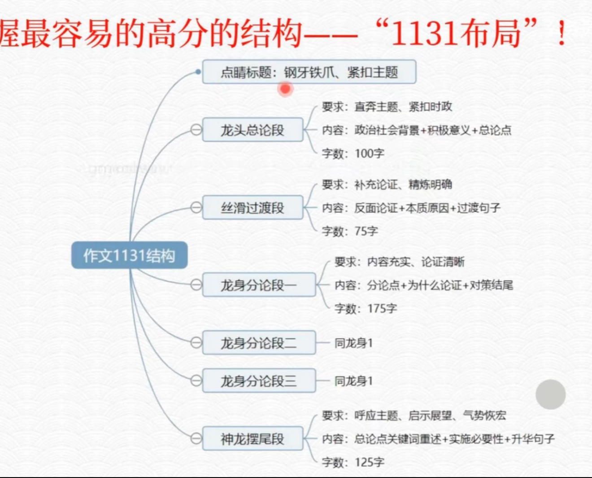
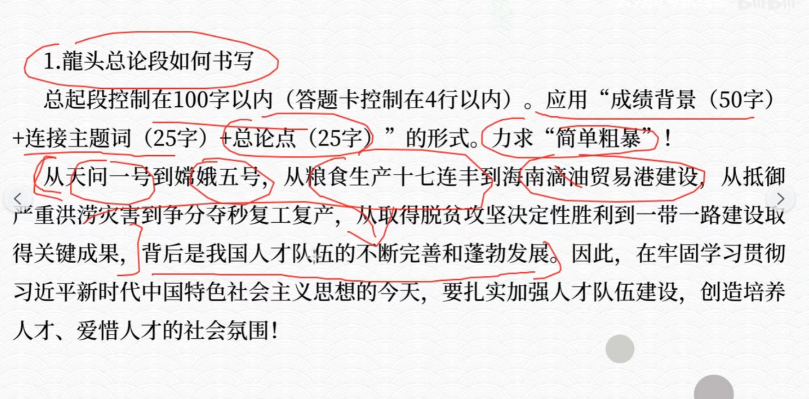
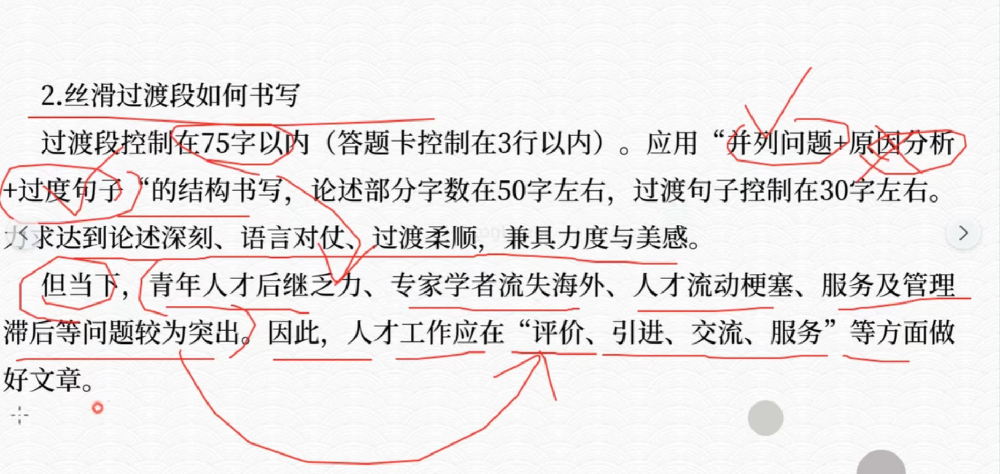
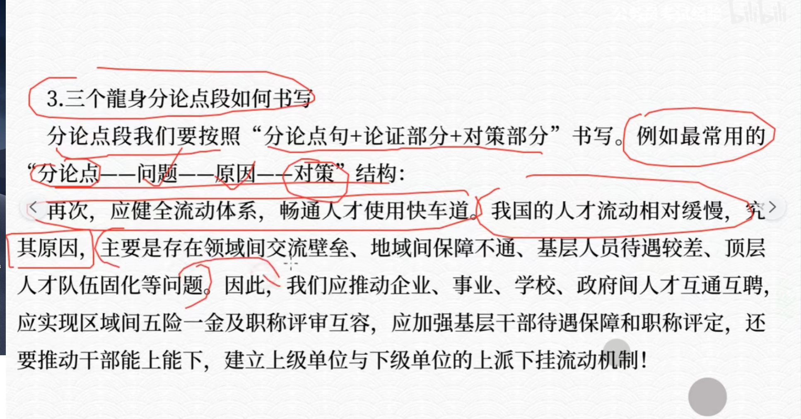
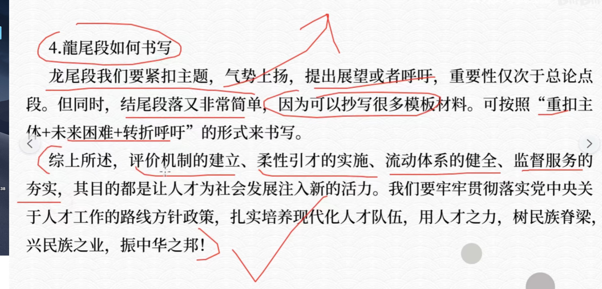
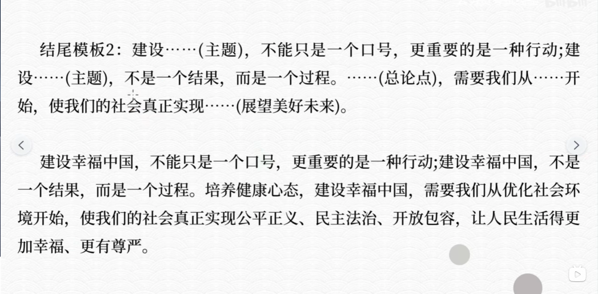

### 概括能力

1. 去掉定语，状语。将所有细节都找到。并且直接抄，不要改写。
2. 分门别类写下来。

### “小标题”

1. 概括题有“条理清晰”，“归纳概括”要求。一定要分类并且写小标题。
2. 主体分类法：

  - 1 挖掘每一段的核心主旨词语
  - 2 把相似的主旨词语进行合并
  - 3 为主旨添加动词或者其他辅助词语
3. 大作文

- 开头（例子可以从申论前面的例子抄写）

- 过渡段（并列问题+过渡句子）

- 三个分论点（要避免分别写论证或者分别写措施。应该按照：分论点+问题+原因+对策部分）

- 结尾（结尾可以有很多模板,四个分论点抄一遍，重构主体。）

