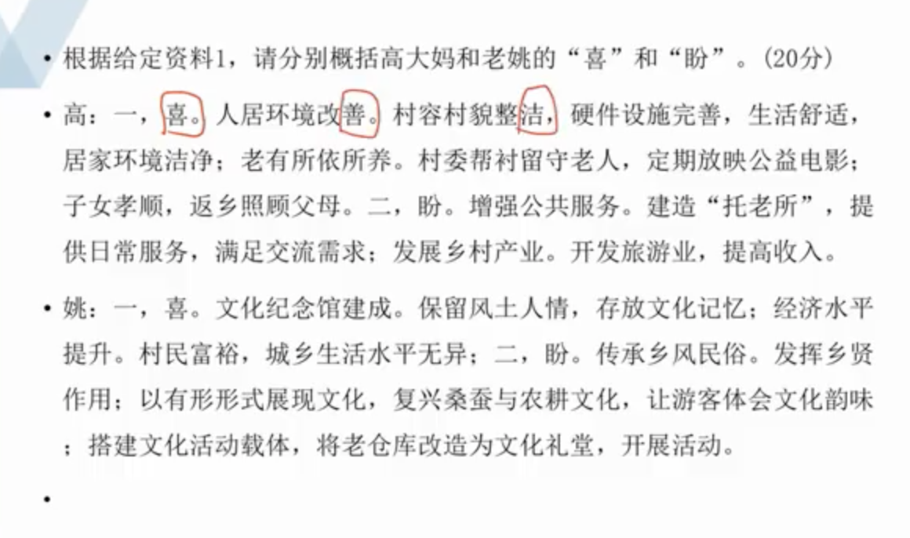

### 故事类材料概括提炼问题

```
来源：2021年公务员多省联考《申论》题

根据给定资料1，请分别概括高大妈和老姚的“喜”和“盼”。(20分)

要求：

（1）准确全面；

（2）分条陈述；

（3）不超过250字。
```

### 思路

- 喜一般是好的，盼带有一定消极的
- 抓住每个词。能翻译就翻译。找出关键句（和题目要求有关），摘抄并提炼
- 申论要规范，是要上新闻联播的。
- 可以写一、二、三、四，但是没必要写1、2、3、4，用分号代替阿拉伯数字。
- 故事性的材料，首先要找到符合文章要求的关键句 


### 对策题同类合并

题
```

新春伊始，《新农村》记者小梁到基层调研，以下是他在两个村庄采访的片段。

“村子真干净”，这是外来人对东各村的第一印象。村道上见不到一张纸片，家家院里院外也清清爽爽。79岁的高大妈笑着把小梁往屋里迎。冬季取暖煤改电以后，高大妈家装了地暖，外面再冷屋里也舒服。高大妈自己收拾得利索，家里拾掇得干净，屋里屋外的花儿都修剪得齐齐整整。她言语间透着喜悦，“儿子孝顺，春节前辞了城里的工作回来，专门照顾我们老两口。”“爸妈上了年纪，身体都不大好，有个头疼脑热，身边没个人照顾那肯定不成。”高大妈的儿子小曾买完菜刚一进门就接过了话头。

东各村是太行山脉的一个小山村。村子不大，一共250多口人，但老龄化程度不低，60岁以上的老人就有70多位。平时，村里就是这些老人“守着”。村委会一周放两次公益电影，捧场的也都是这些老人。“村里的大爷大妈都是居家养老，儿女负责赡养。子女外出打工的，只能是老两口互相照顾。村里打算建个‘托老所’，解决老人的日间吃饭和活动、照料问题。”村党支部委员李大姐介绍说，她时常会到高大妈家来看看，帮衬帮衬。听说要建“托老所”，高大妈觉得不错，“老姊妹能时常见上一面，唠唠嗑。”“老爸腿脚不好，出不了门，我们在跟前伺候着才放心。”小曾说。儿子能在身边尽孝，高大妈心里满意，可也着急。她跟李大姐商量：“咱村里能不能办个产业，让我儿子也能有点收入，不然他光照顾我们了，以后咋办？”

李大姐说，东各村边有条远近闻名的宋代古道，村内还保留着古道上唯一的一座三孔拱桥，来的游客不少。村里已经有10多户拿到了农家乐的经营执照，她说：“要是乡村旅游搞起来，不愁您儿子没事儿干！”

坐落在太湖之滨的水乡小村开弓村，则是另外一种景象。弯弯的小清河穿村而过，如箭在弦，村名由此而来。

甜茶、昆曲、桥文化……在开弓村文化纪念馆，或图文，或影像，或模型，地方风土人情跃然眼前。陈列厅里，一件件旧物什，散发着浓浓的年代感。“有不少是村民自己捐赠的，像这个老式碗橱，还有那套八仙桌椅，现在已经很难看到了。”被村里人称为“农民教授”的老姚感叹，这里存放的是村民共同的乡村文化记忆。开弓村越来越富，村民的生活和城里无异，但老姚喜中有忧，开弓村曾经是“处处倚蚕箔，家家下鱼筌”；如今，农耕文化、蚕桑文化却有淡化之势，“这是我们的根啊！”老姚颇有感慨。

如何传承乡风民俗？“首先要发挥好乡贤的力量。大家都有共识，要有个乡贤议事会。”老姚说。在成立后的乡贤议事会上，大家一致认为，要以有形的形式展现开弓村文化，如熏豆制作工艺，婚嫁习俗，摇三橹船，桑、蚕、丝到蚕丝被的一条龙产业……为什么要以“有形的形式”？老姚说：“让来到开弓村的人，从亲身参与民俗活动中体味到农耕文化和蚕桑文化的韵味。”村民的文化活动要有载体，开弓村发展较早，能用的土地已经不多，怎么解决？经过商议，村里准备把老仓库改造成文化礼堂。老姚高兴地说：“脚手架已经搭起来了，估计5月份就能启用。”按照规划，礼堂能容纳100人左右，今后村里的党员活动、小型培训、会议、文艺演出都可以使用。

未来，开弓村的文化回味必定更悠长。
```

