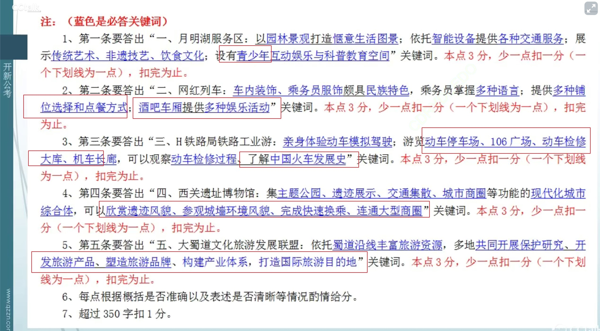
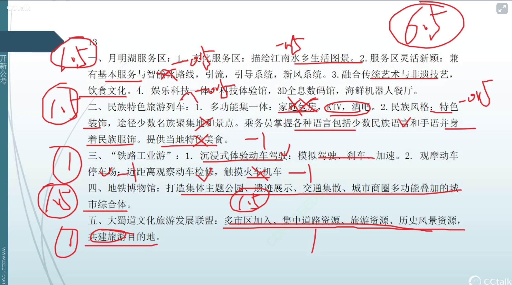

### 读题【2022年国考申论地市级综合管理岗卷】

- 题目

```
一、“给定材料1”呈现了交通旅游融合发展的几个案例，请你谈谈这些案例各自体现出了哪些亮点。（15分）
要求：全面、准确，有条理。不超过350字。

```

- 要点漏点注意

1. 交通如何融合旅游，亮点除了做了什么，还包括作用意义。

2. （3，4句）注意关联词-还-表示并列

3. 一句话的三个要点不要分开写

4. 青少年不要掉。明确的指示限定。

5. 分号注意表示并列，不要掉内容，不要只写分号的一个。

6. 举例子不要写。注意区分哪些例子不必要，重复的不要写。游学例子不是重复所以例子写了。（智能化例子，科技体验馆等的例子不要写。）

7. 亮点注意要写出，文章透露的意义作用，要写。


- 材料分析

```
1. 某高速公路的月明湖服务区，被网友誉为“最美园林文化服务区”。该服务区里有江南百年古桥，月明湖水流淌，桥廊相连，穿插亭台楼阁，耳边昆曲悠悠萦绕，一派“梦里水乡，诗画江南”的
【惬意生活图景】。
2. 在服务区大厅入口，总服务台提供导览、ETC充值、交通旅游咨询等服务，主通道有智能指路机推荐最合理的行走路线，停车场里智慧停车系统引导车流，公厕配备新风系统、人流智能引导系统。
【依托智能装备提供旅游服务】
3. 服务区***还***展示了昆曲、评弹等传统艺术和苏绣、缂丝、宋锦、核雕等非遗技艺，以及月明湖大闸蟹特色饮食文化等。
【当地特色：传统艺术、非遗技艺、特色饮食文化、为青少年准备了集互动娱乐与科普教育于一体的科技体验馆】

4.服务区***还***为青少年准备了集互动娱乐与科普教育于一体的科技体验馆、3D全息屏幕数码馆、海鲜机器人餐厅……这里，既是高速公路的驿站，也成为进入城市的“第一扇门”，彻底改变了游客对服务区的刻板印象，成功变身为旅游的“新景点”，甚至有人不惜绕路来此打卡。

5. 在西南A市和B市两地，运行着一趟兼有VIP家庭包房、KTV和酒吧的双层旅游列车，【引出下文没要点】夕发朝至，实现AB两城一线牵。这趟“网红列车”，车内装饰颇具民族特色，如彝族手工绣饰的坐垫、白族手工扎染的桌布、布依族蜡染式样的窗帘等【；】列车途经多个少数民族聚居地和著名景点【主题是列车不属于改造的亮点】，乘务员们身着沿途各民族服饰并熟练掌握普通话、英语、少数民族语言和简单手语。列车提供硬卧、软卧和VIP家庭包房供旅客选择【多种铺位选择】，餐车提供当地特色美食，可以线上点餐、送餐到包厢。【多种点餐方式】酒吧车厢可欣赏歌舞表演，或进行自助K歌、弹钢琴、打手鼓等活动。【酒吧车厢提供多种娱乐活动】“我喜欢选择这种火车游，很享受坐着火车慢慢体验车内车外独特风景的过程。”乘客王女士开心地说。
【车内装饰和服务员服饰具有民族特色。掌握多门语言。【铺位选择，点餐方式多，提供多种娱乐活动】--没有概括出来】
H车辆段动车所是H铁路局的动车组检修站，专门针对动车组列车进行检查、测试、维修和养护等作业，是动车组列车返回后的“休整”之地，被形象地称为“动车之家”。今年，H铁路局推出了体验式“铁路工业游”。这让15岁的火车迷小明兴奋不已。“真是太棒了！当了一回动车司机！我亲身体验动车模拟驾驶，还学习了如何给动车刹车、加速呢！”一天的研学旅游中，他走进酷似“陆地航母”的动车停车场，感受了那一列列动车完成检修、蓄势待发的气势；参观“106广场”，了解了中国火车从普通轨道时代到高铁时代所经历的106年发展历程；游历“动车检修大库”，近距离观察了动车检修的全过程；触摸“机车长廊”上整排的火车机车，就像慢慢翻阅着一部不断更迭的中国火车发展史。此次游历，也让工业强国的种子在他心中深深地扎下了根。

【亲身体验动车模拟驾驶】
【分号内容不要掉：动车停车场，106广场，大库，机车长廊】
【了解火车发展史--相当于作用意义】

“地铁站里还有博物馆？这也太牛了吧！”正用手机翻阅本地新闻的朱先生对妻子说，“周末我们也带孩子去那儿体验下呗，地铁公交都很方便。”朱先生所说的“地铁站里的博物馆”，正是C市刚建成开放的运济古城西关遗址博物馆。2015年，C市在修建地铁3号线过程中发现了明清时期运济古城的西关城门城墙遗址。为了保护西关遗址，经过多轮研究设计，相关部门最后决定变更设计方案：将整个近3万多平方米的场地，打造成一个集主题公园、遗迹展示、交通集散、城市商圈-----【这四个词对应下面的举例子内容】------等多种功能叠加的现代化城市综合体。地面一层是西关遗址公园文化广场，有大片绿地和健身步道，下沉的景观台阶和天窗便于欣赏遗迹风貌。----【作用】地下一层是遗址博物馆展厅，有2.5万多平方米核心展示空间，以青砖、土墙为主复原了西关城门城墙的环境风貌。----【作用】地下二层是地铁换乘中心，----【作用】有一个宽敞的中庭集散大厅，地铁3号线、5号线以及远期的16号线在此换乘，各线出入站的人流互不交叉，高峰时期站台也畅通无阻。此外，地铁通道各出口直接连通周边的大型购物广场、步行街、美食城及酒店，为市民游客提供良好的观展、游玩、休憩、购物和乘车换乘体验。----【作用】
【集主题公园、遗迹展示、交通集散、城市商圈多种功能叠加的现代化城市综合体】
【欣赏遗迹风貌，复原了西关城门城墙的环境风貌，快速换乘，连通周边商场---作用意义亮点要写】

为了在新时代共同弘扬大蜀道“活态”的交通历史文化线路遗产的当代价值，2020年9月28日在G市第十届大蜀道文化旅游节上，“大蜀道文化旅游发展联盟”正式成立，----【大蜀道文化旅游发展联盟】30个市县区成员加入联盟。联盟内的蜀道旅游资源十分丰富，如被称为“中国交通历史博物馆”的明月峡，集“先秦古栈道、金牛驿道、嘉陵江水道、纤夫道、宝成铁道、108国道”古今六道于一峡中；蜀道翠云廊段，两侧耸立的古柏雄伟苍劲，已历经两千多年的寒暑风霜；“一夫当关，万夫莫开”的剑门关，身临其境依然能感受到剑阁崔嵬、蜀道之难。----【旅游资源丰富，交通线路，文化线路。】蜀道既是巴蜀与关中、中原在漫长历史时期联系与交往的交通线路，也是多种文化交流融合的文化线路。为此，联盟各成员约定本着“沟通、协作、务实、共赢”的原则，结合区域发展、环境保护、交通运输、餐饮服务，----【只有后面的文字是干了什么，有动作需要概括：开展，共建，共打造】共同开展保护研究，共同开发徒步观光、蜀道自驾、文化体验等旅游产品，在此基础上共塑旅游品牌，共建产业体系，共同打造大蜀道国际旅游目的地。

【大蜀道文化旅游发展联盟】
【依托蜀道沿线旅游资源】
【共同开展保护研究，共同开发旅游产品，共塑旅游品牌，共建产业体系，共同打造国际旅游目的地】

```

- 我掉了的内容，按点扣风，没有写它展现了什么，作用是啥

### 做题以及得分


