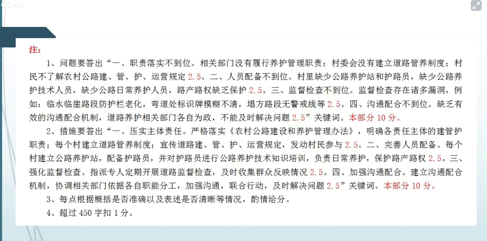
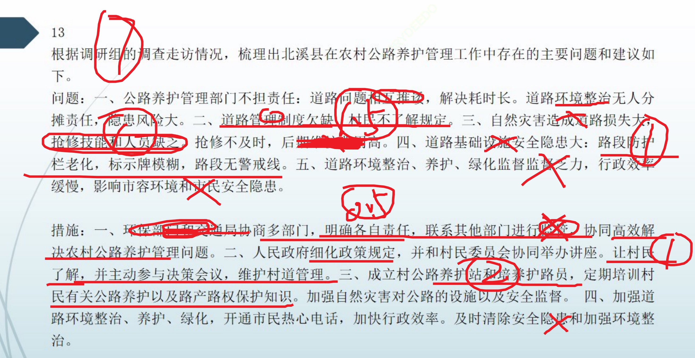

### 读题【2022年国考申论地市级综合管理岗卷】

- 题目

```
请你根据“给定资料2”调研组的调查走访情况，梳理出北溪县在农村公路养护管理工作中存在的主要问题，并提出解决问题的建议。（20分）
要求：问题梳理全面、准确、有条理；所提建议与问题相对应，具体明确、切实可行；不超过450字。

```

- 要点漏点注意

1. 问题还是比较直接，每一段一个问题，但是我没总结出来第四点。沟通配合机制。
2. 对策来源：1. 材料直接给（最优先级） 2.问题推
3. 不要直接写材料给的什么自然灾害的问题，而是要写造成自然灾害破坏大的原因，比如无人监管
4. 就算概括也要用文章的字，词概括，不要自己编词。谨慎！
5. 文章的带分号的对策不要略写，有三个就写三个不然会扣分：比如技术种类人员。
6. 有些词也不要略写会扣分。注意文章的问题，不要漏字。

- 问题用【文字】表示，对策（文字表示）
- 材料分析

```
2021年8月28日，H市北溪县召开了农村公路提升工程动员会。
会上，王副县长指出，农村公路是按照公路工程技术标准修建的县道、乡道、村道及其所属设施，建设好、管理好、养护好、运营好农村公路，是建设人民满意交通的基础性工作，也是城乡一体化融合发展的重要保障。今后三年，全县将以农村公路提升工程为契机，在保证农村公路通达性、快捷性的基础上更加重视其景观性、服务配套性建设，要将农村公路风景廊道建设与农村环境治理、“美丽乡村”建设紧密结合起来，打造自然景观与人文景观和谐交融的农村公路，为全县乡村振兴和农业农村现代化建设注入澎湃动力。
2020年底，北溪全县基本实现了县到乡、乡到行政村、行政村到村民小组100%通水泥路的目标。为了准确掌握全县农村公路建、管、护、运营的实际情况，制定出切实可行的农村公路提升工作方案，由县交通运输局、财政局、农业农村局、乡村振兴局等组成的联合调研组，于2021年9月开始对全县乡镇的农村公路进行了为期一个月的实地调研。
按照《北溪县农村公路建设和养护管理办法》对策（严格按照《》保护法）规定，县人民政府是农村公路发展的责任主体，负责本行政区域内农村公路规划、建设、管理、养护、运营工作。乡（镇）人民政府是乡道建设和养护管理的主体，乡（镇）交管办公室具体承担乡道的日常养护和组织实施乡、村道大中修工程。村民委员会是村道建设和养护管理的主体，【相关部门没有履行养护管理职责】对策（明确各责任主体的建管护职责）

村民委员会按照村民自愿、民主决策、一事一议的方式组织村道建设和日常养护管理，维护村道的路容路貌，制止村道的占道、破坏行为。村组的道路，其建设和养护管理主体为受益的。调研组在现场调查和走访中发现，全县已彻底解决了多年来农村行路难问题，畅通的农村道路让群众出行和农产品外运更加便捷，有效带动特色种养、客货运输、乡村旅游等产业，促进了农民增收致富。
不过，农村公路养护管理中也还存在一些明显短板。如部分乡道、村道的道路硬化通车后，相关部门就不养不管、好坏不问了；部分村委会没有建立相应的村组道路管养制度，【村委会没有建立道路管养制度】对策（每个村建立道路管养制度）


--- 一部分：主体【职责落实不到位】对策（压实主体责任）


而村民也对农村公路建、管、护、运营规定知之甚少。【村民不了解农村公路建、管、护、运营规定】---注意不要漏字对策（宣传建管护运营规定）

在三里坡村，调研组就村民参与村组道路管养情况进行了入户走访。面对调研组的询问，村东头的老王诧异地说：“公路管养不是乡政府的事吗？跟我有啥子关系嘛。”“我们乡每年汛期山洪、泥石流造成的道路塌方、下陷、掏空、堵塞得不到及时抢修，致使乡村道路损坏严重，后期修复费用很高。”东七乡的吴乡长向调研组介绍说，“目前村里大都没有公路养护站和护路员【村里缺少公路养护站和养护员】，

懂得公路养护技术知识的人也少【缺少公路养护技术知识人员】。因此，没有人负责组织公路日常养护工作，村组道路路产路权缺乏保护。”【路产路权缺乏保护】

--- 二部分：人【人员配备不到位】对策（每个村建立公路养护站配备养护员，并培训公路养护技术，负责组织公路日常养护工作，组织路产路权保护）
调研组在山南乡走访时发现，修筑于山坡峡谷之间的村道山高坡陡，临水临崖路段防护栏老化，弯道处标识牌模糊不清，塌方路段也无警戒线以及其他保护措施等。“村级公路养护监督检查确有诸多漏洞【监督检查存在漏洞：例如：临水临崖路段防护栏老化，弯道处标识牌模糊不清，塌方路段也无警戒线。】。对策（派人定期开展道路监督检查，及时收集群众反映。）

一些山坡峡谷路段，车流量小，如果没有群众反映，对策（发动群众参与）我们很难发现道路养护上出现的问题。目前，我们正在研究加强监督检查的措施。”山南乡党委洪书记解释道。

--- 三部分：监督检查【监督检查不到位】

随着国家农村公路通达工程不断深入，农村客运站、招呼站和快递点越来越多，基本建成了覆盖县、乡（镇）、村（社区）三级的农村客运物流网络，方便群众生产生活。不过，调研组发现，由于缺乏有效的沟通配合机制【缺乏有效的沟通配合机制】，对策（建立沟通配合机制）

有些乡镇与村组道路的环境整治、养护和绿化，即使发现了问题也是“各人自扫门前雪”，得不到及时解决【道路养护部门各自为政】对策（协调相关部门依据各自职能分工，加强沟通，联合行动，及时解决问题）。

------【下文是举例，表示并列不重要，而上方的公路危险是总分结构要具体写】如清溪中学门前因交通事故导致道路护栏、绿化带损毁严重，交管部门接到通知后，护栏及时得到了更换，绿化带却长时间无人修复；【不能及时解决问题】
清溪河附近道路警示桩随意堆放路边、大量生活垃圾无人收运处理，给群众出行带来安全隐患，环保部门接到投诉后及时对垃圾进行了清理，警示桩却无人过问……


-- 四部分：沟通配合机制【沟通配合不到位】---没读懂最后一段，人家给了你问题关键字了。

```

### 做题以及得分



