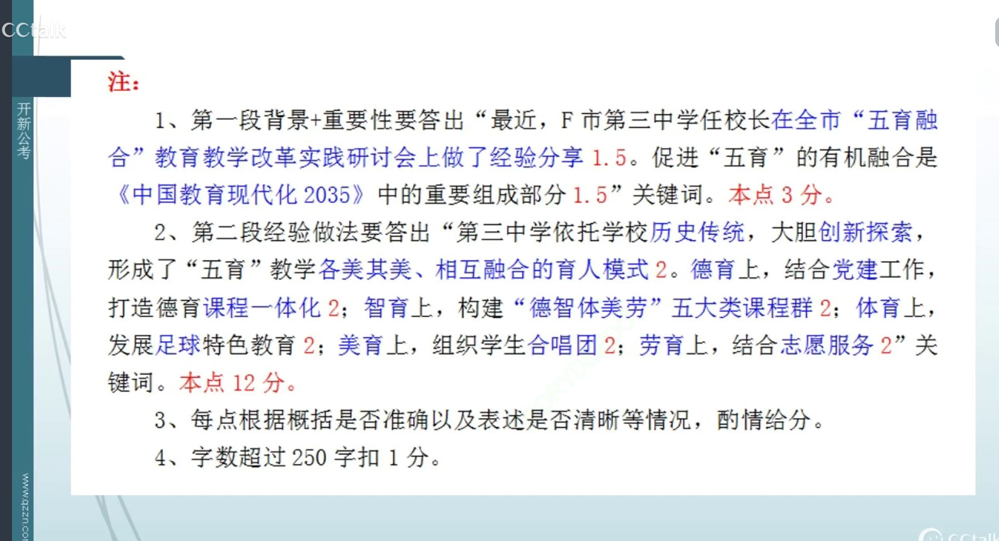
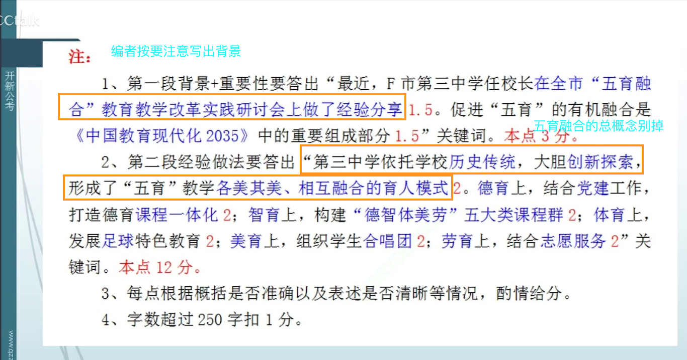

### 读题【2022年国考申论地市级综合管理岗卷】

- 题目

```
F市教育局准备根据“给定资料3”中任校长的发言稿编一期简报，推广第三中学“五育”融合育人的做法。请你为该简报撰写一则“编者按”。（15分）
要求：全面、准确、简明扼要。不超过250字。

```

- 要点漏点注意

1. 【智育】要找课程与其他课程有什么特点之处。因为他的主题词就是课程随处可见，但是不能全部抄。
2. 主要找以什么为抓手，而不是写意义作用
3. 编者按主要要写出背景
4. 五育融合的总概念别掉


```
2021年9月10日，F市教育局、市基础教育改革与发展研究中心召开全市“五育融合”教育教学改革实践研讨会。F市第三中学任校长在会上做了经验分享，以下是其发言内容：

---这个会是从文章中概括得来。背景别掉！【F市第三中学任校长在全市“五育融合” 教育教学改革实践研讨会做了经验分享。】

中共中央、国务院印发的《中国教育现代化2035》提出，要更加注重全面发展，大力发展素质教育，促进德育、智育、体育、美育和劳动教育的有机融合。“五育”分别承载着自身的育人目标和价值，在各司其职的基础上走向融合，达到彼此渗透、创新融活，共同促进学生的全面发展、整体发展、个性发展。
--- 注意有有机融合的词语从文章中抄来【促进五育有机融合是《中国教育现代化2035》重要组成部分】


经过多年的教育改革和创新实践，我校【第三中学】确实取得了一些办学成绩，也获得较高的社会荣誉，被批准为省教育科研基地学校、全国首批普通高中课程改革基地学校、全国首批示范性高中建设学校、国家级体育传统项目学校等。在学校的发展过程中，我们始终根植于学校原有历史传统的沃土，进行大胆创新探索，形成了“五育”教学各美其美、相互融合的育人模式。

--- 【第三中学依托历史传统，大胆创新，形成了“五育”教学各美其美、相互融合的育人模式】--主体总结，因为有融合这个词，所以要总结一起写。

一直以来，我校将党建工作和德育有机结合，【党建工作和德育有机结合】党员教师在思想和教育工作上始终发挥着模范引领作用。与此同时，我们又大力打造德育课程一体化【打造德育课程一体化】：德育智慧课程，包括思想政治课程、家国情怀和责任培养课程，保证教学质量和育人效果的融通；德育情感课程，包括感恩教育、传统文化等方面的课程，培养学生高尚情操和文化认同，让其情动而辞发；德育意识课程，包括遵纪守法、规范养成、生命教育等类型的课程，由内而外增加德育的效果；德育行动课程，包括身心健康、艺术审美、创意社团等方面的课程，构建起浸润渗透性德育课程，形成综合育人、多元育人、特色育人的模式。

---【德育】 党建工作和德育有机结合，打造德育课程一体化。

课程是落实教育内容、完成培养目标的重要载体。我校大力加强课程教学模式的研究，坚持教学相长，注重启发式、互动式、探究式教学，鼓励学生多动手、多动口、多动脑，发挥学生的主观能动性，促进学生认知的发展。在我们学校，课程内的学习不仅仅是启发学生智力、增长学科知识的主要手段，学校的一切教育活动均被纳入了课程的范畴。我们将课程对标“德智体美劳”总体育人目标和各学科课程标准，构建“德智体美劳”五大类课程群，【构建“德智体美劳”五大类课程群】将每个教学单元打造成育人单元，将教学目标、教学内容、教学过程、教学资源以及课程评价等相关工作紧密结合，建立起教师发展带领学生发展、学校发展的课程有机融合系统，这也让我校的“五育”融合教育改革和教学实践充满着不竭动能与活力。

--- 【智育】构建“德智体美劳”五大类课程群。要找课程与其他课程有什么特点之处。

自学校创办时，我校便组建了足球队，成为我国最早开展校园足球运动的学校之一。【】这一传统至今从未间断，足球已植根于每个三中人的心中，成为最重要、最独特的校园文化印记，形成了特色，且赢得了无数奖杯。在三中，足球的传承超越时空和年龄限制，即使是80岁的老校友也可以回校踢一脚，与年轻学子一起感受足球的魅力。在我们学校，足球教育带动了各项体育运动的蓬勃发展。虽然不是每个走上运动场的学生都能成为体育明星，但是从小接受体育精神的熏陶，积极参与体育锻炼，能使他们拥有团结勇敢、坚忍不拔的优良品质，成为身心两健的未来社会建设者。

--- 【体育】组建了足球队。

让音乐在校园中流淌，让美与人在校园里相遇、相知。我校的学生合唱团历史悠久，多次登上大赛领奖台，已成为学校的一张靓丽名片。【】近年来，我校合唱团多次受邀参加国家级大型活动展演，走进社区、敬老院进行公益表演，不但传播了艺术之美，还实现了超越音乐本身的价值。我们组织了高强度的训练来培养他们，同时引导他们学习处理学业和合唱训练的双重任务和压力。大家既锻造出了刚毅坚强的品格，也培养出了同舟共济的团队精神。

--- 【美育】组建学生合唱团。

劳动教育是从志愿服务开始的。【】志愿服务项目是我校“五育”融合育人模式的重要载体，它让德智体美劳在实践中贯通融合为一体。为此，我们建立了学生志愿服务考核机制，让“学习雷锋、奉献他人、提升自己”的志愿服务理念真正落地。全国足球赛事志愿者、洁净沙滩志愿者、春运志愿者、海岛游览区志愿者等等，都是三中学生的社会角色。同时，我们将劳动教育渗透到各学科之中，从学科实践入手，劳动与技术通过专业教师的指导渗透到学科教学之中。如组织学生到博物馆提供义务讲解，既传播了优秀传统文化，也增强了学生社会责任感和实践能力；成立文化小使者服务队，制作文创产品，将美术、物理、化学、文学、历史等学科知识引入到劳动之中，沉浸式培养了学生的兴趣爱好、审美情趣和个性特长，使之成为具有社会使命感和专业精神的社会服务者。

--- 【劳育】结合志愿服务。

```

### 做题以及得分



