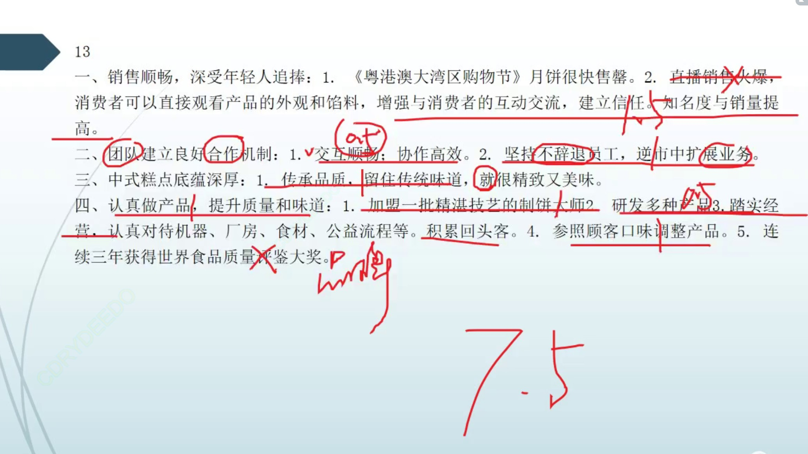
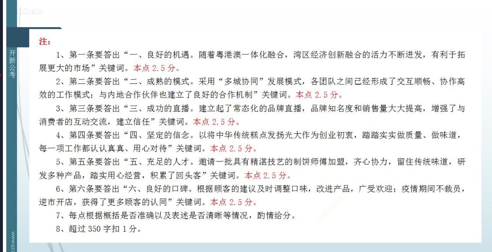

### 读题【2022年国考申论地市级综合管理岗卷】

- 题目

```
“给定资料4”中M公司的黄总对公司的发展前景充满信心，你认为他为什么有这样的信心？（15分）
要求：分析全面，条理清晰。不超过350字。

```

- 要点漏点注意

1. 启示型分析题，要先思考，分析什么是有助于他企业成功的原因。有利条件。


```
“卖空了，卖空了，都来不及补货了！”M食品公司创始人黄总兴奋地说。原来，在首届“粤港澳大湾区购物节”期间，公司准备的近10万盒月饼，短短10天就被抢购一空。
首届“粤港澳大湾区购物节”，将粤港澳三地的优质商品置于一个购物场景中，让大湾区街坊最爱的系列品牌和老字号，借着购物节的东风拓展更大的市场，体现了湾区经济创新融合的活力。【】

--- 【良好的机遇】
随着粤港澳一体化融合，【】越来越多的湾区品牌也步入“多城协同”的发展模式。【】“我们虽然把研发团队和工厂设在香港，将电商团队、直播团队和物流仓库放在深圳，但是各团队之间已经形成了交互顺畅、协作高效的工作模式【】，与内地合作伙伴如知名电商、百货公司、大型超市等建立了良好的合作机制。【】”黄总介绍说，去年起公司就与某直播间合作带货，场场火爆，品牌知名度和销售量大大提高，【】今年又在直播平台、大型电商平台建立起了常态化的品牌直播。【】“做店铺直播，可以让消费者直接观看产品的外观和馅料，避免货不对板的现象，增强与消费者的互动交流，建立信任。【】相比去年，今年月饼销量同比增长了40%~50%。”

--- 【成熟的模式】
其实，M公司成立仅有4年。“在国外读书的时候，能吃到很多做工精致又美味的西式点心，但始终心心念念的中式糕点却难寻踪影。”从那时起，将中华传统糕点发扬光大的种子就深深埋在了黄总的心里。2012年，黄总辞去某酒店高管职务，开始创业。“新品牌从零开始，想要闯出名堂，就只能踏踏实实做质量、做味道。无论机器、厂房、食材、工艺流程等，每一项工作，都必须认认真真、用心对待，才能传承品质留住传统的味道。【】”基于这种思想，他前前后后筹备了近6年，直到2018年，公司才真正投入运营。
“馅料一定要控制好，因为如果太稠，它就不能流动；如果太稀，它就会流得只剩一个壳。只有慢慢流出来的才是最好的……”饼艺大师陈师傅一讲起月饼制作技艺总是滔滔不绝。创业初期，经过黄总多次邀请，陈师傅才加入了M公司。

--- 【成功的直播】

“陈师傅曾是知名酒店的点心大师傅。他入行50多年来，研发出了各种风味、口感的月饼，用自己的双手为人们带来交口称赞的美味点心……而我是用两个字来打动他的，那就是‘传承’，因为陈师傅非常热爱饼艺，也很想将其技艺传承下去。”除陈师傅之外，还有一批具有精湛技艺的制饼师傅被黄总邀请加盟。他们齐心协力，留住传统味道，研发出多种产品，踏实用心经营，使这个新兴品牌成立才4年，就积累了不少回头客。【】“我们会根据顾客的建议调整口味，改进产品。”黄总说，去年月饼推出后，有不少顾客反映，希望减少含糖量、加重咸蛋黄的香味，师傅们于是竭力调整，口味改进后的月饼广受欢迎。
“我非常喜欢这个品牌的月饼，此前是托朋友从香港实体店买回来的，而现在只要从线上下单后，隔天就可以收到。”居住在中山市的美食博主小付介绍说，“这种月饼很受我们年轻人追捧，不用加热也可以感受到满满的流心，甜度适中，奶香味和咸蛋黄的香味融为一体，外皮也是十分细腻。不愧是连续三年获得世界食品质量评鉴大奖的品牌！”

--- 【坚定的信念】
“过去两年，虽然有疫情影响，但我们始终坚持不辞退员工，并想方设法在逆市中扩展业务，先后开了20多家分店，【】产品也获得了更多顾客的认同。”谈及未来，黄总说，“我对公司的发展前景充满信心。今后最根本的仍然是一心一意做好味道和质量，希望能将好吃的中华美食带给更多人。”

--- 【良好的口碑】


```

### 做题以及得分

