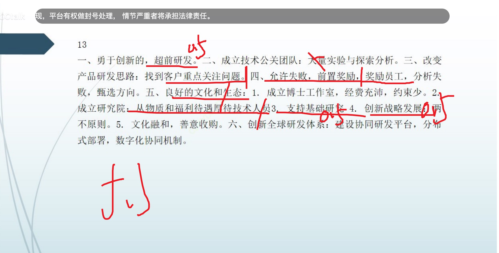
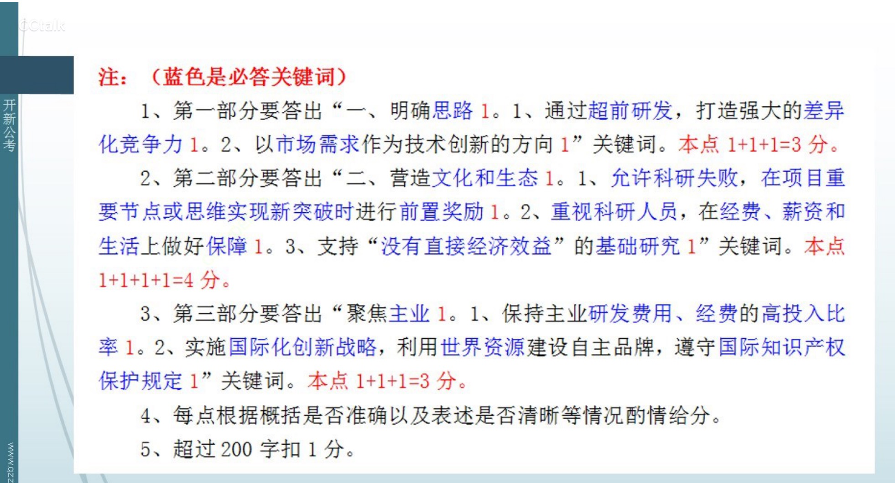

### 读题【2022年国考申论地市级综合管理岗卷】

- 题目

```
材料1
B公司是我国一家著名的装备制造企业，研制出了全球首款热效率突破50%的商业化柴油机。
“刚提出能不能挑战50%热效率时，就遭到技术专家的质疑：国外那些先进企业都没有做到，我们凭什么能做到？”该公司负责人王经理说，“我们就是要做别人没做过的。”他认为，在云谲波诡的行业市场变化中，只有通过超前研发，拥有强大的差异化竞争力，才能抵御风险，赢得优势。
---【超前研发，打造强大差异化竞争力】--文章都强调了只有，很重要，为什么不加上打造强大差异化竞争力？

公司专门成立了热效率技术攻关团队，通过大量的仿真和台架试验，经过上千种方案的探索分析，不断尝试与改进，最终把发动机各个方面的功能发挥到极致，实现了热效率突破50%。

“思路决定出路。”

一、【明确思路】


王经理说，以往一些科技企业遭遇挫败是因为单纯以技术为主导，按已有的技术去做产品，再去找销路，结果市场并不认可。现如今，货运市场竞争十分激烈，运费普遍不高，油耗成本却水涨船高，如何“开源节流”才是卡车客户重点考虑的问题。“卡车司机驾驶搭载我们新款发动机的车辆，【重点考虑】每百公里油耗能省10%左右，按照一年跑20万公里计算，以目前的油价一年就能省下三四万元的油耗成本。”王经理介绍说。

--- 有时候对策不好找的话。就用问题推对策。问题是市场部认可。
---所以总结为：以市场需求作为技术创新的方向（这也算在明确思路里面）

创新是一个不断尝试和失败的艰苦卓绝的过程。在一次新方案的台架试验中，当热效率即将突破50%时发生了意外，烧了发动机。所有人都做好了写检讨的准备，但让大家没想到的是，不仅没有被批评，还拿到了当月的前置奖励奖金。【前置奖励奖金】


前置奖励是B公司独具特色的激励措施，新技术新产品的开发周期较长，如果等到结项时再评审嘉奖，就会导致激励效果大打折扣。所以B公司将激励前置，在项目重要节点或者思维实现新突破时，就给予员工丰厚的奖金。“我们允许科研失败。”王经理说，在团队攻坚克难中，很多方案都是失败的，大家通过对失败案例的分析，甄选出更好的方向。

二、营造文化和生态

---- 允许失败，在项目重要节点或者思维实现新突破时，就前置奖励。（对失败案例的分析，甄选出更好的方向，这个是对策的意义。所以200字太少不写）

对于这种文化和生态，

【文化和生态】B公司发动机研究院姜院长印象也很深刻。2017年，姜院长成立博士工作室，专攻50%热效率项目。博士工作室研究经费上不封顶，没有人约束，可以做任何事。没多久他就成功申报了500万元经费，一个博士工作室刚成立就能给这么多钱，姜院长感慨万分。
B公司每个研究院每年有2000万元研发经费，无须审批，干什么自己说了算；公司连续两年拿出1亿元重奖科技人才；科研人员收入是管理人员的2倍以上；晚上加班有免费工作餐，下班打车报销，从本科到博士都有住房补贴……【

--- 【三、科研人才重视】
---- 在经费，薪资和生活上做好保障

更为难得的是，公司每年拿出1000万元用于支持“没有直接经济效益”的基础研究。“

----【支持没有直接经济效应的基础研究】带引号的不要轻易删减

你能想象，一个博士团队，可能用5年、10年攻关一个科研项目，然后失败的情景吗？我们现在做的都是创造性的科研项目，一些基础研发时间很长，失败率也很高，唯一支撑大家的就是勇攀高峰的信念。”王经理言语中透露着坚毅。


近10年来，B公司仅在发动机业务方面就累计投入300亿元，研发费用、研发经费的比率保持在8%以上。“无论是抓住机遇抢抓行业‘黄金期’，还是积极应对行业‘寒冬’，我们始终心无旁骛攻主业。

---- 保证主页研发费用经费高投入比率（这点掉了，属于专注主业）

---- 这点搞忘了【三、心无旁骛攻主业】

”王经理说，“我们的创新战略提出了两个‘不’：一是‘不关门’，以开放姿态利用世界上好的资源开展自主品牌建设；二是‘不违反’，遵守国际知识产权保护相关规定。”
----【实施国家化创新战略】（我掉了主语可不行）
--- 【利用世界资源建设自主品牌】

近10年来，B公司先后收购了法国、意大利、德国等国家的多家企业。收购法国某公司时，B公司出价仅为299万欧元，而一家外国竞标者出价一度高达1500万欧元。B公司如何以低价取得了胜利？原因是B公司承诺该公司100多个员工一个也不下岗，而竞争对手则要求立即裁员30%，最终B公司提出的“文化融合，善意收购”得到了认可。

目前B公司在多个国家建立了研发中心，通过创新全球研发体系实现了技术共享、全球研发、协同共赢。公司对发动机研发流转进行了优化，建设了具有强大功能的、完整的、基于互联网支撑的全球协同研发平台。


该平台秉持“统一标准、全球资源、快速协同、最优品质、集中管控”五大原则，充分考虑数据安全性，依托明确的信息共享机制，通过分布式部署，加快了研发进程，大大缩短了新产品推向市场的时间。B公司利用“互联网+”的技术优势，构建了一套数字化协同研发机制，聚集全球智慧，为新产品研制提供优质资源，实现了传统制造技术的又一次创新飞跃。

【整个段落的核心词----协同】
从海外并购整合到合资建厂、技术输出，一张愈渐清晰的B公司国际化蓝图成为引领中国制造业的风向标。目前，B公司产品远销全国100多个国家和地区，一带一路相关出口占集团出口总量的90%以上。

```

- 要点漏点注意

1. 整个段落的核心词----协同。200字就不用写具体做了什么。
2. 这点搞忘了【心无旁骛攻主业】
3. 关键词不要忘记加前面限定词。


### 做题以及得分

