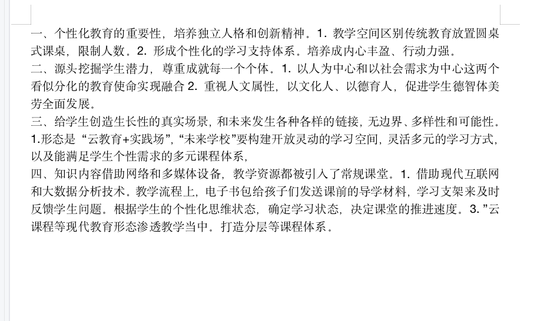
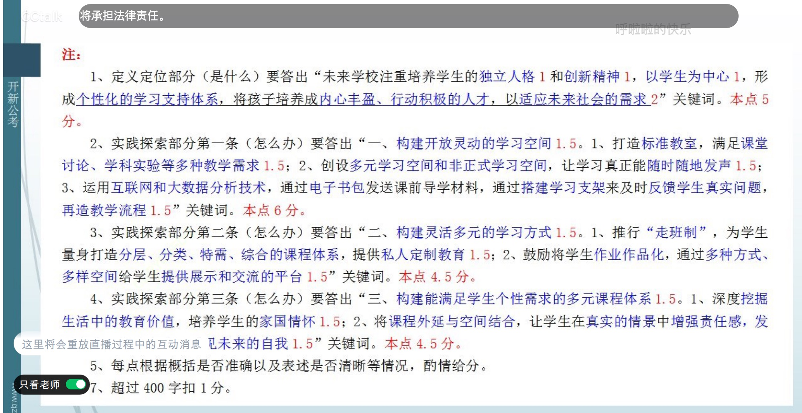

### 读题【2022年国考申论地市级综合管理岗卷】

- 题目

```
四、根据“给定资料4”，请你谈谈为什么说“未来学校”是站在更高的教育境界上来思考学校发展的，是从哪些方面体现的。（20分）
要求：全面、准确、有条理，不超过400字。

```

- 要点漏点注意

1。
2.


- 材料分析

```
聆新学院是一所面向高中学段开设的“未来学校”，它有很多迥异于传统学校的地方。比如，它的教学空间好似一个联合办公空间，教室里没有学生排排坐听老师讲课的场景，也没有三尺讲台，而是放置了便于学生分享、讨论的圆桌式课桌。这里的单个班人数最多不超过20人。


“‘未来学校’是新样态学校，目前还处在探索阶段。它并非仅仅打开教室门窗、拆掉学校围墙，而是站在更高的教育境界上来思考学校发展。”某教育专家说道，“‘未来学校’不是要培养同质化、标准化的一群人，更重要的是培养学生的独立人格和创新精神。【培养学生的独立人格和创新精神】

”他表示，所有看似新鲜的规划设计，其逻辑起点都是以学生为中心，形成个性化的学习支持体系，将孩子培养成内心丰盈、行动积极的人才，以适应未来社会的需求。【以学生为中心，形成个性化的学习支持体系，将孩子培养成内心丰盈、行动积极的人才，以适应未来社会的需求】

某教育研究机构的孙教授说道：“如今，社会对教育的需求已经发生了重要变化。我们亟须从源头挖掘人类的潜能和智慧，尊重和成就每一个独特的个体。【】这也要求以人为中心和以社会需求为中心这两个看似分化的教育使命实现融合。【】现在越来越多的人开始意识到个性化教育的重要性，【】这促使了‘未来学校’的不断涌现。”

某高校校长表示：“教育越走向未来越应该重视人文属性，育人的根本在于立德，我们要做到以文化人、以德育人，促进学生德智体美劳全面发展。教育是一门引导的艺术，我们需要带领老师创造面向未来的学校生活，让学生每天沉浸在富有生长性的真实场景当中，能够和未来发生各种各样的链接，要创造无边界的学校生活，创造丰富的多样性和更多的可能性。”【】


既然要建设新校区，就要兴建一所能够满足学生学习生活需求的“未来学校”。广寰中学教育集团张校长说，“云教育+实践场”是“未来学校”的主流形态，“未来学校”要构建开放灵动的学习空间，灵活多元的学习方式，以及能满足学生个性需求的多元课程体系，【】

这就要求学校顺应这样的变化，主动打破传统设计思维的格局，以更好地适应未来教育发展的趋势和需要。

于是，几张课桌经过灵活拼接组合，围合成了一个学习小组，无论是激烈的课堂讨论还是简单的学科实验，都可以在标准教室里完成。需要时标准教室还能立刻变成一个辩论场或小舞台，辩论赛、情景剧、英文朗诵等，都有机会在课堂上得到充分展示。-----【】

为了让学习真正能随时随地发声，广寰中学还打破以常规教室为主的校舍建筑架构，在标准学科教室之外，

创设了大量的多元学习空间和非正式学习空间。------【】 

张校长说：“我们的建筑设计都蕴含着对未来的思考，尽可能地做到超前和留白，在前瞻性和灵活性方面做了很多尝试。”


---- 这两个校长都是为了解释第一段的

“知识内容不再局限于教材或校园，借助网络和多媒体设备，大量学科相关的知识、案例等教学资源都被引入了常规课堂。”该校教师表示，“未来学校”是“互联网+”背景下的学校，其形态变革离不开现代互联网和大数据分析技术。广寰中学在教学流程再造上下功夫，通过电子书包给孩子们发送课前的导学材料，

---【】

通过搭建学习支架来及时反馈学生真实的问题。“通过现代教育技术，我们现在可以看到学生的个性化思维状态，并由此确定每个孩子真实的学习状态，决定课堂的推进速度。”云课程、慕课、翻转课堂等现代教育形态越来越多地渗透到日常教学当中，“移动学习”“泛在学习”成为新常态。

----【多样化的教学方式】新话题

在云腾实验中学的课堂中，古诗词与一元一次方程完美结合，课堂改革的跨学科尝试正在进行；分组讨论、分工任务、游戏模拟，多样化的教学方式，在课堂上生根发芽。
云腾实验中学是一所“未来学校”试点学校，它取消了传统的行政班级，推行“走班制”，为学生量身打造分层、分类、特需、综合的课程体系。学生可以根据个人的基础和兴趣进行选择，【】

从而形成自己独特的课表，按照课表到不同的学科教室上课。学校为每一位学生提供私人定制的教育：-----【】

学生可以选择不同层次的教学课程，还可以从外教视听说、原著阅读、时事传媒等多种类别中任选一门英语课程，技术课程可以选机器人编程、陶艺、产品设计、服装设计与制作等，体育课程除了常规项目还可以选攀岩、滑板、武术等。
公共空间是学科教学、学校教育在空间与时间上的延伸，学科活动海报、学科电子化资源、学生活动照片随处可见。云腾实验中学鼓励将学生的作业作品化，通过多种方式、多样空间给学生提供展示和交流的平台，-----【】

像对待大师作品一样对待学生的作品。
据了解，云腾实验中学尝试打造多元化的课程体系，深度挖掘生活中的教育价值，比如丰富多彩的社团、职业考察、名家大师进校园等，并在此基础上开发传统文化节日课程、红色经典课程等，培养学生的家国情怀。同时，将课程外延与空间结合，设立了云腾模拟法庭、云腾小铺等真实社会情景，让学生在真实的情景中增强责任感，在真实的情景中发现自我、塑造自我、看见未来的自我。

```

### 做题以及得分


