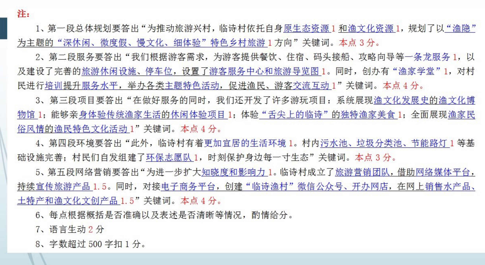

### 读题【2022年国考申论地市级综合管理岗卷】

- 题目

```
三、为进一步开发乡村旅游产业，临诗村所在的向江县计划举办“畅游美丽渔村，感受渔家文化”临诗村专场推介会。假如你是该县文化旅游局工作人员，请你草拟一份宣传材料，向参会旅游企业和游客推介临诗特色乡村旅游。（20分）
要求：紧扣资料，内容全面，条理清晰，语言生动，不超过500字。

```

- 要点漏点注意

- 有些废话过多

- 宣传稿是介绍自己家 不要扯领导

- 材料分析

```
在翠凌湖西岸，有一个纯渔民居住的渔业村——临诗村。该村有村民近2000人，陆地面积1200多亩，水域面积10多万亩。2017年，临诗村开启退养还湖工程。渔民上岸后下一步发展之路怎么走？如何向湖再生，以湖富村？
深思熟虑后，临诗村周书记把目光瞄准了村里的生态和渔文化资源，提出了旅游兴村的新型发展思路。周书记心里十分清楚，乡村旅游如果与其他地区雷同，很容易使游客产生审美疲劳，这条路也就走不远了。为此，他请专业设计师绘制了乡村旅游发展设计图，同时收集渔技、渔歌、渔俗等渔文化资料，为临诗村规划以“渔隐”为主题的“深休闲、微度假、慢文化、细体验”特色乡村旅游方向，大力发展特色乡村旅游。

----注意我的废话多了，其实就两句话【依托村里的生态和渔文化资源，划以“渔隐”为主题的“深休闲、微度假、慢文化、细体验”特色乡村旅游方向】


临诗村首先开通了乡村旅游直通车，村里陆陆续续接到了不少游客的咨询电话，但由于当地旅游起步较晚，当时村内仅有一家渔家乐饭店，承载能力严重不足，考虑到游客的需求，临诗村积极引导和鼓励渔民利用闲置的房屋为游客提供餐饮和住宿服务，同时免费提供码头接船、攻略向导等一条龙服务。

【根据游客的需求，提供餐饮和住宿服务、码头接船、攻略向导等一条龙服务】


临诗村村民90%都是外来渔民。这些从四面八方会聚而来的渔民，既带来了北方的粗犷风土人情，也带来了南方的秀美水乡习俗，多元文化的互动、共生和交流融合，形成了当地独一无二的渔家文化。
临诗村建成了渔文化博物馆，

-----掉了前半句 【三，建成了展示渔文化发展史，渔文化博物馆】

展出齿罩、枪船、登篓、大网等各种渔具，以及水瓢、马灯、照灯等生活用品，系统地展现临诗村渔文化发展史。村里开发休闲体验项目，让游客与渔民一起出湖捕蟹捕虾，体验水上传统劳作方式，感受传统渔家生活。

【三、亲身体验传统渔家生活的休闲体验项目】

临诗村还挖掘了独特的渔家面食26种，渔家船菜36道，打造“舌尖上的临诗”。

【三、体验“舌尖上的临诗”，的独特渔家美食】

村里每年举办“迎端午、庆开渔民俗风情节”“翠凌湖杀围节”“欢乐渔家金秋品蟹节”等一系列渔民特色文化活动，以说唱、舞蹈、舞台剧等形式表演渔歌、渔号及祭祀婚嫁等传统文化和风俗，全面展现渔家民俗风情。“玩在湖中，吃在渔家，宿在临诗”，已经成为临诗村的旅游招牌。

【三、全面展现渔家民俗风情】


作为一个原生态渔村，临诗村的原生态湿地是翠凌湖岸风景最优美的区域。临诗村因地制宜，充分整合“人、地、钱”要素，将乡村旅游发展与生态环境保护相融合。2019年，临诗村被评为中国美丽乡村。
走进临诗村，每家每户都连起了污水池、垃圾分类池，沿路装上了节能灯，村民们的生活环境更加宜居。
【四、连起了污水池、垃圾分类池，节能路灯等基础设施完善】

----这个掉了【四、更加宜居的生活环境】
村民们还自发组建了环保志愿队，

【四、组建了环保志愿队】
时刻保护身边的每一寸生态，村里建成了漫道、景观桥、翠凌湖红莲芡实观赏区等旅游休闲设施19处，配套修建了3万个停车位，在村子入口设置了游客服务中心和旅游导览图，方便服务日益增多的游客。

----这一点掉了，并且这也在第二大点中。 二、【完善旅游休闲设施，设置了游客服务中心和旅游导览图】
2019年，临诗村创办了“渔家学堂”，从接待礼仪、餐饮服务、客房服务、渔产品包装销售等方面，对有学习意愿的村民进行培训。“渔家学堂”每季度一个主题，举办各类讲座、沙龙、文化体验等特色活动，搭建了渔民与渔民、渔民与游客之间互动交流的平台。

---- 这一点掉了。二。【创建渔家学堂】
【对村民进行培训。举办特色活动，促进渔民、游客之间交流互动】


为了进一步扩大乡村旅游的知晓度和影响力，临诗村成立了自己的旅游营销小团队，借助网络媒体平台，持续密集地宣传临诗村的旅游产品。在大力推进网络营销的同时，临诗村还积极对接电子商务平台，创建“临诗渔村”微信公众号、开办网店，在网上销售鱼、虾、蟹、芡实、菱角等临诗水产品、土特产和渔文化文创产品。如今，越来越多的游客慕名前来，暂别城市的喧嚣，体验当地特色渔文化，享受慢生活，愉悦身心。

----这里掉了一半【扩大知晓度和影响力、旅游营销小团队，借助网络媒体平台，持续宣传旅游产品。对接电子商务平台，创建微信公众号、开办网店，在网上销售水产品、土特产和文创产品。】

```

### 做题以及得分


