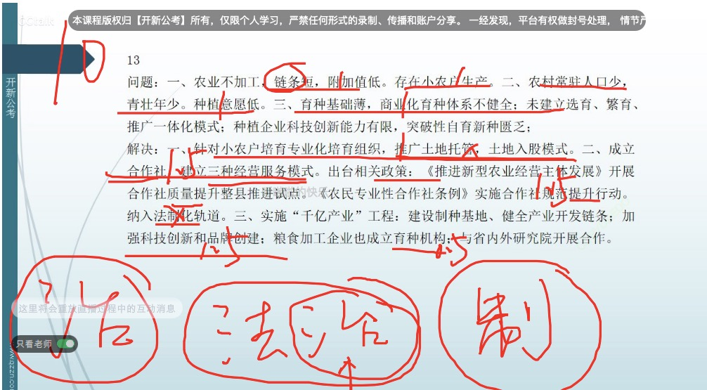

### 读题【2022年国考申论地市级综合管理岗卷】

- 题目

```
一、“给定资料1”反映了N市积极落实惠企政策的有关情况，请简述其主要做法及成效。（15分）
要求：全面、准确、有条理。不超过250字。

```

- 250个字，能写宏观就不写微观

- 

-  

- 

```
新型冠状病毒肺炎疫情发生后，党中央、国务院出台了一系列支持企业发展的惠企政策。N市积极落实各项惠企政策，不断优化营商环境，推动区域经济高质量跨越式发展。
“当时举步维艰，那笔钱可真是雪中送炭啊。”宏远环保科技公司石经理现在回想起来，仍然有些感慨。疫情影响下，这家公司资金严重短缺，已经上马的技改项目濒临停滞。2020年7月，该公司通过N市“政策直达直兑”绿色通道申请了两项技改专项补贴和一项专利奖励。“星期一下午申报，星期三钱款就到账了。”高效的办事机制让石经理由衷地为政府点赞。为了积极落实中央的“两直”政策（即资金直达市县基层、直接惠企利民），市政府专门开设绿色通道，提前做好项目储备、底数核查等工作，确保了资金的及时、高效、精准分配，切实为企业纾困解难。


腾飞电缆股份有限公司姚经理也对N市惠企政策的“秒兑”大加赞赏。2021年4月，这家公司意外地收到了一笔12万元的财政专项补贴款。“我们并没有提出申请，会不会是财政误拨？”姚经理专程到市财政局查询，工作人员告诉他，这是市政府新推出的“免申即享”服务，即通过各部门联动、资源整合和信息共享等方式，对符合条件的企业免于申报直接发放奖补资金，享受优惠政策，做到应享尽享、应兑尽兑，切实增强企业的获得感。“他们直接将企业经营数据和奖励政策相匹配，通过后台的数据分析和精准核查，发现我们能够享受这个奖励政策，就直接把资金拨过来，真是太振奋人心了！”姚经理说。


在一家大型数据集团，N市惠企政策兑现上门服务座谈会正在进行。市政府有关职能部门的工作人员通过“家访式”上门服务，【】现场解答这家民营高科技企业在人才引进、商标注册和专利申报等方面所能享受到的10多项政策红利。集团企宣孟总监深受触动：“有些方面的政策我们确实不是很清楚，他们主动告诉我们有哪些惠企政策，我们符合哪些方面的条件，还提醒我们抓紧时间申报，如果说以前是‘人找政策’那么现在就是‘政策找人’。【】”为切实做好惠企利企工作，N市还成立了“帮办代办服务中心”【】，由行政审批局组建了一支专业的惠企政策兑现帮办代办工作队伍，让企业少跑腿、好办事、不添堵。【】


不久前，彗光科技有限公司狄总经理将写着“政企一家亲”的锦旗赠予“亲清家园”。N市依托5G、互联网和大数据等新一代信息技术，搭建了“亲清家园”智慧服务平台，【】推行惠企政策“掌上提、在线批、直达付、全程督”服务模式，让惠企政策直达“准、快、实”。【】目前，已有经信局、人社局、生态环境局等14个涉企部门入驻“亲清家园”并提交了相关服务清单，开展互动联建活动。一旦发现企业有困难，平台就会根据目录分析所涉及的职能部门，迅速联系相关部门协调解决。


“乌家堡乡动物防检组杨某某等人在服务市场主体时接受宴请、收受礼品……”近日，N市纪检监察机关连续通报损害营商环境案例多起，剑指以落实优惠政策之名损害企业利益、敲诈勒索、吃拿卡要等现象，对涉及的党员干部和单位集中曝光。市纪检监察机关以跟进监督、精准监督、全程监督等方式推动惠企政策真正落实，让企业真正定下心、稳住神。“通过‘亲清家园’平台中植入的‘智慧监督’功能，【】我们督促各部门梳理所有惠企政策，全部上线公开，实现全程无纸化在线申报、审批，对在规定时间内仍未处理的审批人员及时在线上提醒。”市纪检监察机关有关负责人介绍，这种“监督于问题未发之时”的方式，使惠企政策落实更加公正、透明、高效。【】他还说：“构建亲清政商关系，要求我们的干部既当好‘店小二’，做到‘亲企’，又要筑牢‘防火墙’，做到‘清己’，有为且有畏。”


老陈是外省一家大型园林工程公司的财务负责人。去年，他们公司在N市承建了小区园林绿化工程。“跨省通办，还能一网通办，在家里点点鼠标就可以完成申报，真是省时省力，这在以前是不敢想象的！”刚办完业务的老陈感慨地说。以往，老陈要带上合同和企业证照到N市有关部门报验登记，再预缴申报增值税和附加税费，按照18个月的工程周期算，要来回跑10多次。自从N市推出涉税业务全国通办以来，只需登录本地电子税务系统，几分钟即可完成跨省涉税业务办理。目前，N市已经实现了包括发票代开在内的108项政务服务跨省通办，“异地易办”正成为越来越多纳税人、缴费人的共同感受。

```

### 做题以及得分


