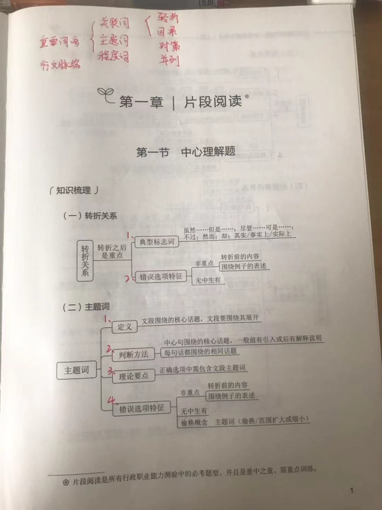
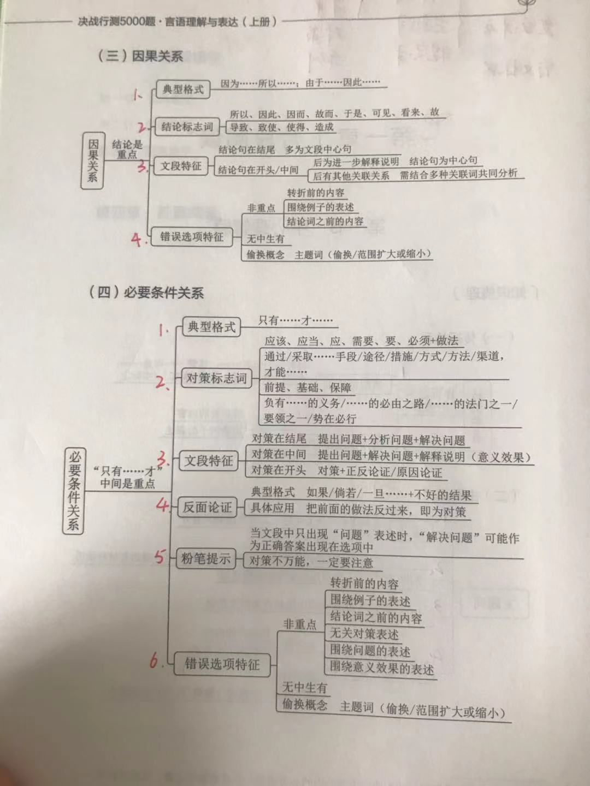

# 言语总框架




# 言语模块 - 逻辑填空框架（实词） 


```
 第一遍刷题出现的问题：
1. 词语辨析，结合语境。找出更适合的词语。并且有敏感度，文章是考的哪个语境，快速排除。
2. 注意最后落笔于哪个名词。要注意修饰的主题词。能不能搭配
3. 要注意关联词。相同句式表示并列。比如一批。。。一批。。。怎么样。这里的两个词最好含义一致。

```
## 33道题（30分钟 94%）

- 1（词义侧重：1. 区分安居和栖息，安居强调居住。但文中没说让人在花海中住下。但是诗意的栖息十可以的。2. 形容城市用喧嚣和喧闹比较好，喧嚷和喧哗过重。）


```
这一片花海，随四季不同而栽培，每个季节都有十几种花卉        。远离城市        ，回归大自然的宁静，让人诗意地        ，微风拂过，花香撩起的情丝，不知拨动过多少人的心弦。

依次填入划横线部分最恰当的一项是：

A

开放 喧闹 安居

B

盛放 喧哗 隐居

C

绽放 喧嚣 栖息

D

怒放 喧嚷 歇息


正确答案是： C收起
解析
第一空搭配“花卉”，四个词语均可，因此可从第二空判断，第二空搭配“城市”，且与后文“大自然的宁静”对应，说明城市环境不安静。A项“喧闹”和C项“喧嚣”均可用来形容环境不安静，比较吵闹之意，用在此处形容城市环境不安静，符合文意，保留。B项“喧哗”指大声说笑或叫喊，D项“喧嚷”指大声地叫，两词多用来形容具体的声音，一般不形容整体的环境，用于此处形容城市的环境不恰当，排除。

第三空，对应文段中“远离城市”“回归大自然的宁静”“微风拂过，花香撩起的情丝”，可知停留此处让人很舒适。C项“栖息”指歇息、暂住，置于文段可表达人们在花海中诗意地歇息，符合文意，当选。A项“安居”指安定地生活、定居，文段并未体现在花海之中定居之意，排除。

故正确答案为C。

```

- 2（1. 第一句：体现5000年的深度很深。所以沉淀，积淀比积聚，积蓄更好。2. 润泽只能做动词。）


```
中华文化绵延5000年，有其独特的价值体系，已成为中华民族的基因。中华优秀传统文化是中华民族的突出优势，        着中华民族最深沉的精神追求，为中华民族生生不息、发展壮大提供了丰厚        ，潜移默化地影响着中国人的思想方式和行为方式，至今仍然具有鲜活的时代价值。

依次填入划横线部分最恰当的一项是：

A

沉淀 润泽

B

积淀 滋养

C

积聚 滋润

D

积蓄 滋补


正确答案是： B收起
解析
第一空，所填词语搭配“精神追求”，根据前文“中华文化绵延5000年”、“中华优秀传统文化是中华民族的突出优势”可知，此处表达中华优秀传统文化中积累包含最深沉的精神追求的意思，A项“沉淀”表示凝聚积累、 B项“积淀”指积累沉淀，两项均可体现积累的意思，保留。C项“积聚”指逐渐聚集，常搭配物资、钱财，D项“积蓄”指积攒聚存，常搭配力量、钱财，均与“精神追求”搭配不当，排除。

第二空，所填词语搭配“提供”，需要填一个名词，B项“滋养”可做名词，表示养分、养料的意思，与“提供”搭配恰当，当选。A项“润泽”指的是滋润、使滋润的意思，一般不做名词使用，与“提供”“丰厚”均搭配不当，排除。

故正确答案为B。
```
- 3（1. 看题目不仔细：人家强调的是各个行业的人。应该是更多的角度，纬度。 2. 范围扩大了，推广不对）


```
近几年的经典解读出版中，除了文史类的专业学者，一些作家、诗人等跨界的知识精英也加入了进来。这些跨界解读给经典出版增添了更多的        和丰富性，个人化的写作风格也将读者群从文史爱好者        到文艺爱好者。

依次填入画横线部分最恰当的一项是：

A

维度 扩展

B

力度 延伸

C

深度 转移

D

角度 推广


正确答案是： A收起
解析
第一空，对应“跨界解读”且根据“和”可知，横线处与“丰富性”并列，要体现出跨界解读给经典出版带来的多元化效果，A项“维度”意为人们观察、思考与表述某事物的思维角度，D项“角度”意为看问题的出发点，放入此处均可形容跨界解读给经典出版带来的多元化效果，符合文意，保留。B项“力度”意为力量的大小程度或者功力的深度，侧重力量大小；C项“深度”意为深浅程度或触及本质的程度，均未体现出丰富多元的语义，排除。

第二空，由从“文史爱好者”到“文艺爱好者”可知，横线处要体现跨界解读的读者群范围扩大，A项“扩展”意为向外伸展，扩大，符合文意，当选。D项“推广”指扩大事物使用的范围或起作用的范围，如“推广普通话”“推广新技术”，而文段并不是扩大读者群的使用范围，与文意不符，排除。

故正确答案为A。
```

## 35道题（74% 30分钟）

- 1（1. “猛”“重”可知，所填词语应体现出党和政府坚决反腐的态度。所以决心表示态度强但是意志并没有很好的表示态度强）


```
党的十八大以来，中央以猛药去疴、重典治乱的        ，以刮骨疗毒、壮士断腕的        ，不断加大党风廉政建设和巡视的力度，效果显著。

依次填入画横线部分最恰当的一项是：

A

意念 底气

B

恒心 气势

C

意志 气魄

D

决心 勇气


正确答案是： D收起
解析
第一空，根据“猛药去疴、重典治乱”中的“猛”“重”可知，所填词语应体现出党和政府坚决反腐的态度。A项“意念”只是指想法、念头，无法体现坚决反腐的态度，排除。B项“恒心”强调持久不变，文段并非强调坚持的时间久，而是强调态度坚决，排除。D项“决心”表示坚定不移的意志，相比C项“意志”更能体现“猛”和“重”的程度，故D项保留。

第二空，修饰“刮骨疗毒、壮士断腕”，体现出党和政府面对腐败勇敢坚决的态度，D项“勇气”符合文意，当选。C项“气魄”比喻气势惊人，胆识过人，形容一个人有领袖气质，不符合文意，排除。

故正确答案为D。

```

- 2（1. 注意考试中也许两个词，它用的就是语义更丰富的词）


```
目前，第五代移动通信（5G）已成为当前和未来全球业界的焦点，将        移动互联网进入新时代。美国高通公司指出，5G技术将成为同电力、互联网等发明一样的通用技术，        未来的转型变革，重新定义工作流程并        经济竞争优势规则。到2035年，5G将在全球创造12.3万亿美元的经济产出，同时创造2200万个工作岗位。

依次填入划横线部分最恰当的一项是：

A

带领 催生 重造

B

引领 催化 重塑

C

引导 催发 制定

D

带动 催促 制订


正确答案是： B收起
解析
本题可从第三空入手，搭配“规则”，且由“并”可知，横线处所填词语与“重新”构成并列语义相近。B项“重塑”指重新塑造，与文意相符且搭配恰当，保留。A项“重造”指不把原先做基础，完全重新再造，与“规则”搭配不当，排除；C项“制定”指经过一定的程序定出（法律、规程、计划等），D项“制订”指草拟创制，二者均无法体现“重新”之意，排除。

第一空，代入验证，形容“5G”对“移动互联网”的作用，B项“引领”指引导、带领，符合文意且搭配恰当。

第二空，代入验证，搭配“转型变革”，B项“催化”指促使化学反应的速率发生改变，有使加快速度之意，可与“未来的转型变革”搭配，表达加快未来的转型变革，当选。

故正确答案为B。
```
- 3（造成”和“导致”往往加不好的结果，感情色彩偏消极。而带来和引发是中性词）


```
未来将会怎样，不可准确预知，但格局和            总有踪迹可循。在信息技术、互联网发展所            的巨大变革面前，时代和社会呼唤产生一批真正的未来学家，能够站在历史和现实的关口，对信息社会的未来有所把握，为未来人们的生产和生活、选择和行为提供一些理论上的            。

依次填入画横线部分最恰当的一项是：

A

轨迹 带来 解释

B

方向 造成 设想

C

路径 导致 服务

D

趋势 引发 指导


正确答案是： D收起
解析
本题从第二空入手，表达互联网带来的变革，B项“造成”和C项“导致”往往加不好的结果，感情色彩偏消极，排除。

第三空，根据文意，横线词语表达未来学家提供理论上的引导和帮助，D项“指导”符合文意，保留。A项“解释”往往是已经发生的事情，与文段“未来”的语境不符，排除。

第一空，代入验证，D项“趋势”和“格局”构成并列，符合文意，当选。

故正确答案为D。
```
- 4（1. 词义辨析，结合文境。原则问题要旗帜鲜明、立场坚定。它的反面是立场不坚定，含糊。而退缩的反面是勇敢。）


```
准确、权威的信息不及时传播，虚假、歪曲的信息就会搞乱人心；积极、正确的思想舆论不发展壮大，消极、错误的言论观点就会肆虐______。这方面，主流媒体守土有责，更要守土尽责，及时提供更多真实客观、观点鲜明的信息内容，牢牢______舆论场主动权和主导权。主流媒体要敢于引导、善于疏导，原则问题要旗帜鲜明、立场坚定，一点都不能______。

依次填入画横线部分最恰当的一项是：

A

蔓延 守护 犹豫

B

扩散 占据 退缩

C

滋生 控制 迟疑

D

泛滥 掌握 含糊


正确答案是： D收起
解析
第一空，搭配“言论观点”，根据前文“积极、正确的思想舆论不发展壮大”可知，横线处所填内容与“壮大”对应，体现出消极、错误的言语观点不断发展壮大之意，A项“蔓延”指延伸、扩展，B项“扩散”指扩大散布，D项“泛滥”指比喻坏的事物不受限制地流行，三项均可体现文意，保留。C项“滋生”指引起、产生、繁殖，多搭配不好的对象，根据文意可知横线需表达范围扩大的意思，而非产生的意思，排除。

第二空，搭配“主动权和主导权”，B项“占据”指取得或保持，D项“掌握”指充分支配或运用，均搭配恰当，保留。A项“守护”指看守保护，与“主动权和主导权”搭配不当，排除。

第三空，根据“原则问题要旗帜鲜明、立场坚定”可知，主流媒体对于原则问题的态度是明确的，故横线处强调一点也不能模糊之意，D项“含糊”与文意相符，当选；B项“退缩”指畏难不前，后退，与文意不符，排除。

故正确答案为D。
```
- 5（词义辨析，要结合语境。随着改革的深入。。但。。，但要跟深入差不多的意思。所以彻底有这个意思，但是全面没有这层意思。）


```

随着改革的深入，军工企业逐步建立起适应市场经济的现代企业制度。但军工集团改制并不          。一方面，从事生产经营的军工企业基本完成了公司制改造，成立了股份制公司；另一方面，多数军工院所依然在事业单位体制内，独立于市场经济之外。产研          一定程度导致了科研成果市场化程度低、技术成果社会转换利用率不高的问题。

A

彻底 分离

B

系统 互促

C

完善 共建

D

全面 脱节


正确答案是： A收起
解析
本题从第二空入手，根据前文可知，“从事生产经营的军工企业基本完成了公司制改造”，而“多数军工院”并没有完成公司制改造，故所填词语应体现出“生产经营”与研发分割开来之意。A项“分离”、D项“脱节”均符合文意，保留；B项，“互促”指相互促进；C项，“共建”指共同建设，而文段意在表明两者分割开来，故B、C两项均与文段语义相悖，排除；

第一空，对比A、D两项。A项“彻底”指强调完全而无所遗留；D项“全面”指侧重兼顾各个方面，两项均可与后文“一方面······另一方面······”对应，故寻找其他解题线索。横线前出现否定表述“并不”，前后语义相反，根据前文“随着改革的深入”可知，文段强调改革不够深入，而非某一方面没有完成，故两项对比，A项更优。

故正确答案为A。
```
- 6（1. 提取等于提炼。用法。提取化合物 2. 无谓：没有意义，文章没有超额的意思。）


```
在生物钟的作用下，蓝藻在日出之前即可提前动员光合作用系统，在阳光一出现的时候就可以        能量，比那些纯粹依靠光线启动光合系统的生物领先一步。与之类似，日落之后，蓝藻的光合系统会遵循生物钟的指令而关闭，避免那些夜间无须调动的能量被        浪费。

依次填入画横线处最恰当的一项是

A

提取 无故

B

摄取 无谓

C

吸取 过度

D

汲取 超额


正确答案是： B收起
解析
第一空，搭配“能量”，表示光合作用系统吸收能量。A项“提取”表示经过提炼而取得，蓝藻的光合作用系统不能对太阳光的能量进行提炼，排除。B项“摄取”、C项“吸取”、D项“汲取”均表示吸收，符合文意，搭配恰当，保留。

第二空，根据横线前“无须调动的能量”可知，这些能量不应该被浪费，故横线处应体现“不应当”的含义，对应B项“无谓”，表示没有意义。C项“过度”、D项“超额”表示过量，文段无此意，排除。

故正确答案为B。
```

- 7（1. 维度相当于多角度，但是文章只是空间划分从小到大，相当于村，镇，乡。所以用层次，层级比较好。2. 词义辨析根据语境，很多概念的内涵和边界不够清楚，说明混乱）


```
新中国的区域与城市规划始于20世纪50年代，目前在空间规划上已初步形成了八个主要        ，按照从小到大的顺序，依次是乡村规划、小城镇规划、城市规划、大都市规划、大都市区规划、大都市圈规划、城市群规划和湾区规划。但由于缺乏系统的        和深入的研究，很多概念的内涵和边界不够清楚，这给实际的规划和建设带来诸多的不便和        。

依次填入画横线部分最恰当的一项是：

A

层次 调查 阻碍

B

部分 考察 负担

C

层级 梳理 混乱

D

维度 分析 困难


正确答案是： C收起
解析
第一空，根据横线后可知，空间规划是按照从小到大的顺序来的，B项“部分”，指整体中的局部，整体里的一些个体，D项“维度”，为几何学及空间理论的基本概念，均不符合文意，排除。A项“层次”，指同一事物由大小、高低等不同而形成的区别，C项“层级”，即层次、级别，在层次的基础上，进行分级，均符合文意，保留。

第二空，A项“调查”与C项“梳理”填入文段，搭配均可，保留。

第三空，根据前文“很多概念的内涵和边界不够清楚”可知，强调在具体操作过程中，即实际规划和建设带来的影响，C项“混乱”是指无条理，无秩序，符合文意，当选。A项“阻碍”是指阻挡住，使不能顺利通过或发展，文段并未提及“实际规划和建设”无法发展，与文意不符，排除。

故正确答案为C。

```

- 8（1. 首先排除d目的不符合。2. 然后根据词义辨析，语境分析--患者还会由于不想被说教而不承认一些不良生活行为。不承认对应隐瞒。遗漏不是主观的，这里是故意的。）


```
医生和患者在沟通时最容易出现的        其实是，患者不同意或没听懂医生的建议，又因为不想被说教或觉得尴尬而没有如实反馈意见，而医生也大多没有意识到这一点。这显然会大大影响临床诊疗的        。此外，患者还会由于不想被说教而不承认一些不良生活行为。越是健康状况差的患者，越是容易        一些信息，而他们恰恰是最需要高质量医疗服务的人。

依次填入画横线部分最恰当的一项是：

A

难点 结果 遗漏

B

盲区 效率 隐瞒

C

障碍 判断 虚构

D

瓶颈 目的 回避


正确答案是： B收起
解析
从第二空入手，根据横线前“这”指代前文“医生没有意识到患者没有如实反馈”这件事，可知横线处应表达“此事”对“临床诊疗”造成了影响。A项“结果”、B项“效率”、C项“判断”均符合文意，保留。D项“目的”，无论受影响与否，“临床诊疗”的“目的”都应是一致的，与文意不符，排除。

第三空，根据“患者······不承认一些不良生活行为”可知“越是健康状况差的患者”越不想承认，故横线处体现出“不承认”之意，B项“隐瞒”意思是掩盖真相不让人知道，符合文意，保留。A项“遗漏”意思是应该列入或处理却因疏忽而没有列入或处理，文段是患者自己不想承认并非因为疏忽，与文意不符，排除；C项“虚构”是指凭空捏造，文中只是患者不承认已有的行为，未体现出“凭空捏造”，与文意不符，排除。

第一空，代入验证，B项“盲区”刚好和后文“医生也大多没有意识到这一点”形成呼应，符合文意，当选。

故正确答案为B。

```

- 9（1. 从语境分析，这里适合选贬义词，臆测含有贬义，但是虚构是中性。2. 文章主题词，想象。而臆测更贴近主题词。但是虚构不贴近。）


```
观察就要用专业的角度去关注、        周围的事物，有意识地汲取、思索、分析，看在眼里，记在心里。丰富的想象正是来源于知识的广博和平时对生活深入细致的观察。因此，想象并不是凭空        的。

依次填入划横线部分最恰当的一项是（    ）。

A

体验 杜撰

B

体味 虚构

C

体察 臆造

D

体察 虚构


正确答案是： C收起
解析
第一空，横线处与“关注”通过顿号构成并列且对应后文“看在眼里”，故横线处表达“看”的含义，C、D两项“体察”指体会、观察，语意相符。A项“体验”指亲身经历；B项“体味”指体会寻味，均与文意不符，排除。

第二空，根据“想象正是来源于······观察”可知，横线处强调想象不是凭空想出来的，C项“臆造”指凭主观的想法编造，语意相符且“凭空臆造”是常见搭配，当选。D项“虚构”指凌空构作，凭空捏造，虚幻之实化，含有“凭空编造”的意思，与“凭空”语义重复，排除。

故正确答案为C。

```

## 3 16道题 55%（16分钟 目标是30道题）

- 1（词义辨析，结合语境。舞台就是程式化和生活化的结合，过度的程式化表演会让观众觉得虚假”，表达过度的“程式化”就没有“生活”即不真实，虚假，可知横线处要表达“过度的生活化”就没有“程式化”。而程式化的反义词就是随便。不要只要你觉得，要按照出题作者觉得才行。）


```
舞台就是程式化和生活化的结合，过度的程式化表演会让观众觉得虚假，过度的生活化表演又会让观众觉得        ，因此，要把握好程式化和生活化的        ，为观众呈现精彩有趣的戏曲艺术。

依次填入划横线部分最恰当的一项是：

A

庸俗 程度

B

随便 平衡

C

琐碎 差异

D

枯燥 重心


正确答案是： B收起
解析
第一空，根据前文“舞台就是程式化和生活化的结合，过度的程式化表演会让观众觉得虚假”，表达过度的“程式化”就没有“生活”即不真实，虚假，可知横线处要表达“过度的生活化”就没有“程式化”，B项“随便”就表达没有步骤，没有程序，符合文意，保留；A项“庸俗”指平庸鄙俗，对立面是“高雅”，和“程式化”无关；C项“琐碎”指细小繁多，D项“枯燥”指单调、没有趣味，都与缺乏“程式化”无关，排除。

第二空，体现“程式化和生活化”两者之间的关系，对应前文，过度的程式化和过度的生活化效果均不佳，故横线处应表示把握好程式化和生活化之间的“度”，不能过于生活化也不能过于程式化，B项“平衡”表述正确，当选。

故正确答案为B。

```

- 2（1. 留意，凝神太口语排除 2. A，B两项，词义辨析，结合语境。看第四个空，纪录片是众多国家进行对外文化传播的重要工具。这个对外用引领比较好，传承用于后代这种情景。）


```
纪录片是众多国家进行对外文化传播的重要工具。        时代之魂、        时代之需、        时代之变、        时代之风，纪录片创作者应当充分挖掘和盘活“讲好中国故事”这个富矿，向世界展现真实、立体、全面的中国，提高国家文化软实力和中华文化影响力。

依次填入画横线部分最恰当的一项是：

A

把握 关注 聚焦 引领

B

筑牢 聚焦 关注 传承

C

筑牢 洞悉 凝神 传承

D

把握 留意 警醒 引领


正确答案是： A收起
解析
本题可从第四空入手，搭配“时代之风”，根据后文“向世界展现真实、立体、全面的中国”可知，所填词语表示影响带动引领时代风气，“引领”指引导带领，与后文对应恰当，保留A、D两项。“传承”指时间上的继承，文段并非表示时间上往下传，排除B、C两项。

再看第三空，搭配“时代之变”，A项“聚焦”与之搭配恰当，且表意形象准确，保留。D项“警醒”指警觉醒悟，常搭配消极不好的现象，“时代之变”并非贬义，用在此处搭配不当，排除。

第一、二空，代入验证，A项“把握时代之魂”、“关注时代之需”均搭配恰当，符合文意，当选。

故正确答案为A。
```
- 3（1. 传导”指热或电从物体的一部分传到另一部分，多用于物理学或神经方面。传达”意为把一方的意思告诉给另一方，多与命令、消息搭配，与知识搭配不当，所以排除CD2. 传输，传递知识都可以。传输”指传递、输送，一般搭配信息、数据。传递知识，温暖，力量。 3. 词义辨析，根据语境选择最好的。一线科学家很难花费太多的时间和精力直接参与一波又一波的科普活动。说明第二个空是一对多传播精神。而传递是1对1.）


```
向民众        科学知识，        科学精神，是科学家义不容辞的责任。但是科学家首先要致力于科研，他究竟能花多少时间来做科普，显然无法一概而论。通常，一线科学家很难花费太多的时间和精力直接参与一波又一波的科普活动。

依次填入划横线部分最恰当的一项是：

A

传输 传递

B

传递 传播

C

传导 传扬

D

传达 传承


正确答案是： B收起
解析
第一空，搭配“科学知识”，表示向民众传播科学知识，A项“传输”指传递、输送，一般搭配信息、数据，与“知识”搭配得当，保留；B项“传递”指由一方交给另一方，表示科学家把科学知识传播给民众，搭配得当且语义恰当，保留。C项“传导”指热或电从物体的一部分传到另一部分，多用于物理学或神经方面，与知识搭配不当，排除；D项“传达”意为把一方的意思告诉给另一方，多与命令、消息搭配，与知识搭配不当，排除。

第二空，搭配“科学精神”，根据横线后“做科普”“科普活动”可知，“科普”即科学普及，特点是范围广、受众多，所以横线处所填词语要体现出范围广、受众多，B项“传播”指广泛散布，与“科学精神”搭配恰当，且与“科普活动”对应准确，当选。A项“传递”无法体现出科普活动受众多的特点，排除。

故正确答案为B。
```
- 4（1. 巡游：出外游玩，游逛。洄游：意为海里鱼类等因为产卵、觅食或受季节变化的影响，沿着一定路线有规律地往返迁移。洄游：意为海里鱼类等因为产卵、觅食或受季节变化的影响，沿着一定路线有规律地往返迁移。逡巡：指有所顾虑而徘徊或不敢前进）


```
无论是体长、体重或是综合进行考量，蓝鲸都无愧于现存最“大”的生物体。而生活在广袤的大洋中，蓝鲸不需要像陆生动物那样费力地支撑起自己沉重的身躯，可以自在地        。

填入划横线部分最恰当的一项是：

A

巡游

B

洄游

C

巡回

D

逡巡


正确答案是： A收起
解析
根据横线前“不需要像陆生动物那样费力地支撑起自己沉重的身躯”与“自在地”可知，横线处表达蓝鲸可以在海里自如的掌握身体，轻松地游。A项“巡游”出外游玩，游逛等，与文段“自在地”搭配恰当，当选。B项“洄游”意为海里鱼类等因为产卵、觅食或受季节变化的影响，沿着一定路线有规律地往返迁移，与文意不符，排除；C项“巡回”意为按一定的路线或范围到各处活动，文段并没有按一定路线之意，排除；D项“逡巡”指有所顾虑而徘徊或不敢前进，与文意不符，排除。

故正确答案为A。
```
- 5（1. 第一个空要形容声音小。但是回响（空谷回响）声音较大。回响”指声音一再地发出和折回，通常不与“余音”搭配。 2. 倏忽”可以形容时间或光阴迅速流逝。形容时间快。蓦然”、“遽然”均有猛然的意思，填入文段程度过重）


```
青山隐隐，芳草萋萋，春天的脚步总是来去匆匆。“二月里来好春光”的余音还在耳畔____，____之间便到了细雨纷纷、祭扫亲人的清明时节。

依次填入画横线部分最恰当的一组是：

A

缭绕 蓦然

B

回响 忽然

C

飘荡 遽然

D

萦绕 倏忽


正确答案是： D收起
解析
第一空，搭配“余音”，B项“回响”指声音一再地发出和折回，通常不与“余音”搭配，排除。A项“缭绕”指一圈圈向上飘起，C项“飘荡”指在空中飘浮、飘摆或飞升，D项“萦绕”比喻声音在某些地方旁边旋转、回复，填入文段均可，保留。

第二空，根据文意可知，横线处表达时间过的飞快，从二月转眼之间到了清明时节，D项“倏忽”可以形容时间或光阴迅速流逝，填入文段语义合适，当选。A项“蓦然”、C项“遽然”均有猛然的意思，填入文段程度过重，排除。

故正确答案为D。
```
- 6（1. 有种说话叫重点语境。语境重点在表演者和观众两者之间展开。并且贴合语境应该是简约。错是因为没找到考察点其实是第三个空，而c是直接排除间接。）


```
传统曲艺中一两个演员借助简单的手持道具，靠说唱完成一场表演，没有过硬的功夫不行，不会与观众            更不行。修养高深的曲艺表演者会使用各种手段拉近与观众的情感距离，            引领观众参与艺术创造。在基本没有舞台布景和“灯服道效”相配合的            表演环境中，曲艺演员要靠自身的表演征服观众，其难度远远大于其他舞台表演艺术。

依次填入画横线部分最恰当的一项是：

A

交流 主动 简约

B

对话 巧妙 临时

C

沟通 间接 单一

D

互动 快速 虚拟


正确答案是： A收起
解析
本题可从第二空入手，由“表演者会使用各种手段”可知，演员们对观众的引领是“主动”“巧妙”或“快速”的，C项“间接”与文意相悖，故排除C项。

第三空，与文段中表演环境“基本没有舞台布景和‘灯服道效’相配合”对应，A项“简约”更为准确，B项“临时”与“环境”搭配不当，排除。D项“虚拟”与文意不符，文段中的环境是实际存在的，排除。

第一空，代入验证，A项“交流”符合文意，当选。

故正确答案为A。
```


## 15道题（50% 15分钟）

- 1（1.支援（强对弱）支应（应付） 2. 差异化需求，区别化对待）


```
支付工具的多样化组合，提升了我国支付体系运行的质量和效率，满足了公众            支付需求。从未来支付趋势看，现金支付和非现金支付工具相互        、相互补充、共存共生的局面将长期存在。但是对我国这样一个地域广、人口多、发展很不均衡的大国来说，由于核心技术水平的限制，过度依赖非现金支付会大大增加支付体系的脆弱性。因此，必须长期        现金作为国家法定支付方式的地位，切实保障广大人民使用现金的合法权益。

依次填入画横线处最恰当的一项是

A

区别化 支持 确保

B

差异化 支撑 确立

C

个性化 支援 确认

D

多元化 支应 确证


正确答案是： B收起
解析
第一空，根据“支付工具的多样化组合”可知，横线处表达满足公众不同的支付需求，选项均符合文意。

第二空，通过顿号与“相互补充”构成并列结构，横线处对应“补充”，表示现金支付与非现金支付长期共存，“相互支持”、“相互支撑”符合文意。C项“支援”指用人力、物力、财力或其他实际行动去支持和援助，D项“支应”指敷衍、应付，均与文意不符。

第三空，与“地位”搭配，B项“确立地位”搭配恰当，当选。A项“确保”指切实保持或保证，搭配不当，用在此处应表述为“必须长期确保现金的首要地位不动摇”，排除。

故正确答案为B。

```

- 2（1. 资源约束趋紧”为固定搭配，资源约束表达资源对于人们活动的限制程度。普惠的民生福祉，都为常见搭配。）


```
良好的生态环境，是最公平的公共产品，是最        的民生福祉。当前，我国资源约束        ，环境污染严重，生态系统退化的问题十分严峻，人民群众对清新空气、干净饮水、安全食品、优美环境的要求越来越强烈。

依次填入画横线部分最恰当的一项是：

A

普遍 不力

B

重要 紧张

C

关键 不够

D

普惠 趋紧


正确答案是： D收起
解析
第一空，根据文意可知横线处表达：良好的生态环境对于民生福祉有好处，A项“普遍”仅强调全面、范围广，体现不出有好处之意，排除；B项“重要”、C项“关键”、D项“普惠”填入文段均可，保留。

第二空，搭配“资源约束”，“资源约束”指资源不足对于人们活动的限制，“资源约束趋紧”为固定搭配，表达资源对于人们活动的限制程度越来越高，D项当选；B项“紧张”与“约束”搭配不当，排除；C项“不够”填入横线指资源对人们活动的限制还不够还需要继续限制，与文意相悖，文段强调资源约束越来越严重，排除。

故正确答案为D。
```
- 3（1. 指示（上级对下级），拷问过重，排除 2. 思索包含的含义更广（思考和行动），但是思考只有（侧重于思维活动））


```
我国的大禹治水传说和西方的诺亚方舟故事为我们呈现了中西文化的美丽景观，“娴静”的中国传统文化与“跃动”的西方文化相映，东方的责任意识和西方的权力思想相辅，        我们走向中西文化差异的源头，启发我们        中西文化的特质和精髓，促使我们相互借鉴、彼此“扬弃”，绘写多彩的人类文明图画。

依次填入划横线部分最恰当的一项是：

A

引领 思考

B

指引 拷问

C

引导 思索

D

指示 追寻


正确答案是： C收起
解析
第一空，文段为相同句式表达的并列关系，故横线处所填词语应与“启发”和“促使”构成对应，体现出带领我们走向源头的含义。A项“引领”指引导、带领，B项“指引”意思是指点、引导，C项“引导”指带领、指引，均符合文意，保留；D项“指示”意思是指明显示，或安排、命令，多用于上级对下级，与文意不符，排除。

第二空，横线处所填词语与“特质和精髓”搭配，A项“思考”和C项“思索”均搭配得当，保留；B项“拷问”指拷打审问，与“特质和精髓”搭配不当，排除。进一步对比A项“思考”和C项“思索”，“思索”指反复思考探索，语义上比思考更丰富，而我们对于中西文化的特质和精髓除了思考也是需要探索的，故C项“思索”更符合文意，当选。

故正确答案为C。
```
- 4（1. 灌注”常用来指把某一感情融入某物中，灌输”指传播、输送思想、知识等。2. 结合语境：同理心，以及后文一个社会对待老年人应有的温情与敬意。3. 灌溉”指用水浇地，灌制”指录音制造）


```
在养老举措、制度设计等各方面      更多“老吾老以及人之老”的同理心，是一座城市、一个社会对待老年人应有的温情与敬意。

填入下列横线处的词语，最恰当的一项是：

A

灌注

B

灌溉

C

灌输

D

灌制


正确答案是： A收起
解析
文段意在表达在养老的制度设计中，多一些“老吾老以及人之老”的同理心是我们应该做的事情。结合选项可知，只有A项“灌注”常用来指把某一感情融入某物中，用在此处语义合适，当选。

B项“灌溉”指用水浇地，C项“灌输”指传播、输送思想、知识等，D项“灌制”指录音制造，均与抽象名词“同理心”搭配不当，且与文意不符，均排除。

故正确答案为A。
```
- 5（1. 根据语境：依法治国和依法行政的        ，需要各级政府及其工作人员，说明第一个空要填一个目标更合适。2.根据语境：在法治        上行使权力。在框架内行使权利，固定搭配：在法律轨道上行使权利。轨道有实体和抽象概念。 轨道：物体运动的路线，还有行动应遵循的规则。）


```
依法行政是依法治国的重要环节，是指行政机关依照宪法法律规定取得并行使其行政权力，并对其行政行为的后果承担相应责任。依法治国和依法行政的        ，需要各级政府及其工作人员在法治        上行使权力、在宪法法律范围内活动。

依次填入画横线处最恰当的一项是：

A

实现 轨道

B

实施 基础

C

执行 框架

D

履行 道路


正确答案是： A收起
解析
第一空，根据后文“需要各级政府······行使权力、在宪法法律范围内活动”可知，“需要”之后是具体的做法，横线处表示“依法治国和依法行政”是后文做法要实现和达到的目标。A项“实现”意为使成为事实，符合文意，保留。B项“实施”、C项“执行”和D项“履行”均表示采取具体的行为，在文段中“依法治国和依法行政”是目标，均没有“实现”用在此处准确恰当，与文意不符，排除。

第二空，代入验证，“法治轨道”为常用搭配，A项符合语境，当选。

故正确答案为A。
```
- 6（1. 要注意两个词中，一个非常适合，但是另一个不适合，就千万不能选。2. 保留有个主动的意味在里面，所以其中很多人的症状会   保留     到成年期，不合适 3.第二个说明不了解这个群体，所以用忽视也可以。）


```
ADHD，也就是通常所说的“多动症”，在儿童时期常以多动、冲动、注意力缺陷等为主要表现，其中很多人的症状会        到成年期。成人多动症患者更是一个被严重        的群体，我们给这个群体贴了很多标签，如“不靠谱”“拖延症”“低情商”“冲动狂”等。

依次填入画横线部分最恰当的一项是：

A

影响 歧视

B

延迟 误解

C

保留 排斥

D

延续 忽视


正确答案是： D收起
解析
第一空，搭配“成年期”，横线处所表达的意思为儿童时期的症状会持续到“成年期”，D项“延续”表示持续，语义符合，保留。A项“影响”表示对人或事物所起的作用，并非持续之意，并且与“成年期”搭配不当，可与具体的“工作”“生活”等进行搭配，排除；B项“延迟”表示推迟，语义不符，排除；C项“保留”侧重保存，文段并非此意，排除。

第二空，代入验证。通过后面的解释，给这个群体添加了很多非正常标签，则体现出对该症状严重忽略，D项“忽视”体现了从未正视，疏忽、不在意，符合文意，当选。

故正确答案为D。
```
- 7（语境：面对不好东西却很包容。第二个空才能表现：开明。但是文章不是体现聪明的。理智也能体现开明。但是绝没有聪明的意味。）


```
大连人直面历史，表现出了应有的        ，采取了极为        的做法，他们没有“砸碎一个旧世界，建立一个新世界”，而是完好地保留了那些欧式建筑、广场和绿地。

依次填入画横线部分最恰当的一项是：

A

气度 睿智

B

理智 开明

C

魄力 大胆

D

胸襟 另类


正确答案是： B收起
解析
本题可从第二空入手，后文是对横线处的解释说明，根据后文“没有砸碎旧世界”和“完好保留欧式建筑、广场、绿地”，体现出大连人在面对历史时“不守旧”、“包容”的做法，对应B项“开明”。A项“睿智”指聪颖明智，C项“大胆”指不畏惧困难，二者均体现不出“包容”的含义，排除；D项“另类”偏消极，和文段积极的感情色彩不符，排除。

第一空，代入验证，“理智”对应后文“没有砸碎旧世界”，语义相符。

故正确答案为B。
```
- 8（文章强调多方协作。A项“隔绝”指阻隔、断绝，与“协作”语意相反，体现出经典并非个体冥想的产物，符合文意，当选。B项“隔空”指隔着一定的空间，无法与“合作”构成语意相反，排除。）


```
经典不产自        的冥想，而源于        的共鸣。作者自身树立经典意识、在艺术上精益求精；网站编辑把好品质关，及时发掘推荐有潜力的作品；网站、读者、评论家和监管部门也可齐心协力，营造有利环境。

依次填入划横线部分最恰当的一项是（    ）。

A

隔绝 协作

B

隔空 合作

C

虚空 现实

D

浅层 深度


正确答案是： A收起
解析
本题从第二空入手，根据完整语句“作者自身树立经典意识、在艺术上精益求精；网站编辑把好品质关，及时发掘推荐有潜力的作品；网站、读者、评论家和监管部门也可齐心协力，营造有利环境”可知，横线处强调经典源于多方的共同努力，A项“协作”指在目标实施过程中，部门与部门之间、个人与个人之间的协调与配合；B项“合作”指个人与个人、群体与群体之间为达到共同目的，彼此相互配合的一种联合行动、方式，均符合文意。C项“现实”指客观存在的事物或事实解释；D项“深度”指一个人的学识、修养很高，与文意不符，均排除。

第一空，横线处搭配“冥想”且根据“不产自······而源于······”可知，横线处与第二空构成反义并列关系，A项“隔绝”指阻隔、断绝，与“协作”语意相反，体现出经典并非个体冥想的产物，符合文意，当选。B项“隔空”指隔着一定的空间，无法与“合作”构成语意相反，排除。

故正确答案为A。
```


## 15道题（86% 9分钟）

- 1（新词热词优选，虽然AD都可以。但是与个体心中觉醒的文明意识形成共振是最新的新词）


```
随着社会物质生活水平的提高，人们对公共文明、社交礼仪有了更多的自我追求，恰当的外部倡议确实能够与个体心中觉醒的文明意识形成        ，最终实现社会公共文明水平的整体提升。但还是得强调一点，这种倡导边界的拿捏很重要，底线是要有民意        。

依次填入划横线部分最恰当的一项是：

A

合力 认可

B

共鸣 支持

C

呼应 支撑

D

共振 认同


正确答案是： D收起
解析
第一空，修饰“外部倡议”和“个体心中觉醒的文明意识”，且结合横线后“最终实现······整体提升”可知，横线处表示二者为一致的关系。D项“共振”指两个振动频率相同的物体，当一个发生振动时，引起另一个物体振动的现象，可引申为思想、意识、言论、精神状态等方面一致，符合文意，保留。B项“共鸣”指由别人的某种情绪引起的相同的情绪，可体现一致的含义，保留。A项“合力”指一起出力，多用来修饰多个客观主体积极主动做出某种行为，“文明意识”为抽象的事物，体现不出主动性，排除。 C项“呼应”指彼此声气相通，互相照应，文段中并未体现出“外部倡议”与“个体心中觉醒的文明意识”相互照应，不符合文意，排除。

第二空，修饰“底线”，底线即最低的限度，D项“认同”指认可赞同，程度较轻，符合文意，B项“支持”是在认同基础之上的帮助支援，程度过重。排除，且D项“民意认同”搭配恰当且更符合文意，当选。

故正确答案为D。

```

- 2（1. 疏放：指行为放纵或者文章（画画等作品）不拘常格 2. 文字记载。3. 浸透”指比喻饱含（某种思想感情等）渗透”比喻一种事物或势力逐渐进入到其他方面）


```
这种恢弘的春天的仪式，是古老先民为子孙创造的狂欢节，它依然        着祖先们的记忆、嘱托和想象，让春天变得如此华丽，盎然        着他们的激情，那么浓郁、雄健、炽热，洪波涌起，渐至澎湃。

依次填入划横线部分最恰当的一项是：

A

承载 疏放

B

记载 释放

C

浸透 吐放

D

渗透 绽放


正确答案是： C收起
解析
第一空，横线处所填词语搭配“记忆、嘱托和想象”，用以形容“春天的仪式”，意在表达从这样的“仪式”中可以看到祖先们的“记忆、嘱托和想象”，A项“承载”指托着物体，承受它的重量，C项“浸透”指比喻饱含（某种思想感情等），置于此处均符合文意，保留。B项“记载”指把事情写下来，置于此处与“仪式”搭配不当，排除；D项“渗透”比喻一种事物或势力逐渐进入到其他方面，与文意无关，排除。

第二空，横线处所填词语搭配“激情”，C项“吐放”指放射，多与抽象事物搭配，置于此处符合文意，与“盎然”对应得当，当选。A项“疏放”指行为放纵或者文章不拘常格，与文段含义无关，排除。

故正确答案为C。
```


# 言语模块-成语
## 30道题（80% 18分钟）

- 1（语义辨析-结合语境。是需要找到新方法。改弦更张”比喻改革制度或变更方法，强调在原来的基础上改变，并未体现用新的办法解决问题。）


```
太空是一个充满未知和挑战的领域，面对人类的雄心，当前的化学火箭早已            。因为化学火箭所携带的燃料要占总重的以上，能量密度较低，工作时间也不长。若要飞向更远的深空和开展星际旅行，必须            ，寻找新的“登天之梯”。

依次填入划横线部分最恰当的一项是：

A

鞭长莫及 未雨绸缪

B

力不从心 另辟蹊径

C

无能为力 改弦更张

D

黔驴技穷 全力以赴


正确答案是： B收起
解析
本题可从第二空入手。根据后文的解释说明“寻找新的‘登天之梯’”可知，所填词语应体现出要找到新的解决办法之意。B项，“另辟蹊径”比喻另创一种风格或方法，符合文意，保留。A项，“未雨绸缪”比喻事先做好准备工作，D项，“全力以赴”指把全部力量都投入进去，两项均无法体现出新办法之意，故排除A、D两项；C项，“改弦更张”比喻改革制度或变更方法，强调在原来的基础上改变，并未体现用新的办法解决问题，不符合文意，排除。

第一空，验证B项，“力不从心”指心里想做，可是力量够不上，置于文段意为“化学火箭”的力量无法满足当前的需求，符合文意，当选。

故正确答案为B。

```

- 2（1. 如箭在弦”强调事情已经到了不得不做或话已经到了不得不说的时候。 2. 如履平地”强调像走在平地上一样，比喻从事某项活动或某些事情十分轻易顺利）


```
从广州南沙到深圳前海、珠海横琴，从香港科技大学（广州）校区合作项目建设，到推进深港青年创新创业、加速粤澳合作中医药科技产业园建设，聚力打造深度合作发展平台的探索（    ）。

A

如履平地

B

如箭在弦

C

如愿以偿

D

如火如荼


正确答案是： D收起
解析
根据文段前文列举了一系列的合作项目，说明合作发展的态势非常好，故所填成语应表示合作平台的探索是非常兴盛热烈的，D项“如火如荼”形容旺盛、热烈或激烈，与文段语境相符，为正确答案。

A项“如履平地”强调像走在平地上一样，比喻从事某项活动或某些事情十分轻易顺利，文段并未体现打造合作平台这件事本身是轻松容易的，排除；B项“如箭在弦”强调事情已经到了不得不做或话已经到了不得不说的时候，与文意不符，排除；C项“如愿以偿”比喻像所希望的那样得到满足，指愿望实现，文段并未提及愿望，与文段无从对应，排除。

故正确答案为D。
```
- 3（1. 根据下文“来也匆匆去也匆匆”、“······最后无影无踪”可知，横线处体现高科技产品出现的时间很短、并不长久。A项“昙花一现”指美好的事物出现的时间很短 2.弄虚作假”指耍花招儿，欺骗人，C项“徒有其表”指空有其外表，不实在，D项“华而不实”比喻外表好看，内容空虚。三项均无法体现“不长久”之意 ）


```
一个现实是，受普通大众欢迎的产品才能走得更远，才能在市场上更长久地立足。很多所谓的高科技产品            ，来也匆匆去也匆匆，忽悠了消费者一把，最后无影无踪。

填入划横线部分最恰当的一项是：

A

昙花一现

B

弄虚作假

C

徒有其表

D

华而不实


正确答案是： A收起
解析
根据下文“来也匆匆去也匆匆”、“······最后无影无踪”可知，横线处体现高科技产品出现的时间很短、并不长久。A项“昙花一现”指美好的事物出现的时间很短，符合文意，当选。

B项“弄虚作假”指耍花招儿，欺骗人，C项“徒有其表”指空有其外表，不实在，D项“华而不实”比喻外表好看，内容空虚。三项均无法体现“不长久”之意，且文段并无高科技产品作假、不实在之意，与文意不符，排除。

故正确答案为A。
```
- 4（1. D项“牢不可破”指坚固、紧密不能摧毁或拆开，与“理念”搭配不当。友谊关系牢不可破可以。 ）


```
从“蓝天保卫战”到“史上最严”的新环境保护法，再到对“洋垃圾”说“不”，“绿水青山就是金山银山”的理念已            。对于中国而言，这是转变发展方式、破解资源环境瓶颈制约、提升国际竞争力的内在要求，与国家乃至全球的可持续发展目标            。

依次填入画横线部分最恰当的一项是：

A

众所周知 不谋而合

B

根深蒂固 一脉相承

C

深入人心 同向而行

D

牢不可破 相辅相成


正确答案是： C收起
解析
第一空，搭配理念。C项“深入人心”意思是指理论、学说、政策等为人们深切了解和信服，与“理念”搭配得当，符合文意，保留。A项“众所周知”指大家普遍知道，侧重强调知道，根据“从······到······，再到······”可知，理念不仅是被人知道，更是深切的了解和信服，并不是仅仅停留在知道层面上，因此程度较轻，排除；B项“根深蒂固”比喻基础深厚，不容易动摇，一般适用于较消极的语境，与文段语境不符，排除；D项“牢不可破”指坚固、紧密不能摧毁或拆开，与“理念”搭配不当，排除。

第二空，代入验证，横线处表明中国内在要求的“理念”与“国家乃至全球的可持续发展目标”是一致的。C项“同向而行”指向同一个方向前进，可体现其目标的一致性，符合文意，当选。

故正确答案为C。
```
- 5（1. 不令而行” 意为领导者本身的行为正当，即使不以法令约束，人们也会自然而然的效法，走上正道，放在此处用来形容领导者正面的感召力尚可，保留 2. 春风化雨”比喻良好的熏陶和教育）


```
人格魅力是什么？就是人的信仰、气质、品德、才智等汇聚而成的感召力量，管理学者称之为            的号召力，凝心聚力的吸引力，             的感染力。

依次填入画横线部分最恰当的一项是：

A

说一不二 耳濡目染

B

一言九鼎 润物无声

C

一呼百应 潜移默化

D

不令而行 春风化雨


正确答案是： C收起
解析
第一空，横线处所填词语用来形容“号召力”。C项“一呼百应”意为一人呼喊，多人响应，强调“号召力”强，契合文意，保留；D项“不令而行” 意为领导者本身的行为正当，即使不以法令约束，人们也会自然而然的效法，走上正道，放在此处用来形容领导者正面的感召力尚可，保留。A项“说一不二”指一个人说话算数，不会改变，强调“信誉”，B项“一言九鼎”指说话有分量，起决定作用，强调人的身份地位重要，均与“感召力”无关，排除。

第二空，横线处所填词语形容“感染力”，C项“潜移默化”指人的思想或性格不知不觉受到感染、影响而发生了变化，与“感染力”搭配得当，当选。D项“春风化雨”比喻良好的熏陶和教育，与大语境不符，排除。

故正确答案为C。
```
- 6（1. 画饼充饥”比喻用空想来安慰自己。纸上谈兵”比喻空谈理论，不能解决实际问题 中捞月”比喻去做根本做不到的事情，只能白费力气。文章没有侧重安慰，不能解决问题，白费力气。）


```
文化自信不是天上掉下来的，也不是仅仅在嘴上说说的，更不是虚无缥缈的“            ”。文化自信来自对民族历史的深刻了解，对国家现实的全面把握，对发展战略的正确设计，对前途目标的精准判断。

填入画横线部分最恰当的一项是：

A

画饼充饥

B

纸上谈兵

C

空中楼阁

D

水中捞月


正确答案是： C收起
解析
根据前文“虚无缥缈”可知，横线处表达文化自信不是虚幻的，C项“空中楼阁”比喻虚幻的事物或脱离实际的空想，符合文意。

A项“画饼充饥”比喻用空想来安慰自己，B项“纸上谈兵”比喻空谈理论，不能解决实际问题，D项“水中捞月”比喻去做根本做不到的事情，只能白费力气。文段中重点强调文化自信不是虚幻的，而是源自“对民族历史的了解...”，有其真实的来源，并未提及“安慰自己”、“解决实际问题”、“白费力气”，故A、B、D三项均与文意不符，均排除。

故正确答案为C。
```
- 7（1. 注意指代词。为此，之前讲的是品质。所以硝烟四起没有品质的含义。2. 动态平衡”指物质在不断运动和变化下的宏观平衡，允许在过程中出现不平衡，文段侧重销路与品质的良性促进关系，词语与文意不符）


```

农产品销路问题，事关国计民生、产业转型，影响着农村发展后劲。不过，打开销路，            还是要看农产品的品质。为此，在            的销售市场中，应当积极引导农户转变经营观念、革新种植技术，培育更多优质农产品，努力在扩大销路与提升品质之间形成            。

依次填入画横线处最恰当的一项是：

A

追根溯源 硝烟四起 互利共赢

B

归根结底 优胜劣汰 良性循环

C

说千道万 品质为王 动态平衡

D

千头万绪 不进则退 联动机制


正确答案是： B收起
解析
第一空，横线处论述农产品的品质和打开销路的关系，表达农产品的品质对打开销路的重要性。A项“追根溯源”指追溯事物发生的根源，B项“归根结底”指归结到根本上，C项“说千道万”形容话说的很多，均符合文意，保留。D项“千头万绪”比喻事情的开端，头绪非常多，也形容事情复杂纷乱，与文意不符，排除。

第二空，搭配“销售市场”，B项“优胜劣汰”指在生存竞争中适应力强的保存下来，适应力差的被淘汰，C项“品质为王”论述品质的重要性，均可与“销售市场”搭配，保留；A项“硝烟四起”指战火四起，战争爆发或者爆发之前的那种紧张气氛，常用来形容战争场面，与“销售市场”搭配不当，排除。

第三空，横线处需体现“扩大销路与提升品质”之间的关系，B项“良性循环”指事物之间形成共同促进的因果关系，是有益模式，可体现出二者的相互促进关系，符合文意，当选，C项“动态平衡”指物质在不断运动和变化下的宏观平衡，允许在过程中出现不平衡，文段侧重销路与品质的良性促进关系，词语与文意不符，且该词常用于形容性质相同的两类事物，“销路与品质”并非性质相同的两类事物，排除。

故正确答案为B。
```


## 40道题（75% 20分钟）

- 1（1. 过河拆桥”比喻达到目的以后，就把曾经帮助过自己的人一脚踢开。相当于用我们的技术最后把我们踹开。但是我们其实是没有技术的，所以用釜底抽薪更好。把柴火从锅底抽掉。比喻从根本上解决问题。军事上是指从根本上打败敌人的谋略。薪更能体现出技术。）


```
在芯片、操作系统等很多方面，我们需要下定决心，攻坚克难，自力更生。因为一旦核心技术受制于人，就有被人“            ”的威胁。所以，我们要有“宝剑锋从磨砺出，梅花香自苦寒来”的定力，逐渐形成一批拥有自主知识产权的核心技术和产业，把发展的主动权牢牢掌握在自己手中。

填入画横线部分最恰当的一项是：

A

过河拆桥

B

落井下石

C

一网打尽

D

釜底抽薪


正确答案是： D收起
解析
根据“核心技术受制于人”“把发展的主动权牢牢掌握在自己手中”可知，核心技术对我国非常重要，一旦被他人控制，我国就会有根基被动摇的威胁，D项“釜底抽薪”比喻从根本上解决问题，此处加上双引号为形象化表达，体现出我国的核心技术一旦受制于人，将会被别国“釜底抽薪”，从根本上制约我国发展，符合文意，当选。

A项“过河拆桥”比喻达到目的以后，就把曾经帮助过自己的人一脚踢开，该词中的“拆桥”未必是根本性的重要方面，相较于“釜底抽薪”来看，没有直接体现出“核心技术”的根本性重要性，排除；

B项“落井下石”比喻乘人有危难时加以陷害，文中并未提及我们当下已经出现危难的情况，与文意不符，排除；

C项“一网打尽”比喻全部抓住或消灭，用以形容核心技术受制于人的结果，程度过重，排除。

故正确答案为D。

```

- 2（1. 词义辨析，结合语境。转折关系：些看似                的东西，今天不知道它有什么重要性，但以后可能会影响到人类的发展。转折是强调重要，但是前文就应该是不重要。）


```
在联合国教科文组织通过的《文化多样性宣言》和《保护非物质文化遗产公约》里，文化的多样性都被比喻成生物的多样性。因为人类的文化创造和遗存就像人类的基因，包含了过去世代累积的信息和发展的可能性。有些看似                的东西，今天不知道它有什么重要性，但以后可能会影响到人类的发展。

填入画横线部分最恰当的一项是：

A

司空见惯

B

转瞬即逝

C

微不足道

D

一成不变


正确答案是： C收起
解析
根据后文“今天不知道它有什么重要性，但以后可能会影响到人类的发展”可知，横线处所填成语强调某些事物看上去并不重要之意。C项“微不足道”指意义、价值等小得不值得一提，与后文“不知道它有什么重要性”对应，当选。

A项“司空见惯”指某事常见，不足为奇，而文段强调的是“是否重要”而非“是否常见”，排除；B项“转瞬即逝”形容在很短的时间里消失，与文段无关，排除；D项“一成不变”是指一经形成，不再改变，文段强调的是“重要性”而非“改变”，与文意不符，排除。

故正确答案为C。
```
- 3（1. 大相径庭”比喻相差很远，大不相同，一般用于这个事物和那个事物大相径庭。而不用于和初衷大相径庭。）


```

任何一个政府都存在科层制，在日常工作中遵循科层制的若干规律，属于政府运转的常态。但是，科层制作为一种组织内部的关系准则，如果扩大到外部，就与政府治理现代化的初衷                。一个县长可以对下属下达权威性指令，但无权对一个普通市民的个人生活                。

依次填入划横线部分最恰当的一项是：

A

背道而驰 指手画脚

B

大相径庭 颐指气使

C

格格不入 说三道四

D

相去甚远 横加指责


正确答案是： A收起
解析
第一空，根据“科层制作为一种组织内部的关系准则，如果扩大到外部，就与政府治理现代化的初衷······”可知，科层制只是作为内部的关系准则，对于外部并不适用，故如果扩大到外部，这种做法就会与其服务于内部的初衷相背离。A项“背道而驰”比喻方向和目的完全相反，符合文意，保留。B项“大相径庭”比喻相差很远，大不相同，D项“相去甚远”指互相之间存在很大差异和距离，两项均侧重说明“差距大”而非“完全背离”，排除。C项“格格不入”形容彼此不协调，不相容，亦无法体现“背离”之意，排除。

第二空，代入验证，A项“指手画脚”形容轻率地指点，批评，用在此处表示“县长”无权对“普通市民”的生活进行干扰，符合文意，当选。

故正确答案为A。
```
- 4（1. 词义辨析，结合文境：经过历代人民的创造。所以源远流长比积厚流广好。2. 积厚流光”是指积累的功业越深厚，则流传给后人的恩德越广）


```
中国传统菜肴对于烹调方法极为讲究，而且长期以来，由于物产和风俗的差异，各地的饮食习惯和品味爱好               ，              的烹调技术经过历代人民的创造，形成了丰富多彩的地方菜系。

依次填入划横线部分最恰当的一项是：

A

迥然不同 源远流长

B

天差地别 积厚流光

C

殊途同归 连绵不断

D

如出一辙 博大精深


正确答案是： A收起
解析
第一空，由“物产和风俗的差异”可知，横线处词语表示各地饮食习惯和品味爱好不一样，A项“迥然不同”形容相差得远，很明显不一样，B项“天差地别” 形容两种或多种事物之间的差距很大，均能够体现出“差异性”，符合文意，保留；而C项“殊途同归”比喻采取不同的方法而得到相同的结果，D项“如出一辙”比喻两件事情非常相似，均不能体现出差异性，排除C、D两项。

第二空，横线处词语形容烹调技术，由“历代人民”可知，烹调技术历史悠久，A项“源远流长”比喻历史悠久，与“历代人民”形成对应，当选；B项“积厚流光”是指积累的功业越深厚，则流传给后人的恩德越广，与“烹调技术”搭配不当，排除。

故正确答案为A。
```
- 5（1. 语境分析-与和相关的词语：和睦相处 和 和而不同 ，都可以。守望相助”指为了对付来犯的敌人或意外的灾祸，邻近各村落互相警戒、互相援助，文段没有对付敌人和灾祸、互相援助的语境。 ）


```
以和为贵、__________的精神，贯穿中华民族发展的全部历史，渗透在社会生活的方方面面，使我们不同族群、不同地域的不同文化，不断相互吸取、相互融合，形成了__________、丰富多彩的中华文化。

依次填入画横线处最恰当的一项是：

A

和睦相处 无与伦比

B

谦顺礼让 不绝如缕

C

和而不同 博大精深

D

守望相助 兼收并蓄


正确答案是： C收起
解析
第一空，横线处所填词语与“以和为贵”构成并列关系，并列前后语义相近。A项“和睦相处”指彼此融洽地相处，B项“谦顺礼让”指谦让、守礼，C项“和而不同”指和睦地相处，但不随便附和，出自《论语·子路》，这三项均符合语境。D项“守望相助”指为了对付来犯的敌人或意外的灾祸，邻近各村落互相警戒、互相援助，文段没有对付敌人和灾祸、互相援助的语境，排除。

第二空，横线处所填词语与“丰富多彩”构成并列关系，“丰富多彩”形容内容丰富，A项“无与伦比”指事物非常完美，和“丰富多彩”语义不一致，且程度过重，排除；横线处搭配“中华文化”，B项“不绝如缕”形容局势危急或声音细微悠长，和“中华文化”搭配不当，排除；C项“博大精深”指广博高深，既和“丰富多彩”构成并列关系，又与“中华文化”搭配恰当，当选。

故正确答案为C。
```
- 6（1. 根据文段中的“一大批······，一大批······”可知，两空所在分句构成相同句式的并列结构，故两空所填词语应语义相近。排除A，c 2. 如雨后春笋。）


```
20多年过去，原始创新，集成创新，引进消化吸收再创新，中国迅速缩短了同发达国家的信息化差距，成为拥有近8亿网民的网络大国。一大批颇具竞争力的网信企业        ，一大批市场需求旺盛的新应用         ，引领着经济的转型升级，也倒逼着治理体系体制机制的改革创新。

A

如鱼得水 屡见不鲜

B

异军突起 层出不穷

C

崭露头角 比比皆是

D

雨后春笋 数不胜数


正确答案是： B收起
解析
根据文段中的“一大批······，一大批······”可知，两空所在分句构成相同句式的并列结构，故两空所填词语应语义相近。

A项，“如鱼得水”比喻得到跟自己十分投合的人或对自己很合适的环境；“屡见不鲜”形容事物看见过多次，就不会觉得新奇，不能构成同义并列，排除；

B项“异军突起”比喻一支新力量突然出现；“层出不穷”指接连不断地出现，尚未穷尽，都有“出现”之意，语义相近，当选；

C项“崭露头角”比喻突出地显露出才能和本领；“比比皆是”指到处都是，形容极其常见，不能构成同义并列，排除；

D项“雨后春笋”比喻新生事物迅速大量地涌现出来；“数不胜数”形容很多，虽都有“多”之意，但第一空的“雨后春笋”用法错误，一般用于“······如雨后春笋般······”的句式，排除。

故正确答案为B。
```
- 7（1.甚嚣尘上”形容消息普遍流传，议论纷纷，现多指某种言论十分嚣张，在文段中形容反全球化思潮的流行，符合文意 2.沸反盈天”形容人声喧闹，乱成一片，与“反全球化思潮”无法搭配，排除 ）


```
实际上，就在反全球化思潮                的近些年，信息化、网络化仍在                ，移动互联网使地球每个角落发生的事情分秒间就传到世界各地，世界已经变成了“地球屋”。

依次填入划横线部分最恰当的一项是：

A

泛滥成灾 一马当先

B

甚嚣尘上 突飞猛进

C

沸反盈天 快马加鞭

D

无孔不入 一日千里


正确答案是： B收起
解析
第一空，根据文意可知，近年来反全球化思潮日益盛行，B项“甚嚣尘上”形容消息普遍流传，议论纷纷，现多指某种言论十分嚣张，在文段中形容反全球化思潮的流行，符合文意。A项“泛滥成灾”比喻一件事物，多到了影响正常生活的地步，侧重点在数量“多”，与“反全球化思潮”搭配不当，排除；C项“沸反盈天”形容人声喧闹，乱成一片，与“反全球化思潮”无法搭配，排除；D项“无孔不入”指遇空隙就钻进去，也比喻善于四处钻营，善于利用一切机会，文段意在指出反全球化思潮盛行，而没有“四处钻营”之意，排除。初步判定正确答案为B项。

第二空，代入验证，根据“移动互联网使地球每个角落发生的事情分秒间就传到世界各地”可知，信息化、网络化发展迅猛，B项“突飞猛进”形容发展进步飞快，变化巨大，符合文意，当选。

故正确答案为B。
```
- 8（语义辨析，结合语境。同样极度稀缺。千金难买”形容某物的珍贵，不能用金钱买到，此处也不是强调骡马的珍贵程度。供不应求强调的是少。）


```
康藏高寒地区海拔通常在三四千米以上，当地藏民有喝酥油茶的习惯，但该地茶叶极度稀缺；而在内地，民间生活和战争所需的大量骡马，同样            。因此，具有互补性的“茶马互市”应运而生。

填入画横线部分最恰当的一项是：

A

缺一不可

B

供不应求

C

千金难买

D

难能可贵


正确答案是： B收起
解析
横线前的“同样”表并列，所填词语与前文“极度稀缺”对应，表示内地的骡马很少，不能满足民间生活和战争所需。B项“供不应求”指供应不能满足需求，形容某种事物的需求量很大，但供应不足，符合语境，且由此才有了后文“互补性的‘茶马互市’应运而生”，当选。A项“缺一不可”指少一样也不可以，强调的是重要性、必需性，此处并非强调骡马不能缺少，排除。C项“千金难买”形容某物的珍贵，不能用金钱买到，此处也不是强调骡马的珍贵程度，排除。D项“难能可贵”指难以做到的事情居然做到了，值得珍视，文段并非“民间生活和战争需要大量的骡马”是一件很难做到却做到了的事，排除。

故正确答案为B。
```
- 9（1. 聚精会神”形容专心致志，注意力高度集中的样子，常用于搭配具体的某事，如聚精会神地听课，与文段中“国家”“民族精神”搭配不当。2. 就像是一盘散沙，而不是用在事业就会一盘散沙。3. 文章语境前文是凝心聚力。后文应该说是人心涣散。更好。）


```
民族精神是衡量一个国家综合国力强弱的重要因素，是衡量一个民族有无凝聚力、向心力、战斗力的重要指标。一个国家重视民族精神的培养，就能凝心聚力、            ，各项事业就会             ；忽视民族精神的培养，只会             、消极颓废，各项事业都难以搞好。

依次填入划横线部分最恰当的一项是：

A

奋发图强 一日千里 一盘散沙

B

精神振奋 兴旺发达 人心涣散

C

聚精会神 繁荣昌盛 离心离德

D

精神抖擞 蒸蒸日上 分崩离析


正确答案是： B收起
解析
第一空，横线处与“凝心聚力”构成并列结构，形容重视民族精神的培养所带来的好处， A项“奋发图强”指振作精神,努力工作,以谋求强盛；B项“精神振奋”指振作精神，奋发努力；D项“精神抖擞”形容精神振奋，饱满。三项均符合文意，保留。C项“聚精会神”形容专心致志，注意力高度集中的样子，常用于搭配具体的某事，如聚精会神地听课，与文段中“国家”“民族精神”搭配不当，排除。

第二空，根据“民族精神是······重要因素·······重要指标”可知，国家重视培养民族精神后，各项事业就会发展得很好，A项“一日千里”比喻进展极快；B项“兴旺发达”指事物或事业充分发展、欣欣向荣的景象；D项“蒸蒸日上”比喻事情蓬勃发展，日日都有进步，均符合文意，保留。

第三空，横线处与“消极颓废”构成近义并列，B项“人心涣散”形容人心不齐，与“消极颓废”语意相近，且可以作为不注重民族精神培养的结果，当选。A项“一盘散沙”比喻涣散不团结或力量分散没有组织起来，相较于“人心涣散”缺少“人心”这一重要主语，导致前后衔接不够准确，排除；D项“分崩离析”形容国家或集团四分五裂，这一后果程度过重，且与后文“消极颓废”的并列不够准确，排除。

故正确答案为B。

```
- 10（1. 不折不扣”指没有折扣，表示完全、十足的意思 2. 实至名归”指有了真正的学识、本领或功业，自然就有声誉，一般不作定语。用在句子结尾处。木心是水球乃是实至名归。3. 彻头彻尾”指从头到尾，全部，十足的意思，含贬义）


```
地球并非太阳系唯一有水的星球，木卫二所拥有的水资源就比地球还多，堪称一颗            的“水球”。不过，与其邻居木卫三相比，木卫二就             了。通过研究木卫三上极光的微小偏移，科学家推断木卫三拥有巨大的地下海洋，液态水的含量可能是地球的30倍。

依次填入画横线部分最恰当的一项是：

A

彻头彻尾 微不足道

B

不折不扣 相形见绌

C

货真价实 差强人意

D

实至名归 自愧弗如


正确答案是： B收起
解析
第一空，加强语气，指出木卫二符合“水球”的称号。B项“不折不扣”指没有折扣，表示完全、十足的意思，符合文意，保留；C项“货真价实”指事物实实在在，一点不假，符合文意，保留。A项“彻头彻尾”指从头到尾，全部，十足的意思，含贬义，感情色彩与文段不符，排除；D项“实至名归”指有了真正的学识、本领或功业，自然就有声誉，一般不作定语，用法不当，排除。

第二空，根据文意，木卫三拥有巨大的地下海洋，液态水含量极高，故空缺处意在突出木卫三的水资源含量更高，木卫二是比不过的。B项“相形见绌”指和同类的事物相比较显出不足，符合文意，当选。C项“差强人意”指大体能让人满意，空缺处并非描述木卫二是否令人满意，排除。

故正确答案为B。
```
- 11


```

```


## 30道题（56% 25分钟）

- 1


```


```

- 2


```

```
- 3


```

```
- 4


```

```
- 5


```

```
- 6


```

```


## 35道题（74% 30分钟）

- 1


```


```

- 2


```

```
- 3


```

```
- 4


```

```
- 5


```

```
- 6


```

```