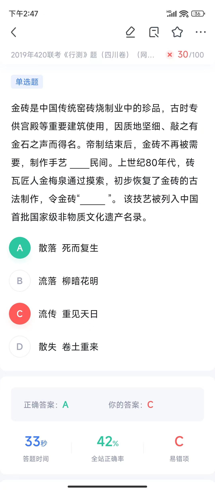
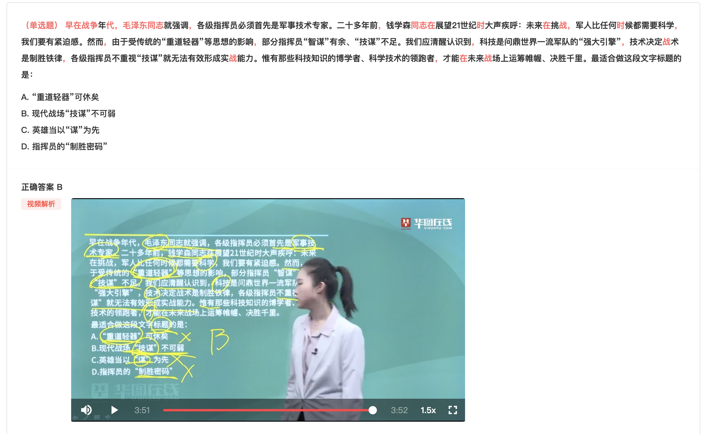

# 言语中心理解总框架


# 言语模块 - 逻辑填空框架（实词） 


```
 第一遍刷题出现的问题：
1. 词语辨析，结合语境。找出更适合的词语。并且有敏感度，文章是考的哪个语境，快速排除。
2. 注意最后落笔于哪个名词。要注意修饰的主题词。能不能搭配
3. 要注意关联词。相同句式表示并列。比如一批。。。一批。。。怎么样。这里的两个词最好含义一致。

```
## 33道题（30分钟 94%）

- 1（词义侧重：1. 区分安居和栖息，安居强调居住。但文中没说让人在花海中住下。但是诗意的栖息十可以的。2. 形容城市用喧嚣和喧闹比较好，喧嚷和喧哗过重。）


```
这一片花海，随四季不同而栽培，每个季节都有十几种花卉        。远离城市        ，回归大自然的宁静，让人诗意地        ，微风拂过，花香撩起的情丝，不知拨动过多少人的心弦。

依次填入划横线部分最恰当的一项是：

A

开放 喧闹 安居

B

盛放 喧哗 隐居

C

绽放 喧嚣 栖息

D

怒放 喧嚷 歇息


正确答案是： C收起
解析
第一空搭配“花卉”，四个词语均可，因此可从第二空判断，第二空搭配“城市”，且与后文“大自然的宁静”对应，说明城市环境不安静。A项“喧闹”和C项“喧嚣”均可用来形容环境不安静，比较吵闹之意，用在此处形容城市环境不安静，符合文意，保留。B项“喧哗”指大声说笑或叫喊，D项“喧嚷”指大声地叫，两词多用来形容具体的声音，一般不形容整体的环境，用于此处形容城市的环境不恰当，排除。

第三空，对应文段中“远离城市”“回归大自然的宁静”“微风拂过，花香撩起的情丝”，可知停留此处让人很舒适。C项“栖息”指歇息、暂住，置于文段可表达人们在花海中诗意地歇息，符合文意，当选。A项“安居”指安定地生活、定居，文段并未体现在花海之中定居之意，排除。

故正确答案为C。

```

- 2（1. 第一句：体现5000年的深度很深。所以沉淀，积淀比积聚，积蓄更好。2. 润泽只能做动词。）


```
中华文化绵延5000年，有其独特的价值体系，已成为中华民族的基因。中华优秀传统文化是中华民族的突出优势，        着中华民族最深沉的精神追求，为中华民族生生不息、发展壮大提供了丰厚        ，潜移默化地影响着中国人的思想方式和行为方式，至今仍然具有鲜活的时代价值。

依次填入划横线部分最恰当的一项是：

A

沉淀 润泽

B

积淀 滋养

C

积聚 滋润

D

积蓄 滋补


正确答案是： B收起
解析
第一空，所填词语搭配“精神追求”，根据前文“中华文化绵延5000年”、“中华优秀传统文化是中华民族的突出优势”可知，此处表达中华优秀传统文化中积累包含最深沉的精神追求的意思，A项“沉淀”表示凝聚积累、 B项“积淀”指积累沉淀，两项均可体现积累的意思，保留。C项“积聚”指逐渐聚集，常搭配物资、钱财，D项“积蓄”指积攒聚存，常搭配力量、钱财，均与“精神追求”搭配不当，排除。

第二空，所填词语搭配“提供”，需要填一个名词，B项“滋养”可做名词，表示养分、养料的意思，与“提供”搭配恰当，当选。A项“润泽”指的是滋润、使滋润的意思，一般不做名词使用，与“提供”“丰厚”均搭配不当，排除。

故正确答案为B。
```
- 3（1. 看题目不仔细：人家强调的是各个行业的人。应该是更多的角度，纬度。 2. 范围扩大了，推广不对）


```
近几年的经典解读出版中，除了文史类的专业学者，一些作家、诗人等跨界的知识精英也加入了进来。这些跨界解读给经典出版增添了更多的        和丰富性，个人化的写作风格也将读者群从文史爱好者        到文艺爱好者。

依次填入画横线部分最恰当的一项是：

A

维度 扩展

B

力度 延伸

C

深度 转移

D

角度 推广


正确答案是： A收起
解析
第一空，对应“跨界解读”且根据“和”可知，横线处与“丰富性”并列，要体现出跨界解读给经典出版带来的多元化效果，A项“维度”意为人们观察、思考与表述某事物的思维角度，D项“角度”意为看问题的出发点，放入此处均可形容跨界解读给经典出版带来的多元化效果，符合文意，保留。B项“力度”意为力量的大小程度或者功力的深度，侧重力量大小；C项“深度”意为深浅程度或触及本质的程度，均未体现出丰富多元的语义，排除。

第二空，由从“文史爱好者”到“文艺爱好者”可知，横线处要体现跨界解读的读者群范围扩大，A项“扩展”意为向外伸展，扩大，符合文意，当选。D项“推广”指扩大事物使用的范围或起作用的范围，如“推广普通话”“推广新技术”，而文段并不是扩大读者群的使用范围，与文意不符，排除。

故正确答案为A。
```

## 35道题（74% 30分钟）

- 1（1. “猛”“重”可知，所填词语应体现出党和政府坚决反腐的态度。所以决心表示态度强但是意志并没有很好的表示态度强）


```
党的十八大以来，中央以猛药去疴、重典治乱的        ，以刮骨疗毒、壮士断腕的        ，不断加大党风廉政建设和巡视的力度，效果显著。

依次填入画横线部分最恰当的一项是：

A

意念 底气

B

恒心 气势

C

意志 气魄

D

决心 勇气


正确答案是： D收起
解析
第一空，根据“猛药去疴、重典治乱”中的“猛”“重”可知，所填词语应体现出党和政府坚决反腐的态度。A项“意念”只是指想法、念头，无法体现坚决反腐的态度，排除。B项“恒心”强调持久不变，文段并非强调坚持的时间久，而是强调态度坚决，排除。D项“决心”表示坚定不移的意志，相比C项“意志”更能体现“猛”和“重”的程度，故D项保留。

第二空，修饰“刮骨疗毒、壮士断腕”，体现出党和政府面对腐败勇敢坚决的态度，D项“勇气”符合文意，当选。C项“气魄”比喻气势惊人，胆识过人，形容一个人有领袖气质，不符合文意，排除。

故正确答案为D。

```

- 2（1. 注意考试中也许两个词，它用的就是语义更丰富的词）


```
目前，第五代移动通信（5G）已成为当前和未来全球业界的焦点，将        移动互联网进入新时代。美国高通公司指出，5G技术将成为同电力、互联网等发明一样的通用技术，        未来的转型变革，重新定义工作流程并        经济竞争优势规则。到2035年，5G将在全球创造12.3万亿美元的经济产出，同时创造2200万个工作岗位。

依次填入划横线部分最恰当的一项是：

A

带领 催生 重造

B

引领 催化 重塑

C

引导 催发 制定

D

带动 催促 制订


正确答案是： B收起
解析
本题可从第三空入手，搭配“规则”，且由“并”可知，横线处所填词语与“重新”构成并列语义相近。B项“重塑”指重新塑造，与文意相符且搭配恰当，保留。A项“重造”指不把原先做基础，完全重新再造，与“规则”搭配不当，排除；C项“制定”指经过一定的程序定出（法律、规程、计划等），D项“制订”指草拟创制，二者均无法体现“重新”之意，排除。

第一空，代入验证，形容“5G”对“移动互联网”的作用，B项“引领”指引导、带领，符合文意且搭配恰当。

第二空，代入验证，搭配“转型变革”，B项“催化”指促使化学反应的速率发生改变，有使加快速度之意，可与“未来的转型变革”搭配，表达加快未来的转型变革，当选。

故正确答案为B。
```
- 3（造成”和“导致”往往加不好的结果，感情色彩偏消极。而带来和引发是中性词）


```
未来将会怎样，不可准确预知，但格局和            总有踪迹可循。在信息技术、互联网发展所            的巨大变革面前，时代和社会呼唤产生一批真正的未来学家，能够站在历史和现实的关口，对信息社会的未来有所把握，为未来人们的生产和生活、选择和行为提供一些理论上的            。

依次填入画横线部分最恰当的一项是：

A

轨迹 带来 解释

B

方向 造成 设想

C

路径 导致 服务

D

趋势 引发 指导


正确答案是： D收起
解析
本题从第二空入手，表达互联网带来的变革，B项“造成”和C项“导致”往往加不好的结果，感情色彩偏消极，排除。

第三空，根据文意，横线词语表达未来学家提供理论上的引导和帮助，D项“指导”符合文意，保留。A项“解释”往往是已经发生的事情，与文段“未来”的语境不符，排除。

第一空，代入验证，D项“趋势”和“格局”构成并列，符合文意，当选。

故正确答案为D。
```
- 4（1. 词义辨析，结合文境。原则问题要旗帜鲜明、立场坚定。它的反面是立场不坚定，含糊。而退缩的反面是勇敢。）


```
准确、权威的信息不及时传播，虚假、歪曲的信息就会搞乱人心；积极、正确的思想舆论不发展壮大，消极、错误的言论观点就会肆虐______。这方面，主流媒体守土有责，更要守土尽责，及时提供更多真实客观、观点鲜明的信息内容，牢牢______舆论场主动权和主导权。主流媒体要敢于引导、善于疏导，原则问题要旗帜鲜明、立场坚定，一点都不能______。

依次填入画横线部分最恰当的一项是：

A

蔓延 守护 犹豫

B

扩散 占据 退缩

C

滋生 控制 迟疑

D

泛滥 掌握 含糊


正确答案是： D收起
解析
第一空，搭配“言论观点”，根据前文“积极、正确的思想舆论不发展壮大”可知，横线处所填内容与“壮大”对应，体现出消极、错误的言语观点不断发展壮大之意，A项“蔓延”指延伸、扩展，B项“扩散”指扩大散布，D项“泛滥”指比喻坏的事物不受限制地流行，三项均可体现文意，保留。C项“滋生”指引起、产生、繁殖，多搭配不好的对象，根据文意可知横线需表达范围扩大的意思，而非产生的意思，排除。

第二空，搭配“主动权和主导权”，B项“占据”指取得或保持，D项“掌握”指充分支配或运用，均搭配恰当，保留。A项“守护”指看守保护，与“主动权和主导权”搭配不当，排除。

第三空，根据“原则问题要旗帜鲜明、立场坚定”可知，主流媒体对于原则问题的态度是明确的，故横线处强调一点也不能模糊之意，D项“含糊”与文意相符，当选；B项“退缩”指畏难不前，后退，与文意不符，排除。

故正确答案为D。
```
- 5（词义辨析，要结合语境。随着改革的深入。。但。。，但要跟深入差不多的意思。所以彻底有这个意思，但是全面没有这层意思。）


```

随着改革的深入，军工企业逐步建立起适应市场经济的现代企业制度。但军工集团改制并不          。一方面，从事生产经营的军工企业基本完成了公司制改造，成立了股份制公司；另一方面，多数军工院所依然在事业单位体制内，独立于市场经济之外。产研          一定程度导致了科研成果市场化程度低、技术成果社会转换利用率不高的问题。

A

彻底 分离

B

系统 互促

C

完善 共建

D

全面 脱节


正确答案是： A收起
解析
本题从第二空入手，根据前文可知，“从事生产经营的军工企业基本完成了公司制改造”，而“多数军工院”并没有完成公司制改造，故所填词语应体现出“生产经营”与研发分割开来之意。A项“分离”、D项“脱节”均符合文意，保留；B项，“互促”指相互促进；C项，“共建”指共同建设，而文段意在表明两者分割开来，故B、C两项均与文段语义相悖，排除；

第一空，对比A、D两项。A项“彻底”指强调完全而无所遗留；D项“全面”指侧重兼顾各个方面，两项均可与后文“一方面······另一方面······”对应，故寻找其他解题线索。横线前出现否定表述“并不”，前后语义相反，根据前文“随着改革的深入”可知，文段强调改革不够深入，而非某一方面没有完成，故两项对比，A项更优。

故正确答案为A。
```
- 6（1. 提取等于提炼。用法。提取化合物 2. 无谓：没有意义，文章没有超额的意思。）


```
在生物钟的作用下，蓝藻在日出之前即可提前动员光合作用系统，在阳光一出现的时候就可以        能量，比那些纯粹依靠光线启动光合系统的生物领先一步。与之类似，日落之后，蓝藻的光合系统会遵循生物钟的指令而关闭，避免那些夜间无须调动的能量被        浪费。

依次填入画横线处最恰当的一项是

A

提取 无故

B

摄取 无谓

C

吸取 过度

D

汲取 超额


正确答案是： B收起
解析
第一空，搭配“能量”，表示光合作用系统吸收能量。A项“提取”表示经过提炼而取得，蓝藻的光合作用系统不能对太阳光的能量进行提炼，排除。B项“摄取”、C项“吸取”、D项“汲取”均表示吸收，符合文意，搭配恰当，保留。

第二空，根据横线前“无须调动的能量”可知，这些能量不应该被浪费，故横线处应体现“不应当”的含义，对应B项“无谓”，表示没有意义。C项“过度”、D项“超额”表示过量，文段无此意，排除。

故正确答案为B。
```

- 7（1. 维度相当于多角度，但是文章只是空间划分从小到大，相当于村，镇，乡。所以用层次，层级比较好。2. 词义辨析根据语境，很多概念的内涵和边界不够清楚，说明混乱）


```
新中国的区域与城市规划始于20世纪50年代，目前在空间规划上已初步形成了八个主要        ，按照从小到大的顺序，依次是乡村规划、小城镇规划、城市规划、大都市规划、大都市区规划、大都市圈规划、城市群规划和湾区规划。但由于缺乏系统的        和深入的研究，很多概念的内涵和边界不够清楚，这给实际的规划和建设带来诸多的不便和        。

依次填入画横线部分最恰当的一项是：

A

层次 调查 阻碍

B

部分 考察 负担

C

层级 梳理 混乱

D

维度 分析 困难


正确答案是： C收起
解析
第一空，根据横线后可知，空间规划是按照从小到大的顺序来的，B项“部分”，指整体中的局部，整体里的一些个体，D项“维度”，为几何学及空间理论的基本概念，均不符合文意，排除。A项“层次”，指同一事物由大小、高低等不同而形成的区别，C项“层级”，即层次、级别，在层次的基础上，进行分级，均符合文意，保留。

第二空，A项“调查”与C项“梳理”填入文段，搭配均可，保留。

第三空，根据前文“很多概念的内涵和边界不够清楚”可知，强调在具体操作过程中，即实际规划和建设带来的影响，C项“混乱”是指无条理，无秩序，符合文意，当选。A项“阻碍”是指阻挡住，使不能顺利通过或发展，文段并未提及“实际规划和建设”无法发展，与文意不符，排除。

故正确答案为C。

```

- 8（1. 首先排除d目的不符合。2. 然后根据词义辨析，语境分析--患者还会由于不想被说教而不承认一些不良生活行为。不承认对应隐瞒。遗漏不是主观的，这里是故意的。）


```
医生和患者在沟通时最容易出现的        其实是，患者不同意或没听懂医生的建议，又因为不想被说教或觉得尴尬而没有如实反馈意见，而医生也大多没有意识到这一点。这显然会大大影响临床诊疗的        。此外，患者还会由于不想被说教而不承认一些不良生活行为。越是健康状况差的患者，越是容易        一些信息，而他们恰恰是最需要高质量医疗服务的人。

依次填入画横线部分最恰当的一项是：

A

难点 结果 遗漏

B

盲区 效率 隐瞒

C

障碍 判断 虚构

D

瓶颈 目的 回避


正确答案是： B收起
解析
从第二空入手，根据横线前“这”指代前文“医生没有意识到患者没有如实反馈”这件事，可知横线处应表达“此事”对“临床诊疗”造成了影响。A项“结果”、B项“效率”、C项“判断”均符合文意，保留。D项“目的”，无论受影响与否，“临床诊疗”的“目的”都应是一致的，与文意不符，排除。

第三空，根据“患者······不承认一些不良生活行为”可知“越是健康状况差的患者”越不想承认，故横线处体现出“不承认”之意，B项“隐瞒”意思是掩盖真相不让人知道，符合文意，保留。A项“遗漏”意思是应该列入或处理却因疏忽而没有列入或处理，文段是患者自己不想承认并非因为疏忽，与文意不符，排除；C项“虚构”是指凭空捏造，文中只是患者不承认已有的行为，未体现出“凭空捏造”，与文意不符，排除。

第一空，代入验证，B项“盲区”刚好和后文“医生也大多没有意识到这一点”形成呼应，符合文意，当选。

故正确答案为B。

```

- 9（1. 从语境分析，这里适合选贬义词，臆测含有贬义，但是虚构是中性。2. 文章主题词，想象。而臆测更贴近主题词。但是虚构不贴近。）


```
观察就要用专业的角度去关注、        周围的事物，有意识地汲取、思索、分析，看在眼里，记在心里。丰富的想象正是来源于知识的广博和平时对生活深入细致的观察。因此，想象并不是凭空        的。

依次填入划横线部分最恰当的一项是（    ）。

A

体验 杜撰

B

体味 虚构

C

体察 臆造

D

体察 虚构


正确答案是： C收起
解析
第一空，横线处与“关注”通过顿号构成并列且对应后文“看在眼里”，故横线处表达“看”的含义，C、D两项“体察”指体会、观察，语意相符。A项“体验”指亲身经历；B项“体味”指体会寻味，均与文意不符，排除。

第二空，根据“想象正是来源于······观察”可知，横线处强调想象不是凭空想出来的，C项“臆造”指凭主观的想法编造，语意相符且“凭空臆造”是常见搭配，当选。D项“虚构”指凌空构作，凭空捏造，虚幻之实化，含有“凭空编造”的意思，与“凭空”语义重复，排除。

故正确答案为C。

```

## 16道题 55%（16分钟 目标是30道题）

- 1（词义辨析，结合语境。舞台就是程式化和生活化的结合，过度的程式化表演会让观众觉得虚假”，表达过度的“程式化”就没有“生活”即不真实，虚假，可知横线处要表达“过度的生活化”就没有“程式化”。而程式化的反义词就是随便。不要只要你觉得，要按照出题作者觉得才行。）


```
舞台就是程式化和生活化的结合，过度的程式化表演会让观众觉得虚假，过度的生活化表演又会让观众觉得        ，因此，要把握好程式化和生活化的        ，为观众呈现精彩有趣的戏曲艺术。

依次填入划横线部分最恰当的一项是：

A

庸俗 程度

B

随便 平衡

C

琐碎 差异

D

枯燥 重心


正确答案是： B收起
解析
第一空，根据前文“舞台就是程式化和生活化的结合，过度的程式化表演会让观众觉得虚假”，表达过度的“程式化”就没有“生活”即不真实，虚假，可知横线处要表达“过度的生活化”就没有“程式化”，B项“随便”就表达没有步骤，没有程序，符合文意，保留；A项“庸俗”指平庸鄙俗，对立面是“高雅”，和“程式化”无关；C项“琐碎”指细小繁多，D项“枯燥”指单调、没有趣味，都与缺乏“程式化”无关，排除。

第二空，体现“程式化和生活化”两者之间的关系，对应前文，过度的程式化和过度的生活化效果均不佳，故横线处应表示把握好程式化和生活化之间的“度”，不能过于生活化也不能过于程式化，B项“平衡”表述正确，当选。

故正确答案为B。

```

- 2（1. 留意，凝神太口语排除 2. A，B两项，词义辨析，结合语境。看第四个空，纪录片是众多国家进行对外文化传播的重要工具。这个对外用引领比较好，传承用于后代这种情景。）


```
纪录片是众多国家进行对外文化传播的重要工具。        时代之魂、        时代之需、        时代之变、        时代之风，纪录片创作者应当充分挖掘和盘活“讲好中国故事”这个富矿，向世界展现真实、立体、全面的中国，提高国家文化软实力和中华文化影响力。

依次填入画横线部分最恰当的一项是：

A

把握 关注 聚焦 引领

B

筑牢 聚焦 关注 传承

C

筑牢 洞悉 凝神 传承

D

把握 留意 警醒 引领


正确答案是： A收起
解析
本题可从第四空入手，搭配“时代之风”，根据后文“向世界展现真实、立体、全面的中国”可知，所填词语表示影响带动引领时代风气，“引领”指引导带领，与后文对应恰当，保留A、D两项。“传承”指时间上的继承，文段并非表示时间上往下传，排除B、C两项。

再看第三空，搭配“时代之变”，A项“聚焦”与之搭配恰当，且表意形象准确，保留。D项“警醒”指警觉醒悟，常搭配消极不好的现象，“时代之变”并非贬义，用在此处搭配不当，排除。

第一、二空，代入验证，A项“把握时代之魂”、“关注时代之需”均搭配恰当，符合文意，当选。

故正确答案为A。
```
- 3（1. 传导”指热或电从物体的一部分传到另一部分，多用于物理学或神经方面。传达”意为把一方的意思告诉给另一方，多与命令、消息搭配，与知识搭配不当，所以排除CD2. 传输，传递知识都可以。传输”指传递、输送，一般搭配信息、数据。传递知识，温暖，力量。 3. 词义辨析，根据语境选择最好的。一线科学家很难花费太多的时间和精力直接参与一波又一波的科普活动。说明第二个空是一对多传播精神。而传递是1对1.）


```
向民众        科学知识，        科学精神，是科学家义不容辞的责任。但是科学家首先要致力于科研，他究竟能花多少时间来做科普，显然无法一概而论。通常，一线科学家很难花费太多的时间和精力直接参与一波又一波的科普活动。

依次填入划横线部分最恰当的一项是：

A

传输 传递

B

传递 传播

C

传导 传扬

D

传达 传承


正确答案是： B收起
解析
第一空，搭配“科学知识”，表示向民众传播科学知识，A项“传输”指传递、输送，一般搭配信息、数据，与“知识”搭配得当，保留；B项“传递”指由一方交给另一方，表示科学家把科学知识传播给民众，搭配得当且语义恰当，保留。C项“传导”指热或电从物体的一部分传到另一部分，多用于物理学或神经方面，与知识搭配不当，排除；D项“传达”意为把一方的意思告诉给另一方，多与命令、消息搭配，与知识搭配不当，排除。

第二空，搭配“科学精神”，根据横线后“做科普”“科普活动”可知，“科普”即科学普及，特点是范围广、受众多，所以横线处所填词语要体现出范围广、受众多，B项“传播”指广泛散布，与“科学精神”搭配恰当，且与“科普活动”对应准确，当选。A项“传递”无法体现出科普活动受众多的特点，排除。

故正确答案为B。
```
- 4（1. 巡游：出外游玩，游逛。洄游：意为海里鱼类等因为产卵、觅食或受季节变化的影响，沿着一定路线有规律地往返迁移。洄游：意为海里鱼类等因为产卵、觅食或受季节变化的影响，沿着一定路线有规律地往返迁移。逡巡：指有所顾虑而徘徊或不敢前进）


```
无论是体长、体重或是综合进行考量，蓝鲸都无愧于现存最“大”的生物体。而生活在广袤的大洋中，蓝鲸不需要像陆生动物那样费力地支撑起自己沉重的身躯，可以自在地        。

填入划横线部分最恰当的一项是：

A

巡游

B

洄游

C

巡回

D

逡巡


正确答案是： A收起
解析
根据横线前“不需要像陆生动物那样费力地支撑起自己沉重的身躯”与“自在地”可知，横线处表达蓝鲸可以在海里自如的掌握身体，轻松地游。A项“巡游”出外游玩，游逛等，与文段“自在地”搭配恰当，当选。B项“洄游”意为海里鱼类等因为产卵、觅食或受季节变化的影响，沿着一定路线有规律地往返迁移，与文意不符，排除；C项“巡回”意为按一定的路线或范围到各处活动，文段并没有按一定路线之意，排除；D项“逡巡”指有所顾虑而徘徊或不敢前进，与文意不符，排除。

故正确答案为A。
```
- 5（1. 第一个空要形容声音小。但是回响（空谷回响）声音较大。回响”指声音一再地发出和折回，通常不与“余音”搭配。 2. 倏忽”可以形容时间或光阴迅速流逝。形容时间快。蓦然”、“遽然”均有猛然的意思，填入文段程度过重）


```
青山隐隐，芳草萋萋，春天的脚步总是来去匆匆。“二月里来好春光”的余音还在耳畔____，____之间便到了细雨纷纷、祭扫亲人的清明时节。

依次填入画横线部分最恰当的一组是：

A

缭绕 蓦然

B

回响 忽然

C

飘荡 遽然

D

萦绕 倏忽


正确答案是： D收起
解析
第一空，搭配“余音”，B项“回响”指声音一再地发出和折回，通常不与“余音”搭配，排除。A项“缭绕”指一圈圈向上飘起，C项“飘荡”指在空中飘浮、飘摆或飞升，D项“萦绕”比喻声音在某些地方旁边旋转、回复，填入文段均可，保留。

第二空，根据文意可知，横线处表达时间过的飞快，从二月转眼之间到了清明时节，D项“倏忽”可以形容时间或光阴迅速流逝，填入文段语义合适，当选。A项“蓦然”、C项“遽然”均有猛然的意思，填入文段程度过重，排除。

故正确答案为D。
```
- 6（1. 有种说话叫重点语境。语境重点在表演者和观众两者之间展开。并且贴合语境应该是简约。错是因为没找到考察点其实是第三个空，而c是直接排除间接。）


```
传统曲艺中一两个演员借助简单的手持道具，靠说唱完成一场表演，没有过硬的功夫不行，不会与观众            更不行。修养高深的曲艺表演者会使用各种手段拉近与观众的情感距离，            引领观众参与艺术创造。在基本没有舞台布景和“灯服道效”相配合的            表演环境中，曲艺演员要靠自身的表演征服观众，其难度远远大于其他舞台表演艺术。

依次填入画横线部分最恰当的一项是：

A

交流 主动 简约

B

对话 巧妙 临时

C

沟通 间接 单一

D

互动 快速 虚拟


正确答案是： A收起
解析
本题可从第二空入手，由“表演者会使用各种手段”可知，演员们对观众的引领是“主动”“巧妙”或“快速”的，C项“间接”与文意相悖，故排除C项。

第三空，与文段中表演环境“基本没有舞台布景和‘灯服道效’相配合”对应，A项“简约”更为准确，B项“临时”与“环境”搭配不当，排除。D项“虚拟”与文意不符，文段中的环境是实际存在的，排除。

第一空，代入验证，A项“交流”符合文意，当选。

故正确答案为A。
```


## 15道题（50% 15分钟）

- 1（1.支援（强对弱）支应（应付） 2. 差异化需求，区别化对待）


```
支付工具的多样化组合，提升了我国支付体系运行的质量和效率，满足了公众            支付需求。从未来支付趋势看，现金支付和非现金支付工具相互        、相互补充、共存共生的局面将长期存在。但是对我国这样一个地域广、人口多、发展很不均衡的大国来说，由于核心技术水平的限制，过度依赖非现金支付会大大增加支付体系的脆弱性。因此，必须长期        现金作为国家法定支付方式的地位，切实保障广大人民使用现金的合法权益。

依次填入画横线处最恰当的一项是

A

区别化 支持 确保

B

差异化 支撑 确立

C

个性化 支援 确认

D

多元化 支应 确证


正确答案是： B收起
解析
第一空，根据“支付工具的多样化组合”可知，横线处表达满足公众不同的支付需求，选项均符合文意。

第二空，通过顿号与“相互补充”构成并列结构，横线处对应“补充”，表示现金支付与非现金支付长期共存，“相互支持”、“相互支撑”符合文意。C项“支援”指用人力、物力、财力或其他实际行动去支持和援助，D项“支应”指敷衍、应付，均与文意不符。

第三空，与“地位”搭配，B项“确立地位”搭配恰当，当选。A项“确保”指切实保持或保证，搭配不当，用在此处应表述为“必须长期确保现金的首要地位不动摇”，排除。

故正确答案为B。

```

- 2（1. 资源约束趋紧”为固定搭配，资源约束表达资源对于人们活动的限制程度。普惠的民生福祉，都为常见搭配。）


```
良好的生态环境，是最公平的公共产品，是最        的民生福祉。当前，我国资源约束        ，环境污染严重，生态系统退化的问题十分严峻，人民群众对清新空气、干净饮水、安全食品、优美环境的要求越来越强烈。

依次填入画横线部分最恰当的一项是：

A

普遍 不力

B

重要 紧张

C

关键 不够

D

普惠 趋紧


正确答案是： D收起
解析
第一空，根据文意可知横线处表达：良好的生态环境对于民生福祉有好处，A项“普遍”仅强调全面、范围广，体现不出有好处之意，排除；B项“重要”、C项“关键”、D项“普惠”填入文段均可，保留。

第二空，搭配“资源约束”，“资源约束”指资源不足对于人们活动的限制，“资源约束趋紧”为固定搭配，表达资源对于人们活动的限制程度越来越高，D项当选；B项“紧张”与“约束”搭配不当，排除；C项“不够”填入横线指资源对人们活动的限制还不够还需要继续限制，与文意相悖，文段强调资源约束越来越严重，排除。

故正确答案为D。
```
- 3（1. 指示（上级对下级），拷问过重，排除 2. 思索包含的含义更广（思考和行动），但是思考只有（侧重于思维活动））


```
我国的大禹治水传说和西方的诺亚方舟故事为我们呈现了中西文化的美丽景观，“娴静”的中国传统文化与“跃动”的西方文化相映，东方的责任意识和西方的权力思想相辅，        我们走向中西文化差异的源头，启发我们        中西文化的特质和精髓，促使我们相互借鉴、彼此“扬弃”，绘写多彩的人类文明图画。

依次填入划横线部分最恰当的一项是：

A

引领 思考

B

指引 拷问

C

引导 思索

D

指示 追寻


正确答案是： C收起
解析
第一空，文段为相同句式表达的并列关系，故横线处所填词语应与“启发”和“促使”构成对应，体现出带领我们走向源头的含义。A项“引领”指引导、带领，B项“指引”意思是指点、引导，C项“引导”指带领、指引，均符合文意，保留；D项“指示”意思是指明显示，或安排、命令，多用于上级对下级，与文意不符，排除。

第二空，横线处所填词语与“特质和精髓”搭配，A项“思考”和C项“思索”均搭配得当，保留；B项“拷问”指拷打审问，与“特质和精髓”搭配不当，排除。进一步对比A项“思考”和C项“思索”，“思索”指反复思考探索，语义上比思考更丰富，而我们对于中西文化的特质和精髓除了思考也是需要探索的，故C项“思索”更符合文意，当选。

故正确答案为C。
```
- 4（1. 灌注”常用来指把某一感情融入某物中，灌输”指传播、输送思想、知识等。2. 结合语境：同理心，以及后文一个社会对待老年人应有的温情与敬意。3. 灌溉”指用水浇地，灌制”指录音制造）


```
在养老举措、制度设计等各方面      更多“老吾老以及人之老”的同理心，是一座城市、一个社会对待老年人应有的温情与敬意。

填入下列横线处的词语，最恰当的一项是：

A

灌注

B

灌溉

C

灌输

D

灌制


正确答案是： A收起
解析
文段意在表达在养老的制度设计中，多一些“老吾老以及人之老”的同理心是我们应该做的事情。结合选项可知，只有A项“灌注”常用来指把某一感情融入某物中，用在此处语义合适，当选。

B项“灌溉”指用水浇地，C项“灌输”指传播、输送思想、知识等，D项“灌制”指录音制造，均与抽象名词“同理心”搭配不当，且与文意不符，均排除。

故正确答案为A。
```
- 5（1. 根据语境：依法治国和依法行政的        ，需要各级政府及其工作人员，说明第一个空要填一个目标更合适。2.根据语境：在法治        上行使权力。在框架内行使权利，固定搭配：在法律轨道上行使权利。轨道有实体和抽象概念。 轨道：物体运动的路线，还有行动应遵循的规则。）


```
依法行政是依法治国的重要环节，是指行政机关依照宪法法律规定取得并行使其行政权力，并对其行政行为的后果承担相应责任。依法治国和依法行政的        ，需要各级政府及其工作人员在法治        上行使权力、在宪法法律范围内活动。

依次填入画横线处最恰当的一项是：

A

实现 轨道

B

实施 基础

C

执行 框架

D

履行 道路


正确答案是： A收起
解析
第一空，根据后文“需要各级政府······行使权力、在宪法法律范围内活动”可知，“需要”之后是具体的做法，横线处表示“依法治国和依法行政”是后文做法要实现和达到的目标。A项“实现”意为使成为事实，符合文意，保留。B项“实施”、C项“执行”和D项“履行”均表示采取具体的行为，在文段中“依法治国和依法行政”是目标，均没有“实现”用在此处准确恰当，与文意不符，排除。

第二空，代入验证，“法治轨道”为常用搭配，A项符合语境，当选。

故正确答案为A。
```
- 6（1. 要注意两个词中，一个非常适合，但是另一个不适合，就千万不能选。2. 保留有个主动的意味在里面，所以其中很多人的症状会   保留     到成年期，不合适 3.第二个说明不了解这个群体，所以用忽视也可以。）


```
ADHD，也就是通常所说的“多动症”，在儿童时期常以多动、冲动、注意力缺陷等为主要表现，其中很多人的症状会        到成年期。成人多动症患者更是一个被严重        的群体，我们给这个群体贴了很多标签，如“不靠谱”“拖延症”“低情商”“冲动狂”等。

依次填入画横线部分最恰当的一项是：

A

影响 歧视

B

延迟 误解

C

保留 排斥

D

延续 忽视


正确答案是： D收起
解析
第一空，搭配“成年期”，横线处所表达的意思为儿童时期的症状会持续到“成年期”，D项“延续”表示持续，语义符合，保留。A项“影响”表示对人或事物所起的作用，并非持续之意，并且与“成年期”搭配不当，可与具体的“工作”“生活”等进行搭配，排除；B项“延迟”表示推迟，语义不符，排除；C项“保留”侧重保存，文段并非此意，排除。

第二空，代入验证。通过后面的解释，给这个群体添加了很多非正常标签，则体现出对该症状严重忽略，D项“忽视”体现了从未正视，疏忽、不在意，符合文意，当选。

故正确答案为D。
```
- 7（语境：面对不好东西却很包容。第二个空才能表现：开明。但是文章不是体现聪明的。理智也能体现开明。但是绝没有聪明的意味。）


```
大连人直面历史，表现出了应有的        ，采取了极为        的做法，他们没有“砸碎一个旧世界，建立一个新世界”，而是完好地保留了那些欧式建筑、广场和绿地。

依次填入画横线部分最恰当的一项是：

A

气度 睿智

B

理智 开明

C

魄力 大胆

D

胸襟 另类


正确答案是： B收起
解析
本题可从第二空入手，后文是对横线处的解释说明，根据后文“没有砸碎旧世界”和“完好保留欧式建筑、广场、绿地”，体现出大连人在面对历史时“不守旧”、“包容”的做法，对应B项“开明”。A项“睿智”指聪颖明智，C项“大胆”指不畏惧困难，二者均体现不出“包容”的含义，排除；D项“另类”偏消极，和文段积极的感情色彩不符，排除。

第一空，代入验证，“理智”对应后文“没有砸碎旧世界”，语义相符。

故正确答案为B。
```
- 8（文章强调多方协作。A项“隔绝”指阻隔、断绝，与“协作”语意相反，体现出经典并非个体冥想的产物，符合文意，当选。B项“隔空”指隔着一定的空间，无法与“合作”构成语意相反，排除。）


```
经典不产自        的冥想，而源于        的共鸣。作者自身树立经典意识、在艺术上精益求精；网站编辑把好品质关，及时发掘推荐有潜力的作品；网站、读者、评论家和监管部门也可齐心协力，营造有利环境。

依次填入划横线部分最恰当的一项是（    ）。

A

隔绝 协作

B

隔空 合作

C

虚空 现实

D

浅层 深度


正确答案是： A收起
解析
本题从第二空入手，根据完整语句“作者自身树立经典意识、在艺术上精益求精；网站编辑把好品质关，及时发掘推荐有潜力的作品；网站、读者、评论家和监管部门也可齐心协力，营造有利环境”可知，横线处强调经典源于多方的共同努力，A项“协作”指在目标实施过程中，部门与部门之间、个人与个人之间的协调与配合；B项“合作”指个人与个人、群体与群体之间为达到共同目的，彼此相互配合的一种联合行动、方式，均符合文意。C项“现实”指客观存在的事物或事实解释；D项“深度”指一个人的学识、修养很高，与文意不符，均排除。

第一空，横线处搭配“冥想”且根据“不产自······而源于······”可知，横线处与第二空构成反义并列关系，A项“隔绝”指阻隔、断绝，与“协作”语意相反，体现出经典并非个体冥想的产物，符合文意，当选。B项“隔空”指隔着一定的空间，无法与“合作”构成语意相反，排除。

故正确答案为A。
```


## 15道题（86% 9分钟）

- 1（新词热词优选，虽然AD都可以。但是与个体心中觉醒的文明意识形成共振是最新的新词）


```
随着社会物质生活水平的提高，人们对公共文明、社交礼仪有了更多的自我追求，恰当的外部倡议确实能够与个体心中觉醒的文明意识形成        ，最终实现社会公共文明水平的整体提升。但还是得强调一点，这种倡导边界的拿捏很重要，底线是要有民意        。

依次填入划横线部分最恰当的一项是：

A

合力 认可

B

共鸣 支持

C

呼应 支撑

D

共振 认同


正确答案是： D收起
解析
第一空，修饰“外部倡议”和“个体心中觉醒的文明意识”，且结合横线后“最终实现······整体提升”可知，横线处表示二者为一致的关系。D项“共振”指两个振动频率相同的物体，当一个发生振动时，引起另一个物体振动的现象，可引申为思想、意识、言论、精神状态等方面一致，符合文意，保留。B项“共鸣”指由别人的某种情绪引起的相同的情绪，可体现一致的含义，保留。A项“合力”指一起出力，多用来修饰多个客观主体积极主动做出某种行为，“文明意识”为抽象的事物，体现不出主动性，排除。 C项“呼应”指彼此声气相通，互相照应，文段中并未体现出“外部倡议”与“个体心中觉醒的文明意识”相互照应，不符合文意，排除。

第二空，修饰“底线”，底线即最低的限度，D项“认同”指认可赞同，程度较轻，符合文意，B项“支持”是在认同基础之上的帮助支援，程度过重。排除，且D项“民意认同”搭配恰当且更符合文意，当选。

故正确答案为D。

```

- 2（1. 疏放：指行为放纵或者文章（画画等作品）不拘常格 2. 文字记载。3. 浸透”指比喻饱含（某种思想感情等）渗透”比喻一种事物或势力逐渐进入到其他方面）


```
这种恢弘的春天的仪式，是古老先民为子孙创造的狂欢节，它依然        着祖先们的记忆、嘱托和想象，让春天变得如此华丽，盎然        着他们的激情，那么浓郁、雄健、炽热，洪波涌起，渐至澎湃。

依次填入划横线部分最恰当的一项是：

A

承载 疏放

B

记载 释放

C

浸透 吐放

D

渗透 绽放


正确答案是： C收起
解析
第一空，横线处所填词语搭配“记忆、嘱托和想象”，用以形容“春天的仪式”，意在表达从这样的“仪式”中可以看到祖先们的“记忆、嘱托和想象”，A项“承载”指托着物体，承受它的重量，C项“浸透”指比喻饱含（某种思想感情等），置于此处均符合文意，保留。B项“记载”指把事情写下来，置于此处与“仪式”搭配不当，排除；D项“渗透”比喻一种事物或势力逐渐进入到其他方面，与文意无关，排除。

第二空，横线处所填词语搭配“激情”，C项“吐放”指放射，多与抽象事物搭配，置于此处符合文意，与“盎然”对应得当，当选。A项“疏放”指行为放纵或者文章不拘常格，与文段含义无关，排除。

故正确答案为C。
```


# 言语模块-成语
## 30道题（80% 18分钟）

- 1（语义辨析-结合语境。是需要找到新方法。改弦更张”比喻改革制度或变更方法，强调在原来的基础上改变，并未体现用新的办法解决问题。）


```
太空是一个充满未知和挑战的领域，面对人类的雄心，当前的化学火箭早已            。因为化学火箭所携带的燃料要占总重的以上，能量密度较低，工作时间也不长。若要飞向更远的深空和开展星际旅行，必须            ，寻找新的“登天之梯”。

依次填入划横线部分最恰当的一项是：

A

鞭长莫及 未雨绸缪

B

力不从心 另辟蹊径

C

无能为力 改弦更张

D

黔驴技穷 全力以赴


正确答案是： B收起
解析
本题可从第二空入手。根据后文的解释说明“寻找新的‘登天之梯’”可知，所填词语应体现出要找到新的解决办法之意。B项，“另辟蹊径”比喻另创一种风格或方法，符合文意，保留。A项，“未雨绸缪”比喻事先做好准备工作，D项，“全力以赴”指把全部力量都投入进去，两项均无法体现出新办法之意，故排除A、D两项；C项，“改弦更张”比喻改革制度或变更方法，强调在原来的基础上改变，并未体现用新的办法解决问题，不符合文意，排除。

第一空，验证B项，“力不从心”指心里想做，可是力量够不上，置于文段意为“化学火箭”的力量无法满足当前的需求，符合文意，当选。

故正确答案为B。

```

- 2（1. 如箭在弦”强调事情已经到了不得不做或话已经到了不得不说的时候。 2. 如履平地”强调像走在平地上一样，比喻从事某项活动或某些事情十分轻易顺利）


```
从广州南沙到深圳前海、珠海横琴，从香港科技大学（广州）校区合作项目建设，到推进深港青年创新创业、加速粤澳合作中医药科技产业园建设，聚力打造深度合作发展平台的探索（    ）。

A

如履平地

B

如箭在弦

C

如愿以偿

D

如火如荼


正确答案是： D收起
解析
根据文段前文列举了一系列的合作项目，说明合作发展的态势非常好，故所填成语应表示合作平台的探索是非常兴盛热烈的，D项“如火如荼”形容旺盛、热烈或激烈，与文段语境相符，为正确答案。

A项“如履平地”强调像走在平地上一样，比喻从事某项活动或某些事情十分轻易顺利，文段并未体现打造合作平台这件事本身是轻松容易的，排除；B项“如箭在弦”强调事情已经到了不得不做或话已经到了不得不说的时候，与文意不符，排除；C项“如愿以偿”比喻像所希望的那样得到满足，指愿望实现，文段并未提及愿望，与文段无从对应，排除。

故正确答案为D。
```
- 3（1. 根据下文“来也匆匆去也匆匆”、“······最后无影无踪”可知，横线处体现高科技产品出现的时间很短、并不长久。A项“昙花一现”指美好的事物出现的时间很短 2.弄虚作假”指耍花招儿，欺骗人，C项“徒有其表”指空有其外表，不实在，D项“华而不实”比喻外表好看，内容空虚。三项均无法体现“不长久”之意 ）


```
一个现实是，受普通大众欢迎的产品才能走得更远，才能在市场上更长久地立足。很多所谓的高科技产品            ，来也匆匆去也匆匆，忽悠了消费者一把，最后无影无踪。

填入划横线部分最恰当的一项是：

A

昙花一现

B

弄虚作假

C

徒有其表

D

华而不实


正确答案是： A收起
解析
根据下文“来也匆匆去也匆匆”、“······最后无影无踪”可知，横线处体现高科技产品出现的时间很短、并不长久。A项“昙花一现”指美好的事物出现的时间很短，符合文意，当选。

B项“弄虚作假”指耍花招儿，欺骗人，C项“徒有其表”指空有其外表，不实在，D项“华而不实”比喻外表好看，内容空虚。三项均无法体现“不长久”之意，且文段并无高科技产品作假、不实在之意，与文意不符，排除。

故正确答案为A。
```
- 4（1. D项“牢不可破”指坚固、紧密不能摧毁或拆开，与“理念”搭配不当。友谊关系牢不可破可以。 ）


```
从“蓝天保卫战”到“史上最严”的新环境保护法，再到对“洋垃圾”说“不”，“绿水青山就是金山银山”的理念已            。对于中国而言，这是转变发展方式、破解资源环境瓶颈制约、提升国际竞争力的内在要求，与国家乃至全球的可持续发展目标            。

依次填入画横线部分最恰当的一项是：

A

众所周知 不谋而合

B

根深蒂固 一脉相承

C

深入人心 同向而行

D

牢不可破 相辅相成


正确答案是： C收起
解析
第一空，搭配理念。C项“深入人心”意思是指理论、学说、政策等为人们深切了解和信服，与“理念”搭配得当，符合文意，保留。A项“众所周知”指大家普遍知道，侧重强调知道，根据“从······到······，再到······”可知，理念不仅是被人知道，更是深切的了解和信服，并不是仅仅停留在知道层面上，因此程度较轻，排除；B项“根深蒂固”比喻基础深厚，不容易动摇，一般适用于较消极的语境，与文段语境不符，排除；D项“牢不可破”指坚固、紧密不能摧毁或拆开，与“理念”搭配不当，排除。

第二空，代入验证，横线处表明中国内在要求的“理念”与“国家乃至全球的可持续发展目标”是一致的。C项“同向而行”指向同一个方向前进，可体现其目标的一致性，符合文意，当选。

故正确答案为C。
```
- 5（1. 不令而行” 意为领导者本身的行为正当，即使不以法令约束，人们也会自然而然的效法，走上正道，放在此处用来形容领导者正面的感召力尚可，保留 2. 春风化雨”比喻良好的熏陶和教育）


```
人格魅力是什么？就是人的信仰、气质、品德、才智等汇聚而成的感召力量，管理学者称之为            的号召力，凝心聚力的吸引力，             的感染力。

依次填入画横线部分最恰当的一项是：

A

说一不二 耳濡目染

B

一言九鼎 润物无声

C

一呼百应 潜移默化

D

不令而行 春风化雨


正确答案是： C收起
解析
第一空，横线处所填词语用来形容“号召力”。C项“一呼百应”意为一人呼喊，多人响应，强调“号召力”强，契合文意，保留；D项“不令而行” 意为领导者本身的行为正当，即使不以法令约束，人们也会自然而然的效法，走上正道，放在此处用来形容领导者正面的感召力尚可，保留。A项“说一不二”指一个人说话算数，不会改变，强调“信誉”，B项“一言九鼎”指说话有分量，起决定作用，强调人的身份地位重要，均与“感召力”无关，排除。

第二空，横线处所填词语形容“感染力”，C项“潜移默化”指人的思想或性格不知不觉受到感染、影响而发生了变化，与“感染力”搭配得当，当选。D项“春风化雨”比喻良好的熏陶和教育，与大语境不符，排除。

故正确答案为C。
```
- 6（1. 画饼充饥”比喻用空想来安慰自己。纸上谈兵”比喻空谈理论，不能解决实际问题 中捞月”比喻去做根本做不到的事情，只能白费力气。文章没有侧重安慰，不能解决问题，白费力气。）


```
文化自信不是天上掉下来的，也不是仅仅在嘴上说说的，更不是虚无缥缈的“            ”。文化自信来自对民族历史的深刻了解，对国家现实的全面把握，对发展战略的正确设计，对前途目标的精准判断。

填入画横线部分最恰当的一项是：

A

画饼充饥

B

纸上谈兵

C

空中楼阁

D

水中捞月


正确答案是： C收起
解析
根据前文“虚无缥缈”可知，横线处表达文化自信不是虚幻的，C项“空中楼阁”比喻虚幻的事物或脱离实际的空想，符合文意。

A项“画饼充饥”比喻用空想来安慰自己，B项“纸上谈兵”比喻空谈理论，不能解决实际问题，D项“水中捞月”比喻去做根本做不到的事情，只能白费力气。文段中重点强调文化自信不是虚幻的，而是源自“对民族历史的了解...”，有其真实的来源，并未提及“安慰自己”、“解决实际问题”、“白费力气”，故A、B、D三项均与文意不符，均排除。

故正确答案为C。
```
- 7（1. 注意指代词。为此，之前讲的是品质。所以硝烟四起没有品质的含义。2. 动态平衡”指物质在不断运动和变化下的宏观平衡，允许在过程中出现不平衡，文段侧重销路与品质的良性促进关系，词语与文意不符）


```

农产品销路问题，事关国计民生、产业转型，影响着农村发展后劲。不过，打开销路，            还是要看农产品的品质。为此，在            的销售市场中，应当积极引导农户转变经营观念、革新种植技术，培育更多优质农产品，努力在扩大销路与提升品质之间形成            。

依次填入画横线处最恰当的一项是：

A

追根溯源 硝烟四起 互利共赢

B

归根结底 优胜劣汰 良性循环

C

说千道万 品质为王 动态平衡

D

千头万绪 不进则退 联动机制


正确答案是： B收起
解析
第一空，横线处论述农产品的品质和打开销路的关系，表达农产品的品质对打开销路的重要性。A项“追根溯源”指追溯事物发生的根源，B项“归根结底”指归结到根本上，C项“说千道万”形容话说的很多，均符合文意，保留。D项“千头万绪”比喻事情的开端，头绪非常多，也形容事情复杂纷乱，与文意不符，排除。

第二空，搭配“销售市场”，B项“优胜劣汰”指在生存竞争中适应力强的保存下来，适应力差的被淘汰，C项“品质为王”论述品质的重要性，均可与“销售市场”搭配，保留；A项“硝烟四起”指战火四起，战争爆发或者爆发之前的那种紧张气氛，常用来形容战争场面，与“销售市场”搭配不当，排除。

第三空，横线处需体现“扩大销路与提升品质”之间的关系，B项“良性循环”指事物之间形成共同促进的因果关系，是有益模式，可体现出二者的相互促进关系，符合文意，当选，C项“动态平衡”指物质在不断运动和变化下的宏观平衡，允许在过程中出现不平衡，文段侧重销路与品质的良性促进关系，词语与文意不符，且该词常用于形容性质相同的两类事物，“销路与品质”并非性质相同的两类事物，排除。

故正确答案为B。
```


## 40道题（75% 20分钟）

- 1（1. 过河拆桥”比喻达到目的以后，就把曾经帮助过自己的人一脚踢开。相当于用我们的技术最后把我们踹开。但是我们其实是没有技术的，所以用釜底抽薪更好。把柴火从锅底抽掉。比喻从根本上解决问题。军事上是指从根本上打败敌人的谋略。薪更能体现出技术。）


```
在芯片、操作系统等很多方面，我们需要下定决心，攻坚克难，自力更生。因为一旦核心技术受制于人，就有被人“            ”的威胁。所以，我们要有“宝剑锋从磨砺出，梅花香自苦寒来”的定力，逐渐形成一批拥有自主知识产权的核心技术和产业，把发展的主动权牢牢掌握在自己手中。

填入画横线部分最恰当的一项是：

A

过河拆桥

B

落井下石

C

一网打尽

D

釜底抽薪


正确答案是： D收起
解析
根据“核心技术受制于人”“把发展的主动权牢牢掌握在自己手中”可知，核心技术对我国非常重要，一旦被他人控制，我国就会有根基被动摇的威胁，D项“釜底抽薪”比喻从根本上解决问题，此处加上双引号为形象化表达，体现出我国的核心技术一旦受制于人，将会被别国“釜底抽薪”，从根本上制约我国发展，符合文意，当选。

A项“过河拆桥”比喻达到目的以后，就把曾经帮助过自己的人一脚踢开，该词中的“拆桥”未必是根本性的重要方面，相较于“釜底抽薪”来看，没有直接体现出“核心技术”的根本性重要性，排除；

B项“落井下石”比喻乘人有危难时加以陷害，文中并未提及我们当下已经出现危难的情况，与文意不符，排除；

C项“一网打尽”比喻全部抓住或消灭，用以形容核心技术受制于人的结果，程度过重，排除。

故正确答案为D。

```

- 2（1. 词义辨析，结合语境。转折关系：些看似                的东西，今天不知道它有什么重要性，但以后可能会影响到人类的发展。转折是强调重要，但是前文就应该是不重要。）


```
在联合国教科文组织通过的《文化多样性宣言》和《保护非物质文化遗产公约》里，文化的多样性都被比喻成生物的多样性。因为人类的文化创造和遗存就像人类的基因，包含了过去世代累积的信息和发展的可能性。有些看似                的东西，今天不知道它有什么重要性，但以后可能会影响到人类的发展。

填入画横线部分最恰当的一项是：

A

司空见惯

B

转瞬即逝

C

微不足道

D

一成不变


正确答案是： C收起
解析
根据后文“今天不知道它有什么重要性，但以后可能会影响到人类的发展”可知，横线处所填成语强调某些事物看上去并不重要之意。C项“微不足道”指意义、价值等小得不值得一提，与后文“不知道它有什么重要性”对应，当选。

A项“司空见惯”指某事常见，不足为奇，而文段强调的是“是否重要”而非“是否常见”，排除；B项“转瞬即逝”形容在很短的时间里消失，与文段无关，排除；D项“一成不变”是指一经形成，不再改变，文段强调的是“重要性”而非“改变”，与文意不符，排除。

故正确答案为C。
```
- 3（1. 大相径庭”比喻相差很远，大不相同，一般用于这个事物和那个事物大相径庭。而不用于和初衷大相径庭。）


```

任何一个政府都存在科层制，在日常工作中遵循科层制的若干规律，属于政府运转的常态。但是，科层制作为一种组织内部的关系准则，如果扩大到外部，就与政府治理现代化的初衷                。一个县长可以对下属下达权威性指令，但无权对一个普通市民的个人生活                。

依次填入划横线部分最恰当的一项是：

A

背道而驰 指手画脚

B

大相径庭 颐指气使

C

格格不入 说三道四

D

相去甚远 横加指责


正确答案是： A收起
解析
第一空，根据“科层制作为一种组织内部的关系准则，如果扩大到外部，就与政府治理现代化的初衷······”可知，科层制只是作为内部的关系准则，对于外部并不适用，故如果扩大到外部，这种做法就会与其服务于内部的初衷相背离。A项“背道而驰”比喻方向和目的完全相反，符合文意，保留。B项“大相径庭”比喻相差很远，大不相同，D项“相去甚远”指互相之间存在很大差异和距离，两项均侧重说明“差距大”而非“完全背离”，排除。C项“格格不入”形容彼此不协调，不相容，亦无法体现“背离”之意，排除。

第二空，代入验证，A项“指手画脚”形容轻率地指点，批评，用在此处表示“县长”无权对“普通市民”的生活进行干扰，符合文意，当选。

故正确答案为A。
```
- 4（1. 词义辨析，结合文境：经过历代人民的创造。所以源远流长比积厚流广好。2. 积厚流光”是指积累的功业越深厚，则流传给后人的恩德越广）


```
中国传统菜肴对于烹调方法极为讲究，而且长期以来，由于物产和风俗的差异，各地的饮食习惯和品味爱好               ，              的烹调技术经过历代人民的创造，形成了丰富多彩的地方菜系。

依次填入划横线部分最恰当的一项是：

A

迥然不同 源远流长

B

天差地别 积厚流光

C

殊途同归 连绵不断

D

如出一辙 博大精深


正确答案是： A收起
解析
第一空，由“物产和风俗的差异”可知，横线处词语表示各地饮食习惯和品味爱好不一样，A项“迥然不同”形容相差得远，很明显不一样，B项“天差地别” 形容两种或多种事物之间的差距很大，均能够体现出“差异性”，符合文意，保留；而C项“殊途同归”比喻采取不同的方法而得到相同的结果，D项“如出一辙”比喻两件事情非常相似，均不能体现出差异性，排除C、D两项。

第二空，横线处词语形容烹调技术，由“历代人民”可知，烹调技术历史悠久，A项“源远流长”比喻历史悠久，与“历代人民”形成对应，当选；B项“积厚流光”是指积累的功业越深厚，则流传给后人的恩德越广，与“烹调技术”搭配不当，排除。

故正确答案为A。
```
- 5（1. 语境分析-与和相关的词语：和睦相处 和 和而不同 ，都可以。守望相助”指为了对付来犯的敌人或意外的灾祸，邻近各村落互相警戒、互相援助，文段没有对付敌人和灾祸、互相援助的语境。 ）


```
以和为贵、__________的精神，贯穿中华民族发展的全部历史，渗透在社会生活的方方面面，使我们不同族群、不同地域的不同文化，不断相互吸取、相互融合，形成了__________、丰富多彩的中华文化。

依次填入画横线处最恰当的一项是：

A

和睦相处 无与伦比

B

谦顺礼让 不绝如缕

C

和而不同 博大精深

D

守望相助 兼收并蓄


正确答案是： C收起
解析
第一空，横线处所填词语与“以和为贵”构成并列关系，并列前后语义相近。A项“和睦相处”指彼此融洽地相处，B项“谦顺礼让”指谦让、守礼，C项“和而不同”指和睦地相处，但不随便附和，出自《论语·子路》，这三项均符合语境。D项“守望相助”指为了对付来犯的敌人或意外的灾祸，邻近各村落互相警戒、互相援助，文段没有对付敌人和灾祸、互相援助的语境，排除。

第二空，横线处所填词语与“丰富多彩”构成并列关系，“丰富多彩”形容内容丰富，A项“无与伦比”指事物非常完美，和“丰富多彩”语义不一致，且程度过重，排除；横线处搭配“中华文化”，B项“不绝如缕”形容局势危急或声音细微悠长，和“中华文化”搭配不当，排除；C项“博大精深”指广博高深，既和“丰富多彩”构成并列关系，又与“中华文化”搭配恰当，当选。

故正确答案为C。
```
- 6（1. 根据文段中的“一大批······，一大批······”可知，两空所在分句构成相同句式的并列结构，故两空所填词语应语义相近。排除A，c 2. 如雨后春笋。）


```
20多年过去，原始创新，集成创新，引进消化吸收再创新，中国迅速缩短了同发达国家的信息化差距，成为拥有近8亿网民的网络大国。一大批颇具竞争力的网信企业        ，一大批市场需求旺盛的新应用         ，引领着经济的转型升级，也倒逼着治理体系体制机制的改革创新。

A

如鱼得水 屡见不鲜

B

异军突起 层出不穷

C

崭露头角 比比皆是

D

雨后春笋 数不胜数


正确答案是： B收起
解析
根据文段中的“一大批······，一大批······”可知，两空所在分句构成相同句式的并列结构，故两空所填词语应语义相近。

A项，“如鱼得水”比喻得到跟自己十分投合的人或对自己很合适的环境；“屡见不鲜”形容事物看见过多次，就不会觉得新奇，不能构成同义并列，排除；

B项“异军突起”比喻一支新力量突然出现；“层出不穷”指接连不断地出现，尚未穷尽，都有“出现”之意，语义相近，当选；

C项“崭露头角”比喻突出地显露出才能和本领；“比比皆是”指到处都是，形容极其常见，不能构成同义并列，排除；

D项“雨后春笋”比喻新生事物迅速大量地涌现出来；“数不胜数”形容很多，虽都有“多”之意，但第一空的“雨后春笋”用法错误，一般用于“······如雨后春笋般······”的句式，排除。

故正确答案为B。
```
- 7（1.甚嚣尘上”形容消息普遍流传，议论纷纷，现多指某种言论十分嚣张，在文段中形容反全球化思潮的流行，符合文意 2.沸反盈天”形容人声喧闹，乱成一片，与“反全球化思潮”无法搭配，排除 ）


```
实际上，就在反全球化思潮                的近些年，信息化、网络化仍在                ，移动互联网使地球每个角落发生的事情分秒间就传到世界各地，世界已经变成了“地球屋”。

依次填入划横线部分最恰当的一项是：

A

泛滥成灾 一马当先

B

甚嚣尘上 突飞猛进

C

沸反盈天 快马加鞭

D

无孔不入 一日千里


正确答案是： B收起
解析
第一空，根据文意可知，近年来反全球化思潮日益盛行，B项“甚嚣尘上”形容消息普遍流传，议论纷纷，现多指某种言论十分嚣张，在文段中形容反全球化思潮的流行，符合文意。A项“泛滥成灾”比喻一件事物，多到了影响正常生活的地步，侧重点在数量“多”，与“反全球化思潮”搭配不当，排除；C项“沸反盈天”形容人声喧闹，乱成一片，与“反全球化思潮”无法搭配，排除；D项“无孔不入”指遇空隙就钻进去，也比喻善于四处钻营，善于利用一切机会，文段意在指出反全球化思潮盛行，而没有“四处钻营”之意，排除。初步判定正确答案为B项。

第二空，代入验证，根据“移动互联网使地球每个角落发生的事情分秒间就传到世界各地”可知，信息化、网络化发展迅猛，B项“突飞猛进”形容发展进步飞快，变化巨大，符合文意，当选。

故正确答案为B。
```
- 8（语义辨析，结合语境。同样极度稀缺。千金难买”形容某物的珍贵，不能用金钱买到，此处也不是强调骡马的珍贵程度。供不应求强调的是少。）


```
康藏高寒地区海拔通常在三四千米以上，当地藏民有喝酥油茶的习惯，但该地茶叶极度稀缺；而在内地，民间生活和战争所需的大量骡马，同样            。因此，具有互补性的“茶马互市”应运而生。

填入画横线部分最恰当的一项是：

A

缺一不可

B

供不应求

C

千金难买

D

难能可贵


正确答案是： B收起
解析
横线前的“同样”表并列，所填词语与前文“极度稀缺”对应，表示内地的骡马很少，不能满足民间生活和战争所需。B项“供不应求”指供应不能满足需求，形容某种事物的需求量很大，但供应不足，符合语境，且由此才有了后文“互补性的‘茶马互市’应运而生”，当选。A项“缺一不可”指少一样也不可以，强调的是重要性、必需性，此处并非强调骡马不能缺少，排除。C项“千金难买”形容某物的珍贵，不能用金钱买到，此处也不是强调骡马的珍贵程度，排除。D项“难能可贵”指难以做到的事情居然做到了，值得珍视，文段并非“民间生活和战争需要大量的骡马”是一件很难做到却做到了的事，排除。

故正确答案为B。
```
- 9（1. 聚精会神”形容专心致志，注意力高度集中的样子，常用于搭配具体的某事，如聚精会神地听课，与文段中“国家”“民族精神”搭配不当。2. 就像是一盘散沙，而不是用在事业就会一盘散沙。3. 文章语境前文是凝心聚力。后文应该说是人心涣散。更好。）


```
民族精神是衡量一个国家综合国力强弱的重要因素，是衡量一个民族有无凝聚力、向心力、战斗力的重要指标。一个国家重视民族精神的培养，就能凝心聚力、            ，各项事业就会             ；忽视民族精神的培养，只会             、消极颓废，各项事业都难以搞好。

依次填入划横线部分最恰当的一项是：

A

奋发图强 一日千里 一盘散沙

B

精神振奋 兴旺发达 人心涣散

C

聚精会神 繁荣昌盛 离心离德

D

精神抖擞 蒸蒸日上 分崩离析


正确答案是： B收起
解析
第一空，横线处与“凝心聚力”构成并列结构，形容重视民族精神的培养所带来的好处， A项“奋发图强”指振作精神,努力工作,以谋求强盛；B项“精神振奋”指振作精神，奋发努力；D项“精神抖擞”形容精神振奋，饱满。三项均符合文意，保留。C项“聚精会神”形容专心致志，注意力高度集中的样子，常用于搭配具体的某事，如聚精会神地听课，与文段中“国家”“民族精神”搭配不当，排除。

第二空，根据“民族精神是······重要因素·······重要指标”可知，国家重视培养民族精神后，各项事业就会发展得很好，A项“一日千里”比喻进展极快；B项“兴旺发达”指事物或事业充分发展、欣欣向荣的景象；D项“蒸蒸日上”比喻事情蓬勃发展，日日都有进步，均符合文意，保留。

第三空，横线处与“消极颓废”构成近义并列，B项“人心涣散”形容人心不齐，与“消极颓废”语意相近，且可以作为不注重民族精神培养的结果，当选。A项“一盘散沙”比喻涣散不团结或力量分散没有组织起来，相较于“人心涣散”缺少“人心”这一重要主语，导致前后衔接不够准确，排除；D项“分崩离析”形容国家或集团四分五裂，这一后果程度过重，且与后文“消极颓废”的并列不够准确，排除。

故正确答案为B。

```
- 10（1. 不折不扣”指没有折扣，表示完全、十足的意思 2. 实至名归”指有了真正的学识、本领或功业，自然就有声誉，一般不作定语。用在句子结尾处。木心是水球乃是实至名归。3. 彻头彻尾”指从头到尾，全部，十足的意思，含贬义）


```
地球并非太阳系唯一有水的星球，木卫二所拥有的水资源就比地球还多，堪称一颗            的“水球”。不过，与其邻居木卫三相比，木卫二就             了。通过研究木卫三上极光的微小偏移，科学家推断木卫三拥有巨大的地下海洋，液态水的含量可能是地球的30倍。

依次填入画横线部分最恰当的一项是：

A

彻头彻尾 微不足道

B

不折不扣 相形见绌

C

货真价实 差强人意

D

实至名归 自愧弗如


正确答案是： B收起
解析
第一空，加强语气，指出木卫二符合“水球”的称号。B项“不折不扣”指没有折扣，表示完全、十足的意思，符合文意，保留；C项“货真价实”指事物实实在在，一点不假，符合文意，保留。A项“彻头彻尾”指从头到尾，全部，十足的意思，含贬义，感情色彩与文段不符，排除；D项“实至名归”指有了真正的学识、本领或功业，自然就有声誉，一般不作定语，用法不当，排除。

第二空，根据文意，木卫三拥有巨大的地下海洋，液态水含量极高，故空缺处意在突出木卫三的水资源含量更高，木卫二是比不过的。B项“相形见绌”指和同类的事物相比较显出不足，符合文意，当选。C项“差强人意”指大体能让人满意，空缺处并非描述木卫二是否令人满意，排除。

故正确答案为B。
```


# 言语模块-混搭
## 30道题（56% 25分钟）

- 1（1. 脱颖而出：指人的才能全部显露出来，形容发展方式不合适。蔚然成风”指事物盛极一时，成为风气。蔚为大观：形容事物丰富多彩，汇聚成盛大壮观的景象。2. 浮光掠影：比喻观察不细致，印象不深刻。强调结果。不合适。浅尝辄止：学习研究不下功夫。强调学习研究，不合适。走马观花：比喻匆忙的观察事物。蜻蜓点水：比喻做事肤浅。）


```

近年来，人们的生活条件越来越好，对旅游        的要求也越来越高，从前到此一游、            的旅游方式已逐渐被深度体验、注重文化与互动的旅游方式所替代。正是在这种背景下，文化与旅游融合的发展方式            ，并成为热点。

依次填入划横线部分最恰当的一项是：

A

质量 浮光掠影 脱颖而出

B

环境 浅尝辄止 蔚然成风

C

品质 走马观花 应运而生

D

生态 蜻蜓点水 蔚为大观


正确答案是： C收起
解析
本题可从第三空入手，根据“这种背景下”指代前文，前文指出近年来人们的旅游方式“已逐渐被深度体验、注重文化与互动的旅游方式所替代”，故横线处应体现在这样的背景下，“文化与旅游融合的发展方式”随着人们的需要开始兴起。C项“应运而生”指随着某种形势而产生，符合文意，保留。

A项“脱颖而出”本意指锥尖透过布袋显露出来，也指人的本领全部显露出来，体现不出“开始兴起”的含义，与文意不符，排除；

B项“蔚然成风”指事物盛极一时，成为风气，体现不出“开始兴起”的含义，与文意不符，排除；

D项“蔚为大观”指事物美好而繁多，多指文物、盛大的景象等，与“发展方式”搭配不当，排除。

第一空，代入验证，“旅游品质的要求”搭配恰当，保留。

第二空，代入验证，横线处与“到此一游”构成并列，“走马观花”指粗略地观察一下，与“到此一游”语义相近，当选。

故正确答案为C。

```

- 2（1. 这道题从第二个空，词义辨析，语境分析。所有重要的科技革命____都最终成为人类发展的加速器。从多个里面统一。强调无一例外。毫不例外”指一点都不例外，主语通常是一个对象。）


```
专家们表示，很多划时代的科技成果____带来人们生活方式的改变，短期内很可能难以被接受，但若放眼历史长河，就会发现，所有重要的科技革命____都最终成为人类发展的加速器，同时也是人类生活品质提高的根本保障。

A

肯定 毫不例外

B

必然 无一例外

C

势必 无一幸免

D

必定 不出所料


正确答案是： B收起
解析
本题可从第二空入手，根据文意，表达所有的科技革命都会成为加速器，没有能排除在外的，B项“无一例外”指都是这样，且“无一例外”的主语通常是多个对象，符合文意，保留；A项“毫不例外”指一点都不例外，主语通常是一个对象，排除；C项“无一幸免”没有一个人能幸运地躲过，一般多用于灾难，而文段搭配的是“人类发展的加速器”，排除；D项“不出所料”指的是事情变化，在预料之中，与文意不符，排除。

第一空代入验证B项，搭配恰当，当选。

故正确答案为B。
```
- 3（1. 确定目标，方向。不能确定基础。2. 铸就辉煌，也不能铸就基础。3. 根据语境，相互衔接。是表明有联系的。一脉相承也是代表有联系的：一脉相承”比喻某种思想、行为、学说之间有继承关系，可以与前文“相互衔接”构成对应。）


```
稻作农业社会的建立和古代文明的出现同时发生在良渚文化时期，这传达了一个重要信息：农业起源与文明起源应该是一个相互衔接的、            的人类社会发展过程。稻作农业社会的建立为古代文明的形成        了基础，古代文明的形成反过来又促进了稻作农业生产的发展。

依次填入画横线处最恰当的一项是：

A

源远流长 夯实

B

环环相扣 确定

C

一脉相承 奠定

D

不可或缺 铸就


正确答案是： C收起
解析
第一空，顿号表并列，前后语义相近，横线处与“相互衔接”对应，语义相近，B项“环环相扣”指一环接着一环，形容连接得紧密，可以与前文“相互衔接”构成对应，保留。C项“一脉相承”比喻某种思想、行为、学说之间有继承关系，可以与前文“相互衔接”构成对应，保留。A项“源远流长”形容历史悠久，与“相互衔接”不能构成对应，排除。D项“不可或缺”指非常重要，无法替代或缺少，强调重要性，与“相互衔接”不能构成对应，排除。

第二空，搭配“基础”，C项“奠定”指使稳固，使安定，可以与“基础”搭配，符合文意，当选。B项“确定”指明确肯定，与“基础”搭配不当，排除。

故正确答案为C。
```
- 4（1. 文章的语境是水从源头落下，到下游。并没有又从下游到上游。2. 语境：整体都是在说水的流动性。）


```
水污染防治之难，在于水的             。水自源头奔流而下，被沿岸居民、企业反复利用，任何环节疏于治理，都可能让水变脏。水往低处流的特性，也导致“上游排污，下游遭殃”，上游地区的污水如不加处理直流下游，下游往往             也难以应对。

依次填入画横线部分最恰当的一项是：

A

循环性 殚精竭虑

B

地域性 一掷千金

C

流动性 竭尽全力

D

便利性 废寝忘食


正确答案是： C收起
解析
第一空，由后文“水自源头奔流而下”“水往低处流的特性”直接对应可知，横线处填入导致水污染防治困难的水的特性应为“流动性”，而A项“循环性”强调“水流动具有反复性”，并非“水”的本身特性，排除；而B、D项地域划分以及便捷的特点文中均无体现，排除。

第二空验证，“竭尽全力”指用尽全部力量，置于此处可充分体现出水的流动性给水污染防治带来的困难，语义及程度均符合语境。

故正确答案为C。

【成语积累】

殚精竭虑：形容用尽心思。

一掷千金：指用钱满不在乎，一花就是一大笔。

废寝忘食：顾不得睡觉，忘记了吃饭，形容专心努力。
```
- 5（1. 词义辨析，语境分析。绝非小题大做，而是。。说明后文是有意义的。但是无与伦比，无以复加，程度太重。2. 词义辨析，语境分析：雄企鹅要            地通过建造新居来打败竞争对手。千方百计强调方法多。但是这里只是强调一种方法，所以要不遗余力。）


```
雄企鹅这样煞费苦心地用石子来讨好雌企鹅绝非小题大做，而是由于筑巢的石子对它们有            的魅力。有好巢才能吸引好配偶，筑巢最好的雄企鹅，引起异性注意的机会最大。别致的巢能够        雄企鹅作为配偶的价值，确保配偶的珍贵投资——企鹅蛋不被冰雪冻坏，所以雄企鹅要            地通过建造新居来打败竞争对手。

依次填入画横线部分最恰当的一项是：

A

不可名状 体现 千方百计

B

无与伦比 昭示 不惜血本

C

不可抗拒 彰显 不遗余力

D

无以复加 代表 千难万险


正确答案是： C收起
解析
第一空，根据“绝非······而是······”可知，横线处所填词语与“小题大做”语义相反，表示筑巢石子的魅力大。B项“无与伦比”指事物非常完美，没有能跟它相比的，D项“无以复加”表示不可能再增加，指程度达到了极点，用在此处均程度过重，且“无以复加”一般不做定语修饰其他名词，常见用法为“魅力大到无以复加”，排除B、D两项。

第二空，搭配“价值”，A项“体现”与C项“彰显”用在此处均符合文意，保留。

第三空，修饰“通过建造新居来打败竞争对手”，“通过建造新居”即采取的方法，此处表示尽力去做，C项“不遗余力”指把全部的力量都使出来不保留，符合文意，当选。A项“千方百计”是指想尽一切办法，侧重方法多，文段仅提到一种方法，排除。

故正确答案为C。
```
- 6（1. 暴露”常指一些隐蔽的事物、矛盾、缺陷、问题等显露出来，暴露胸脯搭配不当 2.有条不紊”形容做事、说话有条有理，丝毫不乱，与文意不符。鳞次栉比”像鱼鳞和梳子齿那样有次序地排列着，多用来形容房屋或船只等排列得很密很整齐，与文意不符 ）


```
八月的高原，糜谷是黄灿灿的，高粱是红彤彤的，荞麦是粉楚楚的，棉花是白生生的，玉蜀黍亮开自己金黄色的肤色，烤烟        出它青油油的胸脯……五彩斑斓的秋色            地塞满沟沟壑壑，山山洼洼，川川畔畔。轻风刮过，山洼沟壑的庄稼间，散发出甜蜜气味，川野河谷，像少女的黄裙子        燃烧。

依次填入画横线部分最恰当的一项是：

A

暴露 参差不齐 炯炯

B

袒露 错落有致 灼灼

C

裸露 有条不紊 熠熠

D

显露 鳞次栉比 闪闪


正确答案是： B收起
解析
第一空，横线处所填词语搭配“胸脯”，用来形容八月高原上的烤烟长势喜人，生机勃勃，A项“暴露”常指一些隐蔽的事物、矛盾、缺陷、问题等显露出来，放在此处搭配不当，排除。B项“袒露”、C项“裸露”、D项“显露”填入文段均符合文意，保留。

第二空，根据后文“沟沟壑壑”“山山洼洼”“川川畔畔”可知，文段体现出不平整的意思，因此横线所填的词语也要体现出不平整的意思。B项“错落有致”形容事物的布局虽然参差不齐，但却极有情趣，使人看了有好感，符合文意，保留。C项“有条不紊”形容做事、说话有条有理，丝毫不乱，与文意不符，排除；D项“鳞次栉比”像鱼鳞和梳子齿那样有次序地排列着，多用来形容房屋或船只等排列得很密很整齐，与文意不符，排除。

第三空，代入验证，B项“灼灼”有“炙热”的意思，与后文“燃烧”搭配得当，当选。

故正确答案为B。
```
- 7（1. 矗立”指高大而笔直地挺立、高耸，强调直而高地立着，多搭配建筑，与“梵净山”搭配不当，排除 2. 固定搭配：还原其形成，则要追溯到14亿年前 3. 横空出世”形容人或物高大，横在空中，浮出人世，或比喻卓尔不群，可与“梵净山”搭配得当 4. 屹立” 高耸挺立,比喻坚定不动摇；C项“伫立”指长久地站立，与“梵净山”搭配恰当。傲立”指高傲地挺立）


```
梵净山虽被喀斯特地貌地区包围，却不是喀斯特地貌，而是特殊的变质岩山脉地貌，梵净山因此成为        于喀斯特海洋中的变质岩“生态孤岛”，展现了独特的地质、生态、生物和景观特征。还原其形成，则要        到14亿年前。当时的梵净山一带还是一片汪洋。之后，古陆漂移碰撞，火山岩浆迸发，一片火海中，梵净山        。

依次填入划横线部分最恰当的一项是：

A

屹立 还原 粉墨登场

B

傲立 回归 拔地而起

C

伫立 追溯 横空出世

D

矗立 倒流 破土而出


正确答案是： C收起
解析
第一空，横线处搭配“梵净山”， A项“屹立” 高耸挺立,比喻坚定不动摇；C项“伫立”指长久地站立，与“梵净山”搭配恰当，且对应后文“还原其形成，则要······到14亿年前”，表示长久的存在，保留。 B项“傲立”指高傲地挺立，文中并未表达出“高傲”之意，排除；D项“矗立”指高大而笔直地挺立、高耸，强调直而高地立着，多搭配建筑，与“梵净山”搭配不当，排除。 

第二空，排他性不强。

第三空，搭配“梵净山”，C项“横空出世”形容人或物高大，横在空中，浮出人世，或比喻卓尔不群，可与“梵净山”搭配得当。A项“粉墨登场”比喻人们开始在社会上、政坛上等活动起来(含贬义)，搭配“梵净山”不恰当，排除A项。

故正确答案为C。
```


## 30道题（80% 25分钟）

- 1（1. 不动声色”形容不说话、不流露感情、神态镇静，强调镇定。文段强调忽略主观能动性，追求客观。所以用置身事外，保持客观更好。）


```

在历史研究中，实证主义强调        ，认为史学家是反映历史的镜子，其职责仅限于对史料进行严格考证、挑选和排列，让史料自身去制造历史，而自己则要            ，这种观点忽视了史学家的主观能动性，过于绝对和冷漠，在后续的发展中受到很大质疑。

依次填入画横线部分最恰当的一项是：

A

公正性 秉笔直书

B

独立性 冷眼旁观

C

真实性 不动声色

D

客观性 置身事外


正确答案是： D收起
解析
第一空，根据“认为史学家是反映历史的镜子······挑选和排列”可知，横线处应表示史学家应反映历史原本的样子。C项“真实性”指与客观事实相符；D项“客观性”指不以人的意志为转移，均符合文意，保留。A项“公正性”指公平正直、没有偏私，是一种价值判断，而“镜子”的意思是还原最初的样子，而非对其内容进行评价，排除；B项“独立性”指的是不依附、不隶属，与文意无关，排除。

第二空，根据“让史料自身去制造历史”、“忽视了史学家的主观能动性”可知，横线处表示史学家自身不要去干预史料，对应D项“置身事外”，指把自己放在事情之外，毫不关心。C项“不动声色”形容不说话、不流露感情、神态镇静，文段强调忽略主观能动性，追求客观，选项与文意无关，排除。

故正确答案为D。
```

- 2（1. 这道题在于CD，词语辨析，语境分析。但现在这种题材的电影早已沦为套路，大部分属于            之作。套路说明有模仿的痕迹。所以东施效颦更好。）


```
自上世纪70年代开始，悲观的        在西方学界兴起，迅速形成影响，反映到科幻电影中，就出现了《人猿星球》《后天》《终结者》之类的末世电影。当时，这些电影还有警世效果，能够催人反省，但现在这种题材的电影早已沦为套路，大部分属于            之作。

依次填入画横线部分最恰当的一项是：

A

历史观 照本宣科

B

审美观 拾人牙慧

C

世界观 狗尾续貂

D

未来观 东施效颦


正确答案是： D收起
解析
第一空，根据横线后“就出现了······之类的末世电影”，“末世”二字体现出对未来世界很悲观，说明横线处应体现出对未来世界的看法。C项“世界观”、D项“未来观”均符合文意，保留；A项“历史观”意为人们对社会历史的根本观点、总的看法，B项“审美观”意为审美主体对美的总的看法，均未能体现对未来世界的看法，排除。

第二空，根据横线前“但现在这种题材的电影早已沦为套路”，“套路”二字体现出现在的科幻电影模仿早年的科幻电影，所以横线处应体现出模仿、效仿之意。D项“东施效颦”比喻盲目模仿，效果很坏，符合文意，当选；C项“狗尾续貂”比喻拿不好的东西接在好东西的后面，显得好坏不相称（多指写文章），与“模仿”无关，排除。

故正确答案为D。
```
- 3（1. 天经地义程度很重。一般说赡养父母。2。 第二个空必需，体现不了珍贵 3. 一以贯之的坚持。一以贯之，指做人做事，按照一个道理，从始至终都不会改变。）


```
现代社会获取盐分轻而易举，以至于人们认为吃盐是            的事情。而事实上，由于盐在地理上的分布不均以及交通不畅等原因，其在古代一直都属于        之物。在人类历史上的绝大部分时间里，人们都在寻找盐，甚至令盐业成为了历史上第一个由国家垄断的产业。可以说，盐贯穿着整个人类历史，并在人类文明的发展中起到了            的作用。

依次填入画横线部分最恰当的一项是：

A

稀松平常 必需 举足轻重

B

理所当然 稀缺 至关重要

C

天经地义 关键 承上启下

D

手到擒来 珍贵 一以贯之


正确答案是： B收起
解析
第一空，由“现代社会获取盐分轻而易举”可知，人们认为吃盐是很方便、容易的事情。A项“稀松平常”指事情很平常，并没有特别的地方，B项“理所当然”指应该是这样的，合乎情理，D项“手到擒来”指做事有把握，不费力，均符合文意，保留。C项“天经地义”指非常正确、不容置疑的道理，程度过重，排除。

第二空，根据“盐在地理上的分布不均以及交通不畅等原因”以及“人们都在寻找盐”可知，食盐在古代一直是较为稀少、罕见的物品。A项“必需”指一定要有，不可缺少，D项“珍贵”指价值大、意义深刻，均无法体现“罕见”的意思，与文意不符，排除。B项“稀缺”指稀少、短缺，符合文意，保留。

第三空，代入验证，由文段可知，横线想要表明盐对人类文明的发展起到了重要作用，B项“至关重要”指对于某人或某事起着关键性作用，符合文意，当选。

故正确答案为B。
```
- 4（1. 词义辨析，语境分析：即将人员和装备伪装成无害的事物，使得军事行动 ，往往能取得令人称奇的胜利。这里隐含着意外的，但是悄无声息确是静悄悄的。所以出其不意比悄无声息更好。）


```
军事伪装可追溯到上古时代。比如，《荷马史诗》中提及的“特洛伊木马”就是军事伪装的早期实例，即将人员和装备伪装成无害的事物，使得军事行动                。巧妙地运用军事伪装技术，        自身真实的作战意图，往往能取得令人称奇的胜利。

依次填入画横线部分最恰当的一项是：

A

扑朔迷离 转移

B

悄无声息 掩饰

C

防不胜防 严守

D

出其不意 隐藏


正确答案是： D收起
解析
本题可从第二空入手。横线处搭配“意图”，且根据前文“军事伪装”可知，横线处需体现伪装、掩盖之意。B项“掩饰”、D项“隐藏”均符合文意，且与“意图”搭配得当，保留。A项“转移”、C项“严守”均无“伪装”之意，且与“意图”搭配不当，排除。

第一空，根据“将人员和装备伪装成无害的事物”可知，通过伪装使军事行动不被发现。D项“出其不意”指出乎对方的意料，可体现军事行动不在对方意料之内，符合文意，当选。B项“悄无声息”形容没有声音，文段并非强调军事行动没有声音，排除。

故正确答案为D。
```
- 5（1.“内容即营销”的理念也在短视频上体现，词义辨析，语境分析。这里要写的是体现的很清楚。A排除，B准确无误，强调的是正确与否不是清楚。一清二楚，固定搭配：听的一清二楚，理解的一清二楚。而不是体现的一清二楚。 ）


```
短视频诞生之初就        了用户、内容制作方和营销方的界限，打通了自上而下和自下而上的传播渠道，鼓励用户对已有内容进行再创作。因此，短视频拥有比传统影视作品更快、更多样的传播方式，“内容即营销”的理念也在短视频上体现得                。

依次填入画横线部分最恰当的一项是：

A

打破 一目了然

B

消除 准确无误

C

弱化 一清二楚

D

模糊 淋漓尽致


正确答案是： D收起
解析
本题可从第二空入手。根据“短视频拥有比传统影视作品更快、更多样的传播方式”可知，“内容即营销”的理念在短视频上体现得很彻底、很充分。D项“淋漓尽致”形容表达得十分充分、透彻，符合文意，保留。A项“一目了然”指事物、事情原委很清晰，一看就知道是怎么回事，与“理念”搭配不当，排除；B项“准确无误”强调没有错误，文段与“对错”无关，排除；C项“一清二楚”指对事物十分了解，与“体现”搭配不当，排除。

第一空，代入验证，横线处搭配“界限”，且根据“打通了自上而下和自下而上的传播渠道，鼓励用户对已有内容进行再创作”可知，用户、制作方、营销方的界限并不分明，D项“模糊”符合文意，当选。

故正确答案为D。
```
## 40道题（67% 35分钟）


- 1（1. 跃跃欲试：代表还没有做。但是词语辨析，语境理解里面，传统车企亦纷纷转战新能源开始了。所以排除。2。 独占鳌头，比喻走在前沿。但是文章也没有这个意思所以排除。3. 第二个词，适应和占领。文章这里说的是过渡。所以应该适应。而占领是适应过后的。）


```
随着汽车电动化的不断发展，国内造车新势力            ，传统车企亦纷纷转战新能源，新能源汽车领域热点不断。但转型时期谈全面推行纯电动汽车略显        ，具有综合性强、用户接受度高等优势的混合动力汽车作为过渡性产品        了当前的市场，车主纷纷投向混合动力汽车的怀抱。

依次填入画横线部分最恰当的一项是：

A

跃跃欲试 激进 拓展

B

异军突起 超前 适应

C

独占鳌头 夸张 迎合

D

风起云涌 乐观 占领


正确答案是： B收起
解析
第一空，横线填入成语搭配国内造车新势力，根据后文“车企纷纷转战新能源，新能源领域热点不断”可知，应体现出电动新能源汽车在整个国内造车行业中发展、崛起。B项“异军突起”是比喻与众不同的新派别或新力量一下子崛起，对应文段“新势力”，D项“风起云涌”比喻事物迅速发展，声势浩大，均能体现出新能源发展、崛起之意，保留。A项“跃跃欲试”是指内心急切想试一试，只停留在想法阶段，而后文“纷纷转战、热点不断”表明已经将想法落实行动，排除；C项“独占鳌头”一定是指占领首位，获取第一，文段只是表明发展得很好，无法体现位居第一，排除。

第二空，横线前出现转折词“但”，与前文发展势头猛烈构成转折关系，强调当下“全面推行纯电动汽车”的现实情况，B项“略显超前”与D项“略显乐观”均可表示新能源汽车的发展事实上可能并没有想象中那么好，保留。

第三空，横线后“车主投向混合动力汽车怀抱”为最终的结果，则横线处应该是其产生的原因，B项正因为混合动力“适应”市场，所以车主选择混合动力，符合因果关系，当选。D项“占领市场”是一个最终结果，只有车主纷纷选择混合动力，它才能占领市场，而非先占领再选择，与文意不符，排除。

故正确答案为B。

```

- 2（1.对仗形容文字对仗。对举：对举是并列的两个事物，互相衬托。2. 互相标榜”指“彼此之间互相吹嘘、颂扬”，D项“互剥痛疮”指互揭阴私，与文意不符 ）


```
随着贯彻落实中央八项规定精神向纵深推进，旅游式的开会、聚餐式的调研、游玩式的走访等，有所        。但内容重复的会议、填写表格的落实、层层转发的部署等，依然使许多实际工作难有进展，依然使许多计划流于漂亮文案。有人指出，形式主义与官僚主义        ，并非偶然。这两种“主义”都是典型的官场病，          ，相互联系，是同一个问题的两个方面。

依次填入划横线部分最恰当的一项是：

A

遏制 对举 互为表里

B

节制 对应 互相标榜

C

收敛 对仗 互为因果

D

约束 对衬 互剥痛疮


正确答案是： A收起
解析
本题可从第三空入手，根据文段“相互联系，是同一个问题的两个方面”可知，第三空强调这两种“主义”联系紧密且是同一种问题的两面，A项“互为表里”即“互为表象及内里，两者联系紧密”，符合文段意思，保留。

B项“互相标榜”指“彼此之间互相吹嘘、颂扬”，D项“互剥痛疮”指互揭阴私，与文意不符，排除B、D两项。C项“互为因果”指“互相之间为原因和结果的关系”，根据后文强调一个问题的两个方面，因和果不能是同一个问题的两个面，故表述与文意不符，排除。

代入验证，“有所遏制”，搭配恰当，“形式主义与官僚主义对举”即形式主义与官僚主义并列存在，符合文意。

故正确答案为A。
```
- 3（1. 斑斑驳驳”指一种颜色中夹杂有别的颜色，或颜色深浅不一。词义辨析，鹅黄。说明并不深浅不一。2. 零零散散不合适，因为数并不是这部分集中，那部分不发芽。应该是星星点点。）


```
阳春三月，渭北高原还有些许凉意，路上吆车挑担的老汉后生，地里挎篮挑野菜的女子，都还没有褪去那一身______，路边的白杨依然枯着，不过细看那秃着的枝枝桠桠上，分明已经有了_______的鹅黄。

依次填入画横线处最恰当的一项是：

A

厚实 零零散散

B

冬装 斑斑驳驳

C

臃肿 星星点点

D

笨重 稀稀拉拉


正确答案是： C收起
解析
第一空，横线处所填词语搭配“褪去”，B项“褪去冬装”、C项“褪去臃肿”均搭配恰当，且对应前文“还有些许凉意”，保留。A项“厚实”、D项“笨重”均与“褪去”搭配不当，排除。

第二空，横线处所填词语用来形容秃着的树枝出现了零星的鹅黄，C项“星星点点”形容少许或细碎，当选。B项“斑斑驳驳”指一种颜色中夹杂有别的颜色，或颜色深浅不一，与文意不符，排除。

故正确答案为C。
```
- 4（词义辨析，语境分析：横线处体现墨竹与“书、画、道”三者的关系。C项“综合体”原指由多个功能、属性不同的个体而组成的整体，此处可引申理解为，“墨竹”是“书、画、道”三者均有涉及，可综合三者，符合语境信息，当选。A项“粘合剂”指使两个物体互相黏合的物质，用于此处表示将“书、画、道”三者合在一起，与文意不符，排除）


```
竹被文人高士用来表现脱俗的情趣、正直的气节、虚心的品质，墨竹成了书、画、道的          ，成了人格、人品的写照，寓意兴寄愈益丰厚，成为中国画史            的题材。

依次填入画横线部分最恰当的一项是：

A

粘合剂 历久弥新

B

代表作 独树一帜

C

综合体 经久不衰

D

标志物 引人注目


正确答案是： C收起
解析
本题可从第二空入手。根据文段开篇可知，竹常被文人高士用作表达高尚品格的象征物，而“寓意兴寄愈益丰厚”更体现出墨竹所代表的思想情感不断丰富厚重，由此可知墨竹这一题材在中国画史之中应是备受关注和喜爱的，语义程度较重。A项“历久弥新”指经历长久的时间而更加鲜活，更加有活力，更显价值，可与“愈益丰厚”相对应，保留；C项“经久不衰”形容某事或某人经历很长时间仍旧保持旺盛状态，语境相符，保留。B项“独树一帜”比喻独闯一条路子，自成一家，多强调“独创性”，文段未体现这层意思，排除；D项“引人注目”指吸引人们注意，语义过轻，无法表达墨竹这一题材在中国画史中的重要地位，排除。

第一空，横线处体现墨竹与“书、画、道”三者的关系。C项“综合体”原指由多个功能、属性不同的个体而组成的整体，此处可引申理解为，“墨竹”是“书、画、道”三者均有涉及，可综合三者，符合语境信息，当选。A项“粘合剂”指使两个物体互相黏合的物质，用于此处表示将“书、画、道”三者合在一起，与文意不符，排除。

故正确答案为C。
```
- 5（1. 因为文章主题讲的槐树，而春风荡漾，春风和煦都是形容风的排除。2. AB两项，第三个空，落笔是形态。所以玲珑比剔透更合适。）


```
槐乡的五月，是一个_____的季节。因为有了槐花，它便承载着太多、太厚、太重、太浓的______。漫山遍野的槐花，把象征着生命的纯洁挂在枝头，开得素洁而娇丽，以它素雅______的形态而闻名，以它默无声息的清香而逗人爱，惹人醉。

依次填入画横线部分最恰当的一项是：

A

飘香迷人 情怀 玲珑

B

春暖花开 情谊 剔透

C

春风荡漾 情愫 洁白

D

春风和煦 情意 缤纷


正确答案是： A收起
解析
第一空，根据后文“漫山遍野的槐花”“默无声息的清香”可知，文段表达槐乡的五月开满槐花，充满花香，A项、B项填入文段语义合适，均保留；C项“春风荡漾”、D项“春风和煦”均形容春风，无法表达漫山遍野槐花飘香的意思，排除。

第二空，根据文段可知，横线处形容槐乡所承载的情感，A项“情怀”和B项“情谊”均可，保留。

第三空，搭配“形态”，A项“玲珑”指物体精巧细致，与“形态”搭配恰当，符合文意，当选；B项“剔透”多指通透明亮，并不侧重“形态”的特征，排除。

故正确答案为A。
```
- 6（1. 词义辨析，语境分析：谨防不法分子借恶搞之名。谨防说明侧重点在防。所以AC 合适 2. 颠覆和侵蚀两个区别在于，语气程度。需要结合文章看，文章还是比较严厉的，比如：其作品之低俗令人愤怒。所以我们需要语气更重的。）


```
全面的发展和自由却并不意味着毫无底线——尤其是一些媒体对西方工业化流水线生产的娱乐节目亦步亦趋，其作品之低俗令人愤怒。此时此刻，我们的监管部门更需              ，谨防不法分子借恶搞之名        传统价值。

依次填入画横线部分最恰当的一项是：

A

严阵以待 颠覆

B

全民皆兵 蚕食

C

严防死守 侵蚀

D

全线狙击 污蔑


正确答案是： A收起
解析
第一空，此处表示“监管部门”的做法，且由后文“谨防”可知，当前尚处于防范与准备阶段。A项“严阵以待”、C项“严防死守”均符合文意。B项“全民皆兵”指把能参加战斗的人民都武装起来，文段仅强调“监管部门”的做法，并非让全民武装，排除。D项“全线狙击”指各条线路全面阻击敌人，表示战争已经发生，文段处于防范阶段，与文段时态不符，排除。

第二空，根据“令人愤怒”、“更需”、“谨防”可知，文段的语义程度较重，A项“颠覆”指从根本上倾覆推翻，C项“侵蚀”指逐渐侵害使变坏，强调渐进的过程，“颠覆”比“侵蚀”程度更重，与文段对应更为恰当，A项当选。

故正确答案为A。
```
- 7（1.栩栩如生， 惟妙惟肖，都是形容描写的很逼真。 2.彰显”往往用在积极语境，“包含”为中性词，这里应该用彰显精神更好 ）


```
用中国品牌讲中国故事是一种艺术，必须善讲会讲。既讲品牌成长的经历、也讲品牌_____的精神，既讲大故事、也讲小故事，既讲老故事、也讲新故事，把中国品牌的故事讲得              ，使中国品牌成为当代中国形象的闪亮名片。

依次填入画横线部分最恰当的一项是：

A

彰显 娓娓动听

B

包含 绘声绘色

C

展示 栩栩如生

D

蕴含 惟妙惟肖


正确答案是： A收起
解析
本题可从第二空入手，横线处搭配“讲得”，A项“娓娓动听”形容善于说话使人喜欢听，B项“绘声绘色”往往用来形容叙述，描写生动逼真，均与“讲得”搭配恰当，保留。C项“栩栩如生”指艺术形象非常逼真，如同活的一样，D项“惟妙惟肖”形容描写或模仿得非常逼真，均与“讲得”搭配不当，排除。

第一空，A项“彰显”往往用在积极语境，B项“包含”为中性词，根据文段“是一种艺术”“使中国品牌成为当代中国形象的闪亮名片”可知“彰显”更好，A项当选。

故正确答案为A。
```
- 8（错三次了。记住这些词背下；先排除D不看。1. 注意词义辨析，语境分析。组织党员        党的光辉历程，缅怀党的           第二个空应该对应光辉历程。所以B的历史功绩太没有感情色彩了所以排除。这道题考的是程度轻重。 2. 第三个空感受和铭记哪个好，得看前文。缅怀。而铭记只有记住的含义。没有感受，怀念之感。）


```
2021年是中国共产党建党100周年，地方各级党组织通过加强理论学习、组织专题宣讲、开展实践活动、召开专题组织生活会等方式，组织党员        党的光辉历程，缅怀党的            ，        党的红色印记，更加坚定初心、砥砺奋进。

依次填入划横线部分最恰当的一项是：

A

重温 丰功伟绩 感受

B

回顾 历史功绩 重温

C

回溯 惊天伟业 铭记

D

瞻仰 宏图大业 体悟


正确答案是： A收起
解析
第一空，横线处搭配“历程”，且与后文“缅怀”构成并列关系，应体现出“遥念、追思”的含义，A项“重温”意为回想，B项“回顾”意为回想、回忆，C项“回溯”意为回顾、回忆，均有“遥念、追思”的含义，且均可搭配“历程”，符合文意，保留。D项“瞻仰”意为怀着崇高的敬意、严肃而恭敬地看着某人或某物，无法体现“遥念、追思”之意，且与“历程”搭配不当，排除。

第二空，横线处搭配“缅怀”，且与前文“光辉历程”构成并列关系，体现出积极的感情色彩，A项“丰功伟绩”比喻伟大的功绩，C项“惊天伟业”指声势浩大的、卓著的功绩，均可与“缅怀”搭配，且能体现出积极的感情色彩，符合文意，保留。B项“历史功绩”指历史中所取得的功劳与业绩，而功劳与业绩有大有小，与“光辉历程”相比，程度太轻，排除。

第三空，横线处搭配“红色印记”，且与“缅怀”构成并列关系，应体现出怀念之感，A项“感受”意为体会、感想，填入文段可以体现出对于红色印记的一种内在的情感，符合文意，当选。C项“铭记”意为牢牢地记住，侧重记住，文段并非强调记住红色印记，与文意不符，且与“红色印记”搭配不当，排除。

故正确答案为A。
```
- 9（穿针引线”比喻从中撮合、联系，使双方接通关系，政府并不会直接进入市场促成商业合作，而是会宏观调控，与文意不符）


```
一些国家在实现自身现代化过程中选错了参照系，将发达国家有什么、做什么作为实现自身现代化的        ，导致在向市场经济转型过程中经济停滞、崩溃，危机不断。而中国能够根据自己的要素禀赋条件，发挥政府在市场经济中            的作用，把自己能做好的产业做大做强，将比较优势变成竞争优势，从而推动经济长期稳定快速发展。

依次填入画横线部分最恰当的一项是：

A

目标 因势利导

B

原则 总揽全局

C

模本 穿针引线

D

途径 保驾护航


正确答案是： A收起
解析
第一空，根据横线前“参照系”可知，横线处所填词语应体现一些国家将发达国家作为自己实现现代化的参考、样本，A项“目标”指想要达到的境地或标准，C项“模本”指供临摹用的底本，用在此处均可体现一些国家模仿参照发达国家之意，符合“参照系”语境，保留。B项“原则”指说话或行事所依据的法则，发达国家的做法仅是一些国家发展中的参考，而非准则，程度过重，排除；D项“途径”指方法、路子，与文意无关，排除。

第二空，横线处修饰的是政府在市场经济中的作用，政府在市场经济中应起指导作用，A项“因势利导”指顺着事情的发展趋势加以引导，符合文意，当选。C项“穿针引线”比喻从中撮合、联系，使双方接通关系，政府并不会直接进入市场促成商业合作，而是会宏观调控，与文意不符，排除。

故正确答案为A。
```
- 10（恰如其分”指办事或说话十分恰当合适。恰逢其时”指恰恰遇到这个时候，D 项“正当其时”指正是时候，文段并未涉及时间，排除）


```
中国传统文化中的“和而不同”与共享观念，                地成为“人类命运共同体”以及“民心相通”的价值观的注脚。中国向世界提出了“人类共同命运”的全球倡议，包含了对全球“普遍联结”与“价值关联”等发展特征的        概括，是中国特色全球传播的生动表述。

依次填入画横线处最恰当的一项是

A

恰逢其时 高度

B

无可替代 简洁

C

恰如其分 凝练

D

正当其时 有力


正确答案是： C收起
解析
第一空，根据文意，该空表示中国的“和而不同”与共享观念，恰好符合对“人类命运共同体”以及“民心相通”价值观的解释，C 项“恰如其分”指办事或说话十分恰当合适，符合文意，当选。A 项“恰逢其时”指恰恰遇到这个时候，D 项“正当其时”指正是时候，文段并未涉及时间，排除；B 项“无可替代”指没有什么能够取代、替换，程度过重，排除。

第二空，代入验证，根据“人类命运共同体”包含了“普遍联结”与“价值关联”等发展特征可知，它是对多种发展特征的非常简洁的概括，C 项“凝练”指紧凑简练，符合文意，当选。

故正确答案为C。
```
- 11（1. 语境分析：结构上通过碰撞、         、融合而产生的革故鼎新。交流对话都是碰撞，所以排除。重构也是融合部分。）


```
中国文化的博大精深，来源于其内部生成的            ；中国文化的            ，取决于其变迁过程中各种元素、层次、类型在内容和结构上通过碰撞、         、融合而产生的革故鼎新的强大动力。

依次填入划横线部分最恰当的一项是：

A

绵延不绝 长盛不衰 交流

B

源远流长 与时俱进 对话

C

多姿多彩 历久弥新 解构

D

千姿百态 推陈出新 重构


正确答案是： C收起
解析
第一空，搭配“中国文化”，且与前文“博大精深”构成对应。体现出“中国文化广博丰富、深奥精微”之意。A项“绵延不绝”，指连续不断，一直延续，B项“源远流长”指历史悠久，C项“多姿多彩”和D项“千姿百态”，即丰富多彩，能体现出中国文化很多很广，均能与前文“博大精深”构成对应，保留。

第二空，根据后文“其变迁过程中的各种元素、层次、类型在内容和结构······产生的革故鼎新的强大动力”，所填词语应与“革故鼎新”形成对应。A项“长盛不衰”指长久兴盛而不衰败，体现不出“新”，排除。B项“与时俱进”侧重于强调不断前进，也体现不出“新”，排除。C项“历久弥新”和D项“推陈出新”均能与“革故鼎新”形成对应，符合文意，保留。

第三空，由“碰撞、         、融合”可知，横线处所填词语与“碰撞””融合”构成三层并列，且并列内容间语义顺承。C项“解构”指对某种事物的结构和内容进行剖析，先碰撞再深入研究，最后融合，符合逻辑，当选。D项“重构”指重新构成，应是融合之后的动作，不符合顺承逻辑，排除。

故正确答案为C。
```
- 12（1. 语境分析：捡到篮里都是菜”形成对应，含义相同，“捡到篮里都是菜”意思是不加选择、不分好坏全都要。排除A。2. 囫囵吞枣”指读书等不加分析地笼统接受，强调读书学习）


```
面对高端芯片“卡脖子”问题，有紧迫感是好事，但不能            ，捡到篮里都是菜。        产业规律才能保证产业健康有序发展。

依次填入画横线部分最恰当的一项是：

A

囫囵吞枣 遵循

B

化繁为简 敬畏

C

泥沙俱下 尊重

D

鱼龙混杂 遵守


正确答案是： C收起
解析
第一空，根据文意，横线处语意与后文“捡到篮里都是菜”形成对应，含义相同，“捡到篮里都是菜”意思是不加选择、不分好坏全都要，C项“泥沙俱下”指好坏性质不同的人或事物混杂在一起，D项“鱼龙混杂”指好人和坏人混在一起，均符合文意，保留；A项“囫囵吞枣”指读书等不加分析地笼统接受，强调读书学习，与文意不符，排除；B项“化繁为简”指越是复杂的事情越是可以用简单的方法去化解，往往会得到意想不到的效果，与文意不符，排除。

第二空，与“产业规律”搭配，C项“尊重规律”为常见搭配，当选；D项“遵守”指依照规定行动而不违背，如“遵守时间”“遵守规则”，“规律”并非是人为掌控的，搭配不当，排除。

故正确答案为C。
```

- 13(有引号要先看引号。不会是常规的词，通常是拟人等需要引号的场景)


```
有引号要先看引号。不会是常规的词，通常是拟人等需要引号的场景

```
# 言语模考- 中心理解题
```
 第一遍刷题出现的问题：
1. 先看主题词 并不用完全一致但需要高度贴合。在看行文脉络，表达出作者想表达的意味。

2. 只剩两个不知道选什么，对比找差异

```
## 40道题（95% 35分钟）

- 1（D项属于强加因果：并没有数学促进的意味。只是说二者有联系。）


```
古埃及时期，不论平面作品还是立体作品，人物风格总是神圣不可侵犯，这是因为在雕塑或描绘人物时，创作者运用了标准的几何格子来确定作品的严谨性。而拜占庭时期的艺术创作实践，则采用了另一个独特的测量体系，即“拜占庭同心圆图解法”，三个同心圆形成了一个光环，这是一种数学性的测量体系，用一个固定的张开两脚的圆规，在画面上组装每个人物。这种“构造性”的使用，使得作品具有灵活性和生动性。总之，不论是几何格子的使用，还是拜占庭同心圆图解法，都有数学原理的体现。

这段文字意在说明：

A

艺术创作与数学有紧密联系

B

美术与数学的发展历史一样悠久

C

绘画技法在不同时代有不同的特征

D

数学的进步促进了绘画技术的发展


正确答案是： A收起
解析
文段先介绍了古埃及时期，运用“几何格子”来雕塑或描绘人物，随后又介绍了拜占庭时期，采用同心圆图解法进行艺术创作。尾句利用结论词“总之”总结前文，指出前文所述的两种艺术创作方法，都是数学原理的体现。故文段为分总结构，意在指出数学原理在艺术创作中发挥着重要作用，A项“紧密联系”符合文意。

B项，文段没有比较美术与数学的历史，排除；

C项，缺少主题词“数学原理”，排除；

D项，文段没有体现出数学“促进”了绘画技术的发展，排除。

故正确答案为A。

```

- 2（行文脉络和关联词都要看。不要高估关联词的作用：总分。其中后面包括（1）（2）（3）都片面，只有D能全部概括。）


```
隐球菌首先通过肺部感染侵入人体，而后蔓延至包括大脑在内的其他各处器官，可导致胸痛、干咳、腹部肿胀、头痛、视力模糊等症状。其中，隐球菌性脑膜炎最为严重，如治疗不及时，约有的患者可能在一年内死亡；即使在目前已有多种药物治疗的情况下，其死亡率仍保持在至。更可怕的是，在那些幸免于死的病人中，部分患者还可能留下失明、听力障碍、偏瘫、头痛、下肢肌肉萎缩等后遗症，其致残率约为。

这段文字主要介绍的是：

A

隐球菌病的症状明显

B

隐球菌病的死亡率高

C

隐球菌病的后遗症多

D

隐球菌病的危害性大


正确答案是： D收起
解析
文段开篇介绍隐球菌如何进入人体以及所带来的症状，引出隐球菌话题，然后通过程度词“最”表示其所带来的疾病十分严重，后文通过一系列数据，对于为什么说疾病严重进行解释说明，故文段重在强调隐球菌所带来的疾病危害性非常大，对应D项。

A项，“症状明显”对应首句引出话题，并非文段重点，排除；

B项，“死亡率高”对应文段“如治疗不及时，约有的患者可能在一年内死亡”，为解释说明的一部分，表述片面且非文段重点，排除；

C项，“后遗症多”对应文段“在那些幸免于死的病人中，部分患者还可能留下失明、听力障碍、偏瘫、头痛、下肢肌肉萎缩等后遗症”，为解释说明的一部分，表述片面且非文段重点，排除。

故正确答案为D。

```

## 40道题（87% 38分钟）

- 1（信息安全是核心词，而不是D的信息技术手段）


```
技术是一把“双刃剑”，应用得当可以造福社会、造福人民，应用不当会危害社会、危害人民。当前，从整个世界范围来看，网络安全威胁不断增加，信息安全问题日益突出。没有网络安全就没有国家安全，没有信息安全就谈不上让信息化更好造福人民。信息时代，人们享受着数字化生活带来的诸多便利，但网络黑客、互联网诈骗、侵犯个人隐私等又让很多人“中招”。可见，信息化应用越深入，就越要重视信息安全问题。

这段文字意在强调：

A

必须完善法律法规，为数字化生活提供法治保障

B

解决信息安全问题，提高数字化生活的安全系数

C

降低信息化应用成本，增进人民福祉、造福社会

D

提高数字化生活质量，就必须加强信息技术手段


正确答案是： B收起
解析
文段先指出“技术是一把‘双刃剑’”，交代了当前的背景。随后重点描述目前网络信息安全问题十分突出，关乎国家和人民的切身利益。接下来通过正反论证分析问题，指出信息时代人们享受着数字化生活的便利，但又面临网络安全的威胁。最后，由结论词“可见”总结前文，并提出对策“要重视信息安全问题”。故文段为分总结构，意在指出当下需要重视信息安全问题，对应B项。

A项，“完善法律法规”无中生有，排除；

C项，“降低信息化应用成本”无中生有，排除；

D项，文段讨论的核心并非是提高数字化生活质量的问题，而是信息安全问题，且提出的对策是“重视信息安全”，而非“加强信息技术手段”，排除。

故正确答案为B。

```

- 2（1. 盈利模式：怎么赚钱，应用场景：用在哪里，销售策略：怎么卖掉，市场前景：未来发展。2. 文章讲了两点1，能赚钱 2. 未来有前景。所以结合范围更大应该是D）


```
随着智能手机的功能不断增加，手机电池有限的续航能力已不能满足待机需要，充电宝顺理成章地成为高频应用。而共享充电准入门槛低，线下布局容易，只要抓住“流量”和“刚需”，共享充电几乎是一桩可以看得见盈利的生意。随着标准的最后敲定，5G时代或在2019～2020年到来。进入5G时代，视频内容、视频电话、视频直播、高清网络游戏等都将考验手机电池的续航能力，成熟的共享充电场景或将消除这一顾虑。

这段文字主要介绍了共享充电的：

A

盈利模式

B

应用场景

C

销售策略

D

市场前景


正确答案是： D收起
解析
文段开篇指出手机电池的续航能力满足不了待机需求，而充电宝成为高频应用，接着介绍共享充电的优势，即门槛低、线下布局容易，尾句指出在未来的5G时代，共享充电可以消除续航能力不足的顾虑，即前景广阔，故文段重在介绍共享充电的未来前景，对应D项“市场前景”。

A项“盈利模式”和C项“销售策略”无中生有，文段没有提及，文段重在介绍前景，均排除；B项“应用场景”非重点，文段主要讲的是充电宝在未来市场前景很好，而非具体介绍应用在哪些场景，排除。

故正确答案为D。
```
- 3（1. 原文的核心话题是疫情。2. 文章的脉络是对策+例子。3. 所以应该是要公开并且+疫情）


```
重大疫情面前，及时发布权威信息，公开透明回应群众关切，能够有效解决信息不对称的问题，压减谣言等虚假信息传播空间，更好地维护社会大局稳定。一段时间以来，有关部门和相关机构及时发布确诊、疑似、治愈和病亡人员数据，一些互联网企业运用大数据、云计算、可视化技术，推出“实时疫情动态”“疫情地图”“同乘患者查询系统”“发热门诊地图”等产品，同步普及科学防护知识，有效满足了民众的信息需求，引导群众理性看待疫情，增强自我防范意识和防护能力。

这段文字意在强调：

A

信息公开透明有助于疫情防护

B

利用技术手段增强自我防护能力

C

利用技术手段普及科学防护知识

D

信息公开透明满足了人民信息需求


正确答案是： A收起
解析
文段开门见山提出对策 “及时发布权威信息，公开透明回应群众关切”，并阐述对策带来的意义。接着列举“有关部门和相关机构”以及“一些互联网企业”的具体事例，进行解释说明，故整个文段为“总分”结构，首句的对策句即为中心句，对应A项。

B项和C项，“利用技术手段”，是后文分述句的内容，非重点，均排除；

D项，信息公开透明是为了有效引导群众抗击疫情，该项未包含核心话题“疫情”，排除。

故正确答案为A。
```
- 4（1. 注意文章的行文脉络 ，首先讲村改居的意义。再讲问题。然后讲因地制宜的对策。最后用着就这句话强调，因地制宜，因村而异的对策。）


```
农村社区化建设目前尚处于探索阶段。“村改居”是城镇化发展的具体表现，也是公共服务向农村社区延伸、让农民共享改革发展成果的必然要求。长期以来，城乡二元结构导致城市与农村割裂发展，农村地区发展滞后，公共服务能力薄弱。在城镇化大潮中的“村改居”，就是要打破城乡分治的制度藩篱，因地制宜地让农民也能享受到和城里人一样的社会保障和公共服务。各地经济发展水平不一、农民对公共服务的要求各异，这就决定了“村改居”的路径、公共服务的提供种类和农村社区的保障水平等必然“因村而异”。

这段文字意在强调：

A

“村改居”是农村社区化建设的有益探索

B

“村改居”顺利推进的要领在于因地制宜

C

城乡共享公共服务是农村发展的关键一步

D

打破城乡二元界限才能促进城镇化的发展


正确答案是： B收起
解析
文段首先指出农村社区化建设处于探索阶段，接着介绍了“村改居”的意义，后文指出城乡二元结构导致了农村地区公共服务能力薄弱，而“村改居”就是要让农民能够享受到和城里人一样的社会保障和公共服务，尾句“这”指代前文引出结论，强调“村改居”要“因村而异”，故可知文段重在强调“村改居”要根据各地不同的情况采取有差异的方式，对应B项，当选。

A项对应文段首句内容，文段重点在于尾句“这”总结上文引出的结论，故非重点，排除；C、D两项并未出现文段主题词“村改居”，偏离文段中心，文段重在阐述“村改居”要因地制宜，排除C、D两项。

故正确答案为B。
```
- 5（但”表转折，转折之后强调手工艺的文化功能日益凸显。后文介绍了手工艺存在的文化功能有哪些。总结全文，文段的重点在于转折之后，即手工艺的存在更在于它的文化功能。类似这句子相当于举例子。而C在类似举例子中。所以是非重点）


```
在日益现代化的时代，数字化全智能工业和目前的大工业是社会发展最仰赖的生产力，手工艺作为人类古老的生产、生活方式也能发挥它的经济辅助作用，但它的文化功能意义将日益凸显。类似于精神乌托邦的不可或缺，手工艺的存在将给现代人提供复归淳朴人性、回望人类童年的机会，传统工艺的振兴也将开启现代生活与文化创造的新境。

这段文字意在强调

A

手工艺能够对经济发展起到辅助作用

B

现代社会手工艺生产方式是不可或缺的

C

文化创造与传统手工艺有着密切的关系

D

手工艺的存在更在于其文化功能意义


正确答案是： D收起
解析
文段开篇引出话题，说明在数字化的工业时代，手工艺也能发挥自身的经济作用，“但”表转折，转折之后强调手工艺的文化功能日益凸显。后文介绍了手工艺存在的文化功能有哪些。总结全文，文段的重点在于转折之后，即手工艺的存在更在于它的文化功能，D项符合文意，当选。

A项“对经济发展起到辅助作用”对应转折之前的内容，非重点 ，排除；

B项“手工艺生产方式是不可或缺的”表述不明确，没有强调其“文化功能”，与文段不符，排除；

C项“文化创造”非重点，且表述片面，对应文段“文化功能”的一方面，与文意不符，排除。

故正确答案为D。
```
- 6（1. 注意：行文脉络：文段开篇“从顶层设计角度”论述了我国工匠精神培育建设的做法，之后“从协同发展角度”论述了我国工匠精神培育主体亟需做什么，故文段为并列结构，从两个角度论述了我国工匠精神培育当前应该如何做。2. 建设需就代表对策 3. 并且 B C对应上半句，D对应下半句。）


```

从顶层设计上看，我国工匠精神培育建设需立足于搭建协同保障平台、开展不同主体间的多元对话、建构产教研协同发展机制以及强化职业院校精神培育功能。从协同发展的视角看，我国工匠精神的培养主体亟须根据自身的角色定位与职能属性，强化市场管理制度，培育高品质消费市场，不断完善技术技能人员薪酬体系，构建职业院校、实训中心、企业三站式互动机制。

这段文字意在说明

A

我国工匠精神培育的主要策略

B

我国工匠精神培育的顶层设计

C

必须强化工匠精神培育工作的管理

D

搭建协同平台是工匠精神培育重心


正确答案是： A收起
解析
文段开篇“从顶层设计角度”论述了我国工匠精神培育建设的做法，之后“从协同发展角度”论述了我国工匠精神培育主体亟需做什么，故文段为并列结构，从两个角度论述了我国工匠精神培育当前应该如何做，对应A项，当选。

B项“顶层设计”和D项“搭建协同平台”，均仅为文段“顶层设计角度”的内容，表述片面，排除；

C项，“强化管理”为“协同发展角度”的做法，仅为对策的一方面，片面，排除。

故正确答案为A。
```
## 20道题（99% 10分钟）

- 1（清洗难度”并非文段强调的重点，文段围绕水浸泡方法的效果展开论述。）


```

按照溶解性能来分，农药可以分为水溶性和脂溶性两种。传统用水浸泡的方法，只能去除果蔬表面的水溶性农药，却不能除去其主要残留物质——脂溶性农药。而且，在浸泡过程中，水溶性农药会溶解在水中并形成具有一定浓度的水溶液，若浸泡时间过久，则很有可能导致水中的农药被果蔬重新吸附，还会造成蔬菜中的许多水溶性营养素如维生素C以及钙、镁、铁、锌等溶解在水中，从而造成其营养成分损失。

以下对文意的概括最恰当的是

A

水浸泡法清洗果蔬的弊大于利

B

水浸泡法清洗果蔬如何控制时长

C

脂溶性农药清洗难度大于水溶性农药

D

水浸泡法清洗果蔬具有局限性


正确答案是： D收起
解析
文段开篇提到农药按溶解性分为水溶性和脂溶性两类，接着引出传统用水浸泡的清洗方法，随后通过转折词“却”强调这种方法不能去除主要残留物质脂溶性农药，可知水浸泡的方法效果不好。之后又用“而且”进一步强调，在浸泡过程中可能导致农药重新被果蔬吸附，还会造成营养成分损失。故文段重点水浸泡法清洗果蔬效果不好，有局限性，对应D项，当选；A项“弊大于利”，文段并没有进行利弊的对比，排除；B项“如何控制时长”文段没有体现，表述无中生有，排除；C项“清洗难度”并非文段强调的重点，文段围绕水浸泡方法的效果展开论述，排除。 

故正确答案为D。
```


## 40道题（85% 40分钟）

- 1（1. 关联词 ： 但后面表转折更重要。基础性制度安排。2. 行文脉络：不论其在整体中的比率是多么小，都可能使。。。其指的是基础性制度安排。）


```
人类学家在有关原始民族的研究中，已反复证明这种文化比较是何等有价值。某个部落的正式习俗也许百分之九十与邻近部落相同，但却恰恰否定了核心的基础性制度安排。不论其在整体中的比率是多么小，都可能使该民族的未来向独特的方向发展。

这段文字意在强调：

A

在原始民族研究中，文化比较是最重要的研究方法

B

邻近部落的正式习俗之间既有相同之处又有本质性区别

C

基础性制度安排在部落的正式习俗中比率很小

D

基础性制度安排可能决定一个民族的发展方向


正确答案是： D收起
解析
文段开篇说明文化比较有价值，紧接着通过转折词“但”引出基础性制度安排这个话题，说明其无论占比多小，都可能使得民族未来向独特方向发展。故整个文段重点就在转折之后，说明了“基础性制度安排可能会影响民族未来发展方向”，对应D项。

A项“文化比较”、B项“正式习俗之间有相同之处”都出现在转折之前，非重点，且这两项都没有提到文段的核心话题“基础性制度安排”，排除；

C项“比率小”非重点，文段强调的是基础性制度安排可能影响民族未来发展，故偏离文段重点，排除。

故正确答案为D。

```

- 2（这道题看的是行文脉络：文段首先讲述了有的父母会在客人面前斥责摔倒的孩子的现象，接着从心理学的角度开始分析，说明这种做法对孩子是起不到教育意义的，甚至会适得其反。后文冒号后的内容是对这一结果的详细解释，最后通过“事实上”进行转折，再次强调当众批评孩子会影响孩子自尊心的形成与发展。故文段重点强调当众批评孩子不利于孩子的成长，对应A项。C项：“内心很愤怒”偷换概念，文段强调的是发泄愤怒带来的后果）


```
中有人做客时，自己的孩子坐在凳子上，一边看动画片一边乱动，结果不小心从凳子上摔了下去，然后哇哇大哭。这时，许多父母会觉得很愤怒，于是斥责孩子：“看个动画片都不老实，自己把自己摔了还有脸哭？”从心理学的角度讲，这样的批评很可能只是父母在发泄自己内心的愤怒，对孩子的教育意义微乎其微，甚至适得其反：摔倒的孩子正处于伤心中，无法领会父母批评背后的“深意”，只能听到父母的呵斥，因而可能会哭得更厉害。此时，如果旁边有其他孩子看到了这一幕，也只会得出“摔倒了不能哭，否则就会被大人骂”的结论。事实上，父母对待孩子的态度和方式关系到孩子的心理健康，当众批评孩子会影响孩子自尊心的形成及发展。一味的打骂、呵斥不仅会使孩子感到在外人面前“丢了人”，还会使孩子形成“某件坏事的出现是自己活该”的消极思维。

对这段文字的核心观点概括最准确的是：

A

“堂前教子”可能适得其反

B

当众批评孩子会伤害孩子的自尊心

C

父母教育孩子时，如果自己内心很愤怒，则教育意义不大

D

家里有客人时，最好不要斥责孩子


正确答案是： A收起
解析
文段首先讲述了有的父母会在客人面前斥责摔倒的孩子的现象，接着从心理学的角度开始分析，说明这种做法对孩子是起不到教育意义的，甚至会适得其反。后文冒号后的内容是对这一结果的详细解释，最后通过“事实上”进行转折，再次强调当众批评孩子会影响孩子自尊心的形成与发展。故文段重点强调当众批评孩子不利于孩子的成长，对应A项。

B项：“会伤害孩子的自尊心”仅为不良影响的一个方面，文段还提到会产生消极思维，表述片面，排除；

C项：“内心很愤怒”偷换概念，文段强调的是发泄愤怒带来的后果，排除；

D项：对应文段首句列举现象的表述，非重点，排除。

故正确答案为A。

```
- 3（1. 没有注意到关联词。然而，在很多情况下产学研合作完全可以由社会力量组织完成。后文是例子而我把它当成了重点。-----（科技类社会组织既不属于层级制管理下的政府，又不是追逐利润的企业，这使得它能够专注于反映创新主体的诉求，形成区域创新体系内信息反馈的节点和网络，可以填补产学研资源供给方和需求方间的信息鸿沟，以一种更加灵活有效的方式协调各方利益，促进合作达成。）这个是社会力量组织的例子 2. 行文脉络要注意所以不选B）


```

产学研合作一直是我国科技体制改革的核心议题之一。政府在涉及国家安全等重大技术领域内推动产学研合作责无旁贷，然而，在很多情况下产学研合作完全可以由社会力量组织完成。科技类社会组织既不属于层级制管理下的政府，又不是追逐利润的企业，这使得它能够专注于反映创新主体的诉求，形成区域创新体系内信息反馈的节点和网络，可以填补产学研资源供给方和需求方间的信息鸿沟，以一种更加灵活有效的方式协调各方利益，促进合作达成。因此，除了把产学研合作的动力留给市场之外，“留给社会”也是解决产学研合作动力问题的一种方式。

这段文字意在说明：

A

产学研合作动力不足源于社会力量参与度不够

B

应鼓励科技类社会组织参与到产学研合作中来

C

如何在科技体制改革的核心议题上获得新的突破

D

应发挥社会组织在解决产学研合作动力中的作用


正确答案是： D收起
解析
文段开篇提出“产学研”合作这一话题，接着通过转折关联词“然而”指出，很多情况下产学研合作完全可以由社会力量组织来完成，后文进行了详细的解释，论证社会组织在推动产学研合作上的优势，尾句通过“因此”总结前文，再次强调应发挥社会组织在推动产学研方面的作用，D项为文段核心内容的同义替换。

A项，“产学研合作动力不足”为问题的表述，而文段已经给了解决问题的对策，故非重点，排除；

B项，“科技类社会组织”为举例论证部分的内容，非重点，排除；

C项，“如何”表述不明确，并未直接指出应发挥社会力量的作用，故偏离文段中心，排除。

故正确答案为D。
```
- 4（1. 又是错在行文脉络是总分。。。。从而破坏了撒哈拉的生态系统。这前一段是总。当地农民在撒哈拉大量砍伐森林，。。之后是分。作为例子。所以强调的还是人类破坏了。）


```
众所周知，撒哈拉沙漠广袤无垠，极为干旱，终年高温干燥，降水极少，然而，几千年前的撒哈拉却是点缀着湖泊的青葱原野，人类社会蔓延到该地区，他们大量开垦土地，用于种植作物和畜牧，从而破坏了撒哈拉的生态系统。当地农民在撒哈拉大量砍伐森林，开垦草原，过度放牧，使其土质退化。植被逐渐减少，使得撒哈拉的温度逐渐上升。随着更多的农民进入撒哈拉地区，更多的土地被开垦，这进一步导致气温升高。逐渐地，降水量变少，高温缺水的环境使植被慢慢消失。最终，撒哈拉几乎就不降雨了，大量植物死亡，只留下少数耐热耐旱的沙漠植物。

对这段文字的主要观点概括最准确的是：

A

人类的活动导致了撒哈拉的沙漠化

B

温度高，降水量少是撒哈拉沙漠形成的主要原因

C

撒哈拉沙漠植被的减少是由于农民大量砍伐造成的

D

人类的过度砍伐，过度放牧等活动可能会将绿洲变成沙漠


正确答案是： A收起
解析
文段首先引出“撒哈拉沙漠的话题”，之后通过转折关联词“然而”强调，人类社会到该地区开垦土地破坏了撒哈拉的生态系统，后文通过当地农民的种种行为详细解释了人类活动对于撒哈拉的破坏，尾句指出人类活动破坏后的最终结果，故文段重在强调人类活动对于撒哈拉的破坏，对应A项。

B项“温度高，降水量少”非重点，文段强调的是人类活动的作用，排除；C项“大量砍伐”仅为人类活动的一部分，表述片面，排除；D项没有提到文段的主题词“撒哈拉”，脱离文段核心，排除。

故正确答案为A。
```
- 5（1. 行文脉络：问题+原因+解释 2. 通过“不过”进行转折，强调发射火星探测器需要合适的时机，即“发射窗口”，最后对在窗口期发射火星探测器进行了详细的解释，故文段重在强调为什么要在窗口期发射火星探测器，【当火星探测器到达远日点，与火星轨道相切时，火星也正好运行到那里。。。】这一段是解释不重要 2. B没有强调时机，而且稍纵即逝也是无中生有）


```
登陆火星并不是一件容易的事。地球和火星最近时，也有5600万千米的距离，是地球和月亮距离的140倍，想要靠火箭的动力突破这一距离，目前是不可能的。因此，需借助地球的公转把探测器“甩”到火星，不过，需要合适的时机，这就是“发射窗口”。当火星探测器到达远日点，与火星轨道相切时，火星也正好运行到那里，探测器才能与火星交会。在这个时间窗口发射火星探测器，不仅是最省能量的，探测器的有效载荷也会相应增多。这种特定的时机和位置每隔26个月才出现一次。

这段文字主要：

A

强调探测器登陆火星的技术难点

B

说明探测器“发射窗口”稍纵即逝的特点

C

描述火星探测器的理想运行轨迹

D

解释要抓住窗口期发射火星探测器的原因


正确答案是： D收起
解析
文段首先指出登陆火星不容易，接着进行了原因的解释，即距离较远，后文通过“因此”得出结论，又通过“不过”进行转折，强调发射火星探测器需要合适的时机，即“发射窗口”，最后对在窗口期发射火星探测器进行了详细的解释，故文段重在强调为什么要在窗口期发射火星探测器，对应D项。

A项，“技术难点”对应“因此”之前的内容，非重点，且未提及文段核心话题“窗口期”，排除；

B项，“稍纵即逝的特点”文段并未提及，无中生有，排除；

C项，未提及文段核心话题“窗口期”，偏离文段中心，排除。

故正确答案为D。
```
- 6（c项并没有说是关键环节，因为任何环节掌握不好都会功亏一篑。）


```
烙画古称“火针刺绣”，是一门传承千年的艺术。烙画以火为“墨”，用火烧热特制铁笔，在物体上烫出烙痕作画，因炭化程度不同而呈现出浅褐色、深褐色和黑色等色调。烙画讲究火候和力度，讲究轻重缓急、深浅浓淡，一支铁笔在手，下笔的力度和时机都决定着画作的质量，任何环节掌握不好都会功亏一篑。

这段文字主要介绍了：

A

评价烙画水平的标准

B

烙画制作工艺的特点

C

制作烙画的关键环节

D

烙画独有的艺术魅力


正确答案是： B收起
解析
文段首句引出“烙画”这一话题，接下来论述了烙画是以火烧笔来制作的，最后的色调与炭化的程度有关。尾句说明在制作的过程中，讲究的是火候和力度，会影响画作的质量，并在最后强调每个环节都很重要。故文段后两句为并列结构，均是在论述烙画在制作工艺上的特征，对应B项。

A项“评价标准”、D项“艺术魅力”文段均没有提到，无中生有，排除；C项“关键环节”表述错误，文段并没有论述制作过程中的某一个关键环节，尾句指出“任何环节”都很重要，排除。

故正确答案为B。
```
## 60道题（67% 60分钟）

- 1（1. 行文脉络：首先提出重点：科学文化建设和文化自信 然后不仅。。。更。。。进行解释说明。最后注意关联词：但更需要的是。。又把文化自信和科学文化建设强调了一遍）


```
我国要在21世纪中叶建成世界科技强国，科学文化建设将在这个历史进程中扮演非常重要的角色。在这个方面，我们有必要增强文化自信。文化自信不仅表现在对既往文化贡献与价值的认同上，更表现在融汇各种优质的文化资源、创造新文化的信心和决心上。尽管全面挖掘和传承我国传统文化中的科学因素、充分认识我国历史上对科学发展做出的贡献十分必要，但更需要思考如何在未来的科学发展和科学文化建设上，做出对世界有重要贡献的新成就，这应该是增强文化自信更重要的一个方面。

这段文字主要说的是：

A

文化自信表现在文化资源的整合和创新上

B

科学文化发展是建设科技强国的核心

C

判断中国科学发展对世界所做贡献的标准

D

科学文化建设中增强文化自信的途径


正确答案是： D收起
解析
文段开篇介绍科学文化建设对我国要建成世界科技强国来说非常重要，接着提出在科学文化建设方面我们要加强文化自信。随后通过“不仅表现在······更表现在······”具体介绍了文化自信的表现，尾句通过转折词“尽管······但······”和“更需要”引出对策，最后通过指代词“这”对前文进行总结，故文段的重点在尾句，强调的是科学文化建设中如何增强文化自信，对应D项。

A项，为尾句之前的内容，非重点，且没有提到“科学文化建设”这一主题词，排除；

B项，对应首句话题引入的内容，非重点，且没有提到“文化自信”这一主题词，排除；

C项，“判断······的标准”无中生有，文段未提及，且没有提到“科学文化建设”与“文化自信”这两个主题词，排除。

故正确答案为D。

```

- 2（1. 主题词：地名变化 而D选项，没有提到地名变化 所以A更合适）


```
南京在历史上的名字变化或褒或贬，根本源头在于统治者的好恶。不惟南京，同样原因也引发了其他地名的变迁，宋廷平定方腊起义之后，深恨江南百姓造反，艺术修养最高的皇帝宋徽宗遂在地名上做文章：方腊的两个活动区域，歙州被改成徽州，取的是“徽”的本意“捆绑束缚”；睦州则被改成严州，意思更是不言自明的。相比之下，朱元璋为避国号讳，取“海定则波宁”之义，将明州改成宁波，已是很“友好”了。

这段文字主要介绍了：

A

地名变迁背后的政治因素

B

历史事件对地名的影响

C

古代帝王在地名方面的偏好

D

统治者对某些地域的好恶


正确答案是： A收起
解析
开篇通过南京的事例，指出其地名变迁的原因为“统治者的好恶”，接下来通过“同样”“也”表示并列，指出其他地名的变迁的原因也在于统治者的好恶，后文又列举宋徽宗时“歙州”“睦州”两个地名变迁以及朱元璋时“明州”地名变迁的事例，故文段通过三个并列分句，共同强调地名变迁的原因为统治者的好恶，即政治方面的因素，对应A项。

B项，“历史事件”非重点，文段是从统治者的角度分析政治因素的影响，且没有提到“地名变迁”这一主题词，排除；

C、D两项，仅强调“古代帝王”“统治者”的影响，没有提到“地名变迁”这一主题词，偏离中心，均排除。

故正确答案为A。
```
- 3（1. 并列概括需要全面概括，提取共性。2. 文章的主题词是 知情同意 和 风险）


```
在知情同意方面，由于绝大部分没有专业知识的受试者对基因治疗的原理无法准确理解，因而很难真正完全知晓其所承担的风险。另一个风险是由于很多基因治疗所针对的是严重的遗传疾病，因而通常需要在病人婴儿或儿童时期治疗，但此时是否做基因治疗的知情同意和选择将取决于其父母或监护人。父母或监护人是否有权为病人选择可能改变其体内部分细胞的基因目前也没有明确的共识。

这段文字意在强调

A

知情同意在基因治疗中的实现难度

B

基因治疗中医患关系的特殊性

C

基因治疗中医疗风险的特殊性

D

知情同意在基因治疗中的观念分歧


正确答案是： A收起
解析
文段开篇介绍了在知情同意方面，因为专业知识受限，所以受试者很难真正知晓基因治疗的风险。“另一个风险”表并列，后文介绍了由于需要在病人婴幼儿时期治疗，而这时知情同意和选择权在于父母或者监护人，所以病人知情同意也是很难做到的。总结文段，文段通过两个并列部分，说明病人知情同意实现很有难度，对应选项，A项符合文意，当选。

B项和C项没有提及文段的主题词“知情同意”，与文段不符，排除。

D项“观念分歧”无中生有，文段并没有介绍知情同意在治疗中存在什么样的分歧，而是介绍了知情同意的实现有难度，与文段不符，排除。

故正确答案为A。
```
- 4（1. 虽然前文的行文脉络是介绍各个时代侠客的定义，但是最后的关联词有强调的意味：现代社会的侠的定义 2. C为转折之前的内容，各个时代的侠是非重点的。）


```
在齐桓公、管仲那个时代，“侠”就是守信诺，你对我好，只要你开口，我就帮你做到。后来，《游侠列传》里的汉代侠士朱家、郭解等，则在“侠”的定义上又多了一层含义，就是把财富分给贫苦百姓。而现代社会，一些武侠小说和影视剧的流行，创造了模糊的社会背景，神化了一些武术技巧，反倒让我们远离了“侠”。其实在现实生活中，只要能够路见不平，拔刀相助，就是“侠”。

这段文字意在强调：

A

在不同的时代，人们对“侠”的认识也不尽相同

B

只要符合“侠”的含义，当今社会中的人也是“侠”

C

武侠小说、影视剧的流行扭曲了“侠”的形象

D

今天的“侠”比古代的“侠”更具有英雄气概


正确答案是： B收起
解析
文段首先阐述了“在齐桓公、管仲那个时代”以及“汉代”人们对“侠”的认识，随后指出现代社会，“一些武侠小说和影视剧的流行”使我们远离了“侠”，尾句通过“其实”引出作者的观点，即现实生活中的人只要符合一定的标准也可以成为“侠”，故文段重在说明“侠”离我们其实并不远，现代社会中的人也可以成为“侠”，B项符合文段中心意思。

A项，对应文段前两句，在文中的作用是引出现代社会“侠”的含义，其本身非文段重点，排除；

C项，为转折前的内容，作者意在通过该现象，引出“侠”距离我们并不遥远的观点，非重点，排除；

D项，文段没有将今天和古代的“侠”进行对比，无中生有，排除。

故正确答案为B。
```
- 5（行文脉络：1. 注意近年来一般引入背景，可以略看。就是解释成果的。 2. 引入了清洁能源汽车，并且后文都是介绍清洁能源汽车的好。所以选有清洁能源汽车的选项。 ）


```
近年来，我国新能源汽车的发展取得了阶段性的成果，全国各地新能源汽车的推广应用稳步推进，国内形成了从原材料供应到整车制造的一整套产业链，并形成了一定的产业规模。2016年全球年销售万辆以上的新能源汽车企业，我国占一半以上，遥遥领先其他国家。清洁能源汽车再次引发关注，一方面有利于持续推进新能源汽车产业健康可持续发展，另一方面有利于提升普通混合动力、天然气、甲醇等其他清洁能源，多种技术路线并存发展，这有利于促进我国汽车产业向低碳化、清洁化转型升级。

这段文字意在说明：

A

我国清洁能源汽车前景光明，且已经处于世界领先地位

B

清洁能源汽车可以推动我国汽车、能源等产业健康发展

C

我国新能源汽车产业链逐渐完善，社会综合效益较明显

D

清洁能源汽车将成为我国汽车行业赶超欧美国家的利器


正确答案是： B收起
解析
文段首句通过“近年来”交代背景，介绍我国新能源汽车近年来取得的具体的发展成果。接下来引出“清洁能源汽车”这一核心话题，之后从两个角度集中强调清洁能源汽车产出的积极作用，既可以推动汽车产业发展，又可以提升多种能源技术并存发展。故文段为分总结构，重点强调清洁能源汽车对于能源、汽车等产业的积极影响，对应B项。

A项，“前景光明，且已经处于世界领先地位”对应文段开头，属于背景描述部分，非重点，排除；C项，“产业链逐渐完善”对应首句背景的表述，非重点，且文段谈论的主题词为“清洁能源汽车”，“新能源汽车”与文段主题词不符，排除；D项，文段未将我国汽车行业与欧美国家比较，无中生有，排除。

故正确答案为B。
```
- 6（没有转折词，应该全面概括。C太片面了。）


```
棉花花俗称草花，是棉花形成棉桃前所开的花朵，一直作为棉花产业的副产物被废弃。中国科学院新疆理化技术研究所的科技人员在对棉花花进行系统的化学成分分析研究时发现，棉花花含有丰富的黄酮类物质，具有良好的治疗老年痴呆的功效。他们采用现代工艺技术，将棉花花中的黄酮类物质提取出来，制成剂量小、药效明显、服用方便的“棉花花总黄酮片”，用于治疗轻中度老年痴呆症。2014年6月获批新疆首个中国中药5类新药临床试验。

对这段文字概括最准确的是：

A

黄酮类物质有助于治疗轻中度老年痴呆症

B

中国科学家变废为宝，发现棉花花新的价值

C

“棉花花总黄酮片”获批新疆首个中国中药5类新药临床试验

D

中国科学家从棉花花中提取治疗中度老年痴呆药并成功转让药企


正确答案是： B收起
解析
文段开篇引入话题，并指出棉花花一直被废弃，后文通过“科技人员研究发现”引出观点，重点强调中国科学院的科技人员发现棉花花具有新的益处，即具有良好的治疗老年痴呆的功效，随后详细地阐述棉花花的益处以及研究现状。因此文段重点强调研究人员发现棉花花新的益处，B项为文段中心句的同义替换，当选。

A项，未提及文段核心话题“棉花花”，偏离文段重点，排除；

C项，“获批新疆首个中国中药5类新药临床试验”对应解释说明内容，非重点，排除；

D项，“成功转让药企”文段未提及，无中生有，排除。

故正确答案为B。
```
- 7（1. 要找到与主题词最匹配的选项：但是，他们问了很多根本性问题。根本性问题。---更匹配本质认识（A选项而不是C选项）将会是灵感的源泉。【源泉后面是解释说明】2. ，表述不明确，并未说明古代先哲是如何影响的，而文段明确提到古代先哲对于科学本质问题的讨论影响了后世，排除。）


```
古代先哲对爱因斯坦等有颠覆性创新的科学家具体如何产生影响？表面上看，这些古人对物理学和整个科学领域的认知天真而充满错误，对科学几乎什么都不懂。但是，他们问了很多根本性问题，并进行了严肃讨论。如果当代科学家想摆脱常规思维的束缚，这些古代先哲将会是灵感的源泉：在追寻知识最前沿时，他们颠覆性同时又充满孩子气的问题，将会指引人们进入新疆域。

这段文字意在说明：

A

古代先哲对科学本质的认识至今仍具有启迪性

B

当代科学研究是在前人成就基础上的大胆探索

C

科学要在扬弃古代先哲思想的基础上继续前进

D

古代哲学思想为科学的创新性研究提供了助力


正确答案是： A收起
解析
文段开篇提出问题，即古代先哲对爱因斯坦等科学家如何产生影响，接着指出表面上看这些先哲对科学几乎什么都不懂，后文通过转折关联词“但是”指出古代先哲对科学的根本性的问题进行了严肃讨论，后文进行具体的解释说明，故文段重在强调古代先哲对于科学根本性问题的讨论对后世具有启发，对应A项。

B项，未出现文段主题词“古代先哲”，且文段没有体现出当代科学研究是在“前人成就”之上进行探索，无中生有，排除；

C项，“扬弃”指发扬积极因素、抛弃消极因素，文段中没有体现出要“抛弃消极因素”，排除；

D项，表述不明确，并未说明古代先哲是如何影响的，而文段明确提到古代先哲对于科学本质问题的讨论影响了后世，排除。

故正确答案为A。
```
- 8（1. 对于问题回答，回答是重点。2. 看到回答，而是因为它们记述着我们民族所特有的精神追求、人文精神和智慧力量。A选项文化原乡指的是古诗文。3. 不能问为什么重要，你说这真的重要。应该看回答。）


```
有人疑问，古诗文默写在高考语文中占比不多，为什么要让学生花那么多时间去背？以“应试心态”对待传统文化，难免会产生“划不划算”的困惑，我们重温那些代代相传的诗词文本，不是因为它们行将消失、即将毁灭，也不是因为我们忧思古人、恋旧复古，而是因为它们记述着我们民族所特有的精神追求、人文精神和智慧力量，是我们生生不息的文化滋养，是我们走向复兴的精神支撑。

这段文字意在强调：

A

我们需要从传统的“文化原乡”中汲取精神力量

B

诗歌是古今一脉的文化印记

C

古诗文默写大有必要

D

诗心是个人的，而诗意是共同的


正确答案是： A收起
解析
文段首先提出疑问，即古诗文默写占比不多为什么要花时间背，接着指出以“应试心态”对待传统文化就会产生这样的困惑，后文提出观点，即我们重温诗词文本是因为它们记述着民族的精神追求，是文化滋养和精神支撑，故文段重点强调传统文化非常重要，是我们的精神支撑，对应A项。

B项不是重点，文段重点强调的是诗词文本等传统文化的精神价值，排除；C项“古诗文默写”为文段开篇的例子，非重点，排除；D项“诗心”“诗意”在文段中并未提及，无中生有，排除。

故正确答案为A。
```
- 9（B强调的是变化，C强调的是相同。而这一句世代相传而积淀的心理结构和文化传统并没有变化。的意思就是没变化。2. 相同这个词强调相同，但是并不强调变化。3. 主题词并不是绝对的 只要高度贴合 就行 关键是理解作者要表达什么）


```
改革开放和市场经济扩展了农民的视野和接触空间，但经过潜移默化、世代相传而积淀的心理结构和文化传统并没有变化。大量研究表明，不仅留在农村从事农业生产劳动的农民仍然在延续着以己为中心、以亲情关系为纽带的差序格局，而且进城务工的农民工也很大程度上保持着乡村社会的行为方式和思维方式。

这段文字主要说明的是：

A

进城务工农民仍然保持着乡村社会生活方式

B

农民的乡村社会行为和思维方式很难一下子改变

C

留守农民和进城农民的心理结构及文化传统是相同的

D

进城务工农民应该尽快转变行为方式和思维方式


正确答案是： B收起
解析
文段首句通过转折关联词“但”重点强调“农民的心理结构和文化传统没有变化”。后文通过“留在农村从事农业生产劳动的农民”和“进城务工的农民工”对前文观点进行详细解释说明，强调“乡村社会的方式”没有变化。对应B项，“很难”对应文段“潜移默化、世代相传”，当选。

A、D两项，强调“进城务工农民”均对应文段解释说明中的内容，片面且非重点，且D项，“尽快转变”无中生有，均排除。

C项，文段重在强调农民的乡村特点很难改变，而非“留守农民和进城农民”的相同之处，排除。

故正确答案为B。
```
- 10（1. 文章的主题词是外来词汇，出现句子讲解很多  2. 行文脉络，先讲外来词汇普遍又讲了外来词汇会被内化。全面概括。）


```
语言和文化一样，很少是自给自足的，故词语的借用自古至今都是常见的语言现象。但当外来词汇进入一个国家后，当地民族会在适应吸收新成分的同时，不自觉地变异和改造其原貌。随着时间的推移，外来词汇会逐渐本土化，日久天长，源流模糊，体用隔断，变异迭生。一旦借词身上的“异域特征”(诸如音素、音节的构成等)在使用者的意识里淡化或消失，它们就会被当地人视为自己母语中的一部分。

这段文字重在说明：

A

外来词汇对本民族语言和文化的影响

B

本民族语言吸收改造外来词汇的方式

C

外来词汇使用的普遍性及本土化过程

D

外来词汇在母语中淡化与消失的原因


正确答案是： C收起
解析
文段开篇讲到词语的借用自古至今都是常见的语言现象，接着通过转折关联词“但”指出当地民族会在适应、吸收外来词新成分的同时对其进行改造，接着详细阐述了外来词本土化的过程。故文段重在强调外来词的使用是很普遍的现象以及它本土化的具体过程，对应C项。

A项：“外来词汇对本民族的影响”在文段中并未提及，属于无中生有，排除。

B项：文段的主题词应为“外来词汇”，而非“本民族语言”，排除。

D项：文段讲的是借词身上的“异域特征”在使用者的意识里淡化或消失，而非外来词汇在母语中淡化与消失，偷换概念，排除。

故正确答案为C。
```
- 11（尾句是总结：我们拥有的时候，往往是漠然的，等到一切成为从前，才恍然觉得珍贵。但是失去后珍惜只能概括后半段，不能概括前半段。）


```
此刻，我们经历的时光，将来都会变成从前。时光如落花，盛开时我们忽略它的美，反而在它凋落之时嗅到它的余香。不只是爱情，所有的事，都是如此。我们拥有的时候，往往是漠然的，等到一切成为从前，才恍然觉得珍贵。

对这段文字概括最恰当的是：

A

旧事物，总是被诗化

B

因为失去，所以珍惜

C

偏是人间留不住，只恨当时作寻常

D

逝水流年，拥有不如怀念


正确答案是： C收起
解析
文段首先指出人们往往忽略此刻的时光，却在消逝之后意识到它的美好。尾句进一步总结指出，人们往往拥有时“漠然”，失去后才觉得“珍贵”，意在强调我们应当珍惜当前所拥有的。C项“只恨当时作寻常”可以体现出拥有时的漠然，“偏是人间留不住”又体现出失去后的珍惜，强调应当珍惜“当时”，与文段对应恰当，当选。

A项，对旧事物的“诗化”，不能体现出失去后的珍惜，表述不明确，排除；

B项，在失去和珍惜之间强加因果关系，与文意不符，排除；

D项，文意强调应珍惜当下拥有的，“拥有不如怀念”与文意相悖，排除。

故正确答案为C。
```
- 12（1.文章的主题词是社会救助，把C排除。范围扩大。 2. 行文脉络：文章通过，养是不够的。尊严是核心价值。所以更需要注重精神需求。 ）


```
合乎人类更高层次需求的社会救助，“皆有所养”是不够的，因为人类还有尊严，人的尊严是统领个人权利的核心价值。体面的、合乎人类尊严的基本生活，不仅体现在物质需求，还有精神需要。通俗地说，人不仅要“肚皮”，还要“脸皮”。反窥现实，不论是企业赞助、单位捐赠、政府慰问，都喜欢大张旗鼓地搞捐赠仪式，让领导、捐赠者与受赠人合照、录像，再大肆宣传，不太顾及受赠人的颜面。为了杜绝不合条件者申请救助款，主办单位往往采取将受助人张榜公示、接受举报的办法，让受助者的尊严荡然无存。一些贫困中学生、大学生怕打上贫穷烙印被人瞧不起，干脆放弃申请救助。

这段文字，作者意在强调：

A

目前社会上一些救助行为没有顾及受助人的尊严

B

不顾及受助人颜面的救助行为可能会起到反作用

C

救助，应该满足受助人的物质需求和精神需要

D

社会救助中，受助人的尊严应该得到更多考虑


正确答案是： D收起
解析
文段首句提出观点，即社会救助只是“皆有所养”是不够的，还应该考虑到尊严。然后文段解释说明了尊严的重要性，并指出人要“脸皮”，即要有尊严。最后以“反窥现实”引出现实中不顾及尊严的反面例证，进一步论证社会救助应该考虑受助人的尊严，对应D项。

A项，是文段中例证部分的内容，非文段重点，排除；

B项，“不顾及受助人颜面的救助行为”为文段中例证部分，非文段重点，排除；

C项，“满足”的表述过于绝对，且没有提及文段核心话题“尊严”，排除。

故正确答案为D。
```
- 13（1. 行文脉络：落点在最后提对策：文段开篇论述经济效益对于传承弘扬传统民间艺术很重要，接着通过很多年轻人放弃手工技艺，外出谋生的情况说明在民间艺人的文化自觉过程中始终存在着传承文化和提高收入的矛盾。后文通过“需要”针对上述矛盾提出对策，论述民间文艺工作者要在保证民间艺人物质生活的基础上提升民间艺人的文化自觉意识，）


```
传承弘扬传统民间艺术的深刻精神内涵，民间艺术能否带来经济效益也成为了至关重要的考量因素。越来越多的年轻人选择放弃手工技艺，离开村庄谋生。对于大多数普通艺人，传承和保护民间文化只是一个概念，维持基本生活需求和追求家庭收入最大化仍然是最先考虑的因素。传承文化和提高收入的矛盾始终贯穿于民间艺人的文化自觉过程之中。对于民间艺人，作为“理性人”去追求收入最大化无可厚非，而作为民间文艺工作者，我们需要思考的是如何在保证民间艺人基本生活和物质需要的基础上，提升民间艺人的文化自觉意识，真正让民间艺人扎得住根、沉得下心。

这段文字意在强调：

A

激发民间艺人的文化自觉意识

B

经济效益影响民间艺术的传承

C

提高民间艺人的经济收入

D

民间艺术传承的断代危机


正确答案是： A收起
解析
文段开篇论述经济效益对于传承弘扬传统民间艺术很重要，接着通过很多年轻人放弃手工技艺，外出谋生的情况说明在民间艺人的文化自觉过程中始终存在着传承文化和提高收入的矛盾。后文通过“需要”针对上述矛盾提出对策，论述民间文艺工作者要在保证民间艺人物质生活的基础上提升民间艺人的文化自觉意识，故文段重点强调提升民间艺人的文化自觉意识，对应A项。

B、C两项，分别强调“经济效益”和“经济收入”，均未提及文段主题词“文化自觉”，排除；

D项，“断代危机”文段未提及，无中生有，排除。

故正确答案为A。
```
- 14（1. 反向论证要举对策。）2. 注意文章主题词是网络语言低俗话，但是C范围扩大了。


```
无论出于什么原因，网络语言低俗化都对网络文明建设造成了危害，甚至会从网上转到网下，降低整个社会的文明程度。当前，网络语言的发展路径已经很清晰：从虚拟空间进入口语表达，再进入书面语，最终有可能沉淀到语言应用的各个方面。如果任由网络低俗语言发展，久而久之它们就会成为约定俗成的惯用语，其负面效应不容忽视。

这段文字意在说明：

A

网络语言低俗化的负面效应已开始凸显

B

网络语言低俗化将会影响社会文明程度

C

应该警惕网络语言向习惯语转化的可能

D

急需采取措施治理网络语言低俗化趋势
```
- 15（1. 提出问题，转变发展理论解决不平衡问题。后文就是解释，随后通过“但”进行转折，指出我国存在的问题，接着通过“迫切要求”提出对策，即强调要“转变发展理念”，“统一到新发展理念上来”。2. D选项不全面：在增强国家硬实力的同时提升国家软实力）


```
转变发展理念，切实增强协调发展的自觉性和坚定性。我们党提出协调这一发展理念，旨在补齐发展短板，解决发展不平衡问题。尽管我国经济社会发展取得巨大成就，但也出现了发展不平衡、不协调、不可持续问题，迫切需要转变发展理念，特别是增强发展的整体性、协调性。在当前全面建成小康社会的决胜时期，我们必须转变观念，把思想和行动统一到新发展理念上来，正确处理发展中的重大关系，在协调发展中拓宽发展空间，在补齐短板中增强发展后劲，在增强国家硬实力的同时提升国家软实力，使物质文明和精神文明协调发展，同步提升。

这段文字意在强调我们要：

A

转变发展理念，解决发展不平衡问题

B

推动物质文明与精神文明协调发展

C

增强协调发展的自觉性与坚定性

D

转变发展理念，提升国家软实力


正确答案是： A收起
解析
文段首先提出“转变发展理念”是要解决“发展不平衡问题”。随后通过“但”进行转折，指出我国存在的问题，接着通过“迫切要求”提出对策，即强调要“转变发展理念”，“统一到新发展理念上来”。对应A项。

B项：“物质文明与精神文明”为解释说明中的内容，非重点，且表述片面，排除。

C项：“增强协调发展的自觉性与坚定性”非重点，文段强调要转变发展理念，排除。

D项：“软实力”表述片面，文段描述的是“在增强硬实力的同时提升软实力”，排除。

故正确答案为A。

【友情提示】本题A项也有一些小瑕疵，如发展理念不够明确。但相较之下，A项与整个文段的主题、结构最为契合。大家要注意，言语题中偶尔会出现这种“矮子里拔大个儿”的情况，小伙伴们要学会对比之中选最优。
```
- 16（行文脉络也要看例子：论证的是哪个话题。1. 反向论证。失去道德与法律的约束，就会有碰触底线的危险。说明我们要加强道德和法律的约束，技术的问题解决。后面又是例子，技术使用对个人数据保护总用自律不行还是得靠他律。2. 很隐晦。个人数据需要约束 其实是 个人数据的收集需要监管）


```
任何技术的价值观，说到底还是人的价值观。技术中立不代表对技术的使用是无害的，失去道德与法律的约束，就会有碰触底线的危险。一方面，对于商业组织来说，即使其抱有保护个人数据的使命感，然而一旦出现商业利益的冲突，仅靠自律是否足够？另一方面，政府组织也会在各类公共服务中采集大量个人数据，这部分个人数据的敏感程度往往较高，如果缺乏一套完善的制度监管体系严防其被滥用、盗用，那么也将使公民的个人信息被暴露在较大风险之中。

这段文字意在说明（  ）。

A

商业组织的自律有助于保护个人数据

B

人的价值观决定了技术使用的利弊

C

技术中立给个人数据带来风险

D

个人数据的收集需要监管


正确答案是： D收起
解析
文段首先指出技术的价值观是人的价值观，然后通过反面论证强调技术不能失去道德和法律的约束，否则就会触碰底线。接下来分别从商业组织和政府组织两个方面进行举例说明。强调个人数据的收集需要监管，对应D项。

A项，“商业组织”对应并列的一个方面内容，表述片面，且“自律有助于”和文中的“仅靠自律是否足够”话题不一致，排除；B项，“人的价值观”对应文段首句，为话题引入的部分，非重点，排除；C项，“带来风险”，属于问题表述，非重点，排除。

故正确答案为D。
```
- 17（1. 一问一答。重点在答。但在今天，重视网络词汇，是否非得通过将之纳入词典的方式来表现？毕竟，相较于传统词汇的变化速度和路径，网络词汇已有很大的不同。2. 考虑到网络词汇的变化速度和路径，是否将网络词汇纳入词典并没有那么重要，对应D项 3. 公务员说话的特点 温和不绝对。所以要谨慎。）


```
超过一半的人要求将有意义和创意的网络词汇收入词典，代表的是对网络词汇的肯定与重视。但在今天，重视网络词汇，是否非得通过将之纳入词典的方式来表现？毕竟，相较于传统词汇的变化速度和路径，网络词汇已有很大的不同。比如，不少网络词汇可能火过一阵就开始被遗忘；比如，传统汉语中的新词一般是通过入选词典而被加以确认，从而逐渐被推广、使用，然而网络词汇更多源自自发式生长。

这段文字意在说明：

A

我们对网络词汇需要有开放的态度

B

网络词汇相较于传统词汇没有生命力

C

将某些网络词汇纳入词典，确有必要

D

网络词汇是否纳入词典，要谨慎对待


正确答案是： D收起
解析
文段首句指出“超过一半的人要求将有意义和创意的网络词汇收入词典”，后文提出问题——是否非得通过将之纳入词典的方式来表现对它的肯定与重视，后文通过两个例子进行详细的解释说明，即考虑到网络词汇的变化速度和路径，是否将网络词汇纳入词典并没有那么重要，对应D项。

A项，文段讨论的是网络词汇是否需要纳入词典，而不是我们对网络词汇的态度，排除；B项为“比如”之后的内容，非重点，且表述片面，排除；C项为文段转折前的表述，非重点，排除。

故正确答案为D。
```
- 18（1. 如果两个主题，没有因果，转折，必要，等。说明他们是并列关系。2. 民间职业演出，农村发展的好。城市职业在农村发展的不好。3. C项，“政府要加大力度支持职业剧团”文段没有提及，无中生有，排除。）


```
在中国城镇化进程中，传统戏曲面临着前所未有的生态变化。民间职业演出积极地适应农村娱乐需要，或者重新恢复传统民俗演剧形式，借助节庆礼俗，发挥戏曲传统的礼乐教化职能；或者与时俱进，以时尚流行的艺术元素充实戏曲本体，衍生出新的戏剧娱乐形态。体制内职业剧团在传统与创新中进行艺术传承，或者深入农村、送戏下乡，仍然维持在基层农村的演出；或者放弃农村，寻求多元的创新方式，勉力维持城市市场，导致戏曲在农村文化生活中趋于弱势和边缘。

这段文字意在说明：

A

戏曲艺术传承发展要寻求多元化和与时俱进

B

戏曲是传承和弘扬优秀传统文化的重要载体

C

政府要加大力度支持职业剧团在农村的演出

D

戏曲在农村的影响力出现了两极化发展趋势


正确答案是： D收起
解析
文段开篇介绍城镇化过程中传统戏曲面临生态变化，并从“民间职业演出”和“体制内职业剧团”两个不同的角度阐述了戏曲在农村中的发展状况，“民间职业演出”积极适应农村娱乐需要或者通过与时俱进衍生出新的戏剧娱乐形态体现其发展趋势良好，“体制内职业剧团”采取的方式使其在农村文化生活中处于弱势和边缘。故文段通过“民间职业演出”和“体制内职业剧团”发展状况进行对比，强调戏曲在农村中出现两极分化的趋势，对应D项。

A项，“多元”对应文段尾句，由“寻求多元的创新方式，勉力维持城市市场，导致戏曲······趋于弱势和边缘”可知，寻求“多元”并不是合理的做法，排除；

B项，文段强调的是戏曲面临的新变化，“戏曲是······重要载体”偏离文段核心话题，排除；

C项，“政府要加大力度支持职业剧团”文段没有提及，无中生有，排除。

故正确答案为D。 
```
- 19（1. 先找主题词：但在AI专家眼里，这些医疗应用都属于计算机视觉中的图像识别范畴。AI在医学图像识别 2. 只剩下AB，不知道选什么，对比找差异。发现A是进展，B是趋于成熟。应该成熟更好）


```
AI应用于医疗服务，已经有很长一段时间。机器医生的表现看起来神奇，但在AI专家眼里，这些医疗应用都属于计算机视觉中的图像识别范畴，而大数据支持的图像识别技术，机器的表现已经在很多方面超过了人类，在医学影像领域展现实力属于正常发挥。

这段文字意在说明

A

AI在医学图像识别领域的进展

B

AI用于医学图像识别已趋成熟

C

AI在医学上的表现已超越人类

D

AI必将全面进入医疗服务领域


正确答案是： B收起
解析
文段开篇提及AI应用于医疗服务时间长，机器医生看起来神奇，接着通过“但”进行转折，“这些医疗应用”指代前文机器医生在医疗领域的应用，阐述在AI专家看来，机器医生在医疗领域的应用属于计算机图像识别范畴，在图像识别技术方面机器超越了人类，在医学领域的发挥属于正常现象，转折之后是重点，故文段重在强调机器在医学图像识别领域的实力很强，B项“已趋成熟”符合文意，当选。

A项“进展”与B项比较，未论述具体进展情况，表述不明确，排除。C项，文段仅提及在计算机视觉中的图像识别范畴机器超越人类“医学上的表现”范围扩大，排除。D项“全面进入”文段未提及，表述过于绝对，排除。

故正确答案为B。
```
- 20（考察并列关系：由文段可知，中医和现代医学并非验证和支持的关系，而是并列关系。D排除）


```

我国民间一直有“大蒜百利，只害一目”的说法，《本草纲目》也有“大蒜久食损眼伤肝”的记载。从临床经验上看，长期、大量吃蒜，对眼睛确实是有害的。蒜味辛辣，而且它是清窍的，通眼睛，容易造成眼睛损伤。现代医学也认为，大蒜的某些成分对眼黏膜、眼结膜有一定的刺激作用。中医理论还认为，肝开窍于目，肝血充足可以养目，肝血虚则目无所养，表现为视物不清、双目干涩。大蒜性味辛温，吃多了不仅易导致肝血亏虚，目无所养，还会助火伤目，加重眼疾。不仅如此，蒜属发物，而且刺激性强，食用不当还容易诱发某些疾病，或加重已发疾病。比如若患有非细菌性肠炎、腹泻时再吃大蒜，强烈的刺激会使肠黏膜充血、水肿加重，促进渗出，使病情恶化。

这段文字想要表达的是：

A

日常生活中吃蒜一定要适度

B

中医和现代医学对于食用大蒜利弊的认识存在一定的差异

C

长期、大量食用大蒜对眼睛是有害的

D

中医上关于大蒜危害的说法得到了现代医学的验证和支持


```


# 言语 - 标题填入题

- 1（不明确不选。重要的是计谋。我选的D，制胜密码，不明确，没有主题词不选）




# 言语 - 排序题

- 1


```
 ①后果严重的脊髓灰质炎，有着另一个更常用的名字——小儿麻痹症②同天花一样，脊髓灰质炎也是一种由病毒引起的疾病③80后的同龄人中，还偶尔可见脊髓灰质炎病毒的受害者，一侧或
 双侧腿部肌肉萎缩，是他们的特征④人类已经消灭天花，下一个目标就是脊髓灰质炎⑤他们的神经系统被病毒侵袭，导致肌肉发生不可逆的麻痹，造成瘫痪甚至死亡⑥但与死亡率很高的天
 花不同，只有1%左右的脊髓灰质炎病毒感染者会被病毒毁掉一生将以上6个句子重新排列，语序正确的是：

A. ④②⑥⑤①③
B. ①⑤③②⑥④
C. ③①④⑤⑥②
D. ②④①⑤③⑥


选A

1.  ①后果严重的脊髓灰质炎，有着另一个更常用的名字——小儿麻痹症②同天花一样，脊髓灰质炎也是一种由病毒引起的疾病：根据1，2，发现2，1必须这样的排序。排除BC

2.  ⑤句出现代词“他们”，确定“他们”的指代内容。对比选项。“他们”的指代内容应是⑥句中的1%的感染者，而①句中没有“他们”的指代内容。所以是⑥⑤的捆绑。

不好确定首句时，要从语句顺序，指代词排除


```

- 2


```
 ①语言是符号体系，而每一种语言的符号体系都带着文化的烙印，都是这种语言的共同体集体认知的结果，都是文化的载体，这是语言的“体”②语言和文化是一体两面的，没有谁能够把语言和文化彻底分开，这是由语言的属性决定的③所以汉语国际教育不必把“文化传播”特意突出出来，因为学习一种语言不可能不涉及这种语言所负载的文化内容，这是不言而喻的④语言中隐含着的使用这种语言的人和社会群体的价值观念，而这种价值观念往往是习焉不察的⑤语言也是思维工具和交际工具，我们在使用一种语言思维和交际的时候不可能不受这种语言的影响，这好似语言的“用”将以上5个句子重新排列，语序正确的是：
A. ②①⑤④③
B. ④①⑤②③
C. ②⑤①③④
D. ④②①⑤③


1. 这道题错在2，4可以选出首句，但是我没发现其中规律。因为2讲的是语言和文化的关系，属于大方面，而4讲的是语言内隐含的价值观。应该先大后小。

2. 2，5:五中的也搭配不当。排除。

选A
```
- 3


```
 ①旧大陆的大西洋沿岸，漂浮的低气压风暴穿越墨西哥洋流的温暖水域，在西欧形成了比较湿润和温暖的气候②接着，这又为原始人类和其他大型食肉动物提供了丰富的食物来源③因此，植物生长茂盛，维持了北极圈以南地区大量食草动物的生存，比如猛犸象、驯鹿、野牛等④大约3万年前，欧洲、亚洲北部和美洲的冰川开始融化⑤触发人类历史的生态变化都与北半球大陆冰川最后一次消退有关⑥在光秃秃的地表上，冻原和稀疏的森林首次生长出来将以上6个句子重新排列，语序正确的是：
A. ①②⑤④⑥③
B. ④⑥①②③⑤
C. ⑤④⑥①③②
D. ⑥①③⑤④②
正确答案 C

注意观察：“接着”引导的明显有逻辑关系的句子。食肉型动物提供食物来源，对应3，2
```
- 4


```
 ①最富有创造性的著作往往是少而精的②无论是学术著作还是小说，动辄数十万言，有的甚至百万字以上③例如，王国维的《人间词话》，只不过四万字④读书贵于精，包括精选、精读和精思⑤可是，现在图书的体量越来越大，字数也越来越多⑥这是每一个名家读书的共同心得将以上6个句子重新排列，语序正确的是：
A. ①⑤②④⑥③
B. ④⑥⑤②①③
C. ①③⑤④②⑥
D. ④③⑤②①⑥

“例如”引导的明显有逻辑关系的句子（给上文举例子）
 确定13捆绑。还剩BC

 找指代词6的捆绑，46比26更好，选择B
```
- 5


```
①在生活的河流里，有碧波荡漾也有逆浪翻卷，有水缓沙白的平川，也有礁石林立的急弯险滩②因此，我们不但要学会在顺境中生活、工作③更要学会在逆境中奋斗、拼搏，在痛苦的时候，要笑着流泪④生命是舟，注定要在生活的河流里破浪航行⑤放舟平湖，一帆风顺，固然是天下人之心愿⑥可是，人生俗世间，又岂能事事如意时时顺风将以上6个句子重新排列，语序正确的是：
A. ①②③④⑤⑥
B. ④①⑤⑥②③
C. ⑤④①⑥②③
D. ①⑤⑥④②③

确定不了首句时候，也可以看共同信息排除。比如这道题1，4都有生活的河流这个话题，也可以用14，选项剩下BC

然后4比5更适合做首句。

选B
```
- 6


```
①从一个个人，到一个组织、一个国家、一个民族②要想去沉疴、启新机，唯有永葆进取之姿、奋斗之态③唐代开元盛世，玄宗丧失进取心，骄傲怠惰，沉溺享乐，终致“安史之乱”④清朝康乾盛世，朝野洋洋得意于文治武功，奢靡腐化，放松吏治，转而走向嘉道中衰⑤生存和发展最大的威胁，往往不是突如其来的重大灾难与变故⑥而恰恰是那些壮大时、强盛时不易察觉、缓慢积累起来的倦怠与松懈将以上6个句子重新排列，语序正确的是：
A. ③④⑤⑥①②
B. ②⑤①③④⑥
C. ②①⑤⑥③④
D. ③④①⑤②⑥
正确答案 A

事例比对策更适合做首句，所以只剩AD
56捆绑 得出A
```
- 7


```
以下句子正确的排序是：①外在世界中的规律，只要我们发挥主观能动性就能认识。②近代英国的哲学家贝克莱走的更远，他说：存在的都是被感知到的，唯一真实的只有我们的感觉。③唯物主义认为，外在世界是客观存在的，它就是我们看到的样子。④但是，这种浅薄的唯物主义马上就遭到了一些唯心主义哲学家的反驳。⑤他们有的说，外在世界是否存在，本身就是一个问题，更别说去认识了。
A. ③⑤④②①
B. ③①④⑤②
C. ①④⑤②③
D. ①③④②⑤
正确答案 B

1是对策不适合做首句，3做首句

54不匹配所以选b
```
- 8


```
①随着人们生活水平的提高，珠宝的保值作用增强②一般来说，珠宝有易保存、体积小、价值高的特点，可被人们制成项链、手链、戒指、耳环佩戴于身上作为装饰品，有一举两得的功效③对于家庭来说，珠宝可以作为保值的奢侈消费品，作为投资并不可取④国际上也重视以黄金作为保值并将其作为对付通货膨胀的有力武器之一⑤但珠宝初始投资主要是制成品，价值已是高估，其增值潜力有待投资品种的验证⑥珠宝广义上可分为宝石、玉石、珍珠、黄金等制品将以上6个句子重新排列，语序正确的是：
A. ①②⑥⑤④③
B. ②③⑥①⑤④
C. ③①⑥④②⑤
D. ⑥②①④⑤③
正确答案 D
解析
第一步，观察选项特征，确定首句。①句主要讲了珠宝的保值作用；②句介绍了珠宝易保存、体积小、价值高三个特点；③句说明了珠宝的保值作用，但投资并不可取的特点；⑥句引入珠宝这一概念。根据行文逻辑可知，应先介绍珠宝这一概念，再介绍其特点、作用，故⑥句更适合做首句。
第二步，验证以⑥开头的D选项，先介绍珠宝概念，再介绍珠宝的特点和作用，最后围绕“保值”具体论述，D项符合行文逻辑。
因此，选择D选项。
```
- 9（一般是先外貌描写再介绍性格特征。先（4）最后介绍目光，（1）继续描写目光）


```
 把下面几个句子组成语意连贯的一段文字，排序正确的一项是：（1）也许是由于过度近视，他的眼光有时很模糊；讲话的调子有点像唱歌（2）他的头很小却很漂亮，乌木色的浓密卷发从头上一直披到肩上，和卷曲的胡须连成一片（3）他举止活跃、手势生动，具有一切南方人的特征（4）他习惯用手捋着自己的胡子尖，他的眼睛像切开的长缝，眯缝着，却从中射出一道墨一样的黑光
A. 1-3-2-4
B. 2-4-1-3
C. 2-1-4-3
D. 1-2-4-3
正确答案 B
解析
第一步，观察选项，确定首句。（1）句讲的是“他”的眼光和说话调子，（2）句讲的是“他”的头，头发以及胡须，不能确定首句。
第二步，再看（3）句阐述“他”的行为举止和特征；（4）句讲述“他”的胡子，眼睛发光。按照逻辑，一般是先外貌描写再介绍性格特征，所以（3）应该在（1）（2）（4）之后，排除A项。根据话题一致，（4）最后介绍目光，（1）继续描写目光，可知（1）应该在（4）之后，排除C项和D项。
第三步，验证B项，语义通顺连贯。
因此，选择B选项。
```
- 10（3做首句，共同信息捆绑56（连续的谱带））


```
①同一，是因为所有的现代人都是大约二十万年前从同一个人群繁衍下来的②分布各地的各个所谓种族也彼此杂居、通婚③遗传学家们早就意识到，人类的生物学特征是既同一又多样的④因此，将人类划分为几个种族，只有社会、文化意义，没有生物学意义⑤处于这个连续谱带两端的群体，比如东亚人、北欧人、南非人，他们的特征差异是明显的，但是中间还存在着大量的难以划分的族群⑥因此人类身体特征的变异，并不具有明显的界限，而是一条连续的谱带将以上6个句子重新排列语序正确的是：
A. ③①②⑥⑤④
B. ③①⑥②④⑤
C. ⑥⑤②①③④
D. ⑥①②④⑤③
正确答案 A
解析
第一步，观察选项特征，确定首句。③句引出话题“人类的生物学特征”，适合做首句。⑥句中出现了“因此”表结论的关联词，不适合做首句，排除C项和D项。
第二步，观察A项和B项。①后是捆绑②还是⑥，无法判别，需从句子之间的关系入手。发现⑤⑥有共同的信息“连续的谱带”，且⑤当中的“这个连续谱带”可以指代⑥中的“一条连续谱带”，所以⑥⑤捆绑，排除B项。答案锁定A项。
第三步，验证选项。A项语意连贯，逻辑通顺。
因此，选择A选项。
```
- 11（5可能会在这时染上这种寄生虫，这种对应4，所以应该是45））


```

第一步，观察选项，确定首句。对比①④⑤⑥四句话，文段应该先论述的是疟疾，继而引出疟原虫这个话题。①⑥话题是“疟疾”，④⑤话题是“疟原虫”，因此排除C项和D项。
第二步，寻找捆绑。⑥提到“疟疾是最顽固、最致命的一种”，①列举数据“2.16亿人患有疟疾，其中44.5万人不幸死亡”来证明“最致命”，⑥①捆绑，且④是引出话题“疟原虫”，②③⑤为具体展开介绍，因此④在②③⑤前面，故排除A项。验证B选项，⑥引出疟疾，①是举例论证⑥，④引出话题“疟原虫”，⑤③②承接上文展开介绍，排序合理。
因此，选择B选项。
```
- 12（第一步，观察选项特征，确定首句。句子②“只有……”这句话前面应该还有内容，因此不适合做首句。排除A项、B项。句子③适合做开头，而且③和④衔接得当。④中的“他们”，对应③中的“古人”。因此③④捆绑，答案锁定C项。
第二步，验证选项。⑥句中的“但是这种”对应④句的内容，⑤句的“以此”对应①句的内容，而且⑤适合做尾句。C项的排列正确。
因此，选择C选项。）


```
 ①依据书法史界最新研究成果，有人提出应关注书写工具及其工艺特性、书写姿态、书写目的对于书法样式的决定性意义②只有从书写工具对于书法样式的决定性影响上加以研究，才能变观风望气式的书法断代为有理可据的科学书法断代③就书法样式的演变而言，古人很早就有所体察④他们将书法样式的变迁归纳为“晋人尚韵，唐人尚法，宋人尚意，元明尚态”⑤以此建立基于书法及风格笔画、部件、字势分析的书法断代方法论⑥但是这种说法虚无缥缈，难以把握，更无法用作断代方法将以上六个句子重新排列，语序正确的是：
A. ②⑤⑥①③④
B. ②③⑤④⑥①
C. ③④⑥②①⑤
D. ③②④⑤①⑥
正确答案 C
```

- 13（）

```
下列空缺处句子排列最恰当的一项是：无论是读者还是作者，我们在接触文字时，常常由我们的个性、人生经历、生长环境这三个因素来决定我们的审美趣味。________，________,________。________，________,________。这三点功夫就是我们常说的学问修养，而纯正的趣味必定是学问修养的结果。

①它们的影响有好有坏
②我们应该根据固有的个性而加以磨砺陶冶
③不易也不必完全摆脱
④这三点都是很自然地套在一个人身上的
⑤接收多方的传统习尚而融会贯通
⑥扩充身世经历而加以细心体验

A. ②⑤⑥④①③
B. ②⑥⑤④③①
C. ④①③②⑥⑤
D. ④③①②⑤⑥
正确答案 C

1. 4比2更合适，因为4对应前文句子中的三个要素。

2. 然后看选项13，31.13比31更合适。

```
- 14（）

```

①获得相对的自由，从而充分地达到自我实现的境界
②“美”是人生的最高境界
③人只有满足自己和社会的需要才能达到“善”
④“善”侧重于掌握人的需要
⑤而“美”则侧重于在“真”“善”的前提下，超越二者的局限性
⑥“真”侧重于人掌握客观规律将以上6个句子重新排列，
语序正确的是:
A. ⑥④⑤③②①
B. ④③⑥⑤①②
C. ②④③⑤⑥①
D. ②⑥④③⑤①
正确答案 D

第二步，寻找其他突破口。⑤句说“美”侧重于在“真”“善”的前提下，超越二者的局限性。因此关于“真”“善”的表述③④⑥都应该在⑤之前，排除A项和C项。
第三步，对比B项和D项。②的位置不同，②是给“美”下定义，不适合做尾句，排除B项。

```
- 15（确定首句有问题）

```
①大脑能够极其敏锐地探测到环境中的威胁
②它们会激活我们大脑中的恐惧回路，有时候我们会反击，有时候则逃跑
③大脑还擅长鉴别哪些乍看之下的威胁或者惊吓其实是无害的，或者是可以被解决的
④新的研究发现了一种神经回路，它使大脑具有“删除”不良记忆的能力，这项发现可能为焦虑症找到新的治疗方法
⑤但如果该系统失灵，一些不愉快的联想就会萦绕不去，这种机能失常被认为是创作后应激障碍以及其他焦虑症的根源
⑥嘈杂的声音、有毒的气味、正在靠近的捕食者，这些因素都会对我们的感觉神经元发出电刺激将以上6个句子重新排列，语序正确的是：
A. ④②①③⑥⑤
B. ④②⑥①③⑤
C. ①⑥②③⑤④
D. ①③⑥②⑤④
正确答案 C


第一步，观察选项特征，确定首句。①句讲的是“大脑的一种功能”；④句提出“神经回路”这一话题，并指出其或可治疗焦虑症。⑤句也谈到了“焦虑症”，讲的是“焦虑症”的根源，表明⑤句应在④句的前面，因此④句不适合做首句，可排除A项和B项。
第二步，判断①句后面是③句还是⑥句。③句中的“大脑还擅长”与①句中的“大脑能够”构成并列关系，谈大脑的另一种功能；⑥句是对①句的解释说明，“嘈杂的声音、有毒的气味、正在靠近的捕食者”正是①句提到的“威胁”。①句后面应为⑥句，排除D项。
因此，选择C选项。
```
- 16（首句选错了）

```
①为生态环境利益设置核心的法律规则，建构生态环境保护的核心制度体系
②在生态环境保护的法律规范中，生态环境保护是其核心的价值诉求
③生态文明的理论要求法律对具有公共性的、体现未来时代人的利益和自然生态本身价值的生态环境利益进行系统性、整体性的保护
④这决定了仅仅依托传统的法律部门不能对生态环境提供有效的保护
⑤这些法律规范对生态环境提供直接的保护
⑥生态文明需要一个以生态环境价值为核心价值，以生态环境公共利益保护为核心诉求的法律体系将以上6个句子重新排列，语序正确的是：
A. ⑥②⑤①③④
B. ⑥②③⑤④①
C. ③④⑥②⑤①
D. ③④⑤②①⑥
正确答案 C

第一步，观察选项特征，确定首句。首句分别为⑥句和③句，⑥句通过“生态文明需要……”提出对策，③句引出话题“生态文明理论”，按照行文逻辑，先引出话题，然后再分析问题，提出对策，故③句应该在⑥句之前，排除A项和B项。
第二步，寻找突破口。⑤句开头有指示代词“这些法律”，故找到“这些”的指代内容即可。观察C项和D项，⑤句前分别为②句和④句，④句介绍“依托传统的法律部门”，④⑤话题不一致，衔接不恰当，排除D选项。②句介绍了“生态环境保护的法律规范中……”，⑤句承接②句的“法律规范”展开，话题一致，且“这些”指代的就是⑥句“生态环境公共利益保护为核心诉求的法律体系”，故⑥②⑤绑定。
因此，选择C选项。
```

- 17（）

```
①近地表气温递减率（NLR）是将气温由站点向网格进行插值过程中的重要参数，是影响气温空间分布的重要因素②研究发现MODIS的夜间地表温度与站点观测的气温有很好的一致性，而且有较高的空间分辨率便于计算NLR，适用于分布式水文模型的模拟③在高寒地区，气温影响积雪融化、冰川消融、冻土转化以及陆气之间的水分和能量交换等过程，使得该区域水文过程对气温非常敏感④通常可以采用观测站点数据来获取NLR，而在观测站点较为缺乏的青藏高原等高海拔地区，可以采用遥感卫星数据来进行推算⑤因此，获取准确的气温空间分布对于寒区水文模拟至关重要将以上5个句子重新排列，语序正确的是：
A. ①③④⑤②
B. ③⑤①④②
C. ②①④③⑤
D. ④②①③⑤
正确答案 B

第一步，观察选项特征，确定首句。①句在解释“NLR”的重要作用，而②④两句在具体阐释如何计算或获取NLR，故①句应在②④两句之前，排除C项和D项。
第二步，比较A项和B项，看③后应该跟④还是⑤。③句提到高寒地区的特殊环境，⑤句是顺承③句得出的结论，即获取气温对于研究该领域很重要。故③⑤应捆绑，排除A项。答案锁定B项。
第三步，验证B项。文段先指出高寒地区的特殊性，之后得出结论，研究气温的空间分布很重要，①④②三句都是在具体阐述如何获得气温空间分布的方法，语义连贯。
因此，选择B选项。
```
- 18（）

```
①随着中国发展进入新时代，我们不应再以高速公路的运营里程长短等数量指标为标杆，而应更注重高速公路的管理服务水平、运营效率和智能化程度等质量指标
②可以预见，如果实现这一目标，并善用由此产生的海量汽车与公路流量大数据，必将产生巨大的新产业机遇与发展动能
③取消高速公路省界收费站，不仅需要“大破”，还需要“大立”
④放眼世界，高速公路无人化、智能化是发展趋势
⑤让高速公路人工收费转变为无人收费的便利化措施，成为中国汽车物联网和下一代智能高速公路走入应用场景的突破口
⑥应以取消省际收费站为突破口，加快ETC乃至汽车智能感应系统普及化，加快对所有已建高速公路和新建高速公路的信息化和智能化升级将以上6个句子重新排列，语序正确的是：
A. ④①③②⑤⑥
B. ③④①⑥⑤②
C. ①⑥③④②⑤
D. ⑤⑥③②①④
正确答案 B

第一步，观察选项，判断首句。①③④⑤均可作首句，不好排除。
第二步，寻找原文突破口。②句有“这一目标”，且指出“善用由此产生的海量汽车与公路流量大数据，必将产生巨大的新产业机遇与发展动能”，由此可知，②句之前的句子中应有“这一目标”的指代内容，且体现与“大数据”“智能化”相关的话题。③句“取消高速公路省界收费站”不能照应②句中的“大数据”，衔接不当，排除A项和D项。④句“发展趋势”并非目标，排除C项。⑤句“让高速公路人工收费……”可以与②句衔接。验证B选项，逻辑正确。
因此，选择B选项。

```
- 19（）

```


```
- 20（）

```


```