### 盐水类题型

> 知识点-十字交叉（根据溶质相等，列的算式）
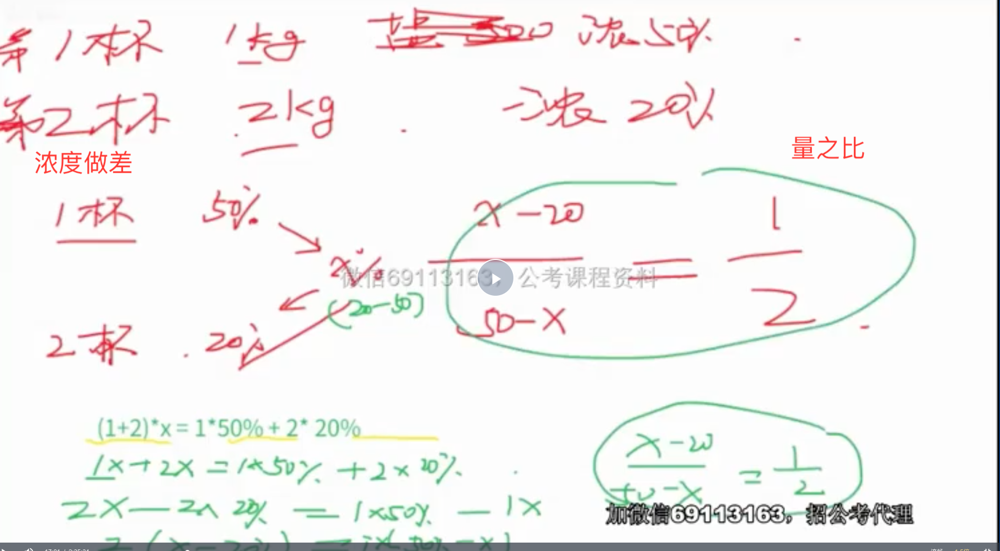
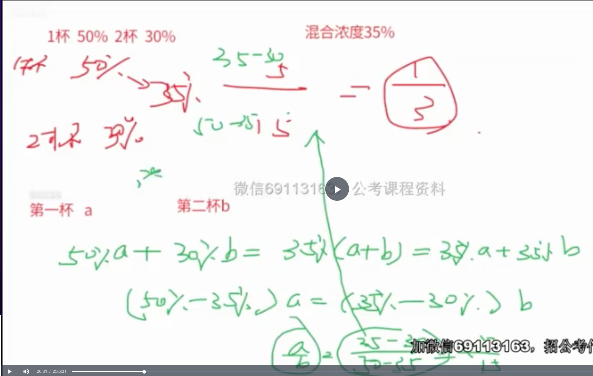

- 例题1
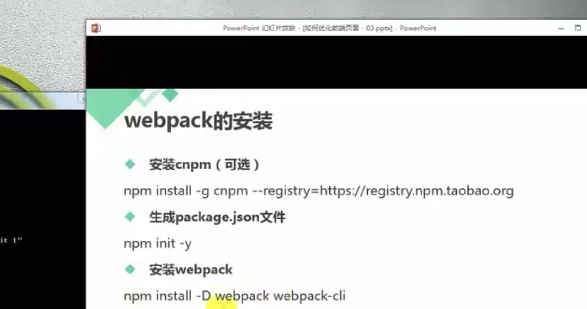
- 注意


```

这种也可以用算法：
1+3% / 1-6% = 103/94 = 1+ 10%

```
- 两种题型
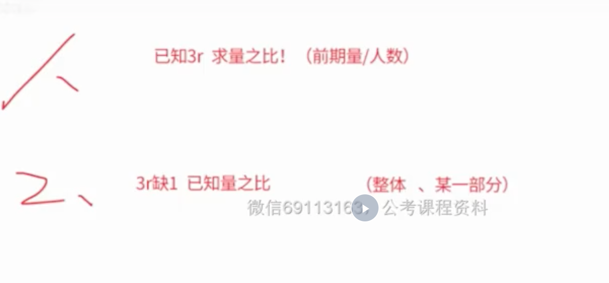
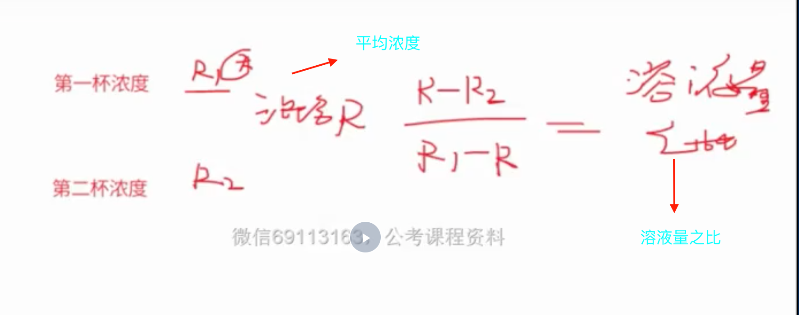

- 运用到所有的 A = B/C(用十字公式，求出的是C之比,C是前期)
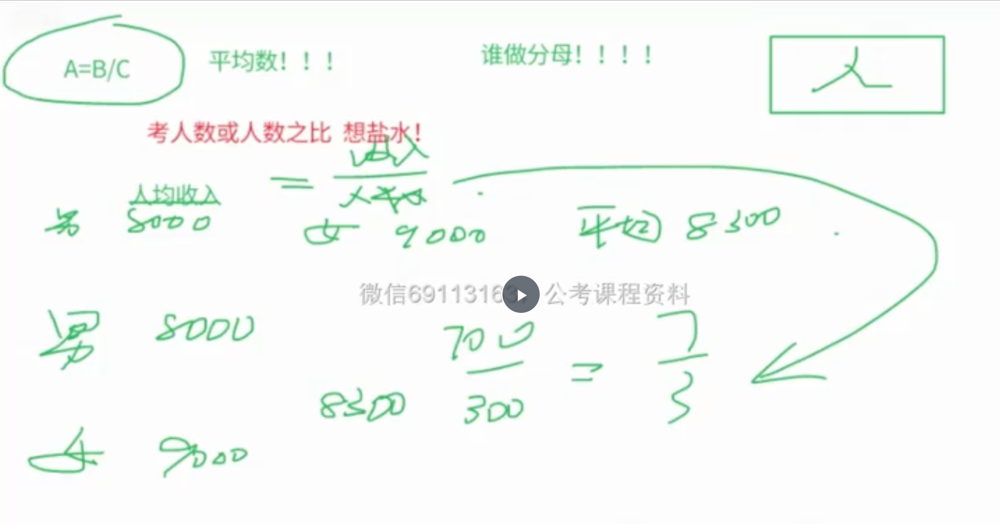
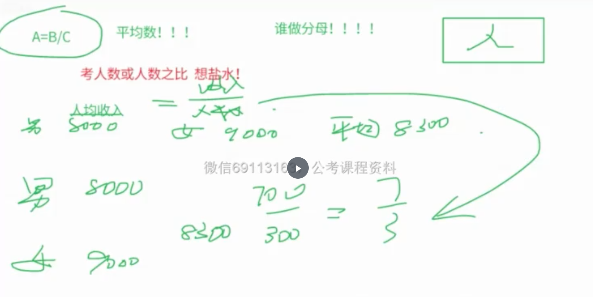

- 例子（考人数，想盐水！！！，靠近浓度大的一方，或者用十字法）
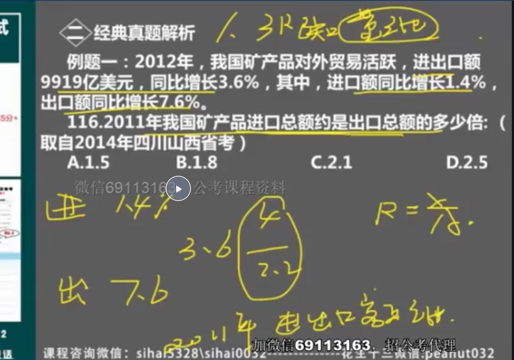
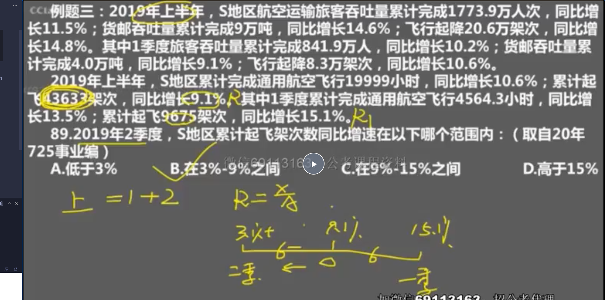
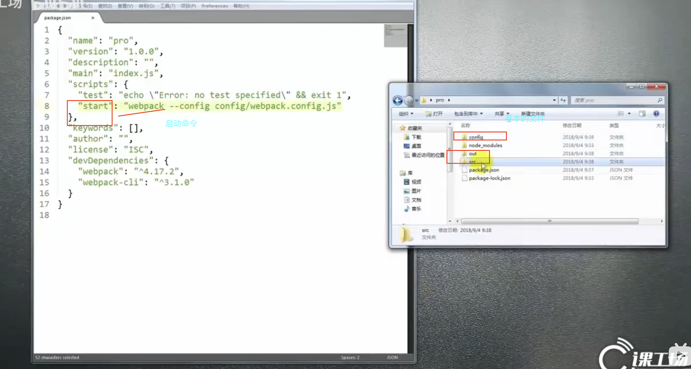
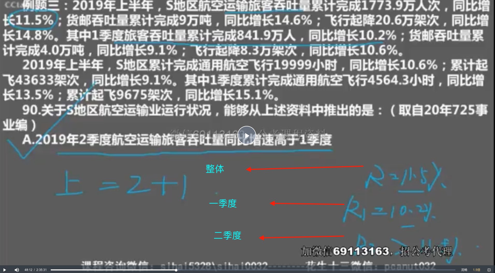
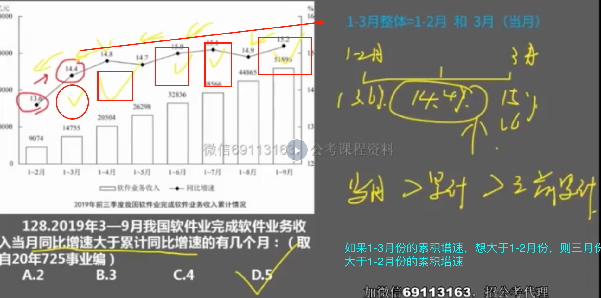
```
3月 > 1-3月 > 1-2月
```
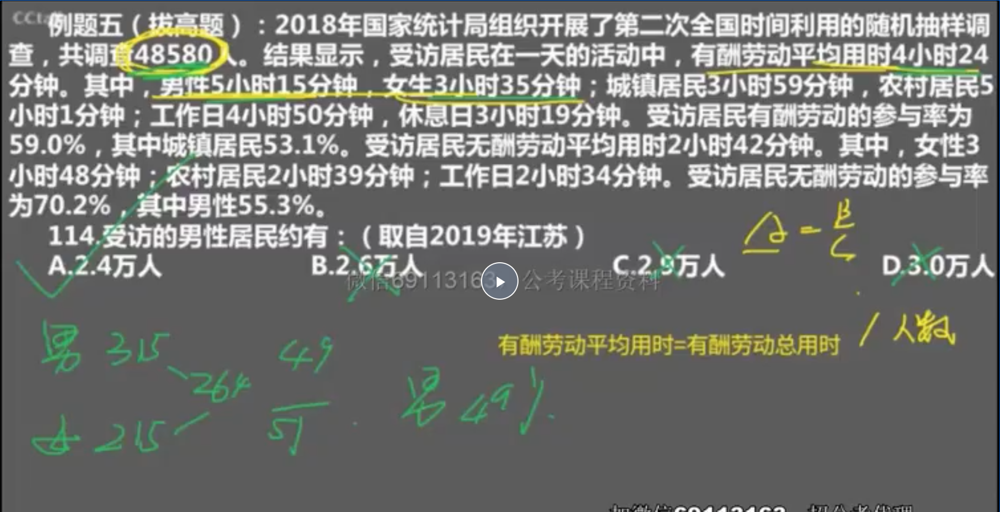


