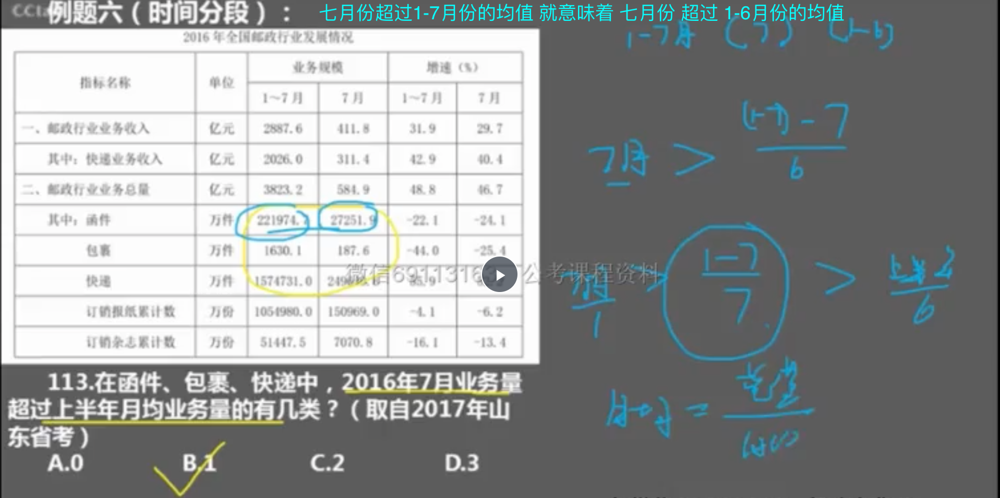
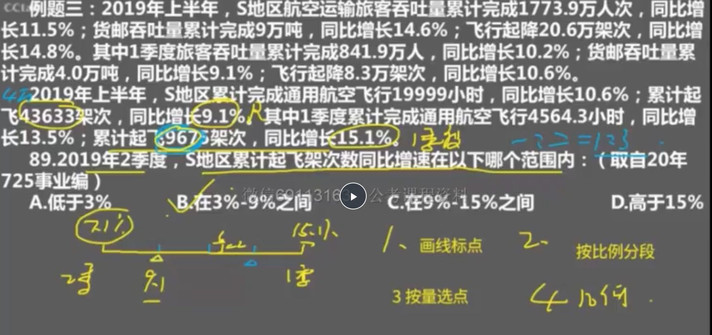
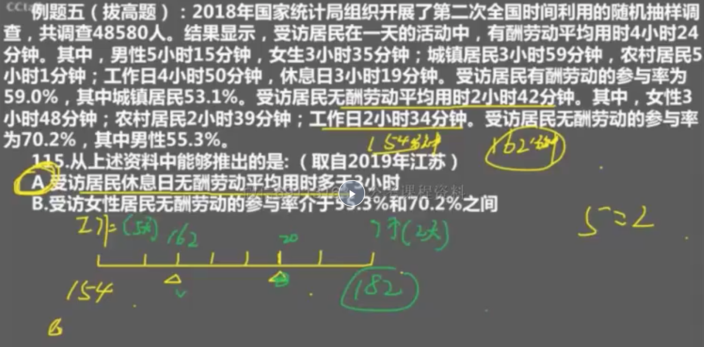
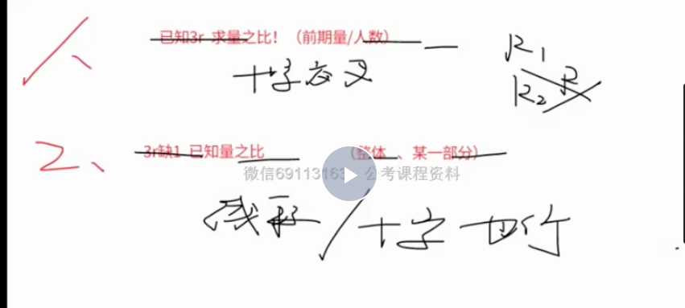

### 盐水类题型

> 知识点-十字交叉（根据溶质相等，列的算式）


- 例题1

- 注意


```

这种也可以用算法：
1+3% / 1-6% = 103/94 = 1+ 10%

```
- 两种题型


- 运用到所有的 A = B/C(用十字公式，求出的是C之比,C是前期量之比)


- 例子（考人数，想盐水！！！，靠近浓度大的一方，或者用十字法）


```
3月 > 1-3月 > 1-2月
```


- 例子


> 画线法（求3r之一用这个，其他用十字交叉法）



```

求得是2季度，给出了1季度和混合季度。第一步画线标点
1. 2季度，1季度是15.1

按数量比例分段，数量累计40000，1季度累计10000，则2季度30000
2. 按比例分段（没有前期用本期）：则设置1季度，2季度可以分成4段
然后判断2季度在哪个点上，则要靠近浓度大的一方。 则靠近左边
3. 按量选点：（有两个点把整体分为1:3，找是哪一个点）选的是混合溶液的点，是9.1%选了点之后，算得一段的百分比，（15.1-9.1）/3 = 2

4. 几何计算：9.1-2 = 7.1

```




```

求得是休息日，给出了工作日和平均无酬劳动。第一步画线标点
工作日，154

按数量比例分段，工作日5天，休息日2天
2. 按比例分段（没有前期用本期）：则设置7段，5:2，画出两个点
然后判断休息日在哪个点上，则要靠近浓度大的一方。 则靠近工作日
3. 按量选点：（有两个点把整体分为5:2，找是哪一个点）选的是混合的点，是162，（混合（平均162）靠近量大（工作日5天量大）的一方，所以最左边的点是162）选了点之后，算得一段的值，（162-154）/2 = 4

4. 几何计算：162 + 5*4 = 182

```



- 做题技巧：求五年内最大的增长率

```
如果看这五年的趋势：分子（增量）下降，分母（前期量）上升，则直接排除16，17，18，算前两年的就行

```

