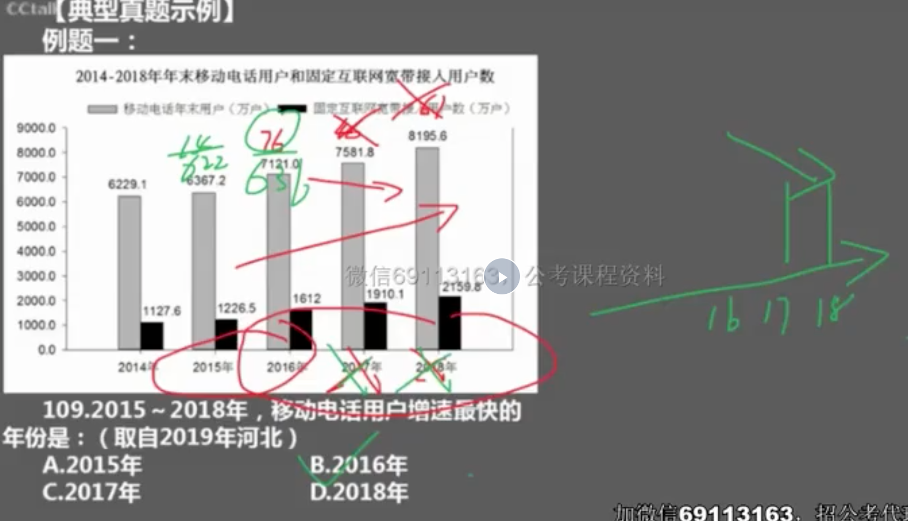
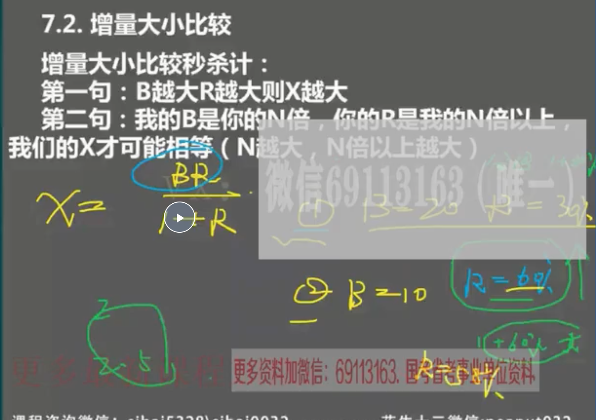
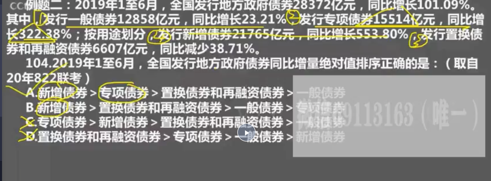
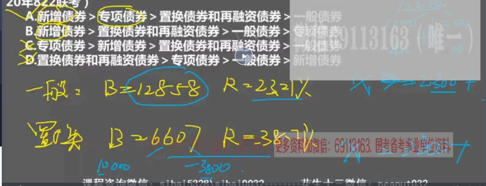
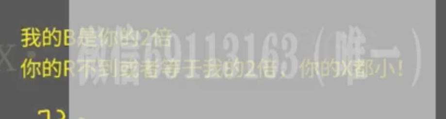

###

> 求增长率大小题型
- 做题技巧：求五年内最大的增长率

```
如果看这五年的趋势：分子（增量）下降，分母（前期量）上升，则直接排除16，17，18，算前两年的就行

```


> 求增量大小比较题型



- 例题（注意，给题目中负责的四个主题词，标明1，2，3，4.这样列式子也1，2，3，4.更快。）



- 如果求增量，一个正增量，一个负增量。则不要凭借肉眼看，可以用假设分配法算。

