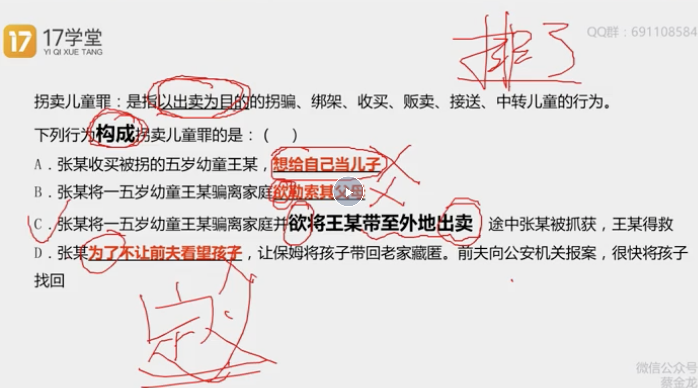
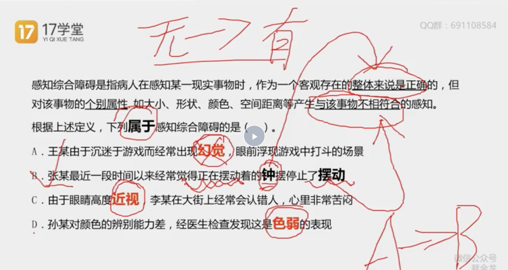
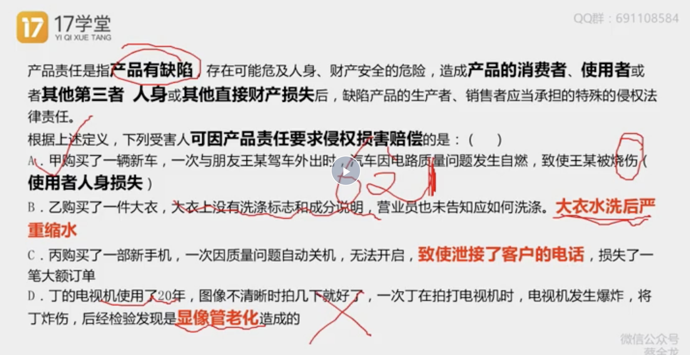
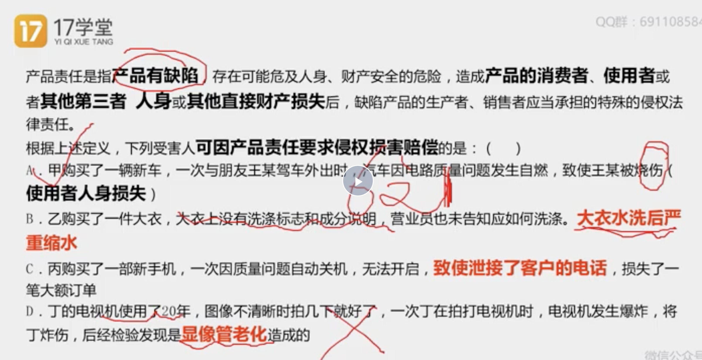
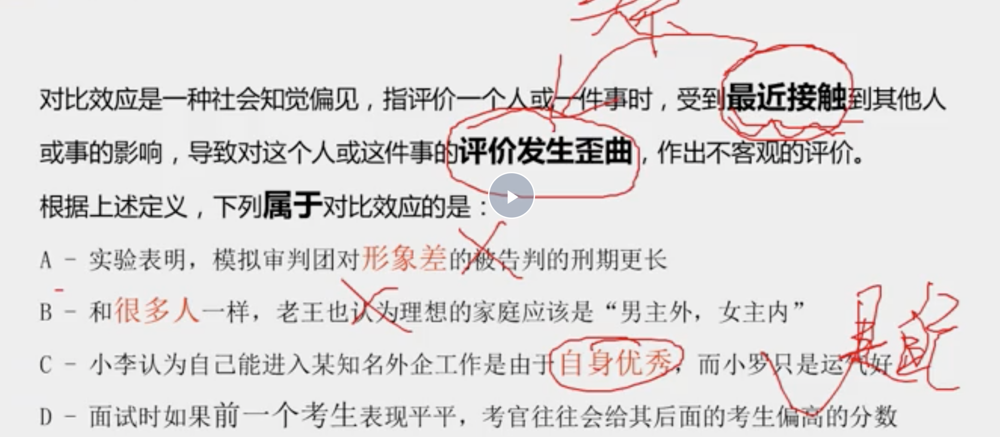
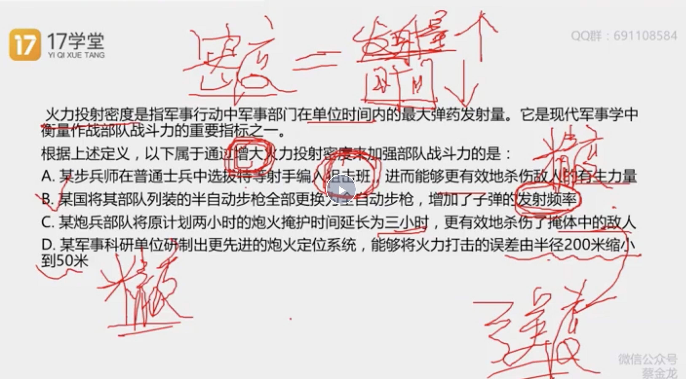
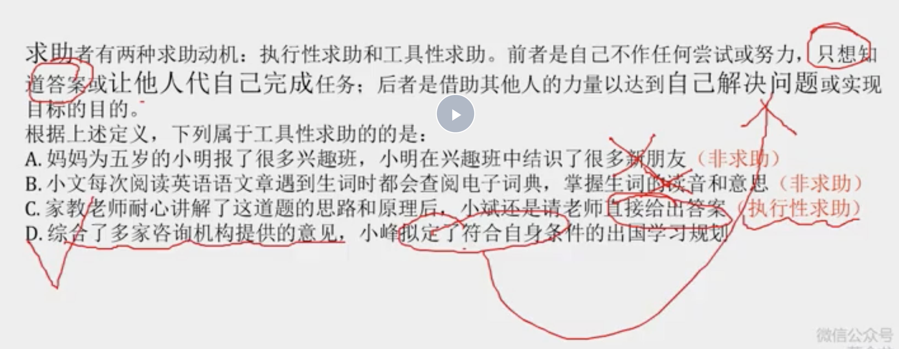
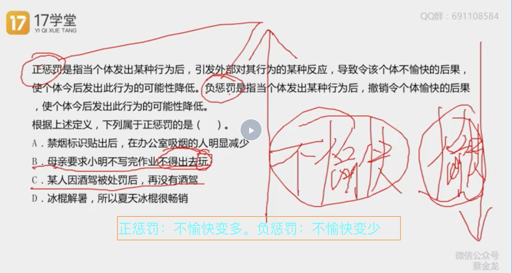

### 技巧

1. 优先做不属于的，属于的要排除三个。不属于的只排除一个。


2. 不匹配比不存在更重要（比如有三个定义ABC，不要去找A，找B，找C在不在。着重找A，B，D.D的话说明不匹配。而如果一个选项只有AB这种，一般情况下是对的。）


#### 单定义

- 名词性关键词

1. 读到一个词赶紧去看下文排除，比如读到名词性关键词（也就是文章主语名词，可能一个可能两个）不用读完

2. 做题思维：快速找到主谓宾，然后又长又臭的状语，用三个字概括。

- 状语型关键词

1. 先刷名词性关键词 对选项对不出来答案 再去看状语性关键词

2. 例子。以。。。为目的的。。。。（以最重要一般 ，后面不用看）



- 效应关系

1. 例子（整体 和整体的一部分的关系 而不是从无到有的关系）


2. 例子（1. 满足六种条件 2. 注意前五种都是和人有关，但是最后一种是其他直接财产损失。 3. B是大衣的直接损失不是其他 C是间接损失不是财产 d不是损失）




- 脉络（双主体之间的关系）


```
C是因为，觉得不是自己就不好，自己才是好的
D。前一个考生，就是最新接触的

找到AB之间的关系

```

- 公式题（注意：1:范围 2.关系）

1. 例子（A错在关系不是人数的排名 BD错在范围不是专业领域，产粮和销售品网店）


2. 例子（A D：是精读 C是强度）




### 多定义

> 共性和不共性

```
需要知道共性和不共性

如果选项不满足共性不选，然后找出多定义的不共性符合的某一方
```
1. 例子1




2. 例子2（AD非惩罚 B负惩罚）



