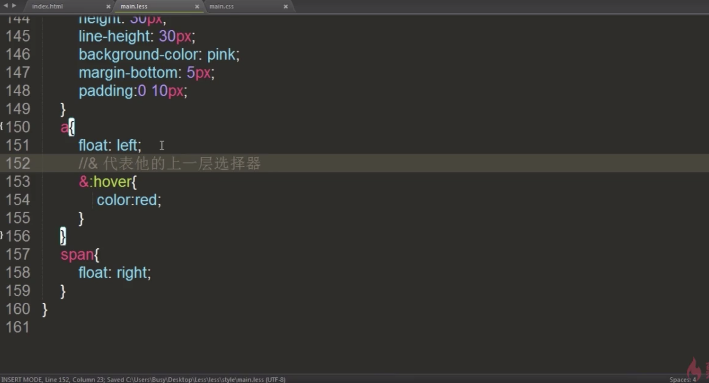
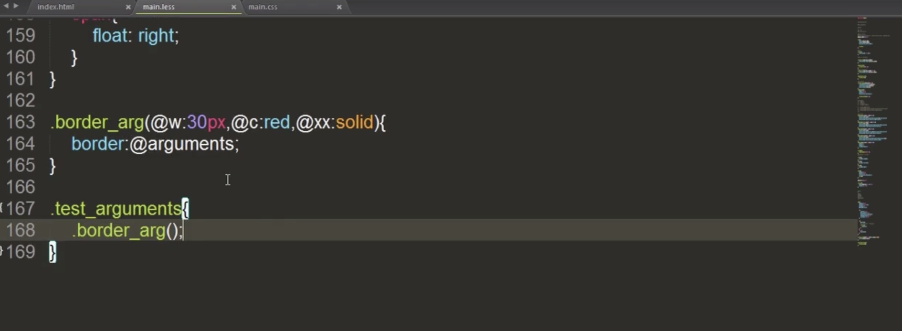

### less中的变量
```
声明用@，例如：@变量名：值

@test_width:300px;
.box{
  width:@test_width
}
```

### 混合
把以前用过的样式(.box)直接拿过来用
```
.box2{
  .box
  margin-left:200px;
}
```
混合可以带参数
```
.border{
  border:solid 5px pink
}

.border_02(@border_width){
  border:solid @boeder_width pink;
}

.test_hunhe{
  .border_02(30px)
}
```

### 匹配模式
- 定位

### 嵌套规则


### @arguments变量

```
@arguments代替所有的参数

.test_arguments{
  border:30px solid #ff0000
}
```

### 避免编译和@important
