## [b站学习ue3+TS+element-plus实战后台管理系统](https://www.bilibili.com/video/BV1PZ4y1G7bu?spm_id_from=333.337.search-card.all.click)

### 搭建

<!--  -->

```
1. vue create vue3-demo

2. 手动选择规则

3. 3.x

4.  不选择保存模板，其他随便

5.可以npm run serve


```

### vue3中404页面需要正则的写法


### npm install element-plus --save

- 引入组件和样式文件

### vue3定义变量 ref以及reactive


### vue3获取this:getCurrentInstance ctx


- ts报错 则在上一行加上 //@ts-ignore

### 触发登录方法 箭头函数


### 将数据与页面分隔开来 loginValidators.ts文件


### ts页面中 运用泛型 Interface


### vue页面 加上lang = ts(需要对参数，加上<类型>声明)


### 之前登录和注册写在一个页面之中，现在将注册的form表单提出，放在新建的loginForm.vue中。父元素向子元素传参，跟以前是一样的写法,子元素定义prop.


- 同样方法也要从父元素，移到子元素里面

### elemet-plus提供了再次输入密码不正确的校验
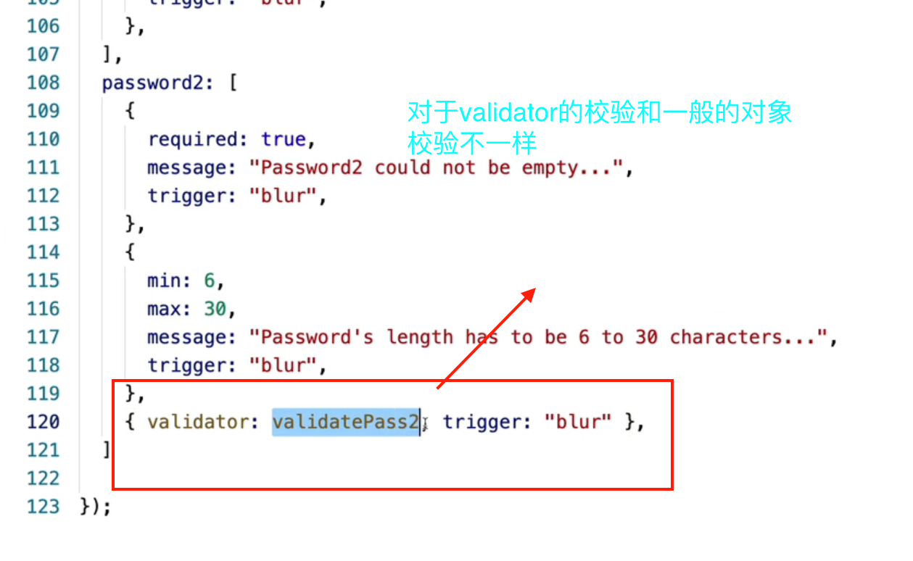
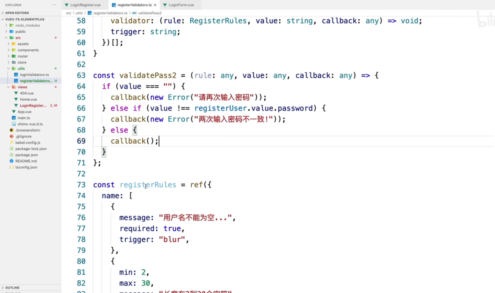

图片可能有些地方不太准
### npm install axios -- save

```
1. 文件中引用,import axios

2. main.ts 挂载在全局

```

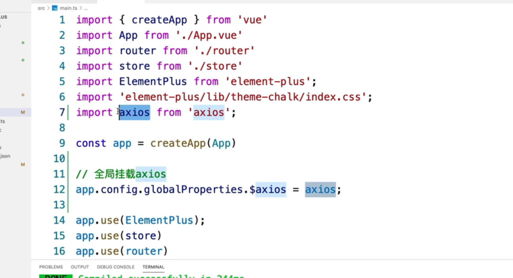
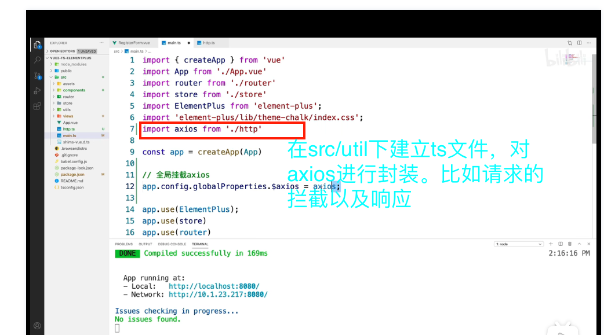
### axios 封装

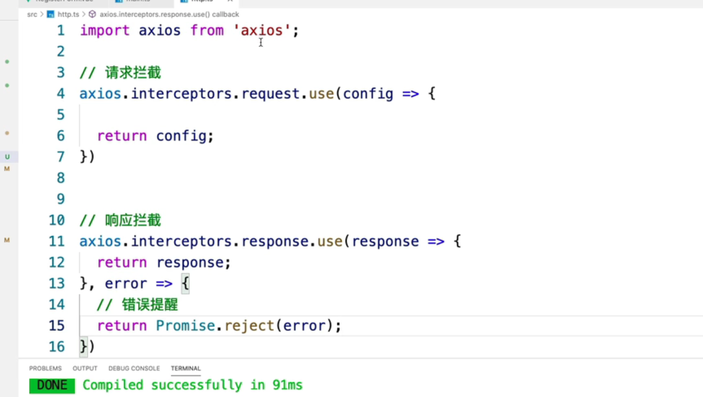
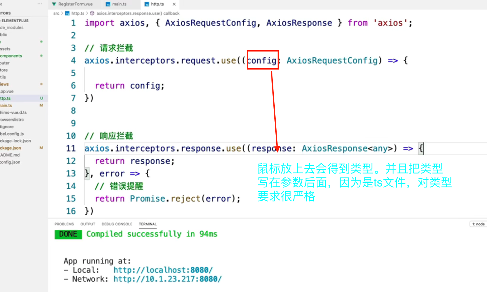
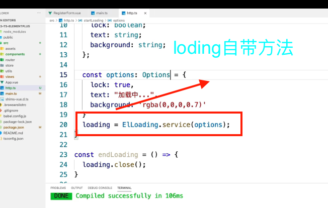
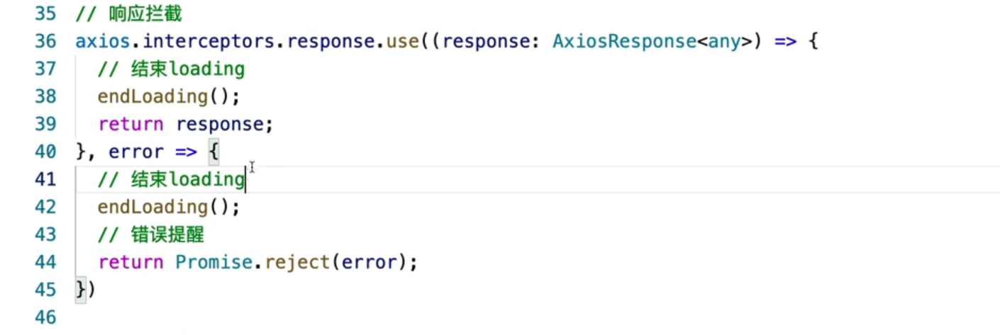
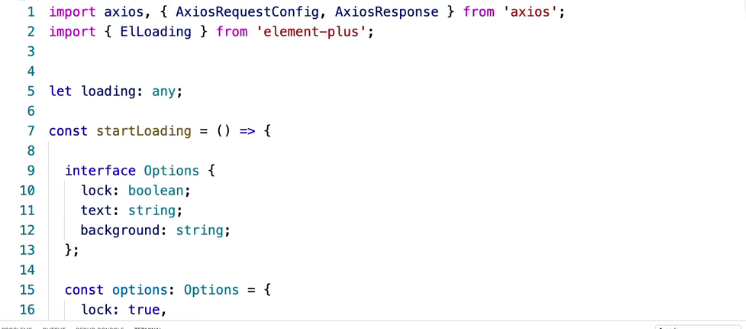

```
1. 请求中，可以加 Loading,token

2. axios的状态包括 pending , reject , resolve


```
### postman

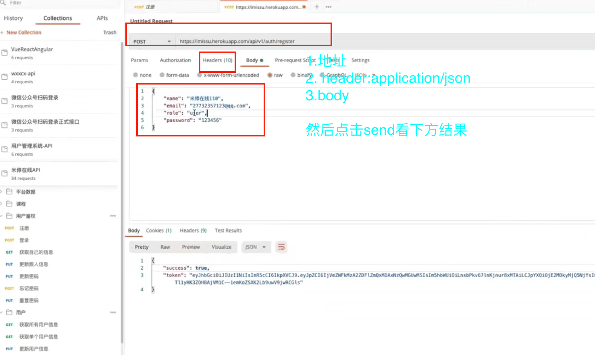
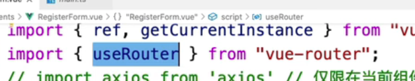
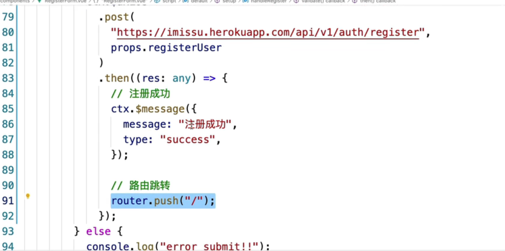
### 跨域配置

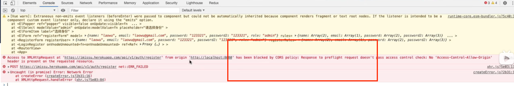
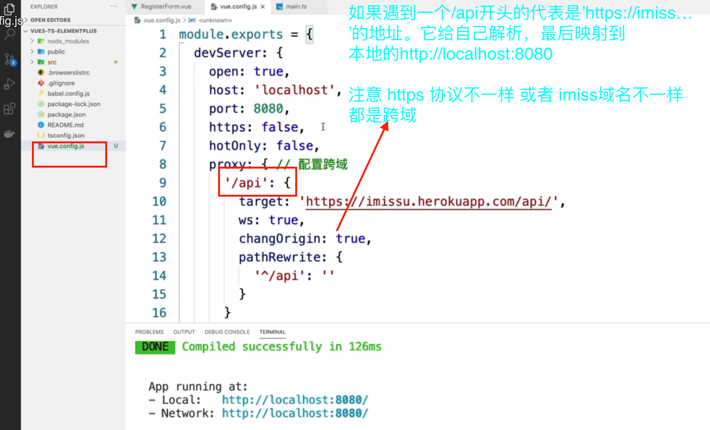

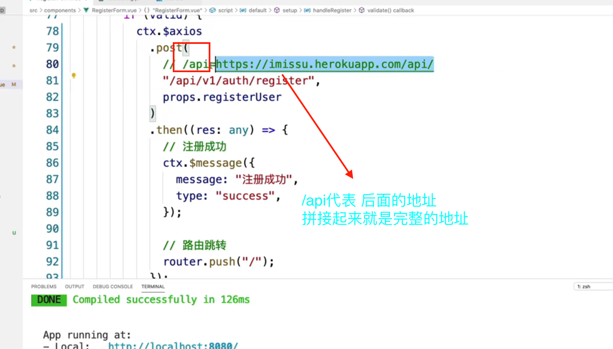


### 常用解构

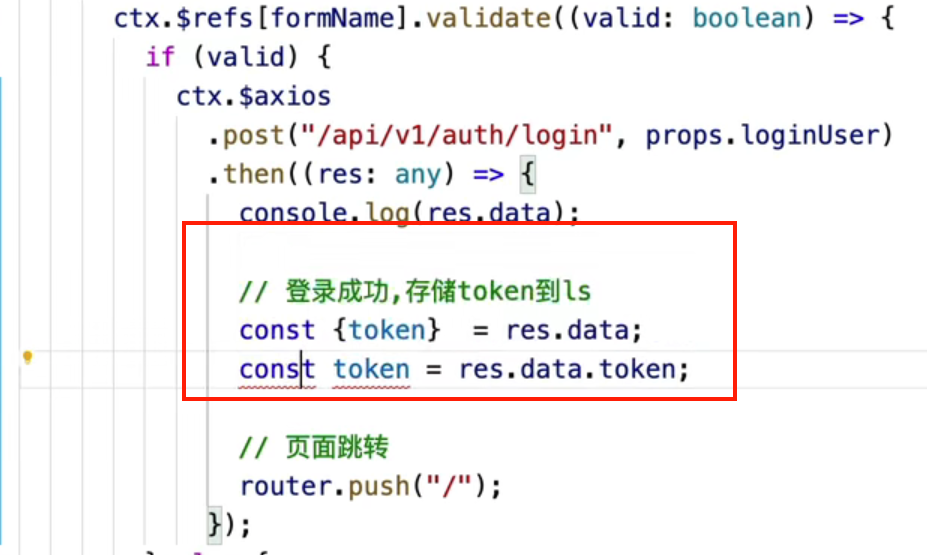

### 跳转外部链接到项目,通过后台，由后台提供token.也可以过几秒跳转首页。

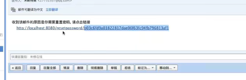
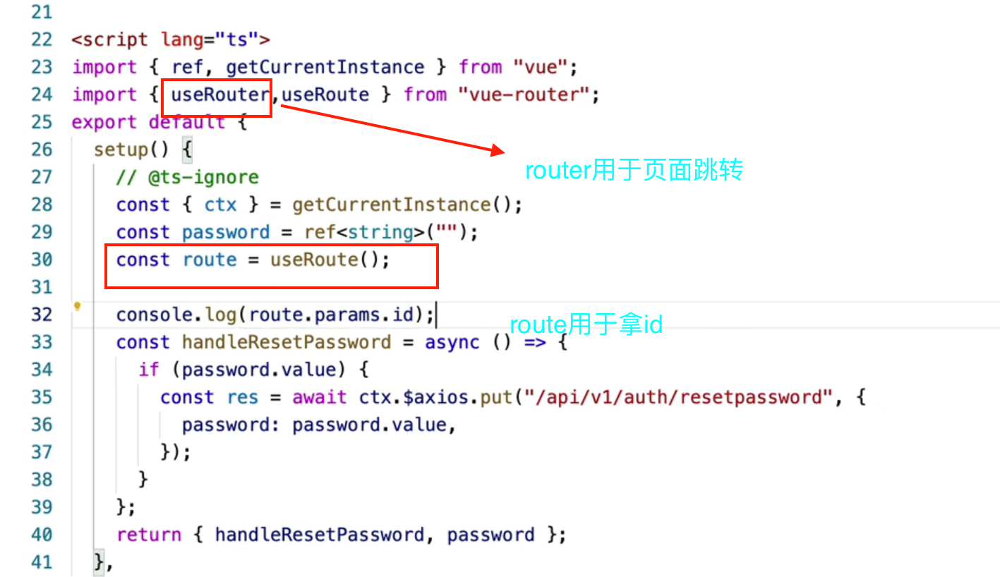
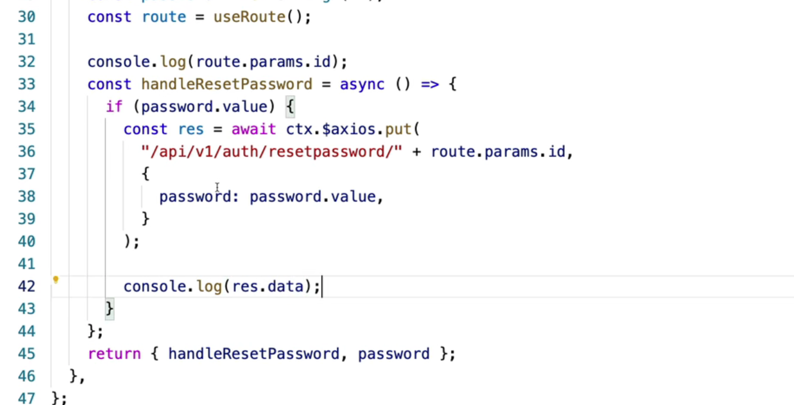
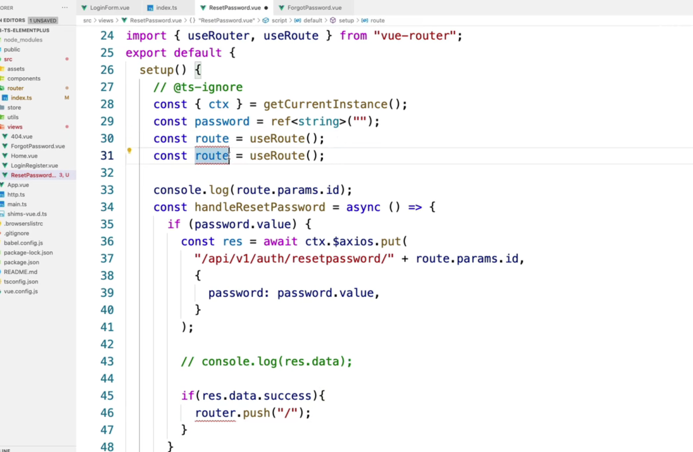
### 


### 


### 


### 

