### state三种引入方式
```
1. $store.state.aaa

2. computed:{
  ...mapState([aaa])
}
import mapstate from vuex
```

### mutation

```
1. 触发 this.$store.commit("add")
2. 触发 调方法式触发

import (mapMutations) from 'vuex'

methods:{
  ...mapMutations(['add','del'])
}
3.mutation不能写异步操作
```

### mutation 参数

```
1. 触发 this.$store.commit("add",3)
```
```
mutation:{
  add(state, params){
    state.num = state.num+params
  }
}
```
### action异步操作，action通过mutation方式变更数据

```

this.$store.dispatch('asyncadd',params)
```

```
import {mapActions} from vuex
...mapAction(['ayncadd'])
```
### getter
```
1.this.$store.getter.getadd

2.import {mapGetters} from 'vuex'
computer:{
  ...mapGetters(['getadd'])
}
3.getter相当与计算属性的作用
```

### vuex todo
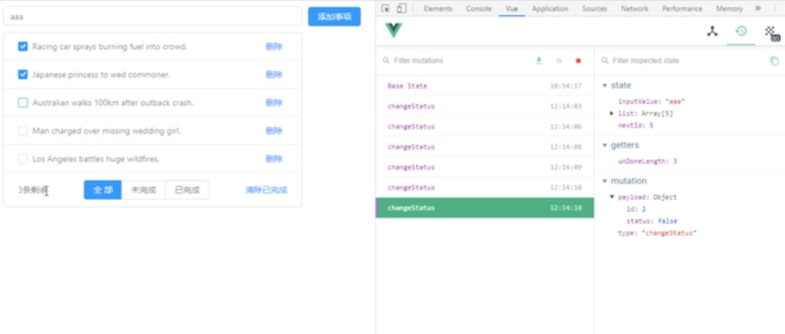
1. 将数据与vuex绑定
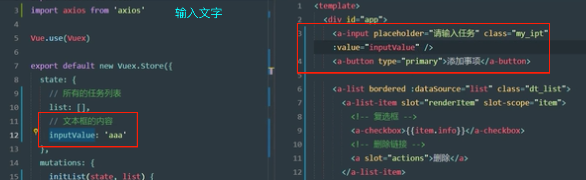


3. 实现文本框内容的双向同步
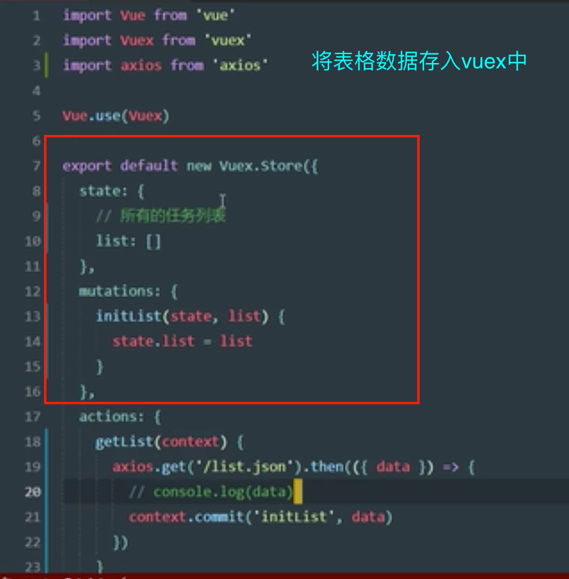
state添加inputValue,组件绑定:value = inputValue ,添加change事件触发mutation,实现文本框内容的双向同步

4. 向列表添加一项
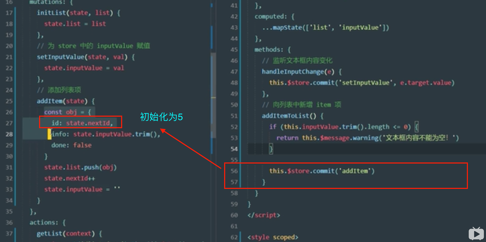
```
1.添加的数据不能为空
2.添加一项时候，自动赋给其状态,done:false为默认状态，没有勾选
```


5. 删除某一项,根据id.mutation来删除数组的某一项
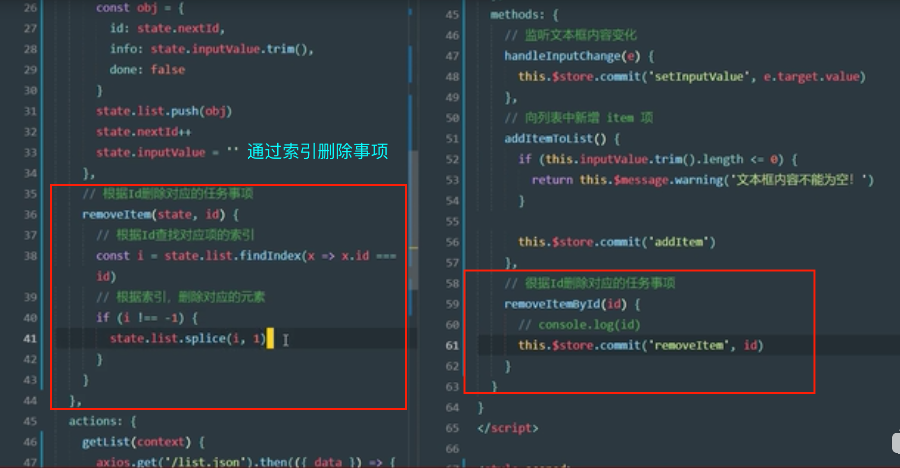

6. 复选框的状态绑定数组的状态
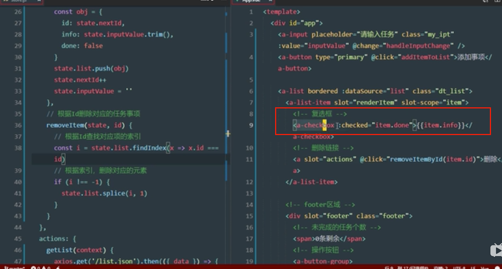

7. 点击复选框获取状态以及id
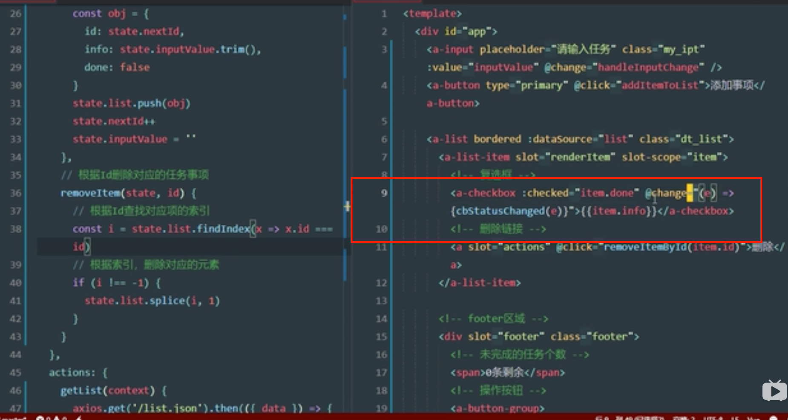
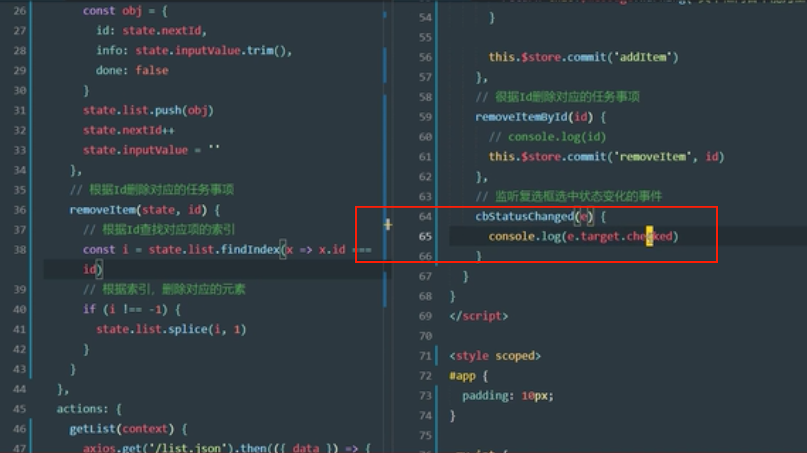
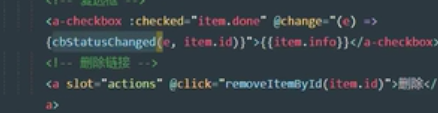

8. 修改列表项的选中状态，赋予复选框新的选中状态
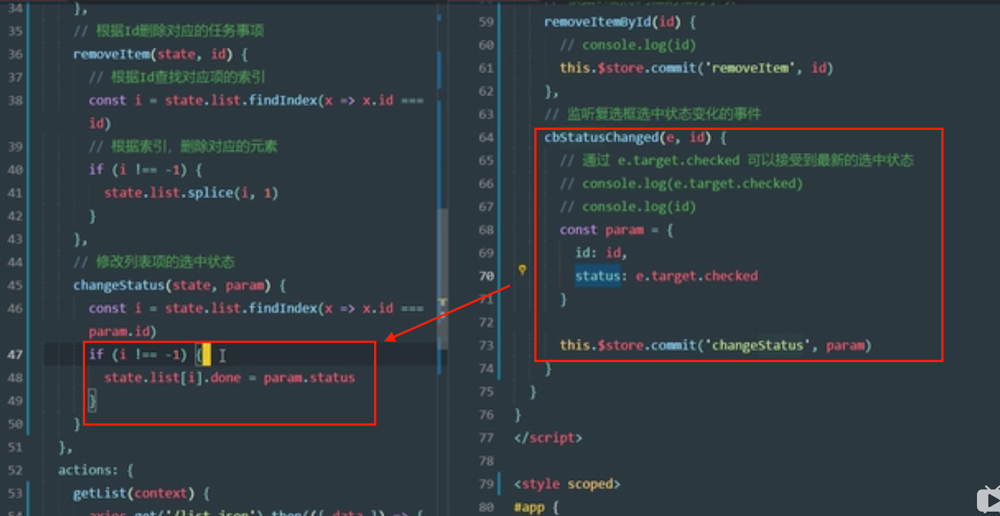

9. 统计未完成的状态，getters
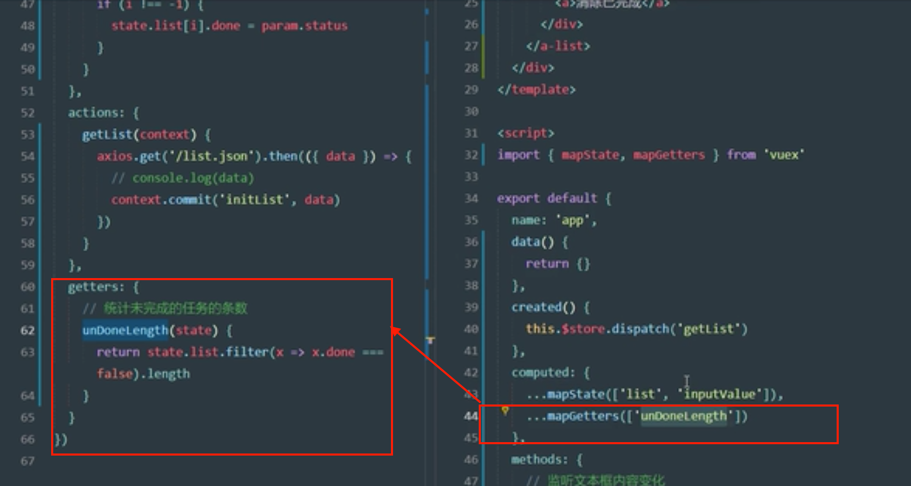

10. 清除已完成的
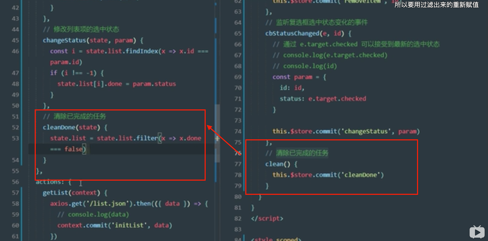

11. 全部，未完成，已完成
点击不同的按钮，修改vuex对应的viewkey值
type = primary，按钮高亮
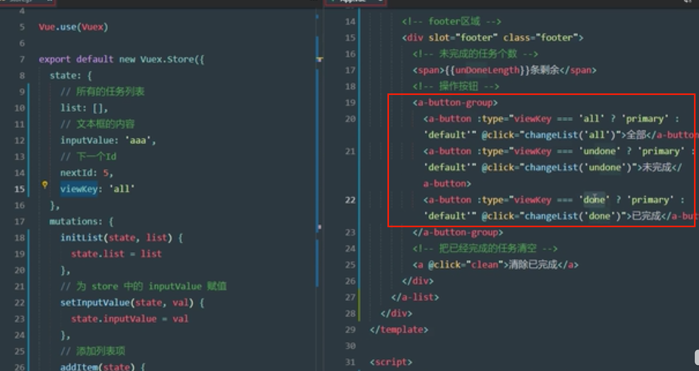
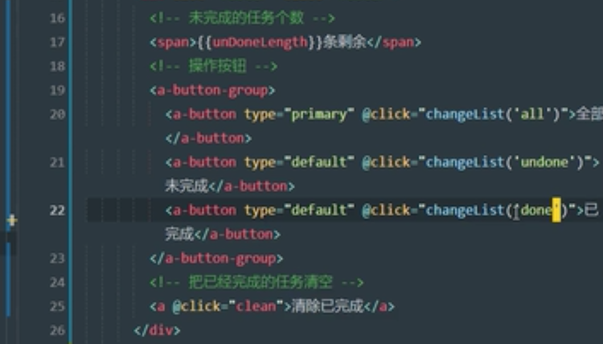
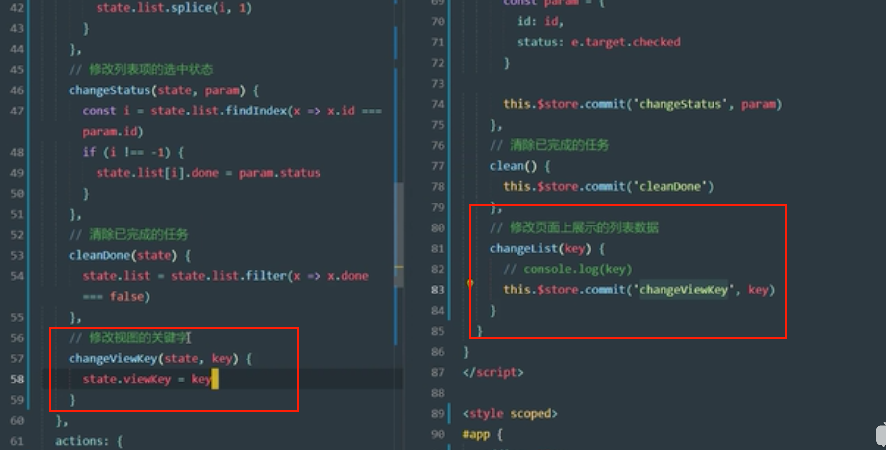

12. geteers修改数据源
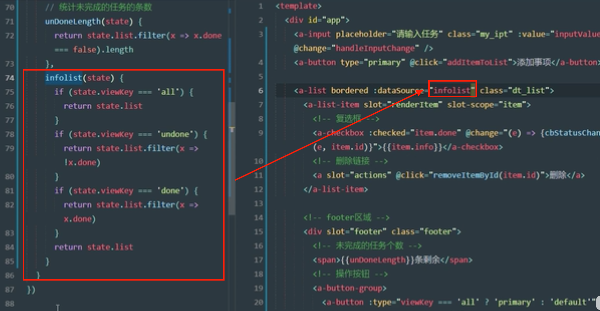
