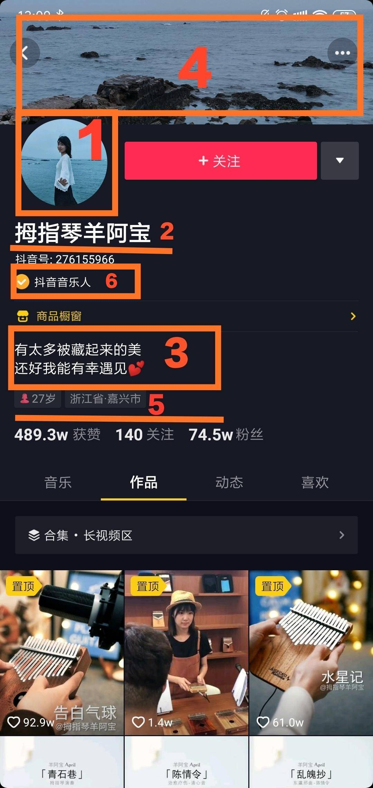
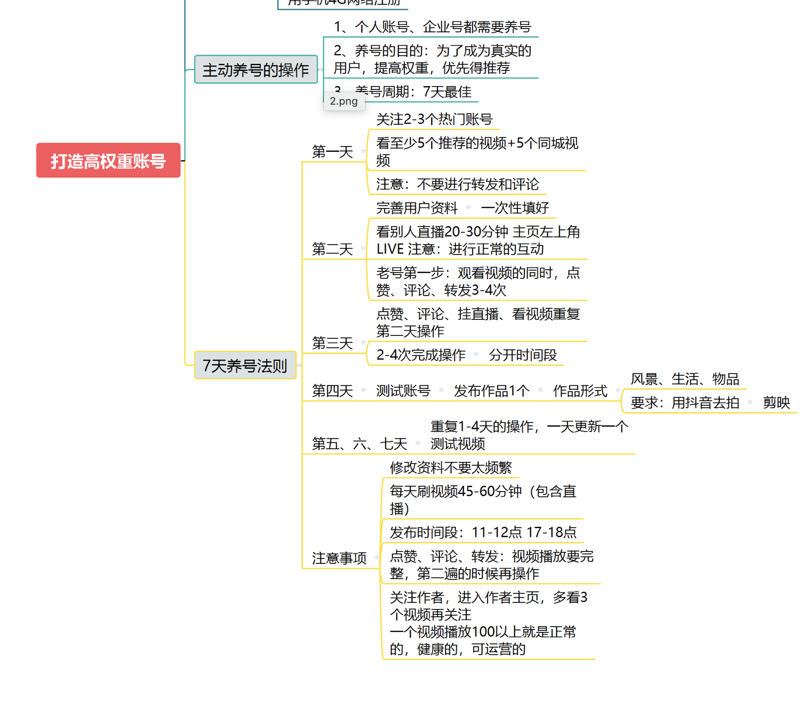

### 秘籍第一步：找同行！

1. 找同行方法1、直接搜索
2. 根据话题找
3. 点击“关注”之后，底下就会给你推荐同样是美食类的账号，你也可以点进去看看他们的视频，关注一下粉丝量高、具有参考性的账号
4. 飞瓜小程序,打开之后点下方“排行榜”,点开这个“排行榜”之后就会看到很多行业。比如你是做母婴领域的，点“母婴”，会出来很多账号，你记住这些账号名称，去抖音搜索并关注

### 秘籍第二步：模仿
1. 而模仿呢，是说咱们去看同行火的视频，用他们的素材内容，拆分他们视频中的关键元素，咱们自己拍，拍成咱们自己的视频
2. 所以，咱们作为零基础新手，刚开始阶段根本不需要创意，最快的起步方式就是找到同行之后，再找到他的爆款视频，直接用他的素材，模仿拍摄
3. 模仿时注意事项,不要今天发个做饭的，明天发个跳舞的，后天再发个逛街买衣服的,
4. 站在粉丝的角度拍视频,你的视频要让观众有舒服、好看、有趣、有用、新奇等正面的心理感受，观众才更愿意关注你,大家普遍都是更喜欢美好、有趣、有意思的事情，让粉丝开心或者是感到有用，他们才会更容易关注你
5. 视频制作要求,咱们刚开始拍视频的时候，视频尽量满屏，就是像下面这种的竖屏满屏，这样观感更舒服一些
6. 另外，拍摄视频的时候要尽量清晰，画面不要抖动，不然像下面这种模糊的视频就很难引起别人看的欲望了
7. 模仿这种火的视频拍出来，播放、点赞、互动多，抖音就会判断你的视频比较优质，从而给你更多的推荐，你的播放量会更多，这样你前期积累粉丝也会更快

### 秘籍第三步：超越
1. 怎么超越呢？这个就涉及到咱们前面说的“拆解同行视频中的关键元素”了。哪些关键元素、怎么拆解、拆解后怎么优化、怎么转换成咱们自己的风格，等等这些具体的方法我们后面课程都会一一指导大家
2. 要做一个吸引人的视频呢，首先素材要好，其次拍摄和剪辑风格要吸引人，然后你的标题、封面、配的音乐搭配的好

### 秘籍第四步：怎么能让的你账号更有吸引力、快速涨粉？
1. 账号形象越专业越好！什么是账号形象？就是我们的账号资料。账号资料填写的越好，别人越信任我们，就越愿意关注我们

  
  ```
    棒呆是只猫

    治愈系憨憨
  ```
### 独家秘籍让你的视频更火爆
1. 这三种方式注册的账号权重从大到小的排序依次为：手机号>头条号>微博号。
2. 养号

3. 抖音会申请访问我们的通讯录，也就是电话本，咱们直接点同意就好
4. 如果播放量有一两百到一千多，那就说明你这个号是正常号。暂时看上去是没有什么问题的。不然就继续养号
5. 视频质量提升上去之后，每天发视频至少一条，最多不超过三条，最好要稳定有规律。
6. 咱们一定要在看完这个视频之后再去进行给视频点赞、评论和转发这些操作。
7. 我们关注作者也是要在看完他的视频、点完赞之后，再去打开他的主页，再看他两三个视频以后再点关注。
8. 还是一个常见的误区：养号就是这7天，养完就不用管了。持续养号
9. 很久前注册的，发过一些视频的，基础播放量高于100的。那你的账号可以正常使用。你可以在确定账号定位之后先将之前发的视频分时间段隐藏，之后再分批次、分时间删除。
10. 开通抖音商品橱窗。你的抖音号需要进行实名认证，然后满足：个人主页公开并审核通过的视频数>=10条、账号粉丝量>=1000这两个要求，就可以申请开通橱窗了。 必须是在抖音精选联盟里面有的产品，我们才能卖。没有的话我们就卖不了了。
11. 抖音商品橱窗的功能按等级可以分为3级。这3级分别是一级橱窗——商品分享；二级橱窗——视频电商和三级橱窗——直播电商。

### 文案
1. 我卖的玩具主要面向群体是宝爸宝妈，为了增加亲切感，我在标题文案里加入了儿子、女儿这些字
2. 如果你有能力就拍段子类的，例如下面这个。这个视频也是模仿别人热门视频的，都有一百多万的赞了
3. 还有一种比较简单的，就是直接演示玩具，把玩具的特点、好玩之处或者它的功能展示出来，让人看着就想买

### 模仿
1. 但是模仿不是照抄着拍，你首先要分析这个视频为什么火、是哪些原因火的，在模仿的同时要加入自己的特色
2. 你要知道拆解哪些元素，比如这个视频的角色、场景、剧情、音乐，还有拍摄手法、剪辑手段等等，要知道拆解之后怎么优化，不然也只是劣质的模仿
3. 我总共做了一二十个号，有几个号跑出了比较好的成绩。但是这几个号可以互相带动，挣的钱比我只做1个号多太多了，这就是1+1＞2的效果
4. 当然，如果你有优势条件，比如有货源、爱好、特长或者工作、生活丰富、有场地等，那还可以结合这些优势条件做vlog和直播，变现能力更强
5. 视频选题和素材：当时抖音上文具类视频火的比较多，所以我们就发了一条文具的视频。视频素材也是来源于我们一直的积累，这样也让视频的内容质量更高
6. 视频封面制作：蹭流量，因为蔡徐坤全网粉丝有几千万，女性、学生粉很多。所以这个视频封面我们就用了他的照片，粉丝们很买账
7. 玩抖音追热点、蹭热度是一个很好的技巧，当然蹭热度也不是乱蹭，也是有方法的，比如你不能卖化妆品的去蹭篮球明星的热度，因为粉丝根本不是同一个群体，这些我们会详细的指导你，告诉你哪些热点可以结合你的产品去做
### 具体文案
1. 标题，要直观、简单明了、迅速抓住观众的眼球。这样吸引他们的好奇心，让他们认真看视频，比如“大学生宿舍必备5大神器”、“吃不胖的8种零食”，等等
2. 这4个好做的项目就是：书单号、音乐号、穿搭号和好物种草号，都是属于简单易做、又能赚到钱的好项目。
3. 现在做书单号，最好是真人出镜的，其次是动画、影视情节的。我们可以录制电视剧和电影片段，用软件给视频加文字标题、加背景图进行二次编辑。

4. 第二个项目：音乐号。音乐号也很适合不想在抖音露脸的同学。做法就是搬运一些比较好听的音乐发到抖音上。抖音本身很强的音乐属性的。抖音的抖，就是它的背景音乐。

5. 看同行做的好的主播，学习她们的行为、话语，视觉：灯光怎么打的，镜头怎么摆的，别人是站在哪里的等等，动作：主播平常直播是怎么安排的，刚开始的时候有什么讲究，节奏控制上有什么值得借鉴，需要准备哪些东西（做服装的可能需要一些号码牌、搭配的饰品配件，做美妆的可能需要一面镜子）等等，台词：欢迎词、求关注词、自我介绍词、卖货的词、活动词等，玩法：直播间促销有哪些玩法、互动抽奖有哪些玩法、引导关注可以做哪些活动、引导粉丝回访可以设置哪些活动等，

要把产品的信息传递给观众，因为我直播就是为了卖货，所以要让观众了解这款产品的尺码、材质、性能、市场潮流和趋势这些信息，这个的前提就是我要先弄清楚产品的特点，这样才能短时间里给观众展示这个衣服的尺码、特点，因为是卖衣服，所以在这个过程中，可以直接穿上身展示，增强说服力，
6. 


