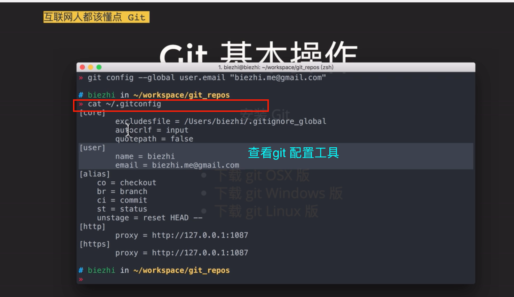
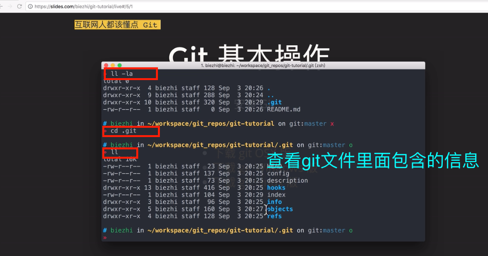
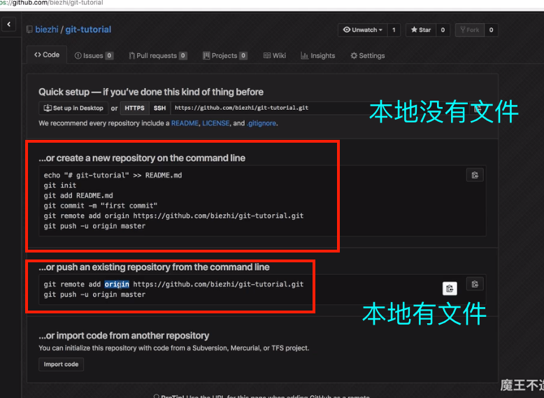
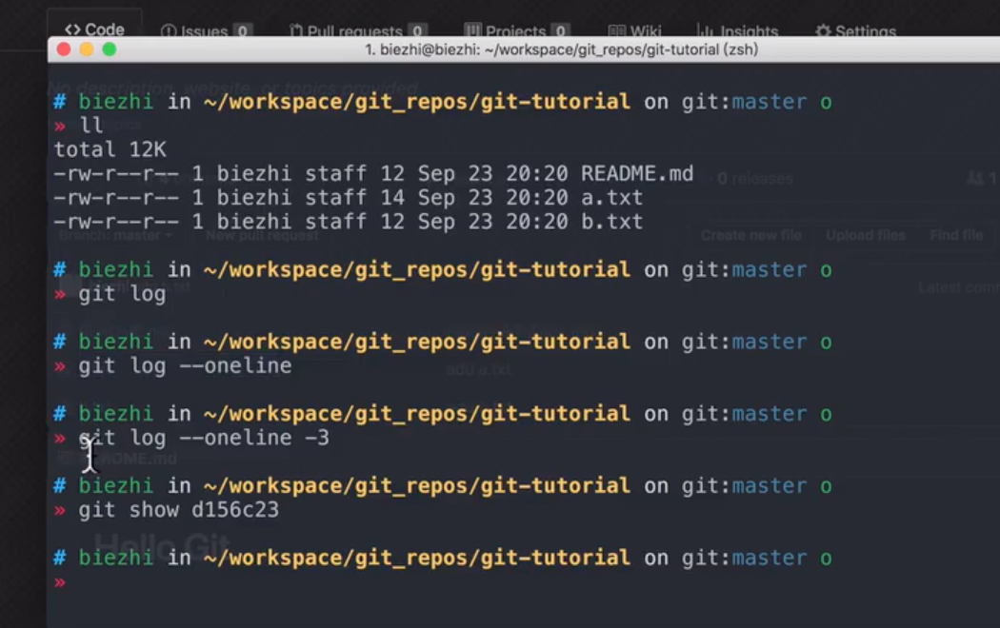
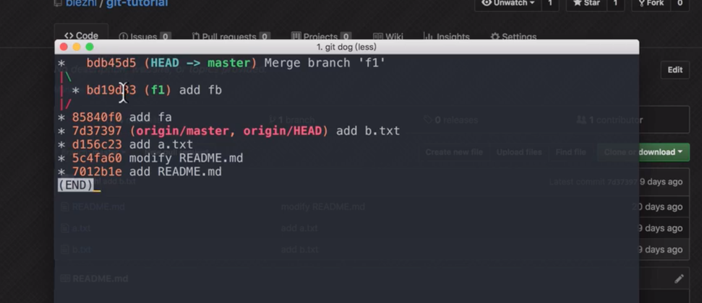

### 01介绍

- 一些git命令



- 创建文件

```
mkdir book

```
- 创建文本

```
touch README.md
```
- 将暂存的文件变成未暂存（add的文件变成未add）
```
 git rm -- cached README.md

```
- 暂存所有
```
git add -A

```
- 查看git配置信息



```
cat index // 查看Index里面的文件

cls //回到上一步

```
### 02仓库

- gitb仓库匹配已有代码或者空代码项目


- 修改文件

```
vim READMW.md
```

### 03分支

```
git branch lyj-feature

git checkout -b  lyj-feature2
// 创建并停留在这个分支上

git branch -d lyj-feature
// 删除分支

git branch -D feature3
// 强制删除
// 就算分支feature3有代码没合并


```

- 如果远端没有分支，本地有，则需要提交

```
git checkout feature1
git push origin feature1
```

- 本地删除远程分支

```
git push origin :feature1
```

- 创建本地叫feature1的分支。远程叫f1的分支

```
 git push origin feature1:f1
```

### 合并

- 查看记录

- 起别名

- merge --no--ff 可以merge的同时产生一个新的commit



- rebase不要在公共分支上合并，因为没有提交记录

### 撤销变更

- git reset
- git reflog
查看历史版本
- ll
查看文件
- git revert
```
git revert 撤销某次操作

此次操作之前和之后的commit 和 history都会保留，并且把这次撤销作为一次最新的提交

```

- git reset用于本地分支，而git revert用于主分支

因为reset指针指到之前的，丢失了之后的。但是revert是提交了一次新的提交。