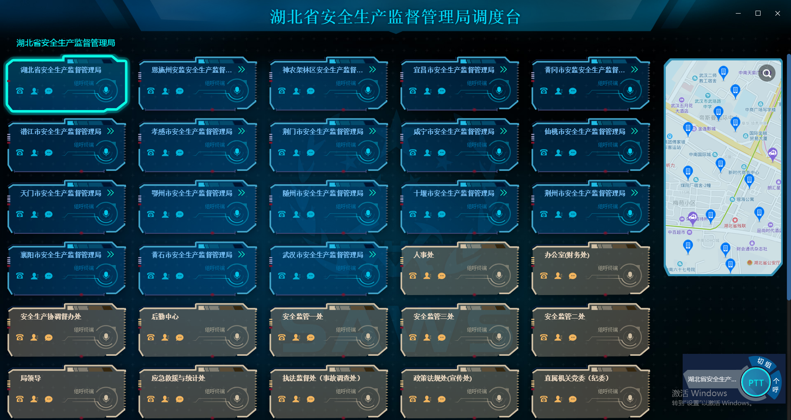
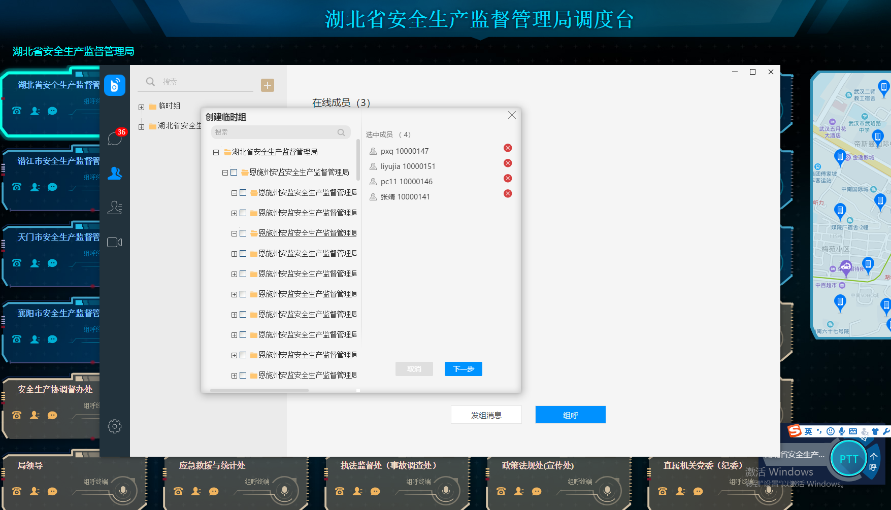
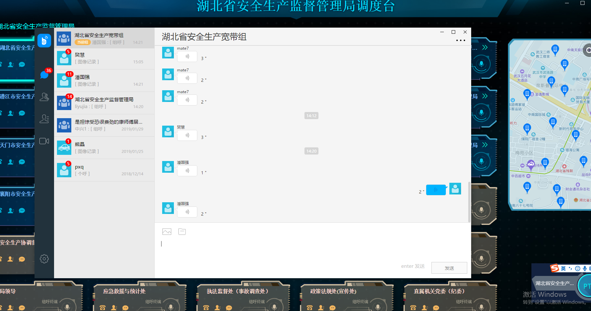

## 融合通讯

我在XX公司做了武汉市公安局融合通讯系统。  
融合通讯是一款负责移动警务应用的客户端产品，本人主要负责pc端人员邀请、调度台展示、警情通知、图像上传。后端使用springBoot开发,前端采用vue进行组件开发，组件库采用混合型开发，使用webpack进行前端工程的打包，实现前后端的分离和模块化管理。独立完成了模块前端页面的开发。历时了4个月，两个前端，三个后台。

//我在XX软件公司做了XX门户网站项目，这个项目做到了XX功能，具体是XX和XX模块，各模块做了XX功能，客户是XX，最后这个项目挣了XX钱:直接打断，因为业务需求不需要了解

- 要主动说出你做了哪些事情，这部分的描述一定需要和你的技术背景一致



```
调度台展示,是湖北省各部门下市级的部门的展示，以及管理各部门的一个界面。比如湖北省安全生产监督管理局下面对应了恩施、潜江之类的。并且各市局有直接电话，或者弹出查询通讯录，以及查询消息的界面的功能.也可以点击展示第二层数据只显示市局下对应的机关或者科室之类的。用了父子组件封装的技术，封装了样式、是否显示某些功能、是否可以点击之类。
```

[项目组件总结01](http://note.youdao.com/noteshare?id=87843e077737b9f26ecc8ce109898674)
[项目组件总结02](http://note.youdao.com/noteshare?id=613021174d9b1653405a30295d7587da)



```
分为两部分，左边是tree和搜索框。tree可以全选和单选。搜索框有染色功能。并且隐藏tree显示搜索出来的数据。右边是选中列表、可以取消成员并联动tree数据上的成员。

```
[项目选择成员总结](http://note.youdao.com/noteshare?id=89a3d7588966d922f00e52d4027f1e80)





<!-- - 描述你在项目里的角色
我主要是做了开发，但在开发前，我在项目经理的带领下参与了业务调研 -->