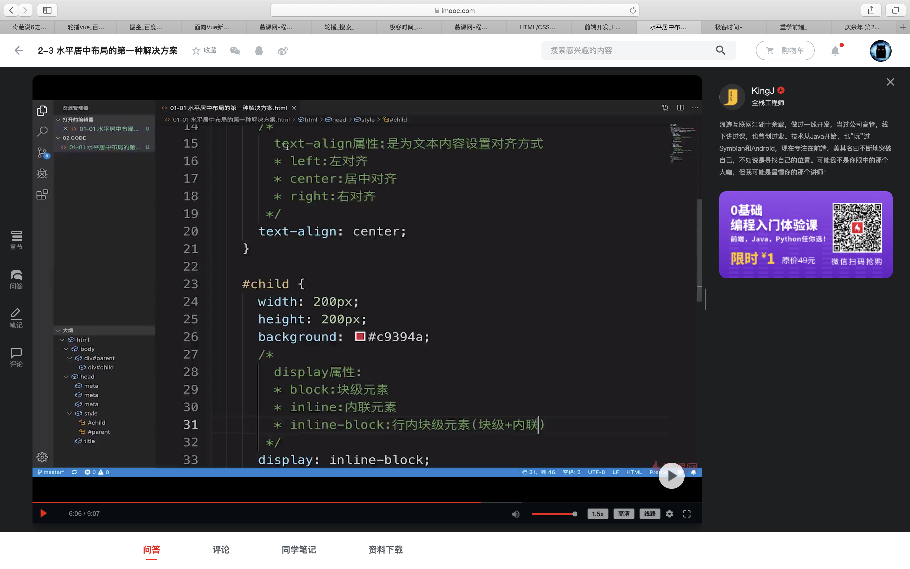
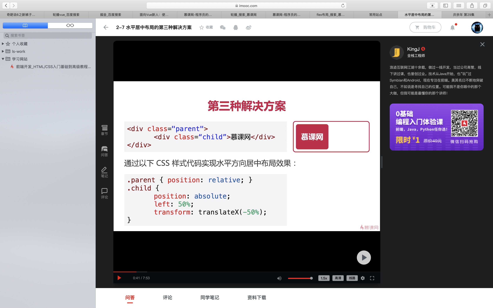
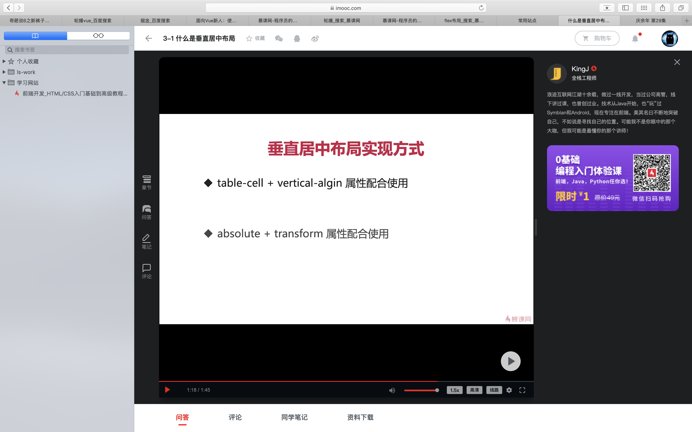
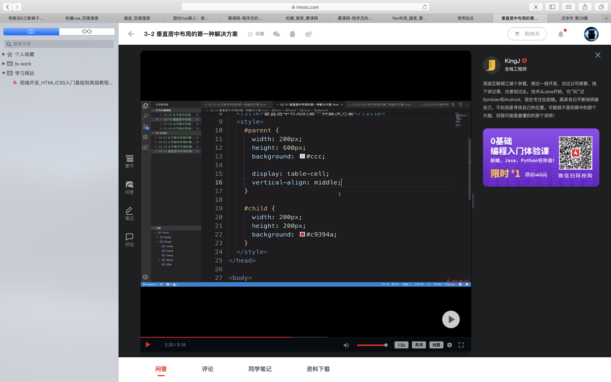
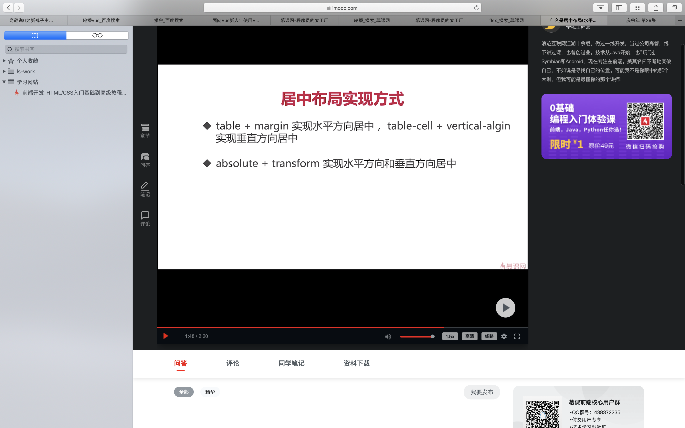
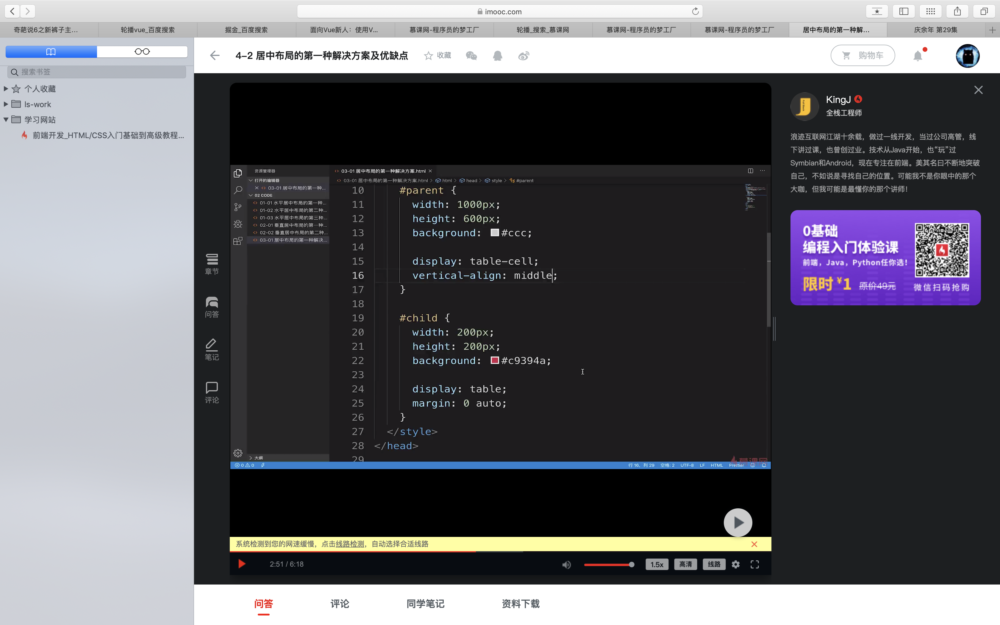
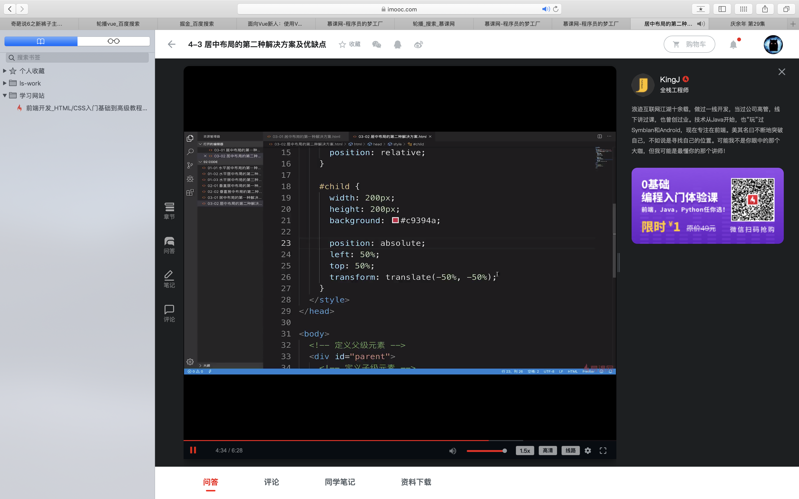
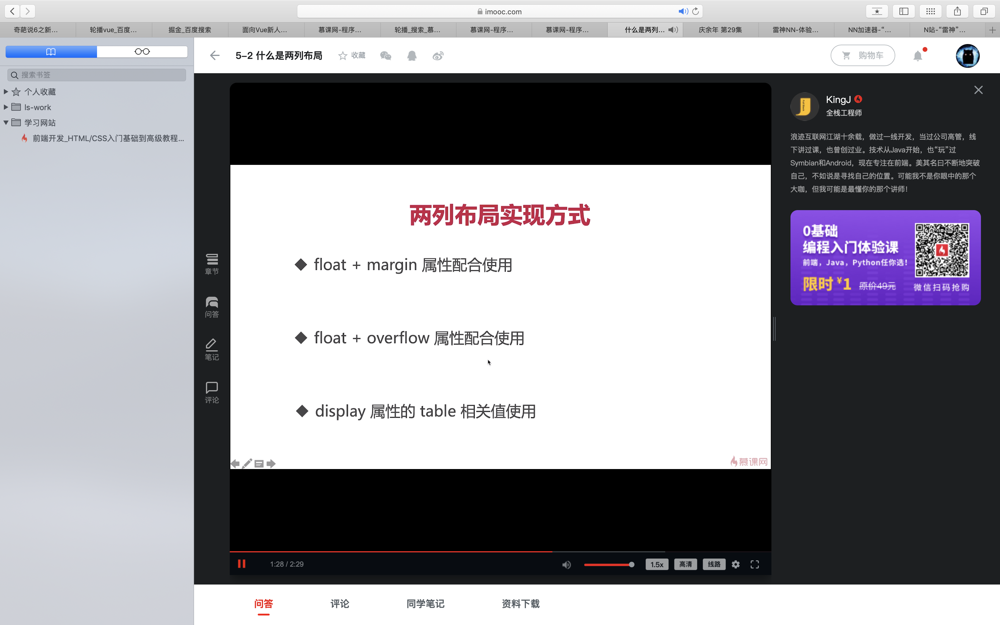
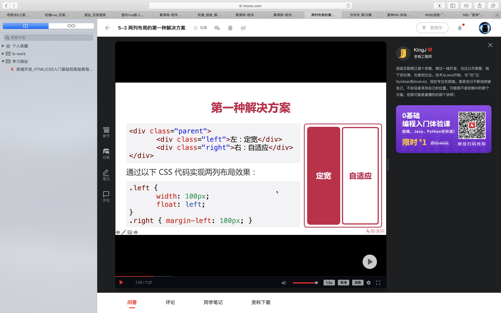
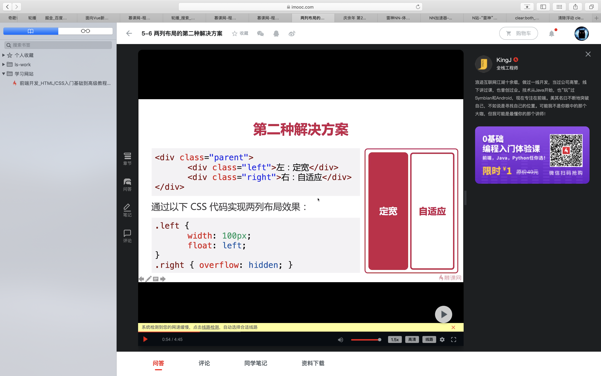

### 慕课网 一课全面掌握逐流css布局

#### 水平居中布局
- inline-block + text-align
- table + margin
- transform + absolute

##### inline-block + text-align


1. ***text-align:内联元素的特点（inline）***
2. ***inline元素的宽度和高度是无效的，而inline-block是有高度和宽度的***
3. ***兼容性：这是属于css2的属性对ie兼容性好，缺点：text-align 具有继承属性，导致子元素文本也居中，所以需要在子元素重新设置text-align属性***

##### table + margin
***对子元素设置两个属性***

***margin: 0 auto : 上下为0，左右为浏览器自适应***

***display: 可以为table或者block都可以实现水平剧中效果的***

1. 优缺点：只设置子元素的属性就可以使其居中，但是如果子元素脱离文档流则导致margin属性失效
2. 脱离文档流的三种方式：（1）float （2）将元素设置为absolute (3)当前元素设置为fixed

##### transform + absolute


1. ***如果元素没有开启定位，则是static,其余三种都是开启定位***
2. ***优点：父元素是否脱离文档流并不影响子元素水平居中效果，缺点是css3属性***
3. ***transform:translateX(-50%):水平向左平移自身宽度的50%***

#### 垂直居中布局

##### disblay:table-cell 和 vertical-align

1. ***vertical-align:用于文本的垂直对齐方式：top顶部对齐，middle居中对齐，bottom底部对齐***
2. ***display : table:设置当前元素为table元素（表格） display:table-cell设置当前元素为td这样的效果（单元格）***
3. ***display:table-cel是有两种对齐方式的，所以可以设置vertical-align,单元格内容***
4. 优点：浏览器兼容性比较好，缺点：vertical-align具有继承效果，

##### transform 和 absolute

#### 水平和垂直方向居中



1. ***为了让语义化更好，可以把子元素设置table设置为display:block***


#### 多列布局

##### 两列布局

1. 第一种解决方案


2. 优缺点：自适应元素的margin属性值要和定宽保持一致,clear:box不能用
3. 第二种解决方式（clear：both）
```
<div class="left"></div>
<div class="right">
  <div class="right-fix"> 
    <div class="inner"></div>
  </div>
</div>

.left{
  height:300px;
  float:left;
  position:relative
  //设置显示层级更高
}
.right-fix{
  //设置浮动导致默认宽度为0
  float:right;
  width:100%;
  //负值代表向左
  margin-left="-300px"
}
.right{
  backgroung:red
}
.inner{
  height:200px;
  clear:both;
  //此时就不影响布局了
}
```
4. 第三种解决方式

1. ***overflow:hidden:开启BFC模式 当前元素的内部环境与外部环境隔离***
2. ***优点：解决了第一种方式，但是bfc模式开启都有问题，溢出隐藏***
##### 三列布局
##### 圣杯布局和双飞翼布局
##### 等分布局
##### 等高布局
##### css3多列布局
##### tips
```
   width: 1200px;
   position: absolute;
   top: 337px;
   margin: auto;
   left:0;
   right:0;
```
```
把图片src放进去。在上面绝对定位加div
```
```
clear:both //清除定位，又可以在上面加新的定位
```
```
//图片自适应写法
<!-- 头部 -->
    <div class="helping_center_banner">
      <div style="width: 1200px;margin: 0 auto;">
          <h1 class="helping_center_title text-center" style="text-align: left;line-height: 400px;color: #ffffff"> 帮助中心</h1>
      </div>
    </div>
```
```
/* 帮助中心 */
.helping_center_banner {
	width: 100%;
	height: 346px;
	line-height: 215px;
	background: #e6e3de url("./images/helping_bg.png") 50% no-repeat;
	background-size: 3000px 346px
}
.helping_center_title {
	font-weight: 700;
	font-size: 45px;
	color: #67635c
}
```


