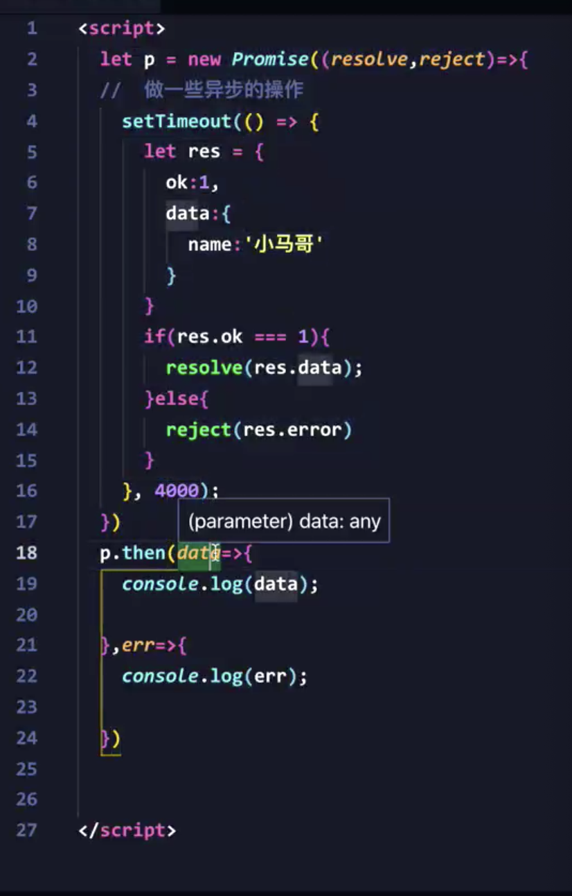
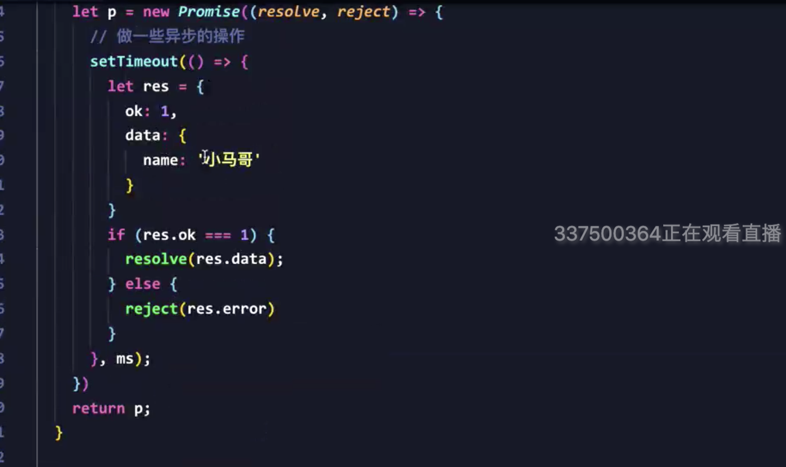
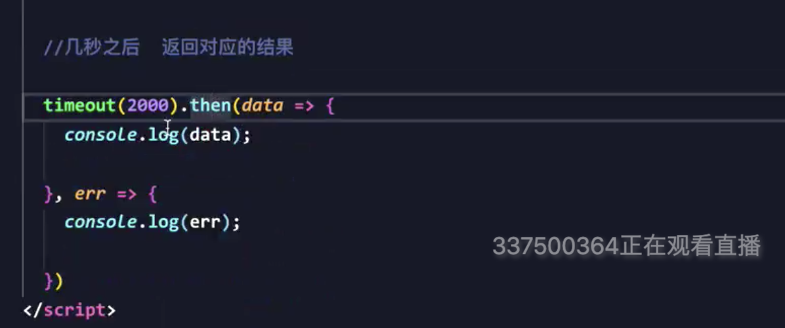
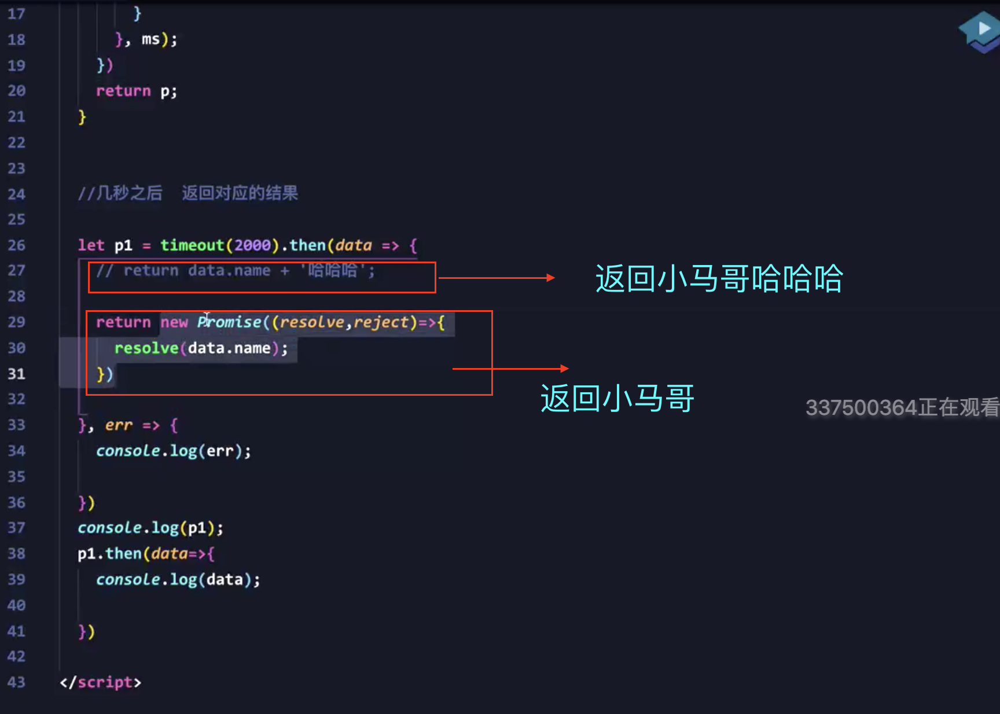
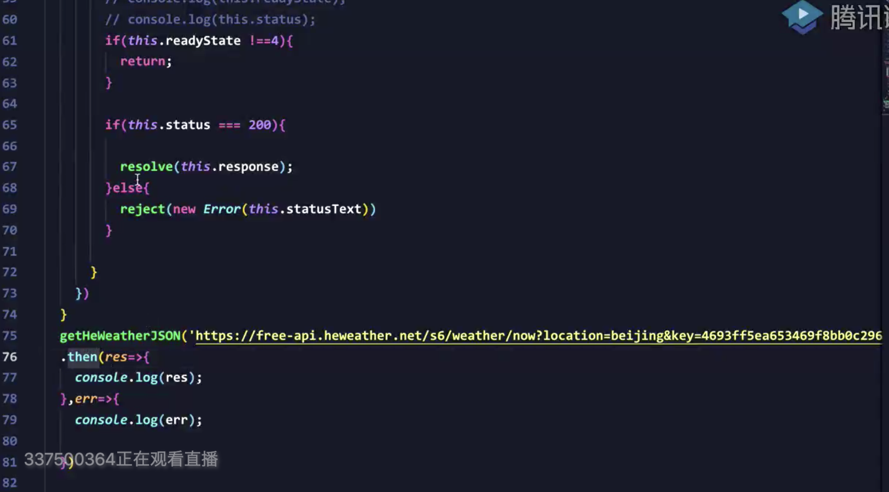
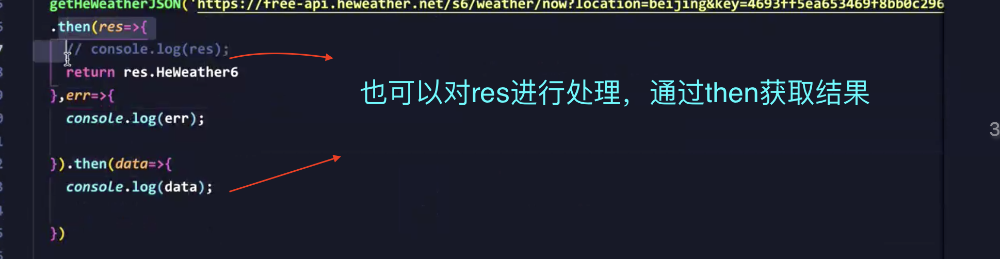
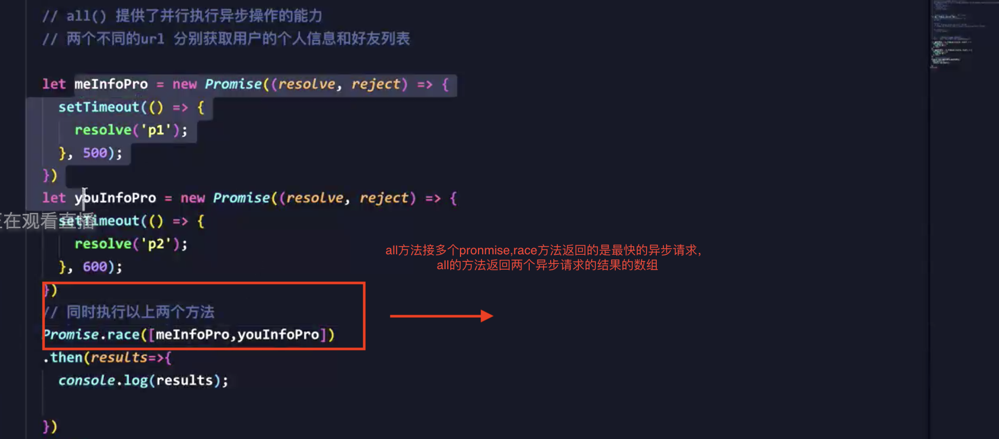
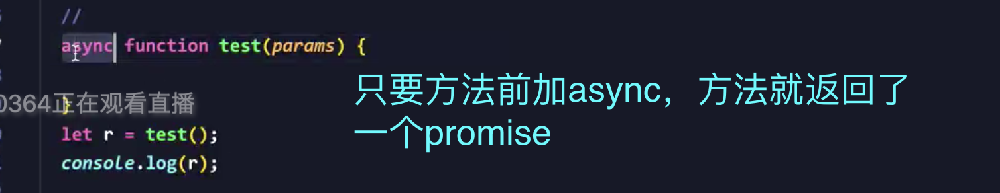
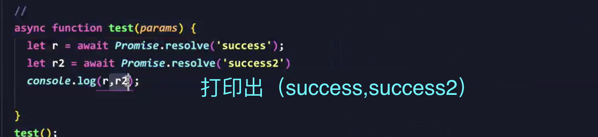
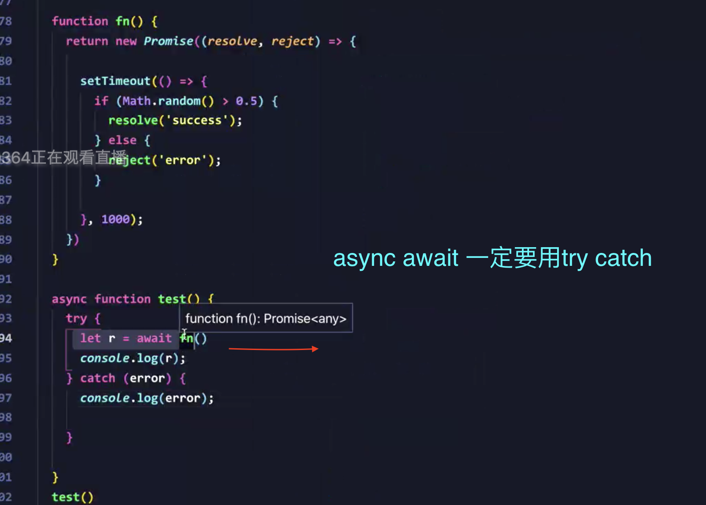

### promise

- resolve return出去了一个 promise
 

- 闭包ms：几秒后返回对应的结果
 
 
- 闭包封装之后，两秒后显示对应结果
 

- 封装httpxmlrequest函数
- 闭包封装之后，两秒后显示对应结果
 
- 有关return之后then的用法
 
- Promise.resolve()方法
 
- Promise.all().then方法和Promise.race().then方法
 
- async
 
- await
 
- try catch
 