### 如果网站一栏div里面有图片，输入框以及确认按钮，以及一个购物车 兼容es6

- 布局用float布局，并且用padding将它们隔开,但是有padding要重新计算width的值
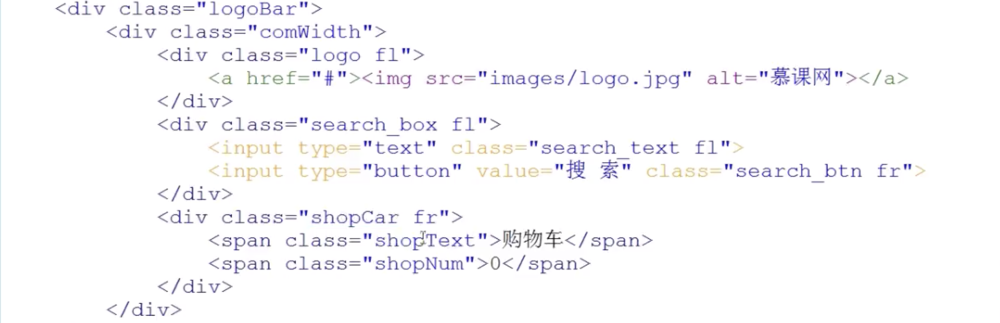
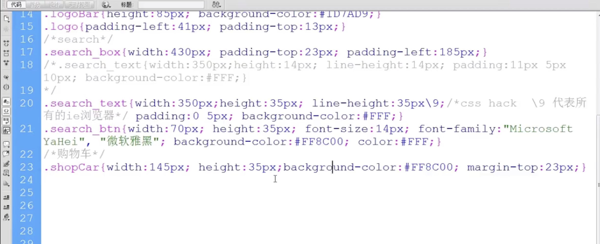
- ie下兼容input的hack(\9代表所有的ie浏览器)
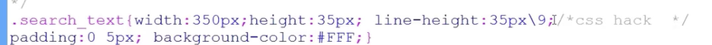
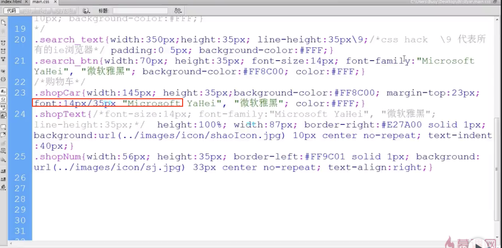
- i标签内嵌图片(^)

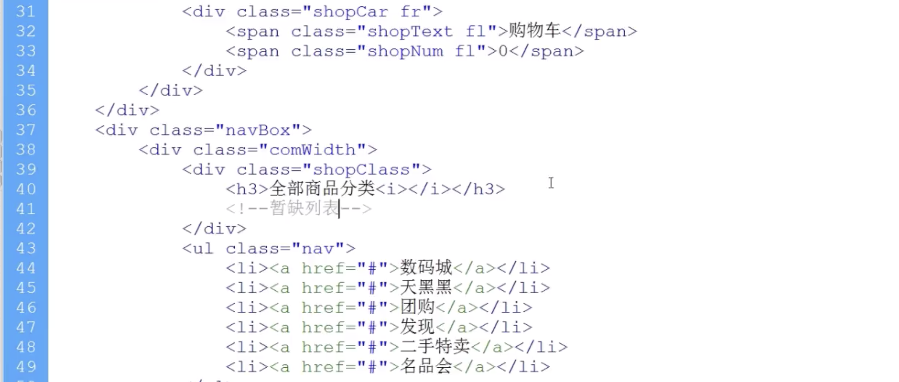

- 导航条用padding撑开
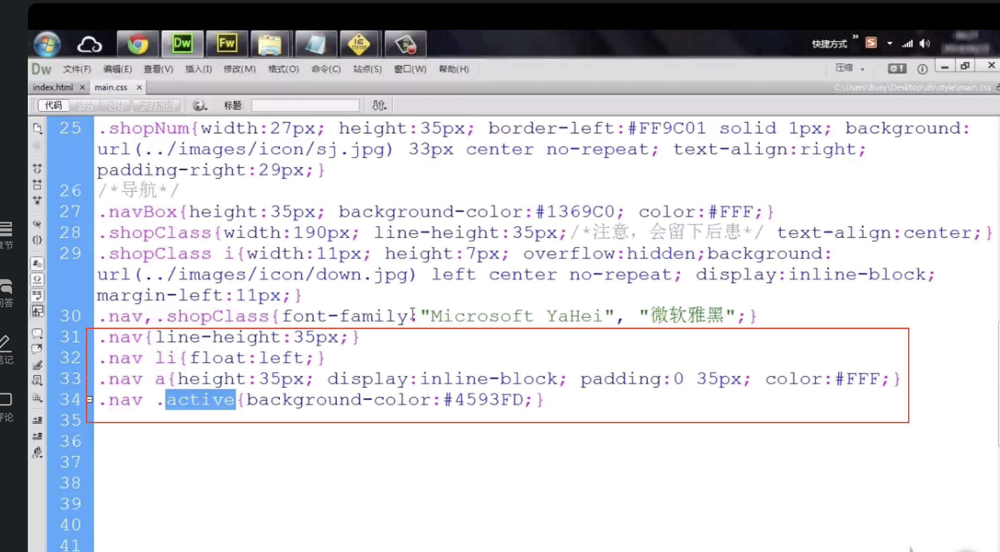
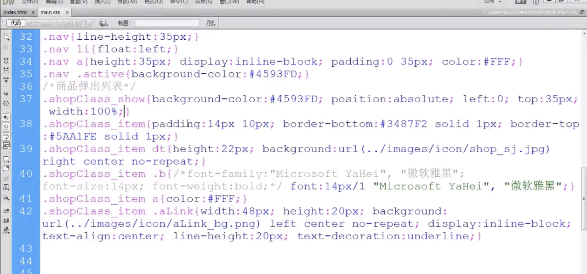

- 侧边导航条可以隐藏消失
```
绝对定位，还是给了dt高度
```
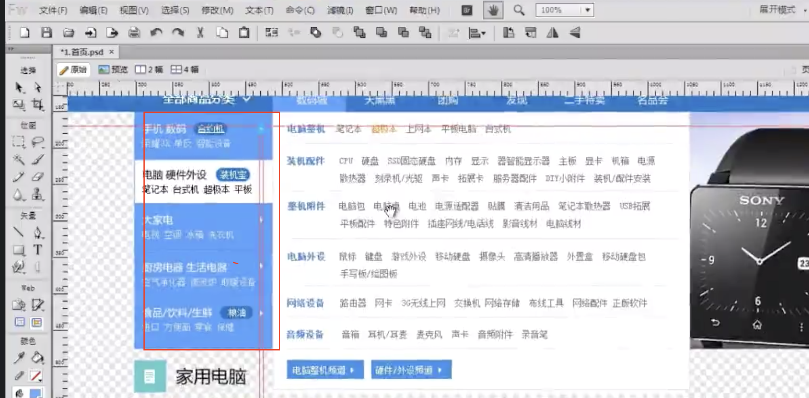

- dt 是标题第一个,dd是其余的标题（悬浮中间内容部分）,按钮样式也是a标签给个hegitht,inline-height，再给个padding

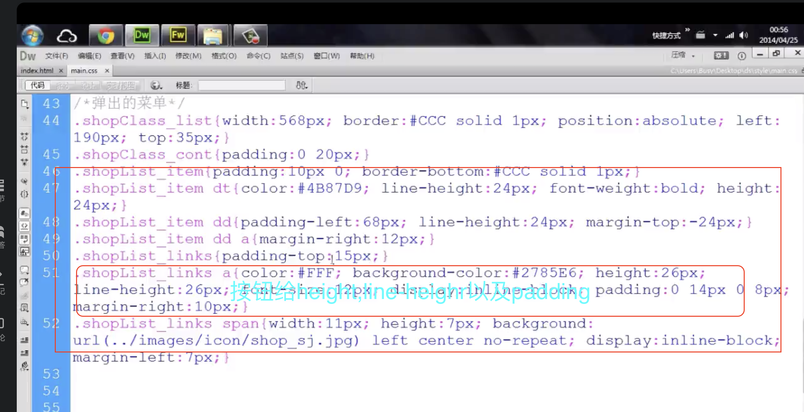

- 首页轮播图布局
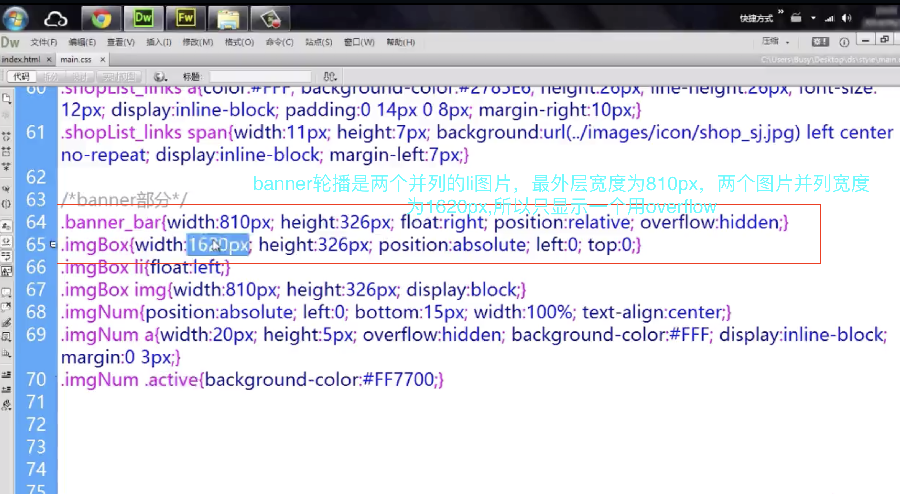

```
切换图片时候，将imgBox的left设置为-810px

>> &gt &gt
圈里一个c @copy
```

- 图文列表
***竖向***
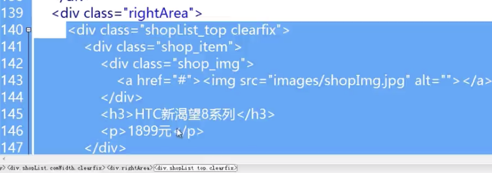
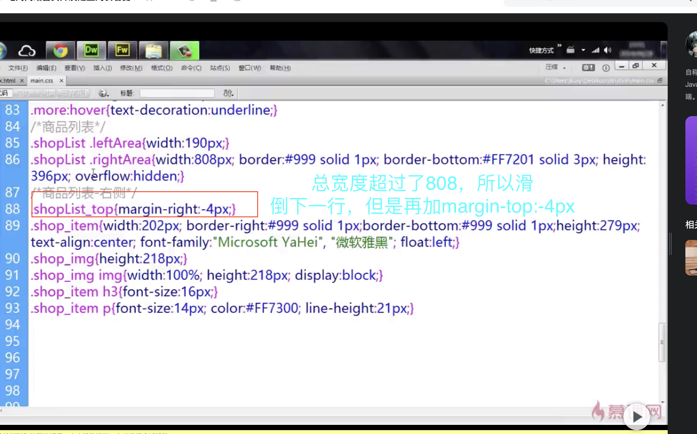

***横向***
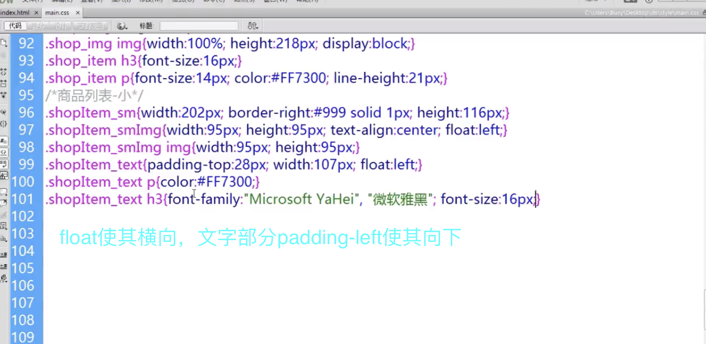


- 底部（每行就用p标签，|用i标签包裹）
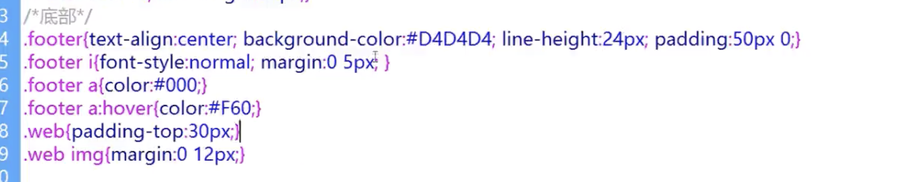
- 兼容性
```
有时候高度不一致，需要从padding，line-height，width,margin-top,height中调整。

右浮动右边距的bug双边距需要设置display:inline

有时候文字高度不一致，需要设置position:relative和vertical-aligh:middle
```
- js库的兼容
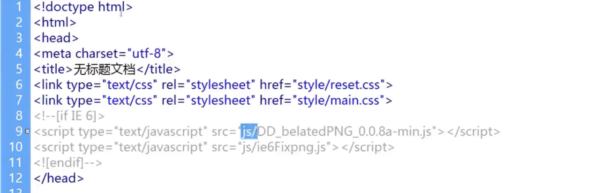

- 筛选
```
三栏文字布局可以用dt dd dd
```
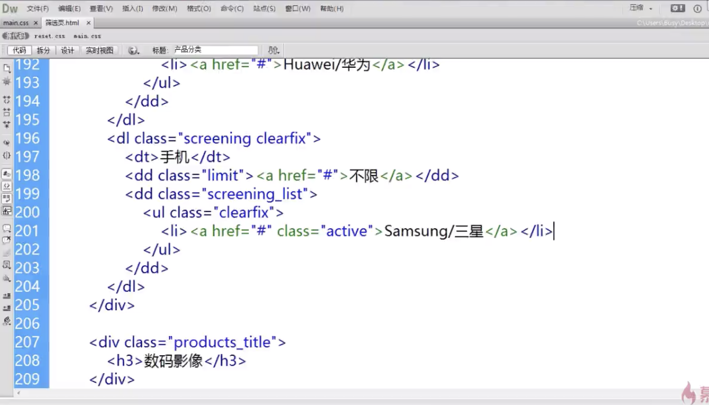
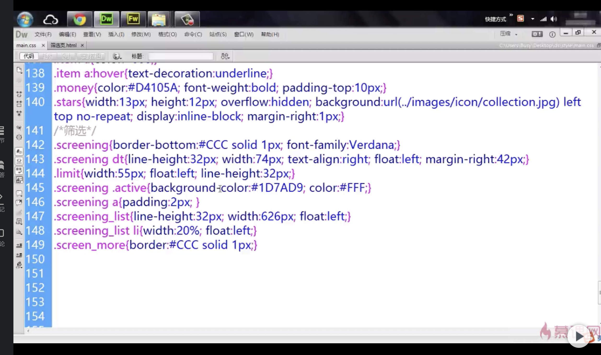


- 图片边框
```
li的magin-left:-1px;外层padding-left:1px
```
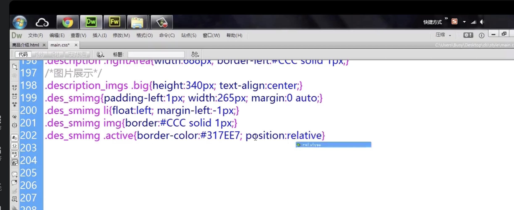
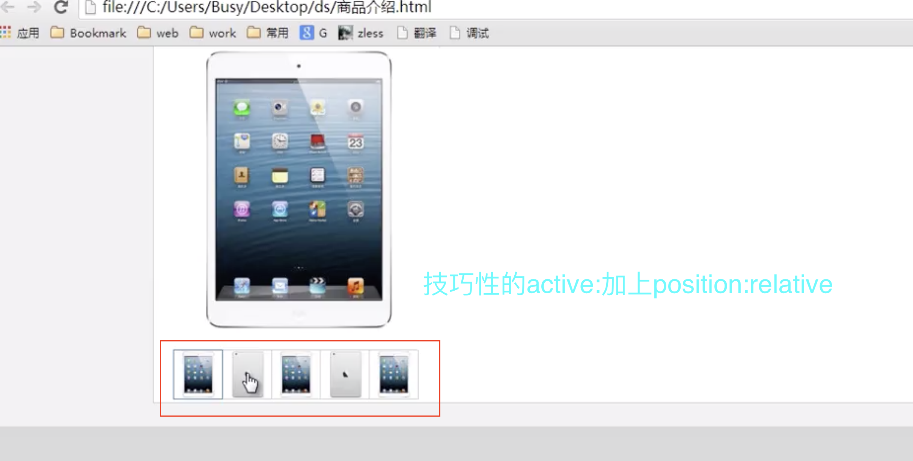

```
文本内容可以是：
<span><i>换购</i>加多少钱换购</span>
i中可以放图片，span可以设置display:inline-block.padding-top设置文字高度

```
```
有时候没有高度是因为没有清浮动
```
```
有时候给的行高被覆盖掉了，可能是优先级的问题，需要给这个子元素的样式加上父元素的class

```
```
有时候text-intend代替margin-right
```
```
ie6input高度不要给100%而是给具体高度。
```
```
如果ie6中子元素的宽度太小了，父元素设置宽度并设置overflow:hidden
```