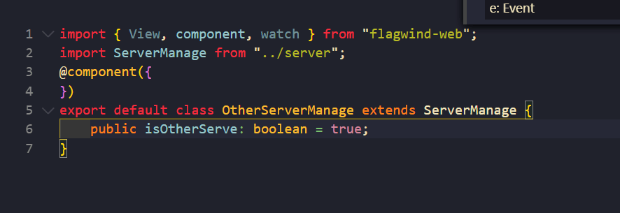

### 文档
- [ts文档](https://www.tslang.cn/docs/home.html)
- [ts-vue-文档](https://www.tslang.cn/docs/home.html)
- [ts-vue-文档](https://blog.csdn.net/qq_42451979/article/details/89642575)

### 语法学习
- vue-class-component
- vue-property-decorator

### extends继承

1. 应用场景：有时候比Mixins好用，有时候两个页面几乎一模一样，可能调用的接口不一样，或者一个能编辑一个不能编辑，通过继承 只用写一个页面，另外一个页面加覆写几个属性就可以了

### 接口调用

```
import HttpClient from "@/ts/net/HttpClient";
import NewsConfigModel, {GetRegincodeModel, NewModel, NewsModel} from "@/ts/models/NewsModel";
export default class ConfigUtil {
  /**
     * 获取新春活动排名榜列表
     */
    public static RANKLIST = "/geoip2/country_codes.json";
    private ranklist = null;

    //
    private static instance: ConfigUtil = null;
    private httpC = new HttpClient();

    /**
     * 单例
     */
    public static getInstance() {
        if (ConfigUtil.instance == null) {
            ConfigUtil.instance = new ConfigUtil();
        }
        return ConfigUtil.instance;
    }
}
```
