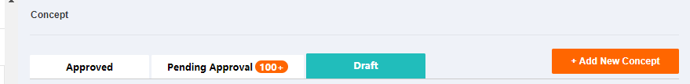
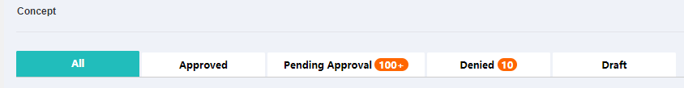

### computed



> 不用在data里面定义，根据isUpload返回需要的数组

```
computed:{
    ...mapGetters('dictionary',['regionList']),
    ...mapGetters("concept", ["tableData","pager","params"]),
    tabOption(){
      const isUpload = !this.isUpload
      const list = [
        {
          label: 'All',
          value: '1',
          isShow: isUpload
        },
        {
          label: 'Approved',
          value: '2',
          isShow: true
        },
        {
          label: 'Pending Approval',
          value: '3',
          badge: '100+',
          isShow: true
        },
        {
          label: 'Denied',
          value: '4',
          badge: '10',
          isShow: isUpload
        },
        {
          label: 'Draft',
          value: '5',
          isShow: true
        }
      ]
      return {
        activeName: '1',
        list: list.filter(v => v.isShow)
      }
    }
  },

```


### 根据不同的prop判断应该显示的表格的operation
```
  <el-table :data="tableData" style="width: 100%">
    <el-table-column prop="title" label="Name" width="180"></el-table-column>
    <el-table-column prop="updateYear" label="Update Year" width="180"></el-table-column>
    <el-table-column prop="areaId" label="Region/Country"></el-table-column>
    <el-table-column prop="segmentTitle" label="Segment"></el-table-column>
    <el-table-column prop="type" label="Type"></el-table-column>
    <el-table-column prop="updateTime" label="Upload time"></el-table-column>
    <el-table-column prop="createUserName" label="Submit by"></el-table-column>
    <el-table-column prop="approver" label="Approver"></el-table-column>
    <el-table-column prop="ratingScore" label="Rate"></el-table-column>
    <el-table-column prop="webView" label="Web view"></el-table-column>
    <el-table-column prop="appView" label="App view"></el-table-column>
    <el-table-column prop="ratingScore" label="New concept"></el-table-column>
    <el-table-column prop="type" label="Set"></el-table-column>
    <el-table-column prop="operation" label="Operation">
    <template slot-scope="scope">
      <!-- <span class="red" :class="item.row.dataStatus !== 2 ? 'enable': 'disable'" v-show="showSpecial" @click="action(item, 'enable')">{{item.row.dataStatusName}}<br/></span> -->
      <span class="green" v-show="edit" @click="handleClick(scope, 'edit')">Edit<br/></span>
      <span class="green" v-show="approver" @click="handleClick(scope, 'pending')">Approval/Deny<br/></span>
      <span class="green" v-show="withdraw" @click="handleClick(scope, 'withdraw')">Withdraw<br/></span>
      <span class="red" v-show="view" @click="handleClick(scope, 'view')">View<br/></span>
    </template>
  </el-table-column>
```
```
  props: {
    selectTab: {
      type: Number,
      default: 4
    },
    isHasPermission: {
      // 是否有权限属性
      type: Boolean,
      default: false
    },
  }
  computed: {
    edit () {
      return (!this.isHasPermission && this.selectTab === 4) || (this.isHasPermission && this.selectTab === 2) || (!this.isHasPermission && this.selectTab === 0)
    },
    approver () {
      return !this.isHasPermission && this.selectTab === 1
    },
    withdraw () {
      return this.isHasPermission && this.selectTab === 1
    },
    view () {
      return (!this.isHasPermission && this.selectTab === 4) || (!this.isHasPermission && this.selectTab === 2) || (this.isHasPermission && this.selectTab === 4) || (this.isHasPermission && this.selectTab === 1) || (this.isHasPermission && this.selectTab === 2)
    },
    showSpecial (val) {
      return !this.isHasPermission && this.selectTab === 4
    }
  }

```
