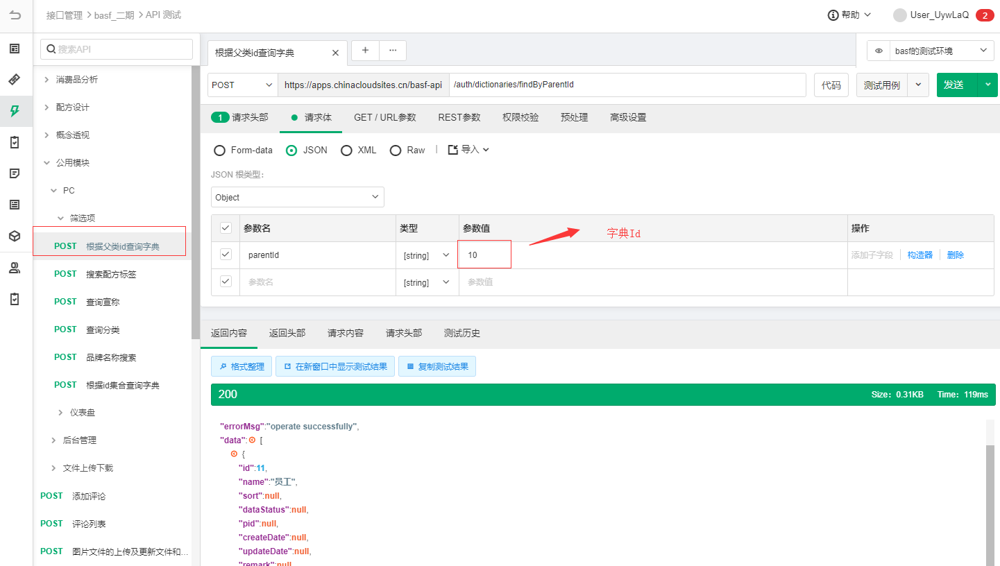
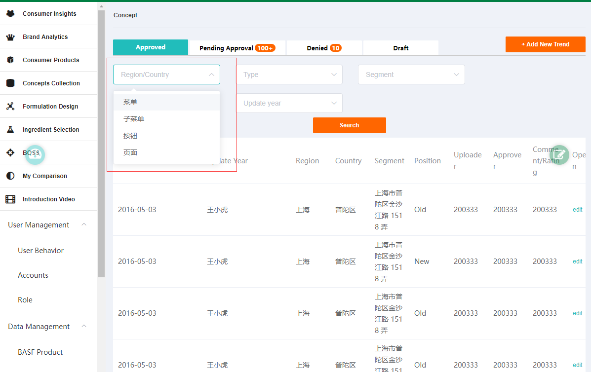

### eolink 
#### 根据父类Id查询字典

#### vuex

> axios/api/dictionary.js

获取region字典

```
    import $axios from '../config.js'

    // 公共字典url
    const GET_DICTIONARY = '/auth/dictionaries/findByParentId'

    // download权限字典url
    const GET_DOWNLOAD_AUTH = '/manage/resource/findDownAuthority'

    export const getDictionary = (id) => {
    return $axios({
        url: GET_DICTIONARY,
        method: 'post',
        data: {
        parentId: id
        }
    })
    }

    // 字典api

    // 获取status字典
    export function getDicByStatus () {
    return getDictionary(1)
    }
    //获取region字典
    export function getDicByRegion () {
    return getDictionary(5)//参数为id号
    }

    // 获取download权限字典
    export function getDicByDownload () {
    return $axios({
        url: GET_DOWNLOAD_AUTH,
        method: 'post'
    })
    }

```
>src\axios\api\dictionary.js
```
  import $axios from '../config.js'

// 公共字典url
const GET_DICTIONARY = '/auth/dictionaries/findByParentId'

// download权限字典url
const GET_DOWNLOAD_AUTH = '/manage/resource/findDownAuthority'

export const getDictionary = (id) => {
  return $axios({
    url: GET_DICTIONARY,
    method: 'post',
    data: {
      parentId: id
    }
  })
}

// 字典api

// 获取status字典
export function getDicByStatus () {
  return getDictionary(1)
}
// 获取region字典
export function getDicByRegion () {
  return getDictionary(5)
}

// 获取download权限字典
export function getDicByDownload () {
  return $axios({
    url: GET_DOWNLOAD_AUTH,
    method: 'post'
  })
}

// 获取mainGroup数据
export function getDicByMainGroup () {
  return getDictionary(1)
}

// 获取formDelivery数据
export function getDicByFormDelivery () {
  return getDictionary(89)
}

// 获取ecoStatus数据
export function getDicByEcoStatus () {
  return getDictionary(1)
}

```
> store/modules/dictionary.js

```
    import { getDicByStatus, getDicByDownload, getDicByRegion } from '@/axios/api/dictionary'

    const UPDATE_STATUS = 'UPDATE_STATUS_DIC'
    const UPDATE_DOWNLOAD_LIST = 'UPDATE_DOWNLOAD_LIST'
    const UPDATE_REGION_LIST = 'UPDATE_REGION_LIST'

    const state = {
    statusList: [],
    downloadList: [],
    regionList:[]
    }

    const getters = {
    statusList: state => state.statusList.map(v => {
        return { label: v.name, value: v.id }
    }),
    downloadList: state => state.downloadList.map(v => {
        return { label: v.name, value: v.id }
    }),
    regionList: state => state.regionList.map(v => {
        return { label: v.name, value: v.id }
    })
    }

    const mutations = {
    [UPDATE_STATUS] (state, statusList) {
        state.statusList = statusList
    },
    [UPDATE_DOWNLOAD_LIST] (state, downloadList) {
        state.downloadList = downloadList
    },
    [UPDATE_REGION_LIST] (state, regionList) {
        state.regionList = regionList
    }
    }

    const actions = {
    async getStatusDic ({state, commit}) {
        if (state.statusList.length) return
        try {
        let { data: res } = await getDicByStatus()
        commit(UPDATE_STATUS, res)
        } catch (e) {}
    },
    async getDownloadDic ({state, commit}) {
        if (state.downloadList.length) return
        try {
        let { data: res } = await getDicByDownload()
        commit(UPDATE_DOWNLOAD_LIST, res)
        } catch (e) {}
    },
    async getRegionDic ({commit}) {
        if (state.regionList.length) return
        try {
        let { data: res } = await getDicByRegion()
        commit(UPDATE_REGION_LIST, res)
        } catch (e) {}

    }
    }

    export default {
    namespaced: true,
    state,
    getters,
    mutations,
    actions
    }

```


> 组件

```
...
<search :list="searchList" @search="search"></search>
...

import {mapGetters,mapActions} from 'vuex';
...
data(){
    return {
        searchList: [
        {
          options: [

          ],
          value: '',
          key: 'Region',
          placeholder: 'Region/Country'
        },
        // {
        //   options: [
        //     {
        //       value: '1',
        //       label: 'Country1'
        //     }, {
        //       value: '2',
        //       label: 'Country2'
        //     }, {
        //       value: '3',
        //       label: 'Country3'
        //     }, {
        //       value: '4',
        //       label: 'Country4'
        //     }, {
        //       value: '5',
        //       label: 'Country5'
        //     }
        //   ],
        //   value: '',
        //   key: 'Country',
        //   placeholder: 'Country'
        // },
        //type数据字典没配
        {
          options: [
            {
              value: '1',
              label: 'Type   1'
            }, {
              value: '2',
              label: 'Type2'
            }, {
              value: '3',
              label: 'Type3'
            }, {
              value: '4',
              label: 'Type4'
            }, {
              value: '5',
              label: 'Type5'
            }
          ],
          value: '',
          key: 'Type',
          placeholder: 'Type'
        },
        //Segment数据字典没配
        {
          options: [
            {
              value: '1',
              label: 'Segment Care1'
            }, {
              value: '2',
              label: 'Segment Care2'
            }, {
              value: '3',
              label: 'Segment Care3'
            }, {
              value: '4',
              label: 'Segment Care4'
            }, {
              value: '5',
              label: 'Segment Care5'
            }
          ],
          value: '',
          key: 'Segment',
          placeholder: 'Segment'
        },
        //position数据字典没配
        {
          options: [
            {
              value: '1',
              label: 'Position1'
            }, {
              value: '2',
              label: 'Position2'
            }, {
              value: '3',
              label: 'Position3'
            }, {
              value: '4',
              label: 'Position4'
            }, {
              value: '5',
              label: 'Position5'
            }
          ],
          value: '',
          key: 'Position',
          placeholder: 'Position'
        },
        {
          options: [
            {
              value: '1',
              label: 'Update year1'
            }, {
              value: '2',
              label: 'Update year2'
            }, {
              value: '3',
              label: 'Update year3'
            }, {
              value: '4',
              label: 'Update year4'
            }, {
              value: '5',
              label: 'Update year5'
            }
          ],
          value: '',
          key: 'Update year',
          placeholder: 'Update year'
        }
      ],
    }
}
created(){
    this.pageInit()
  },
  computed:{
    // 1. 获取getter
    ...mapGetters('dictionary',['regionList','typeList']),
    ...mapGetters("concept", ["tableData","pager","params"]),
  },
  methods:{
     //获取列表数据
    ...mapGetters('dictionary',['regionList'])
     //2. 获取数据字典,dictionary为命名空间
    ...mapActions('dictionary',['getRegionDic']),
    //获取列表数据
    ...mapActions("concept", ["getTableDataApi", "setParams"]),
     //4. 同步调用
    pageInit () {
      this.getRegionList()
      this.getRegionList()
    },
    onTabChange (e) {
      // 点击以后 badge 应该要变
      this.tabOption.activeName = e
    },
    add () {
      console.log('add')
    },
    search (e) {
      console.log(e)
    },
    // 3. 获取字典数据
    async getRegionList () {
      await this.getRegionDic();
      this.searchList[0].options = this.regionList;
    },
     async getTypeList () {
      await this.getTypeDic();
      this.searchList[1].options = this.typeList;
    },
  }
```
