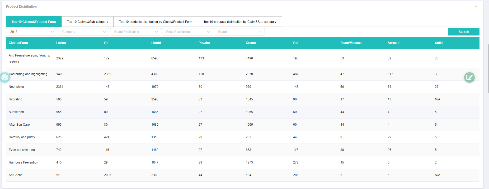
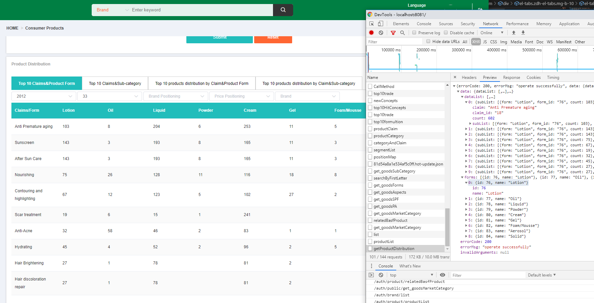

### tab数据结构调整




### 

```
<my-panel v-loading="loading.brandIndexBriefClaimCtgyParams" :title="$t('chart.brand.T10CCP')" class="mg-tb-10">
    <span slot="header" class="data-sourse-style">{{$t('txt.dataSource2')}}</span>
    // :data : 为ClaimDetail数组中的title值获取
    <el-table
        class="zdh-el-table-style mg-t-15"
        :data="claimDetail"
        stripe
        style="width: 100%">
        <el-table-column
        prop="title"
        :label="$t('txt.claimsCategory')"
        align="center"
        width="180">
        </el-table-column>
        // 转化的映射关系 id 对 title
        <el-table-column
        :prop="item.id + ''"
        :label="item.name"
        align="center"
        v-for="(item, idx) in categoryClaim.categoryDetail"
        :key="idx"
        >
            // 此处将没有值的数据转化为N/A
            <template slot-scope="scope">
            <span>{{scope.row[item.id] || 'N/A'}}</span>
            </template>
        </el-table-column>
    </el-table>
</my-panel>
```

```
    claimDetail () {
        return this.categoryClaim.claimDetail.map(v => {
        let res = {}
        v.listData.forEach((v, i) => {
            res[v.metrics] = v.count
        })
        res.title = v.title
        return res
        })
    },
```

### 根据isUpload传数据

```
 <my-table
    :tableData="isUpload?tableUploadData.records:tableData.records"
    :selectTab="selTab"
    :pager="pager"
    :action="action"
    @pagerChange="pagerChange"
    @tableApproval="tableApproval"
    :isHasPermission="isUpload"
></my-table>

```