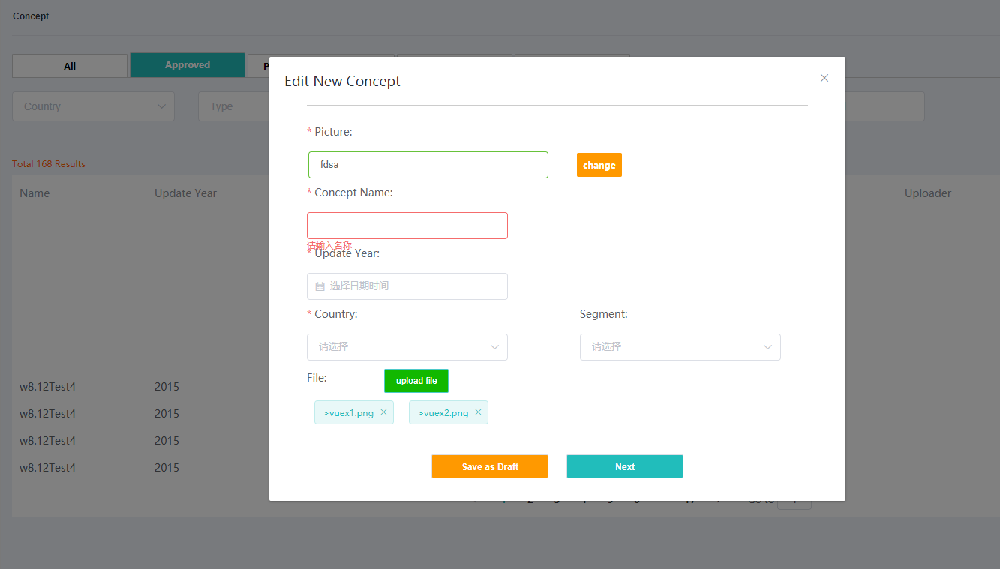

### 表单值提交全不为空 some-->只要有一个


```
    //第一步操作 form判断
    checkPage1 () {
        let list1 = ['mainImgSrc', 'title', 'updateYear', 'areaId', 'segmentId']
        let flag = true
        list1.some(item => {
        if (!this.uploadFileForm[item]) {
            flag = false
            this.$message.error('请完成所有必填项')
        }
        })
        return flag
        },
        // 判断是第几步
        checkPage (step) {
        var flag = true
        switch (step) {
        case 2: flag = this.checkPage1();
        break
        default: flag = false
        }
        return flag
        },
        // next 先判断是否全部填完再进行下一步
        next (step) {
        if (this.checkPage(step)) {
        this.active = step
        this.save ()
        this.getStepDataApi(step)
        }
    },
```

### element-ui 表单验证

> 组件 绑定rule

```
<!-- 第一页 Upload files -->
    <div class="dialog-content" v-show="step === 1">
      <el-form :model="uploadFileForm" ref="ruleForm" :rules="rule" label-position="top" size="small">
        <!-- Picture -->
        <el-row class="picture-top">
          <el-col :span="24">
            <el-form-item label="Picture:" prop="mainImgSrc">
              <div class="add">
                <el-input
                  class="input green"
                  v-model="uploadFileForm.mainImgSrc"
                  clearable
                  @clear="clear('img')"
                ></el-input>
                <el-upload class="change" action :before-upload="e => imgUpload('img', e)">
                  <span>{{uploadFileForm.mainImgSrc ? 'change' : 'upload'}}</span>
                </el-upload>
              </div>
            </el-form-item>
          </el-col>
        </el-row>
        <el-row :gutter="60">
          <!-- Concept name -->
          <el-col :span="24">
            <el-form-item label="Concept Name:" prop="title">
              <el-input v-model="uploadFileForm.title"></el-input>
            </el-form-item>
          </el-col>
        </el-row>
        <el-row :gutter="60">
          <!-- Update Year-->
          <el-col :span="24">
            <el-form-item label="Update Year:" prop="updateYear">
              <el-date-picker
                v-model="uploadFileForm.updateYear"
                type="year"
                value-format="yyyy"
                placeholder="选择日期时间"
                @change="e => getYear(e)"
              ></el-date-picker>
            </el-form-item>
          </el-col>
        </el-row>
        <el-row :gutter="60">
          <!-- Country-->
          <el-col :span="12">
            <el-form-item label="Country:" prop="areaId">
              <el-select v-model="uploadFileForm.areaId" placeholder="请选择">
                <el-option
                  v-for="item in countryList"
                  :key="item.value"
                  :label="item.label"
                  :value="item.value"
                ></el-option>
              </el-select>
            </el-form-item>
          </el-col>
          <!-- Segment-->
          <el-col :span="12">
            <el-form-item label="Segment:" prop="segmentId">
              <!-- <el-input v-model="form.area"></el-input> -->
              <el-select v-model="uploadFileForm.segmentId" placeholder="请选择">
                <el-option
                  v-for="item in segmentList"
                  :key="item.value"
                  :label="item.label"
                  :value="item.value"
                ></el-option>
              </el-select>
            </el-form-item>
          </el-col>
        </el-row>
        <!-- Files-->
        <el-row class="upload-wrap">
          <el-col :span="24">
            <div>File:</div>
            <el-upload class="upload-demo" :before-upload="filebeforeUpload" action>
              <el-button
                slot="trigger"
                @click="fileUpload"
                class="upload-btn"
                size="small"
                type="primary"
              >upload file</el-button>
            </el-upload>
            <!-- 渲染新增文件 -->
            <div class="fileList">
              <el-tag
                class="fileTag"
                v-for="item in uploadFileForm.fileNames"
                :key="item.id"
                closable
                @close="handleClose(item)"
              >>{{item.fileTitle}}</el-tag>
            </div>
          </el-col>
        </el-row>
        <div class="dialog-footer">
          <el-button class="draft-btn" size="small" @click="save()">Save as Draft</el-button>
          <el-button class="next-btn" size="small" @click="next(2)">Next</el-button>
        </div>
      </el-form>
    </div>


```

### data

```
    data () {
        return {
             rule: {
                mainImgSrc: [{ required: true, message: "请选择图片", trigger: "blur" }],
                title: [{ required: true, message: "请输入名称", trigger: "blur" }],
                updateYear: [{ required: true, message: "请选择年份", trigger: "blur" }],
                areaId: [{ required: true, message: "请选择地区", trigger: "blur" }]
            },
        }
    }
```
