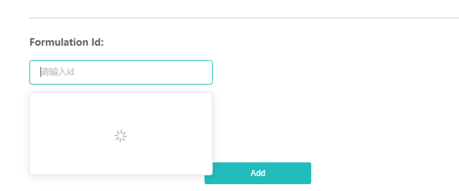
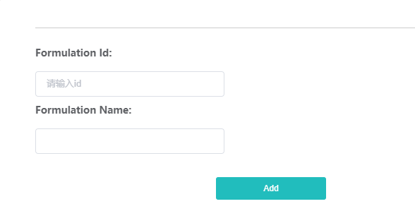

### 模糊匹配
输入单个字符，匹配下拉选项
### elementui组件
input输入框 -- el-autocomplete
[远程搜索](https://element.eleme.io/#/zh-CN/component/input)

### 组件


> 
```
    <el-form
        :model="form"
        ref="ruleForm"
        label-position="top"
        size="small"
        v-if="type === 'formulation'"
      >
        <!-- Picture -->
        <el-row :gutter="60">
          <el-col :span="24">
            <el-form-item label="Formulation Id:" prop="formulationId" class="label-name">
              <!-- 自动搜索 -->
              <el-autocomplete
                v-model="form.id"
                :fetch-suggestions="querySearch"
                placeholder="请输入id"
                @select="handleSelect"
              ></el-autocomplete>
            </el-form-item>
          </el-col>
        </el-row>
        <el-row :gutter="60">
          <el-col :span="24">
            <el-form-item label="Formulation Name:" prop="formulationName" class="label-name">
              <el-input v-model="form.title"></el-input>
            </el-form-item>
          </el-col>
        </el-row>
      </el-form>
```
```
    name: "add-formulation",
    data() {
        return {
        form: {
            id:'',
            title:''
        }
        };
    }
    methods: {
        ...mapActions("concept", ["getformulationIdDataApi","getTradeNameIdDataApi"]),
        // 调用匹配接口
        async querySearch(queryString, cb) {
        let params = {
            id: queryString,
            current: 1,
            size: 50,
            desc: ["id"]
        }
        var formulationIdData = await this.getformulationIdDataApi({ ...params });
        // 控制返回数据结构
        formulationIdData = formulationIdData.map(v => {
        return {
            value: v.id,
            name: v.title
        }
        })
        // 调用 callback 返回建议列表的数据
        cb(formulationIdData);
        },
        //绑定v-model
        handleSelect (v) {
        console.log(v.name);
        this.form.title = v.name;
        this.form.id = v.value;
        },
        handleSelectTrade (v) {
        console.log(v.name);
        this.form.tradeName = v.name;
        this.form.id = v.value;
        }
    },
    computed: {
        ...mapGetters("concept", ["formulationIdData"]),
    }

```

### select 可输入 类似模糊搜索

```
  <div>
      <el-select class="item"
        v-for="(select,index) in listTwo"
        :key="index"
        v-model="params[select.key]"
        clearable
        :filterable="true"
        :remote="true"
        :remote-method="e => remoteMethod({value: e,index: index})"
        :placeholder="select.placeholder"
      >
        <el-option
          v-for="item in select.options"
          :key="item.value"
          :label="item.label"
          :value="item.value">
        </el-option>
      </el-select>
    </div>
```
