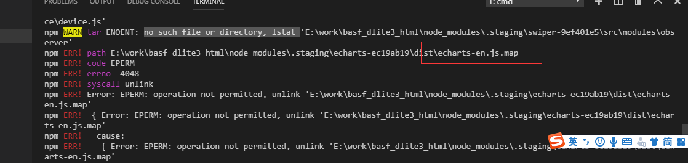

> 报错

```
 Error: EPERM: operation not permitted, unlink 'D:\Sources\**\node_modules\fsevents\node_modules\abbrev\package.json'

```

- 解决方法

try running with ```--no-optional, i.e. npm install --no-optional```
