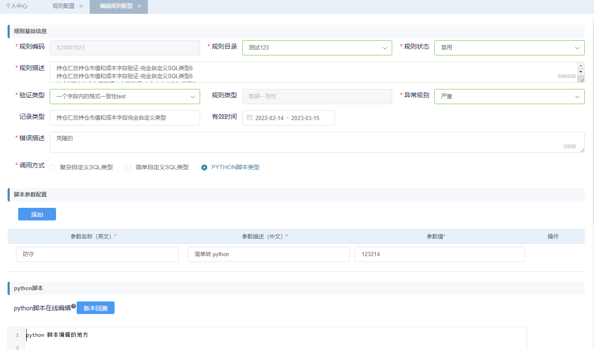

// 注意 ref绑定的值 要和data的值一样 ruleBasicInfo
```
<template>
    <div class="app-container" style="background-color: #ffffff">
        <div class="scrollerY blank-container" id="dataQualifyModify-div">
            <!-- 规则新增 -->
            <xn-collapse
                style="width: 100%"
                v-model="activeLocalparam_1"
                accordion
            >
                <xn-collapse-item name="dataQualityConfig_1">
                    <template slot="title">
                        <div>规则基础信息</div>
                    </template>
                    <div class="ruleBasicInfo">
                        <el-form
                            class="el-form"
                            style="width: 100%"
                            label-width="100px"
                            ref="ruleBasicInfo"
                            :model="ruleBasicInfo"
                            :rules="rules"
                        >
                            <el-row>
                                <el-col :span="8">
                                    <el-form-item
                                        label="规则编码"
                                        prop="qualityId"
                                    >
                                        <el-input
                                            v-model="ruleBasicInfo.qualityId"
                                            :maxlength="500"
                                            :disabled="true"
                                        />
                                    </el-form-item>
                                </el-col>
                                <el-col :span="8">
                                    <el-form-item
                                        label="规则目录"
                                        prop="catalogId"
                                    >
                                        <el-select
                                            class="filter-item"
                                            v-model="ruleBasicInfo.catalogId"
                                        >
                                            <el-option
                                                v-for="item in catalogIdList"
                                                :key="item.name"
                                                :label="item.name"
                                                :value="item.value"
                                            ></el-option>
                                        </el-select>
                                    </el-form-item>
                                </el-col>
                                <el-col :span="8">
                                    <el-form-item
                                        label="规则状态"
                                        prop="isValid"
                                    >
                                        <el-select
                                            class="filter-item"
                                            v-model="ruleBasicInfo.isValid"
                                        >
                                            <el-option
                                                v-for="item in isValidList"
                                                :key="item.enumName"
                                                :label="item.enumName"
                                                :value="item.enumCode"
                                            ></el-option>
                                        </el-select>
                                    </el-form-item>
                                </el-col>
                            </el-row>
                            <el-row>
                                <el-form-item
                                    label="规则描述"
                                    prop="qualityDesc"
                                >
                                    <el-input
                                        type="textarea"
                                        placeholder="请输入"
                                        v-model="ruleBasicInfo.qualityDesc"
                                        show-word-limit
                                        maxlength="600"
                                    >
                                    </el-input>
                                </el-form-item>
                            </el-row>
                            <el-row>
                                <el-col :span="8">
                                    <el-form-item
                                        label="验证类型"
                                        prop="verifyClass"
                                    >
                                        <el-select
                                            class="filter-item"
                                            filterable
                                            v-model="ruleBasicInfo.verifyClass"
                                            @change="verifyClassChange($event)"
                                        >
                                            <el-option
                                                v-for="item in verifyClassList"
                                                :key="item.value"
                                                :label="item.name"
                                                :value="item.value"
                                            ></el-option>
                                        </el-select>
                                    </el-form-item>
                                </el-col>
                                <el-col :span="8">
                                    <el-form-item
                                        label="规则类型"
                                        prop="ruleType"
                                    >
                                        <!-- <el-select
                                            class="filter-item"
                                            v-model="
                                                ruleBasicInfo.ruleType
                                            "
                                        >
                                            <el-option
                                                v-for="item in ruleTypeList"
                                                :key="item.ENUM_NAME"
                                                :label="item.ENUM_NAME"
                                                :value="item.ENUM_CODE"
                                            ></el-option>
                                        </el-select> -->
                                        <el-input
                                            :disabled="true"
                                            v-model="ruleBasicInfo.ruleType"
                                            :maxlength="500"
                                        />
                                    </el-form-item>
                                </el-col>
                                <el-col :span="8">
                                    <el-form-item
                                        label="异常级别"
                                        prop="exceptionClass"
                                    >
                                        <el-select
                                            class="filter-item"
                                            v-model="
                                                ruleBasicInfo.exceptionClass
                                            "
                                        >
                                            <el-option
                                                v-for="item in exceptionClassList"
                                                :key="item.enumName"
                                                :label="item.enumName"
                                                :value="item.enumCode"
                                            ></el-option>
                                        </el-select>
                                    </el-form-item>
                                </el-col>
                            </el-row>
                            <el-row>
                                <el-col :span="8">
                                    <el-form-item
                                        label="记录类型"
                                        prop="recordType"
                                    >
                                        <el-input
                                            v-model="ruleBasicInfo.recordType"
                                            :maxlength="500"
                                            placeholder="请输入"
                                        />
                                    </el-form-item>
                                </el-col>
                                <el-col :span="16">
                                    <el-form-item
                                        label="有效时间"
                                        prop="effectiveTime"
                                    >
                                        <el-date-picker
                                            value-format="yyyy-MM-dd"
                                            format="yyyy-MM-dd"
                                            @change="datePickerChange"
                                            v-model="
                                                ruleBasicInfo.effectiveTime
                                            "
                                            type="daterange"
                                            start-placeholder="开始日期"
                                            end-placeholder="结束日期"
                                            :default-time="[
                                                '00:00:00',
                                                '23:59:59',
                                            ]"
                                            unlink-panels
                                        >
                                        </el-date-picker>
                                    </el-form-item>
                                </el-col>
                            </el-row>
                            <el-row>
                                <el-col :span="24">
                                    <el-form-item
                                        label="错误描述"
                                        prop="errDesc"
                                    >
                                        <el-input
                                            type="textarea"
                                            v-model="ruleBasicInfo.errDesc"
                                            show-word-limit
                                            :maxlength="600"
                                            placeholder="请输入"
                                        />
                                    </el-form-item>
                                </el-col>
                            </el-row>
                            <el-row>
                                <el-form-item
                                    label="调用方式"
                                    prop="ruleEntryType"
                                >
                                    <el-radio-group
                                        style="margin-top: 8px"
                                        v-model="ruleBasicInfo.ruleEntryType"
                                    >
                                        <el-radio
                                            size="medium "
                                            v-for="item in ruleEntryTypeList"
                                            :key="item.enumName"
                                            :label="item.enumCode"
                                            @change="changeRadio(item.enumCode)"
                                            >{{ item.enumName }}</el-radio
                                        >
                                    </el-radio-group>
                                </el-form-item>
                            </el-row>
                        </el-form>
                    </div>
                </xn-collapse-item>
            </xn-collapse>
            <!-- SQL类型 -->
            <div>
                <div>
                    <div v-show="ruleBasicInfo.ruleEntryType === '1'">
                        <xn-collapse
                            style="width: 100%"
                            v-model="activeLocalparam_2"
                            accordion
                        >
                            <xn-collapse-item name="dataQualityConfig_2">
                                <template slot="title">
                                    <div>复杂自定义SQL类型</div>
                                </template>
                                <el-form
                                    :model="ruleComplexInfo"
                                    label-width="117px"
                                    style="width: 90%" 
                                    :rules="ruleComplexInfoRules"
                                    ref="ruleComplexInfo"
                                >
                                    <el-row>
                                        <el-col :span="8">
                                            <el-form-item
                                                label="数据源名称"
                                                prop="dbName"
                                            >
                                                <el-select
                                                    class="filter-item"
                                                    v-model="
                                                        ruleComplexInfo.dbName
                                                    "
                                                >
                                                    <el-option
                                                        v-for="item in dbNameList"
                                                        :key="item.name"
                                                        :label="item.name"
                                                        :value="item.value"
                                                    ></el-option>
                                                </el-select>
                                            </el-form-item>
                                        </el-col>
                                        <el-col :span="8">
                                            <el-form-item
                                                label="所验证表名"
                                                prop="targetTable"
                                            >
                                                <el-input
                                                    v-model="
                                                        ruleComplexInfo.targetTable
                                                    "
                                                    :maxlength="500"
                                                />
                                            </el-form-item>
                                        </el-col>
                                        <el-col :span="8">
                                            <el-form-item
                                                label="所验证表字段"
                                                prop="targetField"
                                            >
                                                <el-input
                                                    v-model="
                                                        ruleComplexInfo.targetField
                                                    "
                                                    :maxlength="500"
                                                />
                                            </el-form-item>
                                        </el-col>
                                    </el-row>
                                    <el-row>
                                        <el-col>
                                            <el-form-item
                                                label="SQL内容"
                                                label-width="104px"
                                                prop="comSqlInfo.cdefSql"
                                            >
                                                <i
                                                    class="el-icon-question"
                                                    @click="
                                                        toggleDialog(
                                                            'fdefDialogShow',
                                                            fdefDialogShow
                                                        )
                                                    "
                                                    style="
                                                        position: absolute;
                                                        left: -11px;
                                                        top: 1px;
                                                    "
                                                ></i>
                                                <!-- <el-form :model="comSqlInfo" :rules="rulecomSql" ref="rulecomSql"> -->
                                                <!-- <span slot="label" style="position:absolute;left: -107px;top: 20px;"> -->
                                                <!-- <i
                                                    class="dialogInfoSql iconfont icon-wenhao"

                                                /> -->

                                                <span
                                                    class="dialogInfo"
                                                    @click="
                                                        toggleDialog(
                                                            'ruleTypeDialogShow',
                                                            ruleTypeDialogShow
                                                        )
                                                    "
                                                    style="
                                                        color: #fe0909;
                                                        position: absolute;
                                                        left: -83px;
                                                        top: 20px;
                                                        font-size: 10px;
                                                    "
                                                    >查看Log表说明</span
                                                >
                                                <!-- </span> -->
                                                <el-row>
                                                    <el-col
                                                        :span="24"
                                                        style="
                                                            margin-left: 10px;
                                                        "
                                                    >
                                                        <textarea
                                                            v-model="
                                                                ruleComplexInfo
                                                                    .comSqlInfo
                                                                    .cdefSql
                                                            "
                                                            ref="comSqlcodearea"
                                                            maxlength="4000"
                                                            rows="8"
                                                            style="
                                                                margin-left: 10px;
                                                                width: 100%;
                                                            "
                                                        ></textarea>
                                                    </el-col>
                                                </el-row>
                                                <!-- </el-form> -->
                                            </el-form-item>
                                        </el-col>
                                    </el-row>
                                    <el-row>
                                        <div
                                            style="margin-left: 10px"
                                            class="user-container header-search"
                                        >
                                            <el-button
                                                type="primary"
                                                @click="
                                                    submitForm(
                                                        ruleBasicInfo.ruleEntryType
                                                    )
                                                "
                                                :showLoading="false"
                                                >保存</el-button
                                            >
                                            <el-button
                                                type="info"
                                                @click="
                                                    indexDataQuality(
                                                        ruleBasicInfo.ruleEntryType
                                                    )
                                                "
                                                >SQL变量替换</el-button
                                            >
                                        </div>
                                    </el-row>
                                </el-form>
                            </xn-collapse-item>
                        </xn-collapse>
                    </div>
                    <div v-show="ruleBasicInfo.ruleEntryType === '2'">
                        <xn-collapse
                            style="width: 100%"
                            v-model="activeLocalparam_3"
                            accordion
                        >
                            <xn-collapse-item name="dataQualityConfig_3">
                                <template slot="title">
                                    <div>简单自定义SQL类型</div>
                                </template>
                                <el-form
                                    ref="ruleSimpleInfo"
                                    :model="ruleSimpleInfo"
                                    label-width="117px"
                                    style="width: 90%"
                                    :rules="ruleSimpleInfoRules"
                                >
                                    <el-row>
                                        <el-col :span="8">
                                            <el-form-item
                                                label="数据源名称"
                                                prop="dbName"
                                            >
                                                <el-select
                                                    class="filter-item"
                                                    v-model="
                                                        ruleSimpleInfo.dbName
                                                    "
                                                >
                                                    <el-option
                                                        v-for="item in dbNameList"
                                                        :key="item.name"
                                                        :label="item.name"
                                                        :value="item.value"
                                                    ></el-option>
                                                </el-select>
                                            </el-form-item>
                                        </el-col>
                                        <el-col :span="8">
                                            <el-form-item
                                                label="所验证表名"
                                                prop="targetTable"
                                            >
                                                <el-input
                                                    v-model="
                                                        ruleSimpleInfo.targetTable
                                                    "
                                                    :maxlength="500"
                                                />
                                            </el-form-item>
                                        </el-col>
                                        <el-col :span="8">
                                            <el-form-item
                                                label="所验证表字段"
                                                prop="targetField"
                                            >
                                                <el-input
                                                    v-model="
                                                        ruleSimpleInfo.targetField
                                                    "
                                                    :maxlength="500"
                                                />
                                            </el-form-item>
                                        </el-col>
                                    </el-row>
                                    <el-row>
                                        <el-col>
                                            <el-form-item
                                                label="SQL内容"
                                                label-width="104px"
                                                prop="simpSqlInfo.sdefSql"
                                            >
                                                <i
                                                    class="el-icon-question"
                                                    @click="
                                                        toggleDialog(
                                                            'simpDialogShow',
                                                            simpDialogShow
                                                        )
                                                    "
                                                    style="
                                                        position: absolute;
                                                        left: -11px;
                                                        top: 1px;
                                                    "
                                                />
                                                <!-- <i
                                                    class="dialogInfoSql iconfont icon-wenhao"
                                                    @click="
                                                        toggleDialog(
                                                            'simpDialogShow',
                                                            simpDialogShow
                                                        )
                                                    "
                                                    style="
                                                        position: absolute;
                                                        left: -11px;
                                                        top: 1px;
                                                    "
                                                /> -->
                                                <span
                                                    class="dialogInfo"
                                                    @click="
                                                        toggleDialog(
                                                            'ruleTypeDialogShow',
                                                            ruleTypeDialogShow
                                                        )
                                                    "
                                                    style="
                                                        color: #fe0909;
                                                        position: absolute;
                                                        left: -83px;
                                                        top: 20px;
                                                        font-size: 10px;
                                                    "
                                                    >查看Log表说明</span
                                                >
                                                <el-row
                                                    style="margin-left: 10px"
                                                >
                                                    <el-col :span="24">
                                                        <textarea
                                                            v-model="
                                                                ruleSimpleInfo
                                                                    .simpSqlInfo
                                                                    .sdefSql
                                                            "
                                                            ref="simpSqlcodearea"
                                                            maxlength="4000"
                                                            rows="8"
                                                            style="width: 100%"
                                                        ></textarea>
                                                    </el-col>
                                                </el-row>
                                            </el-form-item>
                                        </el-col>
                                    </el-row>
                                    <el-row>
                                        <el-col>
                                            <el-form-item
                                                label-width="200"
                                                label="验证关系：    SOURCE_VALUE(源值)"
                                                prop="operaRel1"
                                            >
                                                <el-select
                                                    class="filter-item"
                                                    v-model="
                                                        ruleSimpleInfo.operaRel1
                                                    "
                                                >
                                                    <el-option
                                                        v-for="item in operaRelList"
                                                        :key="item.enumCode"
                                                        :label="item.enumName"
                                                        :value="item.enumCode"
                                                    ></el-option>
                                                </el-select>
                                                <span
                                                    style="
                                                        font-weight: 500;
                                                        font-size: 15px;
                                                        color: #0d1446 ;
                                                    "
                                                    >TAGET_VALUE(目标值)</span
                                                >
                                            </el-form-item>
                                        </el-col>
                                    </el-row>
                                    <el-row>
                                        <div
                                            style="margin-left: 10px"
                                            class="user-container header-search"
                                        >
                                            <el-button
                                                type="primary"
                                                @click="
                                                    submitForm(
                                                        ruleBasicInfo.ruleEntryType
                                                    )
                                                "
                                                :showLoading="false"
                                                >保存</el-button
                                            >
                                            <el-button
                                                type="info"
                                                @click="
                                                    indexDataQuality(
                                                        ruleBasicInfo.ruleEntryType
                                                    )
                                                "
                                                >SQL变量替换</el-button
                                            >
                                        </div>
                                    </el-row>
                                </el-form>
                            </xn-collapse-item>
                        </xn-collapse>
                    </div>
                    <div v-show="ruleBasicInfo.ruleEntryType === '3'">
                        <el-row>
                            <xn-collapse
                                style="width: 100%"
                                v-model="activeLocalparam_5"
                                accordion
                            >
                                <xn-collapse-item name="dataQualityConfig_5">
                                    <template slot="title">
                                        <div>脚本参数配置</div>
                                    </template>
                                  <div
                                    class="user-container header-search"
                                    style="margin-bottom: 0px;padding-bottom: 0px;padding-top: 0px"
                                  >
                                    <el-button
                                      type="primary"
                                      @click="addFunc()"
                                    >添加</el-button
                                    >
                                  </div>

                                  <el-form
                                        :model="tableForm"
                                        ref="xnTableForm"
                                    >
                                        <el-table
                                            :data="tableForm.tableData"
                                            ref="xnTable"
                                            :showPagination="false"
                                        >
                                            <el-row :gutter="2">
                                              <el-col :span="3">
                                                <el-table-column
                                                  label="操作"
                                                  width="150"
                                                  align="center"
                                                >
                                                  <template
                                                    slot-scope="scope"
                                                  >
                                                            <span
                                                              v-show="
                                                                    scope.$index >
                                                                    0
                                                                "
                                                              @click="
                                                                    delFormula(
                                                                        scope
                                                                    )
                                                                "
                                                              type="text"
                                                              size="small"
                                                            ><span
                                                              style="
                                                                        pointer: cusor;
                                                                        color: #68a5c1;
                                                                        cursor: pointer;
                                                                    "
                                                            >删除</span
                                                            >
                                                            </span>
                                                  </template>
                                                </el-table-column>
                                              </el-col>
                                                <el-col :span="7">
                                                    <el-table-column
                                                        label="参数名称（英文）"
                                                        align="center"
                                                        showOverflowTooltip
                                                        label-class-name="must"
                                                    >
                                                        <template
                                                            slot-scope="scope"
                                                        >
                                                            <el-form-item
                                                                :prop="
                                                                    'tableData.' +
                                                                    scope.$index +
                                                                    '.parmName'
                                                                "
                                                                :rules="
                                                                    tableRules.parmName
                                                                "
                                                            >
                                                                <el-input
                                                                    maxlength="30"
                                                                    v-model="
                                                                        scope
                                                                            .row
                                                                            .parmName
                                                                    "
                                                                    placeholder="请输入"
                                                                ></el-input>
                                                            </el-form-item>
                                                        </template>
                                                    </el-table-column>
                                                </el-col>

                                                <el-col :span="7">
                                                    <el-table-column
                                                        label="参数描述（中文）"
                                                        align="center"
                                                        showOverflowTooltip
                                                        label-class-name="must"
                                                    >
                                                        <template
                                                            slot-scope="scope"
                                                        >
                                                            <el-form-item
                                                                :prop="
                                                                    'tableData.' +
                                                                    scope.$index +
                                                                    '.parmDesc'
                                                                "
                                                                :rules="
                                                                    tableRules.parmDesc
                                                                "
                                                            >
                                                                <el-input
                                                                    maxlength="30"
                                                                    v-model="
                                                                        scope
                                                                            .row
                                                                            .parmDesc
                                                                    "
                                                                    placeholder="请输入"
                                                                ></el-input>
                                                            </el-form-item>
                                                        </template>
                                                    </el-table-column>
                                                </el-col>
                                                <el-col :span="7">
                                                    <el-table-column
                                                        label="参数值"
                                                        align="center"
                                                        showOverflowTooltip
                                                        label-class-name="must"
                                                    >
                                                        <template
                                                            slot-scope="scope"
                                                        >
                                                            <el-form-item
                                                                :prop="
                                                                    'tableData.' +
                                                                    scope.$index +
                                                                    '.parmValue'
                                                                "
                                                                :rules="
                                                                    tableRules.parmValue
                                                                "
                                                            >
                                                                <el-input
                                                                    maxlength="30"
                                                                    v-model="
                                                                        scope
                                                                            .row
                                                                            .parmValue
                                                                    "
                                                                    placeholder="请输入"
                                                                ></el-input>
                                                            </el-form-item>
                                                        </template>
                                                    </el-table-column>
                                                </el-col>

                                            </el-row>
                                        </el-table>
                                    </el-form>
                                </xn-collapse-item>
                            </xn-collapse>
                        </el-row>
                        <xn-collapse
                            style="width: 100%"
                            v-model="activeLocalparam_4"
                            accordion
                        >
                            <xn-collapse-item name="dataQualityConfig_4">
                                <template slot="title">
                                    <div>python脚本</div>
                                </template>
                                <el-form
                                    label="python脚本在线编辑"
                                    ref="rulepythonInfo"
                                    :model="rulepythonInfo"
                                    style="width: 90%"
                                    :rules="rulepythonInfoRules"
                                >
                                    <el-row>
                                        <el-col>
                                            <div
                                                class="user-container header-search"
                                            >
                                                <span
                                                    style="
                                                        color: #0d1446;
                                                        font-size: 15px;
                                                        font-weight: 500;
                                                    "
                                                    >python脚本在线编辑</span
                                                >
                                              <i
                                                class="el-icon-question"
                                                @click="
                                                        toggleDialog(
                                                            'pythonDialogShow',
                                                            pythonDialogShow
                                                        )
                                                    "
                                                style="
                                                        position: absolute;
                                                        left: 150px;
                                                        top: 15px;
                                                    "
                                              />
                                                <el-button
                                                    type="primary"
                                                    @click="
                                                        versionHistoryList()
                                                    "
                                                    >版本回溯</el-button
                                                >
                                                <!-- <button type="button"  @click="versionHistoryList()" class="el-button el-button--primary el-button--small is-plain">
                                        <span @click="toggleDialog('versionHistoryShow',versionHistoryShow)">版本回溯</span>
                                        </button> -->
                                            </div>
                                            <el-form-item
                                                prop="pythonInfo.glueSource"
                                            >
                                                <el-row>
                                                    <el-col :span="24">
                                                        <textarea
                                                            v-model="
                                                                rulepythonInfo
                                                                    .pythonInfo
                                                                    .glueSource
                                                            "
                                                            ref="codearea"
                                                            maxlength="4000"
                                                            rows="8"
                                                            style="width: 100%"
                                                        ></textarea>
                                                    </el-col>
                                                </el-row>
                                            </el-form-item>
                                        </el-col>
                                        <el-col>
                                            <el-form-item
                                                prop="glueRemark"
                                                label="脚本描述"
                                            >
                                                <el-input
                                                    type="textarea"
                                                    v-model="
                                                        rulepythonInfo.glueRemark
                                                    "
                                                    :maxlength="600"
                                                    :rows="2"
                                                />
                                            </el-form-item>
                                        </el-col>
                                    </el-row>

                                    <el-row>
                                        <div
                                            style="margin-left: 10px"
                                            class="user-container header-search"
                                        >
                                            <el-button
                                                type="primary"
                                                @click="
                                                    submitForm(
                                                        ruleBasicInfo.ruleEntryType
                                                    )
                                                "
                                                :showLoading="false"
                                                >保存</el-button
                                            >
                                            <el-button
                                                type="info"
                                                @click="
                                                    indexDataQuality(
                                                        ruleBasicInfo.ruleEntryType
                                                    )
                                                "
                                                >SQL变量替换</el-button
                                            >
                                        </div>
                                    </el-row>
                                </el-form>
                            </xn-collapse-item>
                        </xn-collapse>
                    </div>
                </div>
            </div>
            <!-- 弹出框 -->
            <xn-dialog
                title="查看LOG表说明"
                width="800px"
                height="150px"
                :show.sync="ruleTypeDialogShow"
                @cancelButton="
                    toggleDialog('ruleTypeDialogShow', ruleTypeDialogShow)
                "
            >
                <span slot="dialog-form">
                    <pre style="text-align: left">
                <span style="color: red">R_VALIDATION_JOB_LOGS</span>    --  数据质量Log表

                字段信息如下：
                <span style="color: red">SK_PRIMARY_KEY</span>           -- sequence生成,sql语句中写SEQ_R_VALIDATION_JOB_LOGS.NEXTVAL
                <span
                style="color: red"
                >LOG_DATE</span>                 -- 日志日期(系统时间)，格式SYSDATE, 'yyyymmdd'
                        <span style="color: red">DATA_SOURCE</span>              -- 来源系统, 如 S10，S20等
                        <span style="color: red">JOB_NAME</span>                 -- 固定写VALID_RULES ,数据质量程序
                        <span style="color: red">BUSS_DATE</span>                -- 业务日期如果没有业务日期就和log_date相等
                        <span style="color: red">SOURCE_TABLE_NAME</span>        -- 源表名
                        <span style="color: red">SOURCE_COLUMN_NAME</span>       -- 源列名
                        <span style="color: red">SOURCE_VALUE</span>             -- 源值
                        <span style="color: red">TARGET_TABLE_NAME</span>        -- 所需验证表名
                        <span style="color: red">TARGET_COLUMN_NAME</span>       -- 所需验证列名
                        <span style="color: red">TARGET_VALUE</span>             -- 所需验证数据值
                        <span style="color: red">STATUS</span>                   -- 1是正常，2是异常
                        <span style="color: red">REMARKS</span>                  -- 自定义备注信息
                        <span style="color: red">SYNTIMESTAMP</span>             -- 当前时间戳
                        <span style="color: red">SK_F_VERIFICATION</span>        -- 验证方案ID
                        <span style="color: red">VERIFICATION_NAME</span>        -- 验证方案名称
                        <span style="color: red">VERIFICATION_TOTAL_NUM</span>   -- 报送总数(根据sql获取验证总条数)
                        <span style="color: red">ISSUE_NUM</span>                -- 问题数(根据sql获取问题总条数)
                        <span style="color: red">ERR_DESC</span>                 -- 错误描述
                        <span style="color: red">JOIN_KEYS_INFO</span>           -- 为空，无需填写
                        <span style="color: red">CREATE_DT</span>                -- 记录插入时间，当前时间戳
                        <span style="color: red">UPDATE_DT</span>                -- 记录更新时间，当前时间戳
                        <span style="color: red">RULE_ENTRY_TYPE</span>          -- 规则入口方式 (1-复杂自定义SQL类型, 2- 简单自定义SQL类型)
                        <span style="color: red">RULE_TYPE</span>                -- 规则分类 (01-数据完整性,02-数据完备性,03-数据有效性,04-数据及时性,05-数据一致性)
                        <span
                style="color: red"
                >SK_F_PROD</span>                -- 产品代理外键,如 PD07000026
                        <span style="color: red">RECORD_TYPE</span>              -- 记录类型,中文描述，数据质量记录汇总目录， 如"持仓汇总表数据验证"
                        <span style="color: red">START_DT</span>                 -- 开始日期，由变量传入   &#x24;{start_dt}
                        <span style="color: red">END_DT</span>                   -- 结束日期，由变量传入   &#x24;{end_dt}
                        </pre>
                </span>
            </xn-dialog>
            <!-- 复杂SQL模板 -->
            <xn-dialog
                title="复杂SQL模板"
                width="800px"
                height="150px"
                :show.sync="fdefDialogShow"
                @cancelButton="toggleDialog('fdefDialogShow', fdefDialogShow)"
            >
                <span slot="dialog-form">
                    <div>
                        <pre style="text-align: left">
                <p style="color: red">
                <b>使用说明</b>
                    --SQL必须包含以下字段：
                    DATA_SOURCE              -- (可为空) 来源系统, 如 S10，S20等
                    BUSS_DATE                -- 业务日期如果没有业务日期就和log_date相等
                    SOURCE_TABLE_NAME        -- (可为空) 源表名
                    SOURCE_COLUMN_NAME       -- (可为空) 源列名
                    SOURCE_VALUE             -- 源值
                    TARGET_TABLE_NAME        -- 所需验证表名
                    TARGET_COLUMN_NAME       -- 所需验证列名
                    TARGET_VALUE             -- 所需验证数据值
                    STATUS                   -- 状态，根据逻辑判断
                    REMARKS                  -- 自定义备注信息
                    VERIFICATION_TOTAL_NUM   -- 报送总数(根据sql获取验证总条数)
                    ISSUE_NUM                -- 问题数(根据sql获取问题总条数)
                    SK_F_PROD                -- 产品代理外键,如 PD07000026

                    --参数：
                    &#x24;{start_dt}              -- 开始日期
                    &#x24;{end_dt}                -- 结束日期
                </p>
                    <p style="color: red">
                    <b>情景说明</b>
                    <b>情形案例：
                    存在不符合条件的记录：</b>
                    ----情景说明：找出持仓汇总表市值与成本计算误差大于0.0001。
                    ---其他信息：
                    /*
                        '持仓汇总持仓市值和成本字段验证-完全自定义SQL类型' AS VERIFICATION_NAME,
                        '持仓汇总表市值与成本计算误差大于0.0001' AS ERR_DESC,
                        '持仓汇总持仓市值和成本字段完全自定义类型' AS RECORD_TYPE
                    */
                    </p>
                    SELECT
                        'S20' AS DATA_SOURCE,
                        TRADE_DT AS BUSS_DATE, --如果没有业务日期就和LOG_DATE相等
                        'T10_BALANCESHEET' AS SOURCE_TABLE_NAME, --源表名
                        'TOTAL_OWNERS_MKT_EQUITY' AS SOURCE_COLUMN_NAME, --源列名
                        SOURCE_VALUE, --源数据值
                        'C12_PROD_HOLD_SUMMARY' AS TARGET_TABLE_NAME, --目标表名
                        TARGET_COLUMN_NAME, --目标列名
                        TARGET_VALUE, --目标数据值
                        (CASE
                            WHEN SOURCE_VALUE = 0 THEN
                            DECODE(TARGET_VALUE, 0, '1', '2')
                            WHEN ABS(TARGET_VALUE / SOURCE_VALUE - 1) &lt;= 0.0001 THEN
                            '1'
                            ELSE
                            '2'
                        END) AS STATUS,
                        -- (SUM(持仓证券市值*借贷方向)/资产净值 OR SUM(持仓证券成本*借贷方向)/资产净值) 误差小于等于0.01%为正常,否则为不正常。
                        PROD_CODE || ' ' || TO_CHAR((CASE
                                                        WHEN SOURCE_VALUE = 0 THEN
                                                        DECODE(TARGET_VALUE, 0, 1, NULL)
                                                        ELSE
                                                        ROUND(TARGET_VALUE / SOURCE_VALUE, 6)
                                                    END) * 100) || '%' AS REMARKS,
                        '1' AS VERIFICATION_TOTAL_NUM,
                        (CASE
                            WHEN SOURCE_VALUE = 0 THEN
                            DECODE(TARGET_VALUE, 0, '1', '2')
                            WHEN ABS(TARGET_VALUE / SOURCE_VALUE - 1) &lt;= 0.0001 THEN
                            '0'
                            ELSE
                            '1'
                        END) AS ISSUE_NUM,
                        PROD_CODE AS SK_F_PROD,
                        &#x24;{start_dt} AS START_DT,
                        &#x24;{end_dt} AS END_DT
                    FROM (SELECT B.PROD_CODE,
                                B.TRADE_DT,
                                B.SOURCE_VALUE,
                                (CASE
                                    WHEN ABS(NVL(A.TARGET_VALUE1, 0) - B.SOURCE_VALUE) &lt;=
                                        ABS(NVL(A.TARGET_VALUE2, 0) - B.SOURCE_VALUE) THEN
                                    'LOCC_POSI_MKT_VAL'
                                    ELSE
                                    'LOCC_POSITION_COST'
                                END) AS TARGET_COLUMN_NAME,
                                (CASE
                                    WHEN ABS(NVL(A.TARGET_VALUE1, 0) - B.SOURCE_VALUE) &lt;=
                                        ABS(NVL(A.TARGET_VALUE2, 0) - B.SOURCE_VALUE) THEN
                                    NVL(A.TARGET_VALUE1, 0)
                                    ELSE
                                    NVL(A.TARGET_VALUE2, 0)
                                END) AS TARGET_VALUE
                            FROM --源表明细
                                (SELECT T.SK_F_PROD PROD_CODE,
                                        TRADE_DT,
                                        ABS(T.TOTAL_OWNERS_MKT_EQUITY) AS SOURCE_VALUE
                                    FROM T10_BALANCESHEET T
                                    WHERE TRADE_DT BETWEEN &#x24;{start_dt} AND &#x24;{end_dt}) B
                            INNER JOIN
                            --目标表明细
                            (SELECT SK_F_PROD PROD_CODE,
                                    POSITION_DT TRADE_DT,
                                    ABS(SUM(NVL(LOCC_POSI_MKT_VAL, 0) *
                                            DECODE(LENDING_DIRECTION, '借方', 1, -1))) AS TARGET_VALUE1,
                                    ABS(SUM(NVL(LOCC_POSITION_COST, 0) *
                                            DECODE(LENDING_DIRECTION, '借方', 1, -1))) AS TARGET_VALUE2
                            FROM C12_PROD_HOLD_SUMMARY
                            WHERE POSITION_DT BETWEEN &#x24;{start_dt} AND &#x24;{end_dt}
                            GROUP BY SK_F_PROD, POSITION_DT) A ON A.PROD_CODE = B.PROD_CODE
                                                            AND A.TRADE_DT = B.TRADE_DT)
                </pre>
                    </div>
                </span>
            </xn-dialog>
            <!-- 简单SQL模板 -->
            <xn-dialog
                title="简单SQL模板"
                width="800px"
                height="150px"
                :show.sync="simpDialogShow"
                @cancelButton="toggleDialog('simpDialogShow', simpDialogShow)"
            >
                <span slot="dialog-form">
                    <pre>
            <p style="color: red">
            <b>使用说明</b>
            --源表必须为A，目标表必须为B
            --必须包含以下字段：
            BUSS_DATE      -- 业务日期（格式为 yyyyMMdd）
            SK_F_PROD      -- 产品代理键 或 证券代理键 或 主键字段
            SOURCE_VALUE   -- 源值
            TARGET_VALUE   -- 目标值
            CNT            -- 记录数
            REMARKS        -- 备注字段（根据实际情况选填）
            --参数：
            ${owner_name}   -- 表前缀
            ${start_dt}     -- 开始日期
            ${end_dt}       -- 结束日期
            </p>
            <p style="color: red">
            <b>情景说明</b>
            <b>1.情形一：</b>
            <b>1.1 两张表做勾稽，比对条数，简单情形</b>
              ---其他信息：
            /*
                '信用交易账户条数验证' AS VERIFICATION_NAME,
                '信用交易账户条数验证不匹配' AS ERR_DESC,
                '账户类数据验证' AS RECORD_TYPE
            */
             -- 标@ 地方为实际情况修改的地方，其他地方不需做调整</p>
                SELECT from_unixtime(unix_timestamp(), 'yyyyMMdd') AS BUSS_DATE,
                    null AS SK_F_PROD,
                    A.SOURCE_VALUE AS SOURCE_VALUE,
                    B.TARGET_VALUE AS TARGET_VALUE,
                    1 AS CNT
                      FROM (select COUNT(*) SOURCE_VALUE   <i style="color: red">-- @源表sql</i>
                     from (
                       select CUACCT_CODE, STKBD, TRDACCT
                       from ${owner_name}.S102_STK_TRDACCT
                       where TRDACCT_EXCLS in ('2', '3', '8')
                      union
                      select DFT_ACC, BOARD, SECU_ACC
                      from ${owner_name}.S102_SECU_ACC_RZRQ) t) A,
                      (select COUNT(*) TARGET_VALUE    <i style="color: red">-- @目标表sql</i>
                       from ${owner_name}.T03_CRED_TRD_ACC) B
             <p style="color: red">
              <b>1.2 两张表做勾稽，比对条数，复杂情形</b>
            ----情景说明：对比估值表和产品行情表的条数，估值表中有数据，行情表中也必须有数据，否则就是行情表中数据缺失。
            ---其他信息：
            /*
                '产品行情条数验证' AS VERIFICATION_NAME,
                '产品行情源表与目标表数据不匹配' AS ERR_DESC,
                '产品行情数据量' AS RECORD_TYPE
            */'账户类数据验证' AS RECORD_TYPE
            */
             -- 标@ 地方为实际情况修改的地方，其他地方不需做调整</p>
                SELECT B.TRADE_DT     AS BUSS_DATE,
                    B.SK_F_PROD    AS SK_F_PROD,
                    A.SOURCE_VALUE AS SOURCE_VALUE,
                    B.TARGET_VALUE AS TARGET_VALUE,
                    1              AS CNT
                      FROM (SELECT COUNT(*) SOURCE_VALUE, POSITION_DT, SK_F_PROD   <i style="color: red">-- @源表sql</i>
                        FROM T10_VALUTION_DETAIL
                        WHERE POSITION_DT BETWEEN ${start_dt} AND ${end_dt}
                        AND SUBSTR(SUBJ_CODE, 1, 3) = '702'
                        GROUP BY SK_F_PROD, POSITION_DT) A
                      left join (SELECT COUNT(*) TARGET_VALUE, TRADE_DT, SK_F_PROD <i style="color: red">-- @目标表sql</i>
                            FROM C02_PROD_QUOTATION
                            WHERE TRADE_DT BETWEEN ${start_dt} AND ${end_dt}
                            GROUP BY SK_F_PROD, TRADE_DT) B
                    on A.POSITION_DT = B.TRADE_DT
                AND A.SK_F_PROD = B.SK_F_PROD
            <p
  style="color: red"
>
            <b>2.情形二：
            存在主键唯一性验证异常：</b>
           ----情景说明：主键重复的记录。
           ---其他信息：
            /*
                '客户OTC产品持仓表主键唯一性验证' AS VERIFICATION_NAME,
                '客户OTC产品持仓表主键唯一性验证错误' AS ERR_DESC,
                '持仓配置类数据验证' AS RECORD_TYPE
            */
            -- 标@ 地方为实际情况修改的地方，其他地方不需做调整</p>
                SELECT from_unixtime(unix_timestamp(), 'yyyyMMdd') AS BUSS_DATE,
                   concat(BUSI_DT, '|', CUST_CD, '|', CPTL_ACC, '|', PD_INCD) AS SK_F_PROD, <i style="color: red">-- @拼主键字段</i>
                   NULL AS SOURCE_VALUE,
                   NULL AS TARGET_VALUE,
                   1 AS CNT,
                   concat('BUSI_DT|CUST_CD|CPTL_ACC|PD_INCD = ',
                           BUSI_DT,'|',
                           CUST_CD,'|',
                           CPTL_ACC,'|',
                          PD_INCD) as REMARKS -- @拼主键字段
                  -- 获取有问题数据详细信息
                       from (select BUSI_DT, CUST_CD, CPTL_ACC, PD_INCD, <i style="color: red">-- @获取有问题SQL，count(*) > 1</i>
                       COUNT(*) as TARGET_VALUE
                       from ${owner_name}.T09_CUST_OTC_PD_HLDP
                       where BUSI_DT between '${start_dt}' and '${end_dt}'
                       group by BUSI_DT, CUST_CD, CPTL_ACC, PD_INCD
                       having count(*) > 1) A
                 UNION ALL
                 -- 获取无问题数据条数
                SELECT from_unixtime(unix_timestamp(), 'yyyyMMdd') AS BUSS_DATE,
                 NULL AS SK_F_PROD,
                 1 AS SOURCE_VALUE,
                 1 AS TARGET_VALUE,
                 FINE_COUNT AS CNT,
                 NULL as REMARKS
                 from (select BUSI_DT, CUST_CD, CPTL_ACC, PD_INCD, <i style="color: red">-- @获取无问题SQL，count(*) = 1</i>
                          COUNT(*) as FINE_COUNT
                         from ${owner_name}.T09_CUST_OTC_PD_HLDP
                         where BUSI_DT between '${start_dt}' and '${end_dt}'
                         group by BUSI_DT, CUST_CD, CPTL_ACC, PD_INCD
                         having count(*) = 1) B
            <p
  style="color: red"
>
            <b> 3.情形三：
            存在不符合条件的记录：</b>
            ----情景说明：找出具体字段不符合条件的记录。
            ---其他信息：
            /*
                '证券适当性匹配结果产品风险级别枚举异常验证' AS VERIFICATION_NAME,
                '证券适当性匹配结果产品风险级别枚举异常验证错误' AS ERR_DESC,
                '非交易事件类数据验证' AS RECORD_TYPE
            */
            -- 标@ 地方为实际情况修改的地方，其他地方不需做调整</p>
              SELECT from_unixtime(unix_timestamp(), 'yyyyMMdd') AS BUSS_DATE,
                  concat(REC_JOUR, '|', TRD_DT, '|', CUST_CD) AS SK_F_PROD,  <i style="color: red">-- @拼主键字段</i>
                  NULL AS SOURCE_VALUE,
                  NULL AS TARGET_VALUE,
                  1 AS CNT,
                  concat('PD_RISK_GRAD = ', A.PD_RISK_GRAD) as REMARKS   <i style="color: red">-- @需验证字段</i>
               -- 获取有问题数据详细信息
                    from (select *                                <i style="color: red">-- @获取有问题数据详细信息SQL</i>
                    from ${owner_name}.T05_SCR_APPR_MTCH_RSLT
                    where PD_RISK_GRAD is null
                    and TRD_DT between '${start_dt}' and '${end_dt}') A
               UNION ALL
             -- 获取无问题数据条数
               SELECT from_unixtime(unix_timestamp(), 'yyyyMMdd') AS BUSS_DATE,
                  NULL AS SK_F_PROD,
                  1 AS SOURCE_VALUE,
                  1 AS TARGET_VALUE,
                  FINE_COUNT AS CNT,
                  NULL as REMARKS
               from (select (total_count - issue_count) as FINE_COUNT
                      FROM (select count(*) total_count        <i style="color: red">-- @获取验证全量数据条数SQL</i>
                         from ${owner_name}.T05_SCR_APPR_MTCH_RSLT
                         where TRD_DT between '${start_dt}' and '${end_dt}') m, -- 获取验证全量数据条数
                      (select count(*) issue_count             <i style="color: red">-- @获取有问题数据条数SQL</i>
                         from ${owner_name}.T05_SCR_APPR_MTCH_RSLT
                         where PD_RISK_GRAD is null
                         and TRD_DT between '${start_dt}' and '${end_dt}') n -- 获取有问题数据条数
                       ) B
                                  <p
                                    style="color: red"
                                  >
            <b> 4.情形四：
            两张表做勾稽，比对条数，复杂情形</b>
            ---情景说明：单张表做勾稽，比对数值，复杂情形. 注意目标值和来源值得对比关系。
            ---说明：(SUM(持仓证券市值*借贷方向)/资产净值 OR SUM(持仓证券成本*借贷方向)/资产净值) 误差小于等于0.01%为正常,否则为不正常。
            ---其他信息：
            /*
                '持仓汇总持仓市值和成本字段验证' AS VERIFICATION_NAME,
                '持仓汇总表市值与成本计算误差大于0.0001' AS ERR_DESC,
                '持仓汇总持仓市值和成本字段' AS RECORD_TYPE
            */</p>
               SELECT SK_F_PROD as SK_F_PROD,
                    POSITION_DT as BUSS_DATE,
                    abs(MAX(PCT) - 1) as SOURCE_VALUE,
                    0.01 as TARGET_VALUE,
                    1 as CNT
                FROM (SELECT A.MKT_VAL / B.TOTAL_OWNERS_MKT_EQUITY AS PCT,
                            A.SK_F_PROD,
                            A.POSITION_DT
                        FROM (SELECT ABS(SUM(NVL(LOCC_POSI_MKT_VAL, 0) *
                                            DECODE(LENDING_DIRECTION, '借方', 1, -1))) MKT_VAL,
                                    SK_F_PROD,
                                    POSITION_DT
                                FROM C12_PROD_HOLD_SUMMARY
                                WHERE POSITION_DT BETWEEN ${start_dt} AND ${end_dt}
                                GROUP BY SK_F_PROD, POSITION_DT) A
                        LEFT JOIN T10_BALANCESHEET B
                            ON A.SK_F_PROD = B.SK_F_PROD
                        AND A.POSITION_DT = B.TRADE_DT
                        UNION ALL
                        SELECT A.MKT_VAL / B.TOTAL_OWNERS_EQUITY  AS PCT,
                            A.SK_F_PROD,
                            A.POSITION_DT
                        FROM (SELECT ABS(SUM(NVL(LOCC_POSITION_COST, 0) *
                                            DECODE(LENDING_DIRECTION, '借方', 1, -1))) MKT_VAL,
                                    SK_F_PROD,
                                    POSITION_DT
                                FROM C12_PROD_HOLD_SUMMARY
                                WHERE POSITION_DT BETWEEN ${start_dt} AND ${end_dt}
                                GROUP BY SK_F_PROD, POSITION_DT) A
                        LEFT JOIN T10_BALANCESHEET B
                            ON A.SK_F_PROD = B.SK_F_PROD
                        AND A.POSITION_DT = B.TRADE_DT)
                GROUP BY SK_F_PROD, POSITION_DT
            </pre>
                </span>
            </xn-dialog>
          <xn-dialog
            title="PYTHON模板"
            width="800px"
            height="150px"
            :show.sync="pythonDialogShow"
            @cancelButton="toggleDialog('fdefDialogShow', fdefDialogShow)"
          >
                <span slot="dialog-form">
                    <div>
                        <pre style="text-align: left">
      <p style="color: red">#跨源条数对比</p>
                import engine

      <p style="color: red">#源表sql,必须包含SOURCE_VALUE</p>
                SOURCE_SQL="""
                           select count(*) SOURCE_VALUE from T10_BALANCESHEET
                           """
      <p style="color: red">#目标表sql,必须包含TARGET_VALUE</p>
                TARGT_SQL="""
                           SELECT COUNT(*) TARGET_VALUE FROM c12_voucher_detail_summary2
                          """

                def execute(gz_id, system_param, params):
                    """
                    :param gz_id:   <i style="color: red">规则id</i>
                    :param system_param: <i style="color: red">系统参数</i>
                    :param params:  <i style="color: red">调度参数</i>
                    :return:
                    """
                <p style="color: red">#获取Engine对象，固定写法</p>
                    engin = engine.Engine()
                    """
                    :param sql:   <i style="color: red">执行的sql</i>
                    :param table_name: <i style="color: red">验证的表明</i>
                    :param source:  <i style="color: red">配置文件数据源名称</i>
                    :return:
                    """
                    engin.excute_count_sql(SOURCE_SQL, "ASSIGN_SN","DWH_CONNECTION")
                    engin.excute_count_sql(TARGT_SQL,"c12_voucher_detail_summary2", "xn_impala")
                <p style="color: red">#执行条数对比，固定写法</p>
                    engin.excute_compare()
                </pre>
                    </div>
                </span>
          </xn-dialog>
            <!-- 弹出框 -->
            <xn-dialog
                title="版本回溯"
                width="800px"
                height="150px"
                :show.sync="versionHistoryShow"
                v-if="versionHistoryData"
                @cancelButton="
                    toggleDialog('versionHistoryShow', versionHistoryShow)
                "
            >
                <span slot="dialog-form">
                    <div>
                        <xn-table
                            height="300px"
                            :data="versionHistoryData"
                            ref="xnTableDialog"
                        >
                            <el-table-column
                                prop="parmId"
                                align="center"
                                showOverflowTooltip
                                label-class-name="must"
                            >
                                <template slot-scope="scope">
                                    <el-radio
                                        :label="scope.row"
                                        v-model="templateRadio"
                                        @change.native="
                                            goBackHistory(
                                                scope.$index,
                                                scope.row
                                            )
                                        "
                                        >{{ '' }}</el-radio
                                    >
                                </template>
                            </el-table-column>
                            <!-- <xn-col prop="id" type="selection" width="40" /> -->
                            <xn-col
                                prop="qualityId"
                                label="规则编码"
                                align="center"
                            ></xn-col>
                            <xn-col
                                prop="ruleEntryType"
                                label="脚本类型"
                                align="center"
                            ></xn-col>
                            <xn-col
                                prop="glueRemark"
                                label="脚本描述"
                                align="center"
                            ></xn-col>
                            <xn-col
                                prop="glueVersion"
                                label="脚本版本"
                                align="center"
                            ></xn-col>
                            <xn-col
                                prop="updateTime"
                                label="更新日期"
                                align="center"
                            ></xn-col>
                        </xn-table>
                        <div
                            class="user-container header-search"
                            style="float: right; margin-top: 5px"
                        >
                            <el-button
                                type="primary"
                                @click="BackHistory()"
                                size="small"
                                >回溯
                            </el-button>
                            <el-button
                                type="info"
                                @click="cancelGoBackHistory(scope)"
                                size="small"
                                >取消
                            </el-button>
                        </div>
                    </div>
                </span>
            </xn-dialog>
            <!-- 标签信息弹窗方式修改 -->
            <xn-dialog
                :title="labelInfo.title"
                width="500px"
                :show.sync="labelInfo.isShow"
            >
                <span slot="dialog-form">
                    <el-input
                        ref="choseTextarea"
                        type="textarea"
                        :rows="10"
                        placeholder="请输入内容"
                        v-model="sqlTextarea"
                    >
                    </el-input>
                    <div
                        class="user-container header-search"
                        style="float: right; margin-top: 5px"
                    >
                        <el-button
                            type="primary"
                            @click="saveVer()"
                            size="small"
                            v-clipboard:copy="sqlTextarea"
                            v-clipboard:success="onCopy"
                            v-clipboard:error="onError"
                        >
                            复制SQL内容
                        </el-button>
                        <el-button
                            type="info"
                            @click="labelInfo.isShow = false"
                            size="small"
                            >取消
                        </el-button>
                    </div>
                </span>
            </xn-dialog>
        </div>
    </div>
</template>

<script>
// 引入全局实例
import _CodeMirror from 'codemirror'
// 核心样式
import 'codemirror/lib/codemirror.css'
// 引入主题后还需要在 options 中指定主题才会生效
import 'codemirror/theme/idea.css'
// 需要引入具体的语法高亮库才会有对应的语法高亮效果
// codemirror 官方其实支持通过 /addon/mode/loadmode.js 和 /mode/meta.js 来实现动态加载对应语法高亮库
// 但 vue 貌似没有无法在实例初始化后再动态加载对应 JS ，所以此处才把对应的 JS 提前引入
import 'codemirror/mode/python/python.js'
import 'codemirror/mode/sql/sql.js'
// 支持代码行折叠
import 'codemirror/addon/fold/foldgutter.css'
import 'codemirror/addon/fold/foldcode.js'
import 'codemirror/addon/fold/foldgutter.js'
import 'codemirror/addon/fold/brace-fold.js'
import 'codemirror/addon/fold/comment-fold.js'
//
export default {
  name: 'DataQualifyModify',
  data () {
    return {
      activeLocalparam_1: 'dataQualityConfig_1',
      activeLocalparam_2: 'dataQualityConfig_2',
      activeLocalparam_3: 'dataQualityConfig_3',
      activeLocalparam_4: 'dataQualityConfig_4',
      activeLocalparam_5: 'dataQualityConfig_5',
      pageTitle: '', // 规则编辑，传递row时候
      // SQL变量替换
      sqlTextarea: '',
      // 规则基本信息
      ruleBasicInfo: {
        // 表单所需的字段
        qualityId: '',
        catalogId: '',
        isValid: '1',
        qualityDesc: '',
        verifyClass: '',
        ruleType: '',
        exceptionClass: '',
        recordType: '',
        ruleTypeValue: '',
        // 时间格式需要转化
        effectiveTime: ['', ''],
        errDesc: '',
        ruleEntryType: '1'
        // effectiveStart:'',
        // effectiveEnd:''
        // 以上为表单所需的字段
      },
      // 校验
      rules: {
        qualityId: [
          {
            required: true,
            message: '规则编码不能为空',
            trigger: 'blur'
          }
          // { min: 3, max: 5, message: '长度在 3 到 5 个字符', trigger: 'blur' }
        ],
        catalogId: [
          {
            required: true,
            message: '规则目录不能为空',
            trigger: 'change'
          }
        ],
        isValid: [
          {
            required: true,
            message: '规则状态不能为空',
            trigger: 'change'
          }
          // { min: 3, max: 5, message: '长度在 3 到 5 个字符', trigger: 'blur' }
        ],
        qualityDesc: [
          {
            required: true,
            message: '规则描述不能为空',
            trigger: 'blur'
          },
          {
            max: 600,
            message: '长度在2000个字符以内',
            trigger: 'blur'
          }
        ],
        verifyClass: [
          {
            required: true,
            message: '验证类型不能为空',
            trigger: 'change'
          }
          // { max: 60, message: '长度在60个字符以内', trigger: 'blur' }
        ],
        // ruleType:[
        //     { required: true, message: '规则类型不能为空', trigger: 'blur' },
        // ],
        exceptionClass: [
          {
            required: true,
            message: '异常级别不能为空',
            trigger: 'change'
          }
          // { min: 3, max: 5, message: '长度在 3 到 5 个字符', trigger: 'blur' }
        ],
        // recordType:[
        //     { required: true, message: '记录类型不能为空', trigger: 'blur' },
        //     { max: 60, message: '长度在60个字符以内', trigger: 'blur' }
        // ],
        errDesc: [
          {
            required: true,
            message: '错误描述不能为空',
            trigger: 'blur'
          },
          {
            max: 600,
            message: '长度在2000个字符以内',
            trigger: 'blur'
          }
        ],
        ruleEntryType: [
          {
            required: true,
            message: '验证类型不能为空',
            trigger: 'change'
          }
        ]
      },
      effectiveStart: '',
      effectiveEnd: '2099-12-31',
      // 复杂需要字段
      ruleComplexInfo: {
        dbName: '',
        targetTable: '',
        targetField: '',
        // cdefSql:''
        comSqlInfo: {
          clauseId: this.clauseId,
          cdefSql: '',
          glueType: 'SQL',
          glueRemark: '',
          glueVersion: 0
        }
      },
      ruleComplexInfoRules: {
        dbName: [
          {
            required: true,
            message: '数据源名称不能为空',
            trigger: 'change'
          }
        ],
        targetTable: [
          {
            required: true,
            message: '所验证表名不能为空',
            trigger: 'blur'
          },
          { max: 60, message: '长度在60个字符以内', trigger: 'blur' }
        ],
        targetField: [
          {
            required: true,
            message: '所验证表字段不能为空',
            trigger: 'blur'
          },
          { max: 60, message: '长度在60个字符以内', trigger: 'blur' }
        ],
        'comSqlInfo.cdefSql': [
          {
            required: true,
            message: '复杂SQL内容不能为空',
            trigger: 'blur'
          }
        ]
      },
      // 简单需要字段
      ruleSimpleInfo: {
        dbName: '',
        targetTable: '',
        targetField: '',
        operaRel1: '',
        cmpExp: '',
        simpSqlInfo: {
          clauseId: this.clauseId,
          glueType: 'SQL',
          sdefSql: '',
          glueRemark: '',
          glueVersion: 0
        }
      },
      ruleSimpleInfoRules: {
        dbName: [
          {
            required: true,
            message: '数据源名称不能为空',
            trigger: 'change'
          }
        ],
        targetTable: [
          {
            required: true,
            message: '所验证表名不能为空',
            trigger: 'blur'
          },
          { max: 60, message: '长度在60个字符以内', trigger: 'blur' }
        ],
        targetField: [
          {
            required: true,
            message: '所验证表字段不能为空',
            trigger: 'blur'
          },
          { max: 60, message: '长度在60个字符以内', trigger: 'blur' }
        ],
        operaRel1: [
          {
            required: true,
            message: '验证关系不能为空',
            trigger: 'change'
          }
        ],
        // cmpExp:[
        //     { required: true, message: '所验证表字段不能为空', trigger: 'blur' },
        //     { max: 60, message: '长度在60个字符以内', trigger: 'blur' }
        // ],
        'simpSqlInfo.sdefSql': [
          {
            required: true,
            message: '简单SQL内容不能为空',
            trigger: 'blur'
          }
        ]
      },
      // 验证关系类型
      operaRelList: [],
      // python需要字段
      rulepythonInfo: {
        glueRemark: '',
        pythonInfo: {
          clauseId: this.clauseId,
          glueType: 'PYTHON',
          glueSource: '',
          glueRemark: '',
          glueVersion: 0
        }
      },
      rulepythonInfoRules: {
        glueRemark: [
          // { required: true, message: '脚本描述不能为空', trigger: 'blur' },
          {
            max: 600,
            message: '长度在2000个字符以内',
            trigger: 'blur'
          }
        ],
        'pythonInfo.glueSource': [
          {
            required: true,
            message: 'python脚本不能为空',
            trigger: 'blur'
          }
        ]
      },
      // python需要字段
      // python需要字段,参数表格
      tableForm: {
        tableData: [
          {
            parmDesc: '',
            parmName: '',
            parmValue: ''
          }
        ]
      },
      // tableData:[],
      // 版本回溯
      // versionHistoryForm:{
      //     versionHistoryData:[]
      // },
      // 弹窗单选
      templateRadio: '',
      versionHistoryData: [],
      // 获取编辑返回字段
      ruleInfoByIdVersionEdit: {},
      // 开始时间，结束时间

      // 查询条件
      catalogIdList: [],
      isValidList: [],
      verifyClassList: [],
      exceptionClassList: [],
      recordTypeList: [],
      ruleEntryTypeList: [],
      ruleTypeList: [],
      dbNameList: [],
      // 获取验证类型和规则类型select对应input
      vertifyObj: {},
      /** *********^^^^^^^python编辑器实例************* */
      // 编辑器变量
      comSqlcoder: null,
      simpSqlcoder: null,
      options: {
        mode: 'python',
        // 缩进格式
        tabSize: 2,
        // 主题，对应主题库 JS 需要提前引入
        theme: 'idea',
        // 显示行号
        lineNumbers: true,
        line: true,

        // 在行槽中添加行号显示器、折叠器、语法检测器
        gutters: [
          'CodeMirror-linenumbers',
          'CodeMirror-foldgutter',
          'CodeMirror-lint-markers'
        ],
        foldGutter: true, // 启用行槽中的代码折叠
        autofocus: true, // 自动聚焦
        matchBrackets: true, // 匹配结束符号，比如"]、}"
        autoCloseBrackets: true, // 自动闭合符号
        styleActiveLine: true // 显示选中行的样式
      },
      /** *********python编辑器实例************* */
      /** *********^^^^^^^^复杂编辑器实例************* */
      // 编辑器变量
      // 复杂sql编辑器实例
      coder: null,
      options: {
        mode: 'sql',
        // 缩进格式
        tabSize: 2,
        // 主题，对应主题库 JS 需要提前引入
        theme: 'idea',
        // 显示行号
        lineNumbers: true,
        line: true,

        // 在行槽中添加行号显示器、折叠器、语法检测器
        gutters: [
          'CodeMirror-linenumbers',
          'CodeMirror-foldgutter',
          'CodeMirror-lint-markers'
        ],
        foldGutter: true, // 启用行槽中的代码折叠
        autofocus: true, // 自动聚焦
        matchBrackets: true, // 匹配结束符号，比如"]、}"
        autoCloseBrackets: true, // 自动闭合符号
        styleActiveLine: true // 显示选中行的样式
      },
      /** *********复杂编辑器实例************* */
      // /***********^^^^^^^^^简单编辑器实例************* */
      // // 编辑器变量
      options: {
        mode: 'sql',
        // 缩进格式
        tabSize: 2,
        // 主题，对应主题库 JS 需要提前引入
        theme: 'idea',
        // 显示行号
        lineNumbers: true,
        line: true,

        // 在行槽中添加行号显示器、折叠器、语法检测器
        gutters: [
          'CodeMirror-linenumbers',
          'CodeMirror-foldgutter',
          'CodeMirror-lint-markers'
        ],
        foldGutter: true, // 启用行槽中的代码折叠
        autofocus: true, // 自动聚焦
        matchBrackets: true, // 匹配结束符号，比如"]、}"
        autoCloseBrackets: true, // 自动闭合符号
        styleActiveLine: true // 显示选中行的样式
      },
      /** *********简单编辑器实例************* */
      // 脚本表格参数配置
      tableUrl: '',
      queryTableForm: {},
      // 弹出框
      ruleTypeDialogShow: false,
      versionHistoryShow: false,
      fdefDialogShow: false,
      simpDialogShow: false,
      pythonDialogShow: false,
      versionHistoryShow: false,
      iconQustion: '',
      // iconQustion:require('../../assets/jobDataQualify/DataQualifyModify/icon-question.png')
      // 判断是新增编辑还是克隆
      routerParam: '',
      // 版本号
      guleVersion: '',
      // 版本回溯传id
      versionId: '',
      tableRules: {
        parmName: [
          {
            required: true,
            message: '参数名称不能为空',
            trigger: 'blur'
          },
          { max: 30, message: '长度在30个字符以内', trigger: 'blur' }
        ],
        parmDesc: [
          {
            required: true,
            message: '参数描述不能为空',
            trigger: 'blur'
          },
          { max: 30, message: '长度在30个字符以内', trigger: 'blur' }
        ],
        parmValue: [
          {
            required: true,
            message: '参数值不能为空',
            trigger: 'blur'
          },
          { max: 30, message: '长度在30个字符以内', trigger: 'blur' }
        ]
      },
      // 版本回溯表格每行信息
      historyGobackRow: '',
      // 版本回溯弹窗
      labelInfo: {
        title: 'SQL变量替换弹窗',
        isShow: false,
        buttons: [
          {
            action: 'save',
            type: 'primary',
            event: 'saveVer',
            label: '复制SQL内容'
          },
          { action: 'cancel', type: 'info', event: 'cancelVer' }
        ]
      }
    }
  },
  props: {
    qualityId: {
      type: String,
      default: () => ''
    }
  },
  computed: {
    must (obj) {
      if (
        obj.columnIndex === 0 ||
                obj.columnIndex === 1 ||
                obj.columnIndex === 2
      ) {
        return 'must'
      }
    }
  },
  created () {
    // 枚举类型初始化
    this.initEnumIsValid()
    this.initExceptionClass()
    this.initOperaRel()
    // 初始化查询接口
    // 获取验证类型和规则类型
    this.getVerifyGlueClass()
    // 获取目录结构
    this.getGlueCatalog()
    // 判断是新增还是编辑，枚举类型初始化
    this.addOrEditOrClone()
    // 判断规则入口方式
    this.initRuleEntryType()
    // 获取数据源
    this.getDataSource()
    // 初始化参数表格信息
    // 初始化默认时间
    this.initDefaultTime()
    // codermir
    this.changecomSql()
    this.changesimSql()
    this.changepython()
    // 获取默认值
    this.defaultTime()
  },
  mounted () {
    this.$refs.comSqlcodearea.focus()
    this.$refs.simpSqlcodearea.focus()
    this.$refs.codearea.focus()
    /** ****************^^^^^python编辑器******************** */
    // 初始化编辑器实例，传入需要被实例化的文本域对象和默认配置
    this.coder = _CodeMirror.fromTextArea(
      this.$refs.codearea,
      this.options
    )
    // this.comSqlcoder = _CodeMirror.fromTextArea(this.$refs.comSqlcodearea, this.options)
    // this.simpSqlcoder = _CodeMirror.fromTextArea(this.$refs.simpSqlcodearea, this.options)

    // 支持双向绑定
    this.coder.on('change', (coder) => {
      this.rulepythonInfo.pythonInfo.glueSource = coder.getValue()

      if (this.$emit) {
        this.$emit('input', this.rulepythonInfo.pythonInfo.glueSource)
      }
    })

    let that = this
    // this.coder.on("keypress", function() {
    //   // 显示智能提示
    //   that.coder.showHint(); // 注意，注释了CodeMirror库中show-hint.js第131行的代码（阻止了代码补全，同时提供智能提示）
    // });
    if (
      this.editFlag != null &&
            (this.editFlag === '1' || this.editFlag === '2')
    ) {
      this.$http
        .post(
          '/indicator/api/clauseConfig/fetch-clause-latestglue?clauseId=' +
                        this.clauseId
        )
        .then((result) => {
          let data = result['data']
          that.pythonInfo.id = data['id']
          that.pythonInfo.clauseId = data['clauseId']
          that.pythonInfo.glueType = data['glueType']
          that.rulepythonInfo.pythonInfo.glueSource =
                        data['glueSource']
          that.pythonInfo.glueRemark = data['glueRemark']
          that.pythonInfo.glueVersion = data['glueVersion']

          // 编辑器赋值
          that.coder.setValue(
            this.rulepythonInfo.pythonInfo.glueSource || ''
          )
        })
    } else {
    }

    setTimeout(() => {
      this.coder.refresh()
    }, 50)
    /** ****************python编辑器******************** */
    /** *********^^复杂编辑器************* */
    // 初始化编辑器实例，传入需要被实例化的文本域对象和默认配置
    this.comSqlcoder = _CodeMirror.fromTextArea(
      this.$refs.comSqlcodearea,
      this.options
    )
    this.comSqlcoder.setValue(
      this.ruleComplexInfo.comSqlInfo.cdefSql || ''
    )

    // 支持双向绑定
    this.comSqlcoder.on('change', (comSqlcoder) => {
      this.ruleComplexInfo.comSqlInfo.cdefSql = comSqlcoder.getValue()

      if (this.$emit) {
        this.$emit('input', this.ruleComplexInfo.comSqlInfo.cdefSql)
      }
    })

    // this.comSqlcoder.on("keypress", function() {
    //   // 显示智能提示
    //   that.comSqlcoder.showHint(); // 注意，注释了CodeMirror库中show-hint.js第131行的代码（阻止了代码补全，同时提供智能提示）
    // });
    if (
      this.editFlag != null &&
            (this.editFlag === '1' || this.editFlag === '2')
    ) {
      this.$http
        .post(
          '/indicator/api/clauseConfig/fetch-clause-latestglue?clauseId=' +
                        this.clauseId
        )
        .then((result) => {
          let data = result['data']
          that.ruleComplexInfo.comSqlInfo.id = data['id']
          that.ruleComplexInfo.comSqlInfo.clauseId = data['clauseId']
          that.ruleComplexInfo.comSqlInfo.glueType = data['glueType']
          that.ruleComplexInfo.comSqlInfo.cdefSql = data['cdefSql']
          that.ruleComplexInfo.comSqlInfo.glueRemark =
                        data['glueRemark']
          that.ruleComplexInfo.comSqlInfo.glueVersion =
                        data['glueVersion']

          // 编辑器赋值
          that.comSqlcoder.setValue(
            this.ruleComplexInfo.comSqlInfo.cdefSql || ''
          )
        })
    } else {
    }

    setTimeout(() => {
      this.comSqlcoder.refresh()
    }, 50)
    /** *********复杂编辑器************* */
    /** *********^^^^^^^简单编辑器************* */
    // 初始化编辑器实例，传入需要被实例化的文本域对象和默认配置
    this.simpSqlcoder = _CodeMirror.fromTextArea(
      this.$refs.simpSqlcodearea,
      this.options
    )
    this.simpSqlcoder.setValue(
      this.ruleSimpleInfo.simpSqlInfo.sdefSql || ''
    )

    // 支持双向绑定
    this.simpSqlcoder.on('change', (simpSqlcoder) => {
      this.ruleSimpleInfo.simpSqlInfo.sdefSql = simpSqlcoder.getValue()

      if (this.$emit) {
        this.$emit('input', this.ruleSimpleInfo.simpSqlInfo.sdefSql)
      }
    })

    // this.simpSqlcoder.on("keypress", function() {
    //   // 显示智能提示
    //   that.simpSqlcoder.showHint(); // 注意，注释了CodeMirror库中show-hint.js第131行的代码（阻止了代码补全，同时提供智能提示）
    // });
    if (
      this.editFlag != null &&
            (this.editFlag === '1' || this.editFlag === '2')
    ) {
      this.$http
        .post(
          '/indicator/api/clauseConfig/fetch-clause-latestglue?clauseId=' +
                        this.clauseId
        )
        .then((result) => {
          let data = result['data']
          that.simpSqlInfo.id = data['id']
          that.simpSqlInfo.clauseId = data['clauseId']
          that.simpSqlInfo.glueType = data['glueType']
          that.ruleSimpleInfo.simpSqlInfo.sdefSql = data['sdefSql']
          that.simpSqlInfo.glueRemark = data['glueRemark']
          that.simpSqlInfo.glueVersion = data['glueVersion']

          // 编辑器赋值
          that.simpSqlcoder.setValue(
            this.ruleSimpleInfo.simpSqlInfo.sdefSql || ''
          )
        })
    } else {
    }

    setTimeout(() => {
      this.simpSqlcoder.refresh()
    }, 50)
    /** *********复杂编辑器************* */
  },
  methods: {
    // 获取默认值
    defaultTime () {
      // var date = new Date();
      // this.effectiveStart =
      //     date.getFullYear() +
      //     '-' +
      //     (date.getMonth() + 1) +
      //     '-' +
      //     date.getDate();
      // console.log('this.effectiveStart', this.effectiveStart);
    },
    // 默认光标
    changeRadio (val) {
      if (val === '1') {
        this.$refs.comSqlcodearea.focus()
      } else if (val === '2') {
        this.$refs.simpSqlcodearea.focus()
      } else {
        this.$refs.codearea.focus()
      }
    },
    // 初始化默认时间
    initDefaultTime () {
      debugger
      let startTime = new Date()
      let currentData =
                startTime.getFullYear() +
                '-' +
                (startTime.getMonth() + 1) +
                '-' +
                startTime.getDate()
      let endTime = '2099-12-31'
      this.effectiveStart = currentData
      // this.effectiveTime[0] = currentData
      // this.effectiveTime[1] = endTime
      // this.ruleBasicInfo.effectiveTime.push(currentData)
      // this.ruleBasicInfo.effectiveTime.push(endTime)
      this.ruleBasicInfo.effectiveTime = [currentData, endTime]
      // this.$set(ruleBasicInfo, "effectiveTime", [currentData,endTime])
    },
    // 复制成功时的回调函数
    onCopy (e) {
      this.$message.success('内容已复制到剪切板！')
    },
    // 复制失败时的回调函数
    onError (e) {
      this.$message.error('抱歉，复制失败！')
    },
    // 枚举类型查询条件
    initRuleEntryTypeList () {
      return this.$http.post(
        '/devops/api/comm/sysenum/queryEnumByType?enumType=RULE_ENTRY_TYPE'
      )
    },
    async initRuleEntryType () {
      try {
        var ruleEntryType = await this.initRuleEntryTypeList()
      } catch (e) {}
      if (ruleEntryType) {
        this.ruleEntryTypeList = ruleEntryType.data
      }
    },
    initEnumIsValidList () {
      return this.$http.post(
        `/devops/api/comm/sysenum/queryEnumByType?enumType=IS_VALID`
      )
    },
    async initEnumIsValid () {
      try {
        var isValid = await this.initEnumIsValidList()
      } catch (e) {}
      if (isValid) {
        this.isValidList = isValid.data
      }
    },
    initExceptionClassList () {
      return this.$http.post(
        `/devops/api/comm/sysenum/queryEnumByType?enumType=EXCEPTION_CLASS`
      )
    },
    async initOperaRel () {
      try {
        var OperaRelRes = await this.initOperaRelList()
      } catch (e) {}
      if (OperaRelRes) {
        this.operaRelList = OperaRelRes.data
      }
    },
    initOperaRelList () {
      return this.$http.post(
        `/devops/api/comm/sysenum/queryEnumByType?enumType=OPERA_REL`
      )
    },
    async initExceptionClass () {
      try {
        var exceptionClass = await this.initExceptionClassList()
      } catch (e) {}
      if (exceptionClass) {
        this.exceptionClassList = exceptionClass.data
      }
    },
    // 获取验证类型和规则类型
    getVerifyGlueClassList () {
      return this.$http.post(
        '/devops/api/dataQuality/ruleDef/getVerifyGlueClass'
      )
    },
    async getVerifyGlueClass () {
      try {
        var res = await this.getVerifyGlueClassList()
      } catch (e) {}
      if (res) {
        this.verifyClassList = res.data
        this.vertifyObj = res.data
      }
    },
    verifyClassChange (param) {
      this.vertifyObj.forEach((element) => {
        if (element.value === param) {
          this.ruleBasicInfo.ruleTypeValue = element.ruleValue
          this.ruleBasicInfo.ruleType = element.ruleName
        }
      })
    },
    verifyClassInit (param) {
      this.vertifyObj.forEach((element) => {
        if (element.value === param) {
          this.ruleBasicInfo.ruleTypeValue = element.ruleValue
          this.ruleBasicInfo.ruleType = element.ruleName
        }
      })
    },
    // 获取目录结构
    getGlueCatalogList () {
      return this.$http.post(
        '/devops/api/dataQuality/ruleDef/getGlueCatalog'
      )
    },
    async getGlueCatalog () {
      try {
        var catalogIdRes = await this.getGlueCatalogList()
      } catch (e) {}
      if (catalogIdRes) {
        this.catalogIdList = catalogIdRes.data
      }
    },
    // 新增生成新的规则编码
    generateQualityIdList () {
      return this.$http.post(
        '/devops/api/dataQuality/ruleDef/generateQualityId'
      )
    },
    async generateQualityId () {
      try {
        var generateQualityIdRes = await this.generateQualityIdList()
      } catch (e) {}
      if (generateQualityIdRes) {
        this.ruleBasicInfo.qualityId = generateQualityIdRes.data
        this.versionId = generateQualityIdRes.data
      }
    },
    // 新增获取数据源dbNameList
    getDataSourceList () {
      return this.$http.post(
        '/devops/api/dataQuality/ruleDef/getDataSource'
      )
    },
    async getDataSource () {
      try {
        var DataSourceRes = await this.getDataSourceList()
      } catch (e) {}
      if (DataSourceRes) {
        this.dbNameList = DataSourceRes.data
      }
    },
    replaceSqlVal (data) {
      let para = {
        sql: data
      }
      return this.$http.post(
        '/devops/api/dataQuality/ruleDef/replaceSqlVal',
        para
      )
    },
    async replaceSqlValList (param, id) {
      var params = param
      var qid = id
      try {
        var replaceSqlValListRes = await this.replaceSqlVal(params)
      } catch (e) {}
      if (replaceSqlValListRes) {
        if (qid === 1) {
          this.sqlTextarea = replaceSqlValListRes.data
          // this.ruleComplexInfo.comSqlInfo.cdefSql = replaceSqlValListRes.data
          this.changecomSql()
        }
        if (qid === 2) {
          this.sqlTextarea = replaceSqlValListRes.data
          // this.ruleSimpleInfo.simpSqlInfo.sdefSql = replaceSqlValListRes.data
          this.changesimSql()
        }
        if (qid === 3) {
          this.sqlTextarea = replaceSqlValListRes.data
          // this.rulepythonInfo.pythonInfo.glueSource = replaceSqlValListRes.data
          this.changepython()
        }
      }
    },
    // 复杂类型sql替换
    changecomSql () {
      // 重新复制并双向绑定
      this.comSqlcoder.setValue(
        this.ruleComplexInfo.comSqlInfo.cdefSql || ''
      )
      setTimeout(() => {
        this.comSqlcoder.refresh()
      }, 50)
      // this.comSqlcoder.setValue(this.ruleComplexInfo.cdefSql || '')
      // 支持双向绑定
    },
    // 简单类型sql替换
    changesimSql () {
      this.simpSqlcoder.setValue(
        this.ruleSimpleInfo.simpSqlInfo.sdefSql || ''
      )
      setTimeout(() => {
        this.simpSqlcoder.refresh()
      }, 50)
      // this.simpSqlcoder.setValue(this.ruleSimpleInfo.sdefSql || '')
      // 重新复制并双向绑定
      // 支持双向绑定
    },
    // python类型sql替换
    changepython () {
      // 重新复制并双向绑定
      this.coder.setValue(
        this.rulepythonInfo.pythonInfo.glueSource || ''
      )
      setTimeout(() => {
        this.coder.refresh()
      }, 50)
      // this.coder.setValue(this.rulepythonInfo.glueSource || '')
      // 支持双向绑定
    },
    // 编辑接口：根据id、版本号获取规则信息
    getRuleInfoByIdVersionList (param) {
      const { qualityId, glueVersion } = { ...param }
      return this.$http.post(
        '/devops/api/dataQuality/ruleDef/getRuleInfoByIdVersion',
        { qualityId, glueVersion }
      )
    },
    // 编辑回显信息
    RuleInfoByIdVersionDataList (param) {
      var params = param
      if (params) {
        // 以上为表单所需的字段
        if (params.data.ruleMap.qualityId) {
          this.ruleBasicInfo.qualityId =
                        params.data.ruleMap.qualityId
        }
        if (params.data.ruleMap.catalogId) {
          this.ruleBasicInfo.catalogId =
                        params.data.ruleMap.catalogId
        }
        if (params.data.ruleMap.isValid) {
          this.ruleBasicInfo.isValid = params.data.ruleMap.isValid
        }
        if (params.data.ruleMap.qualityDesc) {
          this.ruleBasicInfo.qualityDesc =
                        params.data.ruleMap.qualityDesc
        }
        if (params.data.ruleMap.verifyClass) {
          this.ruleBasicInfo.verifyClass =
                        params.data.ruleMap.verifyClass
          // 根据验证类型返回规则类型
          this.verifyClassInit(params.data.ruleMap.verifyClass)
        }
        if (params.data.ruleMap.exceptionClass) {
          this.ruleBasicInfo.exceptionClass =
                        params.data.ruleMap.exceptionClass
        }
        if (params.data.ruleMap.recordType) {
          this.ruleBasicInfo.recordType =
                        params.data.ruleMap.recordType
        }
        if (params.data.ruleMap.ruleTypeValue) {
          this.ruleBasicInfo.ruleTypeValue =
                        params.data.ruleMap.ruleTypeValue
        }
        // 版本回溯id号
        if (params.data.ruleMap.guleVersion) {
          this.guleVersion = params.data.ruleMap.guleVersion
        }
        if (params.data.ruleMap.errDesc) {
          this.ruleBasicInfo.errDesc = params.data.ruleMap.errDesc
        }
        if (params.data.ruleMap.ruleEntryType) {
          if (params.data.ruleMap.ruleEntryType === '1') {
            this.ruleBasicInfo.ruleEntryType = '1'
            if (params.data.ruleMap.dbName) {
              this.ruleComplexInfo.dbName =
                                params.data.ruleMap.dbName
            }
            if (params.data.ruleMap.targetTable) {
              this.ruleComplexInfo.targetTable =
                                params.data.ruleMap.targetTable
            }
            if (params.data.ruleMap.targetField) {
              this.ruleComplexInfo.targetField =
                                params.data.ruleMap.targetField
            }
            if (params.data.ruleMap.cdefSql) {
              this.ruleComplexInfo.comSqlInfo.cdefSql =
                                params.data.ruleMap.cdefSql
              this.changecomSql()
            }
          } else if (params.data.ruleMap.ruleEntryType === '2') {
            this.ruleBasicInfo.ruleEntryType = '2'
            if (params.data.ruleMap.dbName) {
              this.ruleSimpleInfo.dbName =
                                params.data.ruleMap.dbName
            }
            if (params.data.ruleMap.targetTable) {
              this.ruleSimpleInfo.targetTable =
                                params.data.ruleMap.targetTable
            }
            if (params.data.ruleMap.operaRel1) {
              this.ruleSimpleInfo.operaRel1 =
                                params.data.ruleMap.operaRel1
            }
            if (params.data.ruleMap.targetField) {
              this.ruleSimpleInfo.targetField =
                                params.data.ruleMap.targetField
            }
            if (params.data.ruleMap.sdefSql) {
              this.ruleSimpleInfo.simpSqlInfo.sdefSql =
                                params.data.ruleMap.sdefSql
              this.changesimSql()
            }
          } else if (params.data.ruleMap.ruleEntryType === '3') {
            this.ruleBasicInfo.ruleEntryType = '3'
            if (params.data.ruleMap.glueSource) {
              this.rulepythonInfo.pythonInfo.glueSource =
                                params.data.ruleMap.glueSource
              this.changepython()
            }
            if (params.data.ruleMap.glueRemark) {
              this.rulepythonInfo.glueRemark =
                                params.data.ruleMap.glueRemark
            }
            if (params.data.pyhtonParm) {
              this.tableForm.tableData.length = 0
              for (
                let i = 0;
                i < params.data.pyhtonParm.length;
                i++
              ) {
                this.tableForm.tableData.push(
                  params.data.pyhtonParm[i]
                )
              }
            }
          }
        } else {
          this.ruleBasicInfo.ruleEntryType = '1'
        }
        if (
          params.data.ruleMap.effectiveEnd ||
                    params.data.ruleMap.effectiveStart
        ) {
          var startTime = this.parseeffectiveTime(
            params.data.ruleMap.effectiveStart
          )
          var endTime = this.parseeffectiveTime(
            params.data.ruleMap.effectiveEnd
          )
          this.ruleBasicInfo.effectiveTime = [startTime, endTime]
        }
      }
    },
    // 版本回溯python代码编辑
    goBackVersionGlueSource (param) {
      var params = param
      this.rulepythonInfo.pythonInfo.glueSource = param
      this.changepython()
    },
    // 时间格式转化
    parseeffectiveTime (param, id) {
      var d = new Date(param)
      var times =
                d.getFullYear() + '-' + (d.getMonth() + 1) + '-' + d.getDate()
      return times
    },
    // 版本回溯
    async getRuleInfoByIdVersion (params) {
      var param = params
      var _this = this
      try {
        _this.ruleInfoByIdVersionEdit = await this.getRuleInfoByIdVersionList(
          param
        )
        // if(!_this.ruleInfoByIdVersionEdit.data.ruleMap){
        //     this.$message.error("返回数据为空")
        //     return false
        // }else{
        //     // 编辑回显代码
        //     _this.RuleInfoByIdVersionDataList(_this.ruleInfoByIdVersionEdit)

        // }
        // 版本回溯python代码编辑器
        if (param.glueVersion) {
          _this.goBackVersionGlueSource(
            _this.ruleInfoByIdVersionEdit.data.ruleMap.glueSource
          )
          _this.rulepythonInfo.glueRemark =
                        _this.ruleInfoByIdVersionEdit.data.ruleMap.glueRemark
        }
      } catch (e) {}
    },
    // 编辑克隆代码回显
    async getRuleInfoByIdVersionEdit (params) {
      var param = params
      var _this = this
      try {
        _this.ruleInfoByIdVersionEdit = await this.getRuleInfoByIdVersionList(
          param
        )
        if (!_this.ruleInfoByIdVersionEdit.data.ruleMap) {
          this.$message.error('返回数据为空')
          return false
        } else {
          // 编辑回显代码
          _this.RuleInfoByIdVersionDataList(
            _this.ruleInfoByIdVersionEdit
          )
        }
        // 版本回溯python代码编辑器
        // if(param.glueVersion){
        //     _this.goBackVersionGlueSource(_this.ruleInfoByIdVersionEdit.data.ruleMap.glueSource)
        // }
      } catch (e) {}
    },
    // 判断是新增还是编辑还是克隆页面
    addOrEditOrClone () {
      let routerParams = this.$route.query
      // 新增页面
      if (routerParams && routerParams.editFlag === '0') {
        // 生成新的规则编码
        this.routerParam = 1
        // 版本回溯Id
        this.versionId = routerParams.qualityId
        // 标题命名
        this.pageTitle = routerParams.title
        this.generateQualityId()
      }
      // 编辑页面
      if (routerParams && routerParams.editFlag === '1') {
        this.routerParam = 0
        // 根据id、版本号获取规则信息
        this.getRuleInfoByIdVersionEdit(routerParams)
        // 版本回溯Id
        this.versionId = routerParams.qualityId
      }
      // 克隆页面
      if (routerParams && routerParams.editFlag === '2') {
        // Table查询
        this.routerParam = 1
        // 根据id、版本号获取规则信息
        this.getRuleInfoByIdVersionEdit(routerParams)
        // 生成新的规则编码
        this.generateQualityIdList()
        // 版本回溯Id
        this.versionId = routerParams.qualityId
        this.generateQualityId()
      }
    },
    // 时间选择器重新赋值
    datePickerChange () {
      this.effectiveStart = this.ruleBasicInfo.effectiveTime[0]
      this.effectiveEnd = this.ruleBasicInfo.effectiveTime[1]
    },
    // 脚本参数配置表格新增
    addFunc () {
      let newTableRow = {
        parmName: '',
        parmDesc: '',
        parmValue: ''
      }
      this.tableForm.tableData.push(newTableRow)
    },
    // 弹出框
    cancelButton () {},
    toggleDialog (dialog, flag) {
      if (flag) {
        this._data[dialog] = false
      } else {
        this._data[dialog] = true
      }
    },
    // 校验
    isValidateCom (params) {
      var _this = this
      var param = params
      var p2 = new Promise((resolve, reject) => {
        this.$refs['ruleBasicInfo'].validate((valid) => {
          if (valid) {
            resolve()
          } else {
            // this.$message.warning("请填写必填项");
          }
        })
      })

      var p3 = new Promise((resolve, reject) => {
        this.$refs['ruleComplexInfo'].validate((valid) => {
          if (valid) {
            resolve()
          } else {
            // this.$message.warning("请填写必填项");
          }
        })
      })

      Promise.all([p2, p3]).then(() => {
        _this.saveRuleDefFormList(param)
      })
    },
    // 校验
    isValidateSim (params) {
      var _this = this
      var param = params
      var p1 = new Promise((resolve, reject) => {
        this.$refs['ruleSimpleInfo'].validate((valid) => {
          if (valid) {
            resolve()
          }
        })
      })

      var p2 = new Promise((resolve, reject) => {
        this.$refs['ruleBasicInfo'].validate((valid) => {
          if (valid) {
            resolve()
          } else {
            //   this.$message.warning("请填写必填项");
          }
        })
      })

      Promise.all([p1, p2]).then(() => {
        _this.saveRuleDefFormList(param)
      })
    },
    // 校验
    isValidatepython (params) {
      var _this = this
      var param = params

      var p2 = new Promise((resolve, reject) => {
        this.$refs['ruleBasicInfo'].validate((valid) => {
          if (valid) {
            resolve()
          } else {
            //   this.$message.warning("请填写必填项");
          }
        })
      })

      var p4 = new Promise((resolve, reject) => {
        this.$refs['rulepythonInfo'].validate((valid) => {
          if (valid) {
            resolve()
          } else {
            //   this.$message.warning("请填写必填项");
          }
        })
      })
      var p5 = new Promise((resolve, reject) => {
        this.$refs['xnTableForm'].validate((valid) => {
          if (valid) {
            resolve()
          } else {
            //   this.$message.warning("请填写必填项");
          }
        })
      })

      Promise.all([p2, p4, p5]).then(() => {
        _this.saveRuleDefFormList(param)
      })
    },
    submitForm (ruleEntryType) {
      if (ruleEntryType === '1') {
        var param = {}
        var routerParams = { isInsert: `${this.routerParam}` }
        // var effectiveStart = {effectiveStart:(this.ruleBasicInfo.effectiveTime[0] ?this.ruleBasicInfo.effectiveTime[0]:'')}
        // var effectiveEnd = {effectiveEnd:(this.ruleBasicInfo.effectiveTime[1] ?this.ruleBasicInfo.effectiveTime[1]:'')}
        var effectiveStart = { effectiveStart: this.effectiveStart }
        var effectiveEnd = { effectiveEnd: this.effectiveEnd }
        var cdefSql = {
          cdefSql: this.ruleComplexInfo.comSqlInfo.cdefSql
        }
        Object.assign(
          param,
          this.ruleBasicInfo,
          this.ruleComplexInfo,
          this.ruleComplexInfo.comSqlInfo,
          routerParams,
          effectiveStart,
          effectiveEnd,
          cdefSql
        )
        this.isValidateCom(param)
      }
      if (ruleEntryType === '2') {
        var param = {}
        var routerParams = { isInsert: `${this.routerParam}` }
        var effectiveStart = { effectiveStart: this.effectiveStart }
        var effectiveEnd = { effectiveEnd: this.effectiveEnd }
        // var effectiveStart = {effectiveStart:this.ruleBasicInfo.effectiveTime[0]}
        // var effectiveEnd = {effectiveEnd:this.ruleBasicInfo.effectiveTime[1]}
        // var effectiveStart = {effectiveStart:(this.ruleBasicInfo.effectiveTime[0] ?this.ruleBasicInfo.effectiveTime[0]:'')}
        // var effectiveEnd = {effectiveEnd:(this.ruleBasicInfo.effectiveTime[1] ?this.ruleBasicInfo.effectiveTime[1]:'')}
        var sdefSql = {
          sdefSql: this.ruleSimpleInfo.simpSqlInfo.sdefSql
        }
        Object.assign(
          param,
          this.ruleBasicInfo,
          this.ruleSimpleInfo,
          this.ruleSimpleInfo.simpSqlInfo,
          routerParams,
          effectiveStart,
          effectiveEnd,
          sdefSql
        )
        this.isValidateSim(param)
      }
      if (ruleEntryType === '3') {
        var param = {}
        var routerParams = { isInsert: `${this.routerParam}` }
        var effectiveStart = { effectiveStart: this.effectiveStart }
        var effectiveEnd = { effectiveEnd: this.effectiveEnd }
        // var effectiveStart = {effectiveStart:this.ruleBasicInfo.effectiveTime[0]}
        // var effectiveEnd = {effectiveEnd:this.ruleBasicInfo.effectiveTime[1]}
        // var effectiveStart = {effectiveStart:(this.ruleBasicInfo.effectiveTime[0] ?this.ruleBasicInfo.effectiveTime[0]:'')}
        // var effectiveEnd = {effectiveEnd:(this.ruleBasicInfo.effectiveTime[1] ?this.ruleBasicInfo.effectiveTime[1]:'')}
        var glueSource = {
          glueSource: this.rulepythonInfo.pythonInfo.glueSource
        }
        var tableForm = {
          tableForm: JSON.stringify(this.tableForm.tableData)
        }
        var glueRemark = { glueRemark: this.rulepythonInfo.glueRemark }
        Object.assign(
          param,
          this.ruleBasicInfo,
          this.rulepythonInfo,
          this.rulepythonInfo.pythonInfo,
          routerParams,
          effectiveStart,
          effectiveEnd,
          glueSource,
          tableForm,
          glueRemark
        )
        this.isValidatepython(param)
      }
    },
    // sql变量替换
    indexDataQuality (param) {
      this.labelInfo.isShow = true
      if (param === '1') {
        this.replaceSqlValList(
          this.ruleComplexInfo.comSqlInfo.cdefSql,
          1
        )
      } else if (param === '2') {
        this.replaceSqlValList(
          this.ruleSimpleInfo.simpSqlInfo.sdefSql,
          2
        )
      } else if (param === '3') {
        this.replaceSqlValList(
          this.rulepythonInfo.pythonInfo.glueSource,
          3
        )
      }
    },
    // 表格方法
    getIndex (index) {
      return (
        (this.$refs.xnTable.pageIndex - 1) *
                    this.$refs.xnTable.tablePageSize +
                index +
                1
      )
    },
    // 克隆页面 table查询
    initQueryRuleDefTable (param) {
      this.initQueryRuleTableList(param)
    },
    // 新增获取数据源dbNameList
    getDataSourceList () {
      return this.$http.post(
        '/devops/api/dataQuality/ruleDef/getDataSource'
      )
    },
    async initQueryRuleTableList (params) {
      var param = params
      try {
        var DataSourceRes = await this.getDataSourceList(param)
      } catch (e) {}
      if (DataSourceRes) {
        this.dbNameList = DataSourceRes.data
      }
    },
    //  保存规则信息
    saveRuleDefForm (params) {
      return this.$http.post(
        '/devops/api/dataQuality/ruleDef/saveRuleDef',
        params
      )
    },
    async saveRuleDefFormList (params) {
      var param = params
      param.ruleType = this.ruleBasicInfo.ruleTypeValue
      var vm = this // 务必手动赋值this
      try {
        var DataSourceRes = await this.saveRuleDefForm(param)
        if (DataSourceRes.data && DataSourceRes.data !== 'error') {
          this.$message.success('保存成功')
          // vm.$closeTab({
          //     reload:true
          // },()=>{
          //     vm.$refs.xnTable.query()
          // })
          vm.$closeTab({
            reload: true
          })
        } else {
          this.$message.error('保存失败')
        }
      } catch (e) {}
      // if(DataSourceRes){
      //     this.dbNameList = DataSourceRes.data
      // }
    },
    // 删除表格参数信息
    delFormula (param) {
      this.tableForm.tableData.splice(param.$index, 1)
    },
    // 版本回溯
    versionHistory () {
      var params = {
        qualityId: this.versionId,
        guleVersion: this.guleVersion
      }
      return this.$http.post(
        '/devops/api/dataQuality/ruleDef/getRuleInfoByIdVersion',
        params
      )
    },
    async versionHistoryList () {
      var _this = this
      try {
        var versionHistoryRes = await this.versionHistory()
        if (versionHistoryRes.data && versionHistoryRes.data != null) {
          _this.getversionHistoryRes(versionHistoryRes)
        } else {
          this.$message.success('编辑失败')
        }
      } catch (e) {}
    },
    getversionHistoryRes (param) {
      this.versionHistoryData = []
      for (let i = 0; i < param.data.guleVersion.length; i++) {
        this.versionHistoryData.push(param.data.guleVersion[i])
      }
      this.toggleDialog('versionHistoryShow', this.versionHistoryShow)
    },
    // 获取弹窗radio
    getTemplateRow (index, row) {
      // 获取选中数据
      this.templateSelection = row
    },
    // 版本回溯radio取值
    goBackHistory (param, row) {
      if (row) {
        this.historyGobackRow = row
      }
    },
    // 版本回溯按钮
    BackHistory () {
      if (this.historyGobackRow) {
        this.getRuleInfoByIdVersion(this.historyGobackRow)
        this.historyGobackRow = []
        this.versionHistoryShow = false
      } else {
        this.$message.error('请选择版本')
      }
    },
    // 取消版本回溯
    cancelGoBackHistory () {
      this.historyGobackRow = []
      this.versionHistoryShow = false
    }
  }
}
</script>

<style scoped>
.el-date-editor .el-range-separator {
    display: inline-block;
    height: 100%;
    padding: 0 5px;
    margin: 0;
    text-align: center;
    line-height: 32px;
    font-size: 14px;
    width: 7%;
    color: #666;
    z-index: 100;
}
/* 数据质量-el-button悬停样式 */
.el-button:hover {
    background: #458dea !important;
    /* background: #5097f2; */
}
.table-header >>> .el-button:hover {
    background: #d9ecf5 !important;
}
.header-search .el-button {
    background: #5097f2;
    border-radius: 4px;
    height: 30px;
    min-width: 90px;
    color: #fff;
    margin-left: 10px;
    border: 1px solid #22abed;
}
.header-search .el-button:hover {
    background: #5097f2;
    border-radius: 4px;
    height: 30px;
    min-width: 90px;
    max-width: 170px;
    color: #fff;
    margin-left: 10px;
    border: 1px solid #22abed;
}
.user-container .el-button {
    width: auto;
}
.ruleBasicInfo .el-form .el-select {
    width: 100%;
}
.ruleBasicInfo .el-form .el-input {
    width: 100%;
}
/* textarea字数限制 */
.el-textarea >>> .el-input__count {
    position: absolute;
    right: 21px;
    height: 10px;
    display: inline-block;
    bottom: 20px;
}
/*el-collapse导致页面滚动条  */
.el-collapse >>> .el-collapse-item__content {
    /* padding-bottom: 25px; */
    font-size: 13px;
    color: #666;
    line-height: 1.769230769230769;
}
.blank-container >>> .el-form .el-table th.must div:after {
    content: '*' !important;
    color: #ff1818 !important;
}

.el-dialog >>> .body-container {
    max-height: none !important;
}
.el-collapse >>> .el-collapse-item__header {
    line-height: 32px;
    color: #333;
    cursor: pointer;
    font-size: 13px;
    font-weight: 700;
}
.blank-container
    >>> .el-form
    .el-row
    .el-col
    .el-form-item
    .el-form-item__label {
    color: #0d1446 !important;
    font-size: 15px;
    font-weight: 500 !important;
}
.blank-container >>> .el-form .el-form-item--small .el-form-item__label {
    color: #0d1446 !important;
    font-size: 15px;
    font-weight: 500 !important;
}
</style>

```
