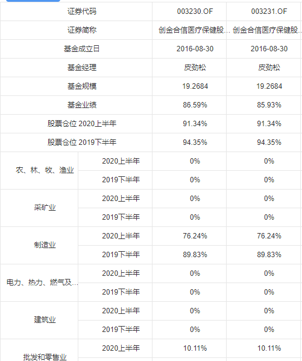

### el-uopload 上传文件以及回显文件


```
<el-upload
              :model="addForm.file"
              action="#"
              ref="adduploadRef"
              :file-list="fileList"
              class="upload-demo"
              :on-preview="handlePreview"
              :on-remove="handleRemove"
              :before-remove="beforeRemove"
              :on-success="handleSuccess"
              :on-progress="handleProgress"
              :auto-upload="true"
              :multiple="true"
              :http-request="baseCheck"
              style="width: 300px"
            >
              <el-button size="small" type="primary">选择文件</el-button>
            </el-upload>
```

- methord

```
// 编辑回显，显示文件，只用给个名字。
edit(row) {

      this.editForm.file = [];
      if (row.fileName) {
        this.fileList = [];
        this.fileList.push({
          name: row.fileName,
          url: ""
        });
      }
      console.log("this.fileList", this.fileList);

    },
// 移除文件
 handleRemove(file, fileList) {
      this.fileList = [];
      this.addForm.fileName = null;
      this.editForm.fileName = null;
    },
// 只上传一个文件
handleSuccess(res, file, fileList) {
      this.addForm.fileName = true;
      this.editForm.fileName = true;
      console.log("success");
      if (fileList.length > 1) {
        fileList.splice(0, 1);
      }
      this.fileList = fileList;
    },
// 编辑保存
// 编辑保存
    editSave(resolve, reject) {
      var that = this;
      let form = new FormData();
      if (this.fileList[0] && this.fileList[0]["raw"]) {
        form.append("file", this.fileList[0]["raw"]);
      }
      // 将前端得到的大小也传递给后端，用于验证
      // form.append("size", "999");
      // 将业务组件传递的可以接收的文件类型也传递到后端，用于验证，验证时以此基础
      // let suffixes = "";
      form.append("fundCode", this.editForm.fundCode);
      form.append("reportName", this.editForm.reportName);
      form.append("reportType", this.editForm.reportType);
      form.append("uploadDate", this.editForm.uploadDate);
      form.append("uploadUser", this.editForm.uploadUser);
      form.append("guid", this.editForm.guid);
      console.log("form", form);
      // form.append("suffixes", suffixes ? suffixes.replace(/\./g, "") : "");
      this.$refs.editFormRef.validate(valid => {
        if (valid) {
          this.$http
            .post("/fof/api/fund/report/update", form)
            .then(result => {
              console.log("111成功");
              this.$refs.edituploadRef.submit();
              if (result.data) {
                that.onQuery();
                this.saveOrEditFormEdit.isShow = false;
                // reject();
              }
            })
            .catch(result => {
              this.saveOrEditForm.isShow = false;
              this.$message.error("保存失败");
              // reject();
            });
        } else {
          // reject();
          this.saveOrEditForm.isShow = false;
        }
        // this.$refs.editFormRef.resetFields();
      });
    },
```

### 合并单元格



```
<el-table
                    border
                    :span-method="objectSpanMethodOne"
                    :data="tableOneData"
                    ref="tableOne"
                  >
                    <el-table-column
                      showOverflowTooltip
                      prop="0"
                      align="center"
                    ></el-table-column>
                    <el-table-column
                      showOverflowTooltip
                      prop="1"
                      align="center"
                    ></el-table-column>
                    <el-table-column
                      showOverflowTooltip
                      prop="2"
                      align="center"
                    ></el-table-column>
                    <el-table-column
                      showOverflowTooltip
                      prop="3"
                      align="center"
                    ></el-table-column>
                    <el-table-column
                      showOverflowTooltip
                      prop="4"
                      align="center"
                    ></el-table-column>
                    <el-table-column
                      showOverflowTooltip
                      prop="5"
                      align="center"
                    ></el-table-column>
                    <el-table-column
                      showOverflowTooltip
                      prop="6"
                      align="center"
                    ></el-table-column>
                    <el-table-column
                      showOverflowTooltip
                      prop="7"
                      align="center"
                    ></el-table-column>
                    <el-table-column
                      showOverflowTooltip
                      prop="8"
                      align="center"
                    ></el-table-column>
                    <el-table-column
                      showOverflowTooltip
                      prop="9"
                      align="center"
                    ></el-table-column>
                    <el-table-column
                      showOverflowTooltip
                      prop="10"
                      align="center"
                    ></el-table-column>
                    <el-table-column
                      showOverflowTooltip
                      prop="11"
                      align="center"
                    ></el-table-column>
                  </el-table>

  objectSpanMethodOne({ row, column, rowIndex, columnIndex }) {
      // 偶数行号 合并行
      if (rowIndex <= 7) {
        //第一列
        if (columnIndex === 0) {
          return [1, 2];
        } else if (columnIndex === 1) {
          return [0, 0];
        }
      } else if (rowIndex > 7) {
        if (columnIndex === 0) {
          //偶数行号
          if (rowIndex % 2 === 0 && rowIndex > 7) {
            // 列数合并
            return {
              rowspan: 2,
              colspan: 1
            };
          } else {
            return {
              rowspan: 0,
              colspan: 1
            };
          }
        }
      }
    },
```

### el-upoad 以及base64图片回显。以及校验与否

```
 <el-form-item :rules="this.companyBasicInfo.materialList == '1' ? rules.materialList : [{required: false}]" :label="$t('enterprise.M')" prop="materialList">
              
                <el-upload
                  :headers="headers"
                  :action="action"
                  :file-list="companyBasicInfo.materialList"
                  list-type="picture-card"
                  :before-upload="beforeUpload" :on-success="addDialogSuccessUpload" :on-remove="handleRemove">
                    <i slot="default" class="el-icon-plus"></i>
                    <div slot="file" slot-scope="{file}">
                      
                      <span class="el-upload-list__item-actions">
                        <span
                          class="el-upload-list__item-preview"
                          @click="handlePictureCardPreview(file)"
                        >
                          <i class="el-icon-zoom-in"></i>
                        </span>
                        <span
                          v-if="!typeDisabled"
                          class="el-upload-list__item-delete"
                          @click="handleDownload(file)"
                        >
                          <!-- <i class="el-icon-download"></i> -->
                        </span>
                        <span
                          v-if="!typeDisabled"
                          class="el-upload-list__item-delete"
                          @click="handleRemove(file)"
                        >
                          <i class="el-icon-delete"></i>
                        </span>
                      </span>
                    </div>
                </el-upload>
                
              </el-form-item>

```

```
data
headers: {Authorization: getToken()},
//跨域导致前缀被改。
 action: location.origin + '/api/ship/uploadFile', // 上传接口地址

```
```
js
headers: {Authorization: getToken()},

 // 上传文件前文件的校验
    beforeUpload (file) {
      const suffixName = file.name.substring(file.name.lastIndexOf('.') + 1)
      const isLimit = file.size/1024  < 5*1024
      if (suffixName !== 'jpg' && suffixName !== 'png' && suffixName !== 'jpeg' && suffixName !== 'pdf') {
      // if (suffixName !== 'png') {
        this.$message.error('支持上传png文件')
        return false
      }
      if (!isLimit) {
        this.$message.error('单个文件大小不能超过5M')
        return false
      }
      return true
    },

    // 上传成功回调的钩子
    // docDownloadUrlBase 如果没有base64还是显示docDownloadUrlBase： file.url,
    addDialogSuccessUpload (response, file, fileList) {
 
      console.log("response", response)
      console.log("file", file)
      let fileObj = {
        docName: file.name,
        docDownloadUrl: file.response.path,
        id:'',
        docDownloadUrlBase: file.url,
      }
      this.companyBasicInfo.materialList.push(fileObj)
    },

     // 上传失败回调的钩子
    addDialogErrorUpload () {
      this.$message({
        message: '上传失败请重试！',
        type: 'error'
      })
    },
    handleRemove (file, fileList) {
      this.companyBasicInfo.materialList = []
    },

// 外面传进来的图片数据，后台坑我，还让我自己转
  //回显图片数据要重新调用接口一个一个图片获取地址
          let promises = []
          if(editInfo.data.materialList && editInfo.data.materialList.length>0){

            editInfo.data.materialList.map(async item => {
            
              let proRes = await downloadImg({imageUrl:item.docDownloadUrl});
              if(proRes && proRes.code == '0000'){
                console.log("proRes",proRes.data)
                promises.push({id:'',docName:item.docName,docDownloadUrl:proRes.data.imageUrl,docDownloadUrlBase:proRes.data.base64})
              }
  
            });
          }
          this.$refs.companyInfo.companyBasicInfo.materialList = promises
    // 预览
    handlePictureCardPreview(file) {
      this.dialogImageUrl = file.docDownloadUrlBase;
      this.dialogVisible = true;
    },
```

```

// 回显弹窗

 <el-dialog
      class="viewImg"
      :before-close="closeDialog"
      :visible.sync="dialogVisible"
      append-to-body
      :close-on-click-modal="false"
      :close-on-press-escape="false"
    >
    <div>
      
    </div>
    <span slot="footer" class="dialog-footer">
      <el-button
        type="primary"
        style="background-color:#3a5ee8;width: 90px;height:34px;line-height:11px"
        @click="closeDialog"
        >确 定</el-button
      >
    </span>
    </el-dialog>
```