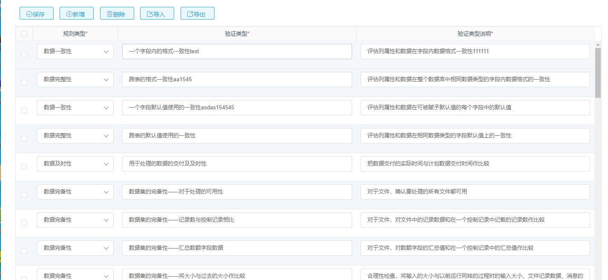

```

<template>
  <div class="scrollerY blank-container">
    <div class="table-header" style="margin-left: 15px;margin-bottom: 5px">
      <button type="button"  @click="saveTable()" class="el-button el-button--primary el-button--small is-plain">
        <i class="iconfont icon-duihao"></i><span>保存</span>
      </button>
      <button type="button"  @click="addTable()" class="el-button el-button--primary el-button--small is-plain">
        <i class="iconfont icon-add"></i><span>新增</span>
      </button>
      <button type="button"  @click="delTable()" class="el-button el-button--primary el-button--small is-plain">
        <i class="iconfont icon-shanchu"></i><span>删除</span>
      </button>
      <el-button type="button"  @click="impButton" class="el-button el-button--primary el-button--small is-plain">
        <i class="iconfont icon-daoru"></i><span>导入</span>
      </el-button>
      <button type="button"  @click="exportExcel()" class="el-button el-button--primary el-button--small is-plain">
        <i class="iconfont icon-daochu"></i><span>导出</span>
      </button>
    </div>
    <el-form :model="tableForm" ref="xnTableForm">
      <xn-table :data="tableForm.tableData" ref="xnTable" :showPagination="false" class="dynamicStyle">
        <xn-col prop="id" type="selection" width="40" />
        <xn-col
          prop="ruleType"
          label="规则类型"
          showOverflowTooltip
          width="200"
          label-class-name="must"
          header-row-class-name="must"
        >
          <template slot-scope="scope">
            <el-form-item
              :prop="'tableData.'+ scope.$index + '.ruleType'"
              :rules="tableRules.ruleType"
            >
              <el-select v-model="scope.row.ruleType" width="100%" placeholder="请选择" @change='rowChange(scope.row)'>
                <el-option
                  v-for="item in ruleTypeSelect"
                  :key="item.enumCode"
                  :label="item.enumName"
                  :value="item.enumCode"
                ></el-option>
              </el-select>
            </el-form-item>
          </template>
        </xn-col>
        <xn-col label="验证类型" align="center" showOverflowTooltip header-row-class-name="must" label-class-name="must">
          <template slot-scope="scope">
            <el-form-item
              :prop="'tableData.'+ scope.$index + '.verifyClass'"
              :rules="tableRules.verifyClass"
            >
              <el-input maxlength="100" v-model="scope.row.verifyClass" placeholder="请输入内容" @change='rowChange(scope.row)'></el-input>
            </el-form-item>
          </template>
        </xn-col>
        <xn-col label="验证类型说明" align="center" showOverflowTooltip label-class-name="must" header-row-class-name="must">
          <template slot-scope="scope">
            <el-form-item
              :prop="'tableData.'+ scope.$index + '.verifyClassDesc'"
              :rules="tableRules.verifyClassDesc"
            >
              <el-input maxlength="100" v-model="scope.row.verifyClassDesc" placeholder="请输入内容" @change='rowChange(scope.row)'></el-input>
            </el-form-item>
          </template>
        </xn-col>
      </xn-table>
    </el-form>
    <!--导入弹窗-->

    <xn-dialog :title="importDialogInfo.title" width="500px" height="65px" ref="importDialogRef" :show.sync="dialogShow.impShow"
               :buttons="importbuttons"
               @importrButton="impThis" @cancelButton="cancelImport">
      <span slot="dialog-form">
        <div style="display: flex;align-items: center">
          <label class="el-form-item__label" style="width:150px;margin-right: 3px;white-space: nowrap">上传文件</label>
          <el-upload ref="uploadRef"
                     class="upload-demo"
                     action="/devops/api/dataQuality/verifyClass/imp"
                     :on-preview="handlePreview"
                     :on-success="handleSuccess"
                     :on-remove="handleRemove"
                     :on-progress="handleProgress"
                     :file-list="fileList"
                     :auto-upload="false"
                     :multiple="true"
                     :http-request="baseCheck"
                     style="width: 300px"
                      :v-if="dialogShow.impShow">
            <el-button size="small" type="primary">选择文件</el-button>
          </el-upload>
               <label  @click="downTemplate()" style="width: 50px;margin-right: 100px;color: #3687AC;margin-left: 10px;white-space: nowrap">下载模板</label>
        </div>
      <span style="color: red;margin-left: 100px">提示：只允许上传xlsx、xls文件</span>
      </span>

    </xn-dialog>
   <!-- <xn-dialog :title="importDialogInfo.title" width="500px" height="65px" ref="editDialogRef" :show.sync="dialogShow.impShow"
               :buttons="importbuttons"
               @importrButton="impThis" @cancelButton="cancelImport">
      <span slot="dialog-form">
        <div style="display: flex;align-items: center">
          <label class="el-form-item__label" style="width: 120px;margin-right: 3px;white-space: nowrap">上传文件</label>
          <el-upload class="upload-demo inline-block margin-right-10"
                     name="file"
                     ref="uploadRef"
                     :file-list="fileList"
                     :on-error="uploadFalse"
                     style="width: 300px" :on-success="handleSuccess" :auto-upload="false" :limit="1" >
               <el-button slot="trigger" size="small" type="primary">选取文件</el-button>
          </el-upload>
               <label  @click="downTemplate" style="width: 120px;margin-right: 3px;color: #3687AC;margin-left: 20px;white-space: nowrap">下载模板</label>
        </div>
      <span style="color: red;margin-left: 55px">提示：只允许上传xlsx、xls文件</span>
      </span>
    </xn-dialog>-->
  </div>
</template>

<script>
import { download } from 'sinitek-util/src/utils/operation'

export default {

  name: 'dataQualityClassifyRules',
  data () {
    return {
      ruleType: '',
      ruleTypeSelect: [],
      tableForm: {
        tableData: []
      },
      importDialogInfo: {
        title: '导入设置'
      },
      dialogShow: {
        // 到粗弹窗
        impShow: false,
        impUplodaShow: false
      },
      fileList: [],
      importbuttons: [
        {label: '导入', action: 'imports', type: 'primary', showLoading: false, event: 'importrButton'},
        {action: 'cancel', type: 'info', showLoading: false, event: 'cancelButton'}
      ],
      tableRules: {
        ruleType: [{ required: true, message: '规则类型不能为空', trigger: 'change'}],
        verifyClass: [
          { required: true, message: '验证类型不能为空', trigger: 'blur'},
          { min: 1, max: 100, message: '长度在100个字符以内', trigger: 'blur' }
        ],
        verifyClassDesc: [
          { required: true, message: '验证类型说明不能为空', trigger: 'blur'},
          { max: 600, message: '长度在600个字符以内', trigger: 'blur' }
        ]
      }
    }
  },
  created () {
    this.getRuleType()
    this.queryVerifyClass()
  },
  watch: {
    'tableForm.tableData': {
      handler (newObj, oldObj) {
      },
      deep: true
    }
  },
  computed: {
    must (obj) {
      if (
        obj.columnIndex === 0 ||
        obj.columnIndex === 1 ||
        obj.columnIndex === 2
      ) {
        return 'must'
      }
    }
  },
  methods: {
    saveTable () {
      let selectParam = this.$refs.xnTable.multipleSelection
      if (selectParam.length == 0) {
        this.$message.warning('请选择行')
        return
      }

      let xnform = this.$refs.xnTableForm
      xnform.clearValidate()

      let flag = true
      $(this.$refs.xnTable.multipleSelection).each(function (index, obj) {
        for (let key in obj) {
          xnform.validateField('tableData.' + obj.selectIndex + '.' + key, er => {
            if (er) {
              flag = false
            }
          })
        }
      })

      if (flag) {
        this.$http
          .post(
            '/devops/api/dataQuality/verifyClass/saveVerifyClass',
            selectParam
          )
          .then(result => {
            if (result.data['message'] === 'ok') {
              this.$message.success('保存成功')
              this.addSelectId(result.data['list'])
            } else {
              this.$message.error(result.data['message'])
            }
          })
          .catch(() => {
            this.$message.error('保存失败')
          })
      }
    },
    addTable () {
      let newTableRow = {
        id: '',
        // ruleType: "01",
        ruleType: '',
        verifyClass: '',
        verifyClassDesc: ''
      }
      this.tableForm.tableData.push(newTableRow)
      this.$refs.xnTable.$refs.table.toggleRowSelection(newTableRow, true)
      let _this = document.getElementsByClassName('el-table__body-wrapper')
      debugger
      setTimeout(() => {
        _this[0].scrollTop = _this[0].scrollHeight
      }, 100)
    },
    delTable () {
      let _this = this
      let sss = this.$refs.xnTable.multipleSelection
      if (sss.length === 0) {
        this.$message.warning('请选择行!')
      } else {
        this.$confirm('是否确认要删除 ').then(() => {
          var checkBoxData = []
          if (sss.length === 0) {
            this.$message.warning('请选择行!')
          } else {
            for (let i = 0; i < sss.length; i++) {
              checkBoxData.push({ id: sss[i].id })
            }
          }
          this.$http
            .post(
              '/devops/api/dataQuality/verifyClass/deleteVerifyClass',
              checkBoxData
            )
            .then(
              result => {
                if (!result.data) {
                  this.$message.success('删除成功!')
                  this.clearSelected()
                }
              },
              result => {
                this.$message.error('删除失败!')
              }
            )
        })
      }
    },
    getRuleType () {
      this.$http
        .post('/devops/api/comm/sysenum/queryEnumByType?enumType=RULE_TYPE')
        .then(result => {
          this.ruleTypeSelect = result.data
        })
        .catch(() => {
          this.$message.error('查询规则类型枚举失败')
        })
    },
    queryVerifyClass () {
      this.tableForm.tableData.length = 0
      this.$http
        .get('/devops/api/dataQuality/verifyClass/queryVerifyClass')
        .then(result => {
          for (let i = 0; i < result.data.datalist.length; i++) {
            this.tableForm.tableData.push(result.data.datalist[i])
          }
        })
        .catch(() => {
          this.$message.error('查询规则分类失败')
        })
    },
    addSelectId (param) {
      this.$refs.xnTable.$refs.table.clearSelection()
      let _this = this
      for (let i = 0; i < param.length; i++) {
        let index = param[i].index
        _this.$refs.xnTable.data[index].id = param[i].id
      }
    },
    clearSelected () {
      let _this = this
      let selected = this.$refs.xnTable.multipleSelection
      for (let i = selected.length; i > 0; i--) {
        let selectIndex = selected[i - 1].selectIndex
        _this.tableForm.tableData.splice(selectIndex, 1)
      }
      this.$refs.xnTableForm.clearValidate()
    },
    rowChange (row) {
      this.$refs.xnTable.$refs.table.toggleRowSelection(row, true)
    },
    impButton () {
      this.dialogShow.impShow = true
    },

    /*  -----------------------/导入导出相关方法/----------------------------------- */
    impThis () {
      debugger
      this.$refs.uploadRef.submit()
      if (this.fileList.length > 0) {
        if (this.fileList[0]['raw']['size'] > 1024 * 1024 * 20) {
          this.$message.error('文件大小不能超过20M')
          this.fileList = []
          this.$refs.uploadRef.clearFiles()

          return
        }
        if (!(this.fileList[0]['raw']['name'].toLocaleLowerCase().endsWith('xls') || this.fileList[0]['raw']['name'].toLocaleLowerCase().endsWith('xlsx'))) {
          this.$message.error('文件格式错误！ 文件格式应以.xls或.xlsx结尾！')
          this.fileList = []
          this.$refs.uploadRef.clearFiles()

          return
        }
        let form = new FormData()
        form.append('file', this.fileList[0]['raw'])
        // 将前端得到的大小也传递给后端，用于验证
        form.append('size', '999')
        // 将业务组件传递的可以接收的文件类型也传递到后端，用于验证，验证时以此基础
        let suffixes = ''
        form.append('suffixes', suffixes ? suffixes.replace(/\./g, '') : '')
        this.$http.post('/devops/api/dataQuality/verifyClass/imp', form).then(result => {
          if (result.data['data'] === 'ok') {
            this.$message.success('导入成功')
            this.dialogShow.impShow = false
            this.fileList = []
            this.$refs.uploadRef.clearFiles()

            this.queryVerifyClass()
          } else if (result.data['data'] === 'error') {
            this.$message.error(result.data['message'])
            this.$refs.uploadRef.clearFiles()
          } else {
            this.$message.warning(result.data['message'])
            this.fileList = []
            this.$refs.uploadRef.clearFiles()
          }
        }).catch(() => {
          this.$message.error('上传失败')
          this.fileList = []
          this.$refs.uploadRef.clearFiles()
        })
      } else {
        this.$message.error('请选择文件')
      }
    },
    cancelImport () {
      this.$refs.uploadRef.clearFiles()
      this.dialogShow.impShow = false
    },
    handleRemove (file, fileList) {
      this.fileList = []
    },
    handlePreview (file) {
      console.log(file)
      console.log(this.fileList)
    },
    handleSuccess (res, file, fileList) {
      let len = this.fileList.length
      if (len === 1) {
        this.fileList = []
      }
      this.fileList.push(file)
    },
    handleProgress (event, file) {
      console.log('2')
      console.log(event)
      console.log(file)
    },
    baseCheck (param) {
      param.onSuccess({id: 'cc'})
    },
    exportExcel () {
      let row = this.$refs.xnTable.multipleSelection
      let url = '/devops/api/dataQuality/verifyClass/exportExcel'
      let name = '_blank'
      console.log(row)
      if (row.length === 0) {
        this.$message.warning('请选择行')
      } else {
        this.openPostWindow(url, row, name)
        this.$refs.xnTable.clearable()
      }
    },
    openPostWindow (url, row, name) {
      download('/devops/api/dataQuality/verifyClass/exportExcel?exportStr=' + JSON.stringify(row))
    },
    downTemplate (resolve, reject) {
      window.open('static/验证关系导入模板.xls')
    },
    uploadFalse (response, file, fileList) {
      this.$refs.upload.clearFiles()
      this.$message.error('文件上传失败')
    }
  }
}
</script>

<style scoped>
.el-form-item__content {
  display: flex;
}
.el-select {
  flex: 1;
}
tbody .el-checkbox {
  margin-bottom: 10px !important;
}
.blank-container >>> .el-form .el-table th.must div:after {
  content: "*"!important;
  color: #ff1818!important;
}
.blank-container > .el-form .el-table th.must {
  background-color: #ff1818;
}

</style>

```
